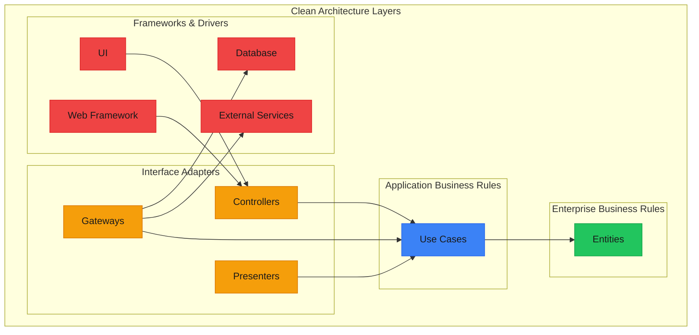
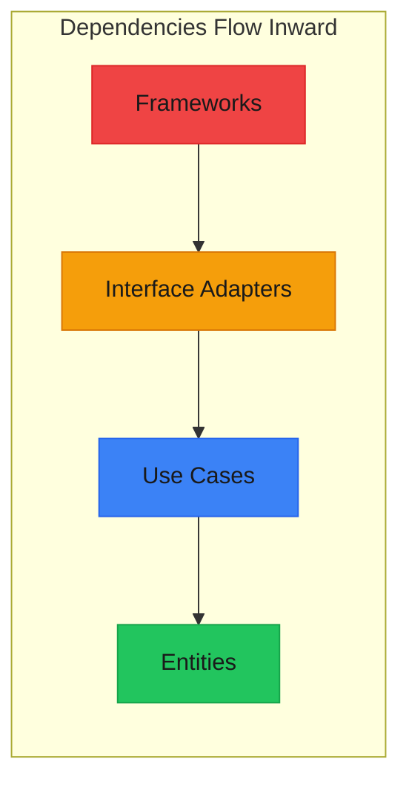
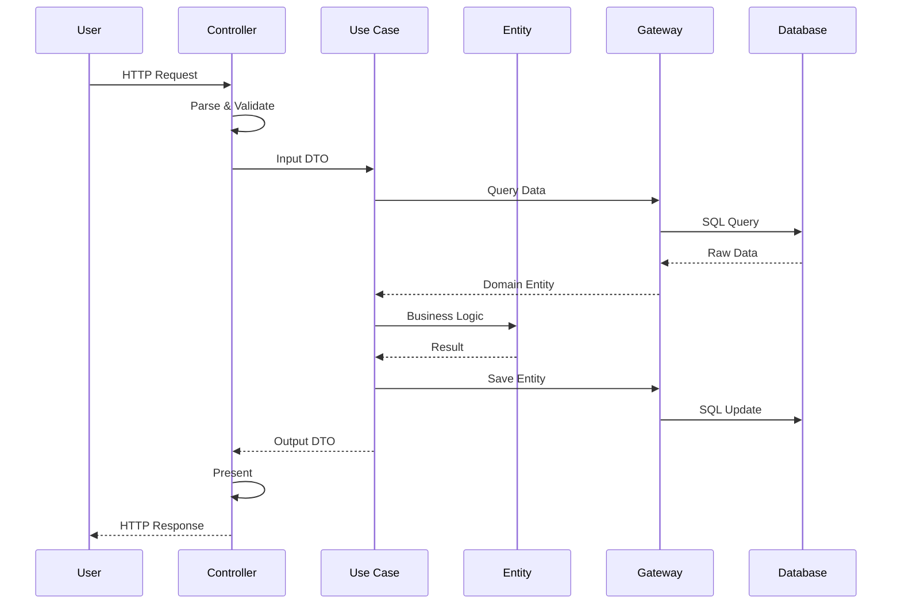
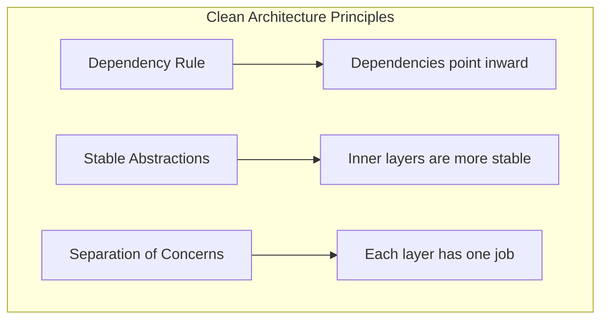

import { File, Files, Folder } from "fumadocs-ui/components/files";

# Clean Architecture

**Clean Architecture** was introduced by Robert C. Martin (Uncle Bob) in 2012. It combines ideas from Hexagonal Architecture, Onion Architecture, and others into a cohesive approach focused on one principle: **The Dependency Rule**.



---

## The Dependency Rule

> **"Source code dependencies must point only inward, toward higher-level policies."**

This is the most important rule of Clean Architecture. Inner layers should never know about outer layers.



**What this means:**
- Entities don't know about Use Cases
- Use Cases don't know about Controllers
- Controllers don't know about the Web Framework
- Changes in outer layers don't affect inner layers

---

## The Four Layers

### 1. Entities (Enterprise Business Rules)

The innermost layer contains enterprise-wide business rules. These are the most general and high-level rules that would exist even if there was no software.

```typescript
/**
 * Entities - Enterprise Business Rules
 * Pure domain objects with critical business rules
 */

// Value Objects
interface Money {
  readonly amount: number;
  readonly currency: "USD" | "EUR" | "GBP";
}

const createMoney = (amount: number, currency: Money["currency"]): Money => {
  if (amount < 0) throw new Error("Amount cannot be negative");
  return { amount: Math.round(amount * 100) / 100, currency };
};

const addMoney = (a: Money, b: Money): Money => {
  if (a.currency !== b.currency) throw new Error("Currency mismatch");
  return createMoney(a.amount + b.amount, a.currency);
};

// Entity
interface Order {
  readonly id: string;
  readonly customerId: string;
  readonly items: OrderItem[];
  readonly status: OrderStatus;
  readonly createdAt: Date;
  
  // Business rules
  addItem: (product: Product, quantity: number) => void;
  removeItem: (productId: string) => void;
  calculateTotal: () => Money;
  canBeCancelled: () => boolean;
  cancel: () => void;
  complete: () => void;
}

interface OrderItem {
  productId: string;
  productName: string;
  price: Money;
  quantity: number;
}

interface Product {
  id: string;
  name: string;
  price: Money;
  inStock: boolean;
}

type OrderStatus = "pending" | "confirmed" | "shipped" | "delivered" | "cancelled";

const createOrder = (id: string, customerId: string): Order => {
  let items: OrderItem[] = [];
  let status: OrderStatus = "pending";
  const createdAt = new Date();
  
  return {
    get id() { return id; },
    get customerId() { return customerId; },
    get items() { return [...items]; },
    get status() { return status; },
    get createdAt() { return createdAt; },
    
    addItem(product, quantity) {
      if (!product.inStock) {
        throw new Error(`Product ${product.name} is out of stock`);
      }
      if (quantity <= 0) {
        throw new Error("Quantity must be positive");
      }
      if (status !== "pending") {
        throw new Error("Cannot modify confirmed order");
      }
      
      const existing = items.find(i => i.productId === product.id);
      if (existing) {
        existing.quantity += quantity;
      } else {
        items.push({
          productId: product.id,
          productName: product.name,
          price: product.price,
          quantity,
        });
      }
    },
    
    removeItem(productId) {
      if (status !== "pending") {
        throw new Error("Cannot modify confirmed order");
      }
      items = items.filter(i => i.productId !== productId);
    },
    
    calculateTotal() {
      return items.reduce(
        (sum, item) => addMoney(sum, createMoney(
          item.price.amount * item.quantity,
          item.price.currency
        )),
        createMoney(0, "USD")
      );
    },
    
    canBeCancelled() {
      return ["pending", "confirmed"].includes(status);
    },
    
    cancel() {
      if (!this.canBeCancelled()) {
        throw new Error("Order cannot be cancelled");
      }
      status = "cancelled";
    },
    
    complete() {
      if (status !== "shipped") {
        throw new Error("Order must be shipped before completion");
      }
      status = "delivered";
    },
  };
};
```

### 2. Use Cases (Application Business Rules)

Use cases contain application-specific business rules. They orchestrate the flow of data to and from entities.

```typescript
// Setup
interface Money { readonly amount: number; readonly currency: "USD" | "EUR" | "GBP"; }
interface OrderItem { productId: string; productName: string; price: Money; quantity: number; }
type OrderStatus = "pending" | "confirmed" | "shipped" | "delivered" | "cancelled";
interface Order { readonly id: string; readonly customerId: string; readonly items: OrderItem[]; readonly status: OrderStatus; readonly createdAt: Date; addItem: (p: any, q: number) => void; removeItem: (id: string) => void; calculateTotal: () => Money; canBeCancelled: () => boolean; cancel: () => void; complete: () => void; }
interface Product { id: string; name: string; price: Money; inStock: boolean; }
const createOrder = (id: string, customerId: string): Order => ({ id, customerId, items: [], status: "pending", createdAt: new Date(), addItem: () => {}, removeItem: () => {}, calculateTotal: () => ({ amount: 0, currency: "USD" }), canBeCancelled: () => true, cancel: () => {}, complete: () => {} });
// ---cut---
/**
 * Use Cases - Application Business Rules
 * Orchestrate domain entities to achieve application goals
 */

// --- Input/Output Boundaries ---
interface PlaceOrderInput {
  customerId: string;
  items: Array<{
    productId: string;
    quantity: number;
  }>;
}

interface PlaceOrderOutput {
  orderId: string;
  total: Money;
  estimatedDelivery: Date;
}

// --- Use Case Interface (Input Boundary) ---
interface PlaceOrderUseCase {
  execute: (input: PlaceOrderInput) => Promise<PlaceOrderOutput>;
}

// --- Output Boundary (for Presenter) ---
interface PlaceOrderPresenter {
  presentSuccess: (output: PlaceOrderOutput) => void;
  presentError: (error: Error) => void;
}

// --- Gateway Interfaces (what the use case needs) ---
interface OrderGateway {
  save: (order: Order) => Promise<void>;
  findById: (id: string) => Promise<Order | null>;
  nextId: () => string;
}

interface ProductGateway {
  findById: (id: string) => Promise<Product | null>;
  findByIds: (ids: string[]) => Promise<Product[]>;
}

interface CustomerGateway {
  exists: (id: string) => Promise<boolean>;
  getShippingDays: (customerId: string) => Promise<number>;
}

interface NotificationGateway {
  sendOrderConfirmation: (customerId: string, orderId: string) => Promise<void>;
}

// --- Use Case Implementation ---
interface PlaceOrderDeps {
  orderGateway: OrderGateway;
  productGateway: ProductGateway;
  customerGateway: CustomerGateway;
  notificationGateway: NotificationGateway;
}

const createPlaceOrderUseCase = (deps: PlaceOrderDeps): PlaceOrderUseCase => ({
  async execute(input: PlaceOrderInput): Promise<PlaceOrderOutput> {
    const { orderGateway, productGateway, customerGateway, notificationGateway } = deps;
    
    // 1. Validate customer exists
    const customerExists = await customerGateway.exists(input.customerId);
    if (!customerExists) {
      throw new Error("Customer not found");
    }
    
    // 2. Get all products
    const productIds = input.items.map(i => i.productId);
    const products = await productGateway.findByIds(productIds);
    
    // 3. Create order entity
    const orderId = orderGateway.nextId();
    const order = createOrder(orderId, input.customerId);
    
    // 4. Add items (entity validates business rules)
    for (const item of input.items) {
      const product = products.find(p => p.id === item.productId);
      if (!product) {
        throw new Error(`Product ${item.productId} not found`);
      }
      order.addItem(product, item.quantity);
    }
    
    // 5. Persist order
    await orderGateway.save(order);
    
    // 6. Send confirmation (fire and forget)
    notificationGateway.sendOrderConfirmation(input.customerId, orderId).catch(() => {
      // Log error but don't fail the use case
    });
    
    // 7. Calculate estimated delivery
    const shippingDays = await customerGateway.getShippingDays(input.customerId);
    const estimatedDelivery = new Date();
    estimatedDelivery.setDate(estimatedDelivery.getDate() + shippingDays);
    
    // 8. Return output
    return {
      orderId: order.id,
      total: order.calculateTotal(),
      estimatedDelivery,
    };
  },
});

// --- Another Use Case: Cancel Order ---
interface CancelOrderInput {
  orderId: string;
  reason: string;
}

interface CancelOrderOutput {
  success: boolean;
  refundAmount?: Money;
}

interface CancelOrderUseCase {
  execute: (input: CancelOrderInput) => Promise<CancelOrderOutput>;
}

const createCancelOrderUseCase = (deps: {
  orderGateway: OrderGateway;
  notificationGateway: NotificationGateway;
}): CancelOrderUseCase => ({
  async execute(input): Promise<CancelOrderOutput> {
    const order = await deps.orderGateway.findById(input.orderId);
    
    if (!order) {
      throw new Error("Order not found");
    }
    
    if (!order.canBeCancelled()) {
      throw new Error("Order cannot be cancelled");
    }
    
    // Entity enforces cancellation rules
    order.cancel();
    await deps.orderGateway.save(order);
    
    // Notify customer
    await deps.notificationGateway.sendOrderConfirmation(
      order.customerId,
      order.id
    );
    
    return {
      success: true,
      refundAmount: order.calculateTotal(),
    };
  },
});
```

### 3. Interface Adapters

This layer converts data between the format most convenient for use cases and entities, and the format most convenient for external agencies like databases and the web.

```typescript
// Setup
interface Money { readonly amount: number; readonly currency: "USD" | "EUR" | "GBP"; }
interface OrderItem { productId: string; productName: string; price: Money; quantity: number; }
type OrderStatus = "pending" | "confirmed" | "shipped" | "delivered" | "cancelled";
interface Order { readonly id: string; readonly customerId: string; readonly items: OrderItem[]; readonly status: OrderStatus; readonly createdAt: Date; addItem: (p: any, q: number) => void; removeItem: (id: string) => void; calculateTotal: () => Money; canBeCancelled: () => boolean; cancel: () => void; complete: () => void; }
interface PlaceOrderInput { customerId: string; items: Array<{ productId: string; quantity: number; }>; }
interface PlaceOrderOutput { orderId: string; total: Money; estimatedDelivery: Date; }
interface PlaceOrderUseCase { execute: (input: PlaceOrderInput) => Promise<PlaceOrderOutput>; }
interface CancelOrderInput { orderId: string; reason: string; }
interface CancelOrderOutput { success: boolean; refundAmount?: Money; }
interface CancelOrderUseCase { execute: (input: CancelOrderInput) => Promise<CancelOrderOutput>; }
interface OrderGateway { save: (order: Order) => Promise<void>; findById: (id: string) => Promise<Order | null>; nextId: () => string; }
// ---cut---
/**
 * Interface Adapters - Controllers, Presenters, Gateways
 */

// ==========================================
// CONTROLLERS (Input Adapters)
// ==========================================

interface HttpRequest {
  body: unknown;
  params: Record<string, string>;
  headers: Record<string, string>;
}

interface HttpResponse {
  status: number;
  body: unknown;
  headers?: Record<string, string>;
}

// Controller converts HTTP to Use Case input
const createOrderController = (deps: {
  placeOrder: PlaceOrderUseCase;
  cancelOrder: CancelOrderUseCase;
}) => ({
  async handlePlaceOrder(req: HttpRequest): Promise<HttpResponse> {
    try {
      // Parse and validate request
      const body = req.body as {
        items: Array<{ productId: string; quantity: number }>;
      };
      
      const customerId = req.headers["x-customer-id"];
      if (!customerId) {
        return {
          status: 401,
          body: { error: "Customer ID required" },
        };
      }
      
      // Convert to use case input
      const input: PlaceOrderInput = {
        customerId,
        items: body.items,
      };
      
      // Execute use case
      const output = await deps.placeOrder.execute(input);
      
      // Convert to HTTP response (using presenter)
      return {
        status: 201,
        body: presentOrderSuccess(output),
        headers: {
          "Location": `/orders/${output.orderId}`,
        },
      };
    } catch (error) {
      return presentOrderError(error as Error);
    }
  },
  
  async handleCancelOrder(req: HttpRequest): Promise<HttpResponse> {
    try {
      const orderId = req.params.id;
      const body = req.body as { reason: string };
      
      const output = await deps.cancelOrder.execute({
        orderId,
        reason: body.reason,
      });
      
      return {
        status: 200,
        body: {
          success: output.success,
          refundAmount: output.refundAmount
            ? formatMoney(output.refundAmount)
            : null,
        },
      };
    } catch (error) {
      return presentOrderError(error as Error);
    }
  },
});

// ==========================================
// PRESENTERS (Output Adapters)
// ==========================================

// Presenter converts Use Case output to view model
interface OrderViewModel {
  id: string;
  total: string;
  estimatedDelivery: string;
  message: string;
}

const formatMoney = (money: Money): string => {
  return new Intl.NumberFormat("en-US", {
    style: "currency",
    currency: money.currency,
  }).format(money.amount);
};

const presentOrderSuccess = (output: PlaceOrderOutput): OrderViewModel => ({
  id: output.orderId,
  total: formatMoney(output.total),
  estimatedDelivery: output.estimatedDelivery.toLocaleDateString("en-US", {
    weekday: "long",
    year: "numeric",
    month: "long",
    day: "numeric",
  }),
  message: "Your order has been placed successfully!",
});

const presentOrderError = (error: Error): HttpResponse => {
  const message = error.message;
  
  if (message.includes("not found")) {
    return { status: 404, body: { error: message } };
  }
  if (message.includes("out of stock")) {
    return { status: 409, body: { error: message } };
  }
  if (message.includes("cannot be cancelled")) {
    return { status: 422, body: { error: message } };
  }
  
  return { status: 400, body: { error: message } };
};

// ==========================================
// GATEWAYS (Data Adapters)
// ==========================================

// Gateway converts between entity and database format
interface OrderRow {
  id: string;
  customer_id: string;
  status: string;
  created_at: Date;
}

interface OrderItemRow {
  order_id: string;
  product_id: string;
  product_name: string;
  price_amount: number;
  price_currency: string;
  quantity: number;
}

interface Database {
  query: <T>(sql: string, params?: unknown[]) => Promise<T[]>;
  execute: (sql: string, params?: unknown[]) => Promise<void>;
}

const createSqlOrderGateway = (db: Database): OrderGateway => {
  let idCounter = 0;
  
  return {
    nextId: () => `order_${++idCounter}_${Date.now()}`,
    
    async save(order) {
      // Convert entity to database format
      await db.execute(
        `INSERT INTO orders (id, customer_id, status, created_at)
         VALUES ($1, $2, $3, $4)
         ON CONFLICT (id) DO UPDATE SET status = $3`,
        [order.id, order.customerId, order.status, order.createdAt]
      );
      
      // Save items
      await db.execute(
        `DELETE FROM order_items WHERE order_id = $1`,
        [order.id]
      );
      
      for (const item of order.items) {
        await db.execute(
          `INSERT INTO order_items 
           (order_id, product_id, product_name, price_amount, price_currency, quantity)
           VALUES ($1, $2, $3, $4, $5, $6)`,
          [
            order.id,
            item.productId,
            item.productName,
            item.price.amount,
            item.price.currency,
            item.quantity,
          ]
        );
      }
    },
    
    async findById(id) {
      const rows = await db.query<OrderRow>(
        `SELECT * FROM orders WHERE id = $1`,
        [id]
      );
      
      if (rows.length === 0) return null;
      
      const itemRows = await db.query<OrderItemRow>(
        `SELECT * FROM order_items WHERE order_id = $1`,
        [id]
      );
      
      // Convert database format to entity
      // (In real implementation, would reconstruct the Order entity)
      return null; // Simplified for example
    },
  };
};
```

### 4. Frameworks & Drivers

The outermost layer consists of frameworks and tools such as the database, web framework, UI, etc. This layer is where all the details go.

```typescript
// Setup
interface HttpRequest { body: unknown; params: Record<string, string>; headers: Record<string, string>; }
interface HttpResponse { status: number; body: unknown; headers?: Record<string, string>; }
interface OrderController { handlePlaceOrder: (req: HttpRequest) => Promise<HttpResponse>; handleCancelOrder: (req: HttpRequest) => Promise<HttpResponse>; }
// ---cut---
/**
 * Frameworks & Drivers - The outermost layer
 * All the "details" live here
 */

// ==========================================
// WEB FRAMEWORK (Express/Hono/Fastify)
// ==========================================

// This would be your actual web framework integration
const createExpressApp = (orderController: OrderController) => {
  // Simulated Express-like setup
  const routes = {
    "POST /orders": async (req: HttpRequest) => {
      return orderController.handlePlaceOrder(req);
    },
    "DELETE /orders/:id": async (req: HttpRequest) => {
      return orderController.handleCancelOrder(req);
    },
  };
  
  return {
    routes,
    listen: (port: number) => {
      console.log(`Server listening on port ${port}`);
    },
  };
};

// ==========================================
// DATABASE DRIVER
// ==========================================

interface DatabaseConfig {
  host: string;
  port: number;
  database: string;
  user: string;
  password: string;
}

const createPostgresConnection = (config: DatabaseConfig) => {
  // This would use pg, postgres, or drizzle
  return {
    async query<T>(sql: string, params?: unknown[]): Promise<T[]> {
      console.log("Executing:", sql, params);
      return [] as T[];
    },
    async execute(sql: string, params?: unknown[]): Promise<void> {
      console.log("Executing:", sql, params);
    },
    async close(): Promise<void> {
      console.log("Connection closed");
    },
  };
};

// ==========================================
// EXTERNAL SERVICES
// ==========================================

const createStripePaymentService = (apiKey: string) => ({
  async charge(amount: number, currency: string, token: string) {
    console.log(`Stripe: Charging ${amount} ${currency}`);
    return { chargeId: `ch_${Date.now()}` };
  },
  async refund(chargeId: string) {
    console.log(`Stripe: Refunding ${chargeId}`);
    return { refundId: `re_${Date.now()}` };
  },
});

const createTwilioNotificationService = (accountSid: string, authToken: string) => ({
  async sendSms(to: string, message: string) {
    console.log(`Twilio: Sending SMS to ${to}`);
  },
  async sendEmail(to: string, subject: string, body: string) {
    console.log(`Twilio: Sending email to ${to}`);
  },
});

// ==========================================
// COMPOSITION ROOT
// ==========================================

interface AppConfig {
  port: number;
  database: DatabaseConfig;
  stripe: { apiKey: string };
  twilio: { accountSid: string; authToken: string };
}

const createApp = async (config: AppConfig) => {
  // 1. Create framework/driver instances
  const db = createPostgresConnection(config.database);
  const stripe = createStripePaymentService(config.stripe.apiKey);
  const twilio = createTwilioNotificationService(
    config.twilio.accountSid,
    config.twilio.authToken
  );
  
  // 2. Create gateways (interface adapters)
  // const orderGateway = createSqlOrderGateway(db);
  // const productGateway = createSqlProductGateway(db);
  // const notificationGateway = createTwilioNotificationGateway(twilio);
  
  // 3. Create use cases
  // const placeOrder = createPlaceOrderUseCase({ ... });
  // const cancelOrder = createCancelOrderUseCase({ ... });
  
  // 4. Create controllers
  // const orderController = createOrderController({ placeOrder, cancelOrder });
  
  // 5. Create and start web server
  // const app = createExpressApp(orderController);
  // app.listen(config.port);
  
  console.log("Application started");
  
  return {
    stop: async () => {
      await db.close();
      console.log("Application stopped");
    },
  };
};
```

---

## Project Structure

<Files>
  <Folder name="src" defaultOpen>
    <Folder name="domain" defaultOpen>
      <Folder name="entities">
        <File name="Order.ts" />
        <File name="Customer.ts" />
        <File name="Product.ts" />
      </Folder>
      <Folder name="value-objects">
        <File name="Money.ts" />
        <File name="Email.ts" />
        <File name="OrderId.ts" />
      </Folder>
      <Folder name="services">
        <File name="PricingService.ts" />
      </Folder>
      <Folder name="events">
        <File name="OrderPlaced.ts" />
        <File name="OrderCancelled.ts" />
      </Folder>
    </Folder>
    <Folder name="application" defaultOpen>
      <Folder name="use-cases">
        <File name="PlaceOrderUseCase.ts" />
        <File name="CancelOrderUseCase.ts" />
        <File name="GetOrderUseCase.ts" />
      </Folder>
      <Folder name="boundaries">
        <Folder name="input">
          <File name="PlaceOrderInput.ts" />
          <File name="CancelOrderInput.ts" />
        </Folder>
        <Folder name="output">
          <File name="OrderGateway.ts" />
          <File name="NotificationGateway.ts" />
        </Folder>
      </Folder>
      <Folder name="dto">
        <File name="OrderDTO.ts" />
      </Folder>
    </Folder>
    <Folder name="interface-adapters" defaultOpen>
      <Folder name="controllers">
        <File name="OrderController.ts" />
        <File name="CustomerController.ts" />
      </Folder>
      <Folder name="presenters">
        <File name="OrderPresenter.ts" />
        <File name="JsonPresenter.ts" />
      </Folder>
      <Folder name="gateways">
        <File name="SqlOrderGateway.ts" />
        <File name="InMemoryOrderGateway.ts" />
        <File name="TwilioNotificationGateway.ts" />
      </Folder>
    </Folder>
    <Folder name="frameworks-drivers" defaultOpen>
      <Folder name="web">
        <Folder name="express">
          <File name="app.ts" />
          <File name="routes.ts" />
        </Folder>
        <Folder name="middleware">
          <File name="auth.ts" />
        </Folder>
      </Folder>
      <Folder name="database">
        <Folder name="postgres">
          <File name="connection.ts" />
          <Folder name="migrations" />
        </Folder>
        <Folder name="redis">
          <File name="cache.ts" />
        </Folder>
      </Folder>
      <Folder name="external">
        <Folder name="stripe" />
        <Folder name="twilio" />
      </Folder>
    </Folder>
    <Folder name="main">
      <File name="config.ts" />
      <File name="container.ts" />
      <File name="app.ts" />
    </Folder>
  </Folder>
</Files>

---

## The Screaming Architecture

Uncle Bob advocates for **Screaming Architecture** - your folder structure should scream the intent of the application, not the frameworks used.

**❌ Framework-Focused Structure:**

<Files>
  <Folder name="src" defaultOpen>
    <Folder name="controllers" />
    <Folder name="models" />
    <Folder name="views" />
    <Folder name="services" />
    <Folder name="repositories" />
  </Folder>
</Files>

**✅ Domain-Focused Structure (Screaming):**

<Files>
  <Folder name="src" defaultOpen>
    <Folder name="orders" defaultOpen>
      <Folder name="domain" />
      <Folder name="use-cases" />
      <Folder name="adapters" />
    </Folder>
    <Folder name="customers" defaultOpen>
      <Folder name="domain" />
      <Folder name="use-cases" />
      <Folder name="adapters" />
    </Folder>
    <Folder name="products" defaultOpen>
      <Folder name="domain" />
      <Folder name="use-cases" />
      <Folder name="adapters" />
    </Folder>
  </Folder>
</Files>

---

## Data Flow



---

## Clean Architecture vs Hexagonal

| Aspect | Clean Architecture | Hexagonal Architecture |
|--------|-------------------|----------------------|
| Layers | 4 concentric circles | 3 zones (hexagon, ports, adapters) |
| Focus | Dependency rule | Ports and adapters |
| Entities | Separate layer | Part of domain |
| Presenters | Explicit layer | Part of adapters |
| Origin | Robert C. Martin (2012) | Alistair Cockburn (2005) |

Both architectures share the same core principle: **dependencies point inward**.

---

## Benefits

<Accordions>
  <Accordion title="Independent of Frameworks">
    The architecture doesn't depend on the existence of any library. Frameworks are tools, not constraints.
    
    ```ts
    // Use cases don't care about Express, Fastify, or Hono
    const placeOrder = createPlaceOrderUseCase({ ...gateways });
    
    // Works with any web framework
    expressApp.post("/orders", async (req, res) => {
      const result = await placeOrder.execute(req.body);
      res.json(result);
    });
    ```
  </Accordion>
  
  <Accordion title="Testable">
    Business rules can be tested without UI, database, web server, or any external element.
    
    ```ts
    // Test use case with mock gateways
    const mockOrderGateway = createInMemoryOrderGateway();
    const useCase = createPlaceOrderUseCase({
      orderGateway: mockOrderGateway,
      // ... other mocks
    });
    
    const result = await useCase.execute({ ... });
    expect(result.orderId).toBeDefined();
    ```
  </Accordion>
  
  <Accordion title="Independent of UI">
    The UI can change without changing the rest of the system. A web UI could be replaced with a console UI, without changing the business rules.
  </Accordion>
  
  <Accordion title="Independent of Database">
    You can swap Oracle for MongoDB, PostgreSQL for DynamoDB. Your business rules are not bound to the database.
    
    ```ts
    // Development
    const gateway = createInMemoryOrderGateway();
    
    // Production
    const gateway = createPostgresOrderGateway(db);
    
    // Same use case works with both
    const useCase = createPlaceOrderUseCase({ orderGateway: gateway });
    ```
  </Accordion>
  
  <Accordion title="Independent of External Agencies">
    Your business rules don't know anything about the outside world.
  </Accordion>
</Accordions>

---

## Summary



**Key Takeaways:**
1. **Dependencies point inward** - The Dependency Rule is paramount
2. **Entities are pure** - No framework dependencies
3. **Use cases orchestrate** - Application-specific logic
4. **Adapters convert** - Between formats and protocols
5. **Frameworks are details** - Easy to swap
6. **Test from the inside out** - Start with entities, end with integration
