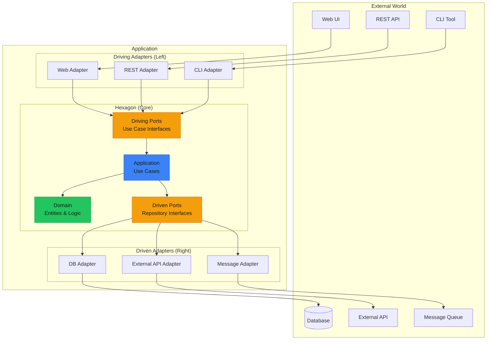
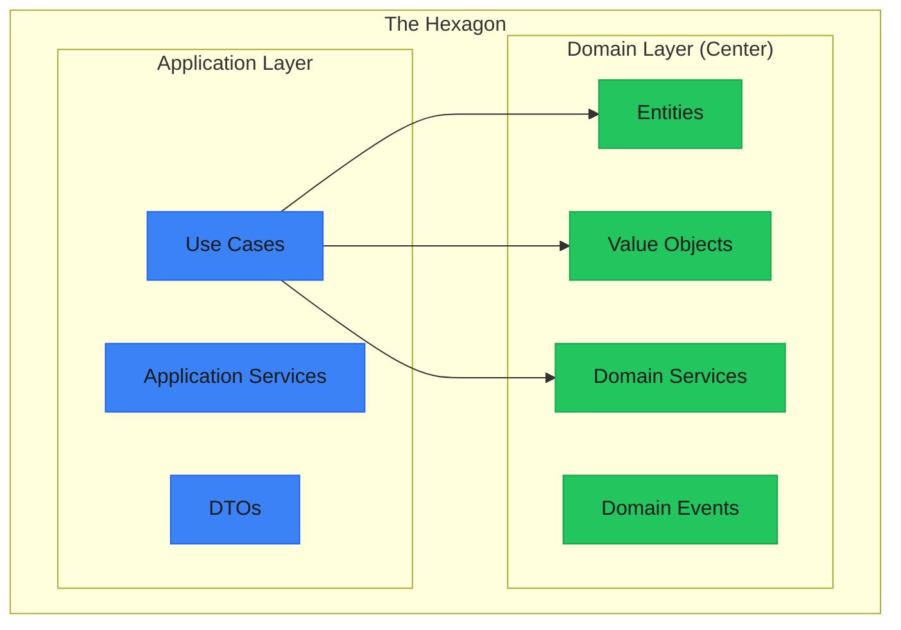
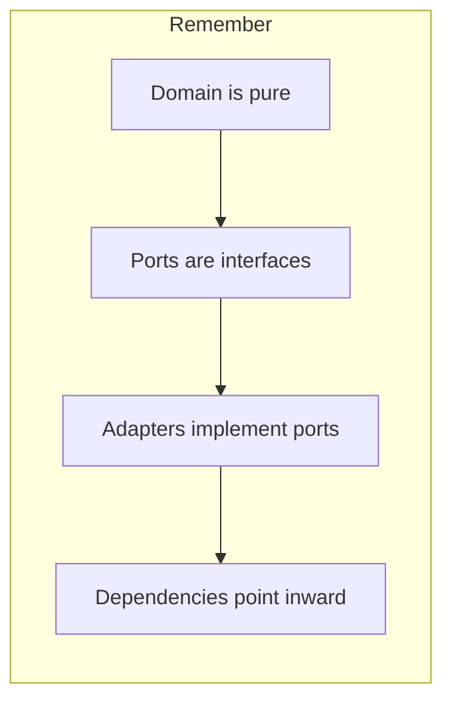

import { File, Files, Folder } from "fumadocs-ui/components/files";
import { Tab, Tabs } from "fumadocs-ui/components/tabs";

# Hexagonal Architecture

**Hexagonal Architecture** (also known as **Ports and Adapters**) was introduced by Alistair Cockburn in 2005. It isolates the application's core logic from external concerns like databases, UIs, and third-party services.



---

## Core Concepts

### The Hexagon

The hexagon represents your application core - the business logic that would exist even without any UI or database.



### Ports

**Ports** are interfaces that define how the application interacts with the outside world.

| Port Type | Direction | Purpose | Example |
|-----------|-----------|---------|---------|
| **Driving (Primary)** | Inbound | How the world uses the app | `CreateUserUseCase` |
| **Driven (Secondary)** | Outbound | How the app uses the world | `UserRepository` |

### Adapters

**Adapters** implement ports to connect the hexagon to external systems.

| Adapter Type | Direction | Purpose | Example |
|--------------|-----------|---------|---------|
| **Driving (Left)** | Inbound | Handle external requests | REST Controller, CLI |
| **Driven (Right)** | Outbound | Access external resources | PostgreSQL Repository |

---

## Project Structure

<Files>
  <Folder name="src" defaultOpen>
    <Folder name="domain" defaultOpen>
      <Folder name="entities">
        <File name="User.ts" />
        <File name="Order.ts" />
      </Folder>
      <Folder name="value-objects">
        <File name="Email.ts" />
        <File name="Money.ts" />
        <File name="UserId.ts" />
      </Folder>
      <Folder name="services">
        <File name="PricingService.ts" />
      </Folder>
      <Folder name="events">
        <File name="UserCreated.ts" />
        <File name="OrderPlaced.ts" />
      </Folder>
      <Folder name="errors">
        <File name="DomainError.ts" />
      </Folder>
    </Folder>
    <Folder name="application" defaultOpen>
      <Folder name="ports">
        <Folder name="driving">
          <File name="CreateUserPort.ts" />
          <File name="GetUserPort.ts" />
          <File name="PlaceOrderPort.ts" />
        </Folder>
        <Folder name="driven">
          <File name="UserRepositoryPort.ts" />
          <File name="OrderRepositoryPort.ts" />
          <File name="PaymentGatewayPort.ts" />
          <File name="EmailServicePort.ts" />
        </Folder>
      </Folder>
      <Folder name="use-cases">
        <File name="CreateUserUseCase.ts" />
        <File name="GetUserUseCase.ts" />
        <File name="PlaceOrderUseCase.ts" />
      </Folder>
      <Folder name="dto">
        <File name="CreateUserDTO.ts" />
        <File name="OrderDTO.ts" />
      </Folder>
    </Folder>
    <Folder name="adapters" defaultOpen>
      <Folder name="driving">
        <Folder name="rest">
          <File name="UserController.ts" />
          <File name="OrderController.ts" />
        </Folder>
        <Folder name="graphql">
          <File name="resolvers.ts" />
        </Folder>
        <Folder name="cli">
          <File name="commands.ts" />
        </Folder>
      </Folder>
      <Folder name="driven">
        <Folder name="persistence">
          <File name="PostgresUserRepository.ts" />
          <File name="MongoOrderRepository.ts" />
          <File name="InMemoryUserRepository.ts" />
        </Folder>
        <Folder name="external">
          <File name="StripePaymentGateway.ts" />
          <File name="SendGridEmailService.ts" />
        </Folder>
        <Folder name="messaging">
          <File name="RabbitMQPublisher.ts" />
        </Folder>
      </Folder>
    </Folder>
    <Folder name="config">
      <File name="container.ts" />
      <File name="app.ts" />
    </Folder>
  </Folder>
</Files>

---

## Implementation

<Tabs items={["Domain Layer", "Ports", "Use Cases", "Adapters", "Composition"]}>
  <Tab value="Domain Layer">
```typescript
/**
 * Domain Layer - Pure business logic, no external dependencies
 */

// --- Value Objects ---
// Immutable, validated, self-contained

interface EmailProps {
  readonly value: string;
}

const createEmail = (value: string): EmailProps => {
  const normalized = value.toLowerCase().trim();
  if (!normalized.includes("@") || !normalized.includes(".")) {
    throw new Error(`Invalid email format: ${value}`);
  }
  
  return { value: normalized };
};

interface MoneyProps {
  readonly amount: number;
  readonly currency: string;
}

const createMoney = (amount: number, currency: string): MoneyProps => {
  if (amount < 0) {
    throw new Error("Amount cannot be negative");
  }
  
  if (!["USD", "EUR", "GBP"].includes(currency)) {
    throw new Error(`Unsupported currency: ${currency}`);
  }
  
  return { amount: Math.round(amount * 100) / 100, currency };
};

const addMoney = (a: MoneyProps, b: MoneyProps): MoneyProps => {
  if (a.currency !== b.currency) {
    throw new Error("Cannot add different currencies");
  }
  return createMoney(a.amount + b.amount, a.currency);
};

// --- Entity ---
// Has identity, mutable state, business rules

interface UserProps {
  readonly id: string;
  email: EmailProps;
  name: string;
  readonly createdAt: Date;
  updatedAt: Date;
}

interface User extends UserProps {
  updateEmail: (email: string) => void;
  updateName: (name: string) => void;
}

const createUser = (props: {
  id: string;
  email: string;
  name: string;
  createdAt?: Date;
  updatedAt?: Date;
}): User => {
  const state: UserProps = {
    id: props.id,
    email: createEmail(props.email),
    name: props.name.trim(),
    createdAt: props.createdAt ?? new Date(),
    updatedAt: props.updatedAt ?? new Date(),
  };
  
  return {
    get id() { return state.id; },
    get email() { return state.email; },
    get name() { return state.name; },
    get createdAt() { return state.createdAt; },
    get updatedAt() { return state.updatedAt; },
    
    updateEmail(email: string) {
      state.email = createEmail(email);
      state.updatedAt = new Date();
    },
    
    updateName(name: string) {
      if (name.trim().length < 2) {
        throw new Error("Name must be at least 2 characters");
      }
      state.name = name.trim();
      state.updatedAt = new Date();
    },
  };
};

// --- Domain Events ---
interface DomainEvent {
  readonly type: string;
  readonly occurredAt: Date;
  readonly aggregateId: string;
}

interface UserCreatedEvent extends DomainEvent {
  readonly type: "USER_CREATED";
  readonly email: string;
  readonly name: string;
}

const createUserCreatedEvent = (user: User): UserCreatedEvent => ({
  type: "USER_CREATED",
  occurredAt: new Date(),
  aggregateId: user.id,
  email: user.email.value,
  name: user.name,
});

// --- Domain Service ---
// Logic that doesn't belong to a single entity

interface PricingRules {
  calculateDiscount: (
    subtotal: MoneyProps,
    membershipLevel: "standard" | "premium" | "vip"
  ) => MoneyProps;
}

const createPricingService = (): PricingRules => ({
  calculateDiscount(subtotal, membershipLevel) {
    const discountRates: Record<string, number> = {
      standard: 0,
      premium: 0.1,
      vip: 0.2,
    };
    
    const rate = discountRates[membershipLevel] ?? 0;
    const discountAmount = subtotal.amount * rate;
    
    return createMoney(discountAmount, subtotal.currency);
  },
});
```
  </Tab>
  
  <Tab value="Ports">
```typescript
// Setup for later tabs
interface EmailProps { readonly value: string; }
interface User { id: string; email: EmailProps; name: string; createdAt: Date; updatedAt: Date; updateEmail: (e: string) => void; updateName: (n: string) => void; }
interface DomainEvent { type: string; occurredAt: Date; aggregateId: string; }
// ---cut---
/**
 * Ports - Interfaces that define boundaries
 */

// --- Driving Ports (Primary) ---
// Define what the application CAN DO

interface CreateUserInput {
  email: string;
  name: string;
}

interface CreateUserOutput {
  id: string;
  email: string;
  name: string;
  createdAt: Date;
}

/**
 * Driving port for user creation
 * Implemented by: CreateUserUseCase
 * Called by: REST Controller, CLI, etc.
 */
interface CreateUserPort {
  execute: (input: CreateUserInput) => Promise<CreateUserOutput>;
}

interface GetUserInput {
  userId: string;
}

interface GetUserOutput {
  id: string;
  email: string;
  name: string;
  createdAt: Date;
}

/**
 * Driving port for user retrieval
 */
interface GetUserPort {
  execute: (input: GetUserInput) => Promise<GetUserOutput | null>;
}

interface UpdateUserInput {
  userId: string;
  email?: string;
  name?: string;
}

/**
 * Driving port for user updates
 */
interface UpdateUserPort {
  execute: (input: UpdateUserInput) => Promise<GetUserOutput>;
}

// --- Driven Ports (Secondary) ---
// Define what the application NEEDS

/**
 * Driven port for user persistence
 * Implemented by: PostgresUserRepository, InMemoryUserRepository
 */
interface UserRepositoryPort {
  save: (user: User) => Promise<void>;
  findById: (id: string) => Promise<User | null>;
  findByEmail: (email: string) => Promise<User | null>;
  delete: (id: string) => Promise<void>;
  exists: (id: string) => Promise<boolean>;
}

/**
 * Driven port for sending emails
 * Implemented by: SendGridAdapter, MailgunAdapter, MockEmailAdapter
 */
interface EmailServicePort {
  sendWelcomeEmail: (to: string, name: string) => Promise<void>;
  sendPasswordReset: (to: string, resetToken: string) => Promise<void>;
  sendNotification: (to: string, subject: string, body: string) => Promise<void>;
}

/**
 * Driven port for publishing domain events
 * Implemented by: RabbitMQAdapter, KafkaAdapter, InMemoryEventBus
 */
interface EventPublisherPort {
  publish: (event: DomainEvent) => Promise<void>;
  publishAll: (events: DomainEvent[]) => Promise<void>;
}

/**
 * Driven port for ID generation
 * Implemented by: UUIDGenerator, NanoIdGenerator
 */
interface IdGeneratorPort {
  generate: () => string;
}

/**
 * Driven port for logging
 */
interface LoggerPort {
  info: (message: string, context?: Record<string, unknown>) => void;
  error: (message: string, error?: Error, context?: Record<string, unknown>) => void;
  warn: (message: string, context?: Record<string, unknown>) => void;
  debug: (message: string, context?: Record<string, unknown>) => void;
}

// Export all ports for use in adapters
export type {
  // Driving
  CreateUserPort,
  CreateUserInput,
  CreateUserOutput,
  GetUserPort,
  UpdateUserPort,
  // Driven
  UserRepositoryPort,
  EmailServicePort,
  EventPublisherPort,
  IdGeneratorPort,
  LoggerPort,
};
```
  </Tab>
  
  <Tab value="Use Cases">
```typescript
// Setup
interface EmailProps { readonly value: string; }
interface User { id: string; email: EmailProps; name: string; createdAt: Date; updatedAt: Date; updateEmail: (e: string) => void; updateName: (n: string) => void; }
interface DomainEvent { type: string; occurredAt: Date; aggregateId: string; }
interface CreateUserInput { email: string; name: string; }
interface CreateUserOutput { id: string; email: string; name: string; createdAt: Date; }
interface CreateUserPort { execute: (input: CreateUserInput) => Promise<CreateUserOutput>; }
interface UserRepositoryPort { save: (user: User) => Promise<void>; findById: (id: string) => Promise<User | null>; findByEmail: (email: string) => Promise<User | null>; delete: (id: string) => Promise<void>; exists: (id: string) => Promise<boolean>; }
interface EmailServicePort { sendWelcomeEmail: (to: string, name: string) => Promise<void>; sendPasswordReset: (to: string, resetToken: string) => Promise<void>; sendNotification: (to: string, subject: string, body: string) => Promise<void>; }
interface EventPublisherPort { publish: (event: DomainEvent) => Promise<void>; publishAll: (events: DomainEvent[]) => Promise<void>; }
interface IdGeneratorPort { generate: () => string; }
interface LoggerPort { info: (message: string, context?: Record<string, unknown>) => void; error: (message: string, error?: Error, context?: Record<string, unknown>) => void; warn: (message: string, context?: Record<string, unknown>) => void; debug: (message: string, context?: Record<string, unknown>) => void; }
const createUser = (props: { id: string; email: string; name: string; }): User => ({ id: props.id, email: { value: props.email }, name: props.name, createdAt: new Date(), updatedAt: new Date(), updateEmail: () => {}, updateName: () => {} });
// ---cut---
/**
 * Use Cases - Application layer orchestrating domain logic
 */

interface CreateUserUseCaseDeps {
  userRepository: UserRepositoryPort;
  emailService: EmailServicePort;
  eventPublisher: EventPublisherPort;
  idGenerator: IdGeneratorPort;
  logger: LoggerPort;
}

/**
 * Create User Use Case
 * Implements the CreateUserPort driving port
 */
const createCreateUserUseCase = (
  deps: CreateUserUseCaseDeps
): CreateUserPort => ({
  async execute(input: CreateUserInput): Promise<CreateUserOutput> {
    const { userRepository, emailService, eventPublisher, idGenerator, logger } = deps;
    
    logger.info("Creating user", { email: input.email });
    
    // 1. Check if email already exists
    const existingUser = await userRepository.findByEmail(input.email);
    if (existingUser) {
      logger.warn("Email already registered", { email: input.email });
      throw new Error("Email already registered");
    }
    
    // 2. Create domain entity
    const user = createUser({
      id: idGenerator.generate(),
      email: input.email,
      name: input.name,
    });
    
    // 3. Persist user
    await userRepository.save(user);
    logger.info("User persisted", { userId: user.id });
    
    // 4. Publish domain event
    await eventPublisher.publish({
      type: "USER_CREATED",
      occurredAt: new Date(),
      aggregateId: user.id,
    });
    
    // 5. Send welcome email (fire and forget)
    emailService.sendWelcomeEmail(user.email.value, user.name).catch(err => {
      logger.error("Failed to send welcome email", err as Error, { userId: user.id });
    });
    
    // 6. Return DTO (not the domain entity!)
    return {
      id: user.id,
      email: user.email.value,
      name: user.name,
      createdAt: user.createdAt,
    };
  },
});

// --- Get User Use Case ---

interface GetUserInput {
  userId: string;
}

interface GetUserOutput {
  id: string;
  email: string;
  name: string;
  createdAt: Date;
}

interface GetUserPort {
  execute: (input: GetUserInput) => Promise<GetUserOutput | null>;
}

interface GetUserUseCaseDeps {
  userRepository: UserRepositoryPort;
  logger: LoggerPort;
}

const createGetUserUseCase = (
  deps: GetUserUseCaseDeps
): GetUserPort => ({
  async execute(input: GetUserInput): Promise<GetUserOutput | null> {
    const { userRepository, logger } = deps;
    
    logger.debug("Fetching user", { userId: input.userId });
    
    const user = await userRepository.findById(input.userId);
    
    if (!user) {
      logger.debug("User not found", { userId: input.userId });
      return null;
    }
    
    return {
      id: user.id,
      email: user.email.value,
      name: user.name,
      createdAt: user.createdAt,
    };
  },
});

// --- Update User Use Case ---

interface UpdateUserInput {
  userId: string;
  email?: string;
  name?: string;
}

interface UpdateUserPort {
  execute: (input: UpdateUserInput) => Promise<GetUserOutput>;
}

interface UpdateUserUseCaseDeps {
  userRepository: UserRepositoryPort;
  eventPublisher: EventPublisherPort;
  logger: LoggerPort;
}

const createUpdateUserUseCase = (
  deps: UpdateUserUseCaseDeps
): UpdateUserPort => ({
  async execute(input: UpdateUserInput): Promise<GetUserOutput> {
    const { userRepository, eventPublisher, logger } = deps;
    
    logger.info("Updating user", { userId: input.userId });
    
    // Find existing user
    const user = await userRepository.findById(input.userId);
    if (!user) {
      throw new Error("User not found");
    }
    
    // Apply updates through domain entity methods
    if (input.email) {
      // Check if new email is already taken
      const existing = await userRepository.findByEmail(input.email);
      if (existing && existing.id !== user.id) {
        throw new Error("Email already in use");
      }
      user.updateEmail(input.email);
    }
    
    if (input.name) {
      user.updateName(input.name);
    }
    
    // Persist changes
    await userRepository.save(user);
    
    // Publish event
    await eventPublisher.publish({
      type: "USER_UPDATED",
      occurredAt: new Date(),
      aggregateId: user.id,
    });
    
    logger.info("User updated", { userId: user.id });
    
    return {
      id: user.id,
      email: user.email.value,
      name: user.name,
      createdAt: user.createdAt,
    };
  },
});
```
  </Tab>
  
  <Tab value="Adapters">
```typescript
// Setup
interface EmailProps { readonly value: string; }
interface User { id: string; email: EmailProps; name: string; createdAt: Date; updatedAt: Date; updateEmail: (e: string) => void; updateName: (n: string) => void; }
interface DomainEvent { type: string; occurredAt: Date; aggregateId: string; }
interface CreateUserInput { email: string; name: string; }
interface CreateUserOutput { id: string; email: string; name: string; createdAt: Date; }
interface CreateUserPort { execute: (input: CreateUserInput) => Promise<CreateUserOutput>; }
interface GetUserInput { userId: string; }
interface GetUserOutput { id: string; email: string; name: string; createdAt: Date; }
interface GetUserPort { execute: (input: GetUserInput) => Promise<GetUserOutput | null>; }
interface UserRepositoryPort { save: (user: User) => Promise<void>; findById: (id: string) => Promise<User | null>; findByEmail: (email: string) => Promise<User | null>; delete: (id: string) => Promise<void>; exists: (id: string) => Promise<boolean>; }
interface EmailServicePort { sendWelcomeEmail: (to: string, name: string) => Promise<void>; sendPasswordReset: (to: string, resetToken: string) => Promise<void>; sendNotification: (to: string, subject: string, body: string) => Promise<void>; }
interface EventPublisherPort { publish: (event: DomainEvent) => Promise<void>; publishAll: (events: DomainEvent[]) => Promise<void>; }
interface IdGeneratorPort { generate: () => string; }
interface LoggerPort { info: (message: string, context?: Record<string, unknown>) => void; error: (message: string, error?: Error, context?: Record<string, unknown>) => void; warn: (message: string, context?: Record<string, unknown>) => void; debug: (message: string, context?: Record<string, unknown>) => void; }
const createUser = (props: { id: string; email: string; name: string; }): User => ({ id: props.id, email: { value: props.email }, name: props.name, createdAt: new Date(), updatedAt: new Date(), updateEmail: () => {}, updateName: () => {} });
// ---cut---
/**
 * Adapters - Connect the hexagon to the outside world
 */

// ============================================
// DRIVEN ADAPTERS (Right side - Outbound)
// ============================================

// --- In-Memory Repository (for testing) ---
const createInMemoryUserRepository = (): UserRepositoryPort => {
  const users = new Map<string, User>();
  
  return {
    async save(user) {
      users.set(user.id, user);
    },
    
    async findById(id) {
      return users.get(id) ?? null;
    },
    
    async findByEmail(email) {
      for (const user of users.values()) {
        if (user.email.value === email.toLowerCase()) {
          return user;
        }
      }
      return null;
    },
    
    async delete(id) {
      users.delete(id);
    },
    
    async exists(id) {
      return users.has(id);
    },
  };
};

// --- PostgreSQL Repository (for production) ---
interface DatabaseConnection {
  query: <T>(sql: string, params?: unknown[]) => Promise<T[]>;
}

const createPostgresUserRepository = (
  db: DatabaseConnection
): UserRepositoryPort => ({
  async save(user) {
    await db.query(
      `INSERT INTO users (id, email, name, created_at, updated_at)
       VALUES ($1, $2, $3, $4, $5)
       ON CONFLICT (id) DO UPDATE SET
         email = $2, name = $3, updated_at = $5`,
      [user.id, user.email.value, user.name, user.createdAt, user.updatedAt]
    );
  },
  
  async findById(id) {
    const rows = await db.query<{
      id: string;
      email: string;
      name: string;
      created_at: Date;
      updated_at: Date;
    }>(
      "SELECT * FROM users WHERE id = $1",
      [id]
    );
    
    if (rows.length === 0) return null;
    
    const row = rows[0];
    return createUser({
      id: row.id,
      email: row.email,
      name: row.name,
    });
  },
  
  async findByEmail(email) {
    const rows = await db.query<{
      id: string;
      email: string;
      name: string;
    }>(
      "SELECT * FROM users WHERE email = $1",
      [email.toLowerCase()]
    );
    
    if (rows.length === 0) return null;
    
    const row = rows[0];
    return createUser({
      id: row.id,
      email: row.email,
      name: row.name,
    });
  },
  
  async delete(id) {
    await db.query("DELETE FROM users WHERE id = $1", [id]);
  },
  
  async exists(id) {
    const rows = await db.query<{ count: number }>(
      "SELECT COUNT(*) as count FROM users WHERE id = $1",
      [id]
    );
    return rows[0].count > 0;
  },
});

// --- Email Service Adapters ---
const createSendGridEmailAdapter = (apiKey: string): EmailServicePort => ({
  async sendWelcomeEmail(to, name) {
    console.log(`[SendGrid] Sending welcome email to ${to}`);
    // await sendgrid.send({ to, subject: "Welcome!", ... })
  },
  
  async sendPasswordReset(to, resetToken) {
    console.log(`[SendGrid] Sending password reset to ${to}`);
  },
  
  async sendNotification(to, subject, body) {
    console.log(`[SendGrid] Sending notification to ${to}: ${subject}`);
  },
});

const createMockEmailAdapter = (): EmailServicePort & { getSentEmails: () => unknown[] } => {
  const sentEmails: unknown[] = [];
  
  return {
    async sendWelcomeEmail(to, name) {
      sentEmails.push({ type: "welcome", to, name });
    },
    
    async sendPasswordReset(to, resetToken) {
      sentEmails.push({ type: "reset", to, resetToken });
    },
    
    async sendNotification(to, subject, body) {
      sentEmails.push({ type: "notification", to, subject, body });
    },
    
    getSentEmails: () => [...sentEmails],
  };
};

// --- Event Publisher Adapters ---
const createInMemoryEventPublisher = (): EventPublisherPort & {
  getPublishedEvents: () => DomainEvent[];
} => {
  const events: DomainEvent[] = [];
  
  return {
    async publish(event) {
      events.push(event);
    },
    
    async publishAll(newEvents) {
      events.push(...newEvents);
    },
    
    getPublishedEvents: () => [...events],
  };
};

// --- ID Generator Adapters ---
const createUUIDGenerator = (): IdGeneratorPort => ({
  generate: () => crypto.randomUUID(),
});

const createSequentialIdGenerator = (): IdGeneratorPort => {
  let counter = 0;
  return {
    generate: () => `user_${++counter}`,
  };
};

// --- Logger Adapters ---
const createConsoleLogger = (): LoggerPort => ({
  info: (msg, ctx) => console.log(`[INFO] ${msg}`, ctx ?? ""),
  error: (msg, err, ctx) => console.error(`[ERROR] ${msg}`, err?.message, ctx ?? ""),
  warn: (msg, ctx) => console.warn(`[WARN] ${msg}`, ctx ?? ""),
  debug: (msg, ctx) => console.debug(`[DEBUG] ${msg}`, ctx ?? ""),
});

// ============================================
// DRIVING ADAPTERS (Left side - Inbound)
// ============================================

// --- REST Controller ---
interface HttpRequest {
  body: unknown;
  params: Record<string, string>;
  query: Record<string, string>;
}

interface HttpResponse {
  status: number;
  body: unknown;
}

const createUserController = (deps: {
  createUser: CreateUserPort;
  getUser: GetUserPort;
}) => ({
  async handleCreateUser(req: HttpRequest): Promise<HttpResponse> {
    try {
      const input = req.body as CreateUserInput;
      const result = await deps.createUser.execute(input);
      return { status: 201, body: result };
    } catch (error) {
      const message = (error as Error).message;
      if (message.includes("already registered")) {
        return { status: 409, body: { error: message } };
      }
      return { status: 400, body: { error: message } };
    }
  },
  
  async handleGetUser(req: HttpRequest): Promise<HttpResponse> {
    const userId = req.params.id;
    const result = await deps.getUser.execute({ userId });
    
    if (!result) {
      return { status: 404, body: { error: "User not found" } };
    }
    
    return { status: 200, body: result };
  },
});
```
  </Tab>
  
  <Tab value="Composition">
```typescript
// Setup (all interfaces from previous tabs)
interface EmailProps { readonly value: string; }
interface User { id: string; email: EmailProps; name: string; createdAt: Date; updatedAt: Date; updateEmail: (e: string) => void; updateName: (n: string) => void; }
interface DomainEvent { type: string; occurredAt: Date; aggregateId: string; }
interface CreateUserInput { email: string; name: string; }
interface CreateUserOutput { id: string; email: string; name: string; createdAt: Date; }
interface CreateUserPort { execute: (input: CreateUserInput) => Promise<CreateUserOutput>; }
interface GetUserInput { userId: string; }
interface GetUserOutput { id: string; email: string; name: string; createdAt: Date; }
interface GetUserPort { execute: (input: GetUserInput) => Promise<GetUserOutput | null>; }
interface UserRepositoryPort { save: (user: User) => Promise<void>; findById: (id: string) => Promise<User | null>; findByEmail: (email: string) => Promise<User | null>; delete: (id: string) => Promise<void>; exists: (id: string) => Promise<boolean>; }
interface EmailServicePort { sendWelcomeEmail: (to: string, name: string) => Promise<void>; sendPasswordReset: (to: string, resetToken: string) => Promise<void>; sendNotification: (to: string, subject: string, body: string) => Promise<void>; }
interface EventPublisherPort { publish: (event: DomainEvent) => Promise<void>; publishAll: (events: DomainEvent[]) => Promise<void>; }
interface IdGeneratorPort { generate: () => string; }
interface LoggerPort { info: (message: string, context?: Record<string, unknown>) => void; error: (message: string, error?: Error, context?: Record<string, unknown>) => void; warn: (message: string, context?: Record<string, unknown>) => void; debug: (message: string, context?: Record<string, unknown>) => void; }
const createUser = (props: { id: string; email: string; name: string; }): User => ({ id: props.id, email: { value: props.email }, name: props.name, createdAt: new Date(), updatedAt: new Date(), updateEmail: () => {}, updateName: () => {} });
const createInMemoryUserRepository = (): UserRepositoryPort => ({ async save() {}, async findById() { return null; }, async findByEmail() { return null; }, async delete() {}, async exists() { return false; } });
const createMockEmailAdapter = (): EmailServicePort => ({ async sendWelcomeEmail() {}, async sendPasswordReset() {}, async sendNotification() {} });
const createInMemoryEventPublisher = (): EventPublisherPort => ({ async publish() {}, async publishAll() {} });
const createUUIDGenerator = (): IdGeneratorPort => ({ generate: () => crypto.randomUUID() });
const createConsoleLogger = (): LoggerPort => ({ info: () => {}, error: () => {}, warn: () => {}, debug: () => {} });
interface CreateUserUseCaseDeps { userRepository: UserRepositoryPort; emailService: EmailServicePort; eventPublisher: EventPublisherPort; idGenerator: IdGeneratorPort; logger: LoggerPort; }
const createCreateUserUseCase = (deps: CreateUserUseCaseDeps): CreateUserPort => ({ async execute(input) { return { id: "", email: input.email, name: input.name, createdAt: new Date() }; } });
interface GetUserUseCaseDeps { userRepository: UserRepositoryPort; logger: LoggerPort; }
const createGetUserUseCase = (deps: GetUserUseCaseDeps): GetUserPort => ({ async execute() { return null; } });
// ---cut---
/**
 * Composition Root - Wire everything together
 * This is the ONLY place that knows about concrete implementations
 */

interface AppConfig {
  env: "development" | "production" | "test";
  database: {
    host: string;
    port: number;
    name: string;
  };
  email: {
    provider: "sendgrid" | "mailgun" | "mock";
    apiKey: string;
  };
}

interface ApplicationContainer {
  // Ports (what the app exposes)
  createUser: CreateUserPort;
  getUser: GetUserPort;
  // Lifecycle
  start: () => Promise<void>;
  stop: () => Promise<void>;
}

/**
 * Create the application with all dependencies wired up
 */
const createApplication = (config: AppConfig): ApplicationContainer => {
  // --- Create Driven Adapters (based on environment) ---
  
  // Logger
  const logger = createConsoleLogger();
  
  // Repository
  const userRepository = config.env === "test"
    ? createInMemoryUserRepository()
    : createInMemoryUserRepository(); // Would be: createPostgresUserRepository(db)
  
  // Email Service
  const emailService = config.env === "production"
    ? createMockEmailAdapter()  // Would be: createSendGridEmailAdapter(config.email.apiKey)
    : createMockEmailAdapter();
  
  // Event Publisher
  const eventPublisher = createInMemoryEventPublisher();
  
  // ID Generator
  const idGenerator = createUUIDGenerator();
  
  // --- Create Use Cases ---
  
  const createUser = createCreateUserUseCase({
    userRepository,
    emailService,
    eventPublisher,
    idGenerator,
    logger,
  });
  
  const getUser = createGetUserUseCase({
    userRepository,
    logger,
  });
  
  // --- Return Container ---
  
  return {
    createUser,
    getUser,
    
    async start() {
      logger.info("Application starting", { env: config.env });
      // Connect to database, message queues, etc.
    },
    
    async stop() {
      logger.info("Application stopping");
      // Disconnect from database, message queues, etc.
    },
  };
};

// --- Environment-specific configurations ---

const createDevelopmentConfig = (): AppConfig => ({
  env: "development",
  database: {
    host: "localhost",
    port: 5432,
    name: "myapp_dev",
  },
  email: {
    provider: "mock",
    apiKey: "",
  },
});

const createProductionConfig = (): AppConfig => ({
  env: "production",
  database: {
    host: process.env.DB_HOST ?? "localhost",
    port: parseInt(process.env.DB_PORT ?? "5432"),
    name: process.env.DB_NAME ?? "myapp",
  },
  email: {
    provider: "sendgrid",
    apiKey: process.env.SENDGRID_API_KEY ?? "",
  },
});

const createTestConfig = (): AppConfig => ({
  env: "test",
  database: {
    host: "localhost",
    port: 5432,
    name: "myapp_test",
  },
  email: {
    provider: "mock",
    apiKey: "",
  },
});

// --- Bootstrap ---

const main = async () => {
  const env = (process.env.NODE_ENV ?? "development") as AppConfig["env"];
  
  const config = env === "production"
    ? createProductionConfig()
    : env === "test"
    ? createTestConfig()
    : createDevelopmentConfig();
  
  const app = createApplication(config);
  await app.start();
  
  // Example usage
  const user = await app.createUser.execute({
    email: "alice@example.com",
    name: "Alice",
  });
  
  console.log("Created user:", user);
  
  const found = await app.getUser.execute({ userId: user.id });
  console.log("Found user:", found);
};

main().catch(console.error);
```
  </Tab>
</Tabs>

---

## Benefits

<Accordions>
  <Accordion title="Framework Independence">
    The core business logic doesn't depend on any framework. You can swap Express for Fastify, PostgreSQL for MongoDB, or SendGrid for Mailgun without touching the domain code.
    
    ```ts
    // Same use case works with any adapter
    const createUser = createCreateUserUseCase({
      userRepository: postgresRepo,  // or mongoRepo, or inMemoryRepo
      emailService: sendGridAdapter, // or mailgunAdapter, or mockAdapter
      // ...
    });
    ```
  </Accordion>
  
  <Accordion title="Testability">
    Each layer can be tested in isolation:
    
    - **Domain**: Pure unit tests, no mocks needed
    - **Use Cases**: Inject mock adapters
    - **Adapters**: Integration tests with real infrastructure
    
    ```ts
    // Testing use case with mocks
    const mockRepo = createInMemoryUserRepository();
    const mockEmail = createMockEmailAdapter();
    
    const useCase = createCreateUserUseCase({
      userRepository: mockRepo,
      emailService: mockEmail,
      // ...
    });
    
    const result = await useCase.execute({ email: "test@test.com", name: "Test" });
    expect(result.email).toBe("test@test.com");
    expect(mockEmail.getSentEmails()).toHaveLength(1);
    ```
  </Accordion>
  
  <Accordion title="Delay Infrastructure Decisions">
    Start with in-memory implementations and switch to real databases later. The domain doesn't care.
    
    1. Start: `InMemoryUserRepository`
    2. Later: `PostgresUserRepository`
    3. Scale: `CachedUserRepository` wrapping `PostgresUserRepository`
  </Accordion>
  
  <Accordion title="Multiple Entry Points">
    The same use cases can be called from REST, GraphQL, CLI, or message handlers.
    
    ```ts
    // REST
    app.post("/users", async (req) => {
      return createUser.execute(req.body);
    });
    
    // GraphQL
    const resolvers = {
      Mutation: {
        createUser: (_, args) => createUser.execute(args),
      },
    };
    
    // CLI
    const command = async (args) => {
      return createUser.execute({ email: args.email, name: args.name });
    };
    
    // Message Handler
    const handleMessage = async (message) => {
      return createUser.execute(JSON.parse(message.body));
    };
    ```
  </Accordion>
</Accordions>

---

## When to Use

| ✅ Good Fit | ❌ Not Ideal |
|-------------|-------------|
| Complex domain logic | Simple CRUD applications |
| Long-lived applications | Throwaway prototypes |
| Multiple input sources | Single entry point |
| Need to swap infrastructure | Tightly coupled to one database |
| High test coverage required | Speed of development is critical |

---

## Summary



**Key Takeaways:**
1. The domain has no external dependencies
2. Ports define the application's boundaries
3. Adapters connect to the outside world
4. Composition root wires everything together
5. Testing becomes trivial with proper separation
