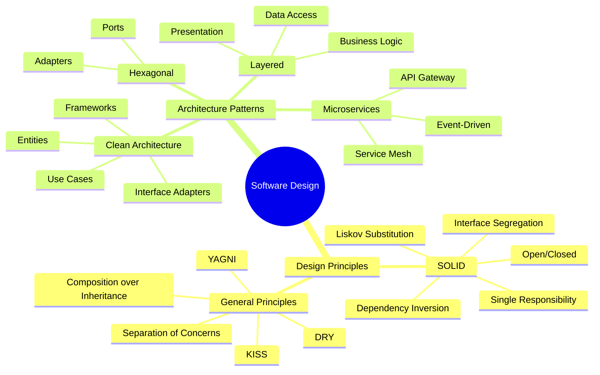
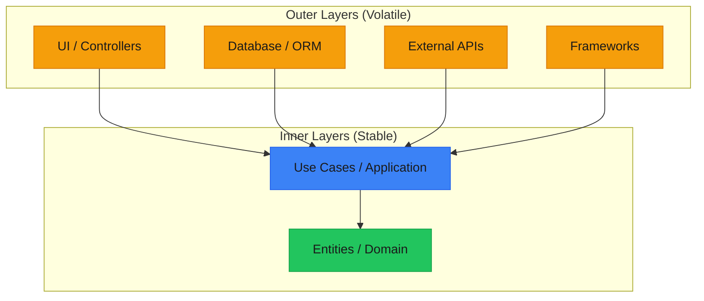
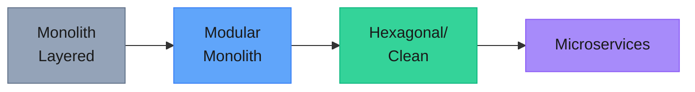

import { Circle, Hexagon, Layers, Lightbulb, Network, Pentagon } from 'lucide-react'

# Architecture & Design Principles

This section covers the fundamental principles and architectural patterns that guide the design of maintainable, scalable, and testable software systems.

## Overview

---

## Quick Reference

<Cards>
  <Card
    title="SOLID Principles"
    description="The five fundamental principles of object-oriented design"
    href="/docs/architecture/clean/solid"
    icon={<Pentagon />}
  />
  <Card
    title="Design Principles"
    description="DRY, KISS, YAGNI, and other essential guidelines"
    href="/docs/architecture/clean/design-principles"
    icon={<Lightbulb />}
  />
  <Card
    title="Hexagonal Architecture"
    description="Ports and adapters for framework independence"
    href="/docs/architecture/clean/hexagonal"
    icon={<Hexagon />}
  />
  <Card
    title="Clean Architecture"
    description="Uncle Bob's dependency rule and concentric layers"
    href="/docs/architecture/clean/clean-architecture"
    icon={<Circle />}
  />
  <Card
    title="Layered Architecture"
    description="Traditional N-tier separation of concerns"
    href="/docs/architecture/clean/layered"
    icon={<Layers />}
  />
  <Card
    title="Microservices"
    description="Distributed systems and service decomposition"
    href="/docs/architecture/clean/microservices"
    icon={<Network />}
  />
</Cards>

---

## Architecture Comparison

| Architecture | Best For | Complexity | Team Size | Key Benefit |
|-------------|----------|------------|-----------|-------------|
| **Layered** | Simple CRUD apps | Low | Small | Easy to understand |
| **Hexagonal** | Domain-heavy apps | Medium | Medium | Framework independence |
| **Clean** | Enterprise apps | Medium-High | Medium-Large | Testability |
| **Microservices** | Large-scale systems | High | Large | Scalability |

---

## The Dependency Rule

All architectures share one fundamental principle: **dependencies point inward**.

**Key Points:**
- Inner layers know nothing about outer layers
- Business logic is isolated from infrastructure
- Changes in frameworks don't affect core logic
- Testing is simplified through dependency injection

---

## Project Structure Philosophy

A well-organized codebase follows predictable patterns:

<Files>
  <Folder name="src" defaultOpen>
    <Folder name="domain" defaultOpen>
      <Folder name="entities" />
      <Folder name="value-objects" />
      <Folder name="services" />
    </Folder>
    <Folder name="application" defaultOpen>
      <Folder name="use-cases" />
      <Folder name="ports" />
      <Folder name="dto" />
    </Folder>
    <Folder name="infrastructure" defaultOpen>
      <Folder name="database" />
      <Folder name="http" />
      <Folder name="messaging" />
    </Folder>
    <Folder name="presentation" defaultOpen>
      <Folder name="controllers" />
      <Folder name="views" />
      <Folder name="middleware" />
    </Folder>
  </Folder>
</Files>

---

## When to Use What

<Accordions>
  <Accordion title="Start Simple with Layered">
    **Use Layered Architecture when:**
    - Building MVPs or prototypes
    - Small team (1-3 developers)
    - Simple CRUD operations
    - Short project timeline
    - Limited domain complexity
    
    **Signs you need more:**
    - Growing test complexity
    - Framework lock-in concerns
    - Increasing code duplication
  </Accordion>
  
  <Accordion title="Graduate to Hexagonal">
    **Use Hexagonal Architecture when:**
    - Multiple input sources (API, CLI, events)
    - Need framework independence
    - Heavy domain logic
    - Integration testing is important
    
    **Benefits:**
    - Swap databases easily
    - Test without infrastructure
    - Clear separation of concerns
  </Accordion>
  
  <Accordion title="Adopt Clean Architecture">
    **Use Clean Architecture when:**
    - Enterprise-grade requirements
    - Long-term maintainability matters
    - Multiple teams working on codebase
    - Complex business rules
    
    **Trade-offs:**
    - More boilerplate code
    - Steeper learning curve
    - Over-engineering risk for simple apps
  </Accordion>
  
  <Accordion title="Scale with Microservices">
    **Use Microservices when:**
    - Independent deployment needed
    - Different scaling requirements per service
    - Multiple teams need autonomy
    - Polyglot persistence required
    
    **Prerequisites:**
    - DevOps maturity
    - Monitoring infrastructure
    - Service mesh or API gateway
    - Team experience with distributed systems
  </Accordion>
</Accordions>

---

## Evolution Path

Most successful projects evolve their architecture over time:

**Key Insight:** Don't start with microservices. Extract services as domains become clear and team size grows.

---

## Learning Path

<Steps>
  <Step>
    **Master SOLID Principles**
    
    Foundation for all good design. Start here.
  </Step>
  
  <Step>
    **Learn Design Principles**
    
    DRY, KISS, YAGNI - practical guidelines for daily coding.
  </Step>
  
  <Step>
    **Understand Layered Architecture**
    
    The baseline pattern most developers know.
  </Step>
  
  <Step>
    **Study Hexagonal Architecture**
    
    Framework independence and testability.
  </Step>
  
  <Step>
    **Explore Clean Architecture**
    
    Combines concepts into a comprehensive approach.
  </Step>
  
  <Step>
    **Evaluate Microservices**
    
    When and how to decompose into services.
  </Step>
</Steps>
