import { Accordion, Accordions } from "fumadocs-ui/components/accordion";
import { Callout } from "fumadocs-ui/components/callout";
import { File, Files, Folder } from "fumadocs-ui/components/files";
import { Step, Steps } from "fumadocs-ui/components/steps";
import { Tab, Tabs } from "fumadocs-ui/components/tabs";

## Overview

**Layered Architecture** (also known as N-tier architecture) is one of the most common architectural patterns in software engineering. It organizes code into horizontal layers, each with a specific responsibility, where each layer only depends on the layer directly below it.

<Callout type="info">
Layered Architecture is the foundation of many other architectural patterns including Clean Architecture, Hexagonal Architecture, and Onion Architecture. Understanding it is essential for grasping more advanced patterns.
</Callout>


---

## Core Concepts

### The Four Traditional Layers

<Steps>

<Step>
### Presentation Layer

The topmost layer handles user interaction and displays information. It's responsible for:

- Rendering user interfaces (web pages, mobile screens, CLI)
- Handling user input and events
- Validating input format (not business rules)
- Transforming data for display

```typescript
// Presentation Layer - Controller
interface CreateUserDTO {
  email: string;
  password: string;
  name: string;
}

interface UserResponse {
  id: string;
  email: string;
  name: string;
  createdAt: Date;
}

// Simulated service
const userService = {
  createUser: async (dto: CreateUserDTO): Promise<UserResponse> => ({
    id: "1",
    email: dto.email,
    name: dto.name,
    createdAt: new Date(),
  }),
};

// Controller handling HTTP requests
const createUserHandler = async (request: Request): Promise<Response> => {
  const body = (await request.json()) as CreateUserDTO;

  // Input validation (format, not business rules)
  if (!body.email || !body.email.includes("@")) {
    return new Response(JSON.stringify({ error: "Invalid email format" }), {
      status: 400,
      headers: { "Content-Type": "application/json" },
    });
  }

  // Delegate to application service
  const user = await userService.createUser(body);

  // Transform for response
  return new Response(JSON.stringify(user), {
    status: 201,
    headers: { "Content-Type": "application/json" },
  });
};
```
</Step>

<Step>
### Application Layer

Orchestrates the flow of data and coordinates business operations. It's responsible for:

- Defining application use cases
- Orchestrating domain objects
- Transaction management
- Authorization checks

```typescript
// Application Layer - Service
interface CreateUserDTO {
  email: string;
  password: string;
  name: string;
}

interface User {
  id: string;
  email: string;
  name: string;
  passwordHash: string;
  createdAt: Date;
  updatedAt: Date;
}

interface UserRepository {
  findByEmail(email: string): Promise<User | null>;
  save(user: User): Promise<User>;
}

interface PasswordHasher {
  hash(password: string): Promise<string>;
}

interface EventPublisher {
  publish(event: { type: string; payload: unknown }): Promise<void>;
}

// ---cut---
// Application Service - orchestrates use case
const createUserService = (deps: {
  userRepository: UserRepository;
  passwordHasher: PasswordHasher;
  eventPublisher: EventPublisher;
}) => {
  return async (dto: CreateUserDTO): Promise<User> => {
    // Check if user already exists
    const existingUser = await deps.userRepository.findByEmail(dto.email);
    if (existingUser) {
      throw new Error("User with this email already exists");
    }

    // Hash password
    const passwordHash = await deps.passwordHasher.hash(dto.password);

    // Create user entity
    const user: User = {
      id: crypto.randomUUID(),
      email: dto.email,
      name: dto.name,
      passwordHash,
      createdAt: new Date(),
      updatedAt: new Date(),
    };

    // Persist user
    const savedUser = await deps.userRepository.save(user);

    // Publish domain event
    await deps.eventPublisher.publish({
      type: "UserCreated",
      payload: { userId: savedUser.id, email: savedUser.email },
    });

    return savedUser;
  };
};
```
</Step>

<Step>
### Business Layer (Domain Layer)

Contains the core business logic and rules. It's responsible for:

- Business entities and their behaviors
- Domain services for complex operations
- Business rule validation
- Domain events

```typescript
// Business Layer - Domain Entities and Rules

// Value Object
const createEmail = (value: string) => {
  const emailRegex = /^[^\s@]+@[^\s@]+\.[^\s@]+$/;
  if (!emailRegex.test(value)) {
    throw new Error("Invalid email format");
  }

  const normalized = value.toLowerCase().trim();

  return {
    value: normalized,
    domain: normalized.split("@")[1],
    equals: (other: { value: string }) => normalized === other.value,
  };
};

type Email = ReturnType<typeof createEmail>;

// Value Object for Money
const createMoney = (amount: number, currency: string) => {
  if (amount < 0) {
    throw new Error("Amount cannot be negative");
  }

  return {
    amount,
    currency,
    add: (other: { amount: number; currency: string }) => {
      if (currency !== other.currency) {
        throw new Error("Cannot add different currencies");
      }
      return createMoney(amount + other.amount, currency);
    },
    multiply: (factor: number) => createMoney(amount * factor, currency),
  };
};

type Money = ReturnType<typeof createMoney>;

// Entity with business rules
const createOrder = (params: {
  id: string;
  customerId: string;
  items: Array<{ productId: string; quantity: number; price: Money }>;
}) => {
  const items = [...params.items];

  const calculateTotal = (): Money => {
    if (items.length === 0) {
      return createMoney(0, "USD");
    }
    return items.reduce(
      (total, item) => total.add(item.price.multiply(item.quantity)),
      createMoney(0, items[0].price.currency)
    );
  };

  return {
    id: params.id,
    customerId: params.customerId,
    items,
    status: "pending" as "pending" | "confirmed" | "shipped" | "delivered",

    // Business rule: minimum order value
    canBeConfirmed(): boolean {
      const total = calculateTotal();
      return total.amount >= 10; // Minimum $10 order
    },

    // Business rule: max items per order
    addItem(item: { productId: string; quantity: number; price: Money }) {
      if (items.length >= 50) {
        throw new Error("Maximum 50 items per order");
      }
      if (item.quantity <= 0) {
        throw new Error("Quantity must be positive");
      }
      items.push(item);
    },

    getTotal: calculateTotal,
  };
};
```
</Step>

<Step>
### Data Access Layer (Infrastructure Layer)

Handles data persistence and external system communication. It's responsible for:

- Database operations (CRUD)
- External API calls
- File system operations
- Caching

```typescript
// Data Access Layer - Repository Implementation
interface User {
  id: string;
  email: string;
  name: string;
  passwordHash: string;
  createdAt: Date;
  updatedAt: Date;
}

interface UserRepository {
  findById(id: string): Promise<User | null>;
  findByEmail(email: string): Promise<User | null>;
  save(user: User): Promise<User>;
  delete(id: string): Promise<void>;
}

// Simulated database client
const db = {
  query: async <T>(sql: string, params: unknown[]): Promise<T[]> => [],
  execute: async (sql: string, params: unknown[]): Promise<void> => {},
};

// ---cut---
// PostgreSQL implementation of UserRepository
const createPostgresUserRepository = (): UserRepository => {
  return {
    async findById(id: string): Promise<User | null> {
      const results = await db.query<User>(
        `SELECT id, email, name, password_hash as "passwordHash", 
                created_at as "createdAt", updated_at as "updatedAt"
         FROM users WHERE id = $1`,
        [id]
      );
      return results[0] ?? null;
    },

    async findByEmail(email: string): Promise<User | null> {
      const results = await db.query<User>(
        `SELECT id, email, name, password_hash as "passwordHash",
                created_at as "createdAt", updated_at as "updatedAt"
         FROM users WHERE email = $1`,
        [email.toLowerCase()]
      );
      return results[0] ?? null;
    },

    async save(user: User): Promise<User> {
      await db.execute(
        `INSERT INTO users (id, email, name, password_hash, created_at, updated_at)
         VALUES ($1, $2, $3, $4, $5, $6)
         ON CONFLICT (id) DO UPDATE SET
           email = EXCLUDED.email,
           name = EXCLUDED.name,
           password_hash = EXCLUDED.password_hash,
           updated_at = EXCLUDED.updated_at`,
        [
          user.id,
          user.email,
          user.name,
          user.passwordHash,
          user.createdAt,
          user.updatedAt,
        ]
      );
      return user;
    },

    async delete(id: string): Promise<void> {
      await db.execute(`DELETE FROM users WHERE id = $1`, [id]);
    },
  };
};
```
</Step>

</Steps>

---

## Layer Communication Rules

### Dependency Direction

The fundamental rule of layered architecture is that **dependencies flow downward only**:

```mermaid
graph TB
  subgraph "Allowed Dependencies"
    P1[Presentation] --> A1[Application]
    A1 --> B1[Business]
    B1 --> D1[Data Access]
  end
  
  subgraph "Forbidden Dependencies"
    D2[Data Access] -.->|❌| B2[Business]
    B2 -.->|❌| A2[Application]
    A2 -.->|❌| P2[Presentation]
  end
  
  style P1 fill:#e1f5fe,color:#1a1a1a
  style A1 fill:#fff3e0,color:#1a1a1a
  style B1 fill:#e8f5e9,color:#1a1a1a
  style D1 fill:#fce4ec,color:#1a1a1a
  style P2 fill:#e1f5fe,color:#1a1a1a
  style A2 fill:#fff3e0,color:#1a1a1a
  style B2 fill:#e8f5e9,color:#1a1a1a
  style D2 fill:#fce4ec,color:#1a1a1a
```



### Strict vs Relaxed Layering

<Tabs items={['Strict Layering', 'Relaxed Layering']}>
<Tab value="Strict Layering">
In **strict layering**, each layer can only communicate with the layer directly below it:

```typescript
// Strict Layering Example
// Presentation can ONLY call Application layer

interface UserDTO {
  id: string;
  email: string;
  name: string;
}

interface UserService {
  getUser(id: string): Promise<UserDTO>;
  createUser(data: { email: string; name: string }): Promise<UserDTO>;
}

// Controller (Presentation) -> Service (Application) ONLY
const createUserController = (userService: UserService) => {
  return {
    async handleGetUser(request: { params: { id: string } }) {
      // ✅ Correct: Calling Application layer
      const user = await userService.getUser(request.params.id);
      return { status: 200, body: user };
    },

    // ❌ FORBIDDEN: Cannot call Repository (Data Access) directly
    // async handleGetUserDirect(request: { params: { id: string } }) {
    //   const user = await userRepository.findById(request.params.id);
    //   return { status: 200, body: user };
    // }
  };
};

// Benefits:
// - Clear separation of concerns
// - Easier to test each layer in isolation
// - Changes are contained within layers
```

**Advantages:**
- Maximum isolation between layers
- Easier to swap implementations
- Clear boundaries for testing

**Disadvantages:**
- Can lead to "pass-through" methods
- May add unnecessary complexity for simple operations
</Tab>

<Tab value="Relaxed Layering">
In **relaxed layering**, layers can skip intermediate layers when appropriate:

```typescript
// Relaxed Layering Example
// Presentation can call Application OR Business layers directly

interface User {
  id: string;
  email: string;
  name: string;
  role: string;
}

interface UserRepository {
  findById(id: string): Promise<User | null>;
}

// Simple query operations can bypass Application layer
const createUserController = (deps: {
  userRepository: UserRepository;
  complexUserService: { processComplexOperation(): Promise<void> };
}) => {
  return {
    // ✅ Simple read - can go directly to repository
    async handleGetUser(request: { params: { id: string } }) {
      const user = await deps.userRepository.findById(request.params.id);
      if (!user) {
        return { status: 404, body: { error: "User not found" } };
      }
      return { status: 200, body: user };
    },

    // ✅ Complex operation - goes through Application layer
    async handleComplexOperation() {
      await deps.complexUserService.processComplexOperation();
      return { status: 200, body: { success: true } };
    },
  };
};

// Benefits:
// - Less boilerplate for simple operations
// - More pragmatic approach
// - Better performance (fewer layers to traverse)
```

**Advantages:**
- Less boilerplate code
- Better performance for simple operations
- More pragmatic approach

**Disadvantages:**
- Harder to maintain consistency
- Testing may be more complex
- Can lead to tight coupling over time
</Tab>
</Tabs>

---

## Implementation Patterns

### Data Transfer Objects (DTOs)

DTOs ensure that layer boundaries are respected by transferring only necessary data:

```typescript
// DTOs for layer communication

// Request DTO (from Presentation to Application)
interface CreateOrderRequest {
  customerId: string;
  items: Array<{
    productId: string;
    quantity: number;
  }>;
  shippingAddress: {
    street: string;
    city: string;
    country: string;
    postalCode: string;
  };
}

// Response DTO (from Application to Presentation)
interface OrderResponse {
  id: string;
  customerId: string;
  status: string;
  items: Array<{
    productId: string;
    productName: string;
    quantity: number;
    unitPrice: number;
    totalPrice: number;
  }>;
  subtotal: number;
  tax: number;
  total: number;
  createdAt: string;
}

// Internal Domain Entity (Business Layer)
interface Order {
  id: string;
  customerId: string;
  status: "pending" | "confirmed" | "shipped" | "delivered";
  items: OrderItem[];
  shippingAddress: Address;
  createdAt: Date;
  updatedAt: Date;
  // Domain methods
  confirm(): void;
  calculateTotal(): number;
}

interface OrderItem {
  productId: string;
  product: Product;
  quantity: number;
  priceAtPurchase: number;
}

interface Product {
  id: string;
  name: string;
  price: number;
}

interface Address {
  street: string;
  city: string;
  country: string;
  postalCode: string;
}

// Mapper between layers
const orderMapper = {
  toResponse(order: Order): OrderResponse {
    const subtotal = order.items.reduce(
      (sum, item) => sum + item.priceAtPurchase * item.quantity,
      0
    );
    const tax = subtotal * 0.1; // 10% tax

    return {
      id: order.id,
      customerId: order.customerId,
      status: order.status,
      items: order.items.map((item) => ({
        productId: item.productId,
        productName: item.product.name,
        quantity: item.quantity,
        unitPrice: item.priceAtPurchase,
        totalPrice: item.priceAtPurchase * item.quantity,
      })),
      subtotal,
      tax,
      total: subtotal + tax,
      createdAt: order.createdAt.toISOString(),
    };
  },
};
```

### Cross-Cutting Concerns

Handle concerns that span multiple layers:

```typescript
// Cross-cutting concerns implementation

// Logging middleware that works across layers
type LogLevel = "debug" | "info" | "warn" | "error";

interface Logger {
  log(level: LogLevel, message: string, context?: Record<string, unknown>): void;
  debug(message: string, context?: Record<string, unknown>): void;
  info(message: string, context?: Record<string, unknown>): void;
  warn(message: string, context?: Record<string, unknown>): void;
  error(message: string, context?: Record<string, unknown>): void;
}

const createLogger = (service: string): Logger => {
  const log = (
    level: LogLevel,
    message: string,
    context?: Record<string, unknown>
  ) => {
    console.log(
      JSON.stringify({
        timestamp: new Date().toISOString(),
        level,
        service,
        message,
        ...context,
      })
    );
  };

  return {
    log,
    debug: (msg, ctx) => log("debug", msg, ctx),
    info: (msg, ctx) => log("info", msg, ctx),
    warn: (msg, ctx) => log("warn", msg, ctx),
    error: (msg, ctx) => log("error", msg, ctx),
  };
};

// Service wrapper with logging
const withLogging = <T extends Record<string, (...args: unknown[]) => Promise<unknown>>>(
  service: T,
  logger: Logger
): T => {
  const wrapped = {} as T;

  for (const [key, method] of Object.entries(service)) {
    (wrapped as Record<string, unknown>)[key] = async (...args: unknown[]) => {
      const startTime = Date.now();
      logger.info(`${key} started`, { args });

      try {
        const result = await method(...args);
        logger.info(`${key} completed`, {
          duration: Date.now() - startTime,
        });
        return result;
      } catch (error) {
        logger.error(`${key} failed`, {
          duration: Date.now() - startTime,
          error: error instanceof Error ? error.message : "Unknown error",
        });
        throw error;
      }
    };
  }

  return wrapped;
};
```

---

## Project Structure

### Traditional Layered Structure

<Files>
  <Folder name="src" defaultOpen>
    <Folder name="presentation" defaultOpen>
      <Folder name="controllers">
        <File name="user.controller.ts" />
        <File name="order.controller.ts" />
        <File name="product.controller.ts" />
      </Folder>
      <Folder name="middleware">
        <File name="auth.middleware.ts" />
        <File name="error.middleware.ts" />
        <File name="validation.middleware.ts" />
      </Folder>
      <Folder name="validators">
        <File name="user.validator.ts" />
        <File name="order.validator.ts" />
      </Folder>
    </Folder>
    <Folder name="application" defaultOpen>
      <Folder name="services">
        <File name="user.service.ts" />
        <File name="order.service.ts" />
        <File name="product.service.ts" />
      </Folder>
      <Folder name="dtos">
        <File name="user.dto.ts" />
        <File name="order.dto.ts" />
        <File name="product.dto.ts" />
      </Folder>
      <Folder name="mappers">
        <File name="user.mapper.ts" />
        <File name="order.mapper.ts" />
      </Folder>
    </Folder>
    <Folder name="domain" defaultOpen>
      <Folder name="entities">
        <File name="user.entity.ts" />
        <File name="order.entity.ts" />
        <File name="product.entity.ts" />
      </Folder>
      <Folder name="value-objects">
        <File name="email.ts" />
        <File name="money.ts" />
        <File name="address.ts" />
      </Folder>
      <Folder name="services">
        <File name="pricing.service.ts" />
        <File name="inventory.service.ts" />
      </Folder>
    </Folder>
    <Folder name="infrastructure" defaultOpen>
      <Folder name="repositories">
        <File name="user.repository.ts" />
        <File name="order.repository.ts" />
        <File name="product.repository.ts" />
      </Folder>
      <Folder name="database">
        <File name="connection.ts" />
        <File name="migrations/" />
      </Folder>
      <Folder name="external">
        <File name="payment-gateway.ts" />
        <File name="email-service.ts" />
      </Folder>
    </Folder>
    <File name="app.ts" />
    <File name="config.ts" />
  </Folder>
</Files>

### Feature-Based Layered Structure

<Files>
  <Folder name="src" defaultOpen>
    <Folder name="features" defaultOpen>
      <Folder name="users" defaultOpen>
        <Folder name="presentation">
          <File name="user.controller.ts" />
          <File name="user.validator.ts" />
        </Folder>
        <Folder name="application">
          <File name="user.service.ts" />
          <File name="user.dto.ts" />
        </Folder>
        <Folder name="domain">
          <File name="user.entity.ts" />
          <File name="user.repository.ts" />
        </Folder>
        <Folder name="infrastructure">
          <File name="postgres-user.repository.ts" />
        </Folder>
        <File name="index.ts" />
      </Folder>
      <Folder name="orders" defaultOpen>
        <Folder name="presentation">
          <File name="order.controller.ts" />
        </Folder>
        <Folder name="application">
          <File name="order.service.ts" />
        </Folder>
        <Folder name="domain">
          <File name="order.entity.ts" />
        </Folder>
        <Folder name="infrastructure">
          <File name="postgres-order.repository.ts" />
        </Folder>
      </Folder>
    </Folder>
    <Folder name="shared">
      <Folder name="infrastructure">
        <File name="database.ts" />
        <File name="logger.ts" />
      </Folder>
    </Folder>
  </Folder>
</Files>

---

## Complete Example: E-Commerce Order System

<Tabs items={['Presentation', 'Application', 'Domain', 'Infrastructure']}>
<Tab value="Presentation">
```typescript
// presentation/controllers/order.controller.ts
interface OrderDTO {
  id: string;
  customerId: string;
  status: string;
  items: Array<{ productId: string; quantity: number; price: number }>;
  total: number;
}

interface CreateOrderDTO {
  customerId: string;
  items: Array<{ productId: string; quantity: number }>;
}

interface OrderService {
  createOrder(dto: CreateOrderDTO): Promise<OrderDTO>;
  getOrder(id: string): Promise<OrderDTO | null>;
  confirmOrder(id: string): Promise<OrderDTO>;
}

// ---cut---
// Order Controller - Presentation Layer
const createOrderController = (orderService: OrderService) => {
  return {
    // GET /orders/:id
    async getOrder(request: Request): Promise<Response> {
      const url = new URL(request.url);
      const id = url.pathname.split("/").pop()!;

      const order = await orderService.getOrder(id);

      if (!order) {
        return new Response(JSON.stringify({ error: "Order not found" }), {
          status: 404,
          headers: { "Content-Type": "application/json" },
        });
      }

      return new Response(JSON.stringify(order), {
        status: 200,
        headers: { "Content-Type": "application/json" },
      });
    },

    // POST /orders
    async createOrder(request: Request): Promise<Response> {
      const body = (await request.json()) as CreateOrderDTO;

      // Input validation
      if (!body.customerId) {
        return new Response(
          JSON.stringify({ error: "Customer ID is required" }),
          { status: 400, headers: { "Content-Type": "application/json" } }
        );
      }

      if (!body.items || body.items.length === 0) {
        return new Response(
          JSON.stringify({ error: "At least one item is required" }),
          { status: 400, headers: { "Content-Type": "application/json" } }
        );
      }

      try {
        const order = await orderService.createOrder(body);
        return new Response(JSON.stringify(order), {
          status: 201,
          headers: { "Content-Type": "application/json" },
        });
      } catch (error) {
        return new Response(
          JSON.stringify({
            error: error instanceof Error ? error.message : "Unknown error",
          }),
          { status: 400, headers: { "Content-Type": "application/json" } }
        );
      }
    },

    // POST /orders/:id/confirm
    async confirmOrder(request: Request): Promise<Response> {
      const url = new URL(request.url);
      const id = url.pathname.split("/")[2];

      try {
        const order = await orderService.confirmOrder(id);
        return new Response(JSON.stringify(order), {
          status: 200,
          headers: { "Content-Type": "application/json" },
        });
      } catch (error) {
        return new Response(
          JSON.stringify({
            error: error instanceof Error ? error.message : "Unknown error",
          }),
          { status: 400, headers: { "Content-Type": "application/json" } }
        );
      }
    },
  };
};
```
</Tab>

<Tab value="Application">
```typescript
// application/services/order.service.ts
interface Order {
  id: string;
  customerId: string;
  status: "pending" | "confirmed" | "shipped" | "delivered" | "cancelled";
  items: OrderItem[];
  createdAt: Date;
  updatedAt: Date;
}

interface OrderItem {
  productId: string;
  quantity: number;
  priceAtPurchase: number;
}

interface Product {
  id: string;
  name: string;
  price: number;
  stock: number;
}

interface OrderRepository {
  findById(id: string): Promise<Order | null>;
  save(order: Order): Promise<Order>;
}

interface ProductRepository {
  findById(id: string): Promise<Product | null>;
  updateStock(productId: string, quantity: number): Promise<void>;
}

interface EventPublisher {
  publish(event: { type: string; payload: unknown }): Promise<void>;
}

interface CreateOrderDTO {
  customerId: string;
  items: Array<{ productId: string; quantity: number }>;
}

interface OrderDTO {
  id: string;
  customerId: string;
  status: string;
  items: Array<{ productId: string; quantity: number; price: number }>;
  total: number;
}

// ---cut---
// Order Application Service
const createOrderService = (deps: {
  orderRepository: OrderRepository;
  productRepository: ProductRepository;
  eventPublisher: EventPublisher;
}) => {
  const toDTO = (order: Order): OrderDTO => ({
    id: order.id,
    customerId: order.customerId,
    status: order.status,
    items: order.items.map((item) => ({
      productId: item.productId,
      quantity: item.quantity,
      price: item.priceAtPurchase,
    })),
    total: order.items.reduce(
      (sum, item) => sum + item.priceAtPurchase * item.quantity,
      0
    ),
  });

  return {
    async createOrder(dto: CreateOrderDTO): Promise<OrderDTO> {
      // Validate products and check stock
      const orderItems: OrderItem[] = [];

      for (const item of dto.items) {
        const product = await deps.productRepository.findById(item.productId);
        if (!product) {
          throw new Error(`Product ${item.productId} not found`);
        }
        if (product.stock < item.quantity) {
          throw new Error(`Insufficient stock for product ${product.name}`);
        }

        orderItems.push({
          productId: item.productId,
          quantity: item.quantity,
          priceAtPurchase: product.price,
        });
      }

      // Create order entity
      const order: Order = {
        id: crypto.randomUUID(),
        customerId: dto.customerId,
        status: "pending",
        items: orderItems,
        createdAt: new Date(),
        updatedAt: new Date(),
      };

      // Reserve stock
      for (const item of orderItems) {
        await deps.productRepository.updateStock(
          item.productId,
          -item.quantity
        );
      }

      // Save order
      const savedOrder = await deps.orderRepository.save(order);

      // Publish event
      await deps.eventPublisher.publish({
        type: "OrderCreated",
        payload: { orderId: savedOrder.id, customerId: dto.customerId },
      });

      return toDTO(savedOrder);
    },

    async getOrder(id: string): Promise<OrderDTO | null> {
      const order = await deps.orderRepository.findById(id);
      return order ? toDTO(order) : null;
    },

    async confirmOrder(id: string): Promise<OrderDTO> {
      const order = await deps.orderRepository.findById(id);
      if (!order) {
        throw new Error("Order not found");
      }

      if (order.status !== "pending") {
        throw new Error(`Cannot confirm order with status: ${order.status}`);
      }

      // Business rule: minimum order value
      const total = order.items.reduce(
        (sum, item) => sum + item.priceAtPurchase * item.quantity,
        0
      );

      if (total < 10) {
        throw new Error("Minimum order value is $10");
      }

      order.status = "confirmed";
      order.updatedAt = new Date();

      const updated = await deps.orderRepository.save(order);

      await deps.eventPublisher.publish({
        type: "OrderConfirmed",
        payload: { orderId: id },
      });

      return toDTO(updated);
    },
  };
};
```
</Tab>

<Tab value="Domain">
```typescript
// domain/entities/order.entity.ts

// Value Objects
const createMoney = (amount: number, currency = "USD") => {
  if (amount < 0) throw new Error("Amount cannot be negative");

  return {
    amount,
    currency,
    add(other: { amount: number; currency: string }) {
      if (this.currency !== other.currency) {
        throw new Error("Currency mismatch");
      }
      return createMoney(this.amount + other.amount, this.currency);
    },
    multiply(factor: number) {
      return createMoney(this.amount * factor, this.currency);
    },
    isGreaterThan(other: { amount: number }) {
      return this.amount > other.amount;
    },
  };
};

type Money = ReturnType<typeof createMoney>;

// Order Entity with business logic
interface OrderItemParams {
  productId: string;
  productName: string;
  quantity: number;
  unitPrice: Money;
}

interface OrderParams {
  id: string;
  customerId: string;
  items?: OrderItemParams[];
}

const createOrder = (params: OrderParams) => {
  let status: "draft" | "pending" | "confirmed" | "cancelled" = "draft";
  const items: OrderItemParams[] = params.items ? [...params.items] : [];

  const calculateTotal = (): Money => {
    return items.reduce(
      (total, item) => total.add(item.unitPrice.multiply(item.quantity)),
      createMoney(0)
    );
  };

  return {
    id: params.id,
    customerId: params.customerId,

    get status() {
      return status;
    },

    get items() {
      return [...items]; // Return copy to prevent external mutation
    },

    addItem(item: OrderItemParams) {
      if (status !== "draft") {
        throw new Error("Cannot modify non-draft order");
      }
      if (item.quantity <= 0) {
        throw new Error("Quantity must be positive");
      }
      if (items.length >= 100) {
        throw new Error("Maximum 100 items per order");
      }

      // Check if item already exists
      const existing = items.find((i) => i.productId === item.productId);
      if (existing) {
        existing.quantity += item.quantity;
      } else {
        items.push({ ...item });
      }
    },

    removeItem(productId: string) {
      if (status !== "draft") {
        throw new Error("Cannot modify non-draft order");
      }
      const index = items.findIndex((i) => i.productId === productId);
      if (index === -1) {
        throw new Error("Item not found");
      }
      items.splice(index, 1);
    },

    submit() {
      if (status !== "draft") {
        throw new Error("Only draft orders can be submitted");
      }
      if (items.length === 0) {
        throw new Error("Cannot submit empty order");
      }

      const total = calculateTotal();
      const minimumOrder = createMoney(10);

      if (!total.isGreaterThan(minimumOrder)) {
        throw new Error("Minimum order value is $10");
      }

      status = "pending";
    },

    confirm() {
      if (status !== "pending") {
        throw new Error("Only pending orders can be confirmed");
      }
      status = "confirmed";
    },

    cancel() {
      if (status === "confirmed") {
        throw new Error("Cannot cancel confirmed order");
      }
      status = "cancelled";
    },

    getTotal: calculateTotal,
  };
};

type Order = ReturnType<typeof createOrder>;

// Domain Service for complex operations
interface InventoryChecker {
  checkAvailability(
    productId: string,
    quantity: number
  ): Promise<{ available: boolean; currentStock: number }>;
}

interface PricingService {
  getPrice(productId: string, customerId: string): Promise<Money>;
}

const createOrderDomainService = (deps: {
  inventoryChecker: InventoryChecker;
  pricingService: PricingService;
}) => {
  return {
    async validateOrderItems(
      items: Array<{ productId: string; quantity: number }>,
      customerId: string
    ): Promise<
      Array<{
        productId: string;
        quantity: number;
        available: boolean;
        price: Money;
      }>
    > {
      const results = await Promise.all(
        items.map(async (item) => {
          const [availability, price] = await Promise.all([
            deps.inventoryChecker.checkAvailability(
              item.productId,
              item.quantity
            ),
            deps.pricingService.getPrice(item.productId, customerId),
          ]);

          return {
            productId: item.productId,
            quantity: item.quantity,
            available: availability.available,
            price,
          };
        })
      );

      return results;
    },
  };
};
```
</Tab>

<Tab value="Infrastructure">
```typescript
// infrastructure/repositories/order.repository.ts
interface Order {
  id: string;
  customerId: string;
  status: "pending" | "confirmed" | "shipped" | "delivered" | "cancelled";
  items: OrderItem[];
  createdAt: Date;
  updatedAt: Date;
}

interface OrderItem {
  productId: string;
  quantity: number;
  priceAtPurchase: number;
}

interface OrderRepository {
  findById(id: string): Promise<Order | null>;
  findByCustomerId(customerId: string): Promise<Order[]>;
  save(order: Order): Promise<Order>;
  delete(id: string): Promise<void>;
}

// Simulated database
const db = {
  query: async <T>(_sql: string, _params: unknown[]): Promise<T[]> => [],
  execute: async (_sql: string, _params: unknown[]): Promise<void> => {},
  transaction: async <T>(fn: () => Promise<T>): Promise<T> => fn(),
};

// ---cut---
// PostgreSQL Order Repository
const createPostgresOrderRepository = (): OrderRepository => {
  return {
    async findById(id: string): Promise<Order | null> {
      const orders = await db.query<{
        id: string;
        customer_id: string;
        status: Order["status"];
        created_at: Date;
        updated_at: Date;
      }>(
        `SELECT id, customer_id, status, created_at, updated_at 
         FROM orders WHERE id = $1`,
        [id]
      );

      if (orders.length === 0) return null;

      const orderRow = orders[0];
      const items = await db.query<{
        product_id: string;
        quantity: number;
        price_at_purchase: number;
      }>(
        `SELECT product_id, quantity, price_at_purchase 
         FROM order_items WHERE order_id = $1`,
        [id]
      );

      return {
        id: orderRow.id,
        customerId: orderRow.customer_id,
        status: orderRow.status,
        items: items.map((item) => ({
          productId: item.product_id,
          quantity: item.quantity,
          priceAtPurchase: item.price_at_purchase,
        })),
        createdAt: orderRow.created_at,
        updatedAt: orderRow.updated_at,
      };
    },

    async findByCustomerId(customerId: string): Promise<Order[]> {
      const orderRows = await db.query<{
        id: string;
        customer_id: string;
        status: Order["status"];
        created_at: Date;
        updated_at: Date;
      }>(
        `SELECT id, customer_id, status, created_at, updated_at 
         FROM orders WHERE customer_id = $1 ORDER BY created_at DESC`,
        [customerId]
      );

      return Promise.all(
        orderRows.map(async (row) => {
          const items = await db.query<{
            product_id: string;
            quantity: number;
            price_at_purchase: number;
          }>(
            `SELECT product_id, quantity, price_at_purchase 
             FROM order_items WHERE order_id = $1`,
            [row.id]
          );

          return {
            id: row.id,
            customerId: row.customer_id,
            status: row.status,
            items: items.map((item) => ({
              productId: item.product_id,
              quantity: item.quantity,
              priceAtPurchase: item.price_at_purchase,
            })),
            createdAt: row.created_at,
            updatedAt: row.updated_at,
          };
        })
      );
    },

    async save(order: Order): Promise<Order> {
      await db.transaction(async () => {
        // Upsert order
        await db.execute(
          `INSERT INTO orders (id, customer_id, status, created_at, updated_at)
           VALUES ($1, $2, $3, $4, $5)
           ON CONFLICT (id) DO UPDATE SET
             status = EXCLUDED.status,
             updated_at = EXCLUDED.updated_at`,
          [
            order.id,
            order.customerId,
            order.status,
            order.createdAt,
            order.updatedAt,
          ]
        );

        // Delete existing items and re-insert
        await db.execute(`DELETE FROM order_items WHERE order_id = $1`, [
          order.id,
        ]);

        for (const item of order.items) {
          await db.execute(
            `INSERT INTO order_items (order_id, product_id, quantity, price_at_purchase)
             VALUES ($1, $2, $3, $4)`,
            [order.id, item.productId, item.quantity, item.priceAtPurchase]
          );
        }
      });

      return order;
    },

    async delete(id: string): Promise<void> {
      await db.transaction(async () => {
        await db.execute(`DELETE FROM order_items WHERE order_id = $1`, [id]);
        await db.execute(`DELETE FROM orders WHERE id = $1`, [id]);
      });
    },
  };
};

// Event Publisher Infrastructure
interface EventPublisher {
  publish(event: { type: string; payload: unknown }): Promise<void>;
}

const createKafkaEventPublisher = (config: {
  brokers: string[];
  topic: string;
}): EventPublisher => {
  return {
    async publish(event) {
      // In real implementation, would use Kafka client
      console.log(`Publishing to ${config.topic}:`, event);
      // await kafkaProducer.send({
      //   topic: config.topic,
      //   messages: [{ value: JSON.stringify(event) }]
      // });
    },
  };
};
```
</Tab>
</Tabs>

---

## Advantages and Disadvantages

<Accordions>
<Accordion title="✅ When to Use Layered Architecture">

**Ideal Scenarios:**
- **Enterprise applications** with complex business logic
- **CRUD-heavy applications** with straightforward data flow
- **Teams familiar with traditional patterns** - easy to understand and onboard
- **Applications with stable requirements** - changes are contained within layers
- **Monolithic applications** before considering microservices

**Benefits:**
- Clear separation of concerns
- Easy to understand and implement
- Well-documented pattern with extensive resources
- Supports team organization (separate teams per layer)
- Facilitates independent testing of each layer

</Accordion>

<Accordion title="❌ When to Avoid Layered Architecture">

**Avoid When:**
- Building **real-time systems** requiring high performance
- Creating **microservices** - each service should be self-contained
- Working on **small projects** where layering adds overhead
- Building **event-driven systems** - may need different patterns
- Requirements change frequently - can lead to cascading changes

**Drawbacks:**
- Can lead to "anemic domain model" if not careful
- Performance overhead from layer traversal
- Tendency to create pass-through methods
- Tight coupling between layers in strict mode
- Database-centric design can emerge

</Accordion>

<Accordion title="🔄 Migration Strategies">

**From Layered to Clean Architecture:**
1. Introduce dependency inversion at layer boundaries
2. Define interfaces in domain layer
3. Move infrastructure dependencies to outer layers
4. Implement ports and adapters pattern

**From Monolith to Microservices:**
1. Identify bounded contexts within layers
2. Extract domain modules with their full layer stack
3. Define API contracts between services
4. Implement distributed patterns (saga, event sourcing)

</Accordion>
</Accordions>

---

## Comparison with Other Patterns

| Aspect | Layered | Clean Architecture | Hexagonal |
|--------|---------|-------------------|-----------|
| **Dependency Direction** | Top to bottom | Outside to inside | Outside to core |
| **Core Focus** | Separation by function | Domain isolation | Ports & adapters |
| **Flexibility** | Moderate | High | High |
| **Complexity** | Low | Medium | Medium |
| **Learning Curve** | Easy | Moderate | Moderate |
| **Testability** | Good | Excellent | Excellent |
| **Use Case** | Traditional apps | Domain-heavy apps | Integration-heavy apps |

---

## Best Practices

<Steps>

<Step>
### Define Clear Layer Boundaries

Establish explicit contracts between layers using interfaces and DTOs.
</Step>

<Step>
### Avoid Cross-Layer Dependencies

Never let lower layers depend on upper layers. Use dependency injection to invert dependencies when needed.
</Step>

<Step>
### Keep Business Logic in Domain Layer

Resist the temptation to add business rules in controllers or repositories.
</Step>

<Step>
### Use DTOs for Layer Communication

Transform data at layer boundaries to prevent domain leakage and coupling.
</Step>

<Step>
### Implement Proper Error Handling

Create layer-specific exceptions and handle them at appropriate boundaries.
</Step>

</Steps>
