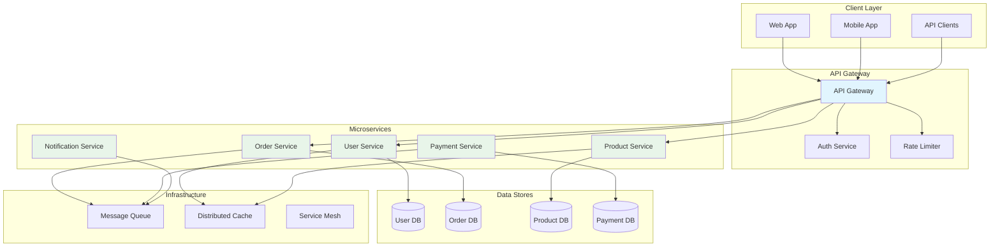
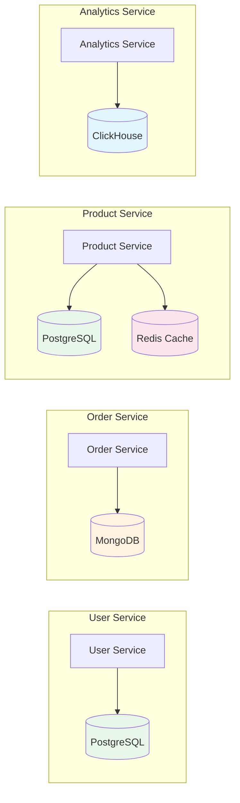
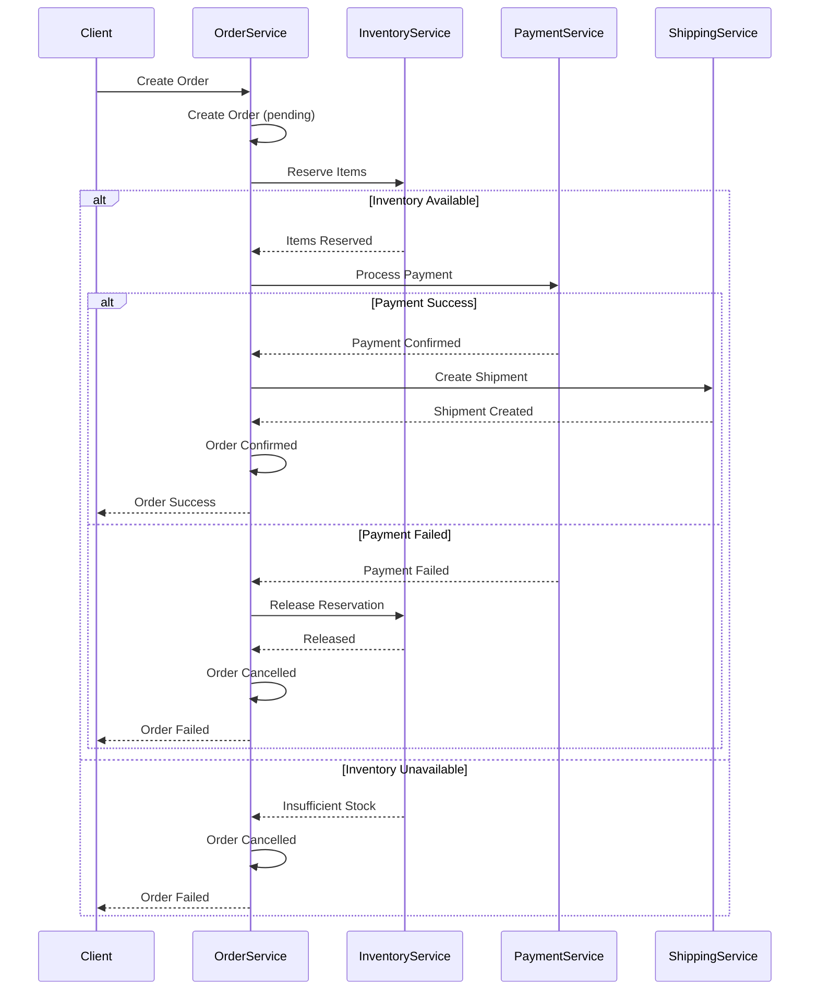

import { Accordion, Accordions } from "fumadocs-ui/components/accordion";
import { Callout } from "fumadocs-ui/components/callout";
import { File, Files, Folder } from "fumadocs-ui/components/files";
import { Step, Steps } from "fumadocs-ui/components/steps";
import { Tab, Tabs } from "fumadocs-ui/components/tabs";

## Overview

**Microservices Architecture** is an architectural style that structures an application as a collection of loosely coupled, independently deployable services. Each service is organized around business capabilities, owned by small teams, and communicates through well-defined APIs.

<Callout type="warn">
Microservices introduce significant operational complexity. Start with a well-designed monolith and extract services only when you have clear scaling, team, or deployment requirements that justify the overhead.
</Callout>



---

## Core Principles

### 1. Single Responsibility per Service

Each microservice should focus on one business capability:

```typescript
// ✅ Good: Single responsibility services

// User Service - handles user identity and profile
interface UserService {
  createUser(data: { email: string; name: string }): Promise<{ id: string }>;
  getUser(id: string): Promise<{ id: string; email: string; name: string } | null>;
  updateProfile(id: string, data: { name: string }): Promise<void>;
  authenticateUser(email: string, password: string): Promise<{ token: string }>;
}

// Order Service - handles order lifecycle
interface OrderService {
  createOrder(data: { customerId: string; items: Array<{ productId: string; quantity: number }> }): Promise<{ orderId: string }>;
  getOrder(id: string): Promise<Order | null>;
  cancelOrder(id: string): Promise<void>;
  updateOrderStatus(id: string, status: string): Promise<void>;
}

// Inventory Service - handles stock management
interface InventoryService {
  checkStock(productId: string): Promise<{ available: number }>;
  reserveStock(productId: string, quantity: number): Promise<{ reservationId: string }>;
  releaseReservation(reservationId: string): Promise<void>;
}

interface Order {
  id: string;
  customerId: string;
  status: string;
  items: Array<{ productId: string; quantity: number }>;
}

// ❌ Bad: God service with multiple responsibilities
// interface ECommerceService {
//   createUser(): Promise<void>;
//   createOrder(): Promise<void>;
//   processPayment(): Promise<void>;
//   sendNotification(): Promise<void>;
//   manageInventory(): Promise<void>;
// }
```

### 2. Database per Service

Each service owns and manages its own data:



```typescript
// Each service has its own database schema and connection

// User Service - PostgreSQL
interface UserRepository {
  findById(id: string): Promise<User | null>;
  findByEmail(email: string): Promise<User | null>;
  save(user: User): Promise<User>;
}

interface User {
  id: string;
  email: string;
  name: string;
  passwordHash: string;
}

// Order Service - MongoDB (document store for flexible order structure)
interface OrderRepository {
  findById(id: string): Promise<OrderDocument | null>;
  findByCustomer(customerId: string): Promise<OrderDocument[]>;
  save(order: OrderDocument): Promise<OrderDocument>;
}

interface OrderDocument {
  _id: string;
  customerId: string;
  status: string;
  items: Array<{
    productId: string;
    name: string; // Denormalized for query efficiency
    quantity: number;
    price: number;
  }>;
  shippingAddress: {
    street: string;
    city: string;
    country: string;
  };
  createdAt: Date;
}

// Product Service - PostgreSQL with Redis cache
interface ProductRepository {
  findById(id: string): Promise<Product | null>;
  search(query: string): Promise<Product[]>;
}

interface Product {
  id: string;
  name: string;
  price: number;
  category: string;
}

interface ProductCache {
  get(id: string): Promise<Product | null>;
  set(id: string, product: Product, ttl: number): Promise<void>;
  invalidate(id: string): Promise<void>;
}

const createCachedProductRepository = (
  repo: ProductRepository,
  cache: ProductCache
): ProductRepository => ({
  async findById(id: string) {
    // Check cache first
    const cached = await cache.get(id);
    if (cached) return cached;

    // Fetch from database
    const product = await repo.findById(id);
    if (product) {
      await cache.set(id, product, 3600); // Cache for 1 hour
    }
    return product;
  },

  search: repo.search, // Search bypasses cache
});
```

### 3. API-First Communication

Services communicate through well-defined APIs:

<Tabs items={['REST API', 'gRPC', 'GraphQL Federation']}>
<Tab value="REST API">
```typescript
// REST API communication between services

interface HttpClient {
  get<T>(url: string): Promise<T>;
  post<T>(url: string, body: unknown): Promise<T>;
  put<T>(url: string, body: unknown): Promise<T>;
  delete(url: string): Promise<void>;
}

// Service client for User Service
const createUserServiceClient = (httpClient: HttpClient, baseUrl: string) => ({
  async getUser(id: string) {
    return httpClient.get<{
      id: string;
      email: string;
      name: string;
    }>(`${baseUrl}/users/${id}`);
  },

  async validateToken(token: string) {
    return httpClient.post<{
      valid: boolean;
      userId: string;
    }>(`${baseUrl}/auth/validate`, { token });
  },
});

// Service client for Product Service
const createProductServiceClient = (httpClient: HttpClient, baseUrl: string) => ({
  async getProduct(id: string) {
    return httpClient.get<{
      id: string;
      name: string;
      price: number;
      stock: number;
    }>(`${baseUrl}/products/${id}`);
  },

  async getProducts(ids: string[]) {
    return httpClient.post<
      Array<{
        id: string;
        name: string;
        price: number;
      }>
    >(`${baseUrl}/products/batch`, { ids });
  },

  async reserveStock(productId: string, quantity: number) {
    return httpClient.post<{
      reservationId: string;
      expiresAt: string;
    }>(`${baseUrl}/products/${productId}/reserve`, { quantity });
  },
});

// Usage in Order Service
const createOrderWithProducts = async (
  order: { customerId: string; items: Array<{ productId: string; quantity: number }> },
  productClient: ReturnType<typeof createProductServiceClient>
) => {
  // Fetch product details
  const productIds = order.items.map((i) => i.productId);
  const products = await productClient.getProducts(productIds);

  // Reserve stock for each item
  const reservations = await Promise.all(
    order.items.map((item) =>
      productClient.reserveStock(item.productId, item.quantity)
    )
  );

  return { products, reservations };
};
```
</Tab>

<Tab value="gRPC">
```typescript
// gRPC service definitions (Protocol Buffers style)

// user.proto equivalent types
interface UserServiceProto {
  GetUser(request: GetUserRequest): Promise<UserResponse>;
  CreateUser(request: CreateUserRequest): Promise<UserResponse>;
  ValidateToken(request: ValidateTokenRequest): Promise<TokenValidationResponse>;
}

interface GetUserRequest {
  userId: string;
}

interface CreateUserRequest {
  email: string;
  name: string;
  password: string;
}

interface UserResponse {
  id: string;
  email: string;
  name: string;
  createdAt: string;
}

interface ValidateTokenRequest {
  token: string;
}

interface TokenValidationResponse {
  valid: boolean;
  userId: string;
  expiresAt: string;
}

// gRPC Client wrapper
interface GrpcClient<T> {
  call<K extends keyof T>(
    method: K,
    request: T[K] extends (req: infer R) => unknown ? R : never
  ): Promise<T[K] extends (req: unknown) => Promise<infer Res> ? Res : never>;
}

// Simulated gRPC client
const createGrpcClient = <T>(_serviceUrl: string): GrpcClient<T> => ({
  async call(_method, _request) {
    // In real implementation, would use @grpc/grpc-js
    throw new Error("Not implemented");
  },
});

// Usage
const userClient = createGrpcClient<UserServiceProto>("user-service:50051");

const getUserViaGrpc = async (userId: string): Promise<UserResponse> => {
  return userClient.call("GetUser", { userId });
};

// Benefits of gRPC:
// - Strong typing via Protocol Buffers
// - Efficient binary serialization
// - Built-in streaming support
// - Code generation for multiple languages
```
</Tab>

<Tab value="GraphQL Federation">
```typescript
// GraphQL Federation - composing multiple services into one graph

// User Service subgraph
const userTypeDefs = `
  type User @key(fields: "id") {
    id: ID!
    email: String!
    name: String!
    createdAt: DateTime!
  }

  type Query {
    user(id: ID!): User
    me: User
  }

  type Mutation {
    createUser(input: CreateUserInput!): User!
    updateProfile(input: UpdateProfileInput!): User!
  }
`;

// Order Service subgraph - extends User
const orderTypeDefs = `
  type Order @key(fields: "id") {
    id: ID!
    status: OrderStatus!
    items: [OrderItem!]!
    total: Float!
    createdAt: DateTime!
  }

  type OrderItem {
    product: Product!
    quantity: Int!
    price: Float!
  }

  extend type User @key(fields: "id") {
    id: ID! @external
    orders: [Order!]!
    recentOrders(limit: Int): [Order!]!
  }

  type Query {
    order(id: ID!): Order
  }
`;

// Product Service subgraph
const productTypeDefs = `
  type Product @key(fields: "id") {
    id: ID!
    name: String!
    description: String
    price: Float!
    stock: Int!
    category: Category!
  }

  type Category {
    id: ID!
    name: String!
    products: [Product!]!
  }

  type Query {
    product(id: ID!): Product
    products(category: ID, search: String): [Product!]!
  }
`;

// Resolver for User's orders (in Order Service)
interface User {
  id: string;
}

interface Order {
  id: string;
  userId: string;
  status: string;
  createdAt: Date;
}

interface OrderRepository {
  findByUserId(userId: string): Promise<Order[]>;
}

const createUserOrdersResolver = (orderRepo: OrderRepository) => ({
  User: {
    orders: async (user: User) => {
      return orderRepo.findByUserId(user.id);
    },
    recentOrders: async (user: User, args: { limit?: number }) => {
      const orders = await orderRepo.findByUserId(user.id);
      return orders.slice(0, args.limit ?? 5);
    },
  },
});

// Federation benefits:
// - Single endpoint for clients
// - Services can extend other service types
// - Automatic query planning across services
// - Strong typing throughout
```
</Tab>
</Tabs>

---

## Communication Patterns

### Synchronous Communication

```typescript
// Synchronous request-response with retry and circuit breaker

interface CircuitBreakerConfig {
  failureThreshold: number;
  resetTimeout: number;
}

interface RetryConfig {
  maxRetries: number;
  baseDelay: number;
  maxDelay: number;
}

type CircuitState = "closed" | "open" | "half-open";

const createCircuitBreaker = (config: CircuitBreakerConfig) => {
  let state: CircuitState = "closed";
  let failures = 0;
  let lastFailure = 0;

  return {
    async execute<T>(fn: () => Promise<T>): Promise<T> {
      if (state === "open") {
        const timeSinceFailure = Date.now() - lastFailure;
        if (timeSinceFailure > config.resetTimeout) {
          state = "half-open";
        } else {
          throw new Error("Circuit breaker is open");
        }
      }

      try {
        const result = await fn();
        if (state === "half-open") {
          state = "closed";
          failures = 0;
        }
        return result;
      } catch (error) {
        failures++;
        lastFailure = Date.now();

        if (failures >= config.failureThreshold) {
          state = "open";
        }
        throw error;
      }
    },

    getState: () => state,
  };
};

const createRetryableClient = (config: RetryConfig) => {
  const delay = (ms: number) => new Promise((r) => setTimeout(r, ms));

  return async <T>(fn: () => Promise<T>): Promise<T> => {
    let lastError: Error | null = null;

    for (let attempt = 0; attempt <= config.maxRetries; attempt++) {
      try {
        return await fn();
      } catch (error) {
        lastError = error instanceof Error ? error : new Error(String(error));

        if (attempt < config.maxRetries) {
          const waitTime = Math.min(
            config.baseDelay * Math.pow(2, attempt),
            config.maxDelay
          );
          await delay(waitTime);
        }
      }
    }

    throw lastError;
  };
};

// Usage: Resilient service client
interface ServiceClient {
  get<T>(url: string): Promise<T>;
}

const createResilientClient = (
  client: ServiceClient,
  circuitBreaker: ReturnType<typeof createCircuitBreaker>,
  retry: ReturnType<typeof createRetryableClient>
): ServiceClient => ({
  async get<T>(url: string): Promise<T> {
    return circuitBreaker.execute(() => retry(() => client.get<T>(url)));
  },
});
```

### Asynchronous Communication (Event-Driven)

```typescript
// Event-driven communication between services

// Event types
interface DomainEvent {
  id: string;
  type: string;
  timestamp: Date;
  aggregateId: string;
  payload: unknown;
}

interface OrderCreatedEvent extends DomainEvent {
  type: "OrderCreated";
  payload: {
    orderId: string;
    customerId: string;
    items: Array<{ productId: string; quantity: number; price: number }>;
    total: number;
  };
}

interface PaymentProcessedEvent extends DomainEvent {
  type: "PaymentProcessed";
  payload: {
    orderId: string;
    paymentId: string;
    amount: number;
    status: "success" | "failed";
  };
}

interface InventoryReservedEvent extends DomainEvent {
  type: "InventoryReserved";
  payload: {
    orderId: string;
    reservations: Array<{ productId: string; quantity: number }>;
  };
}

// Event Publisher
interface EventPublisher {
  publish(event: DomainEvent): Promise<void>;
  publishBatch(events: DomainEvent[]): Promise<void>;
}

const createKafkaPublisher = (config: {
  brokers: string[];
  topic: string;
}): EventPublisher => ({
  async publish(event) {
    console.log(`Publishing to ${config.topic}:`, event.type);
    // await producer.send({ topic, messages: [{ value: JSON.stringify(event) }] })
  },

  async publishBatch(events) {
    console.log(`Publishing ${events.length} events to ${config.topic}`);
    // await producer.sendBatch(...)
  },
});

// Event Consumer
type EventHandler<T extends DomainEvent> = (event: T) => Promise<void>;

interface EventConsumer {
  subscribe<T extends DomainEvent>(
    eventType: T["type"],
    handler: EventHandler<T>
  ): void;
  start(): Promise<void>;
  stop(): Promise<void>;
}

const createEventConsumer = (_config: {
  brokers: string[];
  groupId: string;
  topics: string[];
}): EventConsumer => {
  const handlers = new Map<string, EventHandler<DomainEvent>>();

  return {
    subscribe(eventType, handler) {
      handlers.set(eventType, handler as EventHandler<DomainEvent>);
    },

    async start() {
      console.log("Starting consumer...");
      // In real implementation:
      // consumer.run({
      //   eachMessage: async ({ message }) => {
      //     const event = JSON.parse(message.value.toString());
      //     const handler = handlers.get(event.type);
      //     if (handler) await handler(event);
      //   }
      // });
    },

    async stop() {
      console.log("Stopping consumer...");
    },
  };
};

// Example: Order Service publishing events
interface Order {
  id: string;
  customerId: string;
  items: Array<{ productId: string; quantity: number; price: number }>;
  getTotal(): number;
}

const orderService = (publisher: EventPublisher) => ({
  async createOrder(order: Order) {
    // Save order...

    // Publish event for other services
    await publisher.publish({
      id: crypto.randomUUID(),
      type: "OrderCreated",
      timestamp: new Date(),
      aggregateId: order.id,
      payload: {
        orderId: order.id,
        customerId: order.customerId,
        items: order.items,
        total: order.getTotal(),
      },
    } satisfies OrderCreatedEvent);
  },
});

// Example: Notification Service consuming events
const notificationConsumer = (consumer: EventConsumer) => {
  consumer.subscribe<OrderCreatedEvent>("OrderCreated", async (event) => {
    console.log(`Sending order confirmation for ${event.payload.orderId}`);
    // Send email, push notification, etc.
  });

  consumer.subscribe<PaymentProcessedEvent>("PaymentProcessed", async (event) => {
    if (event.payload.status === "success") {
      console.log(`Payment confirmed for order ${event.payload.orderId}`);
    } else {
      console.log(`Payment failed for order ${event.payload.orderId}`);
    }
  });

  return consumer;
};
```

---

## Saga Pattern for Distributed Transactions



```typescript
// Saga Pattern Implementation - Orchestrator Style

interface SagaStep<TContext> {
  name: string;
  execute(context: TContext): Promise<TContext>;
  compensate(context: TContext): Promise<TContext>;
}

interface SagaResult<TContext> {
  success: boolean;
  context: TContext;
  failedStep?: string;
  error?: Error;
}

const createSagaOrchestrator = <TContext>() => {
  const steps: SagaStep<TContext>[] = [];

  return {
    addStep(step: SagaStep<TContext>) {
      steps.push(step);
      return this;
    },

    async execute(initialContext: TContext): Promise<SagaResult<TContext>> {
      let context = initialContext;
      const executedSteps: SagaStep<TContext>[] = [];

      try {
        for (const step of steps) {
          console.log(`Executing step: ${step.name}`);
          context = await step.execute(context);
          executedSteps.push(step);
        }

        return { success: true, context };
      } catch (error) {
        console.log("Saga failed, starting compensation...");

        // Compensate in reverse order
        for (const step of executedSteps.reverse()) {
          try {
            console.log(`Compensating step: ${step.name}`);
            context = await step.compensate(context);
          } catch (compensateError) {
            console.error(`Compensation failed for ${step.name}:`, compensateError);
            // In production, would need manual intervention or retry
          }
        }

        return {
          success: false,
          context,
          failedStep: executedSteps[executedSteps.length - 1]?.name,
          error: error instanceof Error ? error : new Error(String(error)),
        };
      }
    },
  };
};

// Order Saga Implementation
interface OrderSagaContext {
  orderId: string;
  customerId: string;
  items: Array<{ productId: string; quantity: number; price: number }>;
  reservationId?: string;
  paymentId?: string;
  shipmentId?: string;
}

// Service interfaces
interface InventoryService {
  reserve(items: Array<{ productId: string; quantity: number }>): Promise<string>;
  release(reservationId: string): Promise<void>;
}

interface PaymentService {
  charge(customerId: string, amount: number): Promise<string>;
  refund(paymentId: string): Promise<void>;
}

interface ShippingService {
  createShipment(orderId: string): Promise<string>;
  cancelShipment(shipmentId: string): Promise<void>;
}

const createOrderSaga = (
  inventoryService: InventoryService,
  paymentService: PaymentService,
  shippingService: ShippingService
) => {
  const saga = createSagaOrchestrator<OrderSagaContext>();

  // Step 1: Reserve Inventory
  saga.addStep({
    name: "ReserveInventory",
    async execute(ctx) {
      const reservationId = await inventoryService.reserve(ctx.items);
      return { ...ctx, reservationId };
    },
    async compensate(ctx) {
      if (ctx.reservationId) {
        await inventoryService.release(ctx.reservationId);
      }
      return { ...ctx, reservationId: undefined };
    },
  });

  // Step 2: Process Payment
  saga.addStep({
    name: "ProcessPayment",
    async execute(ctx) {
      const total = ctx.items.reduce((sum, item) => sum + item.price * item.quantity, 0);
      const paymentId = await paymentService.charge(ctx.customerId, total);
      return { ...ctx, paymentId };
    },
    async compensate(ctx) {
      if (ctx.paymentId) {
        await paymentService.refund(ctx.paymentId);
      }
      return { ...ctx, paymentId: undefined };
    },
  });

  // Step 3: Create Shipment
  saga.addStep({
    name: "CreateShipment",
    async execute(ctx) {
      const shipmentId = await shippingService.createShipment(ctx.orderId);
      return { ...ctx, shipmentId };
    },
    async compensate(ctx) {
      if (ctx.shipmentId) {
        await shippingService.cancelShipment(ctx.shipmentId);
      }
      return { ...ctx, shipmentId: undefined };
    },
  });

  return saga;
};

// Usage
const runOrderSaga = async (
  saga: ReturnType<typeof createOrderSaga>,
  orderData: OrderSagaContext
) => {
  const result = await saga.execute(orderData);

  if (result.success) {
    console.log("Order completed successfully!", result.context);
  } else {
    console.log("Order failed:", result.error?.message);
    console.log("All compensations applied");
  }

  return result;
};
```

---

## Service Discovery and Load Balancing

```typescript
// Service Discovery Pattern

interface ServiceInstance {
  id: string;
  name: string;
  host: string;
  port: number;
  metadata: Record<string, string>;
  health: "healthy" | "unhealthy" | "unknown";
  lastHeartbeat: Date;
}

interface ServiceRegistry {
  register(instance: Omit<ServiceInstance, "id" | "lastHeartbeat">): Promise<string>;
  deregister(instanceId: string): Promise<void>;
  discover(serviceName: string): Promise<ServiceInstance[]>;
  heartbeat(instanceId: string): Promise<void>;
}

// Simple in-memory registry (for demonstration)
const createServiceRegistry = (): ServiceRegistry => {
  const instances = new Map<string, ServiceInstance>();

  return {
    async register(instance) {
      const id = crypto.randomUUID();
      instances.set(id, {
        ...instance,
        id,
        lastHeartbeat: new Date(),
      });
      return id;
    },

    async deregister(instanceId) {
      instances.delete(instanceId);
    },

    async discover(serviceName) {
      const now = Date.now();
      return Array.from(instances.values())
        .filter((i) => i.name === serviceName)
        .filter((i) => now - i.lastHeartbeat.getTime() < 30000) // 30s timeout
        .filter((i) => i.health === "healthy");
    },

    async heartbeat(instanceId) {
      const instance = instances.get(instanceId);
      if (instance) {
        instance.lastHeartbeat = new Date();
      }
    },
  };
};

// Load Balancer
type LoadBalancingStrategy = "round-robin" | "random" | "least-connections";

interface LoadBalancer {
  selectInstance(instances: ServiceInstance[]): ServiceInstance | null;
}

const createRoundRobinBalancer = (): LoadBalancer => {
  let currentIndex = 0;

  return {
    selectInstance(instances) {
      if (instances.length === 0) return null;
      const instance = instances[currentIndex % instances.length];
      currentIndex++;
      return instance;
    },
  };
};

const createRandomBalancer = (): LoadBalancer => ({
  selectInstance(instances) {
    if (instances.length === 0) return null;
    const index = Math.floor(Math.random() * instances.length);
    return instances[index];
  },
});

// Service Client with Discovery
const createDiscoverableClient = (
  registry: ServiceRegistry,
  loadBalancer: LoadBalancer
) => {
  return async <T>(
    serviceName: string,
    path: string,
    request: (url: string) => Promise<T>
  ): Promise<T> => {
    const instances = await registry.discover(serviceName);

    if (instances.length === 0) {
      throw new Error(`No healthy instances found for ${serviceName}`);
    }

    const instance = loadBalancer.selectInstance(instances);
    if (!instance) {
      throw new Error(`Load balancer returned no instance`);
    }

    const url = `http://${instance.host}:${instance.port}${path}`;
    return request(url);
  };
};
```

---

## API Gateway Pattern

```typescript
// API Gateway Implementation

interface GatewayRoute {
  path: string;
  method: string;
  serviceName: string;
  servicePath: string;
  rateLimit?: { requests: number; window: number };
  auth?: boolean;
  cache?: { ttl: number };
}

interface RateLimiter {
  isAllowed(key: string, limit: number, window: number): Promise<boolean>;
}

interface AuthService {
  validateToken(token: string): Promise<{ userId: string; roles: string[] } | null>;
}

interface ServiceClient {
  request(serviceName: string, path: string, options: RequestInit): Promise<Response>;
}

interface CacheService {
  get<T>(key: string): Promise<T | null>;
  set<T>(key: string, value: T, ttl: number): Promise<void>;
}

const createApiGateway = (
  routes: GatewayRoute[],
  deps: {
    serviceClient: ServiceClient;
    rateLimiter: RateLimiter;
    authService: AuthService;
    cache: CacheService;
  }
) => {
  const findRoute = (method: string, path: string) => {
    return routes.find((r) => r.method === method && matchPath(r.path, path));
  };

  const matchPath = (pattern: string, path: string): boolean => {
    // Simplified path matching
    const regex = new RegExp(
      "^" + pattern.replace(/:\w+/g, "[^/]+") + "$"
    );
    return regex.test(path);
  };

  const extractPathParams = (pattern: string, path: string): Record<string, string> => {
    const params: Record<string, string> = {};
    const patternParts = pattern.split("/");
    const pathParts = path.split("/");

    patternParts.forEach((part, i) => {
      if (part.startsWith(":")) {
        params[part.slice(1)] = pathParts[i];
      }
    });

    return params;
  };

  return async (request: Request): Promise<Response> => {
    const url = new URL(request.url);
    const route = findRoute(request.method, url.pathname);

    if (!route) {
      return new Response(JSON.stringify({ error: "Not Found" }), {
        status: 404,
        headers: { "Content-Type": "application/json" },
      });
    }

    // Rate limiting
    if (route.rateLimit) {
      const clientIp = request.headers.get("x-forwarded-for") ?? "unknown";
      const allowed = await deps.rateLimiter.isAllowed(
        `${clientIp}:${route.path}`,
        route.rateLimit.requests,
        route.rateLimit.window
      );

      if (!allowed) {
        return new Response(JSON.stringify({ error: "Rate limit exceeded" }), {
          status: 429,
          headers: { "Content-Type": "application/json" },
        });
      }
    }

    // Authentication
    if (route.auth) {
      const authHeader = request.headers.get("authorization");
      if (!authHeader?.startsWith("Bearer ")) {
        return new Response(JSON.stringify({ error: "Unauthorized" }), {
          status: 401,
          headers: { "Content-Type": "application/json" },
        });
      }

      const token = authHeader.slice(7);
      const user = await deps.authService.validateToken(token);

      if (!user) {
        return new Response(JSON.stringify({ error: "Invalid token" }), {
          status: 401,
          headers: { "Content-Type": "application/json" },
        });
      }
    }

    // Caching (for GET requests)
    if (route.cache && request.method === "GET") {
      const cacheKey = `${route.serviceName}:${url.pathname}`;
      const cached = await deps.cache.get<{ body: string; status: number }>(cacheKey);

      if (cached) {
        return new Response(cached.body, {
          status: cached.status,
          headers: { "Content-Type": "application/json", "X-Cache": "HIT" },
        });
      }
    }

    // Build service path with params
    const params = extractPathParams(route.path, url.pathname);
    let servicePath = route.servicePath;
    for (const [key, value] of Object.entries(params)) {
      servicePath = servicePath.replace(`:${key}`, value);
    }

    // Forward to service
    const response = await deps.serviceClient.request(
      route.serviceName,
      servicePath,
      {
        method: request.method,
        headers: request.headers,
        body: request.body,
      }
    );

    // Cache response if configured
    if (route.cache && request.method === "GET" && response.ok) {
      const body = await response.clone().text();
      await deps.cache.set(
        `${route.serviceName}:${url.pathname}`,
        { body, status: response.status },
        route.cache.ttl
      );
    }

    return response;
  };
};

// Gateway route configuration
const gatewayRoutes: GatewayRoute[] = [
  {
    path: "/api/users/:id",
    method: "GET",
    serviceName: "user-service",
    servicePath: "/users/:id",
    cache: { ttl: 300 },
  },
  {
    path: "/api/orders",
    method: "POST",
    serviceName: "order-service",
    servicePath: "/orders",
    auth: true,
    rateLimit: { requests: 10, window: 60 },
  },
  {
    path: "/api/products",
    method: "GET",
    serviceName: "product-service",
    servicePath: "/products",
    cache: { ttl: 60 },
  },
];
```

---

## Project Structure

### Individual Service Structure

<Files>
  <Folder name="order-service" defaultOpen>
    <Folder name="src" defaultOpen>
      <Folder name="api" defaultOpen>
        <File name="routes.ts" />
        <Folder name="handlers">
          <File name="create-order.ts" />
          <File name="get-order.ts" />
          <File name="update-status.ts" />
        </Folder>
        <Folder name="middleware">
          <File name="auth.ts" />
          <File name="validation.ts" />
        </Folder>
      </Folder>
      <Folder name="domain" defaultOpen>
        <Folder name="entities">
          <File name="order.ts" />
          <File name="order-item.ts" />
        </Folder>
        <Folder name="events">
          <File name="order-created.ts" />
          <File name="order-confirmed.ts" />
        </Folder>
        <Folder name="services">
          <File name="order-service.ts" />
        </Folder>
      </Folder>
      <Folder name="infrastructure" defaultOpen>
        <Folder name="database">
          <File name="connection.ts" />
          <File name="order-repository.ts" />
        </Folder>
        <Folder name="messaging">
          <File name="event-publisher.ts" />
          <File name="event-consumer.ts" />
        </Folder>
        <Folder name="clients">
          <File name="product-service.ts" />
          <File name="user-service.ts" />
        </Folder>
      </Folder>
      <File name="app.ts" />
      <File name="config.ts" />
    </Folder>
    <Folder name="tests">
      <File name="order.test.ts" />
      <File name="integration.test.ts" />
    </Folder>
    <File name="Dockerfile" />
    <File name="package.json" />
    <File name="tsconfig.json" />
  </Folder>
</Files>

### Monorepo Structure

<Files>
  <Folder name="microservices-platform" defaultOpen>
    <Folder name="services" defaultOpen>
      <Folder name="api-gateway">
        <File name="package.json" />
        <Folder name="src">
          <File name="app.ts" />
        </Folder>
      </Folder>
      <Folder name="user-service">
        <File name="package.json" />
        <Folder name="src">
          <File name="app.ts" />
        </Folder>
      </Folder>
      <Folder name="order-service">
        <File name="package.json" />
        <Folder name="src">
          <File name="app.ts" />
        </Folder>
      </Folder>
      <Folder name="product-service">
        <File name="package.json" />
        <Folder name="src">
          <File name="app.ts" />
        </Folder>
      </Folder>
    </Folder>
    <Folder name="packages" defaultOpen>
      <Folder name="shared-types">
        <File name="package.json" />
        <File name="events.ts" />
        <File name="dtos.ts" />
      </Folder>
      <Folder name="service-client">
        <File name="package.json" />
        <File name="http-client.ts" />
      </Folder>
      <Folder name="logging">
        <File name="package.json" />
        <File name="logger.ts" />
      </Folder>
    </Folder>
    <Folder name="infrastructure">
      <Folder name="docker">
        <File name="docker-compose.yml" />
        <File name="docker-compose.dev.yml" />
      </Folder>
      <Folder name="k8s">
        <File name="deployment.yaml" />
        <File name="services.yaml" />
        <File name="ingress.yaml" />
      </Folder>
    </Folder>
    <File name="package.json" />
    <File name="turbo.json" />
  </Folder>
</Files>

---

## Observability

### Distributed Tracing

```typescript
// Distributed tracing implementation

interface Span {
  traceId: string;
  spanId: string;
  parentSpanId?: string;
  operationName: string;
  serviceName: string;
  startTime: number;
  endTime?: number;
  tags: Record<string, string>;
  logs: Array<{ timestamp: number; message: string }>;
}

interface Tracer {
  startSpan(operationName: string, parentContext?: SpanContext): SpanContext;
  finishSpan(context: SpanContext): void;
  injectContext(context: SpanContext, headers: Headers): void;
  extractContext(headers: Headers): SpanContext | null;
}

interface SpanContext {
  traceId: string;
  spanId: string;
  span: Span;
}

const createTracer = (serviceName: string): Tracer => {
  const spans: Span[] = [];

  return {
    startSpan(operationName, parentContext) {
      const span: Span = {
        traceId: parentContext?.traceId ?? crypto.randomUUID(),
        spanId: crypto.randomUUID(),
        parentSpanId: parentContext?.spanId,
        operationName,
        serviceName,
        startTime: Date.now(),
        tags: {},
        logs: [],
      };

      spans.push(span);

      return {
        traceId: span.traceId,
        spanId: span.spanId,
        span,
      };
    },

    finishSpan(context) {
      context.span.endTime = Date.now();
      console.log("Span completed:", {
        traceId: context.traceId,
        spanId: context.spanId,
        operation: context.span.operationName,
        duration: context.span.endTime - context.span.startTime,
      });
    },

    injectContext(context, headers) {
      headers.set("x-trace-id", context.traceId);
      headers.set("x-span-id", context.spanId);
    },

    extractContext(headers) {
      const traceId = headers.get("x-trace-id");
      const spanId = headers.get("x-span-id");

      if (!traceId || !spanId) return null;

      return {
        traceId,
        spanId,
        span: {} as Span, // Placeholder for extracted context
      };
    },
  };
};

// Middleware for automatic tracing
const createTracingMiddleware = (tracer: Tracer) => {
  return async (
    request: Request,
    next: (request: Request) => Promise<Response>
  ): Promise<Response> => {
    const parentContext = tracer.extractContext(request.headers);
    const context = tracer.startSpan(
      `${request.method} ${new URL(request.url).pathname}`,
      parentContext ?? undefined
    );

    context.span.tags["http.method"] = request.method;
    context.span.tags["http.url"] = request.url;

    try {
      const response = await next(request);
      context.span.tags["http.status_code"] = response.status.toString();
      return response;
    } catch (error) {
      context.span.tags["error"] = "true";
      context.span.logs.push({
        timestamp: Date.now(),
        message: error instanceof Error ? error.message : "Unknown error",
      });
      throw error;
    } finally {
      tracer.finishSpan(context);
    }
  };
};
```

### Health Checks

```typescript
// Health check implementation

interface HealthCheck {
  name: string;
  check(): Promise<HealthCheckResult>;
}

interface HealthCheckResult {
  status: "healthy" | "unhealthy" | "degraded";
  message?: string;
  details?: Record<string, unknown>;
}

interface ServiceHealth {
  status: "healthy" | "unhealthy" | "degraded";
  timestamp: string;
  version: string;
  checks: Record<string, HealthCheckResult>;
}

const createHealthChecker = (checks: HealthCheck[], version: string) => {
  return async (): Promise<ServiceHealth> => {
    const results: Record<string, HealthCheckResult> = {};
    let overallStatus: ServiceHealth["status"] = "healthy";

    await Promise.all(
      checks.map(async (check) => {
        try {
          const result = await check.check();
          results[check.name] = result;

          if (result.status === "unhealthy") {
            overallStatus = "unhealthy";
          } else if (result.status === "degraded" && overallStatus !== "unhealthy") {
            overallStatus = "degraded";
          }
        } catch (error) {
          results[check.name] = {
            status: "unhealthy",
            message: error instanceof Error ? error.message : "Check failed",
          };
          overallStatus = "unhealthy";
        }
      })
    );

    return {
      status: overallStatus,
      timestamp: new Date().toISOString(),
      version,
      checks: results,
    };
  };
};

// Database health check
const createDatabaseHealthCheck = (pool: {
  query: (sql: string) => Promise<unknown>;
}): HealthCheck => ({
  name: "database",
  async check() {
    try {
      await pool.query("SELECT 1");
      return { status: "healthy" };
    } catch (error) {
      return {
        status: "unhealthy",
        message: error instanceof Error ? error.message : "Database unavailable",
      };
    }
  },
});

// Redis health check
const createRedisHealthCheck = (client: {
  ping: () => Promise<string>;
}): HealthCheck => ({
  name: "redis",
  async check() {
    try {
      const response = await client.ping();
      if (response === "PONG") {
        return { status: "healthy" };
      }
      return { status: "degraded", message: "Unexpected ping response" };
    } catch (error) {
      return {
        status: "unhealthy",
        message: error instanceof Error ? error.message : "Redis unavailable",
      };
    }
  },
});

// Dependency service health check
const createServiceHealthCheck = (
  serviceName: string,
  healthUrl: string,
  httpClient: { get: <T>(url: string) => Promise<T> }
): HealthCheck => ({
  name: serviceName,
  async check() {
    try {
      const response = await httpClient.get<{ status: string }>(healthUrl);
      return {
        status: response.status === "healthy" ? "healthy" : "degraded",
      };
    } catch {
      return { status: "degraded", message: `${serviceName} unreachable` };
    }
  },
});
```

---

## Advantages and Disadvantages

<Accordions>
<Accordion title="✅ When to Use Microservices">

**Ideal Scenarios:**
- **Large teams** - multiple teams can work independently
- **Different scaling requirements** - scale services independently
- **Technology diversity** - use best tools for each service
- **Rapid deployment** - deploy services independently
- **Complex domains** - align services with business capabilities
- **High availability requirements** - isolate failures

**Benefits:**
- Independent deployment and scaling
- Technology flexibility per service
- Better fault isolation
- Easier to understand individual services
- Parallel development by multiple teams

</Accordion>

<Accordion title="❌ When to Avoid Microservices">

**Avoid When:**
- **Small teams** - overhead outweighs benefits
- **Simple domains** - unnecessary complexity
- **Tight deadlines** - distributed systems are harder
- **Limited DevOps maturity** - requires sophisticated tooling
- **Unclear domain boundaries** - will lead to wrong splits

**Drawbacks:**
- Increased operational complexity
- Distributed system challenges (network, consistency)
- Data management complexity
- Testing complexity (integration, e2e)
- Debugging and monitoring overhead

</Accordion>

<Accordion title="🔄 Migration from Monolith">

**Strangler Fig Pattern:**
1. Identify bounded contexts in monolith
2. Create new microservice for one context
3. Route traffic to new service gradually
4. Repeat until monolith is replaced

**Branch by Abstraction:**
1. Create abstraction layer in monolith
2. Implement new service behind abstraction
3. Switch implementations gradually
4. Remove old implementation

**Key Considerations:**
- Start with non-critical services
- Maintain data consistency during transition
- Plan for fallback to monolith
- Monitor performance differences

</Accordion>
</Accordions>

---

## Best Practices

<Steps>

<Step>
### Design Around Business Capabilities

Align service boundaries with business domains, not technical layers. Use Domain-Driven Design to identify bounded contexts.
</Step>

<Step>
### Embrace Eventual Consistency

Accept that data won't always be immediately consistent across services. Design for eventual consistency using events and sagas.
</Step>

<Step>
### Implement Robust Observability

Use distributed tracing, centralized logging, and metrics to understand system behavior across services.
</Step>

<Step>
### Design for Failure

Implement circuit breakers, retries with backoff, timeouts, and graceful degradation. Assume any service can fail at any time.
</Step>

<Step>
### Automate Everything

CI/CD pipelines, infrastructure as code, and automated testing are essential for managing multiple services effectively.
</Step>

</Steps>

## Related Patterns

- [Clean Architecture](/docs/architecture/clean/clean-architecture) - Internal service architecture
- [Hexagonal Architecture](/docs/architecture/clean/hexagonal) - Ports and adapters for integrations
- [Layered Architecture](/docs/architecture/clean/layered) - Traditional service internal structure
- [SOLID Principles](/docs/architecture/clean/solid) - Design principles for maintainable services
