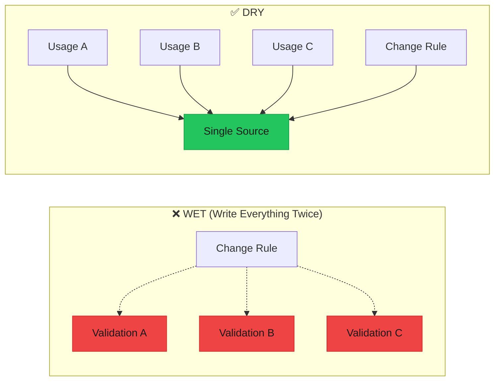
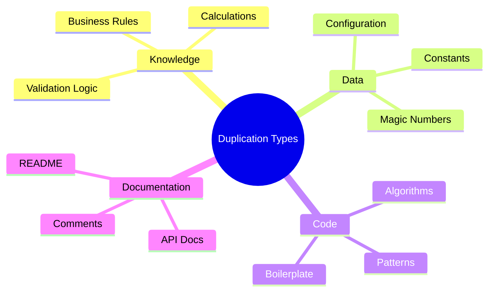

import { Accordion, Accordions } from "fumadocs-ui/components/accordion";
import { Callout } from "fumadocs-ui/components/callout";
import { Tab, Tabs } from "fumadocs-ui/components/tabs";

# DRY - Don't Repeat Yourself

> **"Every piece of knowledge must have a single, unambiguous, authoritative representation within a system."** — The Pragmatic Programmer

DRY is about eliminating duplication of **knowledge**, not just code. When the same business rule, algorithm, or configuration exists in multiple places, changes require updating all locations—a recipe for bugs and inconsistency.



---

## The Problem

### Scattered Knowledge

When the same logic or data appears in multiple places, maintenance becomes a nightmare.

```typescript
/**
 * ❌ BAD: Same knowledge duplicated across the codebase
 */

// --- File: userController.ts ---
const validateUserRegistration = (data: {
  email: string;
  password: string;
  age: number;
}) => {
  // Validation logic #1
  if (!data.email.includes("@")) {
    return { valid: false, error: "Invalid email format" };
  }
  if (data.password.length < 8) {
    return { valid: false, error: "Password must be at least 8 characters" };
  }
  if (data.age < 18 || data.age > 120) {
    return { valid: false, error: "Age must be between 18 and 120" };
  }
  return { valid: true };
};

// --- File: adminController.ts ---
const validateAdminUser = (data: {
  email: string;
  password: string;
  age: number;
  role: string;
}) => {
  // Same validation logic copied! #2
  if (!data.email.includes("@")) {
    return { valid: false, error: "Invalid email" }; // Slightly different message!
  }
  if (data.password.length < 8) {
    return { valid: false, error: "Password too short" }; // Different message!
  }
  if (data.age < 18 || data.age > 120) {
    return { valid: false, error: "Invalid age" };
  }
  // Additional admin validation
  if (!["admin", "superadmin"].includes(data.role)) {
    return { valid: false, error: "Invalid role" };
  }
  return { valid: true };
};

// --- File: profileUpdate.ts ---
const validateProfileUpdate = (data: { email: string; age: number }) => {
  // Same validation again! #3
  if (!data.email.includes("@")) {
    return { valid: false, error: "Email invalid" }; // Yet another message!
  }
  if (data.age < 18 || data.age > 120) {
    return { valid: false, error: "Age out of range" };
  }
  return { valid: true };
};

// --- File: shippingCalculator.ts ---
const calculateShipping = (weight: number) => {
  // Magic numbers duplicated
  if (weight > 50) return weight * 0.15;
  return weight * 0.10;
};

// --- File: orderProcessor.ts ---
const calculateOrderShipping = (items: { weight: number }[]) => {
  const totalWeight = items.reduce((sum, item) => sum + item.weight, 0);
  // Same magic numbers!
  if (totalWeight > 50) return totalWeight * 0.15;
  return totalWeight * 0.10;
};

// --- File: taxCalculator.ts ---
const calculateTax = (amount: number) => {
  return amount * 0.08; // Tax rate duplicated
};

// --- File: invoiceGenerator.ts ---
const generateInvoice = (subtotal: number) => {
  const tax = subtotal * 0.08; // Same tax rate!
  return { subtotal, tax, total: subtotal + tax };
};

// --- Problems ---
// 1. If email validation changes (e.g., add domain check), update 3+ places
// 2. If tax rate changes, find and update ALL occurrences
// 3. Inconsistent error messages confuse users
// 4. If age range changes, need to update multiple files
// 5. Tests must cover the same logic multiple times
```

---

## The Solution

### Single Source of Truth

<Tabs items={["Centralized Validation", "Configuration Objects", "Reusable Utilities", "Type-Driven DRY"]}>
<Tab value="Centralized Validation">

```typescript
/**
 * ✅ GOOD: Single source of truth for validation rules
 */

// --- validation/rules.ts ---
export interface ValidationRule<T> {
  validate: (value: T) => boolean;
  message: string;
  code: string;
}

export const EmailRules = {
  required: {
    validate: (email: string) => email.length > 0,
    message: "Email is required",
    code: "EMAIL_REQUIRED",
  },
  format: {
    validate: (email: string) => /^[^\s@]+@[^\s@]+\.[^\s@]+$/.test(email),
    message: "Invalid email format",
    code: "EMAIL_INVALID_FORMAT",
  },
  maxLength: {
    validate: (email: string) => email.length <= 255,
    message: "Email must be 255 characters or less",
    code: "EMAIL_TOO_LONG",
  },
} as const;

export const PasswordRules = {
  required: {
    validate: (password: string) => password.length > 0,
    message: "Password is required",
    code: "PASSWORD_REQUIRED",
  },
  minLength: {
    validate: (password: string) => password.length >= 8,
    message: "Password must be at least 8 characters",
    code: "PASSWORD_TOO_SHORT",
  },
  maxLength: {
    validate: (password: string) => password.length <= 128,
    message: "Password must be 128 characters or less",
    code: "PASSWORD_TOO_LONG",
  },
  hasUppercase: {
    validate: (password: string) => /[A-Z]/.test(password),
    message: "Password must contain at least one uppercase letter",
    code: "PASSWORD_NO_UPPERCASE",
  },
  hasNumber: {
    validate: (password: string) => /\d/.test(password),
    message: "Password must contain at least one number",
    code: "PASSWORD_NO_NUMBER",
  },
} as const;

export const AgeRules = {
  min: 18,
  max: 120,
  validate: (age: number) => age >= 18 && age <= 120,
  message: `Age must be between 18 and 120`,
  code: "AGE_OUT_OF_RANGE",
} as const;

export const RoleRules = {
  allowed: ["user", "admin", "superadmin"] as const,
  validate: (role: string) => ["user", "admin", "superadmin"].includes(role),
  message: "Invalid role",
  code: "ROLE_INVALID",
} as const;

// --- validation/validator.ts ---
type ValidationResult = 
  | { valid: true }
  | { valid: false; errors: { field: string; message: string; code: string }[] };

const createValidator = <T extends Record<string, unknown>>(
  schema: {
    [K in keyof T]?: ValidationRule<T[K]>[];
  }
) => {
  return (data: T): ValidationResult => {
    const errors: { field: string; message: string; code: string }[] = [];
    
    for (const [field, rules] of Object.entries(schema)) {
      if (!rules) continue;
      
      const value = data[field as keyof T];
      
      for (const rule of rules as ValidationRule<unknown>[]) {
        if (!rule.validate(value)) {
          errors.push({
            field,
            message: rule.message,
            code: rule.code,
          });
          break; // Stop at first error for this field
        }
      }
    }
    
    return errors.length === 0 
      ? { valid: true }
      : { valid: false, errors };
  };
};

// --- Create reusable validators ---
const validateUserRegistration = createValidator<{
  email: string;
  password: string;
  age: number;
}>({
  email: [EmailRules.required, EmailRules.format, EmailRules.maxLength],
  password: [
    PasswordRules.required,
    PasswordRules.minLength,
    PasswordRules.hasUppercase,
    PasswordRules.hasNumber,
  ],
  age: [AgeRules],
});

const validateAdminUser = createValidator<{
  email: string;
  password: string;
  age: number;
  role: string;
}>({
  email: [EmailRules.required, EmailRules.format],
  password: [PasswordRules.required, PasswordRules.minLength],
  age: [AgeRules],
  role: [RoleRules],
});

const validateProfileUpdate = createValidator<{
  email: string;
  age: number;
}>({
  email: [EmailRules.format],
  age: [AgeRules],
});

// Usage
const result = validateUserRegistration({
  email: "test@example.com",
  password: "Password123",
  age: 25,
});

if (!result.valid) {
  console.log("Errors:", result.errors);
}
```

</Tab>
<Tab value="Configuration Objects">

```typescript
/**
 * ✅ GOOD: Centralized configuration - single source of truth
 */

// --- config/constants.ts ---
export const ShippingConfig = {
  // Weight thresholds
  WEIGHT_THRESHOLD_KG: 50,
  HEAVY_PACKAGE_THRESHOLD_KG: 100,
  
  // Rates per kg
  STANDARD_RATE: 0.10,
  HEAVY_RATE: 0.15,
  EXPRESS_MULTIPLIER: 1.5,
  
  // Free shipping threshold
  FREE_SHIPPING_THRESHOLD_USD: 100,
  
  // Carriers
  CARRIERS: {
    STANDARD: "ground",
    EXPRESS: "air",
    OVERNIGHT: "priority",
  } as const,
} as const;

export const TaxConfig = {
  // Tax rates by region
  RATES: {
    US_FEDERAL: 0,
    US_CA: 0.0725,
    US_NY: 0.08,
    US_TX: 0.0625,
    EU_VAT: 0.20,
  } as const,
  
  // Default rate
  DEFAULT_RATE: 0.08,
  
  // Tax-free threshold
  TAX_FREE_THRESHOLD: 0,
  
  // Categories exempt from tax
  EXEMPT_CATEGORIES: ["groceries", "medicine", "education"] as const,
} as const;

export const UserConfig = {
  // Age limits
  MIN_AGE: 18,
  MAX_AGE: 120,
  
  // Password requirements
  PASSWORD_MIN_LENGTH: 8,
  PASSWORD_MAX_LENGTH: 128,
  
  // Session settings
  SESSION_DURATION_HOURS: 24,
  REFRESH_TOKEN_DAYS: 30,
  
  // Rate limiting
  MAX_LOGIN_ATTEMPTS: 5,
  LOCKOUT_DURATION_MINUTES: 15,
} as const;

// --- services/shippingCalculator.ts ---
// Uses centralized config
const calculateShipping = (weight: number): number => {
  if (weight > ShippingConfig.WEIGHT_THRESHOLD_KG) {
    return weight * ShippingConfig.HEAVY_RATE;
  }
  return weight * ShippingConfig.STANDARD_RATE;
};

const calculateOrderShipping = (
  items: { weight: number }[],
  subtotal: number
): number => {
  // Check for free shipping
  if (subtotal >= ShippingConfig.FREE_SHIPPING_THRESHOLD_USD) {
    return 0;
  }
  
  const totalWeight = items.reduce((sum, item) => sum + item.weight, 0);
  return calculateShipping(totalWeight);
};

// --- services/taxCalculator.ts ---
type TaxRegion = keyof typeof TaxConfig.RATES;

const getTaxRate = (region?: TaxRegion): number => {
  if (!region) return TaxConfig.DEFAULT_RATE;
  return TaxConfig.RATES[region] ?? TaxConfig.DEFAULT_RATE;
};

const calculateTax = (
  amount: number,
  region?: TaxRegion,
  category?: string
): number => {
  // Check if category is tax-exempt
  if (category && TaxConfig.EXEMPT_CATEGORIES.includes(category as typeof TaxConfig.EXEMPT_CATEGORIES[number])) {
    return 0;
  }
  
  const rate = getTaxRate(region);
  return amount * rate;
};

// --- services/invoiceGenerator.ts ---
interface InvoiceInput {
  items: { price: number; quantity: number; weight: number; category?: string }[];
  region?: TaxRegion;
}

interface Invoice {
  subtotal: number;
  tax: number;
  shipping: number;
  total: number;
}

const generateInvoice = (input: InvoiceInput): Invoice => {
  const subtotal = input.items.reduce(
    (sum, item) => sum + item.price * item.quantity,
    0
  );
  
  const tax = calculateTax(subtotal, input.region);
  const shipping = calculateOrderShipping(input.items, subtotal);
  
  return {
    subtotal,
    tax,
    shipping,
    total: subtotal + tax + shipping,
  };
};

// When tax rate changes, update ONE place: TaxConfig.RATES
// When shipping threshold changes, update ONE place: ShippingConfig
```

</Tab>
<Tab value="Reusable Utilities">

```typescript
/**
 * ✅ GOOD: Reusable utility functions - DRY patterns
 */

// --- utils/formatting.ts ---
export const formatCurrency = (
  amount: number,
  currency: string = "USD",
  locale: string = "en-US"
): string => {
  return new Intl.NumberFormat(locale, {
    style: "currency",
    currency,
  }).format(amount);
};

export const formatDate = (
  date: Date,
  format: "short" | "medium" | "long" = "medium",
  locale: string = "en-US"
): string => {
  const formatOptions: Record<string, Intl.DateTimeFormatOptions> = {
    short: { month: "numeric", day: "numeric", year: "2-digit" },
    medium: { month: "short", day: "numeric", year: "numeric" },
    long: { month: "long", day: "numeric", year: "numeric", weekday: "long" },
  };
  
  return new Intl.DateTimeFormat(locale, formatOptions[format]).format(date);
};

export const formatPhoneNumber = (phone: string): string => {
  const cleaned = phone.replace(/\D/g, "");
  const match = cleaned.match(/^(\d{3})(\d{3})(\d{4})$/);
  
  if (match) {
    return `(${match[1]}) ${match[2]}-${match[3]}`;
  }
  
  return phone;
};

// --- utils/strings.ts ---
export const slugify = (text: string): string => {
  return text
    .toLowerCase()
    .trim()
    .replace(/[^\w\s-]/g, "")
    .replace(/[\s_-]+/g, "-")
    .replace(/^-+|-+$/g, "");
};

export const truncate = (
  text: string,
  maxLength: number,
  suffix: string = "..."
): string => {
  if (text.length <= maxLength) return text;
  return text.slice(0, maxLength - suffix.length).trim() + suffix;
};

export const capitalize = (text: string): string => {
  return text.charAt(0).toUpperCase() + text.slice(1).toLowerCase();
};

export const titleCase = (text: string): string => {
  return text
    .split(" ")
    .map(word => capitalize(word))
    .join(" ");
};

// --- utils/arrays.ts ---
export const unique = <T>(arr: T[]): T[] => [...new Set(arr)];

export const groupBy = <T, K extends string | number | symbol>(
  arr: T[],
  keyFn: (item: T) => K
): Record<K, T[]> => {
  return arr.reduce((acc, item) => {
    const key = keyFn(item);
    if (!acc[key]) acc[key] = [];
    acc[key].push(item);
    return acc;
  }, {} as Record<K, T[]>);
};

export const chunk = <T>(arr: T[], size: number): T[][] => {
  const chunks: T[][] = [];
  for (let i = 0; i < arr.length; i += size) {
    chunks.push(arr.slice(i, i + size));
  }
  return chunks;
};

export const sortBy = <T>(arr: T[], key: keyof T, order: "asc" | "desc" = "asc"): T[] => {
  return [...arr].sort((a, b) => {
    const aVal = a[key];
    const bVal = b[key];
    
    if (aVal < bVal) return order === "asc" ? -1 : 1;
    if (aVal > bVal) return order === "asc" ? 1 : -1;
    return 0;
  });
};

// --- Usage across the codebase ---
// All formatting is consistent!

interface Order {
  id: string;
  total: number;
  date: Date;
  customer: { phone: string };
}

const formatOrderSummary = (order: Order): string => {
  return `
Order #${order.id}
Date: ${formatDate(order.date, "long")}
Total: ${formatCurrency(order.total)}
Contact: ${formatPhoneNumber(order.customer.phone)}
  `.trim();
};

interface Product {
  name: string;
  price: number;
  category: string;
}

const formatProductUrl = (product: Product): string => {
  return `/products/${slugify(product.category)}/${slugify(product.name)}`;
};

const formatProductCard = (product: Product): string => {
  return `
${titleCase(product.name)}
${formatCurrency(product.price)}
  `.trim();
};
```

</Tab>
<Tab value="Type-Driven DRY">

```typescript
/**
 * ✅ GOOD: Use TypeScript types to enforce DRY
 */

// --- types/user.ts ---
// Define the source of truth as a type
export interface User {
  id: string;
  email: string;
  name: string;
  role: "user" | "admin" | "superadmin";
  createdAt: Date;
  updatedAt: Date;
}

// Derive other types from the source
export type UserRole = User["role"];
export type CreateUserInput = Omit<User, "id" | "createdAt" | "updatedAt">;
export type UpdateUserInput = Partial<Omit<User, "id" | "createdAt" | "updatedAt">>;
export type PublicUser = Pick<User, "id" | "name" | "role">;

// --- types/order.ts ---
export interface OrderItem {
  productId: string;
  name: string;
  quantity: number;
  unitPrice: number;
}

export interface Order {
  id: string;
  customerId: string;
  items: OrderItem[];
  status: "pending" | "processing" | "shipped" | "delivered" | "cancelled";
  subtotal: number;
  tax: number;
  shipping: number;
  total: number;
  createdAt: Date;
  updatedAt: Date;
}

// Derive types
export type OrderStatus = Order["status"];
export type CreateOrderInput = Omit<Order, "id" | "createdAt" | "updatedAt" | "total"> & {
  items: Omit<OrderItem, "name">[];
};
export type OrderSummary = Pick<Order, "id" | "status" | "total" | "createdAt">;

// --- utils/typeHelpers.ts ---
// Generic type utilities for DRY type definitions

// Make all properties optional except specified ones
type PartialExcept<T, K extends keyof T> = Partial<Omit<T, K>> & Pick<T, K>;

// Make specified properties required
type RequireKeys<T, K extends keyof T> = T & Required<Pick<T, K>>;

// Extract array element type
type ArrayElement<T> = T extends readonly (infer U)[] ? U : never;

// Create a type with only specified keys
type OnlyKeys<T, K extends keyof T> = Pick<T, K>;

// --- repositories/userRepository.ts ---
// Repository uses derived types - changes to User propagate automatically

interface UserRepository {
  findById: (id: string) => Promise<User | null>;
  findByEmail: (email: string) => Promise<User | null>;
  create: (data: CreateUserInput) => Promise<User>;
  update: (id: string, data: UpdateUserInput) => Promise<User>;
  delete: (id: string) => Promise<void>;
}

// --- api/responses.ts ---
// API responses use derived types

interface ApiResponse<T> {
  success: boolean;
  data?: T;
  error?: string;
}

type UserResponse = ApiResponse<PublicUser>;
type UsersResponse = ApiResponse<PublicUser[]>;
type OrderResponse = ApiResponse<Order>;
type OrderSummaryResponse = ApiResponse<OrderSummary[]>;

// --- constants from types ---
// Extract constants from types to ensure consistency

const ORDER_STATUSES: OrderStatus[] = [
  "pending",
  "processing",
  "shipped",
  "delivered",
  "cancelled",
];

const USER_ROLES: UserRole[] = ["user", "admin", "superadmin"];

// Type-safe status transitions
const VALID_STATUS_TRANSITIONS: Record<OrderStatus, OrderStatus[]> = {
  pending: ["processing", "cancelled"],
  processing: ["shipped", "cancelled"],
  shipped: ["delivered"],
  delivered: [],
  cancelled: [],
};

const canTransitionTo = (
  current: OrderStatus,
  next: OrderStatus
): boolean => {
  return VALID_STATUS_TRANSITIONS[current].includes(next);
};

// When Order["status"] changes, TypeScript enforces updates everywhere!
```

</Tab>
</Tabs>

---

## DRY vs WET Analysis

### Types of Duplication



### When NOT to DRY

<Callout type="warn" title="Beware of Premature DRY">
Not all similar-looking code should be deduplicated. Code that is **coincidentally similar** but serves different purposes should remain separate.
</Callout>

```typescript
/**
 * ⚠️ CAREFUL: These LOOK similar but serve different purposes
 */

// User validation - for user registration
const validateUserAge = (age: number): boolean => {
  return age >= 18 && age <= 120;
};

// Product validation - for product catalog
const validateProductAge = (age: number): boolean => {
  // Years since manufacturing - different business rule!
  return age >= 0 && age <= 50;
};

// These use the same pattern but:
// 1. Different business rules
// 2. Will likely evolve independently
// 3. Abstracting them couples unrelated domains

// ❌ BAD: Forcing DRY on unrelated concepts
const validateAge = (
  age: number,
  type: "user" | "product"
): boolean => {
  // Now user and product validation are coupled!
  if (type === "user") return age >= 18 && age <= 120;
  if (type === "product") return age >= 0 && age <= 50;
  return false;
};

// ✅ GOOD: Keep them separate, they serve different purposes
// UserValidation.validateAge(...)
// ProductValidation.validateAge(...)
```

---

## The Rule of Three

> **Wait until you have three duplications before abstracting.**

```typescript
/**
 * Rule of Three in practice
 */

// First occurrence - just write it
const processUserOrder = (userId: string, items: string[]) => {
  // Specific logic for user orders
};

// Second occurrence - note the similarity, but don't abstract yet
const processGuestOrder = (guestId: string, items: string[]) => {
  // Specific logic for guest orders
  // Similar but might diverge
};

// Third occurrence - NOW consider abstracting
const processBulkOrder = (accountId: string, items: string[]) => {
  // Same pattern again - time to abstract!
};

// After third occurrence, extract the common pattern:
interface OrderProcessor {
  process: (accountId: string, items: string[]) => Promise<void>;
}

const createOrderProcessor = (type: "user" | "guest" | "bulk"): OrderProcessor => {
  return {
    async process(accountId, items) {
      // Shared logic with type-specific variations
      console.log(`Processing ${type} order for ${accountId}`);
      
      // Type-specific handling
      switch (type) {
        case "user":
          // User-specific logic
          break;
        case "guest":
          // Guest-specific logic
          break;
        case "bulk":
          // Bulk-specific logic
          break;
      }
    },
  };
};
```

---

## Use Cases & Problem Solving

<Accordions>
<Accordion title="When to Apply DRY">

### Apply DRY When:

1. **Same business rule in multiple places** - Tax calculation, validation
2. **Configuration values repeated** - API keys, URLs, thresholds
3. **Same error messages** - User-facing strings
4. **Identical algorithms** - Sorting, formatting, calculations
5. **Database schema repeated in code** - Type definitions

</Accordion>

<Accordion title="DRY Violation Symptoms">

### Red Flags:

```typescript
// ❌ Magic numbers everywhere
const x = 86400; // seconds in day - but what does 86400 mean?
const y = 86400; // copied here too

// ❌ Same regex in multiple files
const emailRegex1 = /^[^\s@]+@[^\s@]+\.[^\s@]+$/;
const emailRegex2 = /^[^\s@]+@[^\s@]+\.[^\s@]+$/; // copied

// ❌ Inconsistent error messages
// File A: "Email is invalid"
// File B: "Invalid email format"  
// File C: "Please enter a valid email"

// ❌ Same calculation logic copied
const r = 5;
const radius = 10;
const area1 = 3.14159 * r * r;
const area2 = 3.14159 * radius * radius; // same formula
```

</Accordion>

<Accordion title="DRY Refactoring Steps">

### How to DRY Code:

1. **Identify the duplication** - What knowledge is repeated?
2. **Determine if it's true duplication** - Same purpose or coincidence?
3. **Find the right abstraction** - Function, constant, type, or module?
4. **Extract and centralize** - Create single source of truth
5. **Replace all occurrences** - Use the new abstraction
6. **Add tests** - Ensure the abstraction works correctly
7. **Document** - Explain why this is the source of truth

</Accordion>

<Accordion title="DRY in Different Contexts">

### Context-Specific DRY:

| Context | DRY Approach |
|---------|--------------|
| **Configuration** | Environment variables, config files |
| **Validation** | Shared validation library |
| **Formatting** | Utility functions |
| **Types** | Shared type definitions |
| **Components** | Reusable UI components |
| **API Contracts** | Shared schema (OpenAPI, GraphQL) |
| **Constants** | Centralized constants file |

</Accordion>
</Accordions>

---

## Summary

| Aspect | WET Code | DRY Code |
|--------|----------|----------|
| **Changes** | Update many places | Update one place |
| **Bugs** | Miss some occurrences | Fix once, fixed everywhere |
| **Consistency** | Drift over time | Guaranteed consistent |
| **Testing** | Test same logic repeatedly | Test once |
| **Maintenance** | Hunt for all copies | Single location |

<Callout type="info" title="Key Takeaway">
**DRY is about knowledge, not characters.** Two pieces of code might look identical but represent different concepts. Abstract based on meaning, not appearance. The goal is maintainability, not minimal code.
</Callout>

## Related Principles

- **[Single Responsibility](/docs/architecture/clean/principles/srp)** - Each source of truth has one purpose
- **[KISS](/docs/architecture/clean/principles/kiss)** - Don't over-abstract in pursuit of DRY
- **[YAGNI](/docs/architecture/clean/principles/yagni)** - Don't pre-emptively DRY speculative features
