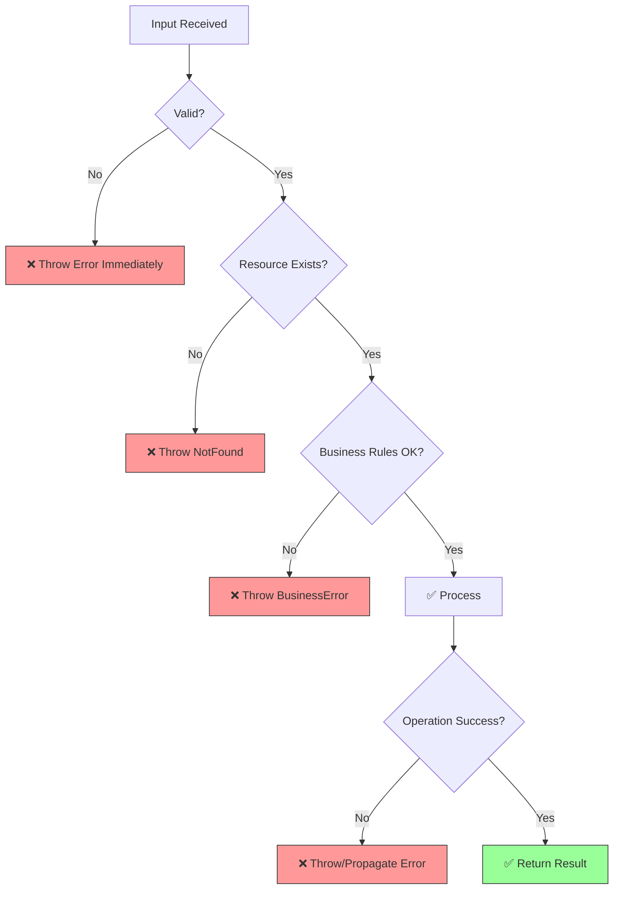
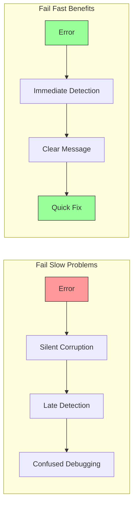

import { Accordion, Accordions } from "fumadocs-ui/components/accordion";
import { Callout } from "fumadocs-ui/components/callout";
import { Step, Steps } from "fumadocs-ui/components/steps";
import { Tab, Tabs } from "fumadocs-ui/components/tabs";

# Fail Fast

**Detect and report errors as early as possible.** When something goes wrong, fail immediately with a clear error rather than continuing with invalid state and failing later in confusing ways.

<Callout type="info">
"Fail fast, fail loudly." - Jim Shore
</Callout>

## The Problem

When errors are ignored, masked, or detected late:

- **Silent corruption**: Data becomes invalid without anyone knowing
- **Debugging nightmares**: Errors manifest far from their cause
- **Cascading failures**: One error causes many downstream problems
- **Lost context**: By the time we notice, we've lost useful error information

### ❌ BAD: Fail Slow (Silent Failures)

<Tabs items={["TypeScript"]}>
<Tab value="TypeScript">
```typescript
// Silently continuing with invalid data

interface User {
  id: string;
  email: string;
  age?: number;
}

interface Order {
  userId: string;
  items: OrderItem[];
  total?: number;
}

interface OrderItem {
  productId: string;
  quantity: number;
  price?: number;
}

// ❌ BAD: Silently returns null or default values
const getUserById = async (id: string): Promise<User | null> => {
  try {
    const result = await db.query("SELECT * FROM users WHERE id = $1", [id]);
    return result.rows[0] || null; // Silent null for missing user
  } catch (error) {
    console.log("Error fetching user:", error); // Just log and continue
    return null; // Return null as if user doesn't exist
  }
};

// ❌ BAD: Continues with invalid data
const processOrder = async (order: Order): Promise<void> => {
  // No validation - continues with potentially invalid order
  
  // Calculate total, but items might have no prices
  let total = 0;
  for (const item of order.items) {
    // If price is undefined, this silently makes total NaN
    total += (item.price || 0) * item.quantity;
  }
  
  // User might not exist, but we continue anyway
  const user = await getUserById(order.userId);
  
  // This silently fails if user is null
  if (user) {
    await sendOrderEmail(user.email, order);
  }
  // No error if user doesn't exist - just skip email
  
  // Save order even if it's invalid
  await db.query(
    "INSERT INTO orders (user_id, total) VALUES ($1, $2)",
    [order.userId, total] // total might be NaN!
  );
  
  console.log("Order processed"); // Claims success even with problems
};

// ❌ BAD: Swallowing exceptions
const fetchUserData = async (userId: string): Promise<UserData> => {
  try {
    const profile = await getProfile(userId);
    const orders = await getOrders(userId);
    const preferences = await getPreferences(userId);
    
    return { profile, orders, preferences };
  } catch (error) {
    // Swallow error, return partial/empty data
    return {
      profile: null,
      orders: [],
      preferences: {},
    };
  }
};
```
</Tab>
</Tabs>

**Problems:**
- Invalid orders get saved to database
- NaN values corrupt data
- Missing users go unnoticed
- Errors are hidden, problems accumulate
- Debugging is nearly impossible

## The Solution

Validate inputs early, fail immediately on errors, and provide clear error messages.

### ✅ GOOD: Fail Fast

<Tabs items={["TypeScript"]}>
<Tab value="TypeScript">
```typescript
// Fail fast with clear, immediate errors

// Custom error types for clarity
class ValidationError extends Error {
  constructor(message: string, public field?: string) {
    super(message);
    this.name = "ValidationError";
  }
}

class NotFoundError extends Error {
  constructor(resource: string, id: string) {
    super(`${resource} not found: ${id}`);
    this.name = "NotFoundError";
  }
}

class InvalidStateError extends Error {
  constructor(message: string) {
    super(message);
    this.name = "InvalidStateError";
  }
}

// ✅ GOOD: Validate at boundaries
interface OrderItem {
  productId: string;
  quantity: number;
  price: number; // Required, not optional
}

interface Order {
  userId: string;
  items: OrderItem[];
}

const validateOrderItem = (item: unknown, index: number): OrderItem => {
  if (!item || typeof item !== "object") {
    throw new ValidationError(`Item at index ${index} is invalid`);
  }
  
  const { productId, quantity, price } = item as Record<string, unknown>;
  
  if (typeof productId !== "string" || !productId) {
    throw new ValidationError(`Product ID required`, `items[${index}].productId`);
  }
  
  if (typeof quantity !== "number" || quantity <= 0) {
    throw new ValidationError(`Quantity must be positive`, `items[${index}].quantity`);
  }
  
  if (typeof price !== "number" || price < 0) {
    throw new ValidationError(`Price must be non-negative`, `items[${index}].price`);
  }
  
  return { productId, quantity, price };
};

const validateOrder = (input: unknown): Order => {
  if (!input || typeof input !== "object") {
    throw new ValidationError("Order data is required");
  }
  
  const { userId, items } = input as Record<string, unknown>;
  
  if (typeof userId !== "string" || !userId) {
    throw new ValidationError("User ID is required", "userId");
  }
  
  if (!Array.isArray(items) || items.length === 0) {
    throw new ValidationError("Order must have at least one item", "items");
  }
  
  return {
    userId,
    items: items.map((item, i) => validateOrderItem(item, i)),
  };
};

// ✅ GOOD: Fail immediately if user not found
const getUserById = async (id: string): Promise<User> => {
  if (!id) {
    throw new ValidationError("User ID is required");
  }
  
  const result = await db.query("SELECT * FROM users WHERE id = $1", [id]);
  
  if (result.rows.length === 0) {
    throw new NotFoundError("User", id);
  }
  
  return result.rows[0];
};

// ✅ GOOD: Process order with proper validation
const processOrder = async (input: unknown): Promise<OrderResult> => {
  // Validate immediately - fail fast if invalid
  const order = validateOrder(input);
  
  // Verify user exists - fail if not
  const user = await getUserById(order.userId);
  
  // Calculate total with validated data
  const total = order.items.reduce(
    (sum, item) => sum + item.price * item.quantity,
    0
  );
  
  // Verify total is valid
  if (!Number.isFinite(total) || total <= 0) {
    throw new InvalidStateError("Calculated total is invalid");
  }
  
  // All validations passed - now save
  const savedOrder = await db.query(
    "INSERT INTO orders (user_id, total) VALUES ($1, $2) RETURNING id",
    [order.userId, total]
  );
  
  // Send email - if it fails, we should know
  await sendOrderEmail(user.email, order);
  
  return {
    orderId: savedOrder.rows[0].id,
    total,
  };
};

// ✅ GOOD: Let errors propagate with context
const fetchUserData = async (userId: string): Promise<UserData> => {
  // Don't catch - let caller handle errors
  // Each function should fail with clear message
  const profile = await getProfile(userId);
  const orders = await getOrders(userId);
  const preferences = await getPreferences(userId);
  
  return { profile, orders, preferences };
};
```
</Tab>
</Tabs>

## Fail Fast Flow



## Assertions for Invariants

Use assertions to catch impossible states during development:

<Tabs items={["TypeScript"]}>
<Tab value="TypeScript">
```typescript
// Assertions catch "impossible" states

const assert = (condition: boolean, message: string): asserts condition => {
  if (!condition) {
    throw new Error(`Assertion failed: ${message}`);
  }
};

const assertNonNull = <T>(
  value: T | null | undefined,
  message: string
): T => {
  if (value === null || value === undefined) {
    throw new Error(`Assertion failed: ${message}`);
  }
  return value;
};

// Use in code to catch logic errors
const calculateDiscount = (
  user: User,
  order: Order,
  discountPercentage: number
): number => {
  // These should never happen if code is correct
  assert(discountPercentage >= 0, "Discount cannot be negative");
  assert(discountPercentage <= 100, "Discount cannot exceed 100%");
  assert(order.items.length > 0, "Order must have items");
  
  const subtotal = order.items.reduce(
    (sum, item) => sum + item.price * item.quantity,
    0
  );
  
  // Assert the math is correct
  const discount = subtotal * (discountPercentage / 100);
  assert(Number.isFinite(discount), "Discount calculation overflow");
  
  return discount;
};

// Assert after operations to verify invariants
const transferMoney = async (
  fromAccount: Account,
  toAccount: Account,
  amount: number
): Promise<void> => {
  const initialTotalBalance = fromAccount.balance + toAccount.balance;
  
  await fromAccount.withdraw(amount);
  await toAccount.deposit(amount);
  
  // Money should not be created or destroyed
  const finalTotalBalance = fromAccount.balance + toAccount.balance;
  assert(
    initialTotalBalance === finalTotalBalance,
    "Money invariant violated in transfer"
  );
};
```
</Tab>
</Tabs>

## Guard Clauses

Validate preconditions at the start of functions:

<Tabs items={["TypeScript"]}>
<Tab value="TypeScript">
```typescript
// Guard clauses for clean fail-fast

// ❌ BAD: Nested validation
const processPayment = (amount: number, card: CreditCard, user: User): void => {
  if (user) {
    if (user.isVerified) {
      if (card) {
        if (card.isValid) {
          if (amount > 0) {
            if (amount <= card.limit) {
              // Finally, the actual logic
              chargeCard(card, amount);
            } else {
              throw new Error("Exceeds limit");
            }
          } else {
            throw new Error("Invalid amount");
          }
        } else {
          throw new Error("Invalid card");
        }
      } else {
        throw new Error("Card required");
      }
    } else {
      throw new Error("User not verified");
    }
  } else {
    throw new Error("User required");
  }
};

// ✅ GOOD: Guard clauses
const processPaymentGood = (
  amount: number,
  card: CreditCard,
  user: User
): void => {
  // All guards at the top - fail fast
  if (!user) {
    throw new ValidationError("User is required");
  }
  
  if (!user.isVerified) {
    throw new ValidationError("User must be verified");
  }
  
  if (!card) {
    throw new ValidationError("Credit card is required");
  }
  
  if (!card.isValid) {
    throw new ValidationError("Credit card is invalid");
  }
  
  if (amount <= 0) {
    throw new ValidationError("Amount must be positive");
  }
  
  if (amount > card.limit) {
    throw new ValidationError("Amount exceeds card limit");
  }
  
  // Happy path - all preconditions met
  chargeCard(card, amount);
};
```
</Tab>
</Tabs>

## Type-Level Fail Fast

Use TypeScript to fail at compile time:

<Tabs items={["TypeScript"]}>
<Tab value="TypeScript">
```typescript
// Fail at compile time with types

// ❌ BAD: Runtime checks for values that could be typed
const processEmail = (email: string | null) => {
  if (email === null) {
    throw new Error("Email required"); // Runtime failure
  }
  sendEmail(email);
};

// ✅ GOOD: Make invalid states unrepresentable
const processEmailTyped = (email: string) => {
  sendEmail(email); // Can't be null - type system ensures it
};

// ❌ BAD: String for status
type OrderStatus = string;
const updateOrderBad = (order: Order, status: OrderStatus) => {
  // "pending", "pneding", "Pending" all accepted
  order.status = status;
};

// ✅ GOOD: Union type constrains values
type OrderStatusGood = "pending" | "processing" | "shipped" | "delivered";
const updateOrderGood = (order: Order, status: OrderStatusGood) => {
  // Only valid statuses allowed - compile-time check
  order.status = status;
};

// ✅ GOOD: Branded types for IDs
type UserId = string & { readonly brand: unique symbol };
type OrderId = string & { readonly brand: unique symbol };

const createUserId = (id: string): UserId => {
  if (!id.startsWith("usr_")) {
    throw new ValidationError("Invalid user ID format");
  }
  return id as UserId;
};

const createOrderId = (id: string): OrderId => {
  if (!id.startsWith("ord_")) {
    throw new ValidationError("Invalid order ID format");
  }
  return id as OrderId;
};

// Now you can't accidentally mix them up
const getUser = (id: UserId): Promise<User> => { /* ... */ };
const getOrder = (id: OrderId): Promise<Order> => { /* ... */ };

// getUser(orderId); // ❌ Compile error!
```
</Tab>
</Tabs>

## When to Apply Fail Fast

<Accordions>
<Accordion title="Always Fail Fast">

- **Input validation**: Reject invalid input immediately
- **Preconditions**: Check requirements before processing
- **Invariants**: Verify assumptions hold true
- **Constructor validation**: Objects should be valid from creation
- **API boundaries**: Validate external data at entry points

</Accordion>

<Accordion title="Fail Fast Carefully">

- **Background jobs**: Log and alert, but consider retry logic
- **Batch processing**: Continue with valid items, report failures
- **User input**: Show clear validation errors, don't crash
- **Network calls**: May need retry/fallback strategies

```typescript
// Batch processing - fail fast per item, collect results
const processBatch = async <T, R>(
  items: T[],
  processor: (item: T) => Promise<R>
): Promise<BatchResult<R>> => {
  const results: R[] = [];
  const errors: Array<{ item: T; error: Error }> = [];
  
  for (const item of items) {
    try {
      // Fail fast for each item
      const result = await processor(item);
      results.push(result);
    } catch (error) {
      // Collect error, continue with others
      errors.push({ item, error: error as Error });
    }
  }
  
  // Report all failures at the end
  return { results, errors, hasErrors: errors.length > 0 };
};
```

</Accordion>

<Accordion title="Don't Fail Fast">

- **Graceful degradation**: When partial functionality is acceptable
- **Non-critical features**: When failure shouldn't block core flow
- **Cleanup code**: Finally blocks should be resilient

```typescript
// Graceful degradation for non-critical features
const renderDashboard = async (userId: string): Promise<Dashboard> => {
  const user = await getUser(userId); // Critical - fail fast
  
  // Non-critical - use defaults if unavailable
  const recommendations = await getRecommendations(userId)
    .catch(() => []);
  
  const recentActivity = await getRecentActivity(userId)
    .catch(() => []);
  
  return {
    user,
    recommendations,
    recentActivity,
  };
};
```

</Accordion>
</Accordions>

## Summary

| Aspect | Fail Slow | Fail Fast |
|--------|-----------|-----------|
| Error detection | Late, unclear | Immediate, precise |
| Error messages | Generic, confusing | Specific, helpful |
| Debugging | Hours/days | Minutes |
| Data integrity | Corrupted | Protected |
| Code clarity | Hidden assumptions | Explicit checks |
| Recovery | Difficult | Clear path |



<Callout type="warn">
Remember: Every line of code that continues execution with invalid data is a line of code that could corrupt your database, confuse your users, or waste your debugging time. Fail fast, fail loud, fail with useful information.
</Callout>

## Related Principles

- **[KISS](/docs/architecture/clean/principles/kiss)** - Simple error handling is clearer
- **[SRP](/docs/architecture/clean/principles/srp)** - Each function validates its own inputs
- **[DRY](/docs/architecture/clean/principles/dry)** - Reuse validation logic
