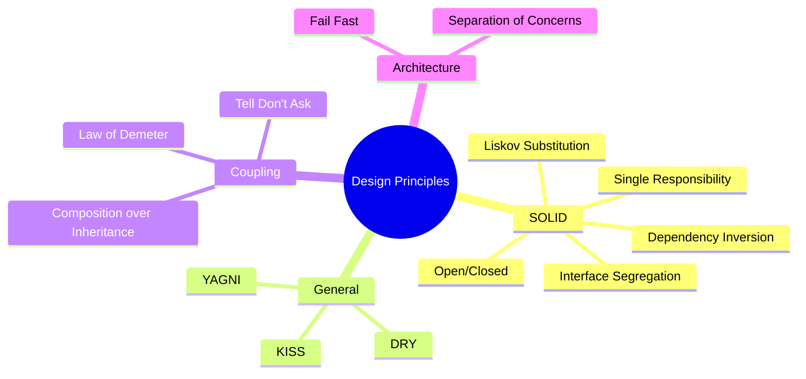

import { Callout } from "fumadocs-ui/components/callout";
import { Card, Cards } from "fumadocs-ui/components/card";

# Design Principles

Software design principles are time-tested guidelines that help developers create maintainable, scalable, and robust code. These principles represent decades of collective wisdom from the software engineering community.

## Why Principles Matter

## Principle Categories

### SOLID Principles

The five fundamental principles of object-oriented design, promoted by Robert C. Martin (Uncle Bob).

<Cards>
  <Card
    title="Single Responsibility (SRP)"
    description="A class should have only one reason to change"
    href="/docs/architecture/clean/principles/srp"
  />
  <Card
    title="Open/Closed (OCP)"
    description="Open for extension, closed for modification"
    href="/docs/architecture/clean/principles/ocp"
  />
  <Card
    title="Liskov Substitution (LSP)"
    description="Subtypes must be substitutable for their base types"
    href="/docs/architecture/clean/principles/lsp"
  />
  <Card
    title="Interface Segregation (ISP)"
    description="Many specific interfaces over one general interface"
    href="/docs/architecture/clean/principles/isp"
  />
  <Card
    title="Dependency Inversion (DIP)"
    description="Depend on abstractions, not concretions"
    href="/docs/architecture/clean/principles/dip"
  />
</Cards>

### General Principles

Fundamental guidelines that apply to all programming paradigms.

<Cards>
  <Card
    title="DRY - Don't Repeat Yourself"
    description="Every piece of knowledge should have a single source of truth"
    href="/docs/architecture/clean/principles/dry"
  />
  <Card
    title="KISS - Keep It Simple"
    description="The simplest solution is usually the best"
    href="/docs/architecture/clean/principles/kiss"
  />
  <Card
    title="YAGNI - You Aren't Gonna Need It"
    description="Don't build features until you actually need them"
    href="/docs/architecture/clean/principles/yagni"
  />
</Cards>

### Coupling & Communication

Principles that govern how components interact with each other.

<Cards>
  <Card
    title="Law of Demeter"
    description="Only talk to your immediate friends"
    href="/docs/architecture/clean/principles/lod"
  />
  <Card
    title="Composition over Inheritance"
    description="Favor object composition over class inheritance"
    href="/docs/architecture/clean/principles/composition"
  />
  <Card
    title="Tell, Don't Ask"
    description="Command objects, don't query them for decisions"
    href="/docs/architecture/clean/principles/tell-dont-ask"
  />
</Cards>

### Architectural Principles

Higher-level principles for system design.

<Cards>
  <Card
    title="Separation of Concerns"
    description="Each module should address one concern"
    href="/docs/architecture/clean/principles/separation-of-concerns"
  />
  <Card
    title="Fail Fast"
    description="Detect and report errors immediately"
    href="/docs/architecture/clean/principles/fail-fast"
  />
</Cards>

---

## Quick Reference

| Principle | Mnemonic | Core Idea | Problem Solved |
|-----------|----------|-----------|----------------|
| **SRP** | Single Responsibility | One reason to change | God classes, mixed concerns |
| **OCP** | Open/Closed | Extend, don't modify | Fragile code, regression bugs |
| **LSP** | Liskov Substitution | Substitutable subtypes | Broken polymorphism |
| **ISP** | Interface Segregation | Specific interfaces | Fat interfaces, forced implementations |
| **DIP** | Dependency Inversion | Depend on abstractions | Tight coupling, hard to test |
| **DRY** | Don't Repeat Yourself | Single source of truth | Scattered changes, inconsistency |
| **KISS** | Keep It Simple | Simplest solution wins | Over-engineering |
| **YAGNI** | You Aren't Gonna Need It | Build for today | Wasted effort, bloat |
| **LoD** | Law of Demeter | Talk to friends only | Train wrecks, hidden dependencies |
| **CoI** | Composition over Inheritance | Combine, don't inherit | Rigid hierarchies |

<Callout type="info" title="Balance is Key">
These principles sometimes conflict. Use judgment based on your specific context. The goal is maintainable, working software—not dogmatic adherence to rules.
</Callout>
