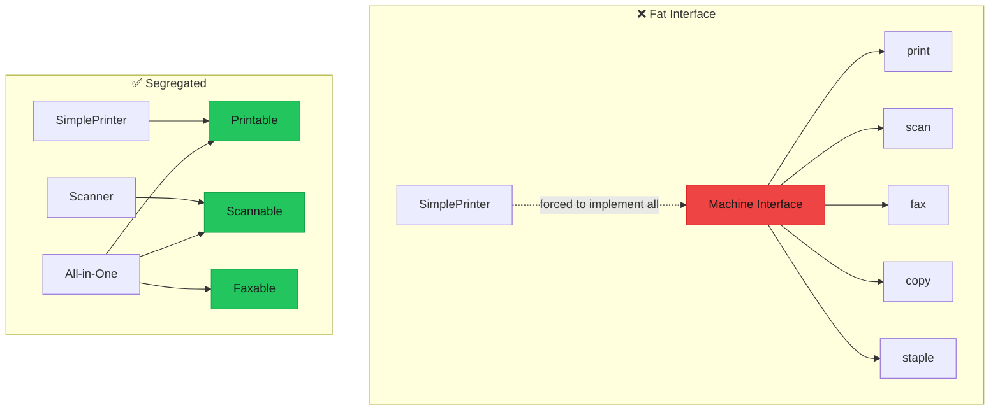

import { Accordion, Accordions } from "fumadocs-ui/components/accordion";
import { Callout } from "fumadocs-ui/components/callout";
import { Tab, Tabs } from "fumadocs-ui/components/tabs";

# Interface Segregation Principle (ISP)

> **"Clients should not be forced to depend on interfaces they do not use."** — Robert C. Martin

The Interface Segregation Principle states that many client-specific interfaces are better than one general-purpose interface. No client should be forced to implement methods it doesn't need.



---

## The Problem

### The "Fat Interface" Anti-Pattern

When an interface is too large, implementers are forced to provide stub implementations for methods they don't need.

```typescript
/**
 * ❌ BAD: Fat interface forces implementing unused methods
 */

interface Worker {
  // Human worker capabilities
  work: () => void;
  eat: () => void;
  sleep: () => void;
  takeBreak: () => void;
  
  // Technical capabilities
  code: () => void;
  reviewCode: () => void;
  writeTests: () => void;
  debug: () => void;
  
  // Management capabilities
  conductMeeting: () => void;
  writeReport: () => void;
  approveBudget: () => void;
  hireEmployee: () => void;
  
  // Administrative capabilities
  answerPhone: () => void;
  scheduleAppointment: () => void;
  orderSupplies: () => void;
}

// Junior Developer - forced to implement management methods they can't do!
const createJuniorDeveloper = (name: string): Worker => ({
  work() { console.log(`${name} is working`); },
  eat() { console.log(`${name} is eating`); },
  sleep() { console.log(`${name} is sleeping`); },
  takeBreak() { console.log(`${name} is taking a break`); },
  
  code() { console.log(`${name} is coding`); },
  reviewCode() { console.log(`${name} is learning by reviewing`); },
  writeTests() { console.log(`${name} is writing tests`); },
  debug() { console.log(`${name} is debugging`); },
  
  // 🚨 Forced to implement methods they can't actually do!
  conductMeeting() { throw new Error("Junior devs don't conduct meetings"); },
  writeReport() { throw new Error("Junior devs don't write reports"); },
  approveBudget() { throw new Error("Junior devs can't approve budgets"); },
  hireEmployee() { throw new Error("Junior devs can't hire"); },
  
  answerPhone() { throw new Error("Not my job"); },
  scheduleAppointment() { throw new Error("Not my job"); },
  orderSupplies() { throw new Error("Not my job"); },
});

// Robot Worker - forced to implement biological methods!
const createRobotWorker = (): Worker => ({
  work() { console.log("Beep boop working"); },
  
  // 🚨 Robots don't eat, sleep, or take breaks!
  eat() { throw new Error("Robots don't eat"); },
  sleep() { throw new Error("Robots don't sleep"); },
  takeBreak() { throw new Error("Robots don't take breaks"); },
  
  code() { console.log("Generating code"); },
  reviewCode() { console.log("Analyzing code patterns"); },
  writeTests() { console.log("Generating test cases"); },
  debug() { console.log("Running diagnostics"); },
  
  // 🚨 Robots can't do any of these!
  conductMeeting() { throw new Error("Robots can't conduct meetings"); },
  writeReport() { console.log("Generating report"); }, // Actually this one works
  approveBudget() { throw new Error("Robots can't approve budgets"); },
  hireEmployee() { throw new Error("Robots can't hire"); },
  
  answerPhone() { throw new Error("Robots can't answer phones"); },
  scheduleAppointment() { throw new Error("Robots can't schedule"); },
  orderSupplies() { throw new Error("Robots can't order supplies"); },
});

// Problems:
// 1. Too many throw statements - code smell!
// 2. Implementers must understand the entire interface
// 3. Changes to one part affect all implementers
// 4. Hard to test - must mock everything
// 5. Violates LSP - substitutability breaks
```

---

## The Solution

### Segregated, Role-Based Interfaces

<Tabs items={["Worker Roles", "Document Handlers", "User Operations", "Plugin System"]}>
<Tab value="Worker Roles">

```typescript
/**
 * ✅ GOOD: Segregated interfaces based on capabilities
 */

// --- Core Capabilities ---
interface Workable {
  work: () => void;
}

interface Biological {
  eat: () => void;
  sleep: () => void;
  takeBreak: () => void;
}

interface Coder {
  code: () => void;
  debug: () => void;
}

interface CodeReviewer {
  reviewCode: () => void;
  suggestImprovements: () => void;
}

interface TestWriter {
  writeTests: () => void;
  runTests: () => void;
}

// --- Management Capabilities ---
interface MeetingConductor {
  conductMeeting: () => void;
  createAgenda: () => void;
}

interface ReportWriter {
  writeReport: () => void;
  presentReport: () => void;
}

interface Approver {
  approveBudget: (amount: number) => boolean;
  approveRequest: (requestId: string) => boolean;
}

interface Hirer {
  reviewResume: (resumeId: string) => boolean;
  conductInterview: (candidateId: string) => void;
  hireEmployee: (candidateId: string) => void;
}

// --- Administrative Capabilities ---
interface PhoneHandler {
  answerPhone: () => void;
  makeCall: (number: string) => void;
}

interface Scheduler {
  scheduleAppointment: (date: Date, attendees: string[]) => void;
  cancelAppointment: (appointmentId: string) => void;
}

// --- Compose types for specific roles ---
type JuniorDeveloper = Workable & Biological & Coder & TestWriter;

type SeniorDeveloper = Workable & Biological & Coder & CodeReviewer & TestWriter & MeetingConductor;

type TechLead = Workable & Biological & Coder & CodeReviewer & TestWriter & 
                MeetingConductor & ReportWriter & Hirer;

type Manager = Workable & Biological & MeetingConductor & ReportWriter & Approver & Hirer;

type AutomatedWorker = Workable & Coder & CodeReviewer & TestWriter & ReportWriter;

// --- Implementations only include what they need ---
const createJuniorDeveloper = (name: string): JuniorDeveloper => ({
  work() { console.log(`${name} is working`); },
  eat() { console.log(`${name} is eating lunch`); },
  sleep() { console.log(`${name} is sleeping`); },
  takeBreak() { console.log(`${name} is taking a coffee break`); },
  code() { console.log(`${name} is writing code`); },
  debug() { console.log(`${name} is debugging`); },
  writeTests() { console.log(`${name} is writing unit tests`); },
  runTests() { console.log(`${name} is running tests`); },
});

const createSeniorDeveloper = (name: string): SeniorDeveloper => ({
  work() { console.log(`${name} is architecting solutions`); },
  eat() { console.log(`${name} is eating`); },
  sleep() { console.log(`${name} is sleeping`); },
  takeBreak() { console.log(`${name} is mentoring juniors during break`); },
  code() { console.log(`${name} is writing elegant code`); },
  debug() { console.log(`${name} is debugging complex issues`); },
  writeTests() { console.log(`${name} is writing integration tests`); },
  runTests() { console.log(`${name} is running test suite`); },
  reviewCode() { console.log(`${name} is reviewing PRs`); },
  suggestImprovements() { console.log(`${name} suggests refactoring`); },
  conductMeeting() { console.log(`${name} is leading stand-up`); },
  createAgenda() { console.log(`${name} is creating meeting agenda`); },
});

const createCIBot = (): AutomatedWorker => ({
  work() { console.log("Bot: Running CI pipeline"); },
  code() { console.log("Bot: Auto-generating boilerplate"); },
  debug() { console.log("Bot: Running static analysis"); },
  writeTests() { console.log("Bot: Generating test cases"); },
  runTests() { console.log("Bot: Executing test suite"); },
  reviewCode() { console.log("Bot: Running linters and formatters"); },
  suggestImprovements() { console.log("Bot: Suggesting fixes"); },
  writeReport() { console.log("Bot: Generating coverage report"); },
  presentReport() { console.log("Bot: Posting report to PR"); },
});

// --- Functions depend only on what they need ---
const assignCodingTask = (worker: Coder) => {
  worker.code();
  worker.debug();
};

const requestCodeReview = (reviewer: CodeReviewer) => {
  reviewer.reviewCode();
  reviewer.suggestImprovements();
};

const runDailyStandup = (conductors: MeetingConductor[]) => {
  conductors.forEach(c => {
    c.createAgenda();
    c.conductMeeting();
  });
};

const runTestSuite = (testers: TestWriter[]) => {
  testers.forEach(t => {
    t.writeTests();
    t.runTests();
  });
};

// Usage
const alice = createSeniorDeveloper("Alice");
const bob = createJuniorDeveloper("Bob");
const ciBot = createCIBot();

// All can code
assignCodingTask(alice);
assignCodingTask(bob);
assignCodingTask(ciBot);

// Only Alice and bot can review (Bob isn't CodeReviewer)
requestCodeReview(alice);
requestCodeReview(ciBot);
// requestCodeReview(bob); // ❌ Type error!

// Only Alice can conduct meetings (Bob and bot aren't MeetingConductor)
runDailyStandup([alice]);
// runDailyStandup([bob]); // ❌ Type error!
```

</Tab>
<Tab value="Document Handlers">

```typescript
/**
 * ✅ GOOD: Document handling with segregated interfaces
 */

// --- Core document operations ---
interface Readable {
  read: () => Promise<Buffer>;
  getSize: () => Promise<number>;
  getMetadata: () => Promise<Record<string, string>>;
}

interface Writable {
  write: (data: Buffer) => Promise<void>;
  append: (data: Buffer) => Promise<void>;
}

interface Deletable {
  delete: () => Promise<void>;
  moveToTrash: () => Promise<void>;
}

// --- Version control ---
interface Versionable {
  getVersion: () => number;
  getHistory: () => Promise<{ version: number; timestamp: Date }[]>;
  revertTo: (version: number) => Promise<void>;
}

// --- Sharing capabilities ---
interface Shareable {
  share: (userId: string, permission: "read" | "write") => Promise<void>;
  unshare: (userId: string) => Promise<void>;
  getSharedWith: () => Promise<{ userId: string; permission: string }[]>;
}

// --- Export capabilities ---
interface Exportable {
  exportAs: (format: "pdf" | "docx" | "txt") => Promise<Buffer>;
  getExportFormats: () => string[];
}

// --- Compose document types ---
type ReadOnlyDocument = Readable;
type EditableDocument = Readable & Writable & Deletable;
type CollaborativeDocument = Readable & Writable & Deletable & Versionable & Shareable;
type ExportableDocument = Readable & Exportable;
type FullDocument = Readable & Writable & Deletable & Versionable & Shareable & Exportable;

// --- Implementations ---
const createReadOnlyDocument = (content: Buffer): ReadOnlyDocument => ({
  async read() {
    return content;
  },
  async getSize() {
    return content.length;
  },
  async getMetadata() {
    return { type: "read-only", createdAt: new Date().toISOString() };
  },
});

const createEditableDocument = (
  initialContent: Buffer = Buffer.from("")
): EditableDocument => {
  let content = initialContent;
  let deleted = false;
  
  return {
    async read() {
      if (deleted) throw new Error("Document is in trash");
      return content;
    },
    async getSize() {
      return content.length;
    },
    async getMetadata() {
      return { type: "editable", deleted: String(deleted) };
    },
    async write(data) {
      content = data;
    },
    async append(data) {
      content = Buffer.concat([content, data]);
    },
    async delete() {
      content = Buffer.from("");
      deleted = true;
    },
    async moveToTrash() {
      deleted = true;
    },
  };
};

const createCollaborativeDocument = (
  initialContent: Buffer = Buffer.from("")
): CollaborativeDocument => {
  let content = initialContent;
  let deleted = false;
  let version = 1;
  const history: { version: number; timestamp: Date; content: Buffer }[] = [];
  const shares = new Map<string, "read" | "write">();
  
  const saveVersion = () => {
    history.push({
      version: version++,
      timestamp: new Date(),
      content: Buffer.from(content),
    });
  };
  
  return {
    async read() {
      return content;
    },
    async getSize() {
      return content.length;
    },
    async getMetadata() {
      return {
        type: "collaborative",
        version: String(version),
        sharedWith: String(shares.size),
      };
    },
    async write(data) {
      saveVersion();
      content = data;
    },
    async append(data) {
      saveVersion();
      content = Buffer.concat([content, data]);
    },
    async delete() {
      saveVersion();
      content = Buffer.from("");
      deleted = true;
    },
    async moveToTrash() {
      deleted = true;
    },
    
    // Versionable
    getVersion() {
      return version;
    },
    async getHistory() {
      return history.map(h => ({ version: h.version, timestamp: h.timestamp }));
    },
    async revertTo(targetVersion) {
      const entry = history.find(h => h.version === targetVersion);
      if (!entry) throw new Error(`Version ${targetVersion} not found`);
      saveVersion();
      content = Buffer.from(entry.content);
    },
    
    // Shareable
    async share(userId, permission) {
      shares.set(userId, permission);
    },
    async unshare(userId) {
      shares.delete(userId);
    },
    async getSharedWith() {
      return Array.from(shares.entries()).map(([userId, permission]) => ({
        userId,
        permission,
      }));
    },
  };
};

// --- Functions depend only on what they need ---
const displayDocument = async (doc: Readable): Promise<string> => {
  const content = await doc.read();
  const size = await doc.getSize();
  return `Content: ${content.toString("utf-8")} (${size} bytes)`;
};

const backupDocument = async (doc: Readable): Promise<Buffer> => {
  return doc.read();
};

const updateDocument = async (doc: Writable, newContent: string): Promise<void> => {
  await doc.write(Buffer.from(newContent, "utf-8"));
};

const shareWithTeam = async (
  doc: Shareable,
  teamIds: string[]
): Promise<void> => {
  for (const id of teamIds) {
    await doc.share(id, "read");
  }
};

const getDocumentVersion = (doc: Versionable): number => {
  return doc.getVersion();
};

// Usage
const readOnly = createReadOnlyDocument(Buffer.from("Hello"));
const editable = createEditableDocument(Buffer.from("World"));
const collaborative = createCollaborativeDocument(Buffer.from("Team Doc"));

// All can be read and backed up
await displayDocument(readOnly);
await displayDocument(editable);
await displayDocument(collaborative);

await backupDocument(readOnly);
await backupDocument(editable);
await backupDocument(collaborative);

// Only editable and collaborative can be updated
await updateDocument(editable, "New content");
await updateDocument(collaborative, "Team content");
// await updateDocument(readOnly, "x"); // ❌ Type error!

// Only collaborative can be shared
await shareWithTeam(collaborative, ["alice", "bob"]);
// await shareWithTeam(editable, ["x"]); // ❌ Type error!

// Only collaborative has versioning
console.log(getDocumentVersion(collaborative));
// console.log(getDocumentVersion(editable)); // ❌ Type error!
```

</Tab>
<Tab value="User Operations">

```typescript
/**
 * ✅ GOOD: User management with segregated interfaces
 */

// --- Base user data ---
interface UserIdentity {
  readonly id: string;
  readonly email: string;
  readonly createdAt: Date;
}

// --- Reading capabilities ---
interface UserReadable {
  getProfile: () => Promise<{
    name: string;
    avatar?: string;
    bio?: string;
  }>;
  getSettings: () => Promise<Record<string, unknown>>;
}

// --- Writing capabilities ---
interface UserWritable {
  updateProfile: (data: { name?: string; avatar?: string; bio?: string }) => Promise<void>;
  updateSettings: (settings: Record<string, unknown>) => Promise<void>;
}

// --- Authentication capabilities ---
interface Authenticatable {
  verifyPassword: (password: string) => Promise<boolean>;
  changePassword: (oldPassword: string, newPassword: string) => Promise<void>;
  enableMFA: (method: "totp" | "sms") => Promise<string>;
  disableMFA: () => Promise<void>;
}

// --- Session capabilities ---
interface SessionManageable {
  getSessions: () => Promise<{ id: string; device: string; lastActive: Date }[]>;
  revokeSession: (sessionId: string) => Promise<void>;
  revokeAllSessions: () => Promise<void>;
}

// --- Notification capabilities ---
interface Notifiable {
  getNotificationPreferences: () => Promise<{
    email: boolean;
    push: boolean;
    sms: boolean;
  }>;
  updateNotificationPreferences: (prefs: Partial<{
    email: boolean;
    push: boolean;
    sms: boolean;
  }>) => Promise<void>;
}

// --- Subscription capabilities ---
interface Subscribable {
  getSubscription: () => Promise<{
    plan: string;
    status: "active" | "cancelled" | "expired";
    expiresAt: Date;
  } | null>;
  subscribe: (planId: string) => Promise<void>;
  cancelSubscription: () => Promise<void>;
  changePlan: (newPlanId: string) => Promise<void>;
}

// --- Compose user types based on context ---
type PublicUser = UserIdentity & UserReadable;
type AuthenticatedUser = UserIdentity & UserReadable & UserWritable & SessionManageable;
type FullUser = UserIdentity & UserReadable & UserWritable & Authenticatable & 
                SessionManageable & Notifiable & Subscribable;

// --- Service implementations use minimal interfaces ---
interface ProfileService {
  displayProfile: (user: UserReadable) => Promise<void>;
  editProfile: (user: UserWritable, data: { name?: string }) => Promise<void>;
}

const createProfileService = (): ProfileService => ({
  async displayProfile(user) {
    const profile = await user.getProfile();
    console.log(`Name: ${profile.name}`);
    console.log(`Bio: ${profile.bio ?? "No bio"}`);
  },
  
  async editProfile(user, data) {
    await user.updateProfile(data);
    console.log("Profile updated");
  },
});

interface SecurityService {
  enforcePasswordChange: (user: Authenticatable) => Promise<void>;
  logoutEverywhere: (user: SessionManageable) => Promise<void>;
  setupMFA: (user: Authenticatable) => Promise<string>;
}

const createSecurityService = (): SecurityService => ({
  async enforcePasswordChange(user) {
    const tempPassword = "temp123";
    await user.changePassword(tempPassword, "newSecure123!");
    console.log("Password changed");
  },
  
  async logoutEverywhere(user) {
    await user.revokeAllSessions();
    console.log("All sessions revoked");
  },
  
  async setupMFA(user) {
    const secret = await user.enableMFA("totp");
    console.log("MFA enabled");
    return secret;
  },
});

interface NotificationService {
  sendNotification: (user: Notifiable, message: string) => Promise<void>;
  updatePreferences: (user: Notifiable) => Promise<void>;
}

const createNotificationService = (): NotificationService => ({
  async sendNotification(user, message) {
    const prefs = await user.getNotificationPreferences();
    
    if (prefs.email) console.log(`Email: ${message}`);
    if (prefs.push) console.log(`Push: ${message}`);
    if (prefs.sms) console.log(`SMS: ${message}`);
  },
  
  async updatePreferences(user) {
    await user.updateNotificationPreferences({ email: true, push: true });
    console.log("Preferences updated");
  },
});

interface BillingService {
  checkSubscription: (user: Subscribable) => Promise<boolean>;
  upgrade: (user: Subscribable, planId: string) => Promise<void>;
}

const createBillingService = (): BillingService => ({
  async checkSubscription(user) {
    const sub = await user.getSubscription();
    return sub?.status === "active";
  },
  
  async upgrade(user, planId) {
    await user.changePlan(planId);
    console.log(`Upgraded to ${planId}`);
  },
});

// --- API endpoints use appropriate interfaces ---
// Each endpoint only requires the capabilities it needs

// GET /profile - only needs reading
const handleGetProfile = async (user: UserReadable) => {
  return user.getProfile();
};

// PUT /profile - needs reading and writing
const handleUpdateProfile = async (
  user: UserReadable & UserWritable,
  data: { name?: string }
) => {
  await user.updateProfile(data);
  return user.getProfile();
};

// POST /change-password - only needs authentication
const handleChangePassword = async (
  user: Authenticatable,
  oldPassword: string,
  newPassword: string
) => {
  await user.changePassword(oldPassword, newPassword);
  return { success: true };
};

// DELETE /sessions - only needs session management
const handleLogoutAll = async (user: SessionManageable) => {
  await user.revokeAllSessions();
  return { success: true };
};

// GET /subscription - only needs subscription info
const handleGetSubscription = async (user: Subscribable) => {
  return user.getSubscription();
};
```

</Tab>
<Tab value="Plugin System">

```typescript
/**
 * ✅ GOOD: Plugin system with segregated interfaces
 */

// --- Core plugin lifecycle ---
interface Initializable {
  initialize: () => Promise<void>;
}

interface Destroyable {
  destroy: () => Promise<void>;
}

interface Configurable {
  configure: (config: Record<string, unknown>) => void;
  getConfig: () => Record<string, unknown>;
}

// --- Feature capabilities ---
interface CommandProvider {
  getCommands: () => { name: string; description: string; execute: () => void }[];
}

interface MenuProvider {
  getMenuItems: () => { label: string; action: () => void }[];
}

interface SettingsProvider {
  getSettingsSchema: () => Record<string, { type: string; default: unknown }>;
  onSettingsChanged: (settings: Record<string, unknown>) => void;
}

interface ThemeProvider {
  getThemes: () => { id: string; name: string; colors: Record<string, string> }[];
}

interface ShortcutProvider {
  getShortcuts: () => { keys: string; action: () => void; description: string }[];
}

// --- Event capabilities ---
interface EventEmitter {
  emit: (event: string, data?: unknown) => void;
}

interface EventListener {
  on: (event: string, handler: (data?: unknown) => void) => void;
  off: (event: string, handler: (data?: unknown) => void) => void;
}

// --- Storage capabilities ---
interface StorageUser {
  saveData: (key: string, data: unknown) => Promise<void>;
  loadData: <T>(key: string) => Promise<T | null>;
  clearData: () => Promise<void>;
}

// --- Compose plugin types ---
type BasicPlugin = Initializable & Destroyable;

type ConfigurablePlugin = BasicPlugin & Configurable;

type CommandPlugin = BasicPlugin & CommandProvider;

type FullPlugin = Initializable & Destroyable & Configurable & 
                  CommandProvider & MenuProvider & SettingsProvider & 
                  StorageUser & EventEmitter & EventListener;

// --- Plugin implementations ---
const createLoggerPlugin = (): BasicPlugin & EventListener => {
  const handlers = new Map<string, Set<(data?: unknown) => void>>();
  
  return {
    async initialize() {
      console.log("[Logger] Initialized");
    },
    
    async destroy() {
      handlers.clear();
      console.log("[Logger] Destroyed");
    },
    
    on(event, handler) {
      if (!handlers.has(event)) {
        handlers.set(event, new Set());
      }
      handlers.get(event)!.add(handler);
    },
    
    off(event, handler) {
      handlers.get(event)?.delete(handler);
    },
  };
};

const createThemePlugin = (): BasicPlugin & ThemeProvider & Configurable => {
  let config: Record<string, unknown> = {};
  
  const themes = [
    { id: "light", name: "Light Theme", colors: { bg: "#fff", fg: "#000" } },
    { id: "dark", name: "Dark Theme", colors: { bg: "#1a1a1a", fg: "#fff" } },
    { id: "nord", name: "Nord Theme", colors: { bg: "#2e3440", fg: "#eceff4" } },
  ];
  
  return {
    async initialize() {
      console.log("[Theme] Initialized with", themes.length, "themes");
    },
    
    async destroy() {
      console.log("[Theme] Destroyed");
    },
    
    configure(newConfig) {
      config = { ...config, ...newConfig };
    },
    
    getConfig() {
      return config;
    },
    
    getThemes() {
      return themes;
    },
  };
};

const createShortcutsPlugin = (): BasicPlugin & ShortcutProvider & CommandProvider => {
  const shortcuts = [
    { keys: "Ctrl+S", action: () => console.log("Save"), description: "Save file" },
    { keys: "Ctrl+O", action: () => console.log("Open"), description: "Open file" },
    { keys: "Ctrl+N", action: () => console.log("New"), description: "New file" },
  ];
  
  return {
    async initialize() {
      console.log("[Shortcuts] Registered", shortcuts.length, "shortcuts");
    },
    
    async destroy() {
      console.log("[Shortcuts] Unregistered all shortcuts");
    },
    
    getShortcuts() {
      return shortcuts;
    },
    
    getCommands() {
      return shortcuts.map(s => ({
        name: s.description,
        description: `Shortcut: ${s.keys}`,
        execute: s.action,
      }));
    },
  };
};

// --- Plugin manager uses minimal interfaces ---
interface PluginManager {
  register: (plugin: Initializable & Destroyable) => void;
  initializeAll: () => Promise<void>;
  destroyAll: () => Promise<void>;
  getCommands: () => { name: string; description: string; execute: () => void }[];
  getThemes: () => { id: string; name: string; colors: Record<string, string> }[];
  getShortcuts: () => { keys: string; action: () => void; description: string }[];
}

const createPluginManager = (): PluginManager => {
  const plugins: (Initializable & Destroyable)[] = [];
  
  return {
    register(plugin) {
      plugins.push(plugin);
      console.log("Registered plugin");
    },
    
    async initializeAll() {
      for (const plugin of plugins) {
        await plugin.initialize();
      }
    },
    
    async destroyAll() {
      for (const plugin of plugins) {
        await plugin.destroy();
      }
    },
    
    getCommands() {
      const commands: { name: string; description: string; execute: () => void }[] = [];
      
      for (const plugin of plugins) {
        if ("getCommands" in plugin) {
          commands.push(...(plugin as CommandProvider).getCommands());
        }
      }
      
      return commands;
    },
    
    getThemes() {
      const themes: { id: string; name: string; colors: Record<string, string> }[] = [];
      
      for (const plugin of plugins) {
        if ("getThemes" in plugin) {
          themes.push(...(plugin as ThemeProvider).getThemes());
        }
      }
      
      return themes;
    },
    
    getShortcuts() {
      const shortcuts: { keys: string; action: () => void; description: string }[] = [];
      
      for (const plugin of plugins) {
        if ("getShortcuts" in plugin) {
          shortcuts.push(...(plugin as ShortcutProvider).getShortcuts());
        }
      }
      
      return shortcuts;
    },
  };
};

// Usage
const manager = createPluginManager();

manager.register(createLoggerPlugin());
manager.register(createThemePlugin());
manager.register(createShortcutsPlugin());

await manager.initializeAll();

console.log("Available commands:", manager.getCommands().length);
console.log("Available themes:", manager.getThemes().length);
console.log("Available shortcuts:", manager.getShortcuts().length);

await manager.destroyAll();
```

</Tab>
</Tabs>

---

## Real-World Example: E-Commerce System

```typescript
/**
 * ✅ GOOD: E-commerce with properly segregated interfaces
 */

// --- Product capabilities ---
interface ProductViewable {
  readonly id: string;
  readonly name: string;
  readonly price: number;
  getDescription: () => string;
  getImages: () => string[];
}

interface ProductPurchasable {
  readonly id: string;
  readonly price: number;
  isInStock: () => boolean;
  reserve: (quantity: number) => Promise<boolean>;
  release: (quantity: number) => Promise<void>;
}

interface ProductReviewable {
  readonly id: string;
  getReviews: () => Promise<{ rating: number; comment: string }[]>;
  addReview: (rating: number, comment: string) => Promise<void>;
  getAverageRating: () => Promise<number>;
}

interface ProductComparable {
  readonly id: string;
  getSpecs: () => Record<string, string | number>;
  compareWith: (other: ProductComparable) => Record<string, { a: unknown; b: unknown }>;
}

// --- Cart capabilities ---
interface CartViewable {
  getItems: () => { productId: string; quantity: number; price: number }[];
  getTotal: () => number;
  getItemCount: () => number;
}

interface CartModifiable {
  addItem: (productId: string, quantity: number, price: number) => void;
  removeItem: (productId: string) => void;
  updateQuantity: (productId: string, quantity: number) => void;
  clear: () => void;
}

interface CartCheckout {
  validate: () => Promise<{ valid: boolean; errors: string[] }>;
  checkout: () => Promise<{ orderId: string }>;
}

// --- Order capabilities ---
interface OrderViewable {
  readonly id: string;
  readonly status: string;
  readonly total: number;
  getItems: () => { productId: string; quantity: number; price: number }[];
  getCreatedAt: () => Date;
}

interface OrderTrackable {
  readonly id: string;
  getTrackingNumber: () => string | null;
  getShippingStatus: () => Promise<{
    status: string;
    location?: string;
    estimatedDelivery?: Date;
  }>;
}

interface OrderCancellable {
  readonly id: string;
  canCancel: () => boolean;
  cancel: (reason: string) => Promise<boolean>;
}

interface OrderRefundable {
  readonly id: string;
  canRefund: () => boolean;
  requestRefund: (items: string[], reason: string) => Promise<{ refundId: string }>;
  getRefundStatus: (refundId: string) => Promise<{ status: string; amount: number }>;
}

// --- Compose types for different contexts ---

// Customer-facing product (view, purchase, review)
type CustomerProduct = ProductViewable & ProductPurchasable & ProductReviewable;

// Comparison page product
type ComparableProduct = ProductViewable & ProductComparable;

// Customer cart
type CustomerCart = CartViewable & CartModifiable & CartCheckout;

// Order history (view only)
type OrderSummary = OrderViewable;

// Order details (with tracking)
type DetailedOrder = OrderViewable & OrderTrackable;

// Order with full capabilities
type ManageableOrder = OrderViewable & OrderTrackable & OrderCancellable & OrderRefundable;

// --- Service implementations ---

// Product listing service - only needs viewable
const createProductListingService = () => ({
  display(products: ProductViewable[]): void {
    for (const p of products) {
      console.log(`${p.name} - $${p.price}`);
    }
  },
  
  search(products: ProductViewable[], query: string): ProductViewable[] {
    return products.filter(p => 
      p.name.toLowerCase().includes(query.toLowerCase()) ||
      p.getDescription().toLowerCase().includes(query.toLowerCase())
    );
  },
});

// Product comparison service - needs comparable
const createComparisonService = () => ({
  compare(products: ProductComparable[]): void {
    if (products.length < 2) return;
    
    const [first, ...rest] = products;
    for (const other of rest) {
      const diff = first.compareWith(other);
      console.log(`Comparison ${first.id} vs ${other.id}:`, diff);
    }
  },
});

// Checkout service - needs purchasable products and checkout cart
const createCheckoutService = () => ({
  async processCheckout(
    cart: CartViewable & CartCheckout,
    products: Map<string, ProductPurchasable>
  ): Promise<{ orderId: string } | { error: string }> {
    // Validate cart
    const validation = await cart.validate();
    if (!validation.valid) {
      return { error: validation.errors.join(", ") };
    }
    
    // Reserve inventory
    for (const item of cart.getItems()) {
      const product = products.get(item.productId);
      if (!product) {
        return { error: `Product ${item.productId} not found` };
      }
      
      const reserved = await product.reserve(item.quantity);
      if (!reserved) {
        return { error: `Insufficient stock for ${item.productId}` };
      }
    }
    
    // Process checkout
    const result = await cart.checkout();
    return result;
  },
});

// Order tracking service - only needs trackable
const createOrderTrackingService = () => ({
  async displayTracking(order: OrderTrackable): Promise<void> {
    const tracking = order.getTrackingNumber();
    if (!tracking) {
      console.log("No tracking number yet");
      return;
    }
    
    const status = await order.getShippingStatus();
    console.log(`Order ${order.id}:`);
    console.log(`  Tracking: ${tracking}`);
    console.log(`  Status: ${status.status}`);
    if (status.location) console.log(`  Location: ${status.location}`);
    if (status.estimatedDelivery) {
      console.log(`  ETA: ${status.estimatedDelivery.toLocaleDateString()}`);
    }
  },
});

// Customer support service - needs cancellable and refundable
const createCustomerSupportService = () => ({
  async handleCancellation(order: OrderCancellable, reason: string): Promise<boolean> {
    if (!order.canCancel()) {
      console.log("Order cannot be cancelled");
      return false;
    }
    
    const cancelled = await order.cancel(reason);
    if (cancelled) {
      console.log("Order cancelled successfully");
    }
    return cancelled;
  },
  
  async handleRefundRequest(
    order: OrderRefundable,
    items: string[],
    reason: string
  ): Promise<string | null> {
    if (!order.canRefund()) {
      console.log("Order is not eligible for refund");
      return null;
    }
    
    const { refundId } = await order.requestRefund(items, reason);
    console.log(`Refund request ${refundId} submitted`);
    return refundId;
  },
});

// Review service - only needs reviewable
const createReviewService = () => ({
  async displayReviews(product: ProductReviewable): Promise<void> {
    const reviews = await product.getReviews();
    const avg = await product.getAverageRating();
    
    console.log(`Average: ${avg.toFixed(1)} stars (${reviews.length} reviews)`);
    for (const review of reviews.slice(0, 5)) {
      console.log(`  ★${review.rating}: ${review.comment}`);
    }
  },
  
  async submitReview(
    product: ProductReviewable,
    rating: number,
    comment: string
  ): Promise<void> {
    await product.addReview(rating, comment);
    console.log("Review submitted!");
  },
});
```

---

## Use Cases & Problem Solving

<Accordions>
<Accordion title="When to Apply ISP">

### Apply ISP When:

1. **Interfaces have methods some implementers don't need**
2. **You see empty or throwing implementations**
3. **Changes to an interface affect unrelated code**
4. **Testing requires mocking unused methods**
5. **Different clients need different subsets of functionality**

</Accordion>

<Accordion title="ISP Violation Symptoms">

### Red Flags:

```typescript
interface BadInterface {
  // Multiple unrelated method groups
  getData(): void;
  setData(): void;
  validateData(): void;
  
  sendEmail(): void;
  sendSMS(): void;
  
  generateReport(): void;
  exportPDF(): void;
}

// Implementations throw for unused methods
const partialImpl = {
  getData() { /* works */ },
  setData() { /* works */ },
  validateData() { /* works */ },
  
  sendEmail() { throw new Error("Not supported"); },
  sendSMS() { throw new Error("Not supported"); },
  generateReport() { throw new Error("Not supported"); },
  exportPDF() { throw new Error("Not supported"); },
};

// Implementations return null/undefined for unused methods
const anotherImpl = {
  getData() { return null; },
  setData() { return undefined; },
  // ... all returning nothing
};
```

</Accordion>

<Accordion title="Refactoring to ISP">

### Step-by-Step:

1. **Identify cohesive method groups** - What methods are used together?
2. **Create focused interfaces** - One interface per group
3. **Use interface composition** - Combine interfaces with `&`
4. **Update implementations** - Implement only needed interfaces
5. **Update consumers** - Depend on minimal interfaces
6. **Test independently** - Each interface can be mocked separately

</Accordion>

<Accordion title="ISP vs SRP">

### The Relationship:

| Principle | Focus | Result |
|-----------|-------|--------|
| **SRP** | Implementation | One reason to change |
| **ISP** | Interface | One client's needs |

SRP focuses on the **implementation** having one responsibility.
ISP focuses on the **interface** serving one client's needs.

Both lead to smaller, focused modules but from different perspectives.

</Accordion>
</Accordions>

---

## Summary

| Aspect | Fat Interface | Segregated Interfaces |
|--------|--------------|----------------------|
| **Implementation** | Many throw/stub methods | Only needed methods |
| **Testing** | Mock everything | Mock only what's used |
| **Changes** | Affect all clients | Affect only relevant clients |
| **Documentation** | Complex, overwhelming | Clear, focused |
| **Flexibility** | One size fits all | Tailored to each use case |

<Callout type="info" title="Key Takeaway">
**Design interfaces from the client's perspective**, not the implementation's. Ask "What does this specific client need?" rather than "What can this object do?" Small, focused interfaces lead to more flexible and maintainable code.
</Callout>

## Related Principles

- **[Single Responsibility](/docs/architecture/clean/principles/srp)** - SRP for classes, ISP for interfaces
- **[Liskov Substitution](/docs/architecture/clean/principles/lsp)** - ISP helps avoid LSP violations
- **[Dependency Inversion](/docs/architecture/clean/principles/dip)** - Small interfaces are easier to abstract
