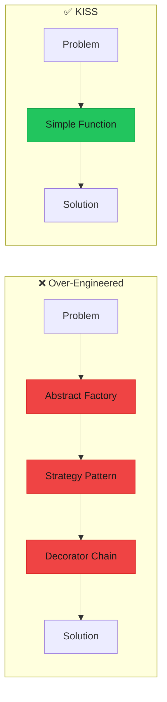
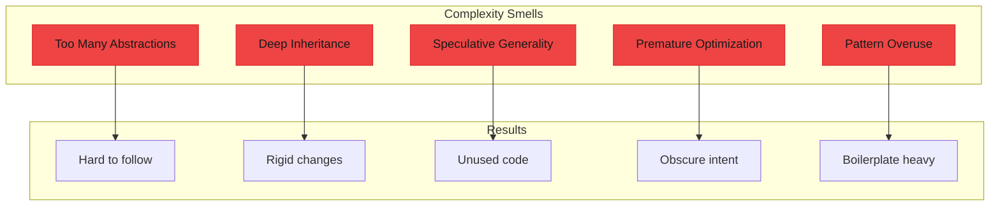

import { Accordion, Accordions } from "fumadocs-ui/components/accordion";
import { Callout } from "fumadocs-ui/components/callout";
import { Tab, Tabs } from "fumadocs-ui/components/tabs";

# KISS - Keep It Simple, Stupid

> **"Simplicity is the ultimate sophistication."** — Leonardo da Vinci

> **"Everything should be made as simple as possible, but not simpler."** — Albert Einstein

KISS is about choosing the simplest solution that solves the problem. Complexity should be justified by requirements, not speculation or cleverness.



---

## The Problem

### Over-Engineering Simple Tasks

When developers anticipate future requirements or try to make code "extensible," they often create unnecessary complexity.

```typescript
/**
 * ❌ BAD: Massively over-engineered solution for a simple task
 * 
 * Task: Check if a user is an adult (age >= 18)
 */

// Step 1: Create a validation strategy interface
interface ValidationStrategy<T> {
  validate: (value: T) => boolean;
  getErrorMessage: () => string;
  getSuccessMessage: () => string;
}

// Step 2: Create a validation context
interface ValidationContext<T> {
  setStrategy: (strategy: ValidationStrategy<T>) => void;
  execute: (value: T) => ValidationResult;
}

interface ValidationResult {
  isValid: boolean;
  message: string;
  timestamp: Date;
  validationType: string;
}

// Step 3: Create a validation factory
interface ValidationFactory {
  createAgeValidator: () => ValidationStrategy<number>;
  createEmailValidator: () => ValidationStrategy<string>;
  // ... more validators we might need someday
}

// Step 4: Implement the context
const createValidationContext = <T>(): ValidationContext<T> => {
  let currentStrategy: ValidationStrategy<T> | null = null;
  
  return {
    setStrategy(strategy) {
      currentStrategy = strategy;
    },
    execute(value) {
      if (!currentStrategy) {
        throw new Error("No validation strategy set");
      }
      
      const isValid = currentStrategy.validate(value);
      
      return {
        isValid,
        message: isValid 
          ? currentStrategy.getSuccessMessage()
          : currentStrategy.getErrorMessage(),
        timestamp: new Date(),
        validationType: "strategy-based",
      };
    },
  };
};

// Step 5: Implement the adult validation strategy
const createAdultValidationStrategy = (): ValidationStrategy<number> => ({
  validate: (age) => age >= 18,
  getErrorMessage: () => "User is not an adult",
  getSuccessMessage: () => "User is an adult",
});

// Step 6: Use all of this machinery
const context = createValidationContext<number>();
context.setStrategy(createAdultValidationStrategy());
const result = context.execute(25);
console.log(result.isValid); // true

// All that for... checking if age >= 18?
// 50+ lines of code for a one-liner
```

---

## The Solution

### Start Simple, Add Complexity When Needed

<Tabs items={["Simple Functions", "Readable Over Clever", "Progressive Complexity", "Real Simplicity"]}>
<Tab value="Simple Functions">

```typescript
/**
 * ✅ GOOD: Start with the simplest solution
 */

// Task: Check if a user is an adult
const isAdult = (age: number): boolean => age >= 18;

// That's it! One line, perfectly clear.

// Usage is obvious
console.log(isAdult(25)); // true
console.log(isAdult(16)); // false

// Need to check for senior? Add another simple function
const isSenior = (age: number): boolean => age >= 65;

// Need configurable age check? Still simple!
const isAtLeast = (minAge: number) => (age: number): boolean => age >= minAge;

const canDrinkInUSA = isAtLeast(21);
const canRentCar = isAtLeast(25);

console.log(canDrinkInUSA(22)); // true
console.log(canRentCar(23));    // false

// Need validation with error messages? Keep it simple!
interface ValidationResult {
  valid: boolean;
  error?: string;
}

const validateAge = (age: number, minAge: number = 18): ValidationResult => {
  if (age < minAge) {
    return { valid: false, error: `Age must be at least ${minAge}` };
  }
  return { valid: true };
};

console.log(validateAge(25));     // { valid: true }
console.log(validateAge(16));     // { valid: false, error: "Age must be at least 18" }
console.log(validateAge(20, 21)); // { valid: false, error: "Age must be at least 21" }
```

</Tab>
<Tab value="Readable Over Clever">

```typescript
/**
 * ✅ GOOD: Readable code beats clever code
 */

// ❌ BAD: Clever one-liners that are hard to understand
interface CartItem {
  name: string;
  price: number;
  quantity: number;
}

const items: CartItem[] = [
  { name: "A", price: 10, quantity: 2 },
  { name: "B", price: 20, quantity: 1 },
  { name: "C", price: 15, quantity: 3 },
];

// "Clever" version - what does this do?
const total1 = items.reduce((a, i) => a + i.price * i.quantity * (i.quantity > 2 ? 0.9 : 1), 0);

// ✅ GOOD: Clear, step-by-step version
const calculateTotal = (items: CartItem[]): number => {
  let total = 0;
  
  for (const item of items) {
    const itemTotal = item.price * item.quantity;
    
    // Apply 10% bulk discount for quantity > 2
    const discount = item.quantity > 2 ? 0.1 : 0;
    const discountedTotal = itemTotal * (1 - discount);
    
    total += discountedTotal;
  }
  
  return total;
};

console.log(calculateTotal(items)); // 65.5

// ❌ BAD: Clever regex nobody can read
const obscureEmailCheck = (e: string) => /^(?:[a-z0-9!#$%&'*+/=?^_`{|}~-]+(?:\.[a-z0-9!#$%&'*+/=?^_`{|}~-]+)*|"(?:[\x01-\x08\x0b\x0c\x0e-\x1f\x21\x23-\x5b\x5d-\x7f]|\\[\x01-\x09\x0b\x0c\x0e-\x7f])*")@(?:(?:[a-z0-9](?:[a-z0-9-]*[a-z0-9])?\.)+[a-z0-9](?:[a-z0-9-]*[a-z0-9])?|\[(?:(?:25[0-5]|2[0-4][0-9]|[01]?[0-9][0-9]?)\.){3}(?:25[0-5]|2[0-4][0-9]|[01]?[0-9][0-9]?|[a-z0-9-]*[a-z0-9]:(?:[\x01-\x08\x0b\x0c\x0e-\x1f\x21-\x5a\x53-\x7f]|\\[\x01-\x09\x0b\x0c\x0e-\x7f])+)\])$/i.test(e);

// ✅ GOOD: Simple, good-enough email check
const isValidEmail = (email: string): boolean => {
  // Simple check: has @, has something before and after
  if (!email.includes("@")) return false;
  
  const [local, domain] = email.split("@");
  
  if (!local || !domain) return false;
  if (!domain.includes(".")) return false;
  
  return true;
};

// Even better: use a library for complex validation
// import { z } from "zod";
// const emailSchema = z.string().email();

// ❌ BAD: Overly clever nested ternary
const getStatus1 = (score: number) => 
  score >= 90 ? "A" : score >= 80 ? "B" : score >= 70 ? "C" : score >= 60 ? "D" : "F";

// ✅ GOOD: Clear switch or if-else
const getGrade = (score: number): string => {
  if (score >= 90) return "A";
  if (score >= 80) return "B";
  if (score >= 70) return "C";
  if (score >= 60) return "D";
  return "F";
};

// Or with a lookup (also clear)
const GRADE_THRESHOLDS = [
  { min: 90, grade: "A" },
  { min: 80, grade: "B" },
  { min: 70, grade: "C" },
  { min: 60, grade: "D" },
  { min: 0, grade: "F" },
] as const;

const getGradeAlt = (score: number): string => {
  const match = GRADE_THRESHOLDS.find(t => score >= t.min);
  return match?.grade ?? "F";
};
```

</Tab>
<Tab value="Progressive Complexity">

```typescript
/**
 * ✅ GOOD: Add complexity only when requirements demand it
 */

// STAGE 1: Initial requirement - fetch user data
// Simple implementation, no abstraction needed
const fetchUser1 = async (id: string) => {
  const response = await fetch(`/api/users/${id}`);
  return response.json();
};

// STAGE 2: New requirement - need error handling
// Still simple, just add try/catch
const fetchUser2 = async (id: string) => {
  try {
    const response = await fetch(`/api/users/${id}`);
    
    if (!response.ok) {
      throw new Error(`HTTP ${response.status}`);
    }
    
    return await response.json();
  } catch (error) {
    console.error("Failed to fetch user:", error);
    return null;
  }
};

// STAGE 3: New requirement - need retry on failure
// Now it's worth creating a small abstraction
const fetchWithRetry = async <T>(
  url: string,
  maxRetries: number = 3
): Promise<T | null> => {
  for (let attempt = 1; attempt <= maxRetries; attempt++) {
    try {
      const response = await fetch(url);
      
      if (!response.ok) {
        throw new Error(`HTTP ${response.status}`);
      }
      
      return await response.json();
    } catch (error) {
      console.error(`Attempt ${attempt} failed:`, error);
      
      if (attempt === maxRetries) {
        return null;
      }
      
      // Simple exponential backoff
      await new Promise(r => setTimeout(r, 1000 * attempt));
    }
  }
  
  return null;
};

const fetchUser3 = (id: string) => 
  fetchWithRetry<{ id: string; name: string }>(`/api/users/${id}`);

// STAGE 4: New requirement - need caching
// Now we add a cache layer, still keeping it simple
interface Cache<T> {
  get: (key: string) => T | undefined;
  set: (key: string, value: T, ttlMs: number) => void;
}

const createSimpleCache = <T>(): Cache<T> => {
  const cache = new Map<string, { value: T; expiresAt: number }>();
  
  return {
    get(key) {
      const entry = cache.get(key);
      if (!entry) return undefined;
      if (Date.now() > entry.expiresAt) {
        cache.delete(key);
        return undefined;
      }
      return entry.value;
    },
    set(key, value, ttlMs) {
      cache.set(key, { value, expiresAt: Date.now() + ttlMs });
    },
  };
};

const userCache = createSimpleCache<{ id: string; name: string }>();

const fetchUser4 = async (id: string) => {
  // Check cache first
  const cached = userCache.get(id);
  if (cached) return cached;
  
  // Fetch if not cached
  const user = await fetchWithRetry<{ id: string; name: string }>(`/api/users/${id}`);
  
  if (user) {
    userCache.set(id, user, 60000); // Cache for 1 minute
  }
  
  return user;
};

// Notice: We only added complexity when REQUIRED
// Each stage is still simple and understandable
```

</Tab>
<Tab value="Real Simplicity">

```typescript
/**
 * ✅ GOOD: Real-world simplicity examples
 */

// --- Example 1: Simple state machine ---

type OrderStatus = "pending" | "paid" | "shipped" | "delivered" | "cancelled";

// ❌ COMPLEX: State machine library with guards, actions, services
// ✅ SIMPLE: Just a function with clear logic
const getNextStatuses = (current: OrderStatus): OrderStatus[] => {
  switch (current) {
    case "pending":
      return ["paid", "cancelled"];
    case "paid":
      return ["shipped", "cancelled"];
    case "shipped":
      return ["delivered"];
    case "delivered":
    case "cancelled":
      return []; // Terminal states
  }
};

const canTransition = (from: OrderStatus, to: OrderStatus): boolean => {
  return getNextStatuses(from).includes(to);
};

// --- Example 2: Simple event system ---

// ❌ COMPLEX: Full pub/sub with namespaces, wildcards, async handling
// ✅ SIMPLE: Basic event emitter
type EventHandler<T> = (data: T) => void;

const createEventEmitter = <Events extends { [key: string]: unknown }>() => {
  const handlers = new Map<keyof Events, Set<EventHandler<unknown>>>();
  
  return {
    on<K extends keyof Events>(event: K, handler: EventHandler<Events[K]>) {
      if (!handlers.has(event)) handlers.set(event, new Set());
      handlers.get(event)!.add(handler as EventHandler<unknown>);
    },
    
    off<K extends keyof Events>(event: K, handler: EventHandler<Events[K]>) {
      handlers.get(event)?.delete(handler as EventHandler<unknown>);
    },
    
    emit<K extends keyof Events>(event: K, data: Events[K]) {
      handlers.get(event)?.forEach(h => h(data));
    },
  };
};

// Usage is dead simple
type AppEvents = {
  userLoggedIn: { userId: string };
  orderCreated: { orderId: string; total: number };
};

const events = createEventEmitter<AppEvents>();

events.on("userLoggedIn", ({ userId }) => {
  console.log(`User ${userId} logged in`);
});

events.emit("userLoggedIn", { userId: "123" });

// --- Example 3: Simple config ---

// ❌ COMPLEX: Config service with validation, watchers, encryption
// ✅ SIMPLE: Just an object with type safety
const Config = {
  api: {
    baseUrl: process.env.API_URL ?? "http://localhost:3000",
    timeout: Number(process.env.API_TIMEOUT ?? 5000),
  },
  features: {
    darkMode: process.env.FEATURE_DARK_MODE === "true",
    betaFeatures: process.env.FEATURE_BETA === "true",
  },
  limits: {
    maxUploadSize: 10 * 1024 * 1024, // 10MB
    maxItems: 100,
  },
} as const;

// Usage
console.log(Config.api.baseUrl);
console.log(Config.features.darkMode);

// --- Example 4: Simple dependency injection ---

// ❌ COMPLEX: IoC container with decorators, auto-wiring, scopes
// ✅ SIMPLE: Just pass dependencies as parameters
interface Logger {
  info: (msg: string) => void;
}

interface Database {
  query: (sql: string) => Promise<unknown[]>;
}

// Dependencies as parameters
const createUserService = (deps: { logger: Logger; db: Database }) => ({
  async getUser(id: string) {
    deps.logger.info(`Fetching user ${id}`);
    const results = await deps.db.query(`SELECT * FROM users WHERE id = '${id}'`);
    return results[0];
  },
});

// Wire up at app startup
const logger: Logger = { info: console.log };
const db: Database = { query: async () => [] };
const userService = createUserService({ logger, db });
```

</Tab>
</Tabs>

---

## Complexity Indicators

### When Code is Too Complex



### Questions to Ask

Before adding complexity, ask:

1. **What problem does this solve?** - If you can't articulate it, don't add it
2. **Is this solving today's problem or tomorrow's guess?** - Solve today's
3. **Can a junior developer understand this?** - If not, simplify
4. **Will this be easy to change later?** - Simplicity enables change
5. **Am I showing off?** - Clever code impresses no one during maintenance

---

## When Complexity IS Justified

```typescript
/**
 * Sometimes complexity IS necessary - but justify it
 */

// --- SIMPLE CASE: Just need one retry ---
const fetchWithSimpleRetry = async (url: string) => {
  try {
    return await fetch(url);
  } catch {
    return await fetch(url); // One retry, done
  }
};

// --- COMPLEX CASE: Real requirements demand it ---
// Requirements:
// 1. Configurable retry count
// 2. Exponential backoff
// 3. Jitter to prevent thundering herd
// 4. Different strategies for different error types
// 5. Observability (logging, metrics)
// 6. Circuit breaker for cascading failures

interface RetryConfig {
  maxAttempts: number;
  initialDelayMs: number;
  maxDelayMs: number;
  backoffFactor: number;
  jitterFactor: number;
  retryableErrors: string[];
  onRetry?: (attempt: number, error: Error, nextDelayMs: number) => void;
}

interface CircuitBreakerState {
  failures: number;
  lastFailure: number;
  state: "closed" | "open" | "half-open";
}

const createResilientFetcher = (config: RetryConfig) => {
  const circuitBreaker: CircuitBreakerState = {
    failures: 0,
    lastFailure: 0,
    state: "closed",
  };
  
  const calculateDelay = (attempt: number): number => {
    const exponentialDelay = config.initialDelayMs * Math.pow(config.backoffFactor, attempt - 1);
    const cappedDelay = Math.min(exponentialDelay, config.maxDelayMs);
    const jitter = cappedDelay * config.jitterFactor * Math.random();
    return Math.floor(cappedDelay + jitter);
  };
  
  const shouldRetry = (error: Error): boolean => {
    return config.retryableErrors.some(e => error.message.includes(e));
  };
  
  const checkCircuitBreaker = (): boolean => {
    if (circuitBreaker.state === "open") {
      // Check if enough time has passed
      if (Date.now() - circuitBreaker.lastFailure > 30000) {
        circuitBreaker.state = "half-open";
        return true;
      }
      return false;
    }
    return true;
  };
  
  return async (url: string, options?: RequestInit): Promise<Response> => {
    if (!checkCircuitBreaker()) {
      throw new Error("Circuit breaker is open");
    }
    
    let lastError: Error | null = null;
    
    for (let attempt = 1; attempt <= config.maxAttempts; attempt++) {
      try {
        const response = await fetch(url, options);
        
        // Reset circuit breaker on success
        circuitBreaker.failures = 0;
        circuitBreaker.state = "closed";
        
        return response;
      } catch (error) {
        lastError = error as Error;
        
        // Update circuit breaker
        circuitBreaker.failures++;
        circuitBreaker.lastFailure = Date.now();
        
        if (circuitBreaker.failures >= 5) {
          circuitBreaker.state = "open";
        }
        
        // Check if we should retry
        if (attempt < config.maxAttempts && shouldRetry(lastError)) {
          const delayMs = calculateDelay(attempt);
          config.onRetry?.(attempt, lastError, delayMs);
          await new Promise(r => setTimeout(r, delayMs));
        }
      }
    }
    
    throw lastError;
  };
};

// This complexity is JUSTIFIED because:
// 1. Each feature was a real requirement
// 2. The system handles millions of requests
// 3. Failure resilience is critical
// 4. The complexity is encapsulated and tested
```

---

## Use Cases & Problem Solving

<Accordions>
<Accordion title="When to Apply KISS">

### Apply KISS When:

1. **Starting a new feature** - Begin with simplest solution
2. **Refactoring** - Simplify overly complex code
3. **Code review** - Challenge unnecessary complexity
4. **Debugging** - Complex code hides bugs
5. **Onboarding** - Simple code is easier to learn

</Accordion>

<Accordion title="KISS Violation Symptoms">

### Red Flags:

- More than 3 levels of indentation
- Functions longer than 20-30 lines
- More abstractions than concrete implementations
- Design patterns without a problem to solve
- "Framework" for a one-off task
- Comments explaining what the code does (not why)

</Accordion>

<Accordion title="Simplification Techniques">

### How to Simplify:

1. **Extract and name** - Give complex logic clear names
2. **Remove dead code** - Delete unused abstractions
3. **Flatten nesting** - Use early returns
4. **Split functions** - One function, one job
5. **Use standard library** - Don't reinvent the wheel
6. **Delete comments** - Make code self-documenting

</Accordion>

<Accordion title="KISS vs DRY Tension">

### When They Conflict:

Sometimes DRY leads to complex abstractions:

```typescript
// DRY but complex
const createValidator = <T>(rules: Array<{
  validate: (v: T) => boolean;
  message: string;
}>) => (value: T) => {
  for (const rule of rules) {
    if (!rule.validate(value)) return { valid: false, error: rule.message };
  }
  return { valid: true };
};

// KISS but slightly repetitive
const validateEmail = (email: string) => {
  if (!email.includes("@")) return { valid: false, error: "Invalid email" };
  return { valid: true };
};

const validateAge = (age: number) => {
  if (age < 18) return { valid: false, error: "Must be 18+" };
  return { valid: true };
};

// Choose based on context:
// - Few validators? KISS wins
// - Many validators? DRY wins (abstraction cost is worth it)
```

</Accordion>
</Accordions>

---

## Summary

| Aspect | Complex Code | Simple Code |
|--------|--------------|-------------|
| **Understanding** | Requires deep study | Obvious at a glance |
| **Debugging** | Hard to trace | Easy to follow |
| **Changing** | Risky modifications | Confident changes |
| **Onboarding** | Long ramp-up | Quick productivity |
| **Testing** | Many edge cases | Straightforward |

<Callout type="info" title="Key Takeaway">
**Simple code is not dumb code.** Writing simple code is actually harder than writing complex code. It requires deep understanding to distill a problem to its essence. When in doubt, choose the boring, obvious solution.
</Callout>

## Related Principles

- **[YAGNI](/docs/architecture/clean/principles/yagni)** - Don't add unneeded complexity
- **[DRY](/docs/architecture/clean/principles/dry)** - But don't over-abstract
- **[Single Responsibility](/docs/architecture/clean/principles/srp)** - Simple modules are focused modules
