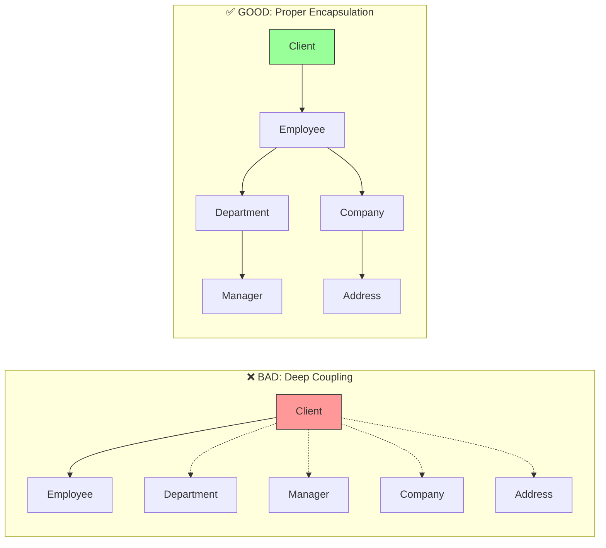
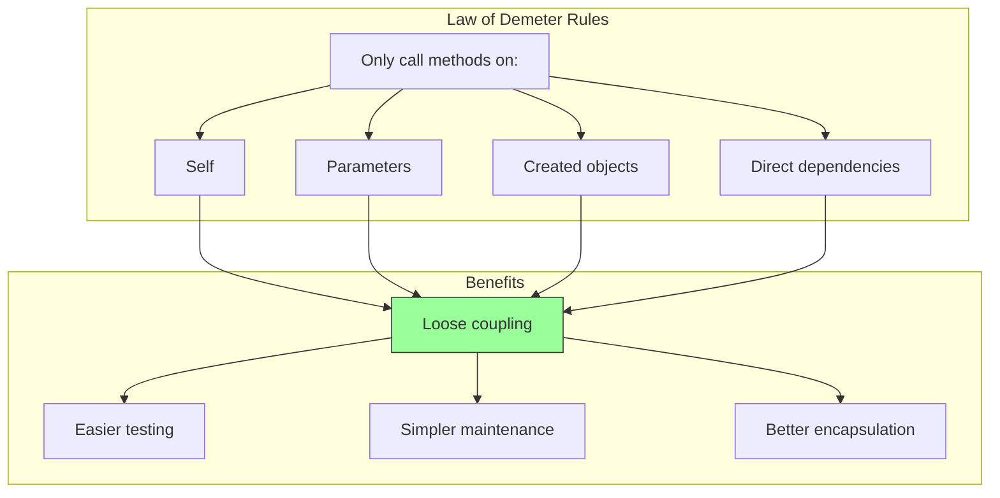

import { Accordion, Accordions } from "fumadocs-ui/components/accordion";
import { Callout } from "fumadocs-ui/components/callout";
import { Step, Steps } from "fumadocs-ui/components/steps";
import { Tab, Tabs } from "fumadocs-ui/components/tabs";

# Law of Demeter (LoD)

The Law of Demeter, also known as the **Principle of Least Knowledge**, states that a unit should only talk to its immediate friends and not to strangers. In practice: **don't chain method calls across multiple objects**.

<Callout type="info">
"Only talk to your immediate friends, don't talk to strangers."
</Callout>

## The Problem

When code reaches through objects to access other objects, it creates **tight coupling** between components that shouldn't know about each other. This leads to:

- **Fragile code** that breaks when internal structures change
- **Hidden dependencies** that are hard to track
- **Difficult testing** due to deep coupling
- **Poor encapsulation** exposing internal details

### ❌ BAD: Train Wreck (Method Chaining)

<Tabs items={["TypeScript"]}>
<Tab value="TypeScript">
```typescript
// Violating Law of Demeter with deep object traversal

interface Address {
  street: string;
  city: string;
  zipCode: string;
}

interface Department {
  name: string;
  manager: Employee;
}

interface Company {
  name: string;
  address: Address;
}

interface Employee {
  name: string;
  department: Department;
  company: Company;
}

// ❌ BAD: Reaching deep into object graph
const getEmployeeCity = (employee: Employee): string => {
  // This function "knows" the entire object structure
  return employee.company.address.city;
  //     ^^^^^^^^ ^^^^^^^ ^^^^^^^ ^^^^
  //     We're talking to a stranger's stranger's stranger!
};

// ❌ BAD: Even worse chaining
const getManagerZipCode = (employee: Employee): string => {
  return employee.department.manager.company.address.zipCode;
  //     Train wreck: employee → department → manager → company → address → zipCode
};

// ❌ BAD: This code is coupled to internal structure of:
// - Employee
// - Department  
// - Company
// - Address
// If ANY of these change, this code breaks!

const formatEmployeeLocation = (employee: Employee): string => {
  const city = employee.company.address.city;
  const street = employee.company.address.street;
  const dept = employee.department.name;
  const manager = employee.department.manager.name;
  
  return `${employee.name} works in ${dept} at ${street}, ${city}. Manager: ${manager}`;
};
```
</Tab>
</Tabs>

**Problems with this code:**
- Changes to `Address` structure break unrelated code
- Changes to `Company` structure break employee-related code
- Deep knowledge of object internals required
- Hard to mock for testing (need to create entire object graph)

## The Solution

Each object should only communicate with its direct dependencies. Provide methods that encapsulate internal navigation.

### ✅ GOOD: Tell, Don't Ask

<Tabs items={["TypeScript"]}>
<Tab value="TypeScript">
```typescript
// Following Law of Demeter with proper encapsulation

interface Address {
  street: string;
  city: string;
  zipCode: string;
}

// Address knows how to format itself
const createAddress = (street: string, city: string, zipCode: string) => ({
  street,
  city,
  zipCode,
  getFormattedLocation: () => `${street}, ${city} ${zipCode}`,
  getCity: () => city,
  getZipCode: () => zipCode,
});

type AddressType = ReturnType<typeof createAddress>;

// Company provides access to location info
const createCompany = (name: string, address: AddressType) => ({
  name,
  getCity: () => address.getCity(),
  getZipCode: () => address.getZipCode(),
  getFormattedAddress: () => address.getFormattedLocation(),
});

type CompanyType = ReturnType<typeof createCompany>;

// Department provides manager info
const createDepartment = (name: string, manager: EmployeeType | null = null) => ({
  name,
  getManagerName: () => manager?.getName() ?? "No manager",
});

type DepartmentType = ReturnType<typeof createDepartment>;

// Employee delegates to its immediate friends
interface EmployeeType {
  getName: () => string;
  getCity: () => string;
  getZipCode: () => string;
  getDepartmentName: () => string;
  getManagerName: () => string;
  getLocationSummary: () => string;
}

const createEmployee = (
  name: string,
  department: DepartmentType,
  company: CompanyType
): EmployeeType => ({
  getName: () => name,
  
  // Delegate to immediate friend (company)
  getCity: () => company.getCity(),
  getZipCode: () => company.getZipCode(),
  
  // Delegate to immediate friend (department)
  getDepartmentName: () => department.name,
  getManagerName: () => department.getManagerName(),
  
  // Compose information from immediate friends
  getLocationSummary: () => {
    return `${name} works in ${department.name} at ${company.getFormattedAddress()}`;
  },
});

// ✅ GOOD: Clean API that hides internal structure
const printEmployeeInfo = (employee: EmployeeType): void => {
  console.log(`Name: ${employee.getName()}`);
  console.log(`City: ${employee.getCity()}`);
  console.log(`Department: ${employee.getDepartmentName()}`);
  console.log(`Manager: ${employee.getManagerName()}`);
  // We only talk to employee, our immediate friend!
};
```
</Tab>
</Tabs>

**Benefits:**
- Changes to `Address` only affect `createAddress`
- Client code only knows about `Employee` interface
- Easy to test with simple mocks
- Clear, encapsulated API

## Law of Demeter Visualization



## The Rule of Three

An object's method should only call methods on:

<Steps>
### Itself

The object's own methods.

```typescript
getName() {
  return this.formatName(this.firstName, this.lastName);
}
```

### Its parameters

Objects passed as arguments.

```typescript
process(order: Order) {
  order.validate(); // ✅ OK - parameter
}
```

### Objects it creates

Objects instantiated within the method.

```typescript
createReport() {
  const report = new Report(); // ✅ Created here
  report.generate();
  return report;
}
```

### Its direct components

Objects held as properties/fields.

```typescript
// this.logger is a direct component
save(data: Data) {
  this.logger.info("Saving...");
  this.repository.save(data);
}
```

</Steps>

## Real-World Example: E-Commerce

### ❌ BAD: Reaching Through Objects

<Tabs items={["TypeScript"]}>
<Tab value="TypeScript">
```typescript
interface Product {
  name: string;
  price: number;
}

interface CartItem {
  product: Product;
  quantity: number;
}

interface Cart {
  items: CartItem[];
  customer: Customer;
}

interface PaymentMethod {
  type: string;
  last4: string;
}

interface Customer {
  name: string;
  email: string;
  defaultPayment: PaymentMethod;
}

// ❌ BAD: Checkout knows too much about cart internals
const checkout = (cart: Cart): void => {
  // Reaching into cart → items → product → price
  const total = cart.items.reduce(
    (sum, item) => sum + item.product.price * item.quantity,
    0
  );

  // Reaching into cart → customer → email
  const email = cart.customer.email;

  // Reaching into cart → customer → defaultPayment → last4
  const payment = cart.customer.defaultPayment.last4;

  console.log(`Charging ${total} to card ending ${payment}`);
  console.log(`Confirmation sent to ${email}`);
};
```
</Tab>
</Tabs>

### ✅ GOOD: Each Object Handles Its Responsibility

<Tabs items={["TypeScript"]}>
<Tab value="TypeScript">
```typescript
interface Product {
  name: string;
  price: number;
}

const createCartItem = (product: Product, quantity: number) => ({
  product,
  quantity,
  getSubtotal: () => product.price * quantity,
  getProductName: () => product.name,
});

type CartItemType = ReturnType<typeof createCartItem>;

const createPaymentMethod = (type: string, last4: string) => ({
  type,
  last4,
  getMaskedDisplay: () => `**** **** **** ${last4}`,
  getType: () => type,
});

type PaymentMethodType = ReturnType<typeof createPaymentMethod>;

const createCustomer = (
  name: string,
  email: string,
  defaultPayment: PaymentMethodType
) => ({
  name,
  email,
  getEmail: () => email,
  getPaymentDisplay: () => defaultPayment.getMaskedDisplay(),
  getPaymentType: () => defaultPayment.getType(),
});

type CustomerType = ReturnType<typeof createCustomer>;

const createCart = (customer: CustomerType) => {
  const items: CartItemType[] = [];

  return {
    addItem: (item: CartItemType) => items.push(item),

    // Cart knows how to calculate its own total
    getTotal: () => items.reduce((sum, item) => sum + item.getSubtotal(), 0),

    // Cart delegates to customer for customer-related info
    getCustomerEmail: () => customer.getEmail(),
    getPaymentDisplay: () => customer.getPaymentDisplay(),

    // Cart can provide a summary
    getSummary: () => ({
      itemCount: items.length,
      total: items.reduce((sum, item) => sum + item.getSubtotal(), 0),
      items: items.map((item) => ({
        name: item.getProductName(),
        subtotal: item.getSubtotal(),
      })),
    }),
  };
};

type CartType = ReturnType<typeof createCart>;

// ✅ GOOD: Checkout only talks to cart
const checkout = (cart: CartType): void => {
  const total = cart.getTotal();
  const email = cart.getCustomerEmail();
  const payment = cart.getPaymentDisplay();

  console.log(`Charging $${total} to ${payment}`);
  console.log(`Confirmation sent to ${email}`);
};

// Usage
const payment = createPaymentMethod("visa", "4242");
const customer = createCustomer("John", "john@example.com", payment);
const cart = createCart(customer);

cart.addItem(createCartItem({ name: "Book", price: 29.99 }, 2));

checkout(cart); // Only knows about cart interface
```
</Tab>
</Tabs>

## Wrapper Pattern for External Dependencies

When dealing with external libraries, wrap them to follow LoD:

<Tabs items={["TypeScript"]}>
<Tab value="TypeScript">
```typescript
// Simulating external library types
interface StripeCustomer {
  id: string;
  metadata: Record<string, string>;
}
interface StripeCharge {
  id: string;
  receipt_url: string;
}
interface StripeChargeParams {
  amount: number;
  currency: string;
  customer: string;
}

// ❌ BAD: Exposing Stripe internals throughout codebase
const processPaymentBad = async (
  stripe: { customers: { retrieve: (id: string) => Promise<StripeCustomer> }; charges: { create: (params: StripeChargeParams) => Promise<StripeCharge> } },
  customerId: string,
  amount: number
) => {
  // Everyone using this needs to know Stripe's internal structure
  const customer = await stripe.customers.retrieve(customerId);
  const charge = await stripe.charges.create({
    amount,
    currency: "usd",
    customer: customer.id,
  });
  return charge.receipt_url;
};

// ✅ GOOD: Wrap external dependency
interface PaymentResult {
  success: boolean;
  transactionId: string;
  receiptUrl?: string;
}

const createPaymentService = (stripeClient: {
  customers: { retrieve: (id: string) => Promise<StripeCustomer> };
  charges: { create: (params: StripeChargeParams) => Promise<StripeCharge> };
}) => ({
  chargeCustomer: async (
    customerId: string,
    amountCents: number
  ): Promise<PaymentResult> => {
    try {
      const customer = await stripeClient.customers.retrieve(customerId);
      const charge = await stripeClient.charges.create({
        amount: amountCents,
        currency: "usd",
        customer: customer.id,
      });

      return {
        success: true,
        transactionId: charge.id,
        receiptUrl: charge.receipt_url,
      };
    } catch (error) {
      return {
        success: false,
        transactionId: "",
      };
    }
  },
});

// Client code doesn't know about Stripe at all
const processOrder = async (
  paymentService: ReturnType<typeof createPaymentService>,
  customerId: string,
  total: number
): Promise<void> => {
  const result = await paymentService.chargeCustomer(customerId, total * 100);
  if (result.success) {
    console.log(`Payment successful: ${result.transactionId}`);
  }
};
```
</Tab>
</Tabs>

## When to Apply LoD

<Accordions>
<Accordion title="Apply Strictly">

- **Domain objects**: Customer, Order, Product
- **External API wrappers**: Payment, Email, Storage
- **Cross-module communication**: Between bounded contexts
- **Public APIs**: Any interface exposed to consumers

</Accordion>

<Accordion title="Flexibility Allowed">

- **Data Transfer Objects (DTOs)**: Simple data containers
- **Fluent APIs**: Builder patterns designed for chaining
- **Internal module code**: Within tightly coupled components
- **Functional pipelines**: Composable transformations

```typescript
// DTOs are OK to access directly
interface UserDTO {
  id: string;
  profile: {
    name: string;
    avatar: string;
  };
}

// Fluent builders are OK
const query = (table: string) => ({
  select: (columns: string[]) => ({
    where: (condition: string) => ({
      orderBy: (column: string) => `SELECT ${columns.join(", ")} FROM ${table} WHERE ${condition} ORDER BY ${column}`,
    }),
  }),
});

const sql = query("users").select(["id", "name"]).where("active = true").orderBy("created_at");
```

</Accordion>

<Accordion title="Code Smells Indicating Violations">

- Multiple dots in a single expression: `a.b.c.d`
- Null checks chained: `a?.b?.c?.d`
- Many imports from internal modules
- Tests requiring complex object graph setup
- Changes to one class breaking unrelated classes

</Accordion>
</Accordions>

## Summary



<Callout type="warn">
The goal isn't to avoid all dot notation—it's to avoid reaching through objects to access things that should be hidden. Ask yourself: "Does this object need to know about that object's internals?"
</Callout>

## Related Principles

- **[Tell Don't Ask](/docs/architecture/clean/principles/tell-dont-ask)** - Related pattern for encapsulation
- **[SRP](/docs/architecture/clean/principles/srp)** - Each object handles its own concerns
- **[ISP](/docs/architecture/clean/principles/isp)** - Expose minimal interfaces
