import { Accordion, Accordions } from "fumadocs-ui/components/accordion";
import { Callout } from "fumadocs-ui/components/callout";
import { Tab, Tabs } from "fumadocs-ui/components/tabs";

# Liskov Substitution Principle (LSP)

> **"Objects of a superclass should be replaceable with objects of a subclass without affecting the correctness of the program."** — Barbara Liskov

If `S` is a subtype of `T`, then objects of type `T` may be replaced with objects of type `S` without altering any of the desirable properties of the program (correctness, task performed, etc.).

```mermaid
graph LR
    subgraph "❌ LSP Violation"
        Bird1[Bird] --> Penguin1[Penguin]
        Penguin1 -.->|"fly() throws error"| X[💥]
    end
    
    subgraph "✅ LSP Compliant"
        Bird2[Bird]
        FlyingBird[FlyingBird] --> Bird2
        SwimmingBird[SwimmingBird] --> Bird2
        Eagle[Eagle] --> FlyingBird
        Penguin2[Penguin] --> SwimmingBird
    end
    
    style X fill:#ef4444,stroke:#dc2626,color:#1a1a1a
    style Bird2 fill:#22c55e,stroke:#16a34a,color:#1a1a1a
```



---

## The Problem

### The Classic Rectangle-Square Problem

A square IS-A rectangle mathematically, but not in object-oriented programming when rectangles are mutable.

```typescript
/**
 * ❌ BAD: Square violates LSP because it doesn't behave like a Rectangle
 * 
 * A Rectangle contract says:
 * - width and height can be set independently
 * - area = width × height
 * 
 * A Square breaks this contract because setting width also sets height
 */

interface Rectangle {
  width: number;
  height: number;
  setWidth: (width: number) => void;
  setHeight: (height: number) => void;
  getArea: () => number;
}

// Rectangle works as expected
const createRectangle = (width: number, height: number): Rectangle => {
  const rect = {
    width,
    height,
    setWidth(w: number) {
      rect.width = w;
    },
    setHeight(h: number) {
      rect.height = h;
    },
    getArea() {
      return rect.width * rect.height;
    },
  };
  return rect;
};

// Square "IS-A" Rectangle? Let's see...
const createSquare = (side: number): Rectangle => {
  const square = {
    width: side,
    height: side,
    setWidth(w: number) {
      // 🚨 Violates Rectangle contract!
      // Changing width also changes height
      square.width = w;
      square.height = w; // Unexpected side effect!
    },
    setHeight(h: number) {
      // 🚨 Same problem
      square.width = h;
      square.height = h;
    },
    getArea() {
      return square.width * square.height;
    },
  };
  return square;
};

// Function that works with Rectangles
const resizeAndCalculate = (rect: Rectangle): number => {
  rect.setWidth(5);
  rect.setHeight(10);
  
  // For a true Rectangle: 5 × 10 = 50
  // But for a Square: 10 × 10 = 100 (because setHeight also set width!)
  return rect.getArea();
};

// Test with Rectangle - works correctly
const rectangle = createRectangle(2, 3);
console.log(resizeAndCalculate(rectangle)); // 50 ✅

// Test with Square - BREAKS!
const square = createSquare(4);
console.log(resizeAndCalculate(square)); // 100 ❌ Expected 50!

// The Square is NOT substitutable for Rectangle
// even though it "is-a" Rectangle mathematically
```

### The Bird-Penguin Problem

```typescript
/**
 * ❌ BAD: Penguin violates LSP - not all birds can fly!
 */

interface Bird {
  name: string;
  fly: () => string;
  makeSound: () => string;
}

const createEagle = (name: string): Bird => ({
  name,
  fly() {
    return `${this.name} soars through the sky`;
  },
  makeSound() {
    return `${this.name}: Screech!`;
  },
});

const createPenguin = (name: string): Bird => ({
  name,
  fly() {
    // 🚨 Violates LSP - penguins can't fly!
    throw new Error(`${this.name} cannot fly - I'm a penguin!`);
  },
  makeSound() {
    return `${this.name}: Honk!`;
  },
});

// Function that works with birds
const migrateBirds = (birds: Bird[]): string[] => {
  return birds.map(bird => bird.fly()); // 💥 Throws for penguin!
};

const eagle = createEagle("Eddie");
const penguin = createPenguin("Pablo");

try {
  migrateBirds([eagle, penguin]);
} catch (e) {
  console.error("Migration failed!"); // Penguin broke the migration
}
```

---

## The Solution

### Proper Abstraction Hierarchy

<Tabs items={["Shapes Solution", "Birds Solution", "Payment Example", "Storage Example"]}>
<Tab value="Shapes Solution">

```typescript
/**
 * ✅ GOOD: Proper shape hierarchy that respects LSP
 * 
 * Key insight: Make shapes immutable or use proper abstraction
 */

// --- Immutable Shape Interface ---
interface Shape {
  readonly type: string;
  getArea: () => number;
  getPerimeter: () => number;
  scale: (factor: number) => Shape;
  describe: () => string;
}

// --- Rectangle (immutable) ---
interface Rectangle extends Shape {
  readonly type: "rectangle";
  readonly width: number;
  readonly height: number;
}

const createRectangle = (width: number, height: number): Rectangle => ({
  type: "rectangle",
  width,
  height,
  
  getArea() {
    return width * height;
  },
  
  getPerimeter() {
    return 2 * (width + height);
  },
  
  scale(factor) {
    return createRectangle(width * factor, height * factor);
  },
  
  describe() {
    return `Rectangle ${width}×${height}`;
  },
});

// --- Square (immutable, NOT a subtype of Rectangle) ---
interface Square extends Shape {
  readonly type: "square";
  readonly side: number;
}

const createSquare = (side: number): Square => ({
  type: "square",
  side,
  
  getArea() {
    return side * side;
  },
  
  getPerimeter() {
    return 4 * side;
  },
  
  scale(factor) {
    return createSquare(side * factor);
  },
  
  describe() {
    return `Square ${side}×${side}`;
  },
});

// --- Circle ---
interface Circle extends Shape {
  readonly type: "circle";
  readonly radius: number;
}

const createCircle = (radius: number): Circle => ({
  type: "circle",
  radius,
  
  getArea() {
    return Math.PI * radius * radius;
  },
  
  getPerimeter() {
    return 2 * Math.PI * radius;
  },
  
  scale(factor) {
    return createCircle(radius * factor);
  },
  
  describe() {
    return `Circle r=${radius}`;
  },
});

// --- Functions work with ANY shape (LSP compliant) ---
const calculateTotalArea = (shapes: Shape[]): number => {
  return shapes.reduce((total, shape) => total + shape.getArea(), 0);
};

const scaleAll = (shapes: Shape[], factor: number): Shape[] => {
  return shapes.map(shape => shape.scale(factor));
};

const describeShapes = (shapes: Shape[]): string[] => {
  return shapes.map(shape => 
    `${shape.describe()} - Area: ${shape.getArea().toFixed(2)}, Perimeter: ${shape.getPerimeter().toFixed(2)}`
  );
};

// All shapes are substitutable!
const shapes: Shape[] = [
  createRectangle(10, 5),
  createSquare(7),
  createCircle(3),
];

console.log("Total area:", calculateTotalArea(shapes));
console.log("Descriptions:", describeShapes(shapes));

// Scaling works correctly for all shapes
const scaled = scaleAll(shapes, 2);
console.log("Scaled:", describeShapes(scaled));
```

</Tab>
<Tab value="Birds Solution">

```typescript
/**
 * ✅ GOOD: Proper bird hierarchy with capability-based interfaces
 */

// --- Base capabilities ---
interface Animal {
  readonly name: string;
  readonly species: string;
  eat: () => string;
  sleep: () => string;
}

interface Vocal {
  makeSound: () => string;
}

interface Flyable {
  fly: () => string;
  getMaxAltitude: () => number;
}

interface Swimmable {
  swim: () => string;
  getMaxDepth: () => number;
}

interface Walkable {
  walk: () => string;
}

// --- Compose types based on capabilities ---
type FlyingBird = Animal & Vocal & Flyable & Walkable;
type SwimmingBird = Animal & Vocal & Swimmable & Walkable;
type AmphibiousBird = Animal & Vocal & Flyable & Swimmable & Walkable;

// --- Eagle (flying bird) ---
const createEagle = (name: string): FlyingBird => ({
  name,
  species: "Bald Eagle",
  
  eat() {
    return `${name} hunts fish from the sky`;
  },
  
  sleep() {
    return `${name} sleeps in a high nest`;
  },
  
  makeSound() {
    return `${name}: Screech!`;
  },
  
  fly() {
    return `${name} soars majestically through the sky`;
  },
  
  getMaxAltitude() {
    return 3000; // meters
  },
  
  walk() {
    return `${name} hops on talons`;
  },
});

// --- Penguin (swimming bird - NO fly method!) ---
const createPenguin = (name: string): SwimmingBird => ({
  name,
  species: "Emperor Penguin",
  
  eat() {
    return `${name} catches fish underwater`;
  },
  
  sleep() {
    return `${name} sleeps standing up`;
  },
  
  makeSound() {
    return `${name}: Honk honk!`;
  },
  
  swim() {
    return `${name} glides gracefully underwater`;
  },
  
  getMaxDepth() {
    return 500; // meters - emperor penguins dive deep!
  },
  
  walk() {
    return `${name} waddles adorably`;
  },
});

// --- Duck (amphibious bird - can fly AND swim) ---
const createDuck = (name: string): AmphibiousBird => ({
  name,
  species: "Mallard Duck",
  
  eat() {
    return `${name} dabbles for food`;
  },
  
  sleep() {
    return `${name} sleeps by the pond`;
  },
  
  makeSound() {
    return `${name}: Quack quack!`;
  },
  
  fly() {
    return `${name} flies in V-formation`;
  },
  
  getMaxAltitude() {
    return 6000; // meters - ducks can fly high!
  },
  
  swim() {
    return `${name} paddles on the water`;
  },
  
  getMaxDepth() {
    return 3; // meters - dabbling ducks don't dive deep
  },
  
  walk() {
    return `${name} waddles on webbed feet`;
  },
});

// --- Functions work with proper types ---
const migrateFlyingBirds = (birds: Flyable[]): string[] => {
  return birds.map(bird => bird.fly()); // No errors - all Flyable can fly!
};

const divingCompetition = (birds: (Swimmable & { name: string })[]): { name: string; depth: number }[] => {
  return birds
    .map(bird => ({ name: bird.name, depth: bird.getMaxDepth() }))
    .sort((a, b) => b.depth - a.depth);
};

const choirPractice = (singers: Vocal[]): string[] => {
  return singers.map(singer => singer.makeSound());
};

// Usage - type-safe and LSP compliant
const eagle = createEagle("Eddie");
const penguin = createPenguin("Pablo");
const duck = createDuck("Donald");

// Only flying birds migrate - penguin excluded by TYPE SYSTEM
console.log(migrateFlyingBirds([eagle, duck]));
// migrateFlyingBirds([penguin]); // ❌ Type error - penguin isn't Flyable

// Diving competition - eagle excluded by TYPE SYSTEM
console.log(divingCompetition([penguin, duck]));

// All birds can make sounds
console.log(choirPractice([eagle, penguin, duck]));
```

</Tab>
<Tab value="Payment Example">

```typescript
/**
 * ✅ GOOD: Payment methods with proper LSP compliance
 */

// --- Base payment result ---
interface PaymentResult {
  success: boolean;
  transactionId: string;
  amount: number;
  currency: string;
  timestamp: Date;
  receiptUrl?: string;
}

// --- Base payment method interface ---
interface PaymentMethod {
  readonly id: string;
  readonly name: string;
  readonly supportedCurrencies: string[];
  
  isAvailable: () => boolean;
  validate: () => { valid: boolean; errors: string[] };
  charge: (amount: number, currency: string) => Promise<PaymentResult>;
  getDisplayInfo: () => string;
}

// --- Refundable payment methods ---
interface RefundablePaymentMethod extends PaymentMethod {
  refund: (transactionId: string, amount: number) => Promise<PaymentResult>;
  getRefundableAmount: (transactionId: string) => Promise<number>;
}

// --- Recurring payment methods ---
interface RecurringPaymentMethod extends PaymentMethod {
  setupRecurring: (interval: "monthly" | "yearly") => Promise<string>;
  cancelRecurring: (subscriptionId: string) => Promise<boolean>;
}

// --- Credit Card (supports refunds and recurring) ---
interface CreditCardData {
  cardNumber: string;
  expiryMonth: number;
  expiryYear: number;
  cvv: string;
  cardholderName: string;
}

const createCreditCardPayment = (
  data: CreditCardData
): RefundablePaymentMethod & RecurringPaymentMethod => {
  const refundedAmounts = new Map<string, number>();
  
  return {
    id: "credit_card",
    name: "Credit Card",
    supportedCurrencies: ["USD", "EUR", "GBP", "CAD"],
    
    isAvailable() {
      return true; // Always available
    },
    
    validate() {
      const errors: string[] = [];
      
      if (data.cardNumber.replace(/\s/g, "").length !== 16) {
        errors.push("Invalid card number");
      }
      
      if (data.cvv.length < 3) {
        errors.push("Invalid CVV");
      }
      
      const now = new Date();
      const expiry = new Date(data.expiryYear, data.expiryMonth - 1);
      if (expiry < now) {
        errors.push("Card expired");
      }
      
      return { valid: errors.length === 0, errors };
    },
    
    async charge(amount, currency) {
      const transactionId = `cc_${Date.now()}_${Math.random().toString(36).slice(2, 8)}`;
      
      return {
        success: true,
        transactionId,
        amount,
        currency,
        timestamp: new Date(),
        receiptUrl: `https://receipts.example.com/${transactionId}`,
      };
    },
    
    getDisplayInfo() {
      return `Card ending in ${data.cardNumber.slice(-4)}`;
    },
    
    // Refundable interface
    async refund(transactionId, amount) {
      const existing = refundedAmounts.get(transactionId) ?? 0;
      refundedAmounts.set(transactionId, existing + amount);
      
      return {
        success: true,
        transactionId: `refund_${transactionId}`,
        amount: -amount,
        currency: "USD",
        timestamp: new Date(),
      };
    },
    
    async getRefundableAmount(transactionId) {
      // In real impl, would check original charge amount
      const refunded = refundedAmounts.get(transactionId) ?? 0;
      return 100 - refunded; // Assume original was $100
    },
    
    // Recurring interface
    async setupRecurring(interval) {
      return `sub_${interval}_${Date.now()}`;
    },
    
    async cancelRecurring(subscriptionId) {
      console.log(`Cancelled subscription: ${subscriptionId}`);
      return true;
    },
  };
};

// --- Bank Transfer (supports refunds, NOT recurring) ---
interface BankTransferData {
  accountNumber: string;
  routingNumber: string;
  accountHolderName: string;
}

const createBankTransferPayment = (
  data: BankTransferData
): RefundablePaymentMethod => ({
  id: "bank_transfer",
  name: "Bank Transfer (ACH)",
  supportedCurrencies: ["USD"],
  
  isAvailable() {
    return true;
  },
  
  validate() {
    const errors: string[] = [];
    
    if (data.accountNumber.length < 8) {
      errors.push("Invalid account number");
    }
    
    if (data.routingNumber.length !== 9) {
      errors.push("Invalid routing number");
    }
    
    return { valid: errors.length === 0, errors };
  },
  
  async charge(amount, currency) {
    return {
      success: true,
      transactionId: `ach_${Date.now()}`,
      amount,
      currency,
      timestamp: new Date(),
    };
  },
  
  getDisplayInfo() {
    return `Bank account ending in ${data.accountNumber.slice(-4)}`;
  },
  
  async refund(transactionId, amount) {
    return {
      success: true,
      transactionId: `refund_${transactionId}`,
      amount: -amount,
      currency: "USD",
      timestamp: new Date(),
    };
  },
  
  async getRefundableAmount() {
    return 100; // Full amount refundable
  },
  
  // Note: NO setupRecurring or cancelRecurring - bank transfer doesn't support it
});

// --- Crypto (NO refunds, NO recurring) ---
interface CryptoData {
  walletAddress: string;
  network: "ethereum" | "bitcoin";
}

const createCryptoPayment = (data: CryptoData): PaymentMethod => ({
  id: "crypto",
  name: `Crypto (${data.network})`,
  supportedCurrencies: ["BTC", "ETH", "USDC"],
  
  isAvailable() {
    return true;
  },
  
  validate() {
    const patterns = {
      ethereum: /^0x[a-fA-F0-9]{40}$/,
      bitcoin: /^[13][a-km-zA-HJ-NP-Z1-9]{25,34}$/,
    };
    
    const valid = patterns[data.network].test(data.walletAddress);
    return {
      valid,
      errors: valid ? [] : ["Invalid wallet address"],
    };
  },
  
  async charge(amount, currency) {
    return {
      success: true,
      transactionId: `crypto_${data.network}_${Date.now()}`,
      amount,
      currency,
      timestamp: new Date(),
    };
  },
  
  getDisplayInfo() {
    return `${data.network} wallet ${data.walletAddress.slice(0, 8)}...`;
  },
  
  // Note: NO refund or recurring methods - crypto doesn't support it
});

// --- Functions work with appropriate types ---

// All payment methods can be charged
const chargePayment = async (
  method: PaymentMethod,
  amount: number,
  currency: string
): Promise<PaymentResult> => {
  const validation = method.validate();
  if (!validation.valid) {
    throw new Error(validation.errors.join(", "));
  }
  
  return method.charge(amount, currency);
};

// Only refundable methods can be refunded
const processRefund = async (
  method: RefundablePaymentMethod,
  transactionId: string,
  amount: number
): Promise<PaymentResult> => {
  const refundable = await method.getRefundableAmount(transactionId);
  
  if (amount > refundable) {
    throw new Error(`Can only refund up to ${refundable}`);
  }
  
  return method.refund(transactionId, amount);
};

// Only recurring methods can setup subscriptions
const setupSubscription = async (
  method: RecurringPaymentMethod,
  interval: "monthly" | "yearly"
): Promise<string> => {
  return method.setupRecurring(interval);
};

// Usage - LSP compliant, type-safe
const creditCard = createCreditCardPayment({
  cardNumber: "4111111111111111",
  expiryMonth: 12,
  expiryYear: 2025,
  cvv: "123",
  cardholderName: "John Doe",
});

const bankTransfer = createBankTransferPayment({
  accountNumber: "123456789",
  routingNumber: "021000021",
  accountHolderName: "John Doe",
});

const crypto = createCryptoPayment({
  walletAddress: "0x742d35Cc6634C0532925a3b844Bc454e4438f44e",
  network: "ethereum",
});

// All can be charged
await chargePayment(creditCard, 100, "USD");
await chargePayment(bankTransfer, 50, "USD");
await chargePayment(crypto, 25, "ETH");

// Only card and bank can refund
await processRefund(creditCard, "cc_123", 50);
await processRefund(bankTransfer, "ach_456", 25);
// processRefund(crypto, ...); // ❌ Type error - crypto isn't refundable!

// Only card can do recurring
await setupSubscription(creditCard, "monthly");
// setupSubscription(bankTransfer, ...); // ❌ Type error - bank isn't recurring!
```

</Tab>
<Tab value="Storage Example">

```typescript
/**
 * ✅ GOOD: Storage backends with proper capability interfaces
 */

// --- Base storage interface ---
interface StorageBackend {
  readonly name: string;
  readonly type: string;
  
  get: (key: string) => Promise<Buffer | null>;
  put: (key: string, data: Buffer) => Promise<void>;
  delete: (key: string) => Promise<boolean>;
  exists: (key: string) => Promise<boolean>;
  list: (prefix?: string) => Promise<string[]>;
}

// --- Versioned storage (supports history) ---
interface VersionedStorage extends StorageBackend {
  getVersion: (key: string, version: number) => Promise<Buffer | null>;
  listVersions: (key: string) => Promise<{ version: number; timestamp: Date }[]>;
  deleteVersion: (key: string, version: number) => Promise<boolean>;
}

// --- Expiring storage (supports TTL) ---
interface ExpiringStorage extends StorageBackend {
  putWithTTL: (key: string, data: Buffer, ttlSeconds: number) => Promise<void>;
  getTTL: (key: string) => Promise<number | null>;
  setTTL: (key: string, ttlSeconds: number) => Promise<boolean>;
}

// --- In-Memory Storage (basic, expiring) ---
const createMemoryStorage = (): ExpiringStorage => {
  const store = new Map<string, { data: Buffer; expiresAt?: number }>();
  
  const cleanup = () => {
    const now = Date.now();
    for (const [key, value] of store.entries()) {
      if (value.expiresAt && value.expiresAt < now) {
        store.delete(key);
      }
    }
  };
  
  return {
    name: "Memory Storage",
    type: "memory",
    
    async get(key) {
      cleanup();
      return store.get(key)?.data ?? null;
    },
    
    async put(key, data) {
      store.set(key, { data });
    },
    
    async delete(key) {
      return store.delete(key);
    },
    
    async exists(key) {
      cleanup();
      return store.has(key);
    },
    
    async list(prefix) {
      cleanup();
      const keys = Array.from(store.keys());
      return prefix 
        ? keys.filter(k => k.startsWith(prefix))
        : keys;
    },
    
    // Expiring interface
    async putWithTTL(key, data, ttlSeconds) {
      store.set(key, {
        data,
        expiresAt: Date.now() + ttlSeconds * 1000,
      });
    },
    
    async getTTL(key) {
      const entry = store.get(key);
      if (!entry?.expiresAt) return null;
      
      const remaining = entry.expiresAt - Date.now();
      return remaining > 0 ? Math.ceil(remaining / 1000) : null;
    },
    
    async setTTL(key, ttlSeconds) {
      const entry = store.get(key);
      if (!entry) return false;
      
      entry.expiresAt = Date.now() + ttlSeconds * 1000;
      return true;
    },
  };
};

// --- S3 Storage (basic, versioned) ---
const createS3Storage = (bucket: string): VersionedStorage => {
  // Simulated S3 with versioning
  const versions = new Map<string, { version: number; data: Buffer; timestamp: Date }[]>();
  
  return {
    name: `S3 (${bucket})`,
    type: "s3",
    
    async get(key) {
      const history = versions.get(key);
      if (!history || history.length === 0) return null;
      
      return history[history.length - 1].data;
    },
    
    async put(key, data) {
      const history = versions.get(key) ?? [];
      const version = history.length + 1;
      
      history.push({
        version,
        data,
        timestamp: new Date(),
      });
      
      versions.set(key, history);
    },
    
    async delete(key) {
      return versions.delete(key);
    },
    
    async exists(key) {
      return versions.has(key);
    },
    
    async list(prefix) {
      const keys = Array.from(versions.keys());
      return prefix 
        ? keys.filter(k => k.startsWith(prefix))
        : keys;
    },
    
    // Versioned interface
    async getVersion(key, version) {
      const history = versions.get(key);
      if (!history) return null;
      
      const entry = history.find(h => h.version === version);
      return entry?.data ?? null;
    },
    
    async listVersions(key) {
      const history = versions.get(key) ?? [];
      return history.map(h => ({
        version: h.version,
        timestamp: h.timestamp,
      }));
    },
    
    async deleteVersion(key, version) {
      const history = versions.get(key);
      if (!history) return false;
      
      const index = history.findIndex(h => h.version === version);
      if (index === -1) return false;
      
      history.splice(index, 1);
      return true;
    },
  };
};

// --- Functions work with appropriate types ---

// All storage backends can do basic operations
const storeFile = async (
  storage: StorageBackend,
  key: string,
  content: string
): Promise<void> => {
  const data = Buffer.from(content, "utf-8");
  await storage.put(key, data);
  console.log(`Stored ${key} in ${storage.name}`);
};

// Only versioned storage can access history
const getFileHistory = async (
  storage: VersionedStorage,
  key: string
): Promise<void> => {
  const versions = await storage.listVersions(key);
  console.log(`${key} has ${versions.length} versions:`);
  
  for (const v of versions) {
    console.log(`  v${v.version} - ${v.timestamp.toISOString()}`);
  }
};

// Only expiring storage can set TTL
const storeWithExpiry = async (
  storage: ExpiringStorage,
  key: string,
  content: string,
  ttl: number
): Promise<void> => {
  const data = Buffer.from(content, "utf-8");
  await storage.putWithTTL(key, data, ttl);
  console.log(`Stored ${key} with ${ttl}s TTL`);
};

// Usage - LSP compliant
const memoryStorage = createMemoryStorage();
const s3Storage = createS3Storage("my-bucket");

// Both can store files
await storeFile(memoryStorage, "config.json", '{"key": "value"}');
await storeFile(s3Storage, "config.json", '{"key": "value"}');

// Only S3 has versioning
await getFileHistory(s3Storage, "config.json");
// getFileHistory(memoryStorage, ...); // ❌ Type error!

// Only memory has TTL
await storeWithExpiry(memoryStorage, "cache-item", "data", 3600);
// storeWithExpiry(s3Storage, ...); // ❌ Type error!
```

</Tab>
</Tabs>

---

## LSP Rules

### The Four Conditions

For a subtype `S` to be substitutable for type `T`:


```typescript
/**
 * LSP Rules Illustrated
 */

// --- 1. Preconditions (input requirements) ---
// Subtype can be MORE lenient, not stricter

interface BaseProcessor {
  // Accepts numbers from 0-100
  process: (value: number) => number;
}

// ❌ BAD: Stricter precondition (only 0-50)
const strictProcessor: BaseProcessor = {
  process(value) {
    if (value > 50) throw new Error("Value too high!"); // 🚨 Violates LSP
    return value * 2;
  },
};

// ✅ GOOD: Same or more lenient precondition
const lenientProcessor: BaseProcessor = {
  process(value) {
    // Accepts same range or wider
    return value * 2;
  },
};

// --- 2. Postconditions (output guarantees) ---
// Subtype must provide AT LEAST what base promises

interface Calculator {
  // Guarantees: returns positive number
  calculate: (a: number, b: number) => number;
}

// ❌ BAD: Weaker postcondition (might return negative)
const badCalc: Calculator = {
  calculate(a, b) {
    return a - b; // 🚨 Might be negative!
  },
};

// ✅ GOOD: Same or stronger postcondition
const goodCalc: Calculator = {
  calculate(a, b) {
    return Math.abs(a - b); // Always positive
  },
};

// --- 3. Invariants (always-true properties) ---
// What's true for base must be true for subtype

interface SortedList {
  items: number[];
  add: (value: number) => void;
  // Invariant: items are always sorted
}

const createSortedList = (): SortedList => {
  const items: number[] = [];
  
  return {
    get items() { return [...items]; },
    add(value) {
      // Maintain sorted invariant
      const index = items.findIndex(item => item > value);
      if (index === -1) {
        items.push(value);
      } else {
        items.splice(index, 0, value);
      }
    },
  };
};

// --- 4. History Constraint ---
// Subtype can't modify state in ways base wouldn't

interface ImmutablePoint {
  readonly x: number;
  readonly y: number;
  move: (dx: number, dy: number) => ImmutablePoint;
}

const createPoint = (x: number, y: number): ImmutablePoint => ({
  x,
  y,
  move(dx, dy) {
    return createPoint(x + dx, y + dy); // Returns NEW point, original unchanged
  },
});

// ❌ BAD: Would violate history if it mutated existing point
// ✅ GOOD: Returns new point, preserving immutability
```

---

## Use Cases & Problem Solving

<Accordions>
<Accordion title="When to Apply LSP">

### Apply LSP When:

1. **Designing inheritance hierarchies** - Ensure subtypes are substitutable
2. **Implementing interfaces** - Honor the contract fully
3. **Creating mock objects** - Mocks must behave like real objects
4. **Building plugin systems** - Plugins must be interchangeable
5. **Writing polymorphic code** - Functions that work with base types

</Accordion>

<Accordion title="LSP Violation Symptoms">

### Red Flags:

```typescript
interface Animal {
  eat: () => void;
}

interface Bird extends Animal {
  fly?: () => void; // 🚨 Optional method = potential violation
}

// ❌ Type checking to determine subtype
const feedAnimal = (animal: Animal & { type?: string }) => {
  if (animal.type === "bird") {
    // Special handling for birds
  }
};

// ❌ instanceof checks
const process = (obj: object) => {
  if (obj instanceof Error) {
    // Different behavior based on type
  }
};

// ❌ Throwing errors for unsupported operations
const square = {
  setWidth(w: number) {
    // Set both width and height
  },
  setHeight(h: number) {
    throw new Error("Squares can't have independent height!");
  },
};
```

</Accordion>

<Accordion title="Fixing LSP Violations">

### Step-by-Step:

1. **Identify the problematic subtype** - Which type breaks substitutability?
2. **Analyze the contract** - What does the base type promise?
3. **Consider composition** - Maybe it shouldn't be a subtype
4. **Split the interface** - Use ISP to create more specific interfaces
5. **Use capability interfaces** - `Flyable`, `Swimmable`, etc.
6. **Make types immutable** - Prevents many LSP violations

</Accordion>

<Accordion title="LSP vs IS-A Relationship">

### IS-A Doesn't Mean Substitutable:

| Mathematical IS-A | OOP Substitutable |
|-------------------|-------------------|
| Square IS-A Rectangle | ❌ No (when mutable) |
| Penguin IS-A Bird | ❌ No (if Bird.fly() exists) |
| Stack IS-A List | ❌ No (different operations) |
| Circle IS-A Ellipse | ❌ No (when mutable) |

**Rule**: Inheritance should be based on BEHAVIOR, not taxonomy!

</Accordion>
</Accordions>

---

## Summary

| Aspect | LSP Violation | LSP Compliant |
|--------|--------------|---------------|
| **Subtype Behavior** | Different from base | Consistent with base |
| **Client Code** | Needs type checking | Works uniformly |
| **Error Handling** | Throws unexpected errors | Predictable behavior |
| **Testing** | Special cases per type | Same tests for all types |
| **Polymorphism** | Breaks at runtime | Works correctly |

<Callout type="info" title="Key Takeaway">
**LSP is about behavioral compatibility**, not just interface matching. A subtype must be usable anywhere the base type is expected without the client knowing the difference. When in doubt, prefer composition over inheritance.
</Callout>

## Related Principles

- **[Open/Closed Principle](/docs/architecture/clean/principles/ocp)** - LSP enables safe extension
- **[Interface Segregation](/docs/architecture/clean/principles/isp)** - Helps avoid LSP violations
- **[Composition over Inheritance](/docs/architecture/clean/principles/composition)** - Alternative to inheritance
