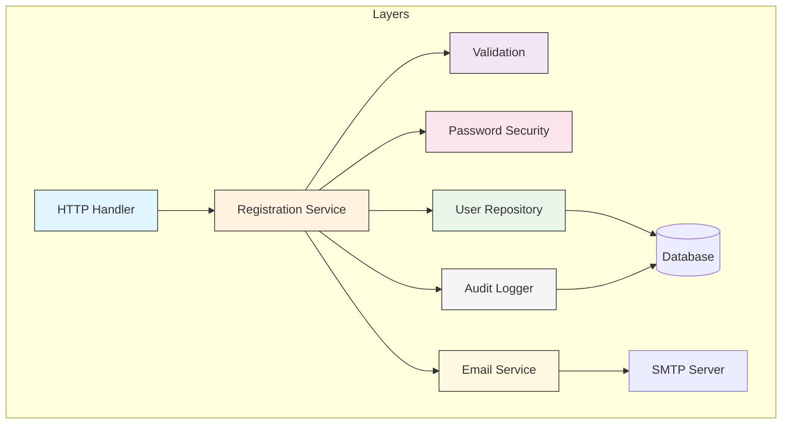

import { Accordion, Accordions } from "fumadocs-ui/components/accordion";
import { Callout } from "fumadocs-ui/components/callout";
import { Step, Steps } from "fumadocs-ui/components/steps";
import { Tab, Tabs } from "fumadocs-ui/components/tabs";

# Separation of Concerns (SoC)

**Divide your program into distinct sections, each addressing a separate concern.** A concern is a set of information that affects the code of a program. Different concerns should be handled by different parts of the system.

<Callout type="info">
"Let me try to explain to you, what to my taste is characteristic for all intelligent thinking. It is, that one is willing to study in depth an aspect of one's subject matter in isolation for the sake of its own consistency." - Edsger W. Dijkstra
</Callout>

## The Problem

When different concerns are mixed together, you get code that is:

- **Hard to understand**: Too much happening in one place
- **Hard to maintain**: Changes affect unrelated functionality
- **Hard to test**: Dependencies are intertwined
- **Hard to reuse**: Components are too tightly coupled

### ❌ BAD: Mixed Concerns

<Tabs items={["TypeScript"]}>
<Tab value="TypeScript">
```typescript
// Everything mixed together in one function

const handleUserRegistration = async (
  req: { body: { email: string; password: string; name: string } },
  res: { json: (data: unknown) => void; status: (code: number) => { json: (data: unknown) => void } }
) => {
  // 🔴 Input validation
  const { email, password, name } = req.body;

  if (!email || !email.includes("@")) {
    return res.status(400).json({ error: "Invalid email" });
  }

  if (!password || password.length < 8) {
    return res.status(400).json({ error: "Password too short" });
  }

  // 🔴 Business logic
  const existingUser = await db.query(
    "SELECT id FROM users WHERE email = $1",
    [email]
  );

  if (existingUser.rows.length > 0) {
    return res.status(409).json({ error: "Email already exists" });
  }

  // 🔴 Security - password hashing
  const salt = crypto.randomBytes(16).toString("hex");
  const hash = crypto
    .pbkdf2Sync(password, salt, 1000, 64, "sha512")
    .toString("hex");

  // 🔴 Database operations
  const result = await db.query(
    `INSERT INTO users (email, name, password_hash, salt, created_at)
     VALUES ($1, $2, $3, $4, NOW())
     RETURNING id`,
    [email, name, hash, salt]
  );

  // 🔴 Email sending
  const mailOptions = {
    from: "noreply@example.com",
    to: email,
    subject: "Welcome!",
    html: `<h1>Welcome ${name}!</h1><p>Click to verify...</p>`,
  };

  await transporter.sendMail(mailOptions);

  // 🔴 Logging
  console.log(`New user registered: ${email}`);
  await db.query(
    "INSERT INTO audit_log (action, user_id, timestamp) VALUES ($1, $2, NOW())",
    ["REGISTER", result.rows[0].id]
  );

  // 🔴 Response formatting
  return res.json({
    success: true,
    user: { id: result.rows[0].id, email, name },
    message: "Registration successful",
  });
};
```
</Tab>
</Tabs>

**Problems:**
- Validation, business logic, database, email, logging all in one place
- Can't test business logic without mocking database, email, etc.
- Can't reuse validation logic elsewhere
- Changes to email format affect registration function

## The Solution

Separate each concern into its own module or layer. Each piece does one thing well and can be developed, tested, and maintained independently.

### ✅ GOOD: Separated Concerns

<Tabs items={["TypeScript"]}>
<Tab value="TypeScript">
```typescript
// Each concern in its own module

// ═══════════════════════════════════════════════
// CONCERN 1: Validation
// ═══════════════════════════════════════════════

interface ValidationResult {
  valid: boolean;
  errors: string[];
}

interface RegistrationInput {
  email: string;
  password: string;
  name: string;
}

const validateEmail = (email: string): ValidationResult => {
  const errors: string[] = [];
  
  if (!email) {
    errors.push("Email is required");
  } else if (!email.includes("@")) {
    errors.push("Invalid email format");
  }
  
  return { valid: errors.length === 0, errors };
};

const validatePassword = (password: string): ValidationResult => {
  const errors: string[] = [];
  
  if (!password) {
    errors.push("Password is required");
  } else if (password.length < 8) {
    errors.push("Password must be at least 8 characters");
  }
  
  return { valid: errors.length === 0, errors };
};

const validateRegistrationInput = (input: RegistrationInput): ValidationResult => {
  const emailValidation = validateEmail(input.email);
  const passwordValidation = validatePassword(input.password);
  
  return {
    valid: emailValidation.valid && passwordValidation.valid,
    errors: [...emailValidation.errors, ...passwordValidation.errors],
  };
};

// ═══════════════════════════════════════════════
// CONCERN 2: Password Security
// ═══════════════════════════════════════════════

interface HashedPassword {
  hash: string;
  salt: string;
}

const hashPassword = (password: string): HashedPassword => {
  const salt = crypto.randomBytes(16).toString("hex");
  const hash = crypto
    .pbkdf2Sync(password, salt, 1000, 64, "sha512")
    .toString("hex");
  return { hash, salt };
};

const verifyPassword = (
  password: string,
  { hash, salt }: HashedPassword
): boolean => {
  const testHash = crypto
    .pbkdf2Sync(password, salt, 1000, 64, "sha512")
    .toString("hex");
  return testHash === hash;
};

// ═══════════════════════════════════════════════
// CONCERN 3: User Repository (Data Access)
// ═══════════════════════════════════════════════

interface User {
  id: string;
  email: string;
  name: string;
  createdAt: Date;
}

interface UserRepository {
  findByEmail: (email: string) => Promise<User | null>;
  create: (data: {
    email: string;
    name: string;
    passwordHash: string;
    salt: string;
  }) => Promise<User>;
}

const createUserRepository = (db: Database): UserRepository => ({
  findByEmail: async (email: string): Promise<User | null> => {
    const result = await db.query(
      "SELECT id, email, name, created_at FROM users WHERE email = $1",
      [email]
    );
    return result.rows[0] || null;
  },

  create: async (data) => {
    const result = await db.query(
      `INSERT INTO users (email, name, password_hash, salt, created_at)
       VALUES ($1, $2, $3, $4, NOW())
       RETURNING id, email, name, created_at`,
      [data.email, data.name, data.passwordHash, data.salt]
    );
    return result.rows[0];
  },
});

// ═══════════════════════════════════════════════
// CONCERN 4: Email Service
// ═══════════════════════════════════════════════

interface EmailService {
  sendWelcome: (email: string, name: string) => Promise<void>;
}

const createEmailService = (transporter: MailTransporter): EmailService => ({
  sendWelcome: async (email: string, name: string): Promise<void> => {
    await transporter.sendMail({
      from: "noreply@example.com",
      to: email,
      subject: "Welcome!",
      html: `<h1>Welcome ${name}!</h1><p>Click to verify...</p>`,
    });
  },
});

// ═══════════════════════════════════════════════
// CONCERN 5: Audit Logging
// ═══════════════════════════════════════════════

interface AuditLogger {
  log: (action: string, userId: string, details?: object) => Promise<void>;
}

const createAuditLogger = (db: Database): AuditLogger => ({
  log: async (action: string, userId: string, details?: object) => {
    await db.query(
      "INSERT INTO audit_log (action, user_id, details, timestamp) VALUES ($1, $2, $3, NOW())",
      [action, userId, JSON.stringify(details || {})]
    );
  },
});

// ═══════════════════════════════════════════════
// CONCERN 6: Registration Use Case (Orchestration)
// ═══════════════════════════════════════════════

interface RegistrationResult {
  success: boolean;
  user?: User;
  error?: string;
}

const createRegistrationService = (deps: {
  userRepository: UserRepository;
  emailService: EmailService;
  auditLogger: AuditLogger;
}) => ({
  register: async (input: RegistrationInput): Promise<RegistrationResult> => {
    // Validate
    const validation = validateRegistrationInput(input);
    if (!validation.valid) {
      return { success: false, error: validation.errors.join(", ") };
    }

    // Check existing
    const existing = await deps.userRepository.findByEmail(input.email);
    if (existing) {
      return { success: false, error: "Email already exists" };
    }

    // Hash password
    const { hash, salt } = hashPassword(input.password);

    // Create user
    const user = await deps.userRepository.create({
      email: input.email,
      name: input.name,
      passwordHash: hash,
      salt,
    });

    // Send welcome email (fire and forget)
    deps.emailService.sendWelcome(user.email, user.name).catch(console.error);

    // Audit log
    await deps.auditLogger.log("REGISTER", user.id);

    return { success: true, user };
  },
});

// ═══════════════════════════════════════════════
// CONCERN 7: HTTP Handler (Transport)
// ═══════════════════════════════════════════════

const createRegistrationHandler = (
  registrationService: ReturnType<typeof createRegistrationService>
) => async (
  req: Request,
  res: Response
) => {
  const result = await registrationService.register(req.body);

  if (!result.success) {
    const status = result.error?.includes("already exists") ? 409 : 400;
    return res.status(status).json({ error: result.error });
  }

  return res.json({
    success: true,
    user: result.user,
    message: "Registration successful",
  });
};
```
</Tab>
</Tabs>

## Separation Visualization



## Common Separations

<Accordions>
<Accordion title="Horizontal Separation (Layers)">

Organize code into layers with clear responsibilities:

```typescript
// Presentation Layer - handles HTTP, formats responses
const userController = {
  getUser: async (req: Request, res: Response) => {
    const user = await userService.findById(req.params.id);
    res.json(formatUserResponse(user));
  },
};

// Business Layer - contains domain logic
const userService = {
  findById: async (id: string) => {
    const user = await userRepository.findById(id);
    if (!user) throw new NotFoundError("User not found");
    return user;
  },
};

// Data Access Layer - handles persistence
const userRepository = {
  findById: async (id: string) => {
    return db.query("SELECT * FROM users WHERE id = $1", [id]);
  },
};
```

**Common layers:**
- Presentation (Controllers, Views)
- Application (Use Cases, Services)
- Domain (Entities, Business Rules)
- Infrastructure (Database, External APIs)

</Accordion>

<Accordion title="Vertical Separation (Features)">

Organize code by feature or domain:

```
src/
├── users/
│   ├── user.controller.ts
│   ├── user.service.ts
│   ├── user.repository.ts
│   └── user.types.ts
├── orders/
│   ├── order.controller.ts
│   ├── order.service.ts
│   ├── order.repository.ts
│   └── order.types.ts
└── products/
    ├── product.controller.ts
    ├── product.service.ts
    ├── product.repository.ts
    └── product.types.ts
```

Each feature contains all its layers, making it self-contained.

</Accordion>

<Accordion title="Cross-Cutting Concerns">

Some concerns span multiple features. Handle them separately:

```typescript
// Logging - separate aspect
const withLogging = <T extends (...args: unknown[]) => unknown>(
  fn: T,
  name: string
) => {
  return ((...args: Parameters<T>) => {
    console.log(`[${name}] Called with:`, args);
    const result = fn(...args);
    console.log(`[${name}] Returned:`, result);
    return result;
  }) as T;
};

// Error handling - separate middleware
const errorHandler = (err: Error, req: Request, res: Response, next: NextFunction) => {
  if (err instanceof ValidationError) {
    return res.status(400).json({ error: err.message });
  }
  if (err instanceof NotFoundError) {
    return res.status(404).json({ error: err.message });
  }
  console.error(err);
  return res.status(500).json({ error: "Internal server error" });
};

// Authentication - separate middleware
const authMiddleware = (req: Request, res: Response, next: NextFunction) => {
  const token = req.headers.authorization?.split(" ")[1];
  if (!token) return res.status(401).json({ error: "Unauthorized" });
  
  try {
    req.user = verifyToken(token);
    next();
  } catch {
    res.status(401).json({ error: "Invalid token" });
  }
};
```

</Accordion>
</Accordions>

## Real-World Example: E-commerce Order

### ❌ BAD: Mixed Order Processing

<Tabs items={["TypeScript"]}>
<Tab value="TypeScript">
```typescript
// All concerns jumbled together
const processOrder = async (orderId: string) => {
  // Get order
  const order = await db.query("SELECT * FROM orders WHERE id = $1", [orderId]);
  
  // Validate
  if (!order || order.status !== "pending") throw new Error("Invalid order");
  
  // Check inventory
  for (const item of order.items) {
    const stock = await db.query(
      "SELECT quantity FROM inventory WHERE product_id = $1",
      [item.productId]
    );
    if (stock.quantity < item.quantity) {
      throw new Error(`Insufficient stock for ${item.productId}`);
    }
  }
  
  // Process payment
  const paymentResult = await fetch("https://payment.api/charge", {
    method: "POST",
    body: JSON.stringify({ amount: order.total, cardToken: order.cardToken }),
  });
  
  // Update inventory
  for (const item of order.items) {
    await db.query(
      "UPDATE inventory SET quantity = quantity - $1 WHERE product_id = $2",
      [item.quantity, item.productId]
    );
  }
  
  // Update order status
  await db.query("UPDATE orders SET status = $1 WHERE id = $2", ["completed", orderId]);
  
  // Send confirmation email
  await sendEmail(order.customerEmail, "Order Confirmed", `Your order ${orderId}...`);
  
  // Create shipment
  await fetch("https://shipping.api/create", {
    method: "POST",
    body: JSON.stringify({ orderId, address: order.shippingAddress }),
  });
  
  return { success: true };
};
```
</Tab>
</Tabs>

### ✅ GOOD: Separated Order Processing

<Tabs items={["TypeScript"]}>
<Tab value="TypeScript">
```typescript
// Each concern separated

// ═══════════════════════════════════════════════
// Order Repository
// ═══════════════════════════════════════════════
interface OrderRepository {
  findById: (id: string) => Promise<Order | null>;
  updateStatus: (id: string, status: OrderStatus) => Promise<void>;
}

// ═══════════════════════════════════════════════
// Inventory Service
// ═══════════════════════════════════════════════
interface InventoryService {
  checkAvailability: (items: OrderItem[]) => Promise<InventoryResult>;
  reserve: (items: OrderItem[]) => Promise<void>;
  release: (items: OrderItem[]) => Promise<void>;
}

// ═══════════════════════════════════════════════
// Payment Service
// ═══════════════════════════════════════════════
interface PaymentService {
  charge: (amount: number, paymentMethod: PaymentMethod) => Promise<PaymentResult>;
  refund: (transactionId: string) => Promise<void>;
}

// ═══════════════════════════════════════════════
// Notification Service
// ═══════════════════════════════════════════════
interface NotificationService {
  sendOrderConfirmation: (order: Order) => Promise<void>;
  sendShippingNotification: (order: Order, trackingNumber: string) => Promise<void>;
}

// ═══════════════════════════════════════════════
// Shipping Service
// ═══════════════════════════════════════════════
interface ShippingService {
  createShipment: (order: Order) => Promise<Shipment>;
}

// ═══════════════════════════════════════════════
// Order Processing Use Case
// ═══════════════════════════════════════════════
const createOrderProcessor = (deps: {
  orderRepository: OrderRepository;
  inventoryService: InventoryService;
  paymentService: PaymentService;
  notificationService: NotificationService;
  shippingService: ShippingService;
}) => ({
  processOrder: async (orderId: string): Promise<ProcessResult> => {
    // Get order
    const order = await deps.orderRepository.findById(orderId);
    if (!order || order.status !== "pending") {
      return { success: false, error: "Invalid order" };
    }

    // Check inventory
    const availability = await deps.inventoryService.checkAvailability(order.items);
    if (!availability.available) {
      return { success: false, error: "Items unavailable", details: availability };
    }

    // Reserve inventory
    await deps.inventoryService.reserve(order.items);

    try {
      // Process payment
      const payment = await deps.paymentService.charge(
        order.total,
        order.paymentMethod
      );

      if (!payment.success) {
        await deps.inventoryService.release(order.items);
        return { success: false, error: "Payment failed" };
      }

      // Update order status
      await deps.orderRepository.updateStatus(orderId, "completed");

      // Create shipment (async)
      deps.shippingService.createShipment(order).catch(console.error);

      // Send notification (async)
      deps.notificationService.sendOrderConfirmation(order).catch(console.error);

      return { success: true, transactionId: payment.transactionId };
    } catch (error) {
      // Rollback inventory on failure
      await deps.inventoryService.release(order.items);
      throw error;
    }
  },
});
```
</Tab>
</Tabs>

## Benefits of Separation

<Steps>
### Testability

Each concern can be tested in isolation:

```typescript
// Test validation without database
test("validateEmail rejects invalid email", () => {
  const result = validateEmail("invalid");
  expect(result.valid).toBe(false);
});

// Test service with mocked dependencies
test("registration fails for existing email", async () => {
  const mockRepo = { findByEmail: async () => ({ id: "1", email: "test@test.com" }) };
  const service = createRegistrationService({ userRepository: mockRepo, ... });
  const result = await service.register({ email: "test@test.com", ... });
  expect(result.success).toBe(false);
});
```

### Reusability

Components can be used in multiple contexts:

```typescript
// Same validation used in API and CLI
const validateInput = (input) => validateRegistrationInput(input);

// Same repository used by different services
const userRepo = createUserRepository(db);
const registrationService = createRegistrationService({ userRepository: userRepo });
const profileService = createProfileService({ userRepository: userRepo });
```

### Maintainability

Changes are localized:

```typescript
// Change email provider without touching business logic
const createEmailService = (provider: EmailProvider) => ({
  sendWelcome: async (email, name) => {
    // Switch from SendGrid to AWS SES - only this file changes
    await provider.send({ to: email, subject: "Welcome", ... });
  },
});
```

### Flexibility

Swap implementations easily:

```typescript
// Development: in-memory repository
const devRepo = createInMemoryUserRepository();

// Production: PostgreSQL repository
const prodRepo = createPostgresUserRepository(db);

// Same service works with either
const service = createRegistrationService({ userRepository: prodRepo });
```

</Steps>

## Summary

| Concern | Responsibility | Changes When |
|---------|---------------|--------------|
| Validation | Input correctness | Rules change |
| Business Logic | Domain rules | Business changes |
| Data Access | Persistence | Database changes |
| External Services | Integration | APIs change |
| Presentation | Response format | UI/API changes |
| Logging/Audit | Observability | Compliance changes |

<Callout type="warn">
The goal isn't to have many small files—it's to ensure each piece of code has one reason to change. If you change the database, only the repository layer should be affected.
</Callout>

## Related Principles

- **[SRP](/docs/architecture/clean/principles/srp)** - Each module has one responsibility
- **[DIP](/docs/architecture/clean/principles/dip)** - Layers depend on abstractions
- **[ISP](/docs/architecture/clean/principles/isp)** - Interfaces are specific to concerns
