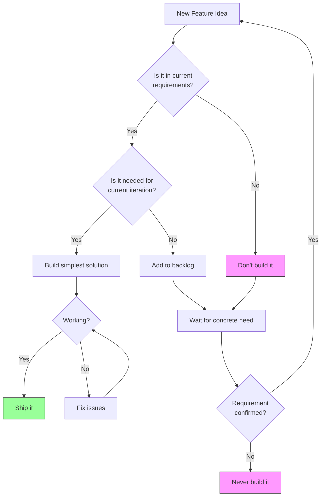
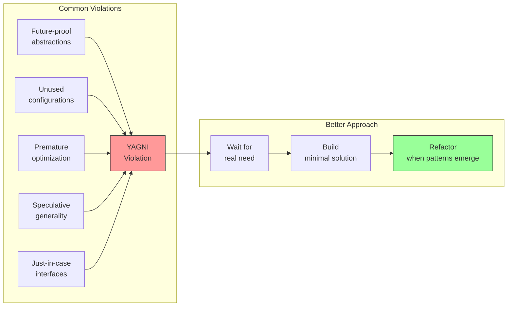

import { Accordion, Accordions } from "fumadocs-ui/components/accordion";
import { Callout } from "fumadocs-ui/components/callout";
import { Step, Steps } from "fumadocs-ui/components/steps";
import { Tab, Tabs } from "fumadocs-ui/components/tabs";

# YAGNI - You Aren't Gonna Need It

YAGNI is a principle of Extreme Programming (XP) that states you should **not add functionality until it is necessary**. It's about avoiding premature generalization and speculative development.

<Callout type="info">
"Always implement things when you actually need them, never when you just foresee that you need them." - Ron Jeffries
</Callout>

## The Problem

Developers often anticipate future requirements and build features "just in case." This leads to:
- **Wasted effort** on features that may never be used
- **Increased complexity** that's harder to maintain
- **Delayed delivery** of actual needed features
- **More bugs** in code that shouldn't exist yet

### ❌ BAD: Speculative Development

<Tabs items={["TypeScript"]}>
<Tab value="TypeScript">
```typescript
// Over-engineered user service anticipating future needs

interface User {
  id: string;
  email: string;
  name: string;
}

// "We might need different storage backends someday"
interface StorageAdapter {
  save(key: string, data: unknown): Promise<void>;
  load(key: string): Promise<unknown>;
  delete(key: string): Promise<void>;
}

// "We might need Redis later"
class RedisAdapter implements StorageAdapter {
  async save(key: string, data: unknown): Promise<void> {
    // Not implemented - might need it later
    throw new Error("Not implemented");
  }
  async load(key: string): Promise<unknown> {
    throw new Error("Not implemented");
  }
  async delete(key: string): Promise<void> {
    throw new Error("Not implemented");
  }
}

// "We might need file storage"
class FileAdapter implements StorageAdapter {
  async save(key: string, data: unknown): Promise<void> {
    throw new Error("Not implemented");
  }
  async load(key: string): Promise<unknown> {
    throw new Error("Not implemented");
  }
  async delete(key: string): Promise<void> {
    throw new Error("Not implemented");
  }
}

// "We might need different export formats"
interface ExportFormat {
  export(users: User[]): string;
}

class JSONExporter implements ExportFormat {
  export(users: User[]): string {
    return JSON.stringify(users);
  }
}

class XMLExporter implements ExportFormat {
  export(users: User[]): string {
    // Complex XML generation - might need it
    return `<users>${users.map((u) => `<user><id>${u.id}</id></user>`).join("")}</users>`;
  }
}

class CSVExporter implements ExportFormat {
  export(users: User[]): string {
    // Might need CSV export
    return users.map((u) => `${u.id},${u.email},${u.name}`).join("\n");
  }
}

// "We might need plugins"
interface Plugin {
  name: string;
  initialize(): void;
  onUserCreate(user: User): void;
  onUserDelete(user: User): void;
}

// "We might need to support multi-tenancy"
interface TenantConfig {
  tenantId: string;
  features: string[];
  limits: {
    maxUsers: number;
    maxStorage: number;
  };
}

// The actual service with tons of unused abstractions
class UserService {
  private storage: StorageAdapter;
  private exporters: Map<string, ExportFormat>;
  private plugins: Plugin[];
  private tenantConfig?: TenantConfig;

  constructor(
    storage: StorageAdapter,
    exporters: ExportFormat[],
    plugins: Plugin[],
    tenantConfig?: TenantConfig
  ) {
    this.storage = storage;
    this.exporters = new Map();
    this.plugins = plugins;
    this.tenantConfig = tenantConfig;
  }

  // Simple operation buried in complexity
  async createUser(email: string, name: string): Promise<User> {
    // Check tenant limits (never used)
    if (this.tenantConfig) {
      // Complex tenant logic
    }

    const user: User = {
      id: crypto.randomUUID(),
      email,
      name,
    };

    // Notify plugins (no plugins exist)
    for (const plugin of this.plugins) {
      plugin.onUserCreate(user);
    }

    await this.storage.save(`user:${user.id}`, user);
    return user;
  }
}
```
</Tab>
</Tabs>

**Problems with this approach:**
- Multiple unused adapters and abstractions
- Dead code that needs maintenance
- Increased cognitive load
- Features that may never be needed
- Delayed delivery of actual requirements

## The Solution

Build only what you need **right now**. Add abstractions when you have **concrete requirements**, not imagined ones.

### ✅ GOOD: Build What You Need

<Tabs items={["TypeScript"]}>
<Tab value="TypeScript">
```typescript
// Simple, focused service that does exactly what's needed

interface User {
  id: string;
  email: string;
  name: string;
  createdAt: Date;
}

// Simple in-memory storage (our current requirement)
const createUserRepository = () => {
  const users = new Map<string, User>();

  return {
    save: async (user: User): Promise<void> => {
      users.set(user.id, user);
    },

    findById: async (id: string): Promise<User | undefined> => {
      return users.get(id);
    },

    findAll: async (): Promise<User[]> => {
      return Array.from(users.values());
    },

    delete: async (id: string): Promise<boolean> => {
      return users.delete(id);
    },
  };
};

// Simple user service with clear purpose
const createUserService = (
  repository: ReturnType<typeof createUserRepository>
) => {
  return {
    createUser: async (email: string, name: string): Promise<User> => {
      const user: User = {
        id: crypto.randomUUID(),
        email,
        name,
        createdAt: new Date(),
      };

      await repository.save(user);
      return user;
    },

    getUser: async (id: string): Promise<User | undefined> => {
      return repository.findById(id);
    },

    listUsers: async (): Promise<User[]> => {
      return repository.findAll();
    },
  };
};

// Usage - simple and clear
const repository = createUserRepository();
const userService = createUserService(repository);

// When we ACTUALLY need database persistence later,
// we can refactor the repository implementation
```
</Tab>
</Tabs>

**Benefits:**
- Code does exactly what's needed
- Easy to understand and maintain
- Quick to develop and test
- Refactor when requirements are clear

## YAGNI Decision Flow



## Real-World Example: API Versioning

### ❌ BAD: Premature API Versioning

<Tabs items={["TypeScript"]}>
<Tab value="TypeScript">
```typescript
// Over-engineered from day one

interface APIVersion {
  version: string;
  deprecated: boolean;
  sunsetDate?: Date;
}

interface VersionedEndpoint {
  path: string;
  versions: Map<string, (req: Request) => Response>;
}

// Complex version negotiation before we have any versions
const createVersionedAPI = () => {
  const endpoints = new Map<string, VersionedEndpoint>();
  const supportedVersions = ["v1", "v2", "v3"]; // v2 and v3 don't exist!

  return {
    registerEndpoint: (
      path: string,
      version: string,
      handler: (req: Request) => Response
    ) => {
      // Complex version registration logic
    },

    handleRequest: (req: Request) => {
      // Complex version detection from headers, URL, query params
      // Fallback logic, deprecation warnings, sunset headers
      // ...hundreds of lines for a single API version
    },
  };
};
```
</Tab>
</Tabs>

### ✅ GOOD: Simple API, Version When Needed

<Tabs items={["TypeScript"]}>
<Tab value="TypeScript">
```typescript
// Simple API that works now
const createAPI = () => {
  const routes = new Map<string, (req: Request) => Response>();

  return {
    get: (path: string, handler: (req: Request) => Response) => {
      routes.set(`GET:${path}`, handler);
    },

    post: (path: string, handler: (req: Request) => Response) => {
      routes.set(`POST:${path}`, handler);
    },

    handle: (method: string, path: string, req: Request): Response => {
      const handler = routes.get(`${method}:${path}`);
      if (!handler) {
        return new Response("Not Found", { status: 404 });
      }
      return handler(req);
    },
  };
};

// When we ACTUALLY need versioning (breaking change required):
// 1. Add /v2 prefix to new endpoints
// 2. Keep /v1 endpoints working
// 3. Add simple version extraction if needed
// Decision made with real requirements, not speculation
```
</Tab>
</Tabs>

## When YAGNI Applies vs When to Plan Ahead

<Accordions>
<Accordion title="When to Apply YAGNI Strictly">

**Apply YAGNI when:**
- Building internal tools or prototypes
- Requirements are unclear or changing
- You're "guessing" at future needs
- Adding features "just in case"
- Implementing unused design patterns
- Creating abstractions without consumers

```typescript
// DON'T do this
interface PaymentProcessor {
  processPayment(amount: number): Promise<void>;
  refund(transactionId: string): Promise<void>;
  void(transactionId: string): Promise<void>;
  partialRefund(transactionId: string, amount: number): Promise<void>;
  recurringPayment(planId: string): Promise<void>;
  // ^ We only need processPayment right now!
}

// DO this
const processPayment = async (amount: number): Promise<string> => {
  // Implement what we need
  return `txn_${Date.now()}`;
};
```

</Accordion>

<Accordion title="When to Plan Ahead">

**Consider future needs when:**
- Making irreversible decisions (database schema for production)
- Building public APIs with external consumers
- Choosing architectural foundations
- Security and compliance requirements
- Performance requirements are known

```typescript
// Database schema - worth thinking ahead
interface UserTable {
  id: string; // UUID from start (hard to change later)
  email: string;
  // Leave room for extension, but don't build features
  metadata?: Record<string, unknown>;
  createdAt: Date;
  updatedAt: Date;
}

// Public API response - include version from start
interface APIResponse<T> {
  data: T;
  meta: {
    version: "1.0"; // Easy to add, hard to retrofit
    timestamp: string;
  };
}
```

</Accordion>

<Accordion title="The Cost of Wrong Decisions">

**Cost of NOT building (YAGNI):**
- Refactoring later when needed
- Some duplicate code temporarily
- Time to add feature when required

**Cost of building speculatively:**
- Maintenance of unused code
- Bugs in features no one uses
- Delayed delivery of needed features
- Wrong abstractions that hinder real requirements
- Developer time wasted permanently

**The math:** Refactoring is usually cheaper than maintaining unused code.

</Accordion>
</Accordions>

## Common YAGNI Violations



## YAGNI Checklist

<Steps>
### Ask "Do I need this now?"

If the feature isn't in current requirements, stop. Add it to backlog.

### Build the simplest thing

Solve the immediate problem with the least code possible.

### Wait for patterns

Let requirements reveal actual patterns before abstracting.

### Refactor with confidence

When real needs emerge, refactor with tests as safety net.

### Delete dead code

If code isn't used, remove it. Version control remembers.

</Steps>

## Related Principles

<Callout>
YAGNI works hand-in-hand with other principles:

- **[KISS](/docs/architecture/clean/principles/kiss)** - Keep solutions simple
- **[DRY](/docs/architecture/clean/principles/dry)** - But only refactor existing duplication
- **[SRP](/docs/architecture/clean/principles/srp)** - Each piece does one thing well
</Callout>

## Summary

| Aspect | Speculative Development | YAGNI Approach |
|--------|------------------------|----------------|
| Timeline | Build for imagined future | Build for known present |
| Abstractions | Create upfront | Extract when needed |
| Features | "Just in case" | "Just in time" |
| Code size | Larger, complex | Smaller, focused |
| Maintenance | High (unused code) | Low (only needed code) |
| Delivery | Delayed | Faster |

<Callout type="warn">
Remember: Code you don't write has no bugs, needs no maintenance, and costs nothing. Every line of speculative code is a liability, not an asset.
</Callout>
