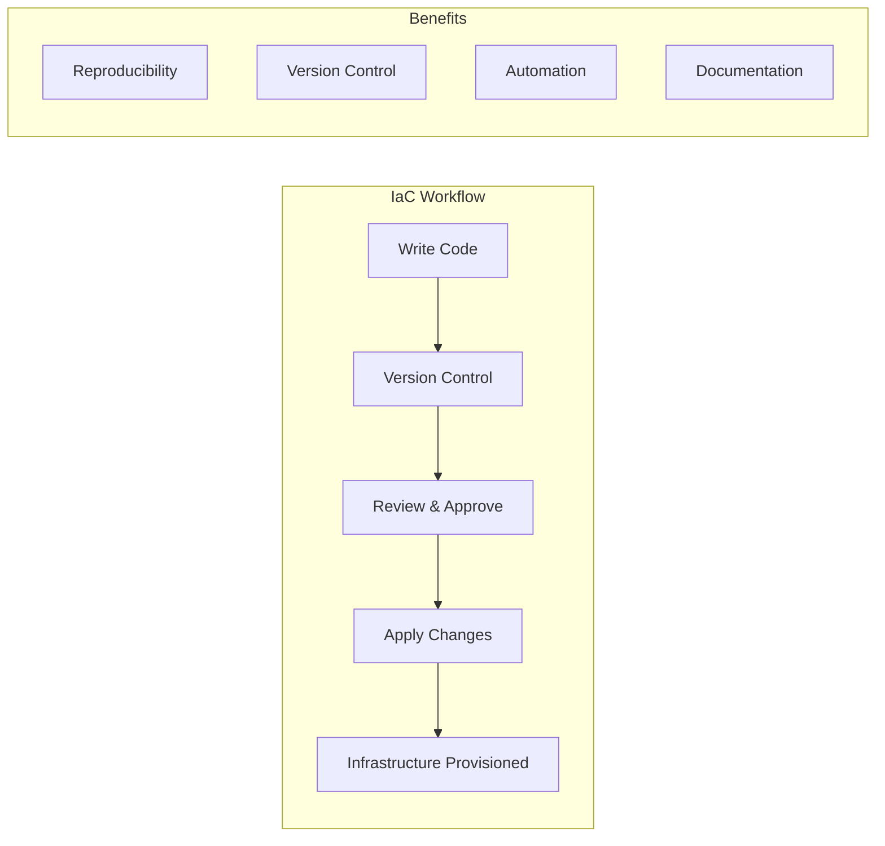
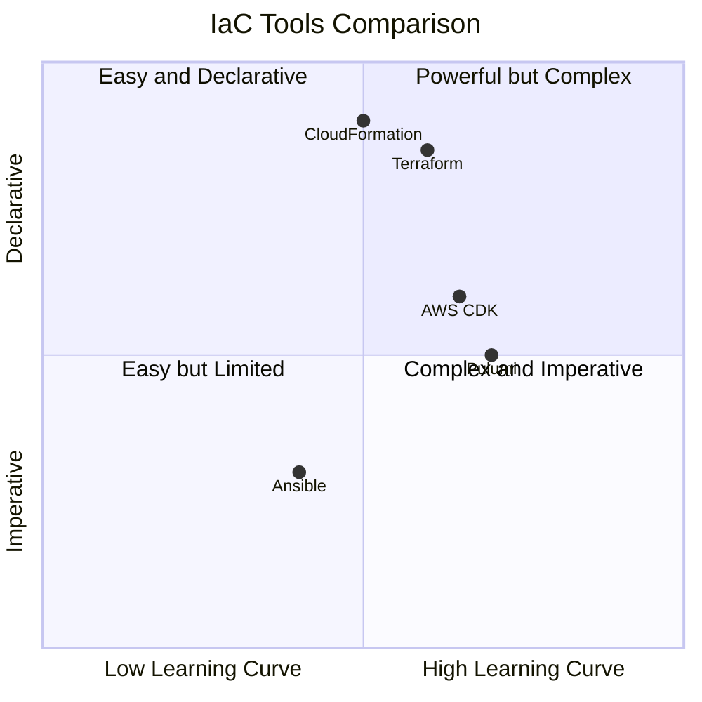
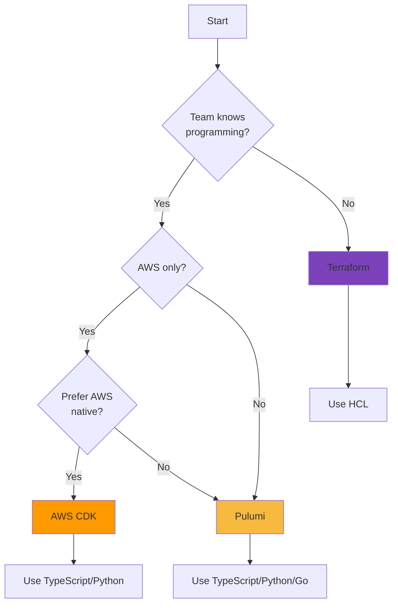

import { Accordion, Accordions } from "fumadocs-ui/components/accordion";
import { Callout } from "fumadocs-ui/components/callout";
import { File, Files, Folder } from "fumadocs-ui/components/files";
import { Tab, Tabs } from "fumadocs-ui/components/tabs";

# Infrastructure as Code (IaC)

Infrastructure as Code (IaC) is the practice of managing and provisioning infrastructure through machine-readable configuration files rather than manual processes.



## Why Infrastructure as Code?

| Traditional Approach | IaC Approach |
|---------------------|--------------|
| Manual configuration | Automated provisioning |
| Error-prone | Consistent and repeatable |
| Hard to track changes | Version controlled |
| Difficult to replicate | Easy to duplicate environments |
| Undocumented | Self-documenting |

## IaC Tools Comparison



## Terraform

HashiCorp Terraform is the most popular IaC tool, using HCL (HashiCorp Configuration Language).

### Basic Structure

```hcl title="main.tf"
# Configure the AWS Provider
terraform {
  required_providers {
    aws = {
      source  = "hashicorp/aws"
      version = "~> 5.0"
    }
  }
}

provider "aws" {
  region = var.aws_region
}

# Create a VPC
resource "aws_vpc" "main" {
  cidr_block           = "10.0.0.0/16"
  enable_dns_hostnames = true
  enable_dns_support   = true

  tags = {
    Name        = "${var.project_name}-vpc"
    Environment = var.environment
  }
}

# Create public subnets
resource "aws_subnet" "public" {
  count                   = length(var.availability_zones)
  vpc_id                  = aws_vpc.main.id
  cidr_block              = cidrsubnet(aws_vpc.main.cidr_block, 8, count.index)
  availability_zone       = var.availability_zones[count.index]
  map_public_ip_on_launch = true

  tags = {
    Name = "${var.project_name}-public-${count.index + 1}"
    Type = "public"
  }
}
```

```hcl title="variables.tf"
variable "aws_region" {
  description = "AWS region for resources"
  type        = string
  default     = "us-east-1"
}

variable "project_name" {
  description = "Name of the project"
  type        = string
}

variable "environment" {
  description = "Environment (dev, staging, prod)"
  type        = string
  validation {
    condition     = contains(["dev", "staging", "prod"], var.environment)
    error_message = "Environment must be dev, staging, or prod."
  }
}

variable "availability_zones" {
  description = "List of availability zones"
  type        = list(string)
  default     = ["us-east-1a", "us-east-1b", "us-east-1c"]
}
```

### Terraform Modules

<Tabs items={["Module Structure", "Main Module", "Usage"]}>
  <Tab value="Module Structure">
<Files>
  <Folder name="modules" defaultOpen>
    <Folder name="vpc" defaultOpen>
      <File name="main.tf" />
      <File name="variables.tf" />
      <File name="outputs.tf" />
      <File name="README.md" />
    </Folder>
    <Folder name="ecs">
      <File name="main.tf" />
      <File name="variables.tf" />
      <File name="outputs.tf" />
    </Folder>
    <Folder name="rds">
      <File name="main.tf" />
      <File name="variables.tf" />
      <File name="outputs.tf" />
    </Folder>
  </Folder>
</Files>
  </Tab>
  <Tab value="Main Module">
```hcl title="modules/vpc/main.tf"
resource "aws_vpc" "this" {
  cidr_block           = var.cidr_block
  enable_dns_hostnames = var.enable_dns_hostnames
  enable_dns_support   = var.enable_dns_support

  tags = merge(var.tags, {
    Name = var.name
  })
}

resource "aws_internet_gateway" "this" {
  count  = var.create_igw ? 1 : 0
  vpc_id = aws_vpc.this.id

  tags = merge(var.tags, {
    Name = "${var.name}-igw"
  })
}

resource "aws_subnet" "public" {
  for_each = var.public_subnets

  vpc_id                  = aws_vpc.this.id
  cidr_block              = each.value.cidr
  availability_zone       = each.value.az
  map_public_ip_on_launch = true

  tags = merge(var.tags, {
    Name = "${var.name}-public-${each.key}"
    Type = "public"
  })
}

resource "aws_subnet" "private" {
  for_each = var.private_subnets

  vpc_id            = aws_vpc.this.id
  cidr_block        = each.value.cidr
  availability_zone = each.value.az

  tags = merge(var.tags, {
    Name = "${var.name}-private-${each.key}"
    Type = "private"
  })
}
```
  </Tab>
  <Tab value="Usage">
```hcl title="environments/prod/main.tf"
module "vpc" {
  source = "../../modules/vpc"

  name                 = "production-vpc"
  cidr_block           = "10.0.0.0/16"
  enable_dns_hostnames = true
  enable_dns_support   = true
  create_igw           = true

  public_subnets = {
    "a" = { cidr = "10.0.1.0/24", az = "us-east-1a" }
    "b" = { cidr = "10.0.2.0/24", az = "us-east-1b" }
    "c" = { cidr = "10.0.3.0/24", az = "us-east-1c" }
  }

  private_subnets = {
    "a" = { cidr = "10.0.10.0/24", az = "us-east-1a" }
    "b" = { cidr = "10.0.11.0/24", az = "us-east-1b" }
    "c" = { cidr = "10.0.12.0/24", az = "us-east-1c" }
  }

  tags = {
    Environment = "production"
    ManagedBy   = "terraform"
  }
}
```
  </Tab>
</Tabs>

## Pulumi

Pulumi allows you to use general-purpose programming languages like TypeScript.

```typescript
// @noErrors
import * as pulumi from "@pulumi/pulumi";
import * as aws from "@pulumi/aws";

// Configuration
const config = new pulumi.Config();
const environment = config.require("environment");
const projectName = config.get("projectName") || "my-app";

// Create a VPC
const vpc = new aws.ec2.Vpc("main-vpc", {
  cidrBlock: "10.0.0.0/16",
  enableDnsHostnames: true,
  enableDnsSupport: true,
  tags: {
    Name: `${projectName}-vpc`,
    Environment: environment,
  },
});

// Create public subnets
const availabilityZones = ["us-east-1a", "us-east-1b", "us-east-1c"];

const publicSubnets = availabilityZones.map((az, index) => {
  return new aws.ec2.Subnet(`public-subnet-${index}`, {
    vpcId: vpc.id,
    cidrBlock: `10.0.${index}.0/24`,
    availabilityZone: az,
    mapPublicIpOnLaunch: true,
    tags: {
      Name: `${projectName}-public-${index + 1}`,
      Type: "public",
    },
  });
});

// Create Internet Gateway
const igw = new aws.ec2.InternetGateway("main-igw", {
  vpcId: vpc.id,
  tags: {
    Name: `${projectName}-igw`,
  },
});

// Export outputs
export const vpcId = vpc.id;
export const publicSubnetIds = publicSubnets.map((s) => s.id);
```

### Pulumi with Component Resources

```typescript
// @noErrors
import * as pulumi from "@pulumi/pulumi";
import * as aws from "@pulumi/aws";

// Define a reusable VPC component
interface VpcArgs {
  cidrBlock: string;
  numberOfAzs: number;
  enableNatGateway?: boolean;
  tags?: Record<string, string>;
}

class Vpc extends pulumi.ComponentResource {
  public readonly vpc: aws.ec2.Vpc;
  public readonly publicSubnets: aws.ec2.Subnet[];
  public readonly privateSubnets: aws.ec2.Subnet[];
  public readonly internetGateway: aws.ec2.InternetGateway;

  constructor(
    name: string,
    args: VpcArgs,
    opts?: pulumi.ComponentResourceOptions
  ) {
    super("custom:networking:Vpc", name, {}, opts);

    const defaultTags = { ManagedBy: "pulumi", ...args.tags };

    // Create VPC
    this.vpc = new aws.ec2.Vpc(
      `${name}-vpc`,
      {
        cidrBlock: args.cidrBlock,
        enableDnsHostnames: true,
        enableDnsSupport: true,
        tags: { ...defaultTags, Name: `${name}-vpc` },
      },
      { parent: this }
    );

    // Create Internet Gateway
    this.internetGateway = new aws.ec2.InternetGateway(
      `${name}-igw`,
      {
        vpcId: this.vpc.id,
        tags: { ...defaultTags, Name: `${name}-igw` },
      },
      { parent: this }
    );

    // Get AZs
    const azs = aws.getAvailabilityZones({
      state: "available",
    });

    // Create subnets
    this.publicSubnets = [];
    this.privateSubnets = [];

    for (let i = 0; i < args.numberOfAzs; i++) {
      const publicSubnet = new aws.ec2.Subnet(
        `${name}-public-${i}`,
        {
          vpcId: this.vpc.id,
          cidrBlock: `10.0.${i}.0/24`,
          availabilityZone: azs.then((az) => az.names[i]),
          mapPublicIpOnLaunch: true,
          tags: { ...defaultTags, Name: `${name}-public-${i}`, Type: "public" },
        },
        { parent: this }
      );
      this.publicSubnets.push(publicSubnet);

      const privateSubnet = new aws.ec2.Subnet(
        `${name}-private-${i}`,
        {
          vpcId: this.vpc.id,
          cidrBlock: `10.0.${i + 100}.0/24`,
          availabilityZone: azs.then((az) => az.names[i]),
          tags: {
            ...defaultTags,
            Name: `${name}-private-${i}`,
            Type: "private",
          },
        },
        { parent: this }
      );
      this.privateSubnets.push(privateSubnet);
    }

    this.registerOutputs({
      vpcId: this.vpc.id,
      publicSubnetIds: this.publicSubnets.map((s) => s.id),
      privateSubnetIds: this.privateSubnets.map((s) => s.id),
    });
  }
}

// Usage
const network = new Vpc("production", {
  cidrBlock: "10.0.0.0/16",
  numberOfAzs: 3,
  enableNatGateway: true,
  tags: {
    Environment: "production",
    Project: "my-app",
  },
});

export const vpcId = network.vpc.id;
```

## AWS CDK

AWS Cloud Development Kit (CDK) uses TypeScript to define AWS infrastructure.

```typescript
// @noErrors
import * as cdk from "aws-cdk-lib";
import * as ec2 from "aws-cdk-lib/aws-ec2";
import * as ecs from "aws-cdk-lib/aws-ecs";
import * as ecs_patterns from "aws-cdk-lib/aws-ecs-patterns";
import { Construct } from "constructs";

interface AppStackProps extends cdk.StackProps {
  environment: "dev" | "staging" | "prod";
  maxAzs?: number;
}

class AppStack extends cdk.Stack {
  public readonly vpc: ec2.Vpc;
  public readonly cluster: ecs.Cluster;

  constructor(scope: Construct, id: string, props: AppStackProps) {
    super(scope, id, props);

    // Create VPC with public and private subnets
    this.vpc = new ec2.Vpc(this, "AppVpc", {
      maxAzs: props.maxAzs ?? 3,
      natGateways: props.environment === "prod" ? 3 : 1,
      subnetConfiguration: [
        {
          name: "Public",
          subnetType: ec2.SubnetType.PUBLIC,
          cidrMask: 24,
        },
        {
          name: "Private",
          subnetType: ec2.SubnetType.PRIVATE_WITH_EGRESS,
          cidrMask: 24,
        },
        {
          name: "Isolated",
          subnetType: ec2.SubnetType.PRIVATE_ISOLATED,
          cidrMask: 24,
        },
      ],
    });

    // Create ECS Cluster
    this.cluster = new ecs.Cluster(this, "AppCluster", {
      vpc: this.vpc,
      containerInsights: true,
      enableFargateCapacityProviders: true,
    });

    // Create Fargate Service with ALB
    const service = new ecs_patterns.ApplicationLoadBalancedFargateService(
      this,
      "AppService",
      {
        cluster: this.cluster,
        cpu: 256,
        memoryLimitMiB: 512,
        desiredCount: props.environment === "prod" ? 3 : 1,
        taskImageOptions: {
          image: ecs.ContainerImage.fromRegistry("nginx:latest"),
          containerPort: 80,
        },
        publicLoadBalancer: true,
      }
    );

    // Configure Auto Scaling
    const scaling = service.service.autoScaleTaskCount({
      minCapacity: 1,
      maxCapacity: props.environment === "prod" ? 10 : 3,
    });

    scaling.scaleOnCpuUtilization("CpuScaling", {
      targetUtilizationPercent: 70,
      scaleInCooldown: cdk.Duration.seconds(60),
      scaleOutCooldown: cdk.Duration.seconds(60),
    });

    // Outputs
    new cdk.CfnOutput(this, "LoadBalancerDNS", {
      value: service.loadBalancer.loadBalancerDnsName,
      description: "Load Balancer DNS Name",
    });
  }
}

// App entry point
const app = new cdk.App();

new AppStack(app, "DevStack", {
  environment: "dev",
  env: {
    account: process.env.CDK_DEFAULT_ACCOUNT,
    region: "us-east-1",
  },
});

new AppStack(app, "ProdStack", {
  environment: "prod",
  maxAzs: 3,
  env: {
    account: process.env.CDK_DEFAULT_ACCOUNT,
    region: "us-east-1",
  },
});
```

## CloudFormation

AWS CloudFormation uses YAML or JSON templates.

```yaml title="template.yaml"
AWSTemplateFormatVersion: "2010-09-09"
Description: "VPC with public and private subnets"

Parameters:
  Environment:
    Type: String
    AllowedValues:
      - dev
      - staging
      - prod
    Default: dev
  ProjectName:
    Type: String
    Default: my-app

Mappings:
  EnvironmentConfig:
    dev:
      InstanceType: t3.micro
      MinCapacity: 1
      MaxCapacity: 2
    staging:
      InstanceType: t3.small
      MinCapacity: 1
      MaxCapacity: 3
    prod:
      InstanceType: t3.medium
      MinCapacity: 2
      MaxCapacity: 10

Resources:
  VPC:
    Type: AWS::EC2::VPC
    Properties:
      CidrBlock: 10.0.0.0/16
      EnableDnsHostnames: true
      EnableDnsSupport: true
      Tags:
        - Key: Name
          Value: !Sub "${ProjectName}-vpc"
        - Key: Environment
          Value: !Ref Environment

  InternetGateway:
    Type: AWS::EC2::InternetGateway
    Properties:
      Tags:
        - Key: Name
          Value: !Sub "${ProjectName}-igw"

  VPCGatewayAttachment:
    Type: AWS::EC2::VPCGatewayAttachment
    Properties:
      VpcId: !Ref VPC
      InternetGatewayId: !Ref InternetGateway

  PublicSubnet1:
    Type: AWS::EC2::Subnet
    Properties:
      VpcId: !Ref VPC
      CidrBlock: 10.0.1.0/24
      AvailabilityZone: !Select [0, !GetAZs ""]
      MapPublicIpOnLaunch: true
      Tags:
        - Key: Name
          Value: !Sub "${ProjectName}-public-1"

  PublicSubnet2:
    Type: AWS::EC2::Subnet
    Properties:
      VpcId: !Ref VPC
      CidrBlock: 10.0.2.0/24
      AvailabilityZone: !Select [1, !GetAZs ""]
      MapPublicIpOnLaunch: true
      Tags:
        - Key: Name
          Value: !Sub "${ProjectName}-public-2"

  PrivateSubnet1:
    Type: AWS::EC2::Subnet
    Properties:
      VpcId: !Ref VPC
      CidrBlock: 10.0.10.0/24
      AvailabilityZone: !Select [0, !GetAZs ""]
      Tags:
        - Key: Name
          Value: !Sub "${ProjectName}-private-1"

  PrivateSubnet2:
    Type: AWS::EC2::Subnet
    Properties:
      VpcId: !Ref VPC
      CidrBlock: 10.0.11.0/24
      AvailabilityZone: !Select [1, !GetAZs ""]
      Tags:
        - Key: Name
          Value: !Sub "${ProjectName}-private-2"

Outputs:
  VpcId:
    Description: VPC ID
    Value: !Ref VPC
    Export:
      Name: !Sub "${AWS::StackName}-VpcId"

  PublicSubnets:
    Description: Public Subnet IDs
    Value: !Join [",", [!Ref PublicSubnet1, !Ref PublicSubnet2]]
    Export:
      Name: !Sub "${AWS::StackName}-PublicSubnets"

  PrivateSubnets:
    Description: Private Subnet IDs
    Value: !Join [",", [!Ref PrivateSubnet1, !Ref PrivateSubnet2]]
    Export:
      Name: !Sub "${AWS::StackName}-PrivateSubnets"
```

## Best Practices

<Accordions>
  <Accordion title="State Management">
    ### Remote State Storage
    
    Always use remote state storage for team collaboration:
    
    ```hcl title="backend.tf"
    terraform {
      backend "s3" {
        bucket         = "my-terraform-state"
        key            = "prod/terraform.tfstate"
        region         = "us-east-1"
        encrypt        = true
        dynamodb_table = "terraform-locks"
      }
    }
    ```
    
    For Pulumi:
    
    ```bash
    pulumi login s3://my-pulumi-state
    ```
  </Accordion>
  
  <Accordion title="Environment Separation">
    ### Directory Structure
    
    <Files>
      <Folder name="infrastructure" defaultOpen>
        <Folder name="modules">
          <Folder name="vpc" />
          <Folder name="ecs" />
          <Folder name="rds" />
        </Folder>
        <Folder name="environments" defaultOpen>
          <Folder name="dev" defaultOpen>
            <File name="main.tf" />
            <File name="variables.tf" />
            <File name="terraform.tfvars" />
          </Folder>
          <Folder name="staging" />
          <Folder name="prod" />
        </Folder>
        <File name="README.md" />
      </Folder>
    </Files>
  </Accordion>
  
  <Accordion title="Secrets Management">
    ### Never Commit Secrets
    
    Use secret management services:
    
    ```typescript
    // @noErrors
    import * as aws from "@pulumi/aws";
    import * as pulumi from "@pulumi/pulumi";

    // Retrieve secret from AWS Secrets Manager
    const dbSecret = aws.secretsmanager.getSecretVersion({
      secretId: "prod/database/credentials",
    });

    // Use in RDS
    const database = new aws.rds.Instance("db", {
      engine: "postgres",
      instanceClass: "db.t3.micro",
      username: "admin",
      password: pulumi.secret(dbSecret.then((s) => JSON.parse(s.secretString).password)),
    });
    ```
  </Accordion>
  
  <Accordion title="Tagging Strategy">
    ### Consistent Tagging
    
    ```typescript
    // @noErrors
    const defaultTags = {
      Project: "my-app",
      Environment: "production",
      ManagedBy: "pulumi",
      Owner: "platform-team",
      CostCenter: "engineering",
    };

    // Apply to all resources
    import * as pulumi from "@pulumi/pulumi";

    const provider = new pulumi.ProviderResource("aws", "default", {
      defaultTags: {
        tags: defaultTags,
      },
    });
    ```
  </Accordion>
</Accordions>

## Choosing the Right Tool



<Callout type="info">
  **Recommendation**: For TypeScript teams, Pulumi provides the best developer experience with full type safety and IDE support. For multi-cloud or teams preferring declarative syntax, Terraform remains the industry standard.
</Callout>
