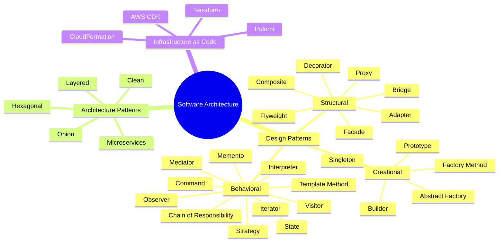

# Software Architecture

Welcome to the comprehensive software architecture documentation. This section covers everything from low-level design patterns to high-level architectural decisions and infrastructure as code practices.

## What You'll Learn

<Cards>
  <Card
    title="Infrastructure as Code (IaC)"
    description="Terraform, Pulumi, AWS CDK, and CloudFormation for managing infrastructure"
    href="/docs/architecture/iac"
  />
  <Card
    title="Design Patterns"
    description="All 24 Gang of Four design patterns with TypeScript examples"
    href="/docs/architecture/patterns"
  />
  <Card
    title="Clean Architecture"
    description="Hexagonal, Onion, Layered, and Microservices architectures"
    href="/docs/architecture/clean"
  />
</Cards>

## Quick Overview

## Why This Matters

Understanding software architecture is crucial for:

- **Maintainability**: Well-structured code is easier to maintain and extend
- **Scalability**: Proper architecture allows systems to grow
- **Testability**: Good design patterns make testing easier
- **Team Collaboration**: Common patterns provide a shared vocabulary
- **Performance**: Architecture decisions impact system performance

## How to Use This Documentation

1. **Start with Design Patterns** if you're looking to improve code quality at the class/function level
2. **Explore Clean Architecture** for system-level design decisions
3. **Learn IaC** for managing cloud infrastructure programmatically

Each pattern and architecture includes:
- Problem statement
- Solution with TypeScript examples
- When to use (and when not to)
- Mermaid diagrams for visualization
- Real-world applications
