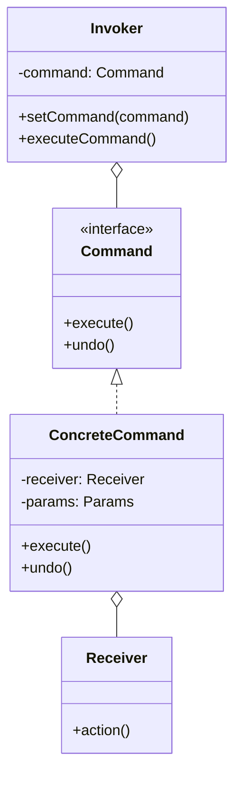
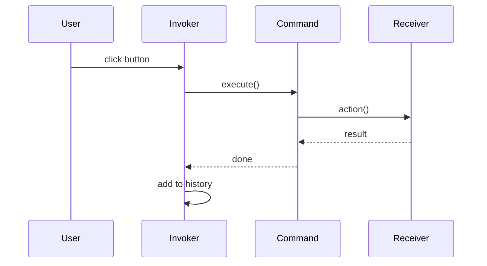
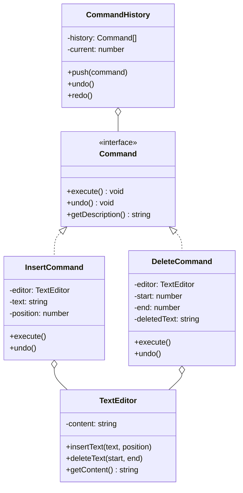

# Command Pattern

## Intent

**Command** is a behavioral design pattern that turns a request into a stand-alone object containing all information about the request. This transformation lets you pass requests as method arguments, delay or queue a request's execution, and support undoable operations.



---

## Problem It Solves

Imagine you're building a text editor. You need to:
- Execute operations (copy, paste, bold)
- Undo/redo operations
- Queue operations for batch processing
- Log all operations for debugging

Without Command pattern:
- Operations are tightly coupled to UI
- No easy way to undo
- Can't queue or serialize operations

---

## Solution

Encapsulate each operation as a command object:



---

## Structure



---

## Implementation

<Tabs items={["Text Editor", "Transaction System", "Task Queue", "Real-World: Drawing App"]}>
  <Tab value="Text Editor">
```typescript
/**
 * Command interface
 * @description All commands must implement execute and undo
 */
interface Command {
  /** Execute the command */
  execute: () => void;
  /** Reverse the command */
  undo: () => void;
  /** Get description for logging/display */
  getDescription: () => string;
}

/**
 * Text Editor - the Receiver
 * @description The actual object that performs text operations
 */
interface TextEditor {
  /** Current text content */
  content: string;
  /** Cursor position */
  cursorPosition: number;
  /** Insert text at position */
  insertAt: (text: string, position: number) => void;
  /** Delete text in range */
  deleteRange: (start: number, end: number) => string;
  /** Get current content */
  getContent: () => string;
}

const createTextEditor = (initialContent = ""): TextEditor => {
  let content = initialContent;
  let cursorPosition = 0;

  return {
    get content() { return content; },
    get cursorPosition() { return cursorPosition; },
    
    insertAt(text, position) {
      content = content.slice(0, position) + text + content.slice(position);
      cursorPosition = position + text.length;
    },
    
    deleteRange(start, end) {
      const deleted = content.slice(start, end);
      content = content.slice(0, start) + content.slice(end);
      cursorPosition = start;
      return deleted;
    },
    
    getContent() { return content; },
  };
};

/**
 * Insert Text Command
 */
const createInsertCommand = (
  editor: TextEditor,
  text: string,
  position: number
): Command => ({
  execute() {
    editor.insertAt(text, position);
  },
  undo() {
    editor.deleteRange(position, position + text.length);
  },
  getDescription() {
    return `Insert "${text}" at position ${position}`;
  },
});

/**
 * Delete Text Command
 */
const createDeleteCommand = (
  editor: TextEditor,
  start: number,
  end: number
): Command => {
  let deletedText = "";

  return {
    execute() {
      deletedText = editor.deleteRange(start, end);
    },
    undo() {
      editor.insertAt(deletedText, start);
    },
    getDescription() {
      return `Delete from ${start} to ${end}`;
    },
  };
};

/**
 * Command History Manager
 * @description Manages undo/redo stack
 */
interface CommandHistory {
  /** Execute and record a command */
  execute: (command: Command) => void;
  /** Undo last command */
  undo: () => boolean;
  /** Redo last undone command */
  redo: () => boolean;
  /** Check if can undo */
  canUndo: () => boolean;
  /** Check if can redo */
  canRedo: () => boolean;
  /** Get history for display */
  getHistory: () => string[];
}

const createCommandHistory = (): CommandHistory => {
  const history: Command[] = [];
  let currentIndex = -1;

  return {
    execute(command) {
      // Remove any redo history
      history.splice(currentIndex + 1);
      
      command.execute();
      history.push(command);
      currentIndex++;
      
      console.log(`Executed: ${command.getDescription()}`);
    },

    undo() {
      if (currentIndex < 0) return false;
      
      const command = history[currentIndex];
      command.undo();
      currentIndex--;
      
      console.log(`Undone: ${command.getDescription()}`);
      return true;
    },

    redo() {
      if (currentIndex >= history.length - 1) return false;
      
      currentIndex++;
      const command = history[currentIndex];
      command.execute();
      
      console.log(`Redone: ${command.getDescription()}`);
      return true;
    },

    canUndo: () => currentIndex >= 0,
    canRedo: () => currentIndex < history.length - 1,
    
    getHistory() {
      return history.map((cmd, i) => 
        `${i === currentIndex ? "→ " : "  "}${cmd.getDescription()}`
      );
    },
  };
};

// Usage
const editor = createTextEditor();
const history = createCommandHistory();

// Type some text
history.execute(createInsertCommand(editor, "Hello", 0));
history.execute(createInsertCommand(editor, " World", 5));
history.execute(createInsertCommand(editor, "!", 11));

console.log("Content:", editor.getContent());
//                      ^?
// "Hello World!"

// Undo last action
history.undo();
console.log("After undo:", editor.getContent()); // "Hello World"

// Undo again
history.undo();
console.log("After undo:", editor.getContent()); // "Hello"

// Redo
history.redo();
console.log("After redo:", editor.getContent()); // "Hello World"

console.log("\nHistory:");
console.log(history.getHistory().join("\n"));
```
  </Tab>
  <Tab value="Transaction System">
```typescript
/**
 * Transaction command interface
 */
interface TransactionCommand {
  execute: () => Promise<void>;
  rollback: () => Promise<void>;
  getDescription: () => string;
  isExecuted: () => boolean;
}

/**
 * Bank Account
 */
interface BankAccount {
  id: string;
  balance: number;
  name: string;
}

/**
 * Account Repository
 */
interface AccountRepository {
  get: (id: string) => BankAccount | undefined;
  update: (account: BankAccount) => void;
}

const createAccountRepository = (): AccountRepository => {
  const accounts = new Map<string, BankAccount>();
  
  // Seed accounts
  accounts.set("A001", { id: "A001", balance: 1000, name: "Alice" });
  accounts.set("A002", { id: "A002", balance: 500, name: "Bob" });
  accounts.set("A003", { id: "A003", balance: 2000, name: "Charlie" });

  return {
    get: (id) => accounts.get(id),
    update: (account) => accounts.set(account.id, { ...account }),
  };
};

/**
 * Deposit Command
 */
const createDepositCommand = (
  repo: AccountRepository,
  accountId: string,
  amount: number
): TransactionCommand => {
  let executed = false;

  return {
    async execute() {
      const account = repo.get(accountId);
      if (!account) throw new Error(`Account ${accountId} not found`);
      
      account.balance += amount;
      repo.update(account);
      executed = true;
      
      console.log(`Deposited $${amount} to ${account.name}`);
    },
    
    async rollback() {
      if (!executed) return;
      
      const account = repo.get(accountId);
      if (!account) throw new Error(`Account ${accountId} not found`);
      
      account.balance -= amount;
      repo.update(account);
      executed = false;
      
      console.log(`Rolled back deposit of $${amount} from ${account.name}`);
    },
    
    getDescription: () => `Deposit $${amount} to account ${accountId}`,
    isExecuted: () => executed,
  };
};

/**
 * Withdraw Command
 */
const createWithdrawCommand = (
  repo: AccountRepository,
  accountId: string,
  amount: number
): TransactionCommand => {
  let executed = false;

  return {
    async execute() {
      const account = repo.get(accountId);
      if (!account) throw new Error(`Account ${accountId} not found`);
      if (account.balance < amount) throw new Error("Insufficient funds");
      
      account.balance -= amount;
      repo.update(account);
      executed = true;
      
      console.log(`Withdrew $${amount} from ${account.name}`);
    },
    
    async rollback() {
      if (!executed) return;
      
      const account = repo.get(accountId);
      if (!account) throw new Error(`Account ${accountId} not found`);
      
      account.balance += amount;
      repo.update(account);
      executed = false;
      
      console.log(`Rolled back withdrawal of $${amount} to ${account.name}`);
    },
    
    getDescription: () => `Withdraw $${amount} from account ${accountId}`,
    isExecuted: () => executed,
  };
};

/**
 * Transfer Command (Composite)
 */
const createTransferCommand = (
  repo: AccountRepository,
  fromId: string,
  toId: string,
  amount: number
): TransactionCommand => {
  const withdraw = createWithdrawCommand(repo, fromId, amount);
  const deposit = createDepositCommand(repo, toId, amount);

  return {
    async execute() {
      await withdraw.execute();
      try {
        await deposit.execute();
      } catch (error) {
        // Rollback withdraw if deposit fails
        await withdraw.rollback();
        throw error;
      }
    },
    
    async rollback() {
      await deposit.rollback();
      await withdraw.rollback();
    },
    
    getDescription: () => `Transfer $${amount} from ${fromId} to ${toId}`,
    isExecuted: () => withdraw.isExecuted() && deposit.isExecuted(),
  };
};

/**
 * Transaction Manager
 * @description Executes batch of commands with rollback support
 */
interface TransactionManager {
  addCommand: (command: TransactionCommand) => void;
  execute: () => Promise<boolean>;
  getStatus: () => string;
}

const createTransactionManager = (): TransactionManager => {
  const commands: TransactionCommand[] = [];
  let status = "pending";

  return {
    addCommand(command) {
      commands.push(command);
    },

    async execute() {
      console.log("\n=== Starting Transaction ===");
      const executed: TransactionCommand[] = [];

      try {
        for (const command of commands) {
          console.log(`Executing: ${command.getDescription()}`);
          await command.execute();
          executed.push(command);
        }
        
        status = "committed";
        console.log("=== Transaction Committed ===\n");
        return true;
      } catch (error) {
        console.error(`Error: ${(error as Error).message}`);
        console.log("Rolling back...");
        
        // Rollback in reverse order
        for (const command of executed.reverse()) {
          await command.rollback();
        }
        
        status = "rolled back";
        console.log("=== Transaction Rolled Back ===\n");
        return false;
      }
    },

    getStatus: () => status,
  };
};

// Usage
const repo = createAccountRepository();
const tx = createTransactionManager();

// Add commands to transaction
tx.addCommand(createDepositCommand(repo, "A001", 500));
tx.addCommand(createTransferCommand(repo, "A001", "A002", 200));
tx.addCommand(createWithdrawCommand(repo, "A003", 100));

// Execute all commands as a single transaction
await tx.execute();

console.log("Final balances:");
console.log("Alice:", repo.get("A001")?.balance);
console.log("Bob:", repo.get("A002")?.balance);
console.log("Charlie:", repo.get("A003")?.balance);
```
  </Tab>
  <Tab value="Task Queue">
```typescript
/**
 * Task status
 */
type TaskStatus = "pending" | "running" | "completed" | "failed" | "cancelled";

/**
 * Task command interface
 */
interface TaskCommand {
  id: string;
  name: string;
  priority: number;
  execute: () => Promise<unknown>;
  cancel: () => void;
  getStatus: () => TaskStatus;
  getResult: () => unknown;
  getError: () => Error | null;
}

/**
 * Create a task command
 */
const createTask = (
  name: string,
  fn: () => Promise<unknown>,
  priority = 0
): TaskCommand => {
  const id = `task-${Date.now()}-${Math.random().toString(36).slice(2)}`;
  let status: TaskStatus = "pending";
  let result: unknown = null;
  let error: Error | null = null;
  let cancelled = false;

  return {
    id,
    name,
    priority,
    
    async execute() {
      if (cancelled) {
        status = "cancelled";
        return null;
      }
      
      status = "running";
      try {
        result = await fn();
        status = "completed";
        return result;
      } catch (e) {
        error = e as Error;
        status = "failed";
        throw e;
      }
    },
    
    cancel() {
      if (status === "pending") {
        cancelled = true;
        status = "cancelled";
      }
    },
    
    getStatus: () => status,
    getResult: () => result,
    getError: () => error,
  };
};

/**
 * Task Queue with priority and concurrency control
 */
interface TaskQueue {
  /** Add task to queue */
  enqueue: (task: TaskCommand) => void;
  /** Start processing queue */
  start: () => void;
  /** Pause processing */
  pause: () => void;
  /** Get queue statistics */
  getStats: () => { pending: number; running: number; completed: number; failed: number };
  /** Wait for all tasks to complete */
  drain: () => Promise<void>;
}

const createTaskQueue = (concurrency = 3): TaskQueue => {
  const pending: TaskCommand[] = [];
  const running = new Set<TaskCommand>();
  const completed: TaskCommand[] = [];
  const failed: TaskCommand[] = [];
  let isRunning = false;
  let drainResolvers: (() => void)[] = [];

  const processNext = async () => {
    if (!isRunning || running.size >= concurrency || pending.length === 0) {
      return;
    }

    // Get highest priority task
    pending.sort((a, b) => b.priority - a.priority);
    const task = pending.shift()!;
    running.add(task);

    console.log(`[Queue] Starting: ${task.name}`);

    try {
      await task.execute();
      completed.push(task);
      console.log(`[Queue] Completed: ${task.name}`);
    } catch (error) {
      failed.push(task);
      console.log(`[Queue] Failed: ${task.name} - ${(error as Error).message}`);
    } finally {
      running.delete(task);
      
      // Check if drained
      if (pending.length === 0 && running.size === 0) {
        drainResolvers.forEach(resolve => resolve());
        drainResolvers = [];
      }
      
      // Process next
      processNext();
    }
  };

  return {
    enqueue(task) {
      pending.push(task);
      console.log(`[Queue] Enqueued: ${task.name} (priority: ${task.priority})`);
      if (isRunning) {
        processNext();
      }
    },

    start() {
      isRunning = true;
      console.log("[Queue] Started");
      
      // Start up to concurrency tasks
      for (let i = 0; i < concurrency; i++) {
        processNext();
      }
    },

    pause() {
      isRunning = false;
      console.log("[Queue] Paused");
    },

    getStats() {
      return {
        pending: pending.length,
        running: running.size,
        completed: completed.length,
        failed: failed.length,
      };
    },

    drain() {
      if (pending.length === 0 && running.size === 0) {
        return Promise.resolve();
      }
      
      return new Promise<void>(resolve => {
        drainResolvers.push(resolve);
      });
    },
  };
};

// Usage
const queue = createTaskQueue(2); // 2 concurrent tasks

// Create tasks
const tasks = [
  createTask("Send emails", async () => {
    await new Promise(r => setTimeout(r, 1000));
    return "100 emails sent";
  }, 1),
  
  createTask("Generate report", async () => {
    await new Promise(r => setTimeout(r, 2000));
    return "Report generated";
  }, 2),
  
  createTask("Backup database", async () => {
    await new Promise(r => setTimeout(r, 1500));
    return "Backup complete";
  }, 3), // High priority
  
  createTask("Clean cache", async () => {
    await new Promise(r => setTimeout(r, 500));
    return "Cache cleared";
  }, 0), // Low priority
];

// Enqueue all tasks
tasks.forEach(task => queue.enqueue(task));

// Start processing
queue.start();

// Wait for completion
await queue.drain();

console.log("\nFinal stats:", queue.getStats());
```
  </Tab>
  <Tab value="Real-World: Drawing App">
```ts
/**
 * Point on canvas
 */
interface Point {
  x: number;
  y: number;
}

/**
 * Shape on canvas
 */
interface Shape {
  id: string;
  type: "line" | "rectangle" | "circle" | "text";
  color: string;
  strokeWidth: number;
  points: Point[];
  text?: string;
}

/**
 * Canvas state
 */
interface Canvas {
  shapes: Shape[];
  selectedId: string | null;
  addShape: (shape: Shape) => void;
  removeShape: (id: string) => Shape | null;
  updateShape: (id: string, updates: Partial<Shape>) => Shape | null;
  getShape: (id: string) => Shape | undefined;
  clear: () => Shape[];
  render: () => void;
}

const createCanvas = (): Canvas => {
  let shapes: Shape[] = [];
  let selectedId: string | null = null;

  return {
    get shapes() { return [...shapes]; },
    get selectedId() { return selectedId; },
    set selectedId(id: string | null) { selectedId = id; },

    addShape(shape) {
      shapes.push(shape);
      console.log(`[Canvas] Added ${shape.type} (${shape.id})`);
    },

    removeShape(id) {
      const index = shapes.findIndex(s => s.id === id);
      if (index === -1) return null;
      const [removed] = shapes.splice(index, 1);
      console.log(`[Canvas] Removed ${removed.type} (${removed.id})`);
      return removed;
    },

    updateShape(id, updates) {
      const shape = shapes.find(s => s.id === id);
      if (!shape) return null;
      Object.assign(shape, updates);
      console.log(`[Canvas] Updated ${shape.type} (${shape.id})`);
      return shape;
    },

    getShape: (id) => shapes.find(s => s.id === id),
    
    clear() {
      const removed = [...shapes];
      shapes = [];
      console.log(`[Canvas] Cleared ${removed.length} shapes`);
      return removed;
    },

    render() {
      console.log(`[Canvas] Rendering ${shapes.length} shapes`);
    },
  };
};

/**
 * Drawing command interface
 */
interface DrawingCommand {
  execute: () => void;
  undo: () => void;
  getDescription: () => string;
}

/**
 * Add Shape Command
 */
const createAddShapeCommand = (canvas: Canvas, shape: Shape): DrawingCommand => ({
  execute() {
    canvas.addShape(shape);
    canvas.render();
  },
  undo() {
    canvas.removeShape(shape.id);
    canvas.render();
  },
  getDescription: () => `Add ${shape.type}`,
});

/**
 * Remove Shape Command
 */
const createRemoveShapeCommand = (canvas: Canvas, shapeId: string): DrawingCommand => {
  let removedShape: Shape | null = null;

  return {
    execute() {
      removedShape = canvas.removeShape(shapeId);
      canvas.render();
    },
    undo() {
      if (removedShape) {
        canvas.addShape(removedShape);
        canvas.render();
      }
    },
    getDescription: () => `Remove shape ${shapeId}`,
  };
};

/**
 * Move Shape Command
 */
const createMoveShapeCommand = (
  canvas: Canvas,
  shapeId: string,
  dx: number,
  dy: number
): DrawingCommand => {
  let originalPoints: Point[] = [];

  return {
    execute() {
      const shape = canvas.getShape(shapeId);
      if (!shape) return;
      
      originalPoints = shape.points.map(p => ({ ...p }));
      const newPoints = shape.points.map(p => ({ x: p.x + dx, y: p.y + dy }));
      canvas.updateShape(shapeId, { points: newPoints });
      canvas.render();
    },
    undo() {
      canvas.updateShape(shapeId, { points: originalPoints });
      canvas.render();
    },
    getDescription: () => `Move shape ${shapeId} by (${dx}, ${dy})`,
  };
};

/**
 * Change Color Command
 */
const createChangeColorCommand = (
  canvas: Canvas,
  shapeId: string,
  newColor: string
): DrawingCommand => {
  let originalColor = "";

  return {
    execute() {
      const shape = canvas.getShape(shapeId);
      if (!shape) return;
      
      originalColor = shape.color;
      canvas.updateShape(shapeId, { color: newColor });
      canvas.render();
    },
    undo() {
      canvas.updateShape(shapeId, { color: originalColor });
      canvas.render();
    },
    getDescription: () => `Change color to ${newColor}`,
  };
};

/**
 * Macro Command (Composite)
 */
const createMacroCommand = (
  name: string,
  commands: DrawingCommand[]
): DrawingCommand => ({
  execute() {
    commands.forEach(cmd => cmd.execute());
  },
  undo() {
    [...commands].reverse().forEach(cmd => cmd.undo());
  },
  getDescription: () => name,
});

/**
 * Command Manager with undo/redo
 */
interface CommandManager {
  execute: (command: DrawingCommand) => void;
  undo: () => void;
  redo: () => void;
  canUndo: () => boolean;
  canRedo: () => boolean;
  getHistory: () => string[];
}

const createCommandManager = (): CommandManager => {
  const undoStack: DrawingCommand[] = [];
  const redoStack: DrawingCommand[] = [];

  return {
    execute(command) {
      command.execute();
      undoStack.push(command);
      redoStack.length = 0; // Clear redo stack
    },

    undo() {
      const command = undoStack.pop();
      if (command) {
        command.undo();
        redoStack.push(command);
      }
    },

    redo() {
      const command = redoStack.pop();
      if (command) {
        command.execute();
        undoStack.push(command);
      }
    },

    canUndo: () => undoStack.length > 0,
    canRedo: () => redoStack.length > 0,
    
    getHistory() {
      return undoStack.map(cmd => cmd.getDescription());
    },
  };
};

// Usage
const canvas = createCanvas();
const commands = createCommandManager();

// Draw some shapes
const circle: Shape = {
  id: "circle-1",
  type: "circle",
  color: "red",
  strokeWidth: 2,
  points: [{ x: 100, y: 100 }],
};

const rectangle: Shape = {
  id: "rect-1",
  type: "rectangle",
  color: "blue",
  strokeWidth: 1,
  points: [{ x: 50, y: 50 }, { x: 150, y: 100 }],
};

// Execute commands
commands.execute(createAddShapeCommand(canvas, circle));
commands.execute(createAddShapeCommand(canvas, rectangle));
commands.execute(createMoveShapeCommand(canvas, "circle-1", 50, 50));
commands.execute(createChangeColorCommand(canvas, "circle-1", "green"));

console.log("\nHistory:", commands.getHistory());

// Undo last 2 actions
console.log("\nUndoing...");
commands.undo();
commands.undo();

console.log("History after undo:", commands.getHistory());

// Redo
console.log("\nRedoing...");
commands.redo();

console.log("History after redo:", commands.getHistory());
```
  </Tab>
</Tabs>

---

## When to Use

<Accordions>
  <Accordion title="✅ Use Command when...">
    - **Need undo/redo**: Commands store state for reversal
    
    - **Need to queue operations**: Commands can be serialized and stored
    
    - **Need transaction support**: Composite commands with rollback
    
    - **Need to log operations**: Commands can be logged for debugging/audit
    
    - **Need macro recording**: Record sequence of commands for playback
  </Accordion>
  
  <Accordion title="❌ Avoid Command when...">
    - **Simple operations**: Direct method calls are sufficient
    
    - **No need for history**: Adds unnecessary complexity
    
    - **Performance critical**: Command objects add overhead
  </Accordion>
</Accordions>

---

## Real-World Applications

| Application | Command Usage |
|-------------|--------------|
| **Text Editors** | Undo/redo operations |
| **Git** | Commit, revert, cherry-pick |
| **Redux** | Actions as commands |
| **Task Queues** | Job processing |
| **Game Engines** | Input handling, replay |
| **GUI Frameworks** | Button actions, menus |

---

## Summary

<Callout type="info">
  **Key Takeaway**: Command encapsulates a request as an object, enabling undo/redo, queuing, logging, and transaction support. It decouples the invoker from the receiver.
</Callout>

### Pros
- ✅ Decouples invoker from receiver
- ✅ Enables undo/redo functionality
- ✅ Commands can be composed into macros
- ✅ Commands can be queued, logged, serialized

### Cons
- ❌ Increases number of classes/objects
- ❌ Commands can become complex with state
- ❌ Memory overhead for command history
