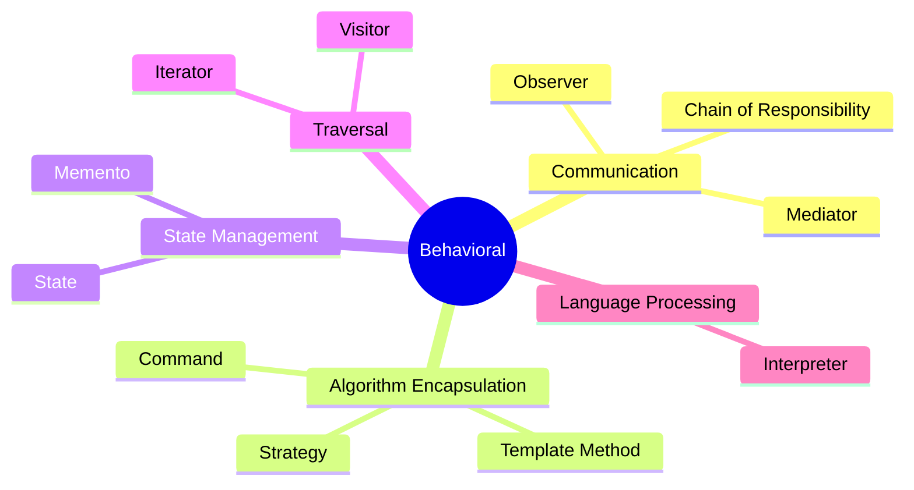
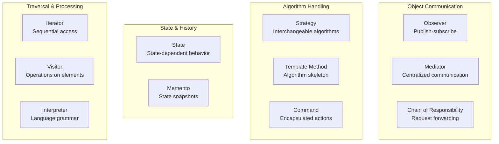
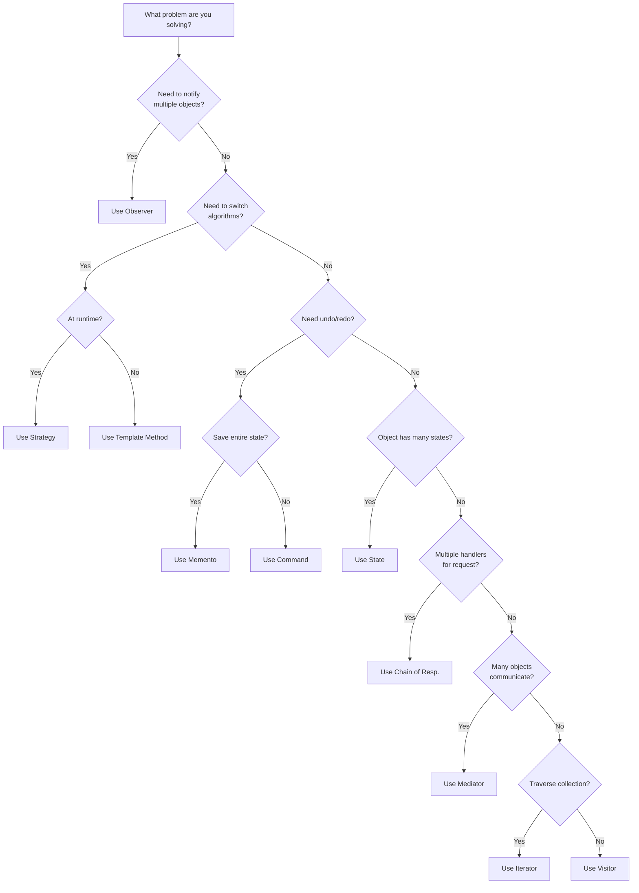

# Behavioral Patterns

Behavioral patterns are concerned with **algorithms** and the **assignment of responsibilities between objects**. They describe patterns of communication between objects and how they operate together to accomplish tasks that no single object could accomplish alone.



---

## Pattern Overview

| Pattern | Intent | Use When |
|---------|--------|----------|
| [Chain of Responsibility](/docs/architecture/patterns/behavioral/chain-of-responsibility) | Pass requests along a chain of handlers | Multiple handlers can process a request |
| [Command](/docs/architecture/patterns/behavioral/command) | Encapsulate a request as an object | Need to parameterize, queue, or log requests |
| [Interpreter](/docs/architecture/patterns/behavioral/interpreter) | Define a grammar and interpret sentences | Need to evaluate language expressions |
| [Iterator](/docs/architecture/patterns/behavioral/iterator) | Access elements sequentially without exposing structure | Need uniform traversal of collections |
| [Mediator](/docs/architecture/patterns/behavioral/mediator) | Define simplified communication between classes | Many objects communicate in complex ways |
| [Memento](/docs/architecture/patterns/behavioral/memento) | Capture and restore object state | Need undo/redo or state snapshots |
| [Observer](/docs/architecture/patterns/behavioral/observer) | Notify dependents of state changes | One-to-many dependency between objects |
| [State](/docs/architecture/patterns/behavioral/state) | Alter behavior when internal state changes | Object behavior depends on its state |
| [Strategy](/docs/architecture/patterns/behavioral/strategy) | Define a family of interchangeable algorithms | Need to switch algorithms at runtime |
| [Template Method](/docs/architecture/patterns/behavioral/template-method) | Define skeleton of algorithm, defer steps to subclasses | Algorithm structure is fixed, steps vary |
| [Visitor](/docs/architecture/patterns/behavioral/visitor) | Define new operations without changing classes | Need to add operations to stable structures |

---

## Categorization

### By Purpose



---

## Quick Comparison

### Communication Patterns

| Pattern | Direction | Coupling | Use Case |
|---------|-----------|----------|----------|
| **Observer** | One-to-many | Loose | Event systems, reactive UIs |
| **Mediator** | Many-to-many (via hub) | Centralized | Chat rooms, air traffic control |
| **Chain of Resp.** | One-to-one (sequential) | Loose | Middleware, validation |

### Algorithm Patterns

| Pattern | Flexibility | Inheritance | Use Case |
|---------|-------------|-------------|----------|
| **Strategy** | Switch at runtime | Composition | Payment methods, sorting |
| **Template Method** | Fixed structure | Inheritance | Frameworks, hooks |
| **Command** | Queued/logged | Composition | Undo/redo, transactions |

---

## Pattern Selection Guide



---

## TypeScript Implementation Notes

Behavioral patterns in TypeScript leverage:

- **Function composition** for strategies and commands
- **Generators** for iterators
- **Closures** for state encapsulation
- **Event emitters** for observers
- **Type guards** for visitors

```typescript
/**
 * Example: Strategy pattern using function composition
 * @description Demonstrates idiomatic TypeScript approach
 */
type SortStrategy<T> = (items: T[]) => T[];

/** Bubble sort implementation */
const bubbleSort: SortStrategy<number> = (items) => {
  const arr = [...items];
  for (let i = 0; i < arr.length; i++) {
    for (let j = 0; j < arr.length - i - 1; j++) {
      if (arr[j] > arr[j + 1]) {
        [arr[j], arr[j + 1]] = [arr[j + 1], arr[j]];
      }
    }
  }
  return arr;
};

/** Quick sort implementation */
const quickSort: SortStrategy<number> = (items) => {
  if (items.length <= 1) return items;
  const pivot = items[0];
  const left = items.slice(1).filter(x => x < pivot);
  const right = items.slice(1).filter(x => x >= pivot);
  return [...quickSort(left), pivot, ...quickSort(right)];
};

/** Sortable collection with swappable strategy */
const createSorter = <T>(strategy: SortStrategy<T>) => ({
  sort: (items: T[]) => strategy(items),
  setStrategy: (newStrategy: SortStrategy<T>) => createSorter(newStrategy),
});

const sorter = createSorter(bubbleSort);
const result = sorter.sort([3, 1, 4, 1, 5, 9]);
//    ^?
```

---

## Common Combinations

Behavioral patterns often work together:

| Combination | Purpose |
|-------------|---------|
| **Command + Memento** | Undo/redo with state snapshots |
| **Observer + Mediator** | Complex event routing |
| **Strategy + State** | State-dependent algorithms |
| **Iterator + Visitor** | Process collection elements |
| **Chain + Command** | Middleware pipelines |

---

## Summary

<Callout type="info">
  **Key Insight**: Behavioral patterns help manage complex control flows and communication between objects. They promote loose coupling and make algorithms interchangeable.
</Callout>

Choose your pattern based on:
- **Observer**: When changes in one object affect others
- **Strategy**: When you need interchangeable algorithms
- **Command**: When you need to queue, log, or undo operations
- **State**: When object behavior depends on its state
- **Chain**: When multiple handlers might process a request
