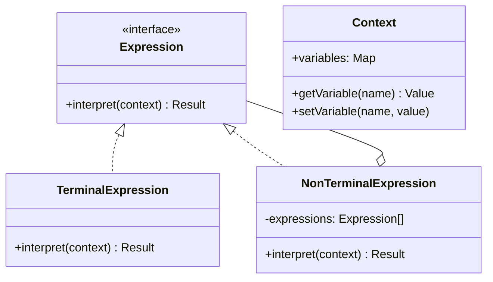
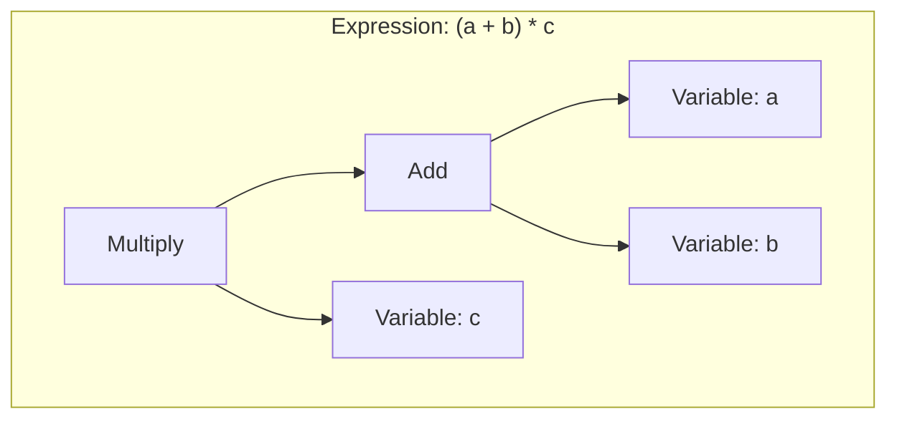

# Interpreter Pattern

## Intent

**Interpreter** is a behavioral design pattern that defines a grammatical representation for a language and provides an interpreter to deal with this grammar. It's used to evaluate sentences in a language.



---

## Problem It Solves

When you need to interpret or evaluate a language:
- Configuration files
- Query languages (SQL-like)
- Mathematical expressions
- Domain-specific languages (DSL)
- Regular expressions

---

## Solution

Build an Abstract Syntax Tree (AST) where each node interprets itself:



---

## Implementation

<Tabs items={["Math Expressions", "Boolean Logic", "Query Language", "Real-World: Template Engine"]}>
  <Tab value="Math Expressions">
```typescript
/**
 * Context holds variable values
 */
interface Context {
  variables: Map<string, number>;
  getVariable: (name: string) => number;
  setVariable: (name: string, value: number) => void;
}

const createContext = (): Context => {
  const variables = new Map<string, number>();
  
  return {
    variables,
    getVariable(name) {
      const value = variables.get(name);
      if (value === undefined) throw new Error(`Undefined variable: ${name}`);
      return value;
    },
    setVariable(name, value) {
      variables.set(name, value);
    },
  };
};

/**
 * Expression interface
 * @description All expressions must implement interpret
 */
interface Expression {
  interpret: (context: Context) => number;
  toString: () => string;
}

/**
 * Number literal
 */
const createNumber = (value: number): Expression => ({
  interpret: () => value,
  toString: () => String(value),
});

/**
 * Variable reference
 */
const createVariable = (name: string): Expression => ({
  interpret: (context) => context.getVariable(name),
  toString: () => name,
});

/**
 * Addition expression
 */
const createAdd = (left: Expression, right: Expression): Expression => ({
  interpret: (context) => left.interpret(context) + right.interpret(context),
  toString: () => `(${left.toString()} + ${right.toString()})`,
});

/**
 * Subtraction expression
 */
const createSubtract = (left: Expression, right: Expression): Expression => ({
  interpret: (context) => left.interpret(context) - right.interpret(context),
  toString: () => `(${left.toString()} - ${right.toString()})`,
});

/**
 * Multiplication expression
 */
const createMultiply = (left: Expression, right: Expression): Expression => ({
  interpret: (context) => left.interpret(context) * right.interpret(context),
  toString: () => `(${left.toString()} * ${right.toString()})`,
});

/**
 * Division expression
 */
const createDivide = (left: Expression, right: Expression): Expression => ({
  interpret: (context) => {
    const rightVal = right.interpret(context);
    if (rightVal === 0) throw new Error("Division by zero");
    return left.interpret(context) / rightVal;
  },
  toString: () => `(${left.toString()} / ${right.toString()})`,
});

/**
 * Power expression
 */
const createPower = (base: Expression, exponent: Expression): Expression => ({
  interpret: (context) => 
    Math.pow(base.interpret(context), exponent.interpret(context)),
  toString: () => `(${base.toString()} ^ ${exponent.toString()})`,
});

/**
 * Function expression
 */
const createFunction = (
  name: string,
  fn: (x: number) => number,
  arg: Expression
): Expression => ({
  interpret: (context) => fn(arg.interpret(context)),
  toString: () => `${name}(${arg.toString()})`,
});

// Math functions
const sqrt = (arg: Expression) => createFunction("sqrt", Math.sqrt, arg);
const sin = (arg: Expression) => createFunction("sin", Math.sin, arg);
const cos = (arg: Expression) => createFunction("cos", Math.cos, arg);
const abs = (arg: Expression) => createFunction("abs", Math.abs, arg);

// Build expression: (x + y) * 2 - sqrt(z)
const context = createContext();
context.setVariable("x", 5);
context.setVariable("y", 3);
context.setVariable("z", 16);

const expression = createSubtract(
  createMultiply(
    createAdd(createVariable("x"), createVariable("y")),
    createNumber(2)
  ),
  sqrt(createVariable("z"))
);

console.log("Expression:", expression.toString());
const result = expression.interpret(context);
console.log("Result:", result);
//                     ^?
// (5 + 3) * 2 - sqrt(16) = 16 - 4 = 12
```
  </Tab>
  <Tab value="Boolean Logic">
```typescript
/**
 * Context for boolean expressions
 */
interface BooleanContext {
  values: Map<string, boolean>;
  get: (name: string) => boolean;
  set: (name: string, value: boolean) => void;
}

const createBooleanContext = (): BooleanContext => {
  const values = new Map<string, boolean>();
  return {
    values,
    get(name) {
      const value = values.get(name);
      if (value === undefined) throw new Error(`Undefined: ${name}`);
      return value;
    },
    set(name, value) {
      values.set(name, value);
    },
  };
};

/**
 * Boolean expression interface
 */
interface BooleanExpression {
  evaluate: (context: BooleanContext) => boolean;
  toString: () => string;
}

/**
 * Literal true/false
 */
const createLiteral = (value: boolean): BooleanExpression => ({
  evaluate: () => value,
  toString: () => String(value),
});

/**
 * Variable reference
 */
const createBoolVar = (name: string): BooleanExpression => ({
  evaluate: (context) => context.get(name),
  toString: () => name,
});

/**
 * NOT expression
 */
const createNot = (expr: BooleanExpression): BooleanExpression => ({
  evaluate: (context) => !expr.evaluate(context),
  toString: () => `NOT(${expr.toString()})`,
});

/**
 * AND expression
 */
const createAnd = (left: BooleanExpression, right: BooleanExpression): BooleanExpression => ({
  evaluate: (context) => left.evaluate(context) && right.evaluate(context),
  toString: () => `(${left.toString()} AND ${right.toString()})`,
});

/**
 * OR expression
 */
const createOr = (left: BooleanExpression, right: BooleanExpression): BooleanExpression => ({
  evaluate: (context) => left.evaluate(context) || right.evaluate(context),
  toString: () => `(${left.toString()} OR ${right.toString()})`,
});

/**
 * XOR expression
 */
const createXor = (left: BooleanExpression, right: BooleanExpression): BooleanExpression => ({
  evaluate: (context) => left.evaluate(context) !== right.evaluate(context),
  toString: () => `(${left.toString()} XOR ${right.toString()})`,
});

/**
 * IMPLIES expression (A → B is equivalent to NOT A OR B)
 */
const createImplies = (left: BooleanExpression, right: BooleanExpression): BooleanExpression => ({
  evaluate: (context) => !left.evaluate(context) || right.evaluate(context),
  toString: () => `(${left.toString()} → ${right.toString()})`,
});

// Usage: Permission system
// canAccess = (isAdmin OR hasPermission) AND NOT isBlocked

const context = createBooleanContext();
context.set("isAdmin", false);
context.set("hasPermission", true);
context.set("isBlocked", false);

const canAccess = createAnd(
  createOr(
    createBoolVar("isAdmin"),
    createBoolVar("hasPermission")
  ),
  createNot(createBoolVar("isBlocked"))
);

console.log("Expression:", canAccess.toString());
console.log("Can access:", canAccess.evaluate(context));

// Change context
context.set("isBlocked", true);
console.log("After blocking:", canAccess.evaluate(context));

context.set("isAdmin", true);
context.set("isBlocked", false);
console.log("As admin:", canAccess.evaluate(context));
```
  </Tab>
  <Tab value="Query Language">
```typescript
/**
 * Simple query language for filtering objects
 * Syntax: field operator value [AND|OR field operator value]
 */

interface QueryContext {
  data: Record<string, unknown>;
}

/**
 * Query expression interface
 */
interface QueryExpression {
  match: (context: QueryContext) => boolean;
  toString: () => string;
}

type Operator = "=" | "!=" | ">" | "<" | ">=" | "<=" | "contains" | "startsWith" | "endsWith";

/**
 * Comparison expression
 */
const createComparison = (
  field: string,
  operator: Operator,
  value: unknown
): QueryExpression => ({
  match(context) {
    const fieldValue = context.data[field];
    
    switch (operator) {
      case "=": return fieldValue === value;
      case "!=": return fieldValue !== value;
      case ">": return (fieldValue as number) > (value as number);
      case "<": return (fieldValue as number) < (value as number);
      case ">=": return (fieldValue as number) >= (value as number);
      case "<=": return (fieldValue as number) <= (value as number);
      case "contains": 
        return String(fieldValue).includes(String(value));
      case "startsWith":
        return String(fieldValue).startsWith(String(value));
      case "endsWith":
        return String(fieldValue).endsWith(String(value));
      default:
        return false;
    }
  },
  toString: () => `${field} ${operator} ${JSON.stringify(value)}`,
});

/**
 * AND expression
 */
const and = (left: QueryExpression, right: QueryExpression): QueryExpression => ({
  match: (context) => left.match(context) && right.match(context),
  toString: () => `(${left.toString()} AND ${right.toString()})`,
});

/**
 * OR expression
 */
const or = (left: QueryExpression, right: QueryExpression): QueryExpression => ({
  match: (context) => left.match(context) || right.match(context),
  toString: () => `(${left.toString()} OR ${right.toString()})`,
});

/**
 * NOT expression
 */
const not = (expr: QueryExpression): QueryExpression => ({
  match: (context) => !expr.match(context),
  toString: () => `NOT(${expr.toString()})`,
});

/**
 * Query builder for fluent API
 */
interface QueryBuilder {
  where: (field: string) => OperatorBuilder;
  and: (field: string) => OperatorBuilder;
  or: (field: string) => OperatorBuilder;
  build: () => QueryExpression;
  execute: <T extends Record<string, unknown>>(data: T[]) => T[];
}

interface OperatorBuilder {
  equals: (value: unknown) => QueryBuilder;
  notEquals: (value: unknown) => QueryBuilder;
  greaterThan: (value: number) => QueryBuilder;
  lessThan: (value: number) => QueryBuilder;
  contains: (value: string) => QueryBuilder;
  startsWith: (value: string) => QueryBuilder;
}

const createQueryBuilder = (): QueryBuilder => {
  let expression: QueryExpression | null = null;
  let pendingOperator: "AND" | "OR" | null = null;

  const addExpression = (newExpr: QueryExpression) => {
    if (!expression) {
      expression = newExpr;
    } else if (pendingOperator === "AND") {
      expression = and(expression, newExpr);
    } else if (pendingOperator === "OR") {
      expression = or(expression, newExpr);
    }
    pendingOperator = null;
  };

  const createOperatorBuilder = (field: string): OperatorBuilder => ({
    equals: (value) => {
      addExpression(createComparison(field, "=", value));
      return builder;
    },
    notEquals: (value) => {
      addExpression(createComparison(field, "!=", value));
      return builder;
    },
    greaterThan: (value) => {
      addExpression(createComparison(field, ">", value));
      return builder;
    },
    lessThan: (value) => {
      addExpression(createComparison(field, "<", value));
      return builder;
    },
    contains: (value) => {
      addExpression(createComparison(field, "contains", value));
      return builder;
    },
    startsWith: (value) => {
      addExpression(createComparison(field, "startsWith", value));
      return builder;
    },
  });

  const builder: QueryBuilder = {
    where: (field) => createOperatorBuilder(field),
    and: (field) => {
      pendingOperator = "AND";
      return createOperatorBuilder(field);
    },
    or: (field) => {
      pendingOperator = "OR";
      return createOperatorBuilder(field);
    },
    build: () => expression || createComparison("true", "=", true),
    execute: (data) => {
      const query = builder.build();
      return data.filter(item => query.match({ data: item }));
    },
  };

  return builder;
};

// Usage
interface User {
  name: string;
  age: number;
  role: string;
  email: string;
  active: boolean;
  [key: string]: unknown; // Index signature for Record compatibility
}

const users: User[] = [
  { name: "Alice", age: 30, role: "admin", email: "alice@example.com", active: true },
  { name: "Bob", age: 25, role: "user", email: "bob@test.com", active: true },
  { name: "Charlie", age: 35, role: "admin", email: "charlie@example.com", active: false },
  { name: "Diana", age: 28, role: "user", email: "diana@example.com", active: true },
];

// Query: role = "admin" AND active = true
const activeAdmins = createQueryBuilder()
  .where("role").equals("admin")
  .and("active").equals(true)
  .execute(users);

console.log("Active admins:", activeAdmins.map(u => u.name));

// Query: age > 25 OR email contains "test"
const filtered = createQueryBuilder()
  .where("age").greaterThan(25)
  .or("email").contains("test")
  .execute(users);

console.log("Age > 25 or test email:", filtered.map(u => u.name));
```
  </Tab>
  <Tab value="Real-World: Template Engine">
```ts
/**
 * Simple template engine
 * Syntax: {{ variable }} for interpolation
 *         ... for conditionals
 *         ... for loops
 */

interface TemplateContext {
  data: Record<string, unknown>;
  get: (path: string) => unknown;
}

const createTemplateContext = (data: Record<string, unknown>): TemplateContext => ({
  data,
  get(path) {
    return path.split(".").reduce<unknown>((obj, key) => {
      if (obj && typeof obj === "object") {
        return (obj as Record<string, unknown>)[key];
      }
      return undefined;
    }, data);
  },
});

/**
 * Template node interface
 */
interface TemplateNode {
  render: (context: TemplateContext) => string;
}

/**
 * Text node - literal text
 */
const createTextNode = (text: string): TemplateNode => ({
  render: () => text,
});

/**
 * Variable node - {{ variable }}
 */
const createVariableNode = (path: string): TemplateNode => ({
  render: (context) => String(context.get(path.trim()) ?? ""),
});

/**
 * If node - ...
 */
const createIfNode = (
  condition: string,
  thenBranch: TemplateNode[],
  elseBranch: TemplateNode[] = []
): TemplateNode => ({
  render(context) {
    const value = context.get(condition.trim());
    const nodes = value ? thenBranch : elseBranch;
    return nodes.map(node => node.render(context)).join("");
  },
});

/**
 * For node - ...
 */
const createForNode = (
  itemName: string,
  arrayPath: string,
  body: TemplateNode[]
): TemplateNode => ({
  render(context) {
    const array = context.get(arrayPath.trim());
    if (!Array.isArray(array)) return "";

    return array.map((item, index) => {
      const loopContext = createTemplateContext({
        ...context.data,
        [itemName]: item,
        loop: { index, first: index === 0, last: index === array.length - 1 },
      });
      return body.map(node => node.render(loopContext)).join("");
    }).join("");
  },
});

/**
 * Composite node - sequence of nodes
 */
const createCompositeNode = (nodes: TemplateNode[]): TemplateNode => ({
  render: (context) => nodes.map(node => node.render(context)).join(""),
});

/**
 * Template parser (simplified)
 */
const parseTemplate = (template: string): TemplateNode => {
  const nodes: TemplateNode[] = [];
  let remaining = template;

  const patterns = {
    variable: /\{\{\s*([^}]+)\s*\}\}/,
    ifStart: /\{%\s*if\s+([^%]+)\s*%\}/,
    else: /\{%\s*else\s*%\}/,
    endif: /\{%\s*endif\s*%\}/,
    forStart: /\{%\s*for\s+(\w+)\s+in\s+([^%]+)\s*%\}/,
    endfor: /\{%\s*endfor\s*%\}/,
  };

  while (remaining.length > 0) {
    // Find next tag
    const variableMatch = remaining.match(patterns.variable);
    const ifMatch = remaining.match(patterns.ifStart);
    const forMatch = remaining.match(patterns.forStart);

    // Find earliest match
    const matches = [
      { type: "variable" as const, match: variableMatch },
      { type: "if" as const, match: ifMatch },
      { type: "for" as const, match: forMatch },
    ].filter(m => m.match !== null)
     .sort((a, b) => a.match!.index! - b.match!.index!);

    if (matches.length === 0) {
      // No more tags, rest is text
      nodes.push(createTextNode(remaining));
      break;
    }

    const { type, match } = matches[0];
    const index = match!.index!;

    // Add text before tag
    if (index > 0) {
      nodes.push(createTextNode(remaining.slice(0, index)));
    }

    if (type === "variable") {
      nodes.push(createVariableNode(match![1]));
      remaining = remaining.slice(index + match![0].length);
    } else if (type === "if") {
      const condition = match![1];
      remaining = remaining.slice(index + match![0].length);
      
      // Find endif (simplified - doesn't handle nested)
      const endifMatch = remaining.match(patterns.endif);
      const elseMatch = remaining.match(patterns.else);
      
      if (endifMatch) {
        let thenContent: string;
        let elseContent = "";
        
        if (elseMatch && elseMatch.index! < endifMatch.index!) {
          thenContent = remaining.slice(0, elseMatch.index);
          elseContent = remaining.slice(
            elseMatch.index! + elseMatch[0].length,
            endifMatch.index
          );
        } else {
          thenContent = remaining.slice(0, endifMatch.index);
        }
        
        const thenNodes = [parseTemplate(thenContent)];
        const elseNodes = elseContent ? [parseTemplate(elseContent)] : [];
        
        nodes.push(createIfNode(condition, thenNodes, elseNodes));
        remaining = remaining.slice(endifMatch.index! + endifMatch[0].length);
      }
    } else if (type === "for") {
      const itemName = match![1];
      const arrayPath = match![2];
      remaining = remaining.slice(index + match![0].length);
      
      // Find endfor
      const endforMatch = remaining.match(patterns.endfor);
      if (endforMatch) {
        const bodyContent = remaining.slice(0, endforMatch.index);
        const bodyNodes = [parseTemplate(bodyContent)];
        
        nodes.push(createForNode(itemName, arrayPath, bodyNodes));
        remaining = remaining.slice(endforMatch.index! + endforMatch[0].length);
      }
    }
  }

  return createCompositeNode(nodes);
};

/**
 * Template engine
 */
interface TemplateEngine {
  compile: (template: string) => (data: Record<string, unknown>) => string;
  render: (template: string, data: Record<string, unknown>) => string;
}

const createTemplateEngine = (): TemplateEngine => ({
  compile(template) {
    const ast = parseTemplate(template);
    return (data) => ast.render(createTemplateContext(data));
  },
  render(template, data) {
    return this.compile(template)(data);
  },
});

// Usage
const engine = createTemplateEngine();

const template = `
Hello, {{ user.name }}!


You have admin privileges.

You are a regular user.


Your items:

- {{ item.name }}: ${{ item.price }}


Total: ${{ total }}
`;

const data = {
  user: { name: "Alice", isAdmin: true },
  items: [
    { name: "Widget", price: "9.99" },
    { name: "Gadget", price: "19.99" },
    { name: "Gizmo", price: "14.99" },
  ],
  total: "44.97",
};

const output = engine.render(template, data);
console.log(output);
```
  </Tab>
</Tabs>

---

## When to Use

<Accordions>
  <Accordion title="✅ Use Interpreter when...">
    - **Grammar is simple**: Complex grammars need parser generators
    
    - **Efficiency isn't critical**: Interpreter can be slow
    
    - **Need to evaluate expressions**: Math, logic, queries
    
    - **Building DSLs**: Domain-specific languages
    
    - **Configuration languages**: Parsing config files
  </Accordion>
  
  <Accordion title="❌ Avoid Interpreter when...">
    - **Complex grammar**: Use parser generators (ANTLR, PEG.js)
    
    - **Performance critical**: Compile to bytecode instead
    
    - **General-purpose language**: Too complex for this pattern
  </Accordion>
</Accordions>

---

## Real-World Applications

| Application | Usage |
|-------------|-------|
| **SQL** | Query interpretation |
| **Regular Expressions** | Pattern matching |
| **Template Engines** | Handlebars, Mustache |
| **Config Files** | YAML, JSON, TOML parsing |
| **Spreadsheets** | Formula evaluation |
| **Game Engines** | Scripting languages |

---

## Summary

<Callout type="info">
  **Key Takeaway**: Interpreter defines a grammar and interprets sentences in that language. Best for simple DSLs, expression evaluation, and configuration parsing.
</Callout>

### Pros
- ✅ Easy to change and extend grammar
- ✅ Implementing grammar is straightforward
- ✅ Good for simple languages

### Cons
- ❌ Complex grammars are hard to maintain
- ❌ Can be slow for complex expressions
- ❌ Requires many classes for grammar rules
