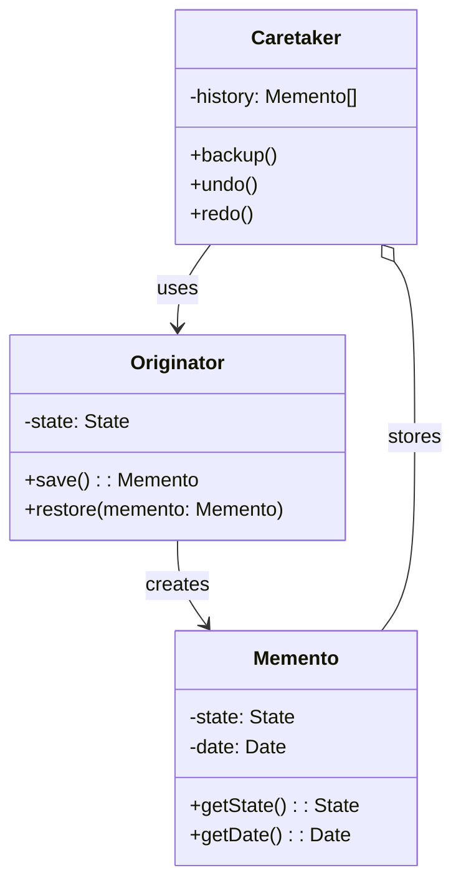
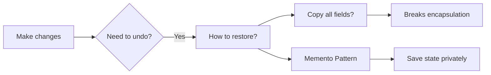
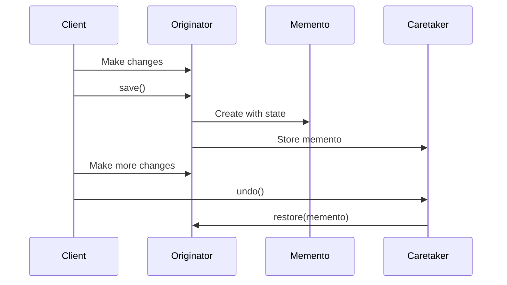

# Memento Pattern

## Intent

**Memento** is a behavioral design pattern that lets you save and restore the previous state of an object without revealing the details of its implementation. It's like creating snapshots or checkpoints that you can return to later.



---

## Problem It Solves

When you need undo/redo functionality:



Direct field copying violates encapsulation and exposes internal implementation.

---

## Solution

Create snapshots that store internal state without exposing it:



---

## Implementation

<Tabs items={["Text Editor", "Game Save", "Transaction Rollback", "Real-World: Form State"]}>
  <Tab value="Text Editor">
```typescript
/**
 * Editor state snapshot
 */
interface EditorMemento {
  readonly getState: () => {
    content: string;
    cursorPosition: number;
    selectionStart?: number;
    selectionEnd?: number;
  };
  readonly getTimestamp: () => Date;
  readonly getName: () => string;
}

/**
 * Create an editor memento
 */
const createEditorMemento = (
  content: string,
  cursorPosition: number,
  selection?: { start: number; end: number }
): EditorMemento => {
  const timestamp = new Date();
  const state = Object.freeze({
    content,
    cursorPosition,
    selectionStart: selection?.start,
    selectionEnd: selection?.end,
  });

  return {
    getState: () => ({ ...state }),
    getTimestamp: () => timestamp,
    getName: () => `${timestamp.toLocaleTimeString()} - ${content.length} chars`,
  };
};

/**
 * Text editor (Originator)
 * @description The originator creates and restores mementos
 */
interface TextEditor {
  content: string;
  cursorPosition: number;
  selection?: { start: number; end: number };
  type: (text: string) => void;
  delete: (count: number) => void;
  moveCursor: (position: number) => void;
  select: (start: number, end: number) => void;
  save: () => EditorMemento;
  restore: (memento: EditorMemento) => void;
}

const createTextEditor = (): TextEditor => {
  let content = "";
  let cursorPosition = 0;
  let selection: { start: number; end: number } | undefined;

  return {
    get content() { return content; },
    get cursorPosition() { return cursorPosition; },
    get selection() { return selection; },

    type(text) {
      const before = content.slice(0, cursorPosition);
      const after = content.slice(cursorPosition);
      content = before + text + after;
      cursorPosition += text.length;
      selection = undefined;
      console.log(`Typed: "${text}" | Content: "${content}"`);
    },

    delete(count) {
      if (selection) {
        const before = content.slice(0, selection.start);
        const after = content.slice(selection.end);
        content = before + after;
        cursorPosition = selection.start;
        selection = undefined;
      } else {
        const start = Math.max(0, cursorPosition - count);
        content = content.slice(0, start) + content.slice(cursorPosition);
        cursorPosition = start;
      }
      console.log(`Deleted ${count} chars | Content: "${content}"`);
    },

    moveCursor(position) {
      cursorPosition = Math.max(0, Math.min(position, content.length));
      selection = undefined;
    },

    select(start, end) {
      selection = {
        start: Math.max(0, start),
        end: Math.min(end, content.length),
      };
    },

    save() {
      return createEditorMemento(content, cursorPosition, selection);
    },

    restore(memento) {
      const state = memento.getState();
      content = state.content;
      cursorPosition = state.cursorPosition;
      selection = state.selectionStart !== undefined && state.selectionEnd !== undefined
        ? { start: state.selectionStart, end: state.selectionEnd }
        : undefined;
      console.log(`Restored: "${content}"`);
    },
  };
};

/**
 * History manager (Caretaker)
 * @description Manages the memento stack without knowing state details
 */
interface History<T> {
  backup: (memento: T) => void;
  undo: () => T | undefined;
  redo: () => T | undefined;
  canUndo: () => boolean;
  canRedo: () => boolean;
  getHistory: () => T[];
}

const createHistory = <T>(): History<T> => {
  const undoStack: T[] = [];
  const redoStack: T[] = [];

  return {
    backup(memento) {
      undoStack.push(memento);
      redoStack.length = 0; // Clear redo on new action
    },

    undo() {
      const memento = undoStack.pop();
      if (memento) {
        redoStack.push(memento);
      }
      return undoStack[undoStack.length - 1];
    },

    redo() {
      const memento = redoStack.pop();
      if (memento) {
        undoStack.push(memento);
      }
      return memento;
    },

    canUndo: () => undoStack.length > 1,
    canRedo: () => redoStack.length > 0,
    getHistory: () => [...undoStack],
  };
};

// Usage
const editor = createTextEditor();
const history = createHistory<EditorMemento>();

// Save initial state
history.backup(editor.save());

// Type some text
editor.type("Hello");
history.backup(editor.save());

editor.type(" World");
history.backup(editor.save());

editor.type("!");
history.backup(editor.save());

console.log("\n--- Undo Demo ---\n");

// Undo
console.log("Current:", editor.content);
const prev = history.undo();
if (prev) editor.restore(prev);

const prev2 = history.undo();
if (prev2) editor.restore(prev2);

console.log("\n--- Redo Demo ---\n");

// Redo
const next = history.redo();
if (next) editor.restore(next);
```
  </Tab>
  <Tab value="Game Save">
```typescript
/**
 * Player stats
 */
interface PlayerStats {
  health: number;
  maxHealth: number;
  mana: number;
  maxMana: number;
  level: number;
  experience: number;
}

/**
 * Position in game world
 */
interface Position {
  x: number;
  y: number;
  map: string;
}

/**
 * Game save memento
 */
interface GameSave {
  readonly id: string;
  readonly name: string;
  readonly timestamp: Date;
  readonly playtime: number;
  readonly getState: () => {
    stats: PlayerStats;
    position: Position;
    inventory: string[];
    quests: { id: string; completed: boolean }[];
  };
}

/**
 * Create a game save
 */
const createGameSave = (
  name: string,
  stats: PlayerStats,
  position: Position,
  inventory: string[],
  quests: { id: string; completed: boolean }[],
  playtime: number
): GameSave => {
  const id = `save_${Date.now()}`;
  const timestamp = new Date();
  
  // Deep freeze state
  const state = Object.freeze({
    stats: { ...stats },
    position: { ...position },
    inventory: [...inventory],
    quests: quests.map(q => ({ ...q })),
  });

  return {
    id,
    name,
    timestamp,
    playtime,
    getState: () => ({
      stats: { ...state.stats },
      position: { ...state.position },
      inventory: [...state.inventory],
      quests: state.quests.map(q => ({ ...q })),
    }),
  };
};

/**
 * Game state (Originator)
 */
interface GameState {
  stats: PlayerStats;
  position: Position;
  inventory: string[];
  quests: { id: string; completed: boolean }[];
  playtime: number;
  
  // Actions
  takeDamage: (amount: number) => void;
  heal: (amount: number) => void;
  gainExperience: (amount: number) => void;
  moveTo: (x: number, y: number, map?: string) => void;
  addItem: (item: string) => void;
  completeQuest: (questId: string) => void;
  
  // Memento
  save: (name: string) => GameSave;
  load: (save: GameSave) => void;
  display: () => void;
}

const createGameState = (): GameState => {
  let startTime = Date.now();
  let stats: PlayerStats = {
    health: 100,
    maxHealth: 100,
    mana: 50,
    maxMana: 50,
    level: 1,
    experience: 0,
  };
  let position: Position = { x: 0, y: 0, map: "spawn" };
  let inventory: string[] = ["Starter Sword"];
  let quests: { id: string; completed: boolean }[] = [
    { id: "main_1", completed: false },
  ];
  let totalPlaytime = 0;

  const getPlaytime = () => totalPlaytime + (Date.now() - startTime);

  return {
    get stats() { return { ...stats }; },
    get position() { return { ...position }; },
    get inventory() { return [...inventory]; },
    get quests() { return quests.map(q => ({ ...q })); },
    get playtime() { return getPlaytime(); },

    takeDamage(amount) {
      stats.health = Math.max(0, stats.health - amount);
      console.log(`Took ${amount} damage. Health: ${stats.health}/${stats.maxHealth}`);
    },

    heal(amount) {
      stats.health = Math.min(stats.maxHealth, stats.health + amount);
      console.log(`Healed ${amount}. Health: ${stats.health}/${stats.maxHealth}`);
    },

    gainExperience(amount) {
      stats.experience += amount;
      const expNeeded = stats.level * 100;
      
      while (stats.experience >= expNeeded) {
        stats.experience -= expNeeded;
        stats.level += 1;
        stats.maxHealth += 10;
        stats.health = stats.maxHealth;
        stats.maxMana += 5;
        stats.mana = stats.maxMana;
        console.log(`Level up! Now level ${stats.level}`);
      }
    },

    moveTo(x, y, map) {
      position = { x, y, map: map || position.map };
      console.log(`Moved to (${x}, ${y}) on ${position.map}`);
    },

    addItem(item) {
      inventory.push(item);
      console.log(`Added "${item}" to inventory`);
    },

    completeQuest(questId) {
      const quest = quests.find(q => q.id === questId);
      if (quest) {
        quest.completed = true;
        console.log(`Completed quest: ${questId}`);
      }
    },

    save(name) {
      console.log(`Saving game: "${name}"`);
      return createGameSave(name, stats, position, inventory, quests, getPlaytime());
    },

    load(save) {
      const state = save.getState();
      stats = state.stats;
      position = state.position;
      inventory = state.inventory;
      quests = state.quests;
      totalPlaytime = save.playtime;
      startTime = Date.now();
      console.log(`Loaded save: "${save.name}"`);
    },

    display() {
      console.log("\n--- Game State ---");
      console.log(`Level: ${stats.level} | XP: ${stats.experience}`);
      console.log(`Health: ${stats.health}/${stats.maxHealth}`);
      console.log(`Position: (${position.x}, ${position.y}) on ${position.map}`);
      console.log(`Inventory: ${inventory.join(", ")}`);
      console.log("-------------------\n");
    },
  };
};

/**
 * Save manager (Caretaker)
 */
interface SaveManager {
  saves: GameSave[];
  createSave: (game: GameState, name: string) => void;
  loadSave: (game: GameState, saveId: string) => boolean;
  deleteSave: (saveId: string) => void;
  listSaves: () => void;
}

const createSaveManager = (maxSaves = 10): SaveManager => {
  const saves: GameSave[] = [];

  return {
    get saves() { return [...saves]; },

    createSave(game, name) {
      const save = game.save(name);
      saves.unshift(save);
      
      // Limit saves
      if (saves.length > maxSaves) {
        saves.pop();
      }
    },

    loadSave(game, saveId) {
      const save = saves.find(s => s.id === saveId);
      if (save) {
        game.load(save);
        return true;
      }
      return false;
    },

    deleteSave(saveId) {
      const index = saves.findIndex(s => s.id === saveId);
      if (index >= 0) {
        saves.splice(index, 1);
      }
    },

    listSaves() {
      console.log("\n--- Save Files ---");
      for (const save of saves) {
        const playtime = Math.floor(save.playtime / 1000);
        console.log(`[${save.id}] ${save.name} - ${save.timestamp.toLocaleString()} (${playtime}s)`);
      }
      console.log("------------------\n");
    },
  };
};

// Usage
const game = createGameState();
const saveManager = createSaveManager();

console.log("\n--- Game Session ---\n");

// Play the game
game.display();

game.moveTo(10, 20);
game.addItem("Health Potion");
game.gainExperience(50);

// Save progress
saveManager.createSave(game, "After first area");

// Continue playing
game.moveTo(50, 100, "dungeon");
game.takeDamage(30);
game.completeQuest("main_1");
game.addItem("Epic Sword");

// Quick save
saveManager.createSave(game, "Before boss");

// Boss fight goes badly
game.takeDamage(70);
game.display();

// Load previous save
console.log("\n--- Loading Save ---\n");
saveManager.listSaves();

const saves = saveManager.saves;
if (saves[0]) {
  saveManager.loadSave(game, saves[0].id);
  game.display();
}
```
  </Tab>
  <Tab value="Transaction Rollback">
```typescript
/**
 * Database record
 */
interface DatabaseRecord {
  id: string;
  data: Record<string, unknown>;
  version: number;
  updatedAt: Date;
}

/**
 * Database state memento
 */
interface DatabaseMemento {
  readonly getRecords: () => Map<string, DatabaseRecord>;
  readonly getTimestamp: () => Date;
  readonly getTransactionId: () => string;
}

/**
 * Create a database memento
 */
const createDatabaseMemento = (
  records: Map<string, DatabaseRecord>,
  transactionId: string
): DatabaseMemento => {
  const timestamp = new Date();
  
  // Deep clone the records
  const snapshot = new Map<string, DatabaseRecord>();
  for (const [key, record] of records) {
    snapshot.set(key, {
      ...record,
      data: structuredClone(record.data),
    });
  }

  return {
    getRecords: () => {
      const clone = new Map<string, DatabaseRecord>();
      for (const [key, record] of snapshot) {
        clone.set(key, { ...record, data: structuredClone(record.data) });
      }
      return clone;
    },
    getTimestamp: () => timestamp,
    getTransactionId: () => transactionId,
  };
};

/**
 * Simple in-memory database with transaction support
 */
interface Database {
  // CRUD operations
  insert: (id: string, data: Record<string, unknown>) => void;
  update: (id: string, data: Partial<Record<string, unknown>>) => void;
  delete: (id: string) => void;
  get: (id: string) => DatabaseRecord | undefined;
  getAll: () => DatabaseRecord[];
  
  // Transaction methods
  beginTransaction: () => string;
  commit: () => void;
  rollback: () => void;
  isInTransaction: () => boolean;
}

const createDatabase = (): Database => {
  const records = new Map<string, DatabaseRecord>();
  let transactionId: string | null = null;
  let savepoint: DatabaseMemento | null = null;

  const generateId = () => `txn_${Date.now()}_${Math.random().toString(36).slice(2, 9)}`;

  return {
    insert(id, data) {
      if (records.has(id)) {
        throw new Error(`Record with id "${id}" already exists`);
      }
      
      const record: DatabaseRecord = {
        id,
        data: structuredClone(data),
        version: 1,
        updatedAt: new Date(),
      };
      
      records.set(id, record);
      console.log(`Inserted: ${id}`);
    },

    update(id, data) {
      const existing = records.get(id);
      if (!existing) {
        throw new Error(`Record "${id}" not found`);
      }
      
      const updated: DatabaseRecord = {
        ...existing,
        data: { ...existing.data, ...structuredClone(data) },
        version: existing.version + 1,
        updatedAt: new Date(),
      };
      
      records.set(id, updated);
      console.log(`Updated: ${id} (v${updated.version})`);
    },

    delete(id) {
      if (!records.has(id)) {
        throw new Error(`Record "${id}" not found`);
      }
      records.delete(id);
      console.log(`Deleted: ${id}`);
    },

    get(id) {
      const record = records.get(id);
      return record ? { ...record, data: structuredClone(record.data) } : undefined;
    },

    getAll() {
      return Array.from(records.values()).map(r => ({
        ...r,
        data: structuredClone(r.data),
      }));
    },

    beginTransaction() {
      if (transactionId) {
        throw new Error("Transaction already in progress");
      }
      
      transactionId = generateId();
      savepoint = createDatabaseMemento(records, transactionId);
      console.log(`\nTransaction started: ${transactionId}`);
      return transactionId;
    },

    commit() {
      if (!transactionId) {
        throw new Error("No transaction in progress");
      }
      
      console.log(`Transaction committed: ${transactionId}\n`);
      transactionId = null;
      savepoint = null;
    },

    rollback() {
      if (!transactionId || !savepoint) {
        throw new Error("No transaction in progress");
      }
      
      // Restore from savepoint
      records.clear();
      for (const [key, record] of savepoint.getRecords()) {
        records.set(key, record);
      }
      
      console.log(`Transaction rolled back: ${transactionId}\n`);
      transactionId = null;
      savepoint = null;
    },

    isInTransaction: () => transactionId !== null,
  };
};

// Usage
const db = createDatabase();

console.log("\n--- Database Transactions Demo ---\n");

// Initial data
db.insert("user:1", { name: "Alice", balance: 1000 });
db.insert("user:2", { name: "Bob", balance: 500 });

console.log("\nInitial state:", db.getAll().map(r => `${r.id}: ${JSON.stringify(r.data)}`));

// Successful transaction
console.log("\n--- Successful Transfer ---");
db.beginTransaction();

try {
  const alice = db.get("user:1")!;
  const bob = db.get("user:2")!;
  
  // Transfer $200 from Alice to Bob
  db.update("user:1", { balance: (alice.data.balance as number) - 200 });
  db.update("user:2", { balance: (bob.data.balance as number) + 200 });
  
  db.commit();
} catch (error) {
  db.rollback();
}

console.log("After transfer:", db.getAll().map(r => `${r.id}: ${JSON.stringify(r.data)}`));

// Failed transaction (rollback)
console.log("\n--- Failed Transfer (Insufficient Funds) ---");
db.beginTransaction();

try {
  const alice = db.get("user:1")!;
  const bob = db.get("user:2")!;
  
  // Try to transfer $1000 from Alice (only has $800)
  const aliceBalance = alice.data.balance as number;
  if (aliceBalance < 1000) {
    throw new Error("Insufficient funds");
  }
  
  db.update("user:1", { balance: aliceBalance - 1000 });
  db.update("user:2", { balance: (bob.data.balance as number) + 1000 });
  
  db.commit();
} catch (error) {
  console.log(`Error: ${error instanceof Error ? error.message : String(error)}`);
  db.rollback();
}

console.log("After rollback:", db.getAll().map(r => `${r.id}: ${JSON.stringify(r.data)}`));
```
  </Tab>
  <Tab value="Real-World: Form State">
```ts
/**
 * Form field state
 */
interface FieldState {
  value: string;
  touched: boolean;
  dirty: boolean;
  errors: string[];
}

/**
 * Complete form state
 */
interface FormState {
  fields: Record<string, FieldState>;
  isSubmitting: boolean;
  submitCount: number;
}

/**
 * Form state memento
 */
interface FormMemento {
  readonly getState: () => FormState;
  readonly getTimestamp: () => Date;
  readonly getLabel: () => string;
}

const createFormMemento = (state: FormState, label: string): FormMemento => {
  const timestamp = new Date();
  
  // Deep clone state
  const snapshot: FormState = {
    fields: {},
    isSubmitting: state.isSubmitting,
    submitCount: state.submitCount,
  };
  
  for (const [key, field] of Object.entries(state.fields)) {
    snapshot.fields[key] = { ...field, errors: [...field.errors] };
  }

  return {
    getState: () => {
      const clone: FormState = {
        fields: {},
        isSubmitting: snapshot.isSubmitting,
        submitCount: snapshot.submitCount,
      };
      for (const [key, field] of Object.entries(snapshot.fields)) {
        clone.fields[key] = { ...field, errors: [...field.errors] };
      }
      return clone;
    },
    getTimestamp: () => timestamp,
    getLabel: () => label,
  };
};

/**
 * Form with undo/redo support
 */
interface UndoableForm {
  // Field operations
  setField: (name: string, value: string) => void;
  getField: (name: string) => FieldState | undefined;
  validateField: (name: string) => string[];
  
  // Form operations
  submit: () => Promise<boolean>;
  reset: () => void;
  getState: () => FormState;
  
  // History operations
  undo: () => void;
  redo: () => void;
  canUndo: () => boolean;
  canRedo: () => boolean;
  
  // Autosave
  enableAutosave: (intervalMs: number) => void;
  disableAutosave: () => void;
}

type Validator = (value: string) => string | null;

interface FormConfig {
  fields: Record<string, { 
    initial: string; 
    validators: Validator[];
  }>;
  onSubmit: (data: Record<string, string>) => Promise<boolean>;
}

const createUndoableForm = (config: FormConfig): UndoableForm => {
  // Initialize state
  let state: FormState = {
    fields: {},
    isSubmitting: false,
    submitCount: 0,
  };

  for (const [name, { initial }] of Object.entries(config.fields)) {
    state.fields[name] = {
      value: initial,
      touched: false,
      dirty: false,
      errors: [],
    };
  }

  // History
  const undoStack: FormMemento[] = [createFormMemento(state, "Initial")];
  const redoStack: FormMemento[] = [];
  let autosaveInterval: ReturnType<typeof setInterval> | null = null;

  const saveState = (label: string) => {
    undoStack.push(createFormMemento(state, label));
    redoStack.length = 0; // Clear redo on new action
    
    // Limit history size
    if (undoStack.length > 50) {
      undoStack.shift();
    }
  };

  const form: UndoableForm = {
    setField(name, value) {
      const field = state.fields[name];
      if (!field) return;

      const previousValue = field.value;
      state.fields[name] = {
        ...field,
        value,
        touched: true,
        dirty: value !== config.fields[name]?.initial,
        errors: [],
      };

      // Save meaningful changes (not every keystroke)
      if (Math.abs(value.length - previousValue.length) >= 5 || value === "") {
        saveState(`Changed ${name}`);
      }

      console.log(`Field "${name}" = "${value}"`);
    },

    getField(name) {
      const field = state.fields[name];
      return field ? { ...field, errors: [...field.errors] } : undefined;
    },

    validateField(name) {
      const field = state.fields[name];
      const validators = config.fields[name]?.validators ?? [];
      
      if (!field) return [];

      const errors = validators
        .map(v => v(field.value))
        .filter((e): e is string => e !== null);

      state.fields[name] = { ...field, errors };
      return errors;
    },

    async submit() {
      state.isSubmitting = true;
      state.submitCount += 1;

      // Validate all fields
      let hasErrors = false;
      for (const name of Object.keys(state.fields)) {
        const errors = form.validateField(name);
        if (errors.length > 0) hasErrors = true;
      }

      if (hasErrors) {
        state.isSubmitting = false;
        console.log("Form validation failed");
        return false;
      }

      // Prepare data
      const data: Record<string, string> = {};
      for (const [name, field] of Object.entries(state.fields)) {
        data[name] = field.value;
      }

      try {
        const success = await config.onSubmit(data);
        if (success) {
          saveState("Form submitted");
        }
        return success;
      } finally {
        state.isSubmitting = false;
      }
    },

    reset() {
      for (const [name, { initial }] of Object.entries(config.fields)) {
        state.fields[name] = {
          value: initial,
          touched: false,
          dirty: false,
          errors: [],
        };
      }
      state.isSubmitting = false;
      saveState("Form reset");
      console.log("Form reset");
    },

    getState() {
      const clone: FormState = {
        fields: {},
        isSubmitting: state.isSubmitting,
        submitCount: state.submitCount,
      };
      for (const [key, field] of Object.entries(state.fields)) {
        clone.fields[key] = { ...field, errors: [...field.errors] };
      }
      return clone;
    },

    undo() {
      if (undoStack.length <= 1) return;
      
      const current = undoStack.pop()!;
      redoStack.push(current);
      
      const previous = undoStack[undoStack.length - 1];
      state = previous.getState();
      
      console.log(`Undo: ${previous.getLabel()}`);
    },

    redo() {
      if (redoStack.length === 0) return;
      
      const memento = redoStack.pop()!;
      undoStack.push(memento);
      state = memento.getState();
      
      console.log(`Redo: ${memento.getLabel()}`);
    },

    canUndo: () => undoStack.length > 1,
    canRedo: () => redoStack.length > 0,

    enableAutosave(intervalMs) {
      form.disableAutosave();
      autosaveInterval = setInterval(() => {
        saveState("Autosave");
        console.log("Autosaved");
      }, intervalMs);
    },

    disableAutosave() {
      if (autosaveInterval) {
        clearInterval(autosaveInterval);
        autosaveInterval = null;
      }
    },
  };

  return form;
};

// Usage
const registrationForm = createUndoableForm({
  fields: {
    email: {
      initial: "",
      validators: [
        v => v.trim() ? null : "Email is required",
        v => /^[^\s@]+@[^\s@]+\.[^\s@]+$/.test(v) ? null : "Invalid email",
      ],
    },
    username: {
      initial: "",
      validators: [
        v => v.trim() ? null : "Username is required",
        v => v.length >= 3 ? null : "Username must be at least 3 characters",
      ],
    },
    password: {
      initial: "",
      validators: [
        v => v.trim() ? null : "Password is required",
        v => v.length >= 8 ? null : "Password must be at least 8 characters",
      ],
    },
  },
  onSubmit: async (data) => {
    console.log("Submitting:", data);
    await new Promise(r => setTimeout(r, 500));
    return true;
  },
});

console.log("\n--- Form with Undo/Redo Demo ---\n");

// Fill out form
registrationForm.setField("email", "john@example.com");
registrationForm.setField("username", "johndoe");
registrationForm.setField("password", "SecurePass123");

console.log("\nCurrent state:");
const currentState = registrationForm.getState();
for (const [name, field] of Object.entries(currentState.fields)) {
  console.log(`  ${name}: "${field.value}"`);
}

// Undo changes
console.log("\n--- Undo Operations ---\n");
registrationForm.undo();
registrationForm.undo();

console.log("\nAfter undo:");
const afterUndo = registrationForm.getState();
for (const [name, field] of Object.entries(afterUndo.fields)) {
  console.log(`  ${name}: "${field.value}"`);
}

// Redo
console.log("\n--- Redo Operations ---\n");
registrationForm.redo();

console.log("Can undo:", registrationForm.canUndo());
console.log("Can redo:", registrationForm.canRedo());

// Submit
console.log("\n--- Submit Form ---\n");
await registrationForm.submit();
```
  </Tab>
</Tabs>

---

## When to Use

<Accordions>
  <Accordion title="✅ Use Memento when...">
    - **Undo/Redo needed**: Text editors, drawing apps, games
    
    - **Transaction rollback**: Database operations, batch processing
    
    - **State checkpoints**: Save progress at specific points
    
    - **History navigation**: Browser history, form wizards
    
    - **Preserve encapsulation**: State must not be exposed
  </Accordion>
  
  <Accordion title="❌ Avoid Memento when...">
    - **Large state objects**: Memory consumption too high
    
    - **Frequent snapshots**: Performance impact
    
    - **Simple state**: Direct property access is enough
    
    - **No encapsulation needed**: State can be public
  </Accordion>
</Accordions>

---

## Memory Management Tips

<Callout type="warn">
  Mementos can consume significant memory. Consider:
  - **Limiting history size**: Keep only N recent states
  - **Incremental snapshots**: Store only changes (diffs)
  - **Compression**: Compress state data
  - **Lazy loading**: Load state on demand
</Callout>

---

## Summary

<Callout type="info">
  **Key Takeaway**: Memento captures an object's internal state without exposing its structure, enabling undo/redo and rollback functionality while maintaining encapsulation.
</Callout>

### Pros
- ✅ Preserves encapsulation
- ✅ Simplifies originator code
- ✅ Enables undo/redo functionality
- ✅ Provides recovery points

### Cons
- ❌ High memory consumption
- ❌ Caretakers must track lifecycles
- ❌ State copying can be expensive
- ❌ Dynamic languages can't enforce encapsulation
