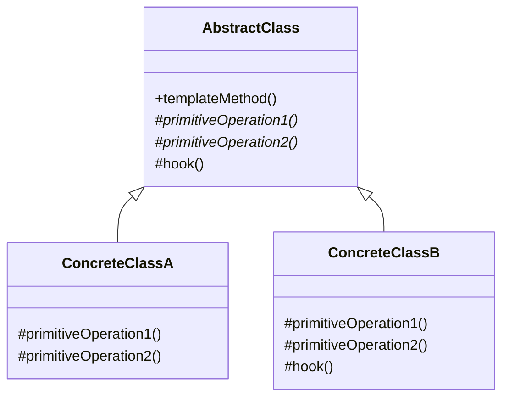
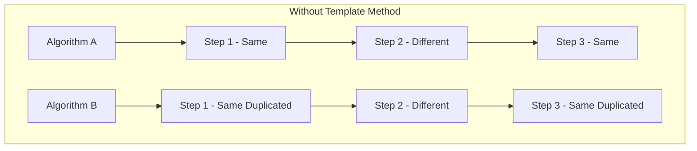
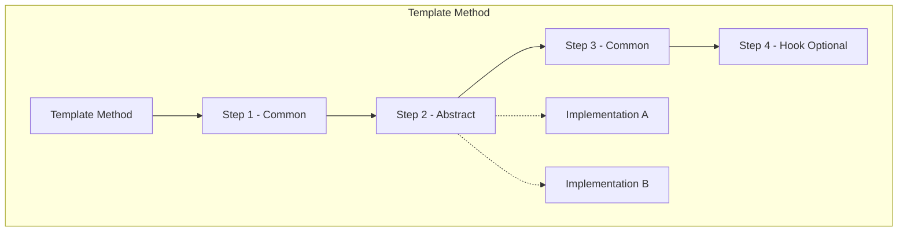

# Template Method Pattern

## Intent

**Template Method** is a behavioral design pattern that defines the skeleton of an algorithm in the base function, letting implementations override specific steps without changing the algorithm's structure. It uses the "Hollywood Principle": Don't call us, we'll call you.



---

## Problem It Solves

When algorithms share similar structure but differ in details:



This leads to code duplication and maintenance issues.

---

## Solution

Define the algorithm skeleton, making variable parts abstract:



---

## Implementation

<Tabs items={["Data Parser", "Build Pipeline", "Report Generator", "Real-World: HTTP Handler"]}>
  <Tab value="Data Parser">
```typescript
/**
 * Parsed record
 */
interface ParsedRecord {
  raw: string;
  data: Record<string, unknown>;
  valid: boolean;
  errors: string[];
}

/**
 * Parse result
 */
interface ParseResult {
  records: ParsedRecord[];
  totalCount: number;
  validCount: number;
  errorCount: number;
  duration: number;
}

/**
 * Data parser operations (hooks)
 */
interface DataParserOperations {
  /** Parse a single line into raw fields */
  parseLine: (line: string) => string[];
  /** Transform raw fields into a record */
  transformFields: (fields: string[]) => Record<string, unknown>;
  /** Validate a record */
  validateRecord: (record: Record<string, unknown>) => { valid: boolean; errors: string[] };
  /** Optional: Called before parsing starts */
  beforeParse?: (content: string) => void;
  /** Optional: Called after parsing completes */
  afterParse?: (result: ParseResult) => void;
}

/**
 * Create a data parser with template method
 * @description The template method defines the parsing algorithm skeleton
 */
const createDataParser = (operations: DataParserOperations) => {
  /**
   * Template method - defines the algorithm structure
   */
  const parse = (content: string): ParseResult => {
    const startTime = Date.now();
    
    // Hook: Before parsing
    operations.beforeParse?.(content);
    
    // Step 1: Split into lines (common)
    const lines = content.split("\n").filter(line => line.trim());
    
    // Step 2: Parse each line (delegated)
    const records: ParsedRecord[] = lines.map(line => {
      const fields = operations.parseLine(line);
      const data = operations.transformFields(fields);
      const validation = operations.validateRecord(data);
      
      return {
        raw: line,
        data,
        valid: validation.valid,
        errors: validation.errors,
      };
    });
    
    // Step 3: Compile results (common)
    const result: ParseResult = {
      records,
      totalCount: records.length,
      validCount: records.filter(r => r.valid).length,
      errorCount: records.filter(r => !r.valid).length,
      duration: Date.now() - startTime,
    };
    
    // Hook: After parsing
    operations.afterParse?.(result);
    
    return result;
  };

  return { parse };
};

/**
 * CSV Parser implementation
 */
const createCSVParser = (headers: string[]) => {
  return createDataParser({
    parseLine(line) {
      // Handle quoted fields
      const fields: string[] = [];
      let current = "";
      let inQuotes = false;
      
      for (const char of line) {
        if (char === '"') {
          inQuotes = !inQuotes;
        } else if (char === "," && !inQuotes) {
          fields.push(current.trim());
          current = "";
        } else {
          current += char;
        }
      }
      fields.push(current.trim());
      
      return fields;
    },
    
    transformFields(fields) {
      const record: Record<string, unknown> = {};
      headers.forEach((header, i) => {
        record[header] = fields[i] ?? null;
      });
      return record;
    },
    
    validateRecord(record) {
      const errors: string[] = [];
      
      for (const [key, value] of Object.entries(record)) {
        if (value === null || value === "") {
          errors.push(`Missing value for ${key}`);
        }
      }
      
      return { valid: errors.length === 0, errors };
    },
    
    beforeParse(content) {
      console.log(`[CSV] Starting parse of ${content.length} bytes`);
    },
    
    afterParse(result) {
      console.log(`[CSV] Parsed ${result.totalCount} records in ${result.duration}ms`);
    },
  });
};

/**
 * JSON Lines Parser implementation
 */
const createJSONLinesParser = () => {
  return createDataParser({
    parseLine(line) {
      return [line]; // Keep as single string
    },
    
    transformFields(fields) {
      try {
        return JSON.parse(fields[0]);
      } catch {
        return { _parseError: true };
      }
    },
    
    validateRecord(record) {
      if ("_parseError" in record) {
        return { valid: false, errors: ["Invalid JSON"] };
      }
      return { valid: true, errors: [] };
    },
    
    beforeParse() {
      console.log("[JSONL] Starting parse");
    },
  });
};

/**
 * Tab-separated values parser
 */
const createTSVParser = (headers: string[]) => {
  return createDataParser({
    parseLine(line) {
      return line.split("\t");
    },
    
    transformFields(fields) {
      const record: Record<string, unknown> = {};
      headers.forEach((header, i) => {
        const value = fields[i]?.trim();
        // Try to parse numbers
        const num = Number(value);
        record[header] = isNaN(num) ? value : num;
      });
      return record;
    },
    
    validateRecord(record) {
      return { valid: true, errors: [] };
    },
  });
};

// Usage
console.log("\n--- Template Method: Data Parser ---\n");

// CSV parsing
const csvParser = createCSVParser(["name", "email", "age"]);
const csvData = `John Doe,john@example.com,30
Jane Smith,jane@example.com,25
Bob Wilson,,35`;

const csvResult = csvParser.parse(csvData);
console.log("CSV Results:", csvResult.records.map(r => r.data));
//                          ^?
console.log(`Valid: ${csvResult.validCount}/${csvResult.totalCount}\n`);

// JSON Lines parsing
const jsonlParser = createJSONLinesParser();
const jsonlData = `{"id": 1, "name": "Alice"}
{"id": 2, "name": "Bob"}
{invalid json}`;

const jsonlResult = jsonlParser.parse(jsonlData);
console.log("JSONL Results:", jsonlResult.records.map(r => ({ data: r.data, valid: r.valid })));
```
  </Tab>
  <Tab value="Build Pipeline">
```typescript
/**
 * Build context
 */
interface BuildContext {
  projectPath: string;
  outputPath: string;
  environment: "development" | "staging" | "production";
  version: string;
  startTime: Date;
  logs: string[];
}

/**
 * Build step result
 */
interface StepResult {
  success: boolean;
  duration: number;
  output?: string;
  error?: string;
}

/**
 * Build pipeline operations
 */
interface BuildOperations {
  /** Install dependencies */
  install: (context: BuildContext) => Promise<StepResult>;
  /** Lint source code */
  lint: (context: BuildContext) => Promise<StepResult>;
  /** Run tests */
  test: (context: BuildContext) => Promise<StepResult>;
  /** Build the project */
  build: (context: BuildContext) => Promise<StepResult>;
  /** Deploy the build */
  deploy: (context: BuildContext) => Promise<StepResult>;
  /** Optional: Pre-build hook */
  preBuild?: (context: BuildContext) => Promise<void>;
  /** Optional: Post-build hook */
  postBuild?: (context: BuildContext, success: boolean) => Promise<void>;
}

/**
 * Build result
 */
interface BuildResult {
  success: boolean;
  steps: { name: string; result: StepResult }[];
  totalDuration: number;
  logs: string[];
}

/**
 * Create a build pipeline with template method
 */
const createBuildPipeline = (operations: BuildOperations) => {
  const log = (context: BuildContext, message: string) => {
    const timestamp = new Date().toISOString();
    context.logs.push(`[${timestamp}] ${message}`);
    console.log(`[Build] ${message}`);
  };

  /**
   * Template method - defines the build process
   */
  const run = async (
    projectPath: string,
    environment: BuildContext["environment"],
    version: string
  ): Promise<BuildResult> => {
    const context: BuildContext = {
      projectPath,
      outputPath: `${projectPath}/dist`,
      environment,
      version,
      startTime: new Date(),
      logs: [],
    };

    const steps: { name: string; result: StepResult }[] = [];
    let success = true;

    log(context, `Starting build for ${environment} v${version}`);

    // Pre-build hook
    if (operations.preBuild) {
      await operations.preBuild(context);
    }

    // Step 1: Install
    log(context, "Installing dependencies...");
    const installResult = await operations.install(context);
    steps.push({ name: "install", result: installResult });
    if (!installResult.success) {
      success = false;
      log(context, `Install failed: ${installResult.error}`);
    }

    // Step 2: Lint (if install succeeded)
    if (success) {
      log(context, "Linting code...");
      const lintResult = await operations.lint(context);
      steps.push({ name: "lint", result: lintResult });
      if (!lintResult.success) {
        success = false;
        log(context, `Lint failed: ${lintResult.error}`);
      }
    }

    // Step 3: Test (if lint succeeded)
    if (success) {
      log(context, "Running tests...");
      const testResult = await operations.test(context);
      steps.push({ name: "test", result: testResult });
      if (!testResult.success) {
        success = false;
        log(context, `Tests failed: ${testResult.error}`);
      }
    }

    // Step 4: Build (if tests passed)
    if (success) {
      log(context, "Building project...");
      const buildResult = await operations.build(context);
      steps.push({ name: "build", result: buildResult });
      if (!buildResult.success) {
        success = false;
        log(context, `Build failed: ${buildResult.error}`);
      }
    }

    // Step 5: Deploy (only in production if build succeeded)
    if (success && environment === "production") {
      log(context, "Deploying...");
      const deployResult = await operations.deploy(context);
      steps.push({ name: "deploy", result: deployResult });
      if (!deployResult.success) {
        success = false;
        log(context, `Deploy failed: ${deployResult.error}`);
      }
    }

    // Post-build hook
    if (operations.postBuild) {
      await operations.postBuild(context, success);
    }

    const totalDuration = Date.now() - context.startTime.getTime();
    log(context, `Build ${success ? "succeeded" : "failed"} in ${totalDuration}ms`);

    return {
      success,
      steps,
      totalDuration,
      logs: context.logs,
    };
  };

  return { run };
};

/**
 * Node.js project pipeline
 */
const createNodePipeline = () => {
  const simulateStep = async (duration: number, failChance = 0): Promise<StepResult> => {
    await new Promise(r => setTimeout(r, duration));
    const success = Math.random() > failChance;
    return {
      success,
      duration,
      output: success ? "OK" : undefined,
      error: success ? undefined : "Random failure",
    };
  };

  return createBuildPipeline({
    install: () => simulateStep(200),
    lint: () => simulateStep(100),
    test: () => simulateStep(300),
    build: () => simulateStep(400),
    deploy: () => simulateStep(500),
    
    async preBuild(context) {
      console.log(`  Pre-build: Cleaning ${context.outputPath}`);
    },
    
    async postBuild(context, success) {
      if (success) {
        console.log(`  Post-build: Notifying team of successful build`);
      } else {
        console.log(`  Post-build: Sending failure alerts`);
      }
    },
  });
};

/**
 * Python project pipeline
 */
const createPythonPipeline = () => {
  const simulateStep = async (duration: number): Promise<StepResult> => {
    await new Promise(r => setTimeout(r, duration));
    return { success: true, duration, output: "OK" };
  };

  return createBuildPipeline({
    async install(context) {
      console.log("  Running: pip install -r requirements.txt");
      return simulateStep(250);
    },
    
    async lint(context) {
      console.log("  Running: pylint, black, mypy");
      return simulateStep(150);
    },
    
    async test(context) {
      console.log("  Running: pytest --cov");
      return simulateStep(350);
    },
    
    async build(context) {
      console.log("  Running: python setup.py bdist_wheel");
      return simulateStep(200);
    },
    
    async deploy(context) {
      console.log("  Running: twine upload dist/*");
      return simulateStep(300);
    },
  });
};

// Usage
console.log("\n--- Template Method: Build Pipeline ---\n");

const nodePipeline = createNodePipeline();
const result = await nodePipeline.run("/app/my-project", "production", "1.0.0");

console.log("\n--- Build Summary ---");
console.log(`Success: ${result.success}`);
console.log(`Duration: ${result.totalDuration}ms`);
console.log("Steps:");
for (const step of result.steps) {
  const status = step.result.success ? "✓" : "✗";
  console.log(`  ${status} ${step.name}: ${step.result.duration}ms`);
}
```
  </Tab>
  <Tab value="Report Generator">
```typescript
/**
 * Report section
 */
interface ReportSection {
  title: string;
  content: string;
  level: number;
}

/**
 * Report data
 */
interface ReportData {
  title: string;
  author: string;
  date: Date;
  sections: ReportSection[];
  metadata: Record<string, string>;
}

/**
 * Generated report
 */
interface GeneratedReport {
  content: string;
  format: string;
  size: number;
}

/**
 * Report generator operations
 */
interface ReportOperations {
  /** Generate document header */
  generateHeader: (data: ReportData) => string;
  /** Generate table of contents */
  generateTableOfContents: (sections: ReportSection[]) => string;
  /** Format a section */
  formatSection: (section: ReportSection) => string;
  /** Generate document footer */
  generateFooter: (data: ReportData) => string;
  /** Optional: Add styling */
  addStyling?: (content: string) => string;
}

/**
 * Create a report generator with template method
 */
const createReportGenerator = (
  format: string,
  operations: ReportOperations
) => {
  /**
   * Template method - defines report generation structure
   */
  const generate = (data: ReportData): GeneratedReport => {
    let content = "";
    
    // Step 1: Generate header
    content += operations.generateHeader(data);
    
    // Step 2: Generate table of contents
    content += operations.generateTableOfContents(data.sections);
    
    // Step 3: Generate each section
    for (const section of data.sections) {
      content += operations.formatSection(section);
    }
    
    // Step 4: Generate footer
    content += operations.generateFooter(data);
    
    // Step 5: Apply styling (optional)
    if (operations.addStyling) {
      content = operations.addStyling(content);
    }
    
    return {
      content,
      format,
      size: content.length,
    };
  };

  return { generate };
};

/**
 * Markdown report generator
 */
const createMarkdownGenerator = () => {
  return createReportGenerator("markdown", {
    generateHeader(data) {
      return `# ${data.title}\n\n` +
        `**Author:** ${data.author}\n` +
        `**Date:** ${data.date.toLocaleDateString()}\n\n` +
        `---\n\n`;
    },
    
    generateTableOfContents(sections) {
      let toc = "## Table of Contents\n\n";
      for (const section of sections) {
        const indent = "  ".repeat(section.level - 1);
        const anchor = section.title.toLowerCase().replace(/\s+/g, "-");
        toc += `${indent}- [${section.title}](#${anchor})\n`;
      }
      return toc + "\n---\n\n";
    },
    
    formatSection(section) {
      const hashes = "#".repeat(section.level + 1);
      return `${hashes} ${section.title}\n\n${section.content}\n\n`;
    },
    
    generateFooter(data) {
      return `---\n\n*Generated on ${new Date().toISOString()}*\n`;
    },
  });
};

/**
 * HTML report generator
 */
const createHTMLGenerator = () => {
  return createReportGenerator("html", {
    generateHeader(data) {
      return `<!DOCTYPE html>
<html>
<head>
  <title>${data.title}</title>
</head>
<body>
  <header>
    <h1>${data.title}</h1>
    <p>Author: ${data.author}</p>
    <p>Date: ${data.date.toLocaleDateString()}</p>
  </header>
  <hr>
`;
    },
    
    generateTableOfContents(sections) {
      let toc = "  <nav>\n    <h2>Table of Contents</h2>\n    <ul>\n";
      for (const section of sections) {
        const anchor = section.title.toLowerCase().replace(/\s+/g, "-");
        toc += `      <li><a href="#${anchor}">${section.title}</a></li>\n`;
      }
      return toc + "    </ul>\n  </nav>\n  <hr>\n";
    },
    
    formatSection(section) {
      const tag = `h${Math.min(section.level + 1, 6)}`;
      const anchor = section.title.toLowerCase().replace(/\s+/g, "-");
      return `  <section id="${anchor}">
    <${tag}>${section.title}</${tag}>
    <p>${section.content}</p>
  </section>
`;
    },
    
    generateFooter(data) {
      return `  <footer>
    <hr>
    <p><em>Generated on ${new Date().toISOString()}</em></p>
  </footer>
</body>
</html>`;
    },
    
    addStyling(content) {
      const style = `<style>
  body { font-family: Arial, sans-serif; max-width: 800px; margin: 0 auto; padding: 20px; }
  header, footer { text-align: center; }
  nav ul { list-style-type: none; }
  section { margin: 20px 0; }
</style>`;
      return content.replace("</head>", `${style}\n</head>`);
    },
  });
};

/**
 * Plain text report generator
 */
const createTextGenerator = () => {
  return createReportGenerator("text", {
    generateHeader(data) {
      const line = "=".repeat(60);
      return `${line}\n${data.title.toUpperCase()}\n${line}\n\n` +
        `Author: ${data.author}\nDate: ${data.date.toLocaleDateString()}\n\n`;
    },
    
    generateTableOfContents(sections) {
      let toc = "TABLE OF CONTENTS\n" + "-".repeat(40) + "\n";
      sections.forEach((section, i) => {
        const indent = "  ".repeat(section.level - 1);
        toc += `${indent}${i + 1}. ${section.title}\n`;
      });
      return toc + "\n";
    },
    
    formatSection(section) {
      const underline = "-".repeat(section.title.length);
      return `${section.title}\n${underline}\n${section.content}\n\n`;
    },
    
    generateFooter(data) {
      const line = "=".repeat(60);
      return `${line}\nGenerated on ${new Date().toISOString()}\n`;
    },
  });
};

// Usage
const reportData: ReportData = {
  title: "Q4 Performance Report",
  author: "Analytics Team",
  date: new Date(),
  sections: [
    { title: "Executive Summary", content: "Key highlights of Q4 performance...", level: 1 },
    { title: "Revenue Analysis", content: "Detailed revenue breakdown...", level: 1 },
    { title: "Regional Performance", content: "Performance by region...", level: 2 },
    { title: "Product Lines", content: "Revenue by product...", level: 2 },
    { title: "Recommendations", content: "Strategic recommendations...", level: 1 },
  ],
  metadata: { department: "Finance" },
};

console.log("\n--- Template Method: Report Generator ---\n");

// Generate in different formats
const mdGenerator = createMarkdownGenerator();
const htmlGenerator = createHTMLGenerator();
const textGenerator = createTextGenerator();

const mdReport = mdGenerator.generate(reportData);
console.log("Markdown Report Preview:");
console.log(mdReport.content.substring(0, 300) + "...");
console.log(`Size: ${mdReport.size} bytes\n`);

const htmlReport = htmlGenerator.generate(reportData);
console.log("HTML Report Preview:");
console.log(htmlReport.content.substring(0, 300) + "...");
console.log(`Size: ${htmlReport.size} bytes\n`);
```
  </Tab>
  <Tab value="Real-World: HTTP Handler">
```ts
/**
 * HTTP Request
 */
interface HTTPRequest {
  method: string;
  path: string;
  headers: Record<string, string>;
  body?: unknown;
  params: Record<string, string>;
  query: Record<string, string>;
}

/**
 * HTTP Response
 */
interface HTTPResponse {
  status: number;
  headers: Record<string, string>;
  body: unknown;
}

/**
 * Handler context
 */
interface HandlerContext {
  request: HTTPRequest;
  user?: { id: string; role: string };
  startTime: number;
  logs: string[];
}

/**
 * Handler operations
 */
interface HandlerOperations {
  /** Validate the request */
  validate: (ctx: HandlerContext) => { valid: boolean; error?: string };
  /** Authorize the request */
  authorize: (ctx: HandlerContext) => boolean;
  /** Process the request */
  process: (ctx: HandlerContext) => Promise<{ status: number; data: unknown }>;
  /** Optional: Before processing hook */
  beforeProcess?: (ctx: HandlerContext) => void;
  /** Optional: After processing hook */
  afterProcess?: (ctx: HandlerContext, response: HTTPResponse) => void;
}

/**
 * Create an HTTP handler with template method
 */
const createHTTPHandler = (
  operations: HandlerOperations
) => {
  /**
   * Template method - defines request handling flow
   */
  const handle = async (request: HTTPRequest): Promise<HTTPResponse> => {
    const ctx: HandlerContext = {
      request,
      startTime: Date.now(),
      logs: [],
    };

    // Step 1: Authenticate (common)
    const authHeader = request.headers["authorization"];
    if (authHeader?.startsWith("Bearer ")) {
      // Simulate token parsing
      const token = authHeader.slice(7);
      ctx.user = { id: "user_123", role: token === "admin" ? "admin" : "user" };
    }

    // Step 2: Validate (delegated)
    const validation = operations.validate(ctx);
    if (!validation.valid) {
      return {
        status: 400,
        headers: { "content-type": "application/json" },
        body: { error: validation.error },
      };
    }

    // Step 3: Authorize (delegated)
    if (!operations.authorize(ctx)) {
      return {
        status: 403,
        headers: { "content-type": "application/json" },
        body: { error: "Forbidden" },
      };
    }

    // Before processing hook
    operations.beforeProcess?.(ctx);

    // Step 4: Process (delegated)
    try {
      const result = await operations.process(ctx);
      
      const response: HTTPResponse = {
        status: result.status,
        headers: {
          "content-type": "application/json",
          "x-request-id": `req_${Date.now()}`,
          "x-response-time": `${Date.now() - ctx.startTime}ms`,
        },
        body: result.data,
      };

      // After processing hook
      operations.afterProcess?.(ctx, response);

      return response;
    } catch (error) {
      return {
        status: 500,
        headers: { "content-type": "application/json" },
        body: { error: "Internal Server Error" },
      };
    }
  };

  return { handle };
};

/**
 * Create user endpoint handler
 */
const createUserHandler = () => {
  const users = new Map([
    ["1", { id: "1", name: "Alice", email: "alice@example.com" }],
    ["2", { id: "2", name: "Bob", email: "bob@example.com" }],
  ]);

  return createHTTPHandler({
    validate(ctx) {
      const userId = ctx.request.params.id;
      if (!userId) {
        return { valid: false, error: "User ID required" };
      }
      if (!/^\d+$/.test(userId)) {
        return { valid: false, error: "Invalid user ID format" };
      }
      return { valid: true };
    },

    authorize(ctx) {
      // Anyone can read, only admins can write
      if (ctx.request.method === "GET") return true;
      return ctx.user?.role === "admin";
    },

    async process(ctx) {
      const userId = ctx.request.params.id;
      const user = users.get(userId);

      switch (ctx.request.method) {
        case "GET":
          if (!user) {
            return { status: 404, data: { error: "User not found" } };
          }
          return { status: 200, data: user };

        case "PUT":
          if (!user) {
            return { status: 404, data: { error: "User not found" } };
          }
          const updated = { ...user, ...(ctx.request.body as object) };
          users.set(userId, updated);
          return { status: 200, data: updated };

        case "DELETE":
          if (!user) {
            return { status: 404, data: { error: "User not found" } };
          }
          users.delete(userId);
          return { status: 204, data: null };

        default:
          return { status: 405, data: { error: "Method not allowed" } };
      }
    },

    beforeProcess(ctx) {
      console.log(`[${ctx.request.method}] ${ctx.request.path}`);
    },

    afterProcess(ctx, response) {
      console.log(`  → ${response.status} (${response.headers["x-response-time"]})`);
    },
  });
};

/**
 * Create admin endpoint handler (stricter)
 */
const createAdminHandler = () => {
  return createHTTPHandler({
    validate(ctx) {
      return { valid: true };
    },

    authorize(ctx) {
      // Admin only
      return ctx.user?.role === "admin";
    },

    async process(ctx) {
      return {
        status: 200,
        data: {
          uptime: process.uptime(),
          memory: process.memoryUsage(),
          timestamp: new Date().toISOString(),
        },
      };
    },

    beforeProcess(ctx) {
      console.log(`[ADMIN] ${ctx.user?.id} accessing admin endpoint`);
    },
  });
};

// Usage
console.log("\n--- Template Method: HTTP Handler ---\n");

const userHandler = createUserHandler();
const adminHandler = createAdminHandler();

// Test requests
const requests: HTTPRequest[] = [
  {
    method: "GET",
    path: "/users/1",
    headers: { "authorization": "Bearer user" },
    params: { id: "1" },
    query: {},
  },
  {
    method: "PUT",
    path: "/users/1",
    headers: { "authorization": "Bearer admin" },
    params: { id: "1" },
    query: {},
    body: { name: "Alice Updated" },
  },
  {
    method: "PUT",
    path: "/users/1",
    headers: { "authorization": "Bearer user" },
    params: { id: "1" },
    query: {},
    body: { name: "Unauthorized" },
  },
  {
    method: "GET",
    path: "/admin/status",
    headers: { "authorization": "Bearer admin" },
    params: {},
    query: {},
  },
];

for (const request of requests) {
  const handler = request.path.startsWith("/admin") ? adminHandler : userHandler;
  const response = await handler.handle(request);
  console.log("  Response:", JSON.stringify(response.body).substring(0, 60));
  console.log();
}
```
  </Tab>
</Tabs>

---

## When to Use

<Accordions>
  <Accordion title="✅ Use Template Method when...">
    - **Common algorithm structure**: Same steps, different implementations
    
    - **Control extension points**: Define where customization is allowed
    
    - **Reduce duplication**: Share common code among implementations
    
    - **Inversion of control**: Framework calls custom code
    
    - **Examples**: Parsers, build systems, report generators
  </Accordion>
  
  <Accordion title="❌ Avoid Template Method when...">
    - **Many variations**: Too many abstract methods
    
    - **Simple algorithms**: No common structure to share
    
    - **Frequent changes**: Algorithm structure changes often
  </Accordion>
</Accordions>

---

## Hooks vs Abstract Methods

| Aspect | Abstract Methods | Hooks |
|--------|-----------------|-------|
| **Required** | Must be implemented | Optional |
| **Default** | No default | Has default (often empty) |
| **Purpose** | Required variation | Optional extension |
| **Example** | `process(data)` | `beforeProcess()` |

---

## Summary

<Callout type="info">
  **Key Takeaway**: Template Method defines an algorithm's skeleton, letting subclasses redefine certain steps without changing the algorithm's structure. It's the foundation of many frameworks.
</Callout>

### Pros
- ✅ Eliminates code duplication
- ✅ Lets subclasses override specific steps
- ✅ Pull common behavior into one place
- ✅ Controlled extension points

### Cons
- ❌ Limited by skeleton structure
- ❌ Harder to compose than delegate
- ❌ May violate Liskov Substitution
- ❌ More abstract methods = harder to maintain
