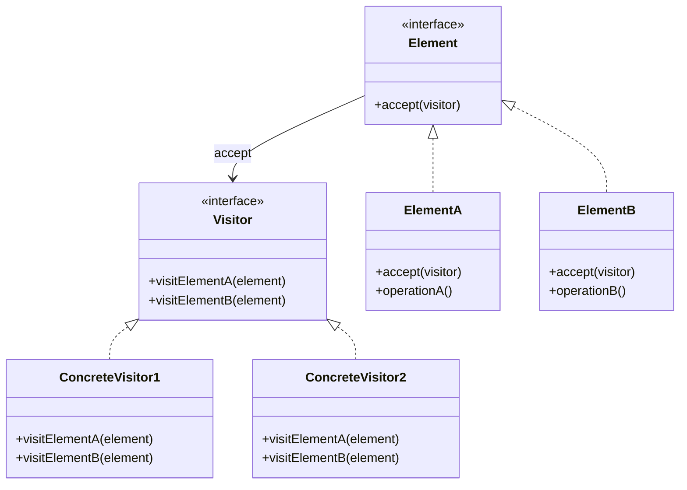
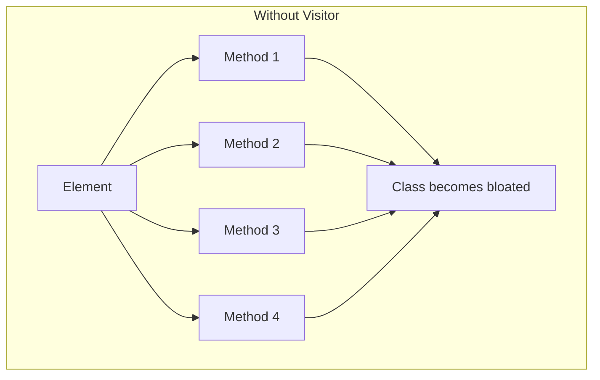
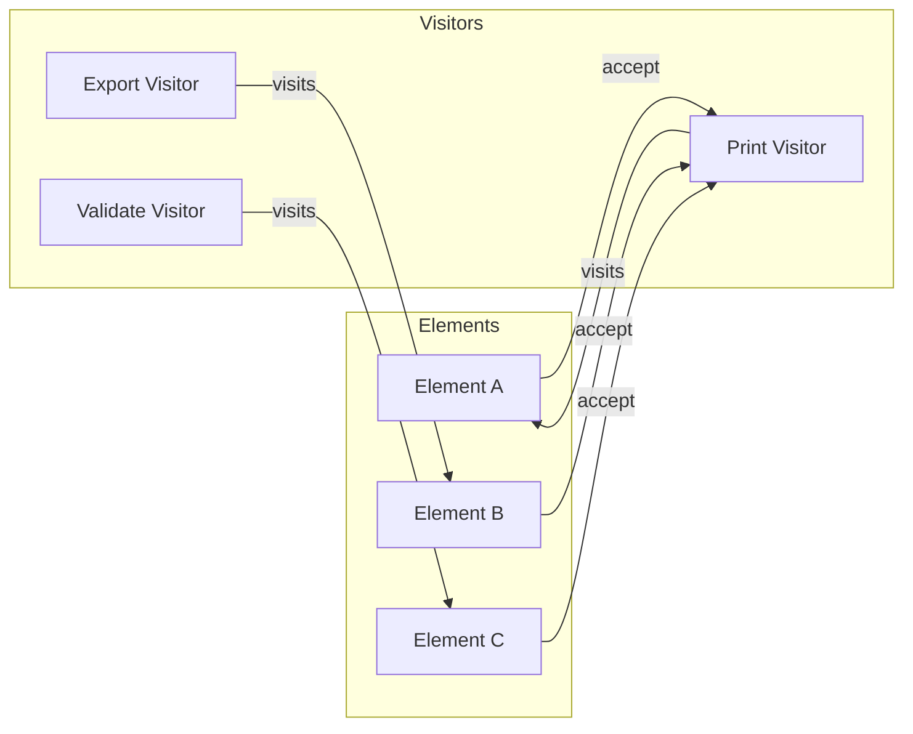
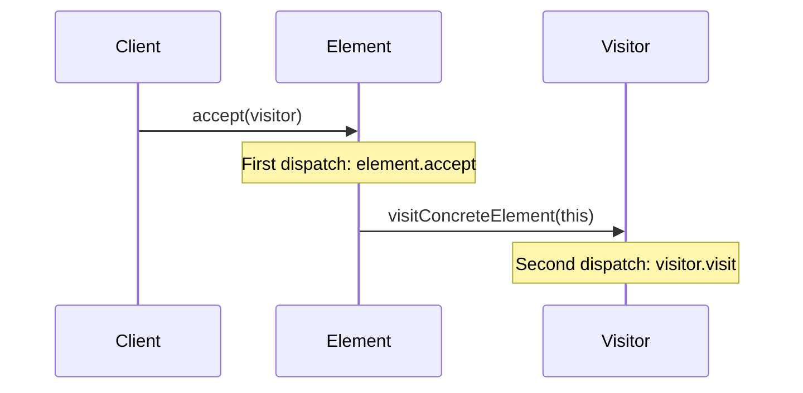

# Visitor Pattern

## Intent

**Visitor** is a behavioral design pattern that lets you separate algorithms from the objects on which they operate. It allows adding new operations to existing object structures without modifying them.



---

## Problem It Solves

When you need to perform multiple unrelated operations on objects:



Adding operations requires modifying all element classes.

---

## Solution

Move operations into visitor objects:



---

## Implementation

<Tabs items={["AST Visitor", "File System", "Shape Operations", "Real-World: Document Exporter"]}>
  <Tab value="AST Visitor">
```typescript
/**
 * AST Node types
 */
type ASTNode =
  | NumberNode
  | BinaryOpNode
  | UnaryOpNode
  | VariableNode
  | FunctionCallNode;

interface NumberNode {
  type: "number";
  value: number;
}

interface BinaryOpNode {
  type: "binaryOp";
  operator: "+" | "-" | "*" | "/" | "^";
  left: ASTNode;
  right: ASTNode;
}

interface UnaryOpNode {
  type: "unaryOp";
  operator: "-" | "!";
  operand: ASTNode;
}

interface VariableNode {
  type: "variable";
  name: string;
}

interface FunctionCallNode {
  type: "functionCall";
  name: string;
  args: ASTNode[];
}

/**
 * AST Visitor interface
 */
interface ASTVisitor<T> {
  visitNumber: (node: NumberNode) => T;
  visitBinaryOp: (node: BinaryOpNode) => T;
  visitUnaryOp: (node: UnaryOpNode) => T;
  visitVariable: (node: VariableNode) => T;
  visitFunctionCall: (node: FunctionCallNode) => T;
}

/**
 * Visit an AST node with a visitor
 */
const visit = <T>(node: ASTNode, visitor: ASTVisitor<T>): T => {
  switch (node.type) {
    case "number":
      return visitor.visitNumber(node);
    case "binaryOp":
      return visitor.visitBinaryOp(node);
    case "unaryOp":
      return visitor.visitUnaryOp(node);
    case "variable":
      return visitor.visitVariable(node);
    case "functionCall":
      return visitor.visitFunctionCall(node);
  }
};

/**
 * Evaluator visitor - computes the AST value
 */
const createEvaluator = (
  variables: Record<string, number>,
  functions: Record<string, (...args: number[]) => number>
): ASTVisitor<number> => ({
  visitNumber(node) {
    return node.value;
  },

  visitBinaryOp(node) {
    const left = visit(node.left, this);
    const right = visit(node.right, this);

    switch (node.operator) {
      case "+": return left + right;
      case "-": return left - right;
      case "*": return left * right;
      case "/": return left / right;
      case "^": return Math.pow(left, right);
    }
  },

  visitUnaryOp(node) {
    const operand = visit(node.operand, this);
    switch (node.operator) {
      case "-": return -operand;
      case "!": return operand === 0 ? 1 : 0;
    }
  },

  visitVariable(node) {
    if (!(node.name in variables)) {
      throw new Error(`Undefined variable: ${node.name}`);
    }
    return variables[node.name];
  },

  visitFunctionCall(node) {
    const fn = functions[node.name];
    if (!fn) {
      throw new Error(`Undefined function: ${node.name}`);
    }
    const args = node.args.map(arg => visit(arg, this));
    return fn(...args);
  },
});

/**
 * Printer visitor - converts AST to string
 */
const createPrinter = (): ASTVisitor<string> => ({
  visitNumber(node) {
    return node.value.toString();
  },

  visitBinaryOp(node) {
    const left = visit(node.left, this);
    const right = visit(node.right, this);
    return `(${left} ${node.operator} ${right})`;
  },

  visitUnaryOp(node) {
    const operand = visit(node.operand, this);
    return `${node.operator}${operand}`;
  },

  visitVariable(node) {
    return node.name;
  },

  visitFunctionCall(node) {
    const args = node.args.map(arg => visit(arg, this)).join(", ");
    return `${node.name}(${args})`;
  },
});

/**
 * Complexity analyzer visitor
 */
const createComplexityAnalyzer = (): ASTVisitor<{
  depth: number;
  operations: number;
  variables: Set<string>;
  functions: Set<string>;
}> => ({
  visitNumber(node) {
    return { depth: 1, operations: 0, variables: new Set(), functions: new Set() };
  },

  visitBinaryOp(node) {
    const left = visit(node.left, this);
    const right = visit(node.right, this);
    return {
      depth: Math.max(left.depth, right.depth) + 1,
      operations: left.operations + right.operations + 1,
      variables: new Set([...left.variables, ...right.variables]),
      functions: new Set([...left.functions, ...right.functions]),
    };
  },

  visitUnaryOp(node) {
    const operand = visit(node.operand, this);
    return {
      depth: operand.depth + 1,
      operations: operand.operations + 1,
      variables: operand.variables,
      functions: operand.functions,
    };
  },

  visitVariable(node) {
    return {
      depth: 1,
      operations: 0,
      variables: new Set([node.name]),
      functions: new Set(),
    };
  },

  visitFunctionCall(node) {
    const argResults = node.args.map(arg => visit(arg, this));
    const maxDepth = Math.max(1, ...argResults.map(r => r.depth));
    const totalOps = argResults.reduce((sum, r) => sum + r.operations, 0) + 1;
    const allVars = new Set(argResults.flatMap(r => [...r.variables]));
    const allFuncs = new Set([node.name, ...argResults.flatMap(r => [...r.functions])]);
    
    return {
      depth: maxDepth + 1,
      operations: totalOps,
      variables: allVars,
      functions: allFuncs,
    };
  },
});

// Build an AST: sqrt(x^2 + y^2) - representing distance
const ast: ASTNode = {
  type: "functionCall",
  name: "sqrt",
  args: [{
    type: "binaryOp",
    operator: "+",
    left: {
      type: "binaryOp",
      operator: "^",
      left: { type: "variable", name: "x" },
      right: { type: "number", value: 2 },
    },
    right: {
      type: "binaryOp",
      operator: "^",
      left: { type: "variable", name: "y" },
      right: { type: "number", value: 2 },
    },
  }],
};

console.log("\n--- AST Visitor Demo ---\n");

// Print the expression
const printer = createPrinter();
const expression = visit(ast, printer);
console.log("Expression:", expression);
//                         ^?

// Evaluate
const evaluator = createEvaluator(
  { x: 3, y: 4 },
  { sqrt: Math.sqrt, abs: Math.abs }
);
const result = visit(ast, evaluator);
console.log(`Result (x=3, y=4): ${result}`);

// Analyze complexity
const analyzer = createComplexityAnalyzer();
const complexity = visit(ast, analyzer);
console.log("Complexity:", {
  depth: complexity.depth,
  operations: complexity.operations,
  variables: [...complexity.variables],
  functions: [...complexity.functions],
});
```
  </Tab>
  <Tab value="File System">
```typescript
/**
 * File system node types
 */
type FSNode = FileNode | DirectoryNode | SymlinkNode;

interface FileNode {
  type: "file";
  name: string;
  size: number;
  extension: string;
  content: string;
}

interface DirectoryNode {
  type: "directory";
  name: string;
  children: FSNode[];
}

interface SymlinkNode {
  type: "symlink";
  name: string;
  target: string;
}

/**
 * File system visitor interface
 */
interface FSVisitor<T> {
  visitFile: (node: FileNode, path: string) => T;
  visitDirectory: (node: DirectoryNode, path: string) => T;
  visitSymlink: (node: SymlinkNode, path: string) => T;
}

/**
 * Visit a file system node
 */
const visitFS = <T>(node: FSNode, visitor: FSVisitor<T>, path = ""): T => {
  const currentPath = path ? `${path}/${node.name}` : node.name;
  
  switch (node.type) {
    case "file":
      return visitor.visitFile(node, currentPath);
    case "directory":
      return visitor.visitDirectory(node, currentPath);
    case "symlink":
      return visitor.visitSymlink(node, currentPath);
  }
};

/**
 * Size calculator visitor
 */
const createSizeCalculator = (): FSVisitor<number> => ({
  visitFile(node, path) {
    return node.size;
  },

  visitDirectory(node, path) {
    let total = 0;
    for (const child of node.children) {
      total += visitFS(child, this, path);
    }
    return total;
  },

  visitSymlink(node, path) {
    return 0; // Symlinks don't count
  },
});

/**
 * Tree printer visitor
 */
const createTreePrinter = (): FSVisitor<string> => {
  const getIndent = (path: string): string => {
    const depth = path.split("/").length - 1;
    return "  ".repeat(depth);
  };

  return {
    visitFile(node, path) {
      return `${getIndent(path)}📄 ${node.name} (${node.size} bytes)`;
    },

    visitDirectory(node, path) {
      const lines = [`${getIndent(path)}📁 ${node.name}/`];
      for (const child of node.children) {
        lines.push(visitFS(child, this, path));
      }
      return lines.join("\n");
    },

    visitSymlink(node, path) {
      return `${getIndent(path)}🔗 ${node.name} → ${node.target}`;
    },
  };
};

/**
 * File finder visitor
 */
const createFileFinder = (
  predicate: (file: FileNode, path: string) => boolean
): FSVisitor<{ file: FileNode; path: string }[]> => ({
  visitFile(node, path) {
    return predicate(node, path) ? [{ file: node, path }] : [];
  },

  visitDirectory(node, path) {
    const results: { file: FileNode; path: string }[] = [];
    for (const child of node.children) {
      results.push(...visitFS(child, this, path));
    }
    return results;
  },

  visitSymlink(node, path) {
    return [];
  },
});

/**
 * Statistics collector visitor
 */
const createStatsCollector = (): FSVisitor<{
  fileCount: number;
  dirCount: number;
  symlinkCount: number;
  totalSize: number;
  byExtension: Record<string, { count: number; size: number }>;
}> => ({
  visitFile(node, path) {
    return {
      fileCount: 1,
      dirCount: 0,
      symlinkCount: 0,
      totalSize: node.size,
      byExtension: {
        [node.extension]: { count: 1, size: node.size },
      },
    };
  },

  visitDirectory(node, path) {
    const initial = {
      fileCount: 0,
      dirCount: 1,
      symlinkCount: 0,
      totalSize: 0,
      byExtension: {} as Record<string, { count: number; size: number }>,
    };

    for (const child of node.children) {
      const childStats = visitFS(child, this, path);
      initial.fileCount += childStats.fileCount;
      initial.dirCount += childStats.dirCount;
      initial.symlinkCount += childStats.symlinkCount;
      initial.totalSize += childStats.totalSize;
      
      for (const [ext, data] of Object.entries(childStats.byExtension)) {
        if (!initial.byExtension[ext]) {
          initial.byExtension[ext] = { count: 0, size: 0 };
        }
        initial.byExtension[ext].count += data.count;
        initial.byExtension[ext].size += data.size;
      }
    }

    return initial;
  },

  visitSymlink(node, path) {
    return {
      fileCount: 0,
      dirCount: 0,
      symlinkCount: 1,
      totalSize: 0,
      byExtension: {},
    };
  },
});

// Sample file system
const fs: DirectoryNode = {
  type: "directory",
  name: "project",
  children: [
    {
      type: "directory",
      name: "src",
      children: [
        { type: "file", name: "index.ts", size: 1200, extension: "ts", content: "" },
        { type: "file", name: "app.ts", size: 2500, extension: "ts", content: "" },
        { type: "file", name: "utils.ts", size: 800, extension: "ts", content: "" },
      ],
    },
    {
      type: "directory",
      name: "tests",
      children: [
        { type: "file", name: "app.test.ts", size: 1500, extension: "ts", content: "" },
      ],
    },
    { type: "file", name: "package.json", size: 500, extension: "json", content: "" },
    { type: "file", name: "README.md", size: 2000, extension: "md", content: "" },
    { type: "symlink", name: "node_modules", target: "../shared/node_modules" },
  ],
};

console.log("\n--- File System Visitor Demo ---\n");

// Print tree
const treePrinter = createTreePrinter();
console.log("File Tree:");
console.log(visitFS(fs, treePrinter));

// Calculate total size
const sizeCalc = createSizeCalculator();
console.log(`\nTotal Size: ${visitFS(fs, sizeCalc)} bytes`);

// Find TypeScript files
const tsFinder = createFileFinder(file => file.extension === "ts");
const tsFiles = visitFS(fs, tsFinder);
console.log("\nTypeScript files:");
for (const { file, path } of tsFiles) {
  console.log(`  ${path} (${file.size} bytes)`);
}

// Collect statistics
const statsCollector = createStatsCollector();
const stats = visitFS(fs, statsCollector);
console.log("\nFile System Statistics:");
console.log(`  Files: ${stats.fileCount}`);
console.log(`  Directories: ${stats.dirCount}`);
console.log(`  Symlinks: ${stats.symlinkCount}`);
console.log(`  Total Size: ${stats.totalSize} bytes`);
console.log("  By Extension:", stats.byExtension);
```
  </Tab>
  <Tab value="Shape Operations">
```typescript
/**
 * Shape types
 */
type Shape = Circle | Rectangle | Triangle | Polygon;

interface Circle {
  type: "circle";
  radius: number;
  x: number;
  y: number;
}

interface Rectangle {
  type: "rectangle";
  width: number;
  height: number;
  x: number;
  y: number;
}

interface Triangle {
  type: "triangle";
  points: [{ x: number; y: number }, { x: number; y: number }, { x: number; y: number }];
}

interface Polygon {
  type: "polygon";
  points: { x: number; y: number }[];
}

/**
 * Shape visitor interface
 */
interface ShapeVisitor<T> {
  visitCircle: (shape: Circle) => T;
  visitRectangle: (shape: Rectangle) => T;
  visitTriangle: (shape: Triangle) => T;
  visitPolygon: (shape: Polygon) => T;
}

/**
 * Visit a shape
 */
const visitShape = <T>(shape: Shape, visitor: ShapeVisitor<T>): T => {
  switch (shape.type) {
    case "circle":
      return visitor.visitCircle(shape);
    case "rectangle":
      return visitor.visitRectangle(shape);
    case "triangle":
      return visitor.visitTriangle(shape);
    case "polygon":
      return visitor.visitPolygon(shape);
  }
};

/**
 * Area calculator visitor
 */
const createAreaCalculator = (): ShapeVisitor<number> => ({
  visitCircle(shape) {
    return Math.PI * shape.radius * shape.radius;
  },

  visitRectangle(shape) {
    return shape.width * shape.height;
  },

  visitTriangle(shape) {
    const [a, b, c] = shape.points;
    // Shoelace formula
    return Math.abs(
      (a.x * (b.y - c.y) + b.x * (c.y - a.y) + c.x * (a.y - b.y)) / 2
    );
  },

  visitPolygon(shape) {
    // Shoelace formula for any polygon
    let area = 0;
    const n = shape.points.length;
    for (let i = 0; i < n; i++) {
      const j = (i + 1) % n;
      area += shape.points[i].x * shape.points[j].y;
      area -= shape.points[j].x * shape.points[i].y;
    }
    return Math.abs(area / 2);
  },
});

/**
 * Perimeter calculator visitor
 */
const createPerimeterCalculator = (): ShapeVisitor<number> => {
  const distance = (p1: { x: number; y: number }, p2: { x: number; y: number }) =>
    Math.sqrt((p2.x - p1.x) ** 2 + (p2.y - p1.y) ** 2);

  return {
    visitCircle(shape) {
      return 2 * Math.PI * shape.radius;
    },

    visitRectangle(shape) {
      return 2 * (shape.width + shape.height);
    },

    visitTriangle(shape) {
      const [a, b, c] = shape.points;
      return distance(a, b) + distance(b, c) + distance(c, a);
    },

    visitPolygon(shape) {
      let perimeter = 0;
      const n = shape.points.length;
      for (let i = 0; i < n; i++) {
        perimeter += distance(shape.points[i], shape.points[(i + 1) % n]);
      }
      return perimeter;
    },
  };
};

/**
 * SVG renderer visitor
 */
const createSVGRenderer = (): ShapeVisitor<string> => ({
  visitCircle(shape) {
    return `<circle cx="${shape.x}" cy="${shape.y}" r="${shape.radius}" fill="blue" />`;
  },

  visitRectangle(shape) {
    return `<rect x="${shape.x}" y="${shape.y}" width="${shape.width}" height="${shape.height}" fill="green" />`;
  },

  visitTriangle(shape) {
    const points = shape.points.map(p => `${p.x},${p.y}`).join(" ");
    return `<polygon points="${points}" fill="red" />`;
  },

  visitPolygon(shape) {
    const points = shape.points.map(p => `${p.x},${p.y}`).join(" ");
    return `<polygon points="${points}" fill="purple" />`;
  },
});

/**
 * Bounding box calculator visitor
 */
const createBoundingBoxCalculator = (): ShapeVisitor<{
  minX: number;
  minY: number;
  maxX: number;
  maxY: number;
}> => ({
  visitCircle(shape) {
    return {
      minX: shape.x - shape.radius,
      minY: shape.y - shape.radius,
      maxX: shape.x + shape.radius,
      maxY: shape.y + shape.radius,
    };
  },

  visitRectangle(shape) {
    return {
      minX: shape.x,
      minY: shape.y,
      maxX: shape.x + shape.width,
      maxY: shape.y + shape.height,
    };
  },

  visitTriangle(shape) {
    const xs = shape.points.map(p => p.x);
    const ys = shape.points.map(p => p.y);
    return {
      minX: Math.min(...xs),
      minY: Math.min(...ys),
      maxX: Math.max(...xs),
      maxY: Math.max(...ys),
    };
  },

  visitPolygon(shape) {
    const xs = shape.points.map(p => p.x);
    const ys = shape.points.map(p => p.y);
    return {
      minX: Math.min(...xs),
      minY: Math.min(...ys),
      maxX: Math.max(...xs),
      maxY: Math.max(...ys),
    };
  },
});

// Sample shapes
const shapes: Shape[] = [
  { type: "circle", radius: 10, x: 50, y: 50 },
  { type: "rectangle", width: 20, height: 30, x: 100, y: 100 },
  {
    type: "triangle",
    points: [{ x: 0, y: 0 }, { x: 10, y: 0 }, { x: 5, y: 10 }],
  },
  {
    type: "polygon",
    points: [
      { x: 0, y: 0 },
      { x: 20, y: 0 },
      { x: 20, y: 20 },
      { x: 10, y: 30 },
      { x: 0, y: 20 },
    ],
  },
];

console.log("\n--- Shape Visitor Demo ---\n");

const areaCalc = createAreaCalculator();
const perimCalc = createPerimeterCalculator();
const svgRenderer = createSVGRenderer();
const bboxCalc = createBoundingBoxCalculator();

for (const shape of shapes) {
  console.log(`${shape.type.toUpperCase()}:`);
  console.log(`  Area: ${visitShape(shape, areaCalc).toFixed(2)}`);
  console.log(`  Perimeter: ${visitShape(shape, perimCalc).toFixed(2)}`);
  console.log(`  Bounding Box:`, visitShape(shape, bboxCalc));
  console.log(`  SVG: ${visitShape(shape, svgRenderer)}`);
  console.log();
}
```
  </Tab>
  <Tab value="Real-World: Document Exporter">
```ts
/**
 * Document element types
 */
type DocElement =
  | HeadingElement
  | ParagraphElement
  | ListElement
  | ImageElement
  | CodeBlockElement
  | TableElement;

interface HeadingElement {
  type: "heading";
  level: 1 | 2 | 3 | 4 | 5 | 6;
  text: string;
}

interface ParagraphElement {
  type: "paragraph";
  text: string;
  bold?: boolean;
  italic?: boolean;
}

interface ListElement {
  type: "list";
  ordered: boolean;
  items: string[];
}

interface ImageElement {
  type: "image";
  src: string;
  alt: string;
  width?: number;
  height?: number;
}

interface CodeBlockElement {
  type: "codeBlock";
  language: string;
  code: string;
}

interface TableElement {
  type: "table";
  headers: string[];
  rows: string[][];
}

/**
 * Document structure
 */
interface Document {
  title: string;
  author: string;
  elements: DocElement[];
}

/**
 * Document visitor interface
 */
interface DocVisitor<T> {
  visitHeading: (el: HeadingElement) => T;
  visitParagraph: (el: ParagraphElement) => T;
  visitList: (el: ListElement) => T;
  visitImage: (el: ImageElement) => T;
  visitCodeBlock: (el: CodeBlockElement) => T;
  visitTable: (el: TableElement) => T;
}

/**
 * Visit a document element
 */
const visitElement = <T>(element: DocElement, visitor: DocVisitor<T>): T => {
  switch (element.type) {
    case "heading":
      return visitor.visitHeading(element);
    case "paragraph":
      return visitor.visitParagraph(element);
    case "list":
      return visitor.visitList(element);
    case "image":
      return visitor.visitImage(element);
    case "codeBlock":
      return visitor.visitCodeBlock(element);
    case "table":
      return visitor.visitTable(element);
  }
};

/**
 * Export document with visitor
 */
const exportDocument = <T>(
  doc: Document,
  visitor: DocVisitor<T>,
  header: (title: string, author: string) => T,
  join: (parts: T[]) => T
): T => {
  const parts: T[] = [header(doc.title, doc.author)];
  
  for (const element of doc.elements) {
    parts.push(visitElement(element, visitor));
  }
  
  return join(parts);
};

/**
 * Markdown exporter
 */
const createMarkdownExporter = (): {
  visitor: DocVisitor<string>;
  header: (title: string, author: string) => string;
  join: (parts: string[]) => string;
} => ({
  visitor: {
    visitHeading(el) {
      return "#".repeat(el.level) + " " + el.text + "\n";
    },
    
    visitParagraph(el) {
      let text = el.text;
      if (el.bold) text = `**${text}**`;
      if (el.italic) text = `*${text}*`;
      return text + "\n\n";
    },
    
    visitList(el) {
      return el.items
        .map((item, i) => (el.ordered ? `${i + 1}. ${item}` : `- ${item}`))
        .join("\n") + "\n\n";
    },
    
    visitImage(el) {
      return `\n\n`;
    },
    
    visitCodeBlock(el) {
      return "```" + el.language + "\n" + el.code + "\n```\n\n";
    },
    
    visitTable(el) {
      const header = "| " + el.headers.join(" | ") + " |";
      const separator = "| " + el.headers.map(() => "---").join(" | ") + " |";
      const rows = el.rows.map(row => "| " + row.join(" | ") + " |");
      return [header, separator, ...rows].join("\n") + "\n\n";
    },
  },
  
  header: (title, author) => `# ${title}\n\n*By ${author}*\n\n---\n\n`,
  join: (parts) => parts.join(""),
});

/**
 * HTML exporter
 */
const createHTMLExporter = (): {
  visitor: DocVisitor<string>;
  header: (title: string, author: string) => string;
  join: (parts: string[]) => string;
} => ({
  visitor: {
    visitHeading(el) {
      return `<h${el.level}>${el.text}</h${el.level}>`;
    },
    
    visitParagraph(el) {
      let text = el.text;
      if (el.bold) text = `<strong>${text}</strong>`;
      if (el.italic) text = `<em>${text}</em>`;
      return `<p>${text}</p>`;
    },
    
    visitList(el) {
      const tag = el.ordered ? "ol" : "ul";
      const items = el.items.map(item => `  <li>${item}</li>`).join("\n");
      return `<${tag}>\n${items}\n</${tag}>`;
    },
    
    visitImage(el) {
      const size = el.width && el.height 
        ? ` width="${el.width}" height="${el.height}"` 
        : "";
      return ``;
    },
    
    visitCodeBlock(el) {
      return `<pre><code class="language-${el.language}">${el.code}</code></pre>`;
    },
    
    visitTable(el) {
      const headers = el.headers.map(h => `    <th>${h}</th>`).join("\n");
      const rows = el.rows
        .map(row => 
          "  <tr>\n" + row.map(cell => `    <td>${cell}</td>`).join("\n") + "\n  </tr>"
        )
        .join("\n");
      return `<table>\n  <tr>\n${headers}\n  </tr>\n${rows}\n</table>`;
    },
  },
  
  header: (title, author) => 
    `<!DOCTYPE html>\n<html>\n<head>\n  <title>${title}</title>\n</head>\n<body>\n` +
    `<h1>${title}</h1>\n<p class="author">By ${author}</p>\n<hr>\n`,
  
  join: (parts) => parts.join("\n") + "\n</body>\n</html>",
});

/**
 * Word count visitor
 */
const createWordCounter = (): DocVisitor<number> => ({
  visitHeading: (el) => el.text.split(/\s+/).length,
  visitParagraph: (el) => el.text.split(/\s+/).length,
  visitList: (el) => el.items.reduce((sum, item) => sum + item.split(/\s+/).length, 0),
  visitImage: () => 0,
  visitCodeBlock: (el) => el.code.split(/\s+/).length,
  visitTable: (el) => 
    el.headers.reduce((sum, h) => sum + h.split(/\s+/).length, 0) +
    el.rows.flat().reduce((sum, cell) => sum + cell.split(/\s+/).length, 0),
});

// Sample document
const doc: Document = {
  title: "Design Patterns in TypeScript",
  author: "Developer",
  elements: [
    { type: "heading", level: 2, text: "Introduction" },
    { 
      type: "paragraph", 
      text: "Design patterns are reusable solutions to common problems." 
    },
    {
      type: "list",
      ordered: false,
      items: ["Creational patterns", "Structural patterns", "Behavioral patterns"],
    },
    { type: "heading", level: 2, text: "Example Code" },
    {
      type: "codeBlock",
      language: "typescript",
      code: "const visitor = createVisitor();\nvisitElement(element, visitor);",
    },
    {
      type: "table",
      headers: ["Pattern", "Category", "Purpose"],
      rows: [
        ["Visitor", "Behavioral", "Separate algorithms from objects"],
        ["Factory", "Creational", "Object creation"],
      ],
    },
  ],
};

console.log("\n--- Document Exporter Demo ---\n");

// Export as Markdown
const mdExporter = createMarkdownExporter();
const markdown = exportDocument(
  doc,
  mdExporter.visitor,
  mdExporter.header,
  mdExporter.join
);
console.log("=== Markdown ===");
console.log(markdown);

// Export as HTML
const htmlExporter = createHTMLExporter();
const html = exportDocument(
  doc,
  htmlExporter.visitor,
  htmlExporter.header,
  htmlExporter.join
);
console.log("=== HTML (preview) ===");
console.log(html.substring(0, 400) + "...");

// Count words
const wordCounter = createWordCounter();
let totalWords = 0;
for (const element of doc.elements) {
  totalWords += visitElement(element, wordCounter);
}
console.log(`\n=== Statistics ===`);
console.log(`Word count: ${totalWords}`);
console.log(`Elements: ${doc.elements.length}`);
```
  </Tab>
</Tabs>

---

## When to Use

<Accordions>
  <Accordion title="✅ Use Visitor when...">
    - **Many unrelated operations**: Need multiple operations on object structure
    
    - **Structure is stable**: Object types rarely change
    
    - **Operations change often**: Need to add operations frequently
    
    - **Collecting information**: Need to traverse and gather data
    
    - **Examples**: AST processing, file traversal, rendering
  </Accordion>
  
  <Accordion title="❌ Avoid Visitor when...">
    - **Structure changes often**: Adding types requires updating all visitors
    
    - **Few operations**: Simpler to add methods directly
    
    - **Private data needed**: Visitor requires public access
  </Accordion>
</Accordions>

---

## Double Dispatch

Visitor relies on "double dispatch" - the operation depends on:
1. The type of visitor (which operation)
2. The type of element (which element)



---

## Summary

<Callout type="info">
  **Key Takeaway**: Visitor separates algorithms from the objects they operate on, making it easy to add new operations without modifying the object structure. It's essential for AST processing, compilers, and complex document processing.
</Callout>

### Pros
- ✅ Open/Closed for operations: Add new operations easily
- ✅ Single Responsibility: Related operations grouped in visitor
- ✅ Accumulate state while traversing
- ✅ Works on different object types

### Cons
- ❌ Adding new element types is hard
- ❌ May break encapsulation
- ❌ Requires visitable interface on all elements
- ❌ Complex double-dispatch mechanism
