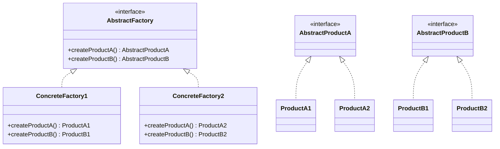
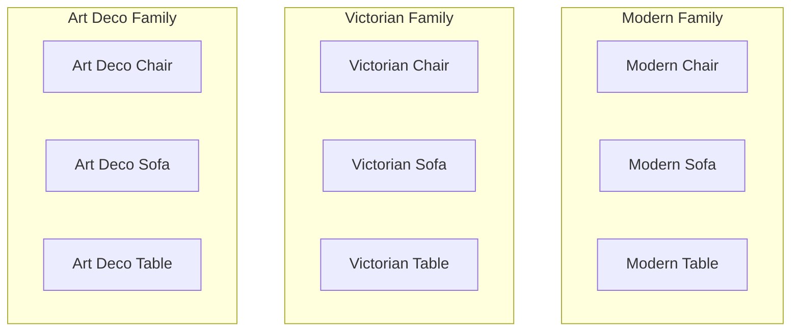
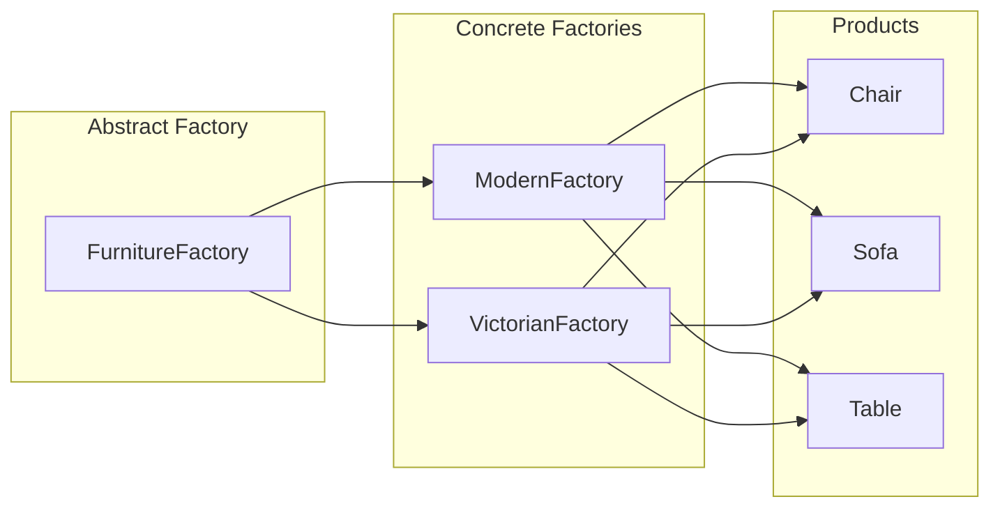
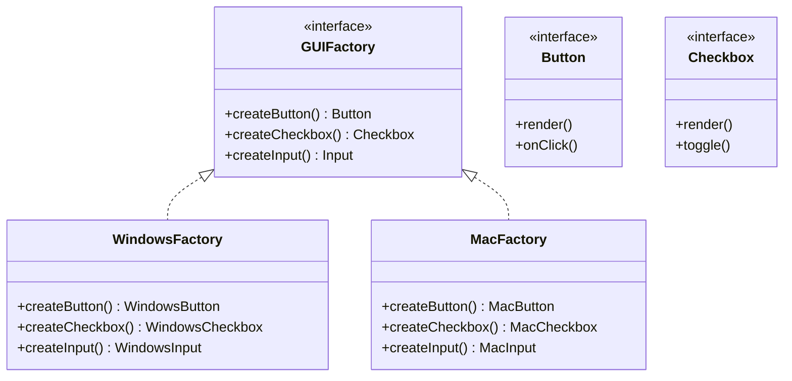
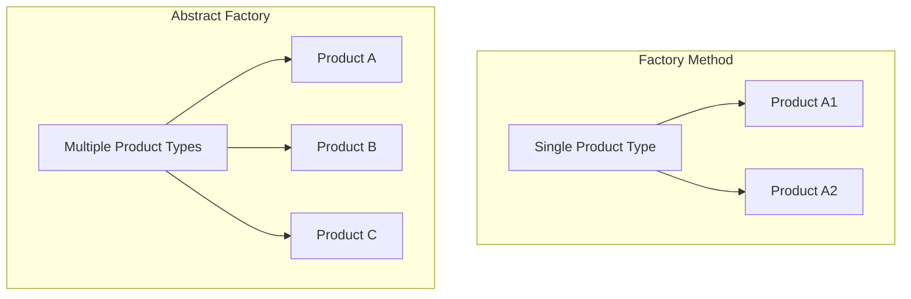

# Abstract Factory Pattern

## Intent

**Abstract Factory** is a creational design pattern that lets you produce families of related objects without specifying their concrete classes.



---

## Problem It Solves

Imagine you're building a furniture shop simulator. Your code consists of classes representing:

1. A family of related products: `Chair`, `Sofa`, `CoffeeTable`
2. Several variants of this family: `Modern`, `Victorian`, `ArtDeco`

You need a way to create individual furniture objects so they match other objects of the same family:



Customers get frustrated when they receive non-matching furniture. You need to ensure products from the same family work together.

---

## Solution

The Abstract Factory pattern suggests declaring interfaces for each distinct product of the product family. Then, make all variants follow those interfaces:



---

## Structure



---

## Implementation

<Tabs items={["UI Component Factory", "Payment Provider Factory", "Database Adapter Factory"]}>
  <Tab value="UI Component Factory">
```ts
// Abstract Products
interface Button {
  render: () => string;
  onClick: (handler: () => void) => void;
}

interface Input {
  render: () => string;
  getValue: () => string;
  setValue: (value: string) => void;
}

interface Modal {
  render: () => string;
  open: () => void;
  close: () => void;
  isOpen: () => boolean;
}

// Abstract Factory
interface UIFactory {
  createButton: (label: string) => Button;
  createInput: (placeholder: string) => Input;
  createModal: (title: string) => Modal;
}

// Light Theme Factory
const createLightThemeFactory = (): UIFactory => ({
  createButton: (label: string): Button => {
    let handler: (() => void) | null = null;
    return {
      render: () => 
        `<button class="bg-white text-gray-900 border border-gray-300 hover:bg-gray-50 px-4 py-2 rounded">${label}</button>`,
      onClick: (h) => { handler = h; },
    };
  },
  
  createInput: (placeholder: string): Input => {
    let value = "";
    return {
      render: () => 
        `<input class="bg-white border border-gray-300 text-gray-900 rounded px-3 py-2" placeholder="${placeholder}" />`,
      getValue: () => value,
      setValue: (v) => { value = v; },
    };
  },
  
  createModal: (title: string): Modal => {
    let open = false;
    return {
      render: () => 
        `<div class="bg-white shadow-xl rounded-lg p-6"><h2 class="text-gray-900 text-xl font-bold">${title}</h2></div>`,
      open: () => { open = true; },
      close: () => { open = false; },
      isOpen: () => open,
    };
  },
});

// Dark Theme Factory
const createDarkThemeFactory = (): UIFactory => ({
  createButton: (label: string): Button => {
    let handler: (() => void) | null = null;
    return {
      render: () => 
        `<button class="bg-gray-800 text-white border border-gray-700 hover:bg-gray-700 px-4 py-2 rounded">${label}</button>`,
      onClick: (h) => { handler = h; },
    };
  },
  
  createInput: (placeholder: string): Input => {
    let value = "";
    return {
      render: () => 
        `<input class="bg-gray-900 border border-gray-700 text-white rounded px-3 py-2" placeholder="${placeholder}" />`,
      getValue: () => value,
      setValue: (v) => { value = v; },
    };
  },
  
  createModal: (title: string): Modal => {
    let open = false;
    return {
      render: () => 
        `<div class="bg-gray-800 shadow-2xl rounded-lg p-6"><h2 class="text-white text-xl font-bold">${title}</h2></div>`,
      open: () => { open = true; },
      close: () => { open = false; },
      isOpen: () => open,
    };
  },
});

// Factory selector
const getUIFactory = (theme: "light" | "dark"): UIFactory => {
  return theme === "light" ? createLightThemeFactory() : createDarkThemeFactory();
};

// Application code - works with ANY factory
const renderLoginForm = (factory: UIFactory) => {
  const emailInput = factory.createInput("Enter your email");
  const passwordInput = factory.createInput("Enter your password");
  const submitButton = factory.createButton("Sign In");
  const modal = factory.createModal("Login");
  
  return {
    html: `
      ${modal.render()}
      <form>
        ${emailInput.render()}
        ${passwordInput.render()}
        ${submitButton.render()}
      </form>
    `,
    modal,
    emailInput,
    passwordInput,
  };
};

// Usage
const darkFactory = getUIFactory("dark");
const form = renderLoginForm(darkFactory);
console.log(form.html);
```
  </Tab>
  <Tab value="Payment Provider Factory">
```ts
// Abstract Products
interface PaymentProcessor {
  charge: (amount: number, currency: string) => Promise<{ transactionId: string; status: string }>;
  refund: (transactionId: string, amount?: number) => Promise<boolean>;
  getTransaction: (transactionId: string) => Promise<{ amount: number; status: string }>;
}

interface SubscriptionManager {
  create: (planId: string, customerId: string) => Promise<{ subscriptionId: string }>;
  cancel: (subscriptionId: string) => Promise<boolean>;
  update: (subscriptionId: string, newPlanId: string) => Promise<boolean>;
  getStatus: (subscriptionId: string) => Promise<string>;
}

interface CustomerManager {
  create: (email: string, name: string) => Promise<{ customerId: string }>;
  update: (customerId: string, data: Partial<{ email: string; name: string }>) => Promise<boolean>;
  delete: (customerId: string) => Promise<boolean>;
  get: (customerId: string) => Promise<{ email: string; name: string } | null>;
}

// Abstract Factory
interface PaymentProviderFactory {
  createPaymentProcessor: () => PaymentProcessor;
  createSubscriptionManager: () => SubscriptionManager;
  createCustomerManager: () => CustomerManager;
}

// Stripe Implementation
const createStripeFactory = (apiKey: string): PaymentProviderFactory => {
  const log = (action: string) => console.log(`[Stripe] ${action}`);
  
  return {
    createPaymentProcessor: (): PaymentProcessor => ({
      charge: async (amount, currency) => {
        log(`Charging ${amount} ${currency}`);
        return { transactionId: `ch_${Date.now()}`, status: "succeeded" };
      },
      refund: async (transactionId, amount) => {
        log(`Refunding ${amount ?? "full"} for ${transactionId}`);
        return true;
      },
      getTransaction: async (transactionId) => {
        return { amount: 1000, status: "succeeded" };
      },
    }),
    
    createSubscriptionManager: (): SubscriptionManager => ({
      create: async (planId, customerId) => {
        log(`Creating subscription for ${customerId} on plan ${planId}`);
        return { subscriptionId: `sub_${Date.now()}` };
      },
      cancel: async (subscriptionId) => {
        log(`Cancelling ${subscriptionId}`);
        return true;
      },
      update: async (subscriptionId, newPlanId) => {
        log(`Updating ${subscriptionId} to ${newPlanId}`);
        return true;
      },
      getStatus: async (subscriptionId) => "active",
    }),
    
    createCustomerManager: (): CustomerManager => ({
      create: async (email, name) => {
        log(`Creating customer ${email}`);
        return { customerId: `cus_${Date.now()}` };
      },
      update: async (customerId, data) => {
        log(`Updating customer ${customerId}`);
        return true;
      },
      delete: async (customerId) => {
        log(`Deleting customer ${customerId}`);
        return true;
      },
      get: async (customerId) => ({ email: "user@example.com", name: "John Doe" }),
    }),
  };
};

// PayPal Implementation
const createPayPalFactory = (clientId: string, clientSecret: string): PaymentProviderFactory => {
  const log = (action: string) => console.log(`[PayPal] ${action}`);
  
  return {
    createPaymentProcessor: (): PaymentProcessor => ({
      charge: async (amount, currency) => {
        log(`Capturing ${amount} ${currency}`);
        return { transactionId: `PAY-${Date.now()}`, status: "COMPLETED" };
      },
      refund: async (transactionId, amount) => {
        log(`Refunding ${transactionId}`);
        return true;
      },
      getTransaction: async (transactionId) => {
        return { amount: 1000, status: "COMPLETED" };
      },
    }),
    
    createSubscriptionManager: (): SubscriptionManager => ({
      create: async (planId, customerId) => {
        log(`Creating billing agreement for ${customerId}`);
        return { subscriptionId: `I-${Date.now()}` };
      },
      cancel: async (subscriptionId) => {
        log(`Suspending ${subscriptionId}`);
        return true;
      },
      update: async (subscriptionId, newPlanId) => {
        log(`Revising ${subscriptionId}`);
        return true;
      },
      getStatus: async (subscriptionId) => "ACTIVE",
    }),
    
    createCustomerManager: (): CustomerManager => ({
      create: async (email, name) => ({ customerId: `PAYER-${Date.now()}` }),
      update: async () => true,
      delete: async () => true,
      get: async () => ({ email: "user@example.com", name: "John Doe" }),
    }),
  };
};

// Usage - Application code is provider-agnostic
const processOrder = async (
  factory: PaymentProviderFactory,
  email: string,
  amount: number
) => {
  const customers = factory.createCustomerManager();
  const payments = factory.createPaymentProcessor();
  
  // Create customer
  const { customerId } = await customers.create(email, "New Customer");
  
  // Process payment
  const { transactionId, status } = await payments.charge(amount, "USD");
  
  return { customerId, transactionId, status };
};

// Switch providers easily
const stripeFactory = createStripeFactory("sk_test_xxx");
const paypalFactory = createPayPalFactory("client_id", "secret");

// Use Stripe
await processOrder(stripeFactory, "user@example.com", 9999);

// Switch to PayPal - no code changes needed!
await processOrder(paypalFactory, "user@example.com", 9999);
```
  </Tab>
  <Tab value="Database Adapter Factory">
```ts
// Abstract Products
interface QueryBuilder {
  select: (...columns: string[]) => QueryBuilder;
  from: (table: string) => QueryBuilder;
  where: (condition: string, value: unknown) => QueryBuilder;
  orderBy: (column: string, direction?: "ASC" | "DESC") => QueryBuilder;
  limit: (count: number) => QueryBuilder;
  build: () => { sql: string; params: unknown[] };
}

interface MigrationRunner {
  up: (migration: string) => Promise<void>;
  down: (migration: string) => Promise<void>;
  getApplied: () => Promise<string[]>;
  getPending: () => Promise<string[]>;
}

interface ConnectionPool {
  acquire: () => Promise<{ query: (sql: string) => Promise<unknown[]> }>;
  release: (conn: unknown) => void;
  getStats: () => { active: number; idle: number; waiting: number };
}

// Abstract Factory
interface DatabaseAdapterFactory {
  createQueryBuilder: () => QueryBuilder;
  createMigrationRunner: () => MigrationRunner;
  createConnectionPool: (config: { min: number; max: number }) => ConnectionPool;
}

// PostgreSQL Adapter
const createPostgresAdapterFactory = (connectionString: string): DatabaseAdapterFactory => ({
  createQueryBuilder: (): QueryBuilder => {
    const parts: string[] = [];
    const params: unknown[] = [];
    let paramIndex = 1;
    
    const builder: QueryBuilder = {
      select: (...columns) => {
        parts.push(`SELECT ${columns.length ? columns.join(", ") : "*"}`);
        return builder;
      },
      from: (table) => {
        parts.push(`FROM ${table}`);
        return builder;
      },
      where: (condition, value) => {
        parts.push(`WHERE ${condition} = $${paramIndex++}`);
        params.push(value);
        return builder;
      },
      orderBy: (column, direction = "ASC") => {
        parts.push(`ORDER BY ${column} ${direction}`);
        return builder;
      },
      limit: (count) => {
        parts.push(`LIMIT ${count}`);
        return builder;
      },
      build: () => ({
        sql: parts.join(" "),
        params,
      }),
    };
    
    return builder;
  },
  
  createMigrationRunner: (): MigrationRunner => ({
    up: async (migration) => {
      console.log(`[PostgreSQL] Running migration: ${migration}`);
    },
    down: async (migration) => {
      console.log(`[PostgreSQL] Rolling back: ${migration}`);
    },
    getApplied: async () => ["001_init", "002_users"],
    getPending: async () => ["003_posts"],
  }),
  
  createConnectionPool: (config) => {
    let active = 0;
    return {
      acquire: async () => {
        active++;
        return { query: async (sql: string) => [] };
      },
      release: () => { active--; },
      getStats: () => ({ active, idle: config.max - active, waiting: 0 }),
    };
  },
});

// MySQL Adapter
const createMySQLAdapterFactory = (connectionString: string): DatabaseAdapterFactory => ({
  createQueryBuilder: (): QueryBuilder => {
    const parts: string[] = [];
    const params: unknown[] = [];
    
    const builder: QueryBuilder = {
      select: (...columns) => {
        parts.push(`SELECT ${columns.length ? columns.join(", ") : "*"}`);
        return builder;
      },
      from: (table) => {
        parts.push(`FROM \`${table}\``);  // MySQL uses backticks
        return builder;
      },
      where: (condition, value) => {
        parts.push(`WHERE ${condition} = ?`);  // MySQL uses ? placeholders
        params.push(value);
        return builder;
      },
      orderBy: (column, direction = "ASC") => {
        parts.push(`ORDER BY ${column} ${direction}`);
        return builder;
      },
      limit: (count) => {
        parts.push(`LIMIT ${count}`);
        return builder;
      },
      build: () => ({
        sql: parts.join(" "),
        params,
      }),
    };
    
    return builder;
  },
  
  createMigrationRunner: (): MigrationRunner => ({
    up: async (migration) => {
      console.log(`[MySQL] Running migration: ${migration}`);
    },
    down: async (migration) => {
      console.log(`[MySQL] Rolling back: ${migration}`);
    },
    getApplied: async () => [],
    getPending: async () => [],
  }),
  
  createConnectionPool: (config) => ({
    acquire: async () => ({ query: async () => [] }),
    release: () => {},
    getStats: () => ({ active: 0, idle: config.max, waiting: 0 }),
  }),
});

// Usage
const dbFactory = createPostgresAdapterFactory("postgresql://localhost/mydb");

const queryBuilder = dbFactory.createQueryBuilder();
const query = queryBuilder
  .select("id", "name", "email")
  .from("users")
  .where("active", true)
  .orderBy("created_at", "DESC")
  .limit(10)
  .build();

console.log(query.sql);
// SELECT id, name, email FROM users WHERE active = $1 ORDER BY created_at DESC LIMIT 10
console.log(query.params);
// [true]
```
  </Tab>
</Tabs>

---

## When to Use

<Accordions>
  <Accordion title="✅ Use Abstract Factory when...">
    - **Code needs to work with product families**: When your system should work with various families of related products
    
    - **Products must be used together**: When you need to ensure that products from the same family are compatible
    
    - **You want to hide concrete classes**: When you want to provide a library of products without exposing implementation details
    
    - **Runtime family switching**: When you need to switch entire product families at runtime
  </Accordion>
  
  <Accordion title="❌ Avoid Abstract Factory when...">
    - **Only one product type**: If you're only dealing with a single product, Factory Method is simpler
    
    - **Families won't grow**: If you're certain new families won't be added, simpler approaches work
    
    - **Complexity isn't justified**: The pattern adds significant complexity; use only when needed
  </Accordion>
</Accordions>

---

## Abstract Factory vs Factory Method



| Aspect | Factory Method | Abstract Factory |
|--------|---------------|------------------|
| **Products** | One type | Multiple related types |
| **Intent** | Defer to subclasses | Create families |
| **Complexity** | Lower | Higher |
| **Flexibility** | Add products easily | Add families easily |

---

## Real-World Applications

| Application | Factory Creates |
|------------|----------------|
| **UI Frameworks** | Theme-specific components (buttons, inputs, modals) |
| **Cross-platform apps** | Platform-specific widgets (iOS, Android, Web) |
| **Database libraries** | Database-specific adapters |
| **Payment systems** | Provider-specific implementations |
| **Game engines** | Platform-specific renderers and audio |

---

## Summary

<Callout type="info">
  **Key Takeaway**: Abstract Factory is perfect when you need to ensure that created products work together. It's more complex than Factory Method but provides stronger guarantees about product compatibility.
</Callout>

### Pros
- ✅ Products from a factory are compatible with each other
- ✅ Avoids tight coupling between products and client code
- ✅ Single Responsibility: Product creation code in one place
- ✅ Open/Closed: Add new families without breaking existing code

### Cons
- ❌ Increases complexity with many new interfaces and classes
- ❌ Adding new product types requires changing all factories
