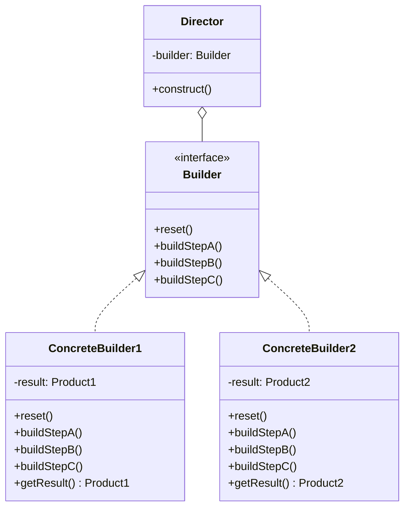
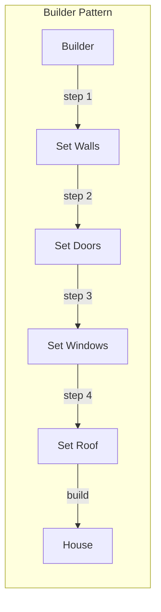
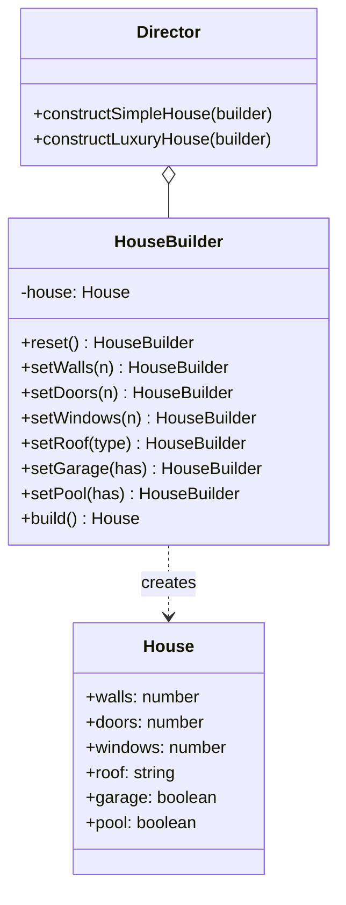

# Builder Pattern

## Intent

**Builder** is a creational design pattern that lets you construct complex objects step by step. The pattern allows you to produce different types and representations of an object using the same construction code.



---

## Problem It Solves

Imagine a complex object that requires laborious, step-by-step initialization of many fields and nested objects. Such initialization code is usually buried inside a monstrous constructor with lots of parameters:

```typescript
// @errors: 2554
// ❌ Problem: Constructor with too many parameters
interface HouseConfig {
  walls: number;
  doors: number;
  windows: number;
  roof: string;
  garage: boolean;
  swimmingPool: boolean;
  garden: boolean;
  statues: number;
  fencing: boolean;
  // ... 20 more parameters
}

// Calling this is confusing and error-prone
const createHouse = (config: HouseConfig) => {
  // Which parameter is which?
};

// ❌ Hard to read and maintain
createHouse({
  walls: 4,
  doors: 2,
  windows: 8,
  roof: "tile",
  garage: true,
  swimmingPool: false,
  garden: true,
  statues: 0,
  fencing: true,
});
```

---

## Solution

The Builder pattern suggests extracting the object construction code into separate builder objects:



The pattern organizes object construction into a set of steps. To create an object, you execute a series of these steps. **You don't need to call all steps**—only those needed for your specific configuration.

---

## Structure



---

## Implementation

<Tabs items={["Fluent Builder", "With Director", "Real-World: HTTP Client"]}>
  <Tab value="Fluent Builder">
```typescript
/**
 * HTTP Request configuration object
 * @description The final product built by the HttpRequestBuilder
 */
interface HttpRequest {
  /** HTTP method for the request */
  method: "GET" | "POST" | "PUT" | "DELETE" | "PATCH";
  /** Target URL for the request */
  url: string;
  /** HTTP headers to include */
  headers: Record<string, string>;
  /** Query parameters to append to URL */
  queryParams: Record<string, string>;
  /** Request body (for POST, PUT, PATCH) */
  body?: unknown;
  /** Request timeout in milliseconds */
  timeout: number;
  /** Number of retry attempts on failure */
  retries: number;
  /** Whether to cache the response */
  cache: boolean;
}

/**
 * Builder interface with fluent API
 * @description Each method returns the builder for chaining
 */
interface HttpRequestBuilder {
  /** Set the HTTP method */
  setMethod: (method: HttpRequest["method"]) => HttpRequestBuilder;
  /** Set the target URL */
  setUrl: (url: string) => HttpRequestBuilder;
  /** Add a single header */
  setHeader: (key: string, value: string) => HttpRequestBuilder;
  /** Add multiple headers at once */
  setHeaders: (headers: Record<string, string>) => HttpRequestBuilder;
  /** Add a query parameter */
  setQueryParam: (key: string, value: string) => HttpRequestBuilder;
  /** Set the request body */
  setBody: (body: unknown) => HttpRequestBuilder;
  /** Set timeout in milliseconds */
  setTimeout: (ms: number) => HttpRequestBuilder;
  /** Set number of retry attempts */
  setRetries: (count: number) => HttpRequestBuilder;
  /** Enable response caching */
  enableCache: () => HttpRequestBuilder;
  /** Disable response caching */
  disableCache: () => HttpRequestBuilder;
  /** Build the final HttpRequest object */
  build: () => HttpRequest;
}

/**
 * Factory function to create a new HttpRequestBuilder
 * @returns A fresh builder with default values
 */
const createHttpRequestBuilder = (): HttpRequestBuilder => {
  // Default values
  const request: Partial<HttpRequest> = {
    method: "GET",
    headers: {},
    queryParams: {},
    timeout: 30000,
    retries: 0,
    cache: true,
  };

  const builder: HttpRequestBuilder = {
    setMethod(method) {
      request.method = method;
      return builder;
    },

    setUrl(url) {
      request.url = url;
      return builder;
    },

    setHeader(key, value) {
      request.headers = { ...request.headers, [key]: value };
      return builder;
    },

    setHeaders(headers) {
      request.headers = { ...request.headers, ...headers };
      return builder;
    },

    setQueryParam(key, value) {
      request.queryParams = { ...request.queryParams, [key]: value };
      return builder;
    },

    setBody(body) {
      request.body = body;
      return builder;
    },

    setTimeout(ms) {
      request.timeout = ms;
      return builder;
    },

    setRetries(count) {
      request.retries = count;
      return builder;
    },

    enableCache() {
      request.cache = true;
      return builder;
    },

    disableCache() {
      request.cache = false;
      return builder;
    },

    build(): HttpRequest {
      if (!request.url) {
        throw new Error("URL is required");
      }

      return {
        method: request.method!,
        url: request.url,
        headers: request.headers!,
        queryParams: request.queryParams!,
        body: request.body,
        timeout: request.timeout!,
        retries: request.retries!,
        cache: request.cache!,
      };
    },
  };

  return builder;
};

// Usage - clean and readable
const request = createHttpRequestBuilder()
  .setMethod("POST")
  .setUrl("https://api.example.com/users")
  .setHeader("Content-Type", "application/json")
  .setHeader("Authorization", "Bearer token123")
  .setBody({ name: "John", email: "john@example.com" })
  .setTimeout(5000)
  .setRetries(3)
  .disableCache()
  .build();

console.log(request);
//          ^?
```
  </Tab>
  <Tab value="With Director">
```ts
// Product
interface Computer {
  cpu: string;
  ram: number;
  storage: number;
  gpu?: string;
  monitor?: string;
  keyboard?: string;
  mouse?: string;
}

// Builder
interface ComputerBuilder {
  reset: () => ComputerBuilder;
  setCpu: (cpu: string) => ComputerBuilder;
  setRam: (gb: number) => ComputerBuilder;
  setStorage: (gb: number) => ComputerBuilder;
  setGpu: (gpu: string) => ComputerBuilder;
  setMonitor: (monitor: string) => ComputerBuilder;
  setKeyboard: (keyboard: string) => ComputerBuilder;
  setMouse: (mouse: string) => ComputerBuilder;
  build: () => Computer;
}

const createComputerBuilder = (): ComputerBuilder => {
  let computer: Partial<Computer> = {};

  const builder: ComputerBuilder = {
    reset() {
      computer = {};
      return builder;
    },
    setCpu(cpu) {
      computer.cpu = cpu;
      return builder;
    },
    setRam(gb) {
      computer.ram = gb;
      return builder;
    },
    setStorage(gb) {
      computer.storage = gb;
      return builder;
    },
    setGpu(gpu) {
      computer.gpu = gpu;
      return builder;
    },
    setMonitor(monitor) {
      computer.monitor = monitor;
      return builder;
    },
    setKeyboard(keyboard) {
      computer.keyboard = keyboard;
      return builder;
    },
    setMouse(mouse) {
      computer.mouse = mouse;
      return builder;
    },
    build(): Computer {
      if (!computer.cpu || !computer.ram || !computer.storage) {
        throw new Error("CPU, RAM, and Storage are required");
      }
      const result = { ...computer } as Computer;
      builder.reset();
      return result;
    },
  };

  return builder;
};

// Director - knows how to build specific configurations
interface ComputerDirector {
  buildOfficeComputer: (builder: ComputerBuilder) => Computer;
  buildGamingComputer: (builder: ComputerBuilder) => Computer;
  buildDeveloperWorkstation: (builder: ComputerBuilder) => Computer;
}

const createComputerDirector = (): ComputerDirector => ({
  buildOfficeComputer(builder) {
    return builder
      .reset()
      .setCpu("Intel Core i5")
      .setRam(16)
      .setStorage(512)
      .setMonitor("24-inch 1080p")
      .setKeyboard("Basic Membrane")
      .setMouse("Basic Optical")
      .build();
  },

  buildGamingComputer(builder) {
    return builder
      .reset()
      .setCpu("AMD Ryzen 9 7950X")
      .setRam(64)
      .setStorage(2000)
      .setGpu("NVIDIA RTX 4090")
      .setMonitor("27-inch 4K 144Hz")
      .setKeyboard("Mechanical RGB")
      .setMouse("Gaming Mouse 25600 DPI")
      .build();
  },

  buildDeveloperWorkstation(builder) {
    return builder
      .reset()
      .setCpu("Apple M3 Max")
      .setRam(128)
      .setStorage(4000)
      .setGpu("Integrated")
      .setMonitor("32-inch 5K")
      .setKeyboard("Mechanical Silent")
      .setMouse("Ergonomic Trackpad")
      .build();
  },
});

// Usage
const builder = createComputerBuilder();
const director = createComputerDirector();

const officePC = director.buildOfficeComputer(builder);
console.log("Office PC:", officePC);

const gamingPC = director.buildGamingComputer(builder);
console.log("Gaming PC:", gamingPC);

const devWorkstation = director.buildDeveloperWorkstation(builder);
console.log("Dev Workstation:", devWorkstation);

// Or build custom configuration
const customPC = builder
  .reset()
  .setCpu("Intel Core i9")
  .setRam(32)
  .setStorage(1000)
  .setGpu("NVIDIA RTX 4070")
  .build();
```
  </Tab>
  <Tab value="Real-World: HTTP Client">
```ts
// Real-world: API Client Builder
interface ApiClientConfig {
  baseUrl: string;
  headers: Record<string, string>;
  timeout: number;
  retryConfig: {
    maxRetries: number;
    retryDelay: number;
    retryOn: number[];
  };
  interceptors: {
    request: Array<(config: RequestInit) => RequestInit>;
    response: Array<(response: Response) => Response>;
  };
  cache: {
    enabled: boolean;
    ttl: number;
  };
}

interface ApiClient {
  get: <T>(path: string, options?: RequestInit) => Promise<T>;
  post: <T>(path: string, body: unknown, options?: RequestInit) => Promise<T>;
  put: <T>(path: string, body: unknown, options?: RequestInit) => Promise<T>;
  delete: <T>(path: string, options?: RequestInit) => Promise<T>;
}

interface ApiClientBuilder {
  setBaseUrl: (url: string) => ApiClientBuilder;
  setHeader: (key: string, value: string) => ApiClientBuilder;
  setBearerToken: (token: string) => ApiClientBuilder;
  setApiKey: (key: string, headerName?: string) => ApiClientBuilder;
  setTimeout: (ms: number) => ApiClientBuilder;
  setRetry: (maxRetries: number, delay?: number, retryOn?: number[]) => ApiClientBuilder;
  addRequestInterceptor: (fn: (config: RequestInit) => RequestInit) => ApiClientBuilder;
  addResponseInterceptor: (fn: (response: Response) => Response) => ApiClientBuilder;
  enableCache: (ttl?: number) => ApiClientBuilder;
  disableCache: () => ApiClientBuilder;
  build: () => ApiClient;
}

const createApiClientBuilder = (): ApiClientBuilder => {
  const config: ApiClientConfig = {
    baseUrl: "",
    headers: {
      "Content-Type": "application/json",
    },
    timeout: 30000,
    retryConfig: {
      maxRetries: 0,
      retryDelay: 1000,
      retryOn: [500, 502, 503, 504],
    },
    interceptors: {
      request: [],
      response: [],
    },
    cache: {
      enabled: false,
      ttl: 60000,
    },
  };

  const builder: ApiClientBuilder = {
    setBaseUrl(url) {
      config.baseUrl = url.endsWith("/") ? url.slice(0, -1) : url;
      return builder;
    },

    setHeader(key, value) {
      config.headers[key] = value;
      return builder;
    },

    setBearerToken(token) {
      config.headers["Authorization"] = `Bearer ${token}`;
      return builder;
    },

    setApiKey(key, headerName = "X-API-Key") {
      config.headers[headerName] = key;
      return builder;
    },

    setTimeout(ms) {
      config.timeout = ms;
      return builder;
    },

    setRetry(maxRetries, delay = 1000, retryOn = [500, 502, 503, 504]) {
      config.retryConfig = { maxRetries, retryDelay: delay, retryOn };
      return builder;
    },

    addRequestInterceptor(fn) {
      config.interceptors.request.push(fn);
      return builder;
    },

    addResponseInterceptor(fn) {
      config.interceptors.response.push(fn);
      return builder;
    },

    enableCache(ttl = 60000) {
      config.cache = { enabled: true, ttl };
      return builder;
    },

    disableCache() {
      config.cache.enabled = false;
      return builder;
    },

    build(): ApiClient {
      if (!config.baseUrl) {
        throw new Error("Base URL is required");
      }

      const makeRequest = async <T>(
        method: string,
        path: string,
        body?: unknown,
        options: RequestInit = {}
      ): Promise<T> => {
        const url = `${config.baseUrl}${path}`;

        let requestConfig: RequestInit = {
          method,
          headers: { ...config.headers, ...options.headers },
          ...options,
        };

        if (body) {
          requestConfig.body = JSON.stringify(body);
        }

        // Apply request interceptors
        for (const interceptor of config.interceptors.request) {
          requestConfig = interceptor(requestConfig);
        }

        // Make request with timeout
        const controller = new AbortController();
        const timeoutId = setTimeout(() => controller.abort(), config.timeout);

        try {
          let response = await fetch(url, {
            ...requestConfig,
            signal: controller.signal,
          });

          // Apply response interceptors
          for (const interceptor of config.interceptors.response) {
            response = interceptor(response);
          }

          if (!response.ok) {
            throw new Error(`HTTP ${response.status}: ${response.statusText}`);
          }

          return response.json();
        } finally {
          clearTimeout(timeoutId);
        }
      };

      return {
        get: <T>(path: string, options?: RequestInit) =>
          makeRequest<T>("GET", path, undefined, options),
        post: <T>(path: string, body: unknown, options?: RequestInit) =>
          makeRequest<T>("POST", path, body, options),
        put: <T>(path: string, body: unknown, options?: RequestInit) =>
          makeRequest<T>("PUT", path, body, options),
        delete: <T>(path: string, options?: RequestInit) =>
          makeRequest<T>("DELETE", path, undefined, options),
      };
    },
  };

  return builder;
};

// Usage
const apiClient = createApiClientBuilder()
  .setBaseUrl("https://api.example.com/v1")
  .setBearerToken("eyJhbGciOiJIUzI1NiIsInR5cCI6IkpXVCJ9...")
  .setHeader("X-Request-ID", crypto.randomUUID())
  .setTimeout(10000)
  .setRetry(3, 2000)
  .addRequestInterceptor((config) => {
    console.log(`[Request] ${config.method}`);
    return config;
  })
  .enableCache(300000)
  .build();

// Clean, readable API calls
interface User {
  id: string;
  name: string;
  email: string;
}

const getUser = async (id: string) => {
  return apiClient.get<User>(`/users/${id}`);
};

const createUser = async (data: Omit<User, "id">) => {
  return apiClient.post<User>("/users", data);
};
```
  </Tab>
</Tabs>

---

## When to Use

<Accordions>
  <Accordion title="✅ Use Builder when...">
    - **Complex object with many optional parameters**: When constructors have too many parameters, especially optional ones
    
    - **Step-by-step construction**: When you need to create an object in multiple steps
    
    - **Different representations**: When you need to create different representations of the same product
    
    - **Immutable objects**: When you want to build immutable objects with many properties
    
    - **Fluent APIs**: When you want readable, chainable configuration
  </Accordion>
  
  <Accordion title="❌ Avoid Builder when...">
    - **Simple objects**: If the object has few required parameters, a simple constructor is fine
    
    - **No optional parameters**: If all parameters are always required
    
    - **Overkill for the problem**: Don't add complexity when it's not needed
  </Accordion>
</Accordions>

---

## Builder vs Other Patterns

| Pattern | When to Use |
|---------|-------------|
| **Builder** | Complex object, step-by-step, many optional params |
| **Factory Method** | Simple object, type varies at runtime |
| **Abstract Factory** | Families of related objects |
| **Prototype** | Copy existing objects |

---

## Real-World Applications

| Library/Framework | Builder Usage |
|------------------|---------------|
| **StringBuilder** (many languages) | Building strings efficiently |
| **Prisma/Drizzle** | Query builders |
| **Axios/Ky** | Request configuration |
| **Yup/Zod** | Schema validation builders |
| **Express/Hono** | Middleware chain building |
| **SQL Query Builders** | Knex, Kysely, TypeORM |

---

## Summary

<Callout type="info">
  **Key Takeaway**: Builder is perfect for objects with many optional parameters or complex construction logic. The fluent interface makes code readable and self-documenting.
</Callout>

### Pros
- ✅ Construct objects step-by-step, defer steps, or run recursively
- ✅ Reuse construction code for different representations
- ✅ Single Responsibility: Isolate complex construction
- ✅ Immutability: Build immutable objects easily

### Cons
- ❌ Increases code complexity with new classes
- ❌ Requires creating a builder for each product type
