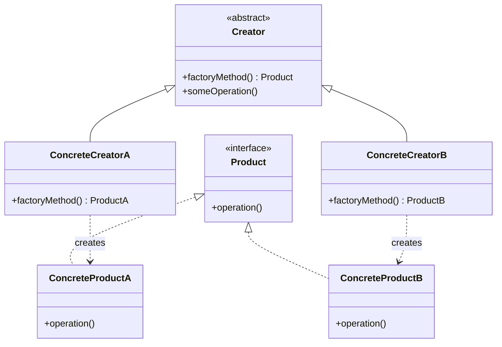
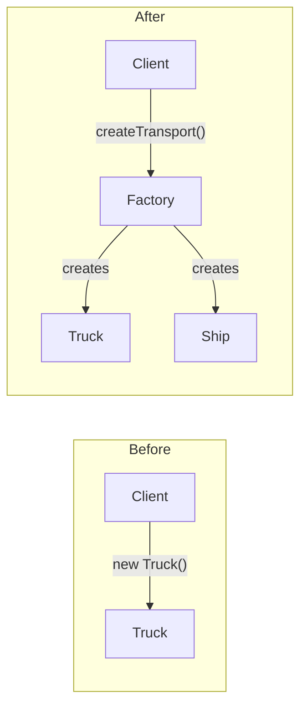
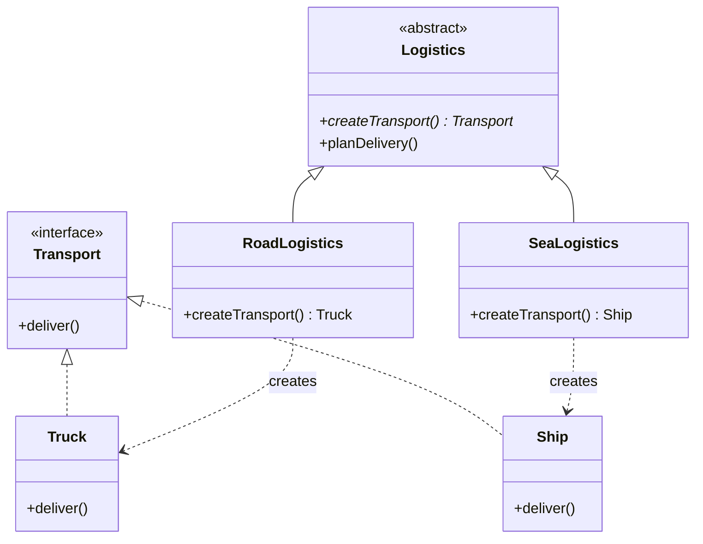
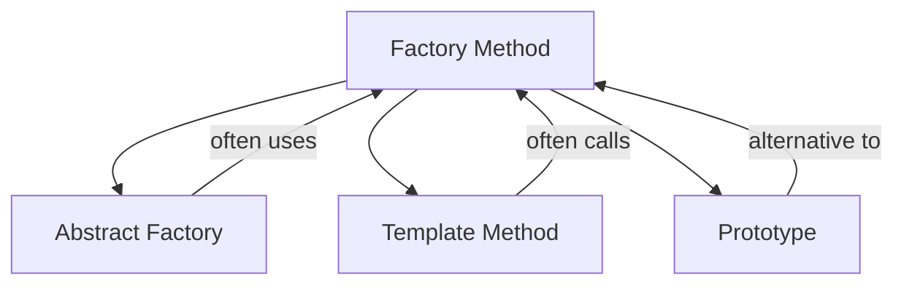

# Factory Method Pattern

## Intent

**Factory Method** is a creational design pattern that provides an interface for creating objects in a superclass, but allows subclasses to alter the type of objects that will be created.



---

## Problem It Solves

Imagine you're building a logistics application. Initially, you only handle truck transportation, so most of your code lives inside the `Truck` class.

Later, your app becomes popular and you need to add sea transportation. But your code is tightly coupled to trucks:

```typescript
// @errors: 2339
// ❌ Problem: Code is tightly coupled to a specific class
const createLogistics = () => {
  // Hardcoded truck creation
  const truck = {
    deliver: () => console.log("Delivering by land in a truck"),
  };
  
  return {
    planDelivery: () => {
      // What if we need ships?
      truck.deliver();
    },
  };
};
```

Adding `Ship` would require changing the entire codebase, violating the **Open/Closed Principle**.

---

## Solution

The Factory Method pattern suggests replacing direct object construction with a special factory method:



---

## Structure



---

## Implementation

<Tabs items={["Basic Implementation", "Function-Based", "Real-World Example"]}>
  <Tab value="Basic Implementation">
```typescript
// Product interface
interface Transport {
  deliver: () => void;
  getCapacity: () => number;
  getCost: () => number;
}

// Concrete Products
const createTruck = (capacity: number): Transport => ({
  deliver: () => {
    console.log(`Delivering ${capacity} tons by land in a truck`);
  },
  getCapacity: () => capacity,
  getCost: () => capacity * 10, // $10 per ton
});

const createShip = (capacity: number): Transport => ({
  deliver: () => {
    console.log(`Delivering ${capacity} tons by sea in a cargo ship`);
  },
  getCapacity: () => capacity,
  getCost: () => capacity * 5, // $5 per ton (cheaper but slower)
});

const createPlane = (capacity: number): Transport => ({
  deliver: () => {
    console.log(`Delivering ${capacity} tons by air in a cargo plane`);
  },
  getCapacity: () => capacity,
  getCost: () => capacity * 50, // $50 per ton (expensive but fast)
});

// Factory function
type TransportType = "truck" | "ship" | "plane";

const createTransport = (type: TransportType, capacity: number): Transport => {
  const factories: Record<TransportType, (cap: number) => Transport> = {
    truck: createTruck,
    ship: createShip,
    plane: createPlane,
  };

  const factory = factories[type];
  if (!factory) {
    throw new Error(`Unknown transport type: ${type}`);
  }

  return factory(capacity);
};

// Usage
const truck = createTransport("truck", 20);
truck.deliver();
console.log(`Cost: $${truck.getCost()}`);
//                    ^?

const ship = createTransport("ship", 1000);
ship.deliver();
console.log(`Cost: $${ship.getCost()}`);
```
  </Tab>
  <Tab value="Function-Based">
```typescript
// More idiomatic TypeScript: Factory with configuration
interface NotificationConfig {
  recipient: string;
  priority?: "low" | "normal" | "high";
}

interface Notification {
  send: (message: string) => Promise<boolean>;
  getStatus: () => string;
  cancel: () => void;
}

// Factory that returns a factory function
const createNotificationFactory = (type: "email" | "sms" | "push") => {
  return (config: NotificationConfig): Notification => {
    let status = "pending";

    const baseNotification = {
      getStatus: () => status,
      cancel: () => {
        status = "cancelled";
      },
    };

    switch (type) {
      case "email":
        return {
          ...baseNotification,
          send: async (message: string) => {
            console.log(`📧 Sending email to ${config.recipient}: ${message}`);
            status = "sent";
            return true;
          },
        };

      case "sms":
        return {
          ...baseNotification,
          send: async (message: string) => {
            console.log(`📱 Sending SMS to ${config.recipient}: ${message}`);
            status = "sent";
            return true;
          },
        };

      case "push":
        return {
          ...baseNotification,
          send: async (message: string) => {
            console.log(`🔔 Sending push to ${config.recipient}: ${message}`);
            status = "sent";
            return true;
          },
        };
    }
  };
};

// Create specialized factories
const createEmailNotification = createNotificationFactory("email");
const createSmsNotification = createNotificationFactory("sms");
const createPushNotification = createNotificationFactory("push");

// Usage
const emailNotif = createEmailNotification({ 
  recipient: "user@example.com",
  priority: "high" 
});

await emailNotif.send("Your order has shipped!");
console.log(emailNotif.getStatus());
//                     ^?
```
  </Tab>
  <Tab value="Real-World Example">
```ts
// Real-world: Database connection factory
interface QueryResult<T> {
  rows: T[];
  rowCount: number;
  duration: number;
}

interface DatabaseConnection {
  connect: () => Promise<void>;
  disconnect: () => Promise<void>;
  query: <T>(sql: string, params?: unknown[]) => Promise<QueryResult<T>>;
  transaction: <T>(fn: (conn: DatabaseConnection) => Promise<T>) => Promise<T>;
  isConnected: () => boolean;
}

interface ConnectionConfig {
  host: string;
  port: number;
  database: string;
  username: string;
  password: string;
  pool?: {
    min: number;
    max: number;
  };
}

type DatabaseType = "postgres" | "mysql" | "sqlite";

// Factory function with proper typing
const createDatabaseConnection = (
  type: DatabaseType,
  config: ConnectionConfig
): DatabaseConnection => {
  let connected = false;

  const baseConnection = {
    isConnected: () => connected,
    connect: async () => {
      console.log(`Connecting to ${type}://${config.host}:${config.port}/${config.database}`);
      await new Promise(resolve => setTimeout(resolve, 100));
      connected = true;
    },
    disconnect: async () => {
      console.log(`Disconnecting from ${config.database}`);
      connected = false;
    },
  };

  switch (type) {
    case "postgres":
      return {
        ...baseConnection,
        query: async <T>(sql: string, params?: unknown[]) => {
          const start = Date.now();
          console.log(`[PostgreSQL] ${sql}`);
          return {
            rows: [] as T[],
            rowCount: 0,
            duration: Date.now() - start,
          };
        },
        transaction: async <T>(fn: (conn: DatabaseConnection) => Promise<T>) => {
          console.log("[PostgreSQL] BEGIN TRANSACTION");
          try {
            const result = await fn(baseConnection as DatabaseConnection);
            console.log("[PostgreSQL] COMMIT");
            return result;
          } catch (error) {
            console.log("[PostgreSQL] ROLLBACK");
            throw error;
          }
        },
      };

    case "mysql":
      return {
        ...baseConnection,
        query: async <T>(sql: string, params?: unknown[]) => {
          const start = Date.now();
          console.log(`[MySQL] ${sql}`);
          return {
            rows: [] as T[],
            rowCount: 0,
            duration: Date.now() - start,
          };
        },
        transaction: async <T>(fn: (conn: DatabaseConnection) => Promise<T>) => {
          console.log("[MySQL] START TRANSACTION");
          try {
            const result = await fn(baseConnection as DatabaseConnection);
            console.log("[MySQL] COMMIT");
            return result;
          } catch (error) {
            console.log("[MySQL] ROLLBACK");
            throw error;
          }
        },
      };

    case "sqlite":
      return {
        ...baseConnection,
        query: async <T>(sql: string, params?: unknown[]) => {
          const start = Date.now();
          console.log(`[SQLite] ${sql}`);
          return {
            rows: [] as T[],
            rowCount: 0,
            duration: Date.now() - start,
          };
        },
        transaction: async <T>(fn: (conn: DatabaseConnection) => Promise<T>) => {
          console.log("[SQLite] BEGIN");
          try {
            const result = await fn(baseConnection as DatabaseConnection);
            console.log("[SQLite] COMMIT");
            return result;
          } catch (error) {
            console.log("[SQLite] ROLLBACK");
            throw error;
          }
        },
      };
  }
};

// Usage
const db = createDatabaseConnection("postgres", {
  host: "localhost",
  port: 5432,
  database: "myapp",
  username: "admin",
  password: "secret",
  pool: { min: 2, max: 10 },
});

const main = async () => {
  await db.connect();
  
  interface User {
    id: number;
    name: string;
    email: string;
  }
  
  const result = await db.query<User>("SELECT * FROM users WHERE active = $1", [true]);
  console.log(`Found ${result.rowCount} users in ${result.duration}ms`);
  
  await db.disconnect();
};
```
  </Tab>
</Tabs>

---

## When to Use

<Accordions>
  <Accordion title="✅ Use Factory Method when...">
    - **You don't know exact types beforehand**: When your code needs to work with objects whose types you can't predict
    
    - **You want to provide extensibility**: Allow users of your library/framework to extend internal components
    
    - **You want to save resources**: Reuse existing objects instead of creating new ones each time
    
    - **You need to decouple creation from usage**: Separate the code that creates objects from the code that uses them
  </Accordion>
  
  <Accordion title="❌ Avoid Factory Method when...">
    - **Simple object creation suffices**: If you only have one type and don't expect changes, direct instantiation is fine
    
    - **Adds unnecessary complexity**: Don't use patterns just because they exist
    
    - **Performance is critical**: Factory methods add a layer of indirection
  </Accordion>
</Accordions>

---

## Real-World Applications

| Application | Factory Creates |
|------------|----------------|
| **React** | `React.createElement()` creates different elements based on type |
| **Document editors** | Different document types (PDF, Word, HTML) |
| **Game engines** | Different enemy types, weapons, power-ups |
| **Logistics systems** | Different transport methods |
| **Payment systems** | Different payment processors |
| **Logging frameworks** | Different log outputs (file, console, remote) |

---

## Relationships with Other Patterns



- **Abstract Factory** classes are often based on Factory Methods
- **Factory Method** is a specialization of **Template Method**
- **Prototype** doesn't require subclassing but needs an initialization operation; Factory Method requires subclassing but doesn't need initialization

---

## Summary

<Callout type="info">
  **Key Takeaway**: Factory Method lets you introduce new types without breaking existing code. It's one of the most commonly used patterns because it promotes loose coupling and follows the Open/Closed Principle.
</Callout>

### Pros
- ✅ Avoids tight coupling between creator and products
- ✅ Single Responsibility: Move creation code to one place
- ✅ Open/Closed: Add new types without modifying existing code

### Cons
- ❌ Code may become more complicated with many subclasses
- ❌ Requires a parallel hierarchy of creators and products
