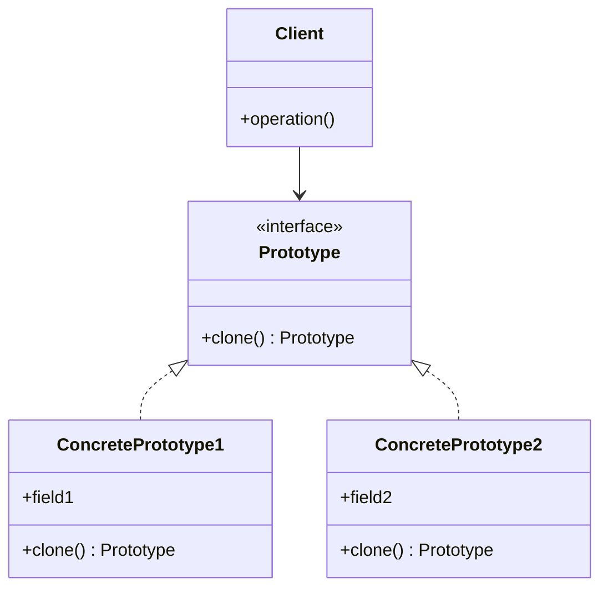
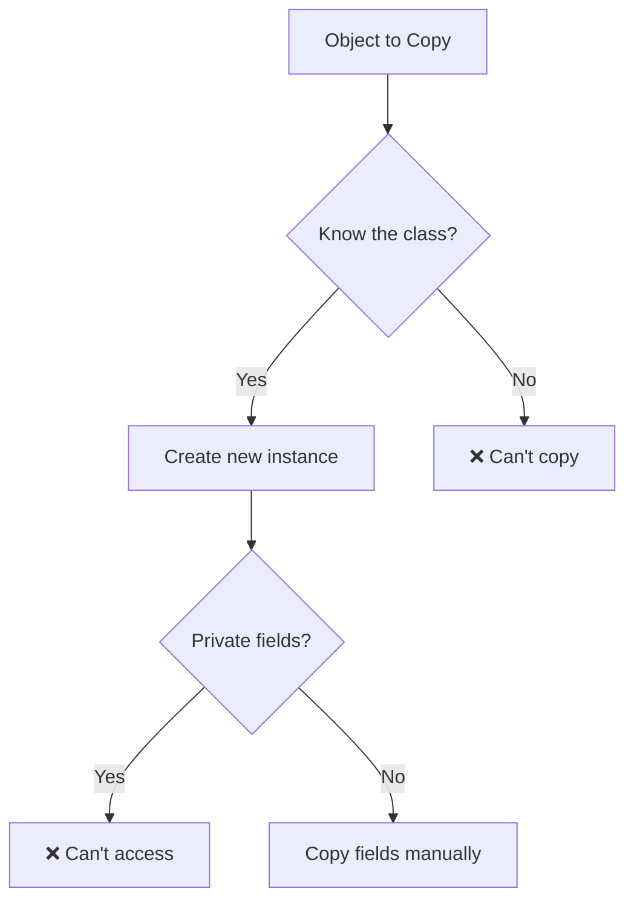
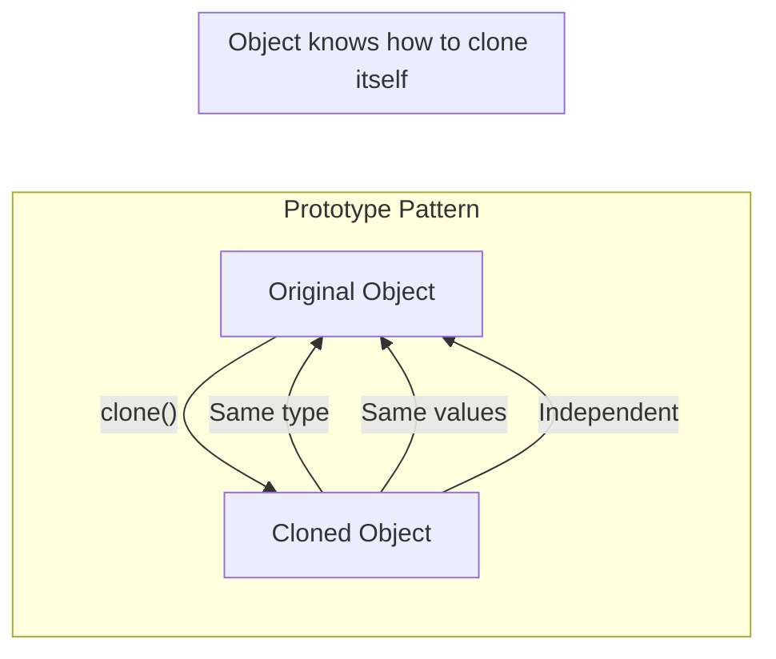
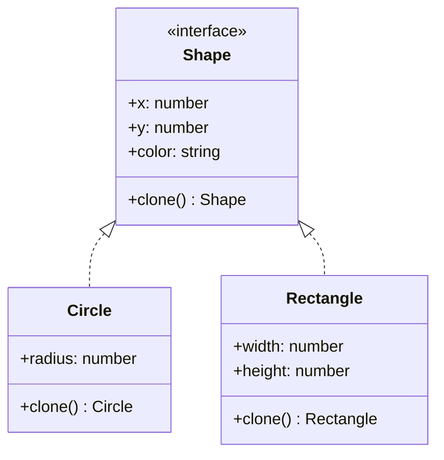
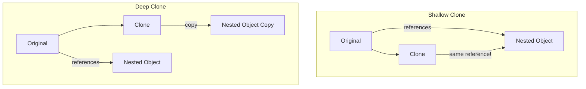
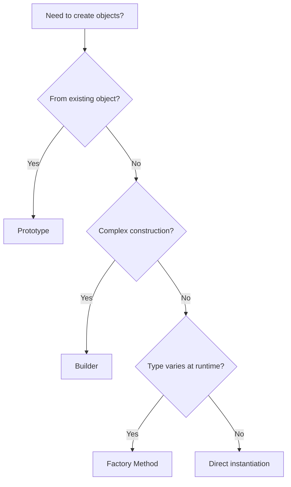

# Prototype Pattern

## Intent

**Prototype** is a creational design pattern that lets you copy existing objects without making your code dependent on their classes.



---

## Problem It Solves

You have an object and want to create an exact copy. How would you do it?

1. Create a new object of the same class
2. Copy all fields from the original

But there are problems:

```ts
// @errors: 2339 2698
// ❌ Problem 1: Some fields might be private
interface SomeObject {
  publicField: string;
  // privateField is not accessible
}

const original: SomeObject = { publicField: "value" };

// ❌ Problem 2: You need to know the exact class
// What if you only have an interface reference?
const copyObject = (obj: unknown): unknown => {
  // How do we know what class to instantiate?
  // We only know the interface, not the concrete class
  return { ...obj }; // This loses methods and prototype chain
};
```



---

## Solution

The Prototype pattern delegates the cloning process to the objects themselves. Objects that support cloning are called **prototypes**.



---

## Structure



---

## Implementation

<Tabs items={["Basic Cloning", "Deep Clone Utility", "Prototype Registry", "Real-World Example"]}>
  <Tab value="Basic Cloning">
```typescript
/**
 * Cloneable interface for prototype pattern
 * @description Objects implementing this can create copies of themselves
 * @typeParam T - The type of the cloned object
 */
interface Cloneable<T> {
  /** Create a deep copy of this object */
  clone: () => T;
}

/**
 * Base Shape interface with cloning capability
 * @description All shapes can be drawn, measured, and cloned
 */
interface Shape extends Cloneable<Shape> {
  /** X coordinate position */
  x: number;
  /** Y coordinate position */
  y: number;
  /** Fill color of the shape */
  color: string;
  /** Render the shape to the canvas */
  draw: () => void;
  /** Calculate the area of the shape */
  getArea: () => number;
}

/**
 * Circle shape with radius
 */
interface Circle extends Shape {
  /** Radius of the circle */
  radius: number;
}

/**
 * Factory function to create a Circle
 * @param config - Circle configuration options
 * @returns A new Circle instance with clone capability
 */
const createCircle = (config: {
  x: number;
  y: number;
  color: string;
  radius: number;
}): Circle => {
  const circle: Circle = {
    ...config,
    draw() {
      console.log(
        `Drawing ${this.color} circle at (${this.x}, ${this.y}) with radius ${this.radius}`
      );
    },
    getArea() {
      return Math.PI * this.radius ** 2;
    },
    clone() {
      // Create a new circle with the same properties
      return createCircle({
        x: this.x,
        y: this.y,
        color: this.color,
        radius: this.radius,
      });
    },
  };
  return circle;
};

/**
 * Rectangle shape with width and height
 */
interface Rectangle extends Shape {
  /** Width of the rectangle */
  width: number;
  /** Height of the rectangle */
  height: number;
}

/**
 * Factory function to create a Rectangle
 * @param config - Rectangle configuration options
 * @returns A new Rectangle instance with clone capability
 */
const createRectangle = (config: {
  x: number;
  y: number;
  color: string;
  width: number;
  height: number;
}): Rectangle => {
  const rectangle: Rectangle = {
    ...config,
    draw() {
      console.log(
        `Drawing ${this.color} rectangle at (${this.x}, ${this.y}) ${this.width}x${this.height}`
      );
    },
    getArea() {
      return this.width * this.height;
    },
    clone() {
      return createRectangle({
        x: this.x,
        y: this.y,
        color: this.color,
        width: this.width,
        height: this.height,
      });
    },
  };
  return rectangle;
};

// Usage: Create and clone a circle
const originalCircle = createCircle({
  x: 10,
  y: 20,
  color: "red",
  radius: 15,
});

// Clone the circle - creates an independent copy
const clonedCircle = originalCircle.clone();

// Modify the clone - original is unaffected
clonedCircle.x = 100;
clonedCircle.color = "blue";

console.log(originalCircle.x, originalCircle.color); // 10, "red"
console.log(clonedCircle.x, clonedCircle.color); // 100, "blue"

originalCircle.draw();
//              ^?
clonedCircle.draw();
```
  </Tab>
  <Tab value="Deep Clone Utility">
```ts
// Deep clone utility for complex nested objects
const deepClone = <T>(obj: T, seen = new WeakMap()): T => {
  // Handle primitives and null
  if (obj === null || typeof obj !== "object") {
    return obj;
  }

  // Handle circular references
  if (seen.has(obj as object)) {
    return seen.get(obj as object);
  }

  // Handle Date
  if (obj instanceof Date) {
    return new Date(obj.getTime()) as T;
  }

  // Handle RegExp
  if (obj instanceof RegExp) {
    return new RegExp(obj.source, obj.flags) as T;
  }

  // Handle Map
  if (obj instanceof Map) {
    const clonedMap = new Map();
    seen.set(obj, clonedMap);
    obj.forEach((value, key) => {
      clonedMap.set(deepClone(key, seen), deepClone(value, seen));
    });
    return clonedMap as T;
  }

  // Handle Set
  if (obj instanceof Set) {
    const clonedSet = new Set();
    seen.set(obj, clonedSet);
    obj.forEach((value) => {
      clonedSet.add(deepClone(value, seen));
    });
    return clonedSet as T;
  }

  // Handle Array
  if (Array.isArray(obj)) {
    const clonedArray: unknown[] = [];
    seen.set(obj, clonedArray);
    for (const item of obj) {
      clonedArray.push(deepClone(item, seen));
    }
    return clonedArray as T;
  }

  // Handle plain objects
  const clonedObj = Object.create(Object.getPrototypeOf(obj));
  seen.set(obj, clonedObj);

  for (const key of Reflect.ownKeys(obj as object)) {
    const value = (obj as Record<string | symbol, unknown>)[key];
    clonedObj[key] = deepClone(value, seen);
  }

  return clonedObj;
};

// Document with complex nested structure
interface Document {
  id: string;
  title: string;
  content: string;
  metadata: {
    author: string;
    tags: string[];
    created: Date;
    modified: Date;
  };
  comments: Array<{
    id: string;
    author: string;
    text: string;
    replies: Array<{ author: string; text: string }>;
  }>;
  clone: () => Document;
}

const createDocument = (config: Omit<Document, "clone">): Document => ({
  ...config,
  clone() {
    const cloned = deepClone(this);
    // Generate new ID and update timestamps
    cloned.id = `doc_${Date.now()}`;
    cloned.metadata.created = new Date();
    cloned.metadata.modified = new Date();
    return createDocument(cloned);
  },
});

// Usage
const originalDoc = createDocument({
  id: "doc_123",
  title: "Design Patterns",
  content: "Content about patterns...",
  metadata: {
    author: "John",
    tags: ["patterns", "architecture"],
    created: new Date("2024-01-01"),
    modified: new Date("2024-01-15"),
  },
  comments: [
    {
      id: "c1",
      author: "Alice",
      text: "Great article!",
      replies: [{ author: "John", text: "Thanks!" }],
    },
  ],
});

const clonedDoc = originalDoc.clone();
clonedDoc.title = "Design Patterns - Copy";
clonedDoc.metadata.author = "Jane";

// Original is unchanged
console.log(originalDoc.title); // "Design Patterns"
console.log(originalDoc.metadata.author); // "John"

// Clone has new values
console.log(clonedDoc.title); // "Design Patterns - Copy"
console.log(clonedDoc.metadata.author); // "Jane"
```
  </Tab>
  <Tab value="Prototype Registry">
```ts
// Prototype Registry - store and clone predefined prototypes
interface Component {
  type: string;
  props: Record<string, unknown>;
  styles: Record<string, string>;
  clone: () => Component;
}

const createComponent = (config: Omit<Component, "clone">): Component => ({
  ...config,
  props: { ...config.props },
  styles: { ...config.styles },
  clone() {
    return createComponent({
      type: this.type,
      props: { ...this.props },
      styles: { ...this.styles },
    });
  },
});

// Prototype Registry
interface ComponentRegistry {
  register: (name: string, component: Component) => void;
  unregister: (name: string) => void;
  get: (name: string) => Component;
  list: () => string[];
}

const createComponentRegistry = (): ComponentRegistry => {
  const prototypes = new Map<string, Component>();

  return {
    register(name, component) {
      prototypes.set(name, component);
    },

    unregister(name) {
      prototypes.delete(name);
    },

    get(name) {
      const prototype = prototypes.get(name);
      if (!prototype) {
        throw new Error(`Component "${name}" not found in registry`);
      }
      // Return a clone, not the original
      return prototype.clone();
    },

    list() {
      return Array.from(prototypes.keys());
    },
  };
};

// Setup registry with common components
const registry = createComponentRegistry();

// Register prototypes
registry.register(
  "button-primary",
  createComponent({
    type: "button",
    props: { variant: "primary", size: "md" },
    styles: {
      backgroundColor: "#3B82F6",
      color: "#FFFFFF",
      padding: "8px 16px",
      borderRadius: "6px",
    },
  })
);

registry.register(
  "button-secondary",
  createComponent({
    type: "button",
    props: { variant: "secondary", size: "md" },
    styles: {
      backgroundColor: "#6B7280",
      color: "#FFFFFF",
      padding: "8px 16px",
      borderRadius: "6px",
    },
  })
);

registry.register(
  "card",
  createComponent({
    type: "card",
    props: { elevation: 1 },
    styles: {
      backgroundColor: "#FFFFFF",
      padding: "16px",
      borderRadius: "8px",
      boxShadow: "0 1px 3px rgba(0,0,0,0.1)",
    },
  })
);

// Usage - get clones from registry
const submitButton = registry.get("button-primary");
submitButton.props.label = "Submit";
submitButton.props.onClick = () => console.log("Submitted!");

const cancelButton = registry.get("button-secondary");
cancelButton.props.label = "Cancel";

const productCard = registry.get("card");
productCard.props.title = "Product Name";
productCard.props.price = 29.99;

console.log("Available components:", registry.list());
```
  </Tab>
  <Tab value="Real-World Example">
```ts
// Real-world: Configuration templates
interface ServerConfig {
  name: string;
  host: string;
  port: number;
  ssl: {
    enabled: boolean;
    cert?: string;
    key?: string;
  };
  database: {
    host: string;
    port: number;
    name: string;
    pool: {
      min: number;
      max: number;
    };
  };
  cache: {
    enabled: boolean;
    driver: "redis" | "memcached" | "memory";
    ttl: number;
  };
  logging: {
    level: "debug" | "info" | "warn" | "error";
    format: "json" | "text";
  };
}

// Configuration prototype with cloning
interface ConfigPrototype {
  config: ServerConfig;
  clone: () => ConfigPrototype;
  withName: (name: string) => ConfigPrototype;
  withPort: (port: number) => ConfigPrototype;
  withDatabase: (db: Partial<ServerConfig["database"]>) => ConfigPrototype;
  withCache: (cache: Partial<ServerConfig["cache"]>) => ConfigPrototype;
  build: () => ServerConfig;
}

const createConfigPrototype = (config: ServerConfig): ConfigPrototype => {
  const deepCloneConfig = (c: ServerConfig): ServerConfig => ({
    ...c,
    ssl: { ...c.ssl },
    database: {
      ...c.database,
      pool: { ...c.database.pool },
    },
    cache: { ...c.cache },
    logging: { ...c.logging },
  });

  const prototype: ConfigPrototype = {
    config: deepCloneConfig(config),

    clone() {
      return createConfigPrototype(deepCloneConfig(this.config));
    },

    withName(name) {
      const cloned = this.clone();
      cloned.config.name = name;
      return cloned;
    },

    withPort(port) {
      const cloned = this.clone();
      cloned.config.port = port;
      return cloned;
    },

    withDatabase(db) {
      const cloned = this.clone();
      cloned.config.database = { ...cloned.config.database, ...db };
      if (db.pool) {
        cloned.config.database.pool = { ...cloned.config.database.pool, ...db.pool };
      }
      return cloned;
    },

    withCache(cache) {
      const cloned = this.clone();
      cloned.config.cache = { ...cloned.config.cache, ...cache };
      return cloned;
    },

    build() {
      return deepCloneConfig(this.config);
    },
  };

  return prototype;
};

// Base templates
const developmentTemplate = createConfigPrototype({
  name: "development",
  host: "localhost",
  port: 3000,
  ssl: { enabled: false },
  database: {
    host: "localhost",
    port: 5432,
    name: "app_dev",
    pool: { min: 2, max: 10 },
  },
  cache: {
    enabled: false,
    driver: "memory",
    ttl: 60,
  },
  logging: {
    level: "debug",
    format: "text",
  },
});

const productionTemplate = createConfigPrototype({
  name: "production",
  host: "0.0.0.0",
  port: 443,
  ssl: {
    enabled: true,
    cert: "/etc/ssl/cert.pem",
    key: "/etc/ssl/key.pem",
  },
  database: {
    host: "db.production.internal",
    port: 5432,
    name: "app_prod",
    pool: { min: 10, max: 100 },
  },
  cache: {
    enabled: true,
    driver: "redis",
    ttl: 3600,
  },
  logging: {
    level: "warn",
    format: "json",
  },
});

// Create environment-specific configs from templates
const stagingConfig = productionTemplate
  .clone()
  .withName("staging")
  .withPort(8443)
  .withDatabase({ name: "app_staging", pool: { min: 5, max: 50 } })
  .withCache({ ttl: 300 })
  .build();

const testConfig = developmentTemplate
  .clone()
  .withName("test")
  .withDatabase({ name: "app_test" })
  .build();

console.log("Staging config:", stagingConfig);
console.log("Test config:", testConfig);
```
  </Tab>
</Tabs>

---

## When to Use

<Accordions>
  <Accordion title="✅ Use Prototype when...">
    - **Object creation is expensive**: When creating an object involves complex computation, database queries, or network calls
    
    - **Many similar objects**: When you need many objects with slight variations from a base configuration
    
    - **Runtime object configuration**: When the exact configuration is determined at runtime
    
    - **Avoiding class explosion**: Instead of creating many subclasses that differ only in initialization
    
    - **Preserving object state**: When you need to save and restore object states (snapshots)
  </Accordion>
  
  <Accordion title="❌ Avoid Prototype when...">
    - **Objects are simple**: If object creation is cheap and simple
    
    - **Circular references**: Objects with complex circular references are hard to clone
    
    - **Objects with external resources**: File handles, database connections shouldn't be cloned
  </Accordion>
</Accordions>

---

## Shallow vs Deep Clone



| Clone Type | Behavior | Use When |
|------------|----------|----------|
| **Shallow** | Copies only first level | Nested objects are immutable |
| **Deep** | Copies all levels recursively | Nested objects need independence |

---

## Real-World Applications

| Application | Prototype Usage |
|------------|-----------------|
| **JavaScript** | `Object.create()`, spread operator |
| **Game Development** | Cloning enemy/item templates |
| **Document Editors** | Duplicating pages/elements |
| **Configuration** | Environment-specific configs from templates |
| **UI Libraries** | Component template cloning |
| **Testing** | Test fixture generation |

---

## Prototype vs Other Patterns



---

## Summary

<Callout type="info">
  **Key Takeaway**: Prototype lets you clone objects without coupling to their specific classes. It's particularly useful when object creation is expensive or when you need many variations of a base object.
</Callout>

### Pros
- ✅ Clone objects without coupling to their concrete classes
- ✅ Avoid repeated initialization code
- ✅ Produce complex objects more conveniently
- ✅ Alternative to subclassing for presets

### Cons
- ❌ Cloning complex objects with circular references is tricky
- ❌ Deep cloning can be expensive for large objects
