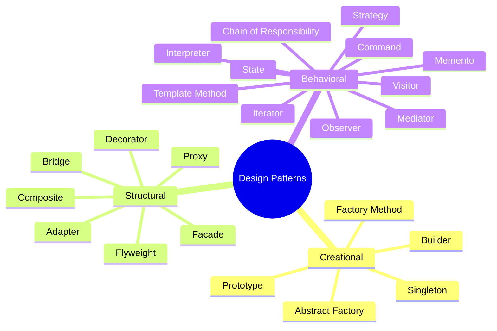
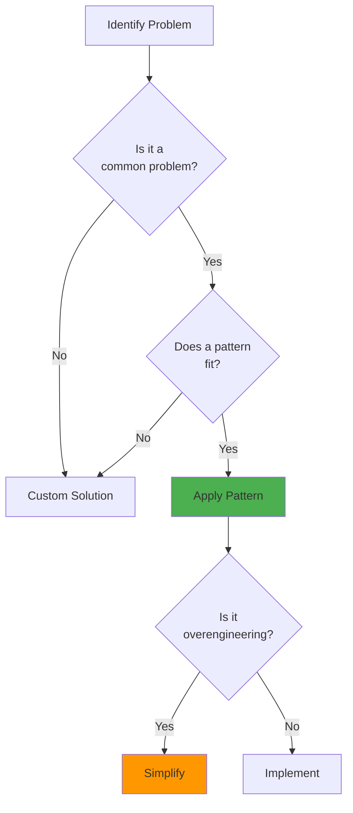

# Design Patterns

Design patterns are reusable solutions to common problems in software design. The Gang of Four (GoF) defined 23 classic patterns in their book "Design Patterns: Elements of Reusable Object-Oriented Software", plus one additional pattern (Interpreter) is often included.



## Pattern Categories

<Cards>
  <Card
    title="Creational Patterns"
    description="Deal with object creation mechanisms"
    href="/docs/architecture/patterns/creational"
  />
  <Card
    title="Structural Patterns"
    description="Deal with object composition"
    href="/docs/architecture/patterns/structural"
  />
  <Card
    title="Behavioral Patterns"
    description="Deal with object communication"
    href="/docs/architecture/patterns/behavioral"
  />
</Cards>

## Quick Reference

| Pattern | Category | Purpose |
|---------|----------|---------|
| Factory Method | Creational | Create objects without specifying exact class |
| Abstract Factory | Creational | Create families of related objects |
| Builder | Creational | Construct complex objects step by step |
| Prototype | Creational | Clone existing objects |
| Singleton | Creational | Ensure single instance |
| Adapter | Structural | Make incompatible interfaces work together |
| Bridge | Structural | Separate abstraction from implementation |
| Composite | Structural | Compose objects into tree structures |
| Decorator | Structural | Add responsibilities dynamically |
| Facade | Structural | Provide simplified interface |
| Flyweight | Structural | Share common state between objects |
| Proxy | Structural | Provide placeholder for another object |
| Chain of Responsibility | Behavioral | Pass request along chain of handlers |
| Command | Behavioral | Encapsulate request as object |
| Interpreter | Behavioral | Define grammar and interpret sentences |
| Iterator | Behavioral | Traverse collection without exposing internals |
| Mediator | Behavioral | Define simplified communication |
| Memento | Behavioral | Capture and restore object state |
| Observer | Behavioral | Notify dependents of state changes |
| State | Behavioral | Alter behavior when state changes |
| Strategy | Behavioral | Define family of interchangeable algorithms |
| Template Method | Behavioral | Define skeleton of algorithm |
| Visitor | Behavioral | Add operations without modifying classes |

## When to Use Design Patterns



## TypeScript Considerations

Since TypeScript supports both functional and object-oriented paradigms, many patterns can be implemented in multiple ways:

```typescript
/**
 * Factory function to create a prefixed logger
 * @description Function-based approach (preferred for simple cases)
 * @param prefix - The prefix to prepend to all log messages
 * @returns A logger object with log and error methods
 */
const createLogger = (prefix: string) => {
  return {
    /** Log an info message with the configured prefix */
    log: (message: string) => console.log(`[${prefix}] ${message}`),
    /** Log an error message with the configured prefix */
    error: (message: string) => console.error(`[${prefix}] ERROR: ${message}`),
  };
};

const logger = createLogger("App");
logger.log("Hello World");
//     ^?
```

For complex scenarios requiring inheritance or polymorphism, consider the patterns in this documentation. Remember: **don't use a pattern just because it exists** – use it when it genuinely solves your problem.
