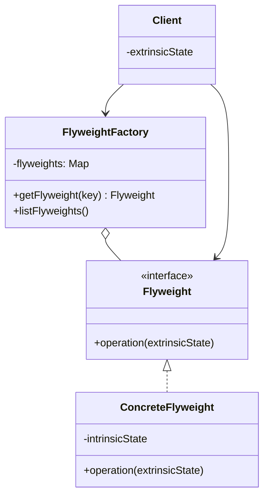
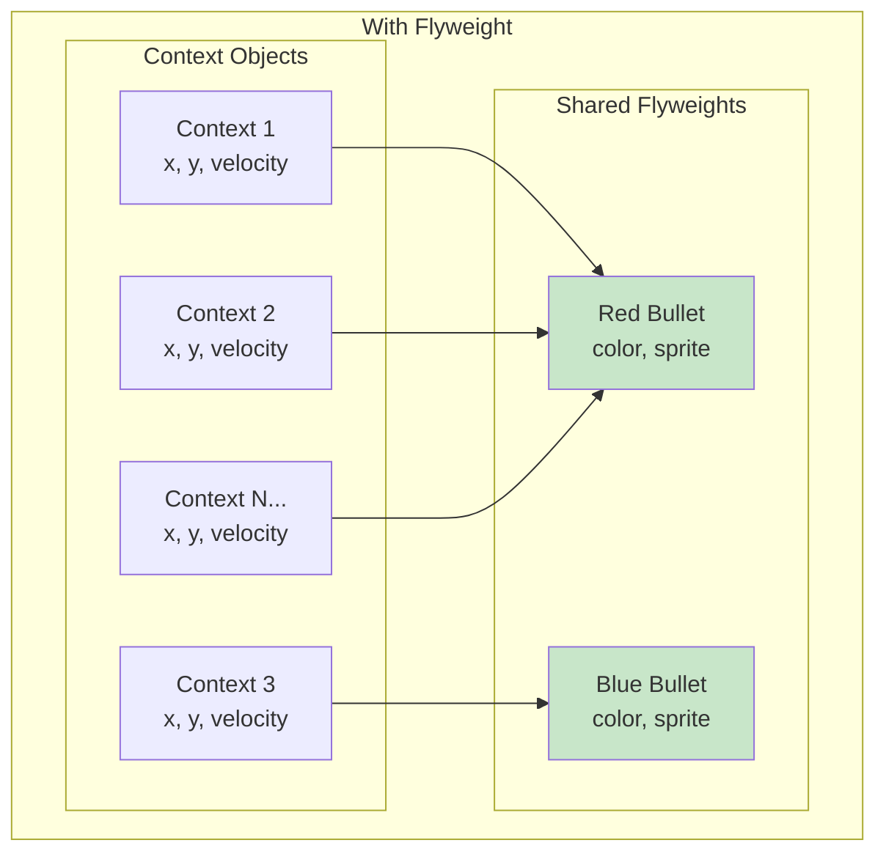
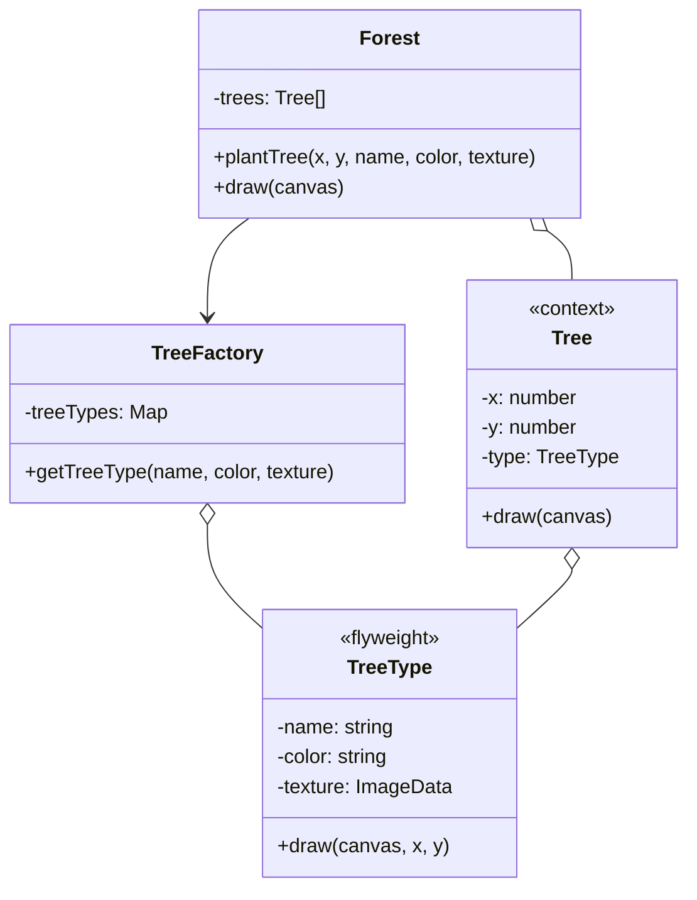

# Flyweight Pattern

## Intent

**Flyweight** is a structural design pattern that lets you fit more objects into the available amount of RAM by sharing common parts of state between multiple objects instead of keeping all of the data in each object.



---

## Problem It Solves

Imagine a game with millions of particles (bullets, shrapnel, trees). Each particle has:
- Position (x, y) - **different for each**
- Velocity - **different for each**  
- Color - **same for many**
- Sprite/Texture - **same for many**

```mermaid
graph TD
    subgraph "Without Flyweight - 1M objects"
        P1[Particle 1<br/>x, y, velocity<br/>color, sprite ❌]
        P2[Particle 2<br/>x, y, velocity<br/>color, sprite ❌]
        P3[Particle N...<br/>x, y, velocity<br/>color, sprite ❌]
    end
    
    style P1 fill:#FFCDD2
    style P2 fill:#FFCDD2
    style P3 fill:#FFCDD2
```



Storing color and sprite data in each of 1 million particles wastes enormous memory!

---

## Solution

Split object data into two parts:

1. **Intrinsic state**: Shared data that doesn't change (color, sprite)
2. **Extrinsic state**: Unique data per object (position, velocity)



Now millions of particles share just a few flyweight objects!

---

## Structure



---

## Implementation

<Tabs items={["Game Particles", "Text Formatting", "Icon System", "Real-World: Map Markers"]}>
  <Tab value="Game Particles">
```typescript
/**
 * Flyweight: Shared particle type data
 * @description Contains intrinsic state shared across many particles
 * This data is immutable and shared to save memory
 */
interface ParticleType {
  /** Unique identifier for this particle type */
  readonly id: string;
  /** Display color (shared) */
  readonly color: string;
  /** Size in pixels (shared) */
  readonly size: number;
  /** Sprite/texture data (shared - would be large in real app) */
  readonly sprite: string;
  /** Render the particle at given position */
  readonly render: (ctx: CanvasContext, x: number, y: number) => void;
}

/**
 * Context: Individual particle instance
 * @description Contains extrinsic state unique to each particle
 */
interface Particle {
  /** X position (unique per particle) */
  x: number;
  /** Y position (unique per particle) */
  y: number;
  /** X velocity (unique per particle) */
  velocityX: number;
  /** Y velocity (unique per particle) */
  velocityY: number;
  /** Reference to shared flyweight */
  type: ParticleType;
  /** Update particle position */
  update: (deltaTime: number) => void;
  /** Render particle */
  render: (ctx: CanvasContext) => void;
}

interface CanvasContext {
  fillStyle: string;
  fillRect: (x: number, y: number, width: number, height: number) => void;
  drawImage: (sprite: string, x: number, y: number, size: number) => void;
}

/**
 * Flyweight Factory: Creates and caches particle types
 * @description Ensures each unique particle type exists only once
 */
interface ParticleTypeFactory {
  /** Get or create a particle type */
  getType: (color: string, size: number, sprite: string) => ParticleType;
  /** Get number of cached types */
  getTypeCount: () => number;
  /** Get memory savings statistics */
  getStats: () => { types: number; wouldBeSize: number; actualSize: number; saved: number };
}

const createParticleTypeFactory = (): ParticleTypeFactory => {
  const types = new Map<string, ParticleType>();
  let particleCount = 0;

  const getKey = (color: string, size: number, sprite: string) => 
    `${color}-${size}-${sprite}`;

  return {
    getType: (color, size, sprite) => {
      const key = getKey(color, size, sprite);
      
      if (!types.has(key)) {
        const type: ParticleType = {
          id: key,
          color,
          size,
          sprite,
          render: (ctx, x, y) => {
            ctx.fillStyle = color;
            ctx.fillRect(x - size / 2, y - size / 2, size, size);
          },
        };
        types.set(key, type);
      }
      
      particleCount++;
      return types.get(key)!;
    },

    getTypeCount: () => types.size,

    getStats: () => {
      // Estimate: each type has ~100 bytes of data (color, size, sprite reference)
      const typeDataSize = 100;
      // Without flyweight, each particle would store this data
      const wouldBeSize = particleCount * typeDataSize;
      // With flyweight, we only store it once per type
      const actualSize = types.size * typeDataSize;
      
      return {
        types: types.size,
        wouldBeSize,
        actualSize,
        saved: wouldBeSize - actualSize,
      };
    },
  };
};

/**
 * Create a particle with shared type
 */
const createParticle = (
  x: number,
  y: number,
  velocityX: number,
  velocityY: number,
  type: ParticleType
): Particle => ({
  x,
  y,
  velocityX,
  velocityY,
  type,
  update: function(deltaTime) {
    this.x += this.velocityX * deltaTime;
    this.y += this.velocityY * deltaTime;
  },
  render: function(ctx) {
    this.type.render(ctx, this.x, this.y);
  },
});

/**
 * Particle system managing many particles efficiently
 */
interface ParticleSystem {
  /** Spawn particles of a type */
  spawn: (count: number, config: { x: number; y: number; color: string; size: number; sprite: string }) => void;
  /** Update all particles */
  update: (deltaTime: number) => void;
  /** Render all particles */
  render: (ctx: CanvasContext) => void;
  /** Get system statistics */
  getStats: () => { particles: number; types: number; memorySaved: number };
}

const createParticleSystem = (): ParticleSystem => {
  const factory = createParticleTypeFactory();
  const particles: Particle[] = [];

  return {
    spawn: (count, { x, y, color, size, sprite }) => {
      const type = factory.getType(color, size, sprite);
      
      for (let i = 0; i < count; i++) {
        const angle = Math.random() * Math.PI * 2;
        const speed = Math.random() * 100 + 50;
        
        particles.push(createParticle(
          x,
          y,
          Math.cos(angle) * speed,
          Math.sin(angle) * speed,
          type
        ));
      }
    },

    update: (deltaTime) => {
      for (const particle of particles) {
        particle.update(deltaTime);
      }
    },

    render: (ctx) => {
      for (const particle of particles) {
        particle.render(ctx);
      }
    },

    getStats: () => {
      const factoryStats = factory.getStats();
      return {
        particles: particles.length,
        types: factoryStats.types,
        memorySaved: factoryStats.saved,
      };
    },
  };
};

// Usage - spawn millions of particles efficiently
const system = createParticleSystem();

// Spawn 10,000 red particles - all share ONE ParticleType
system.spawn(10000, { x: 100, y: 100, color: "red", size: 4, sprite: "circle" });

// Spawn 10,000 blue particles - all share ONE ParticleType  
system.spawn(10000, { x: 200, y: 200, color: "blue", size: 4, sprite: "circle" });

// Spawn 10,000 green particles - all share ONE ParticleType
system.spawn(10000, { x: 300, y: 300, color: "green", size: 6, sprite: "square" });

const stats = system.getStats();
//    ^?
console.log(`Particles: ${stats.particles}`);
console.log(`Unique types: ${stats.types}`);
console.log(`Memory saved: ${stats.memorySaved} bytes`);
```
  </Tab>
  <Tab value="Text Formatting">
```ts
/**
 * Flyweight: Character style
 * @description Shared formatting data for text characters
 */
interface CharacterStyle {
  readonly fontFamily: string;
  readonly fontSize: number;
  readonly fontWeight: "normal" | "bold";
  readonly fontStyle: "normal" | "italic";
  readonly color: string;
  readonly backgroundColor?: string;
}

/**
 * Context: Formatted character
 * @description Individual character with position and shared style
 */
interface FormattedCharacter {
  readonly char: string;
  readonly position: { line: number; column: number };
  readonly style: CharacterStyle;
}

/**
 * Style Factory: Manages shared character styles
 */
interface StyleFactory {
  getStyle: (options: CharacterStyle) => CharacterStyle;
  getStyleCount: () => number;
}

const createStyleFactory = (): StyleFactory => {
  const styles = new Map<string, CharacterStyle>();

  const getKey = (s: CharacterStyle) => 
    `${s.fontFamily}-${s.fontSize}-${s.fontWeight}-${s.fontStyle}-${s.color}-${s.backgroundColor || "none"}`;

  return {
    getStyle: (options) => {
      const key = getKey(options);
      
      if (!styles.has(key)) {
        // Freeze to ensure immutability
        styles.set(key, Object.freeze({ ...options }));
      }
      
      return styles.get(key)!;
    },
    getStyleCount: () => styles.size,
  };
};

/**
 * Rich Text Document using Flyweight pattern
 */
interface RichTextDocument {
  /** Insert character with style */
  insert: (char: string, line: number, column: number, style: CharacterStyle) => void;
  /** Get character at position */
  getCharAt: (line: number, column: number) => FormattedCharacter | undefined;
  /** Render document to string */
  render: () => string;
  /** Get memory statistics */
  getStats: () => { characters: number; uniqueStyles: number };
}

const createRichTextDocument = (): RichTextDocument => {
  const factory = createStyleFactory();
  const characters: FormattedCharacter[] = [];

  return {
    insert: (char, line, column, style) => {
      // Get or create shared style
      const sharedStyle = factory.getStyle(style);
      
      characters.push({
        char,
        position: { line, column },
        style: sharedStyle,
      });
    },

    getCharAt: (line, column) => {
      return characters.find(
        c => c.position.line === line && c.position.column === column
      );
    },

    render: () => {
      // Sort by position and render
      const sorted = [...characters].sort((a, b) => {
        if (a.position.line !== b.position.line) {
          return a.position.line - b.position.line;
        }
        return a.position.column - b.position.column;
      });

      let result = "";
      let currentLine = 0;

      for (const char of sorted) {
        while (currentLine < char.position.line) {
          result += "\n";
          currentLine++;
        }
        result += char.char;
      }

      return result;
    },

    getStats: () => ({
      characters: characters.length,
      uniqueStyles: factory.getStyleCount(),
    }),
  };
};

// Usage
const doc = createRichTextDocument();

// Normal style - shared across many characters
const normalStyle: CharacterStyle = {
  fontFamily: "Arial",
  fontSize: 12,
  fontWeight: "normal",
  fontStyle: "normal",
  color: "#000000",
};

// Bold style - shared across bold characters
const boldStyle: CharacterStyle = {
  fontFamily: "Arial",
  fontSize: 12,
  fontWeight: "bold",
  fontStyle: "normal",
  color: "#000000",
};

// Insert text "Hello World" - mostly normal, "World" is bold
const text = "Hello ";
for (let i = 0; i < text.length; i++) {
  doc.insert(text[i], 0, i, normalStyle);
}

const boldText = "World";
for (let i = 0; i < boldText.length; i++) {
  doc.insert(boldText[i], 0, text.length + i, boldStyle);
}

console.log(doc.render()); // "Hello World"
console.log(doc.getStats()); // { characters: 11, uniqueStyles: 2 }
```
  </Tab>
  <Tab value="Icon System">
```ts
/**
 * Flyweight: Icon definition
 * @description Shared icon data (SVG, colors, size)
 */
interface IconDefinition {
  readonly name: string;
  readonly svgPath: string;
  readonly viewBox: string;
  readonly defaultSize: number;
}

/**
 * Context: Icon instance with specific styling
 */
interface IconInstance {
  readonly definition: IconDefinition;
  readonly size: number;
  readonly color: string;
  readonly className?: string;
  render: () => string;
}

/**
 * Icon Registry: Flyweight factory for icons
 */
interface IconRegistry {
  /** Register an icon definition */
  register: (name: string, svgPath: string, viewBox?: string) => void;
  /** Get icon definition */
  get: (name: string) => IconDefinition | undefined;
  /** Create icon instance */
  createInstance: (name: string, options?: { size?: number; color?: string; className?: string }) => IconInstance;
  /** List all registered icons */
  list: () => string[];
  /** Get registry stats */
  getStats: () => { definitions: number; instances: number };
}

const createIconRegistry = (): IconRegistry => {
  const definitions = new Map<string, IconDefinition>();
  let instanceCount = 0;

  return {
    register: (name, svgPath, viewBox = "0 0 24 24") => {
      if (!definitions.has(name)) {
        definitions.set(name, Object.freeze({
          name,
          svgPath,
          viewBox,
          defaultSize: 24,
        }));
      }
    },

    get: (name) => definitions.get(name),

    createInstance: (name, options = {}) => {
      const definition = definitions.get(name);
      if (!definition) {
        throw new Error(`Icon "${name}" not found`);
      }

      instanceCount++;

      const { size = definition.defaultSize, color = "currentColor", className } = options;

      return {
        definition,
        size,
        color,
        className,
        render: () => `
          <svg 
            width="${size}" 
            height="${size}" 
            viewBox="${definition.viewBox}"
            class="${className || ""}"
            fill="${color}"
          >
            <path d="${definition.svgPath}" />
          </svg>
        `.trim(),
      };
    },

    list: () => [...definitions.keys()],

    getStats: () => ({
      definitions: definitions.size,
      instances: instanceCount,
    }),
  };
};

// Usage
const icons = createIconRegistry();

// Register icon definitions once (flyweights)
icons.register("home", "M10 20v-6h4v6h5v-8h3L12 3 2 12h3v8z");
icons.register("settings", "M19.14 12.94c.04-.31.06-.63.06-.94s-.02-.63-.06-.94l2.03-1.58...");
icons.register("user", "M12 12c2.21 0 4-1.79 4-4s-1.79-4-4-4-4 1.79-4 4 1.79 4 4 4zm0 2c-2.67...");
icons.register("search", "M15.5 14h-.79l-.28-.27C15.41 12.59 16 11.11 16 9.5 16 5.91 13.09 3...");

// Create many instances - all share the same SVG data
const homeIcon1 = icons.createInstance("home", { size: 16, color: "#333" });
const homeIcon2 = icons.createInstance("home", { size: 24, color: "#666" });
const homeIcon3 = icons.createInstance("home", { size: 32, color: "#999" });

const settingsIcon = icons.createInstance("settings", { size: 20 });
const userIcons = Array.from({ length: 100 }, () => 
  icons.createInstance("user", { size: 40, color: "#007bff" })
);

console.log(homeIcon1.render());

const stats = icons.getStats();
console.log(`Definitions: ${stats.definitions}`); // 4 (shared)
console.log(`Instances: ${stats.instances}`); // 104 (but sharing definition data)
```
  </Tab>
  <Tab value="Real-World: Map Markers">
```ts
/**
 * Flyweight: Marker style
 * @description Shared visual properties for map markers
 */
interface MarkerStyle {
  readonly type: "restaurant" | "hotel" | "attraction" | "parking" | "hospital";
  readonly icon: string;
  readonly color: string;
  readonly size: number;
  readonly zIndex: number;
}

/**
 * Context: Map marker
 * @description Individual marker with position and shared style
 */
interface MapMarker {
  readonly id: string;
  readonly lat: number;
  readonly lng: number;
  readonly title: string;
  readonly style: MarkerStyle;
  toGeoJSON: () => object;
}

/**
 * Marker Style Factory
 * @description Creates and caches marker styles
 */
interface MarkerStyleFactory {
  getStyle: (type: MarkerStyle["type"]) => MarkerStyle;
  getStyleCount: () => number;
}

const createMarkerStyleFactory = (): MarkerStyleFactory => {
  const styles = new Map<string, MarkerStyle>();

  const styleDefinitions: Record<MarkerStyle["type"], Omit<MarkerStyle, "type">> = {
    restaurant: { icon: "🍽️", color: "#FF5722", size: 32, zIndex: 10 },
    hotel: { icon: "🏨", color: "#2196F3", size: 36, zIndex: 20 },
    attraction: { icon: "⭐", color: "#FFC107", size: 40, zIndex: 30 },
    parking: { icon: "🅿️", color: "#607D8B", size: 28, zIndex: 5 },
    hospital: { icon: "🏥", color: "#F44336", size: 38, zIndex: 100 },
  };

  return {
    getStyle: (type) => {
      if (!styles.has(type)) {
        styles.set(type, Object.freeze({
          type,
          ...styleDefinitions[type],
        }));
      }
      return styles.get(type)!;
    },
    getStyleCount: () => styles.size,
  };
};

/**
 * Map Marker Manager
 * @description Manages thousands of markers efficiently using Flyweight
 */
interface MarkerManager {
  /** Add a marker */
  addMarker: (id: string, lat: number, lng: number, title: string, type: MarkerStyle["type"]) => MapMarker;
  /** Get markers in bounds */
  getMarkersInBounds: (bounds: { north: number; south: number; east: number; west: number }) => MapMarker[];
  /** Get all markers of a type */
  getMarkersByType: (type: MarkerStyle["type"]) => MapMarker[];
  /** Remove marker */
  removeMarker: (id: string) => boolean;
  /** Get statistics */
  getStats: () => { totalMarkers: number; uniqueStyles: number; memoryEstimate: string };
}

const createMarkerManager = (): MarkerManager => {
  const styleFactory = createMarkerStyleFactory();
  const markers = new Map<string, MapMarker>();

  return {
    addMarker: (id, lat, lng, title, type) => {
      const style = styleFactory.getStyle(type);
      
      const marker: MapMarker = {
        id,
        lat,
        lng,
        title,
        style,
        toGeoJSON: () => ({
          type: "Feature",
          geometry: {
            type: "Point",
            coordinates: [lng, lat],
          },
          properties: {
            id,
            title,
            markerType: type,
          },
        }),
      };

      markers.set(id, marker);
      return marker;
    },

    getMarkersInBounds: (bounds) => {
      return [...markers.values()].filter(m =>
        m.lat <= bounds.north &&
        m.lat >= bounds.south &&
        m.lng <= bounds.east &&
        m.lng >= bounds.west
      );
    },

    getMarkersByType: (type) => {
      return [...markers.values()].filter(m => m.style.type === type);
    },

    removeMarker: (id) => {
      return markers.delete(id);
    },

    getStats: () => {
      const markerCount = markers.size;
      const styleCount = styleFactory.getStyleCount();
      
      // Estimate: Each marker stores ~50 bytes of unique data (id, lat, lng, title ref)
      // Without flyweight: would also store ~100 bytes of style data each
      const uniqueDataPerMarker = 50;
      const styleDataSize = 100;
      
      const withFlyweight = markerCount * uniqueDataPerMarker + styleCount * styleDataSize;
      const withoutFlyweight = markerCount * (uniqueDataPerMarker + styleDataSize);
      const saved = withoutFlyweight - withFlyweight;

      return {
        totalMarkers: markerCount,
        uniqueStyles: styleCount,
        memoryEstimate: `Saved ~${Math.round(saved / 1024)}KB (${Math.round(saved / withoutFlyweight * 100)}%)`,
      };
    },
  };
};

// Usage - add thousands of markers efficiently
const map = createMarkerManager();

// Add 1000 restaurants - all share ONE style object
for (let i = 0; i < 1000; i++) {
  map.addMarker(
    `restaurant-${i}`,
    40.7 + Math.random() * 0.1,
    -74.0 + Math.random() * 0.1,
    `Restaurant ${i}`,
    "restaurant"
  );
}

// Add 500 hotels - all share ONE style object
for (let i = 0; i < 500; i++) {
  map.addMarker(
    `hotel-${i}`,
    40.7 + Math.random() * 0.1,
    -74.0 + Math.random() * 0.1,
    `Hotel ${i}`,
    "hotel"
  );
}

// Add 200 attractions
for (let i = 0; i < 200; i++) {
  map.addMarker(
    `attraction-${i}`,
    40.7 + Math.random() * 0.1,
    -74.0 + Math.random() * 0.1,
    `Attraction ${i}`,
    "attraction"
  );
}

const stats = map.getStats();
console.log(`Total markers: ${stats.totalMarkers}`); // 1700
console.log(`Unique styles: ${stats.uniqueStyles}`); // 3
console.log(`Memory: ${stats.memoryEstimate}`); // Saved ~166KB (66%)

// Query markers in view
const visible = map.getMarkersInBounds({
  north: 40.75,
  south: 40.70,
  east: -73.95,
  west: -74.00,
});
console.log(`Visible markers: ${visible.length}`);
```
  </Tab>
</Tabs>

---

## When to Use

<Accordions>
  <Accordion title="✅ Use Flyweight when...">
    - **Huge number of objects**: When your application creates millions of similar objects
    
    - **High memory cost**: When objects contain data that can be shared
    
    - **Extrinsic state is small**: When unique state per object is minimal
    
    - **Identity doesn't matter**: When objects can be replaced by shared ones
    
    - **Immutable shared state**: When shared state won't change
  </Accordion>
  
  <Accordion title="❌ Avoid Flyweight when...">
    - **Few objects**: When you don't have memory concerns
    
    - **Objects are unique**: When each object has mostly unique data
    
    - **Mutable shared state**: When shared data needs to change
    
    - **Complexity cost**: When the pattern adds more complexity than it saves
  </Accordion>
</Accordions>

---

## Intrinsic vs Extrinsic State

| Intrinsic (Shared) | Extrinsic (Unique) |
|--------------------|-------------------|
| Constant across objects | Varies per object |
| Stored in flyweight | Stored in context |
| Immutable | Can be mutable |
| Example: texture, color | Example: position, velocity |

---

## Real-World Applications

| Application | Flyweight Usage |
|-------------|-----------------|
| **Game engines** | Particle systems, tiles, sprites |
| **Text editors** | Character formatting |
| **Mapping apps** | Map markers, tiles |
| **Browsers** | DOM node styles |
| **String interning** | Shared string instances |

---

## Summary

<Callout type="info">
  **Key Takeaway**: Flyweight lets you fit more objects into memory by sharing common data. Split state into intrinsic (shared) and extrinsic (unique), and use a factory to manage shared instances.
</Callout>

### Pros
- ✅ Saves significant memory with many objects
- ✅ Can improve cache performance
- ✅ Reduces object creation overhead

### Cons
- ❌ Adds complexity to code
- ❌ Runtime cost of looking up flyweights
- ❌ Makes code harder to understand
- ❌ Thread safety concerns with shared state
