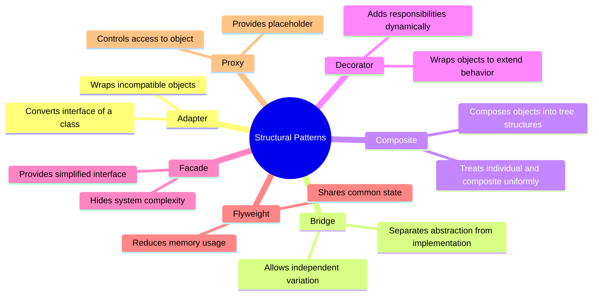
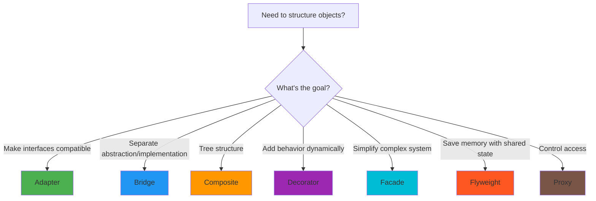
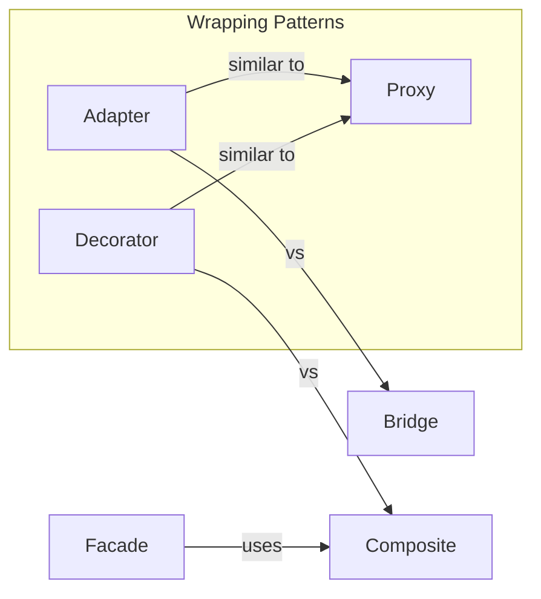

# Structural Patterns

Structural design patterns explain how to assemble objects and classes into larger structures while keeping these structures flexible and efficient.

## The Patterns

<Cards>
  <Card
    title="Adapter"
    description="Convert the interface of a class into another interface clients expect"
    href="/docs/architecture/patterns/structural/adapter"
  />
  <Card
    title="Bridge"
    description="Decouple an abstraction from its implementation so both can vary independently"
    href="/docs/architecture/patterns/structural/bridge"
  />
  <Card
    title="Composite"
    description="Compose objects into tree structures to represent part-whole hierarchies"
    href="/docs/architecture/patterns/structural/composite"
  />
  <Card
    title="Decorator"
    description="Attach additional responsibilities to an object dynamically"
    href="/docs/architecture/patterns/structural/decorator"
  />
  <Card
    title="Facade"
    description="Provide a unified interface to a set of interfaces in a subsystem"
    href="/docs/architecture/patterns/structural/facade"
  />
  <Card
    title="Flyweight"
    description="Use sharing to support large numbers of fine-grained objects efficiently"
    href="/docs/architecture/patterns/structural/flyweight"
  />
  <Card
    title="Proxy"
    description="Provide a surrogate or placeholder for another object to control access"
    href="/docs/architecture/patterns/structural/proxy"
  />
</Cards>

## Quick Comparison

| Pattern | Intent | Complexity | Frequency |
|---------|--------|------------|-----------|
| Adapter | Make incompatible interfaces work together | ⭐⭐ | Very Common |
| Bridge | Separate abstraction from implementation | ⭐⭐⭐ | Common |
| Composite | Compose objects into trees | ⭐⭐ | Common |
| Decorator | Add responsibilities dynamically | ⭐⭐ | Common |
| Facade | Simplify complex subsystems | ⭐ | Very Common |
| Flyweight | Share common state efficiently | ⭐⭐⭐ | Less Common |
| Proxy | Control access to objects | ⭐⭐ | Common |

## When to Use Which?

## Key Relationships

