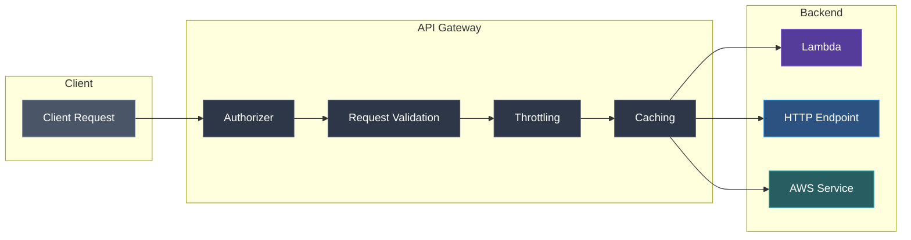
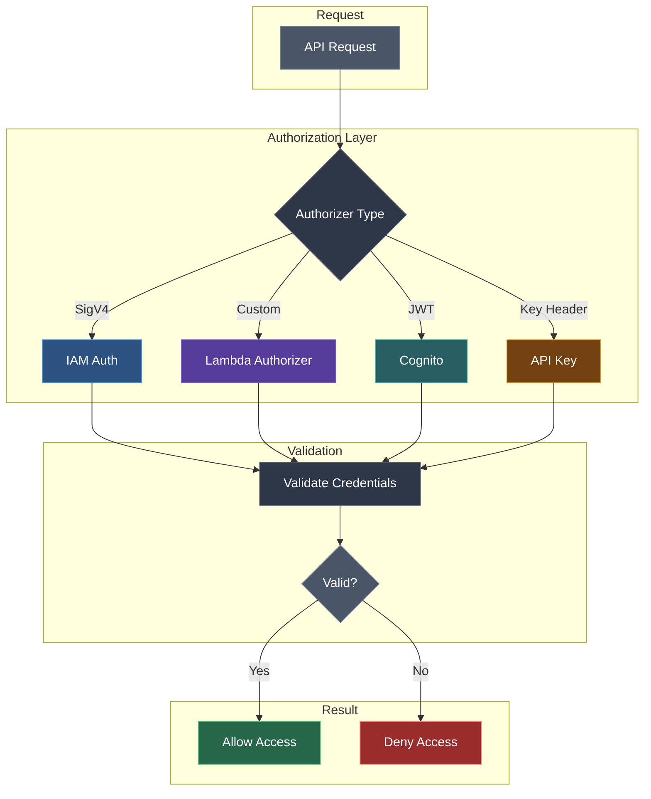

Amazon API Gateway is a fully managed service that makes it easy for developers to create, publish, maintain, monitor, and secure APIs.

<Callout type="info" title="API Gateway Types">
Choose the right API type based on your use case. HTTP APIs are ~70% cheaper but have fewer features.
</Callout>

## API Types

| Type | Use Case | Features |
|------|----------|----------|
| **REST API** | Traditional REST APIs | Full feature set, caching, WAF |
| **HTTP API** | Simple HTTP APIs | Lower cost, faster, simpler |
| **WebSocket API** | Real-time communication | Two-way communication |

## Request Flow Architecture



## Key Concepts

### Resources and Methods
APIs are organized as resources (paths) with methods (HTTP verbs).

```text title="REST API Structure"
/users          GET    → List users
/users          POST   → Create user
/users/{id}     GET    → Get user
/users/{id}     PUT    → Update user
/users/{id}     DELETE → Delete user
```

### Stages
Deployment environments for your API:
- `dev` - Development
- `staging` - Testing
- `prod` - Production

### Integrations
Connect API methods to backend services:

| Type | Description |
|------|-------------|
| **Lambda** | Invoke Lambda functions |
| **HTTP** | Proxy to HTTP endpoints |
| **AWS Service** | Integrate with AWS services |
| **Mock** | Return static responses |
| **VPC Link** | Access private resources |

## REST API vs HTTP API

<Tabs items={['Feature Comparison', 'When to Use REST', 'When to Use HTTP']}>
<Tab value="Feature Comparison">
| Feature | REST API | HTTP API |
|---------|----------|----------|
| Cost | Higher | ~70% cheaper |
| Latency | Higher | Lower |
| Caching | Yes | No |
| Request validation | Yes | No |
| WAF integration | Yes | No |
| API keys | Yes | Yes |
| Custom domains | Yes | Yes |
</Tab>
<Tab value="When to Use REST">
- Need API caching
- Require request/response validation
- Need WAF integration
- Complex mapping templates
- Usage plans with quotas
</Tab>
<Tab value="When to Use HTTP">
- Simple proxy to Lambda or HTTP
- Cost-sensitive applications
- Need lower latency
- JWT authorization is sufficient
- No need for caching
</Tab>
</Tabs>

## Lambda Integration

### Lambda Proxy Integration

<Callout type="info">
Lambda Proxy Integration is the most common pattern. API Gateway passes the entire request to Lambda and expects a specific response format.
</Callout>

API Gateway passes the entire request to Lambda:

```javascript title="handler.js"
export const handler = async (event) => {
  const { httpMethod, path, body, queryStringParameters } = event;
  
  return {
    statusCode: 200,
    headers: { "Content-Type": "application/json" },
    body: JSON.stringify({ message: "Hello!" })
  };
};
```

### Request/Response Mapping

Transform requests and responses with mapping templates (Velocity Template Language):

```json title="mapping-template.vtl"
{
  "userId": "$input.path('$.id')",
  "userName": "$input.path('$.name')"
}
```

<Callout type="warn" title="VTL Syntax">
Mapping templates use Apache Velocity Template Language (VTL). Common functions: `$input.path()`, `$input.json()`, `$util.escapeJavaScript()`.
</Callout>

## Authorization

<Callout type="warn" title="Security First">
Always implement proper authorization for production APIs. Never expose APIs without authentication.
</Callout>

### Authorization Flow



<Tabs items={['IAM', 'Lambda Authorizer', 'Cognito', 'API Keys']}>
<Tab value="IAM">
Use AWS credentials to sign requests with Signature Version 4.

```bash title="Signed Request Example"
aws apigateway test-invoke-method \
  --rest-api-id abc123 \
  --resource-id xyz789 \
  --http-method GET
```
</Tab>
<Tab value="Lambda Authorizer">
Custom authorization logic:

```javascript title="authorizer.js"
export const handler = async (event) => {
  const token = event.authorizationToken;
  
  // Validate token
  if (isValid(token)) {
    return generatePolicy('user', 'Allow', event.methodArn);
  }
  
  return generatePolicy('user', 'Deny', event.methodArn);
};
```
</Tab>
<Tab value="Cognito">
Authenticate with Amazon Cognito User Pools. The API validates JWT tokens automatically.

```bash title="Create Cognito Authorizer"
aws apigateway create-authorizer \
  --rest-api-id abc123 \
  --name MyCognitoAuthorizer \
  --type COGNITO_USER_POOLS \
  --provider-arns arn:aws:cognito-idp:us-east-1:123456789012:userpool/us-east-1_xxx
```
</Tab>
<Tab value="API Keys">
Simple key-based access control:

```bash title="Create API Key"
# Create API key
aws apigateway create-api-key \
  --name my-api-key \
  --enabled

# Create usage plan
aws apigateway create-usage-plan \
  --name my-usage-plan \
  --throttle burstLimit=500,rateLimit=1000 \
  --quota limit=10000,period=MONTH
```
</Tab>
</Tabs>

## Request Validation

Validate requests before reaching backend:

```yaml title="openapi-schema.yaml"
components:
  schemas:
    CreateUserRequest:
      type: object
      required:
        - name
        - email
      properties:
        name:
          type: string
          minLength: 1
        email:
          type: string
          format: email
```

<Callout type="info">
Request validation is only available for REST APIs. HTTP APIs require validation in your backend.
</Callout>

## CORS Configuration

Enable Cross-Origin Resource Sharing:

```bash title="Enable CORS"
# For REST API
aws apigateway put-method-response \
  --rest-api-id abc123 \
  --resource-id xyz789 \
  --http-method OPTIONS \
  --status-code 200 \
  --response-parameters '{
    "method.response.header.Access-Control-Allow-Origin": true,
    "method.response.header.Access-Control-Allow-Methods": true,
    "method.response.header.Access-Control-Allow-Headers": true
  }'
```

<Callout type="warn">
For HTTP APIs, CORS can be configured directly in the console or via `--cors-configuration` parameter.
</Callout>

## Throttling

Rate limit API requests:

| Level | Description |
|-------|-------------|
| Account | 10,000 RPS default |
| Stage | Custom per stage |
| Method | Custom per method |
| Usage Plan | Per API key |

```bash title="Configure Stage Throttling"
aws apigateway update-stage \
  --rest-api-id abc123 \
  --stage-name prod \
  --patch-operations '[
    {"op": "replace", "path": "/throttling/rateLimit", "value": "1000"},
    {"op": "replace", "path": "/throttling/burstLimit", "value": "2000"}
  ]'
```

## Caching (REST API)

<Callout type="info">
Caching is only available for REST APIs. Cache sizes range from 0.5 GB to 237 GB.
</Callout>

Cache responses to reduce backend calls:

```bash title="Enable API Caching"
aws apigateway update-stage \
  --rest-api-id abc123 \
  --stage-name prod \
  --patch-operations '[
    {"op": "replace", "path": "/cacheClusterEnabled", "value": "true"},
    {"op": "replace", "path": "/cacheClusterSize", "value": "0.5"}
  ]'
```

## Custom Domain Names

Use your own domain:

```bash title="Create Custom Domain"
aws apigateway create-domain-name \
  --domain-name api.example.com \
  --certificate-arn arn:aws:acm:us-east-1:123456789012:certificate/abc123
```

<Callout type="warn">
For regional endpoints, the certificate must be in the same region. For edge-optimized endpoints, the certificate must be in us-east-1.
</Callout>

## Monitoring

### CloudWatch Metrics
- **Count** - Total API requests
- **Latency** - Request processing time
- **4XXError** - Client errors
- **5XXError** - Server errors
- **CacheHitCount** - Cache hits (REST API)
- **CacheMissCount** - Cache misses (REST API)

### Access Logging

```bash title="Enable Access Logging"
aws apigateway update-stage \
  --rest-api-id abc123 \
  --stage-name prod \
  --patch-operations '[
    {"op": "replace", "path": "/accessLogSettings/destinationArn", "value": "arn:aws:logs:us-east-1:123456789012:log-group:api-logs"},
    {"op": "replace", "path": "/accessLogSettings/format", "value": "$requestId $httpMethod $resourcePath $status"}
  ]'
```

## Best Practices

<Steps>
<Step>
### Security
1. Use HTTPS only
2. Enable authentication
3. Implement request validation
4. Use WAF for REST APIs
5. Rotate API keys regularly
</Step>
<Step>
### Performance
1. Enable caching for GET requests
2. Use HTTP APIs for simple use cases
3. Minimize integration latency
4. Use regional endpoints
</Step>
<Step>
### Cost Optimization
1. Choose HTTP API when possible
2. Right-size cache
3. Use usage plans for rate limiting
4. Monitor and optimize
</Step>
</Steps>

## Next Steps

<Cards>
  <Card title="API Gateway CLI Reference" href="/docs/aws/api-gateway/cli" description="Complete CLI commands" />
  <Card title="SNS" href="/docs/aws/sns" description="Simple Notification Service" />
</Cards>
