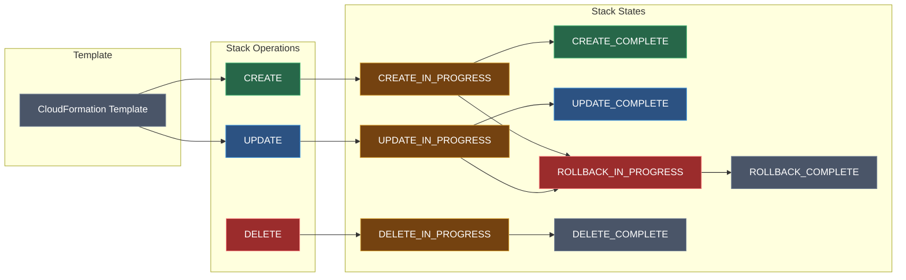
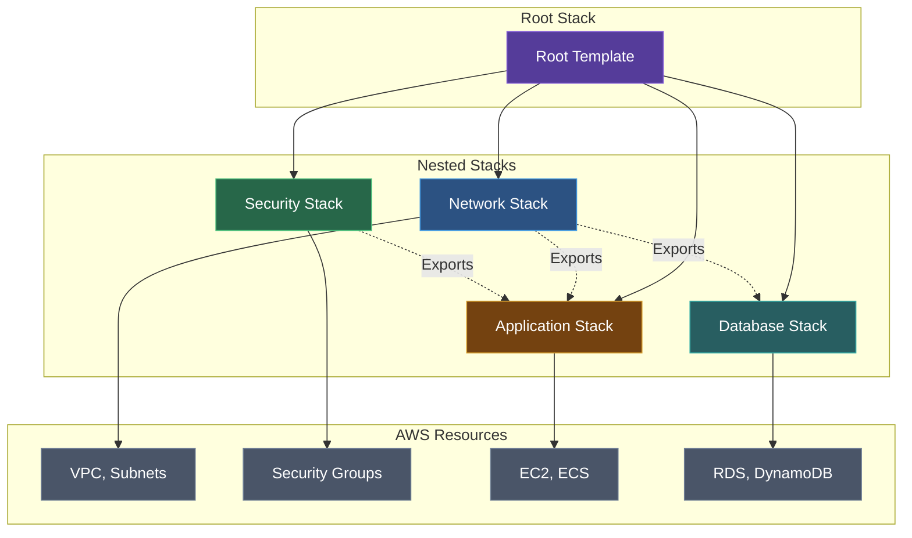

AWS CloudFormation enables you to model, provision, and manage AWS resources using infrastructure as code (IaC).

## Why CloudFormation?

| Benefit | Description |
|---------|-------------|
| **Automation** | Provision resources automatically |
| **Consistency** | Same template = same infrastructure |
| **Version Control** | Track infrastructure changes in Git |
| **Rollback** | Automatic rollback on failure |
| **Cost Tracking** | Tag resources for billing |

## Stack Lifecycle



## Template Structure

### YAML Format (Recommended)

```yaml
AWSTemplateFormatVersion: '2010-09-09'
Description: My CloudFormation Template

Parameters:
  Environment:
    Type: String
    Default: dev
    AllowedValues:
      - dev
      - staging
      - prod

Mappings:
  RegionMap:
    us-east-1:
      AMI: ami-12345678

Conditions:
  IsProduction: !Equals [!Ref Environment, prod]

Resources:
  MyBucket:
    Type: AWS::S3::Bucket
    Properties:
      BucketName: !Sub my-bucket-${Environment}

Outputs:
  BucketName:
    Value: !Ref MyBucket
    Export:
      Name: MyBucketName
```

## Template Sections

### Parameters

Accept input values at runtime:

```yaml
Parameters:
  InstanceType:
    Type: String
    Default: t3.micro
    AllowedValues:
      - t3.micro
      - t3.small
      - t3.medium
    Description: EC2 instance type

  DatabasePassword:
    Type: String
    NoEcho: true
    MinLength: 8
    Description: Database password
```

**Parameter Types:**
- `String`
- `Number`
- `List<Number>`
- `CommaDelimitedList`
- `AWS::SSM::Parameter::Value<String>`
- AWS-specific types (VPC ID, Subnet ID, etc.)

### Mappings

Static lookup tables:

```yaml
Mappings:
  EnvironmentConfig:
    dev:
      InstanceType: t3.micro
      MinSize: 1
    prod:
      InstanceType: t3.large
      MinSize: 3

Resources:
  Instance:
    Type: AWS::EC2::Instance
    Properties:
      InstanceType: !FindInMap [EnvironmentConfig, !Ref Environment, InstanceType]
```

### Conditions

Conditional resource creation:

```yaml
Conditions:
  CreateProdResources: !Equals [!Ref Environment, prod]
  UseMultiAZ: !Or
    - !Equals [!Ref Environment, prod]
    - !Equals [!Ref Environment, staging]

Resources:
  ProdOnlyBucket:
    Type: AWS::S3::Bucket
    Condition: CreateProdResources
```

### Resources

Define AWS resources:

```yaml
Resources:
  VPC:
    Type: AWS::EC2::VPC
    Properties:
      CidrBlock: 10.0.0.0/16
      Tags:
        - Key: Name
          Value: MyVPC

  Subnet:
    Type: AWS::EC2::Subnet
    DependsOn: VPC
    Properties:
      VpcId: !Ref VPC
      CidrBlock: 10.0.1.0/24
```

### Outputs

Export values for cross-stack references:

```yaml
Outputs:
  VPCId:
    Description: VPC ID
    Value: !Ref VPC
    Export:
      Name: !Sub ${AWS::StackName}-VPCId

  # Import in another stack
  # !ImportValue stack-name-VPCId
```

## Intrinsic Functions

| Function | Description | Example |
|----------|-------------|---------|
| `!Ref` | Reference parameter or resource | `!Ref MyBucket` |
| `!GetAtt` | Get resource attribute | `!GetAtt MyBucket.Arn` |
| `!Sub` | String substitution | `!Sub arn:aws:s3:::${BucketName}` |
| `!Join` | Join strings | `!Join ['-', [a, b, c]]` |
| `!Split` | Split string | `!Split [',', 'a,b,c']` |
| `!Select` | Select from list | `!Select [0, !Ref MyList]` |
| `!If` | Conditional value | `!If [IsProd, t3.large, t3.micro]` |
| `!Equals` | Compare values | `!Equals [!Ref Env, prod]` |
| `!And` / `!Or` | Logical operators | `!And [Cond1, Cond2]` |
| `!Not` | Logical not | `!Not [!Equals [!Ref Env, dev]]` |
| `!FindInMap` | Look up in mappings | `!FindInMap [Map, Key1, Key2]` |
| `!ImportValue` | Import from other stack | `!ImportValue VPCId` |
| `!Base64` | Encode to Base64 | `!Base64 !Ref Script` |

## Pseudo Parameters

Built-in parameters available in all templates:

| Parameter | Description |
|-----------|-------------|
| `AWS::AccountId` | Current account ID |
| `AWS::Region` | Current region |
| `AWS::StackName` | Stack name |
| `AWS::StackId` | Stack ID |
| `AWS::NoValue` | Remove property |
| `AWS::URLSuffix` | Domain suffix (amazonaws.com) |

```yaml
Resources:
  Bucket:
    Type: AWS::S3::Bucket
    Properties:
      BucketName: !Sub my-bucket-${AWS::AccountId}-${AWS::Region}
```

## Resource Attributes

### DependsOn

Explicit dependency:

```yaml
Resources:
  Database:
    Type: AWS::RDS::DBInstance
    DependsOn: VPCGatewayAttachment
```

### DeletionPolicy

Control what happens when resource is deleted:

```yaml
Resources:
  Database:
    Type: AWS::RDS::DBInstance
    DeletionPolicy: Snapshot  # Retain, Delete, Snapshot
```

### UpdateReplacePolicy

Control updates that require replacement:

```yaml
Resources:
  Database:
    Type: AWS::RDS::DBInstance
    UpdateReplacePolicy: Snapshot
```

### CreationPolicy

Wait for resource to be ready:

```yaml
Resources:
  AutoScalingGroup:
    Type: AWS::AutoScaling::AutoScalingGroup
    CreationPolicy:
      ResourceSignal:
        Count: 2
        Timeout: PT15M
```

### UpdatePolicy

Control rolling updates:

```yaml
Resources:
  AutoScalingGroup:
    Type: AWS::AutoScaling::AutoScalingGroup
    UpdatePolicy:
      AutoScalingRollingUpdate:
        MaxBatchSize: 1
        MinInstancesInService: 1
```

## Nested Stacks

Modularize templates:



```yaml
Resources:
  NetworkStack:
    Type: AWS::CloudFormation::Stack
    Properties:
      TemplateURL: https://s3.amazonaws.com/bucket/network.yaml
      Parameters:
        Environment: !Ref Environment

  AppStack:
    Type: AWS::CloudFormation::Stack
    DependsOn: NetworkStack
    Properties:
      TemplateURL: https://s3.amazonaws.com/bucket/app.yaml
      Parameters:
        VPCId: !GetAtt NetworkStack.Outputs.VPCId
```

## Change Sets

Preview changes before applying:

```bash
# Create change set
aws cloudformation create-change-set \
  --stack-name my-stack \
  --change-set-name my-change-set \
  --template-body file://template.yaml

# View changes
aws cloudformation describe-change-set \
  --stack-name my-stack \
  --change-set-name my-change-set

# Execute if approved
aws cloudformation execute-change-set \
  --stack-name my-stack \
  --change-set-name my-change-set
```

## Stack Policies

Protect resources from updates:

```json
{
  "Statement": [
    {
      "Effect": "Deny",
      "Principal": "*",
      "Action": "Update:Replace",
      "Resource": "LogicalResourceId/Database"
    },
    {
      "Effect": "Allow",
      "Principal": "*",
      "Action": "Update:*",
      "Resource": "*"
    }
  ]
}
```

## CloudFormation StackSets

Deploy to multiple accounts/regions:

```bash
aws cloudformation create-stack-set \
  --stack-set-name my-stack-set \
  --template-body file://template.yaml \
  --permission-model SERVICE_MANAGED \
  --auto-deployment Enabled=true,RetainStacksOnAccountRemoval=false

aws cloudformation create-stack-instances \
  --stack-set-name my-stack-set \
  --deployment-targets OrganizationalUnitIds=ou-123abc \
  --regions us-east-1 us-west-2
```

## Best Practices

### Template Organization
1. Use nested stacks for modularity
2. Separate network, security, and application resources
3. Use consistent naming conventions
4. Add meaningful descriptions

### Security
1. Never hardcode secrets
2. Use NoEcho for sensitive parameters
3. Reference Secrets Manager / SSM Parameter Store
4. Use least privilege IAM roles

### Reliability
1. Use DeletionPolicy for stateful resources
2. Implement proper rollback strategies
3. Test templates in non-production first
4. Use change sets for production updates

### Maintenance
1. Version control templates
2. Use CloudFormation Drift Detection
3. Tag resources for cost tracking
4. Document dependencies

## Next Steps

<Cards>
  <Card title="CloudFormation CLI Reference" href="/docs/aws/cloudformation/cli" description="Complete CLI commands" />
  <Card title="CloudWatch" href="/docs/aws/cloudwatch" description="Monitoring and Observability" />
</Cards>
