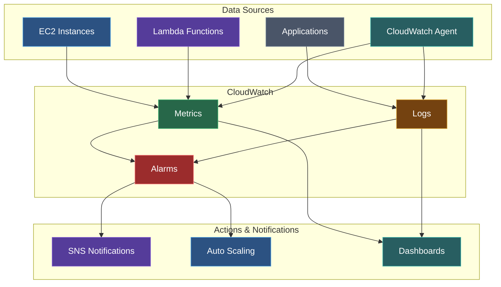
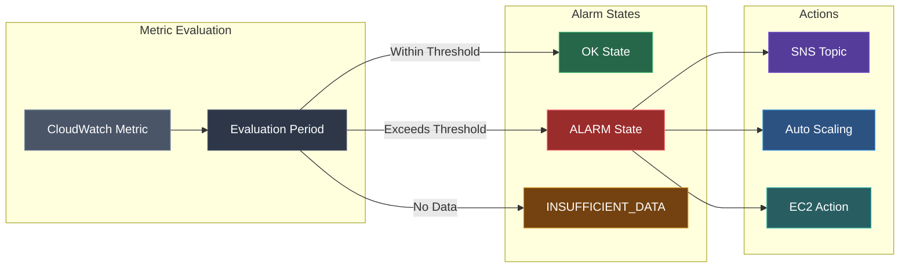

Amazon CloudWatch provides monitoring for AWS resources and applications. Collect metrics, logs, and events for complete observability.

## CloudWatch Components

| Component | Purpose |
|-----------|---------|
| **Metrics** | Numerical data points over time |
| **Logs** | Application and system logs |
| **Alarms** | Automated actions based on metrics |
| **Events/EventBridge** | React to changes in AWS resources |
| **Dashboards** | Visualize metrics |
| **Insights** | Query and analyze logs |
| **Synthetics** | Canary monitoring |

## CloudWatch Architecture



## Metrics

### Namespaces

Metrics are organized by namespace:

| Namespace | Service |
|-----------|---------|
| `AWS/EC2` | EC2 instances |
| `AWS/Lambda` | Lambda functions |
| `AWS/RDS` | RDS databases |
| `AWS/S3` | S3 buckets |
| `AWS/ELB` | Load balancers |
| `Custom` | Your custom metrics |

### Dimensions

Filter metrics by dimensions:

```bash
aws cloudwatch get-metric-statistics \
  --namespace AWS/EC2 \
  --metric-name CPUUtilization \
  --dimensions Name=InstanceId,Value=i-1234567890abcdef0 \
  --start-time 2024-01-01T00:00:00Z \
  --end-time 2024-01-01T01:00:00Z \
  --period 300 \
  --statistics Average
```

### Resolution

| Type | Period | Retention |
|------|--------|-----------|
| Standard | 1 minute | 15 days |
| High Resolution | 1 second | 3 hours |
| Aggregated | 5 minutes | 63 days |
| Aggregated | 1 hour | 15 months |

### Custom Metrics

Publish your own metrics:

```javascript
import { CloudWatch } from '@aws-sdk/client-cloudwatch';

const cloudwatch = new CloudWatch({});

await cloudwatch.putMetricData({
  Namespace: 'MyApp',
  MetricData: [
    {
      MetricName: 'RequestCount',
      Value: 1,
      Unit: 'Count',
      Dimensions: [
        { Name: 'Environment', Value: 'prod' },
        { Name: 'Endpoint', Value: '/api/users' }
      ]
    }
  ]
});
```

### Metric Math

Perform calculations on metrics:

```json
{
  "metrics": [
    ["AWS/EC2", "CPUUtilization", "InstanceId", "i-123", { "id": "m1" }],
    ["AWS/EC2", "CPUUtilization", "InstanceId", "i-456", { "id": "m2" }],
    [{ "expression": "AVG([m1, m2])", "label": "Average CPU", "id": "e1" }]
  ]
}
```

## Alarms

### Alarm States

| State | Description |
|-------|-------------|
| `OK` | Metric within threshold |
| `ALARM` | Metric breached threshold |
| `INSUFFICIENT_DATA` | Not enough data |

### Alarm Flow



### Create Alarm

```bash
aws cloudwatch put-metric-alarm \
  --alarm-name high-cpu-alarm \
  --alarm-description "CPU exceeds 80%" \
  --namespace AWS/EC2 \
  --metric-name CPUUtilization \
  --dimensions Name=InstanceId,Value=i-1234567890abcdef0 \
  --statistic Average \
  --period 300 \
  --threshold 80 \
  --comparison-operator GreaterThanThreshold \
  --evaluation-periods 2 \
  --alarm-actions arn:aws:sns:us-east-1:123456789012:alerts \
  --ok-actions arn:aws:sns:us-east-1:123456789012:alerts
```

### Composite Alarms

Combine multiple alarms:

```bash
aws cloudwatch put-composite-alarm \
  --alarm-name composite-alarm \
  --alarm-rule "ALARM(high-cpu) AND ALARM(high-memory)" \
  --alarm-actions arn:aws:sns:us-east-1:123456789012:critical-alerts
```

### Anomaly Detection

Automatically detect anomalies:

```bash
aws cloudwatch put-anomaly-detector \
  --namespace AWS/EC2 \
  --metric-name CPUUtilization \
  --dimensions Name=InstanceId,Value=i-1234567890abcdef0 \
  --stat Average
```

## CloudWatch Logs

### Log Groups and Streams

```
Log Group: /aws/lambda/my-function
├── Log Stream: 2024/01/01/[$LATEST]abc123
├── Log Stream: 2024/01/01/[$LATEST]def456
└── Log Stream: 2024/01/02/[$LATEST]ghi789
```

### Create Log Group

```bash
aws logs create-log-group --log-group-name /my-app/production

# Set retention
aws logs put-retention-policy \
  --log-group-name /my-app/production \
  --retention-in-days 30
```

### Write Logs

```javascript
import { CloudWatchLogs } from '@aws-sdk/client-cloudwatch-logs';

const logs = new CloudWatchLogs({});

await logs.putLogEvents({
  logGroupName: '/my-app/production',
  logStreamName: 'app-server-1',
  logEvents: [
    {
      timestamp: Date.now(),
      message: JSON.stringify({ level: 'INFO', message: 'Request processed' })
    }
  ]
});
```

### Filter Patterns

Search logs with filter patterns:

| Pattern | Matches |
|---------|---------|
| `ERROR` | Lines containing "ERROR" |
| `?ERROR ?WARN` | ERROR or WARN |
| `[ip, user, ...]` | Space-delimited logs |
| `{ $.level = "ERROR" }` | JSON logs |
| `{ $.duration > 1000 }` | Numeric comparisons |

```bash
aws logs filter-log-events \
  --log-group-name /my-app/production \
  --filter-pattern '{ $.level = "ERROR" }' \
  --start-time 1704067200000
```

### Metric Filters

Create metrics from log patterns:

```bash
aws logs put-metric-filter \
  --log-group-name /my-app/production \
  --filter-name error-count \
  --filter-pattern '{ $.level = "ERROR" }' \
  --metric-transformations \
    metricName=ErrorCount,metricNamespace=MyApp,metricValue=1
```

### Subscription Filters

Stream logs to other services:

```bash
# To Lambda
aws logs put-subscription-filter \
  --log-group-name /my-app/production \
  --filter-name process-logs \
  --filter-pattern "" \
  --destination-arn arn:aws:lambda:us-east-1:123456789012:function:log-processor

# To Kinesis
aws logs put-subscription-filter \
  --log-group-name /my-app/production \
  --filter-name stream-logs \
  --filter-pattern "" \
  --destination-arn arn:aws:kinesis:us-east-1:123456789012:stream/log-stream \
  --role-arn arn:aws:iam::123456789012:role/CWLtoKinesisRole
```

## CloudWatch Logs Insights

Query logs with SQL-like syntax:

```sql
-- Find errors
fields @timestamp, @message
| filter @message like /ERROR/
| sort @timestamp desc
| limit 100

-- Count by level
fields @timestamp, @message
| parse @message '"level":"*"' as level
| stats count(*) by level

-- Latency percentiles
fields @timestamp, @message
| parse @message 'duration=*ms' as duration
| stats avg(duration), pct(duration, 95), pct(duration, 99) by bin(5m)

-- Top error messages
fields @timestamp, @message
| filter @message like /ERROR/
| stats count(*) as count by @message
| sort count desc
| limit 10
```

## CloudWatch Dashboards

Create dashboards via CLI:

```bash
aws cloudwatch put-dashboard \
  --dashboard-name my-dashboard \
  --dashboard-body '{
    "widgets": [
      {
        "type": "metric",
        "x": 0,
        "y": 0,
        "width": 12,
        "height": 6,
        "properties": {
          "metrics": [
            ["AWS/EC2", "CPUUtilization", "InstanceId", "i-123"]
          ],
          "period": 300,
          "stat": "Average",
          "region": "us-east-1",
          "title": "EC2 CPU"
        }
      }
    ]
  }'
```

## CloudWatch Agent

Install and configure the agent for detailed metrics and logs:

### Installation

```bash
# Amazon Linux 2
sudo yum install amazon-cloudwatch-agent

# Ubuntu
sudo apt install amazon-cloudwatch-agent
```

### Configuration

```json
{
  "agent": {
    "metrics_collection_interval": 60,
    "run_as_user": "root"
  },
  "logs": {
    "logs_collected": {
      "files": {
        "collect_list": [
          {
            "file_path": "/var/log/app/*.log",
            "log_group_name": "/my-app/logs",
            "log_stream_name": "{instance_id}"
          }
        ]
      }
    }
  },
  "metrics": {
    "append_dimensions": {
      "InstanceId": "${aws:InstanceId}"
    },
    "metrics_collected": {
      "mem": {
        "measurement": ["mem_used_percent"]
      },
      "disk": {
        "measurement": ["disk_used_percent"],
        "resources": ["/"]
      }
    }
  }
}
```

### Start Agent

```bash
sudo /opt/aws/amazon-cloudwatch-agent/bin/amazon-cloudwatch-agent-ctl \
  -a fetch-config \
  -m ec2 \
  -c file:/opt/aws/amazon-cloudwatch-agent/etc/config.json \
  -s
```

## Container Insights

Monitor ECS/EKS containers:

```bash
# Enable for ECS cluster
aws ecs update-cluster-settings \
  --cluster my-cluster \
  --settings name=containerInsights,value=enabled
```

## Lambda Insights

Enhanced Lambda monitoring:

```yaml
# SAM template
MyFunction:
  Type: AWS::Serverless::Function
  Properties:
    Layers:
      - !Sub arn:aws:lambda:${AWS::Region}:580247275435:layer:LambdaInsightsExtension:14
    Policies:
      - CloudWatchLambdaInsightsExecutionRolePolicy
```

## Synthetics (Canaries)

Monitor endpoints with synthetic tests:

```javascript
const synthetics = require('Synthetics');
const log = require('SyntheticsLogger');

const pageLoadBlueprint = async function () {
  const page = await synthetics.getPage();
  
  const response = await page.goto('https://example.com', {
    waitUntil: ['domcontentloaded'],
    timeout: 30000
  });
  
  if (response.status() !== 200) {
    throw 'Failed to load page';
  }
};

exports.handler = async () => {
  return await pageLoadBlueprint();
};
```

## Best Practices

### Metrics
1. Use appropriate metric resolution
2. Add meaningful dimensions
3. Set up anomaly detection for critical metrics
4. Use metric math for derived metrics

### Alarms
1. Set appropriate evaluation periods
2. Use composite alarms for complex conditions
3. Include OK actions for recovery notifications
4. Test alarms regularly

### Logs
1. Use structured logging (JSON)
2. Set appropriate retention policies
3. Use metric filters for key events
4. Archive to S3 for long-term storage

### Cost Optimization
1. Filter out unnecessary logs at source
2. Use log aggregation before ingestion
3. Set appropriate retention periods
4. Use Logs Insights instead of always-on queries

## Next Steps

<Cards>
  <Card title="CloudWatch CLI Reference" href="/docs/aws/cloudwatch/cli" description="Complete CLI commands" />
  <Card title="SNS" href="/docs/aws/sns" description="Simple Notification Service" />
</Cards>
