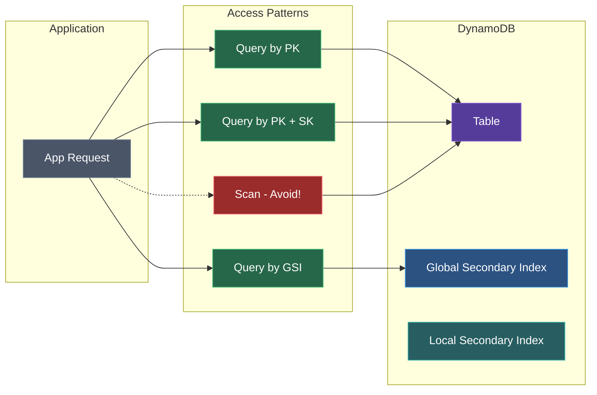
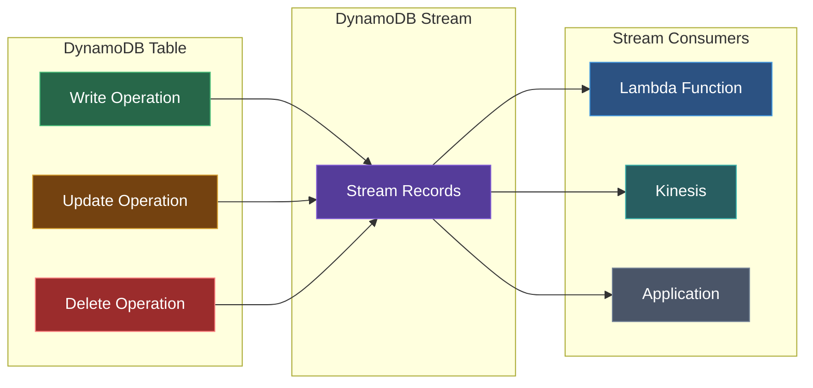

Amazon DynamoDB is a fully managed NoSQL database service that provides fast and predictable performance with seamless scalability.

<Callout type="info" title="Key Benefits">
DynamoDB offers single-digit millisecond latency at any scale, with built-in security, backup, and in-memory caching.
</Callout>

## Key Concepts

### Tables
The primary resource in DynamoDB. Unlike relational databases, tables don't have a fixed schema.

### Items
Individual records in a table. Each item is a collection of attributes.

### Attributes
Data elements within items. Similar to columns in relational databases.

### Data Access Patterns



### Primary Key

Every table requires a primary key:

| Type | Description |
|------|-------------|
| **Partition Key** | Single attribute that uniquely identifies an item |
| **Composite Key** | Partition key + sort key for more complex queries |

<Callout type="info">
Choose your partition key carefully! A good partition key distributes data evenly and supports your query patterns.
</Callout>

## Data Types

<Tabs items={['Scalar', 'Document', 'Set']}>
<Tab value="Scalar">
| Type | Description |
|------|-------------|
| **S** | String |
| **N** | Number |
| **B** | Binary |
| **BOOL** | Boolean |
| **NULL** | Null |
</Tab>
<Tab value="Document">
| Type | Description |
|------|-------------|
| **M** | Map (nested attributes, like JSON objects) |
| **L** | List (ordered collection, like arrays) |
</Tab>
<Tab value="Set">
| Type | Description |
|------|-------------|
| **SS** | String Set (unique strings) |
| **NS** | Number Set (unique numbers) |
| **BS** | Binary Set (unique binary values) |
</Tab>
</Tabs>

## Table Design

### Example: E-commerce Orders

```json title="create-table.json"
{
  "TableName": "Orders",
  "KeySchema": [
    {"AttributeName": "customerId", "KeyType": "HASH"},
    {"AttributeName": "orderId", "KeyType": "RANGE"}
  ],
  "AttributeDefinitions": [
    {"AttributeName": "customerId", "AttributeType": "S"},
    {"AttributeName": "orderId", "AttributeType": "S"}
  ],
  "BillingMode": "PAY_PER_REQUEST"
}
```

### Item Example

```json title="order-item.json"
{
  "customerId": {"S": "CUST-001"},
  "orderId": {"S": "ORD-2024-001"},
  "orderDate": {"S": "2024-01-15"},
  "total": {"N": "99.99"},
  "items": {"L": [
    {"M": {"productId": {"S": "PROD-1"}, "quantity": {"N": "2"}}}
  ]},
  "status": {"S": "SHIPPED"}
}
```

## Secondary Indexes

### Global Secondary Index (GSI)
Query data using different partition and sort keys.

```json title="gsi-definition.json"
{
  "IndexName": "StatusIndex",
  "KeySchema": [
    {"AttributeName": "status", "KeyType": "HASH"},
    {"AttributeName": "orderDate", "KeyType": "RANGE"}
  ],
  "Projection": {"ProjectionType": "ALL"}
}
```

<Callout type="info">
GSIs have their own provisioned capacity and can be created/deleted at any time.
</Callout>

### Local Secondary Index (LSI)
Same partition key but different sort key. Must be created with the table.

<Callout type="warn">
LSIs share throughput with the base table and cannot be created after table creation.
</Callout>

## Capacity Modes

<Tabs items={['On-Demand', 'Provisioned']}>
<Tab value="On-Demand">
- Pay per request pricing
- Automatic scaling for spiky workloads
- No capacity planning needed

**Best for:**
- New applications with unknown workloads
- Unpredictable traffic patterns
- Preferring pay-per-use pricing
</Tab>
<Tab value="Provisioned">
- Specify read/write capacity units (RCU/WCU)
- More cost-effective for predictable workloads
- Auto-scaling available

```bash title="Set Provisioned Capacity"
aws dynamodb update-table \
  --table-name Orders \
  --provisioned-throughput ReadCapacityUnits=100,WriteCapacityUnits=50
```
</Tab>
</Tabs>

## Read Consistency

| Type | Description |
|------|-------------|
| **Eventually Consistent** | Default, lower latency, may return stale data |
| **Strongly Consistent** | Always returns latest data, higher latency |

## Query vs Scan

<Tabs items={['Query', 'Scan']}>
<Tab value="Query">
- Requires partition key
- Efficient and fast
- Uses indexes

**Always use Query when possible!**
</Tab>
<Tab value="Scan">
- Reads every item in table
- Expensive and slow
- Consumes lots of RCUs

<Callout type="error" title="Warning">
Avoid Scan operations in production. Design your data model to use Query operations instead.
</Callout>
</Tab>
</Tabs>

## Streams

Capture item-level changes for real-time processing:



```bash title="Enable Streams"
aws dynamodb update-table \
  --table-name Orders \
  --stream-specification StreamEnabled=true,StreamViewType=NEW_AND_OLD_IMAGES
```

Stream View Types:
- **KEYS_ONLY** - Only the key attributes
- **NEW_IMAGE** - The item after modification
- **OLD_IMAGE** - The item before modification
- **NEW_AND_OLD_IMAGES** - Both versions

<Callout type="info">
Use DynamoDB Streams with Lambda to build real-time applications and event-driven architectures.
</Callout>

## TTL (Time to Live)

Automatically delete expired items:

```bash title="Enable TTL"
aws dynamodb update-time-to-live \
  --table-name Orders \
  --time-to-live-specification Enabled=true,AttributeName=expirationTime
```

<Callout type="info">
TTL deletions don't consume WCUs and are eventually consistent (may take up to 48 hours).
</Callout>

## Best Practices

<Steps>
<Step>
### Data Modeling
1. Start with access patterns, not data structure
2. Use composite keys for related data
3. Denormalize when appropriate
4. Use GSIs for alternative access patterns
</Step>
<Step>
### Performance
1. Distribute workload evenly across partitions
2. Use Query instead of Scan
3. Enable DAX for read-heavy workloads
4. Use batch operations for multiple items
</Step>
<Step>
### Cost Optimization
1. Use on-demand for variable workloads
2. Enable TTL to delete old data
3. Project only needed attributes
4. Use reserved capacity for predictable workloads
</Step>
</Steps>

## DAX (DynamoDB Accelerator)

In-memory cache for DynamoDB:
- Microsecond latency for reads
- No application changes needed (API compatible)
- Write-through caching
- Ideal for read-heavy workloads

## Next Steps

<Cards>
  <Card title="DynamoDB CLI Reference" href="/docs/aws/dynamodb/cli" description="Complete CLI commands for DynamoDB" />
  <Card title="RDS" href="/docs/aws/rds" description="Relational Database Service" />
</Cards>
