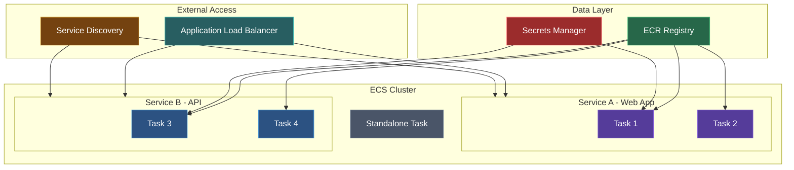
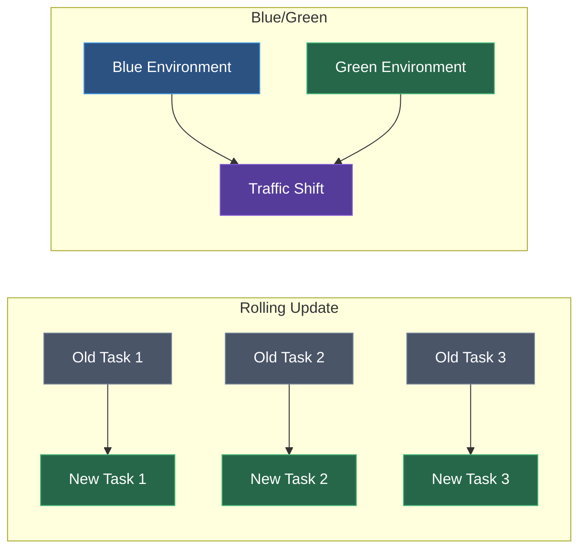

Amazon Elastic Container Service (ECS) is a fully managed container orchestration service for running Docker containers at scale.

## ECS Architecture



## Launch Types

| Type | Description | Use Case |
|------|-------------|----------|
| **Fargate** | Serverless, AWS manages infrastructure | Most applications |
| **EC2** | You manage EC2 instances | GPU, specific instance types |
| **External** | On-premises servers | Hybrid deployments |

## Key Concepts

| Concept | Description |
|---------|-------------|
| **Cluster** | Logical grouping of tasks/services |
| **Task Definition** | Blueprint for containers (like docker-compose) |
| **Task** | Running instance of task definition |
| **Service** | Maintains desired number of tasks |
| **Container** | Docker container within a task |

## Task Definition

### Basic Structure

```json
{
  "family": "my-app",
  "networkMode": "awsvpc",
  "requiresCompatibilities": ["FARGATE"],
  "cpu": "256",
  "memory": "512",
  "executionRoleArn": "arn:aws:iam::123456789012:role/ecsTaskExecutionRole",
  "taskRoleArn": "arn:aws:iam::123456789012:role/ecsTaskRole",
  "containerDefinitions": [
    {
      "name": "app",
      "image": "123456789012.dkr.ecr.us-east-1.amazonaws.com/my-app:latest",
      "essential": true,
      "portMappings": [
        {
          "containerPort": 3000,
          "protocol": "tcp"
        }
      ],
      "environment": [
        { "name": "NODE_ENV", "value": "production" }
      ],
      "secrets": [
        {
          "name": "DB_PASSWORD",
          "valueFrom": "arn:aws:secretsmanager:us-east-1:123456789012:secret:db-password"
        }
      ],
      "logConfiguration": {
        "logDriver": "awslogs",
        "options": {
          "awslogs-group": "/ecs/my-app",
          "awslogs-region": "us-east-1",
          "awslogs-stream-prefix": "ecs"
        }
      }
    }
  ]
}
```

### Fargate CPU/Memory Combinations

| CPU (vCPU) | Memory (GB) |
|------------|-------------|
| 0.25 | 0.5, 1, 2 |
| 0.5 | 1, 2, 3, 4 |
| 1 | 2, 3, 4, 5, 6, 7, 8 |
| 2 | 4-16 (1 GB increments) |
| 4 | 8-30 (1 GB increments) |
| 8 | 16-60 (4 GB increments) |
| 16 | 32-120 (8 GB increments) |

### Multi-Container Task

```json
{
  "containerDefinitions": [
    {
      "name": "app",
      "image": "my-app:latest",
      "essential": true,
      "portMappings": [{ "containerPort": 3000 }],
      "dependsOn": [
        { "containerName": "init", "condition": "COMPLETE" }
      ]
    },
    {
      "name": "init",
      "image": "my-init:latest",
      "essential": false,
      "command": ["./migrate.sh"]
    },
    {
      "name": "sidecar",
      "image": "datadog/agent:latest",
      "essential": false
    }
  ]
}
```

## Services

### Service Configuration

```bash
aws ecs create-service \
  --cluster my-cluster \
  --service-name my-service \
  --task-definition my-app:1 \
  --desired-count 3 \
  --launch-type FARGATE \
  --network-configuration '{
    "awsvpcConfiguration": {
      "subnets": ["subnet-abc123", "subnet-def456"],
      "securityGroups": ["sg-123abc"],
      "assignPublicIp": "ENABLED"
    }
  }' \
  --load-balancers '[
    {
      "targetGroupArn": "arn:aws:elasticloadbalancing:...",
      "containerName": "app",
      "containerPort": 3000
    }
  ]'
```

### Auto Scaling

```bash
# Register scalable target
aws application-autoscaling register-scalable-target \
  --service-namespace ecs \
  --resource-id service/my-cluster/my-service \
  --scalable-dimension ecs:service:DesiredCount \
  --min-capacity 2 \
  --max-capacity 10

# Target tracking (CPU)
aws application-autoscaling put-scaling-policy \
  --service-namespace ecs \
  --resource-id service/my-cluster/my-service \
  --scalable-dimension ecs:service:DesiredCount \
  --policy-name cpu-scaling \
  --policy-type TargetTrackingScaling \
  --target-tracking-scaling-policy-configuration '{
    "TargetValue": 70.0,
    "PredefinedMetricSpecification": {
      "PredefinedMetricType": "ECSServiceAverageCPUUtilization"
    },
    "ScaleOutCooldown": 60,
    "ScaleInCooldown": 120
  }'
```

### Deployment Configuration

| Strategy | Description |
|----------|-------------|
| Rolling Update | Replace tasks gradually |
| Blue/Green | Shift traffic between task sets |



```json
{
  "deploymentConfiguration": {
    "deploymentCircuitBreaker": {
      "enable": true,
      "rollback": true
    },
    "maximumPercent": 200,
    "minimumHealthyPercent": 50
  }
}
```

## Networking

### awsvpc Mode (Required for Fargate)

Each task gets its own ENI with private IP:

```json
{
  "networkMode": "awsvpc",
  "networkConfiguration": {
    "awsvpcConfiguration": {
      "subnets": ["subnet-abc123"],
      "securityGroups": ["sg-123abc"],
      "assignPublicIp": "ENABLED"
    }
  }
}
```

### Service Discovery

```bash
aws servicediscovery create-private-dns-namespace \
  --name my-apps.local \
  --vpc vpc-abc123

aws ecs create-service \
  --service-name my-service \
  --service-registries '[
    {
      "registryArn": "arn:aws:servicediscovery:...",
      "containerName": "app",
      "containerPort": 3000
    }
  ]'
```

Services can be reached at: `my-service.my-apps.local`

## IAM Roles

### Task Execution Role

Used by ECS agent (pull images, push logs):

```json
{
  "Version": "2012-10-17",
  "Statement": [
    {
      "Effect": "Allow",
      "Action": [
        "ecr:GetAuthorizationToken",
        "ecr:BatchCheckLayerAvailability",
        "ecr:GetDownloadUrlForLayer",
        "ecr:BatchGetImage",
        "logs:CreateLogStream",
        "logs:PutLogEvents",
        "secretsmanager:GetSecretValue"
      ],
      "Resource": "*"
    }
  ]
}
```

### Task Role

Used by containers (access AWS services):

```json
{
  "Version": "2012-10-17",
  "Statement": [
    {
      "Effect": "Allow",
      "Action": [
        "s3:GetObject",
        "s3:PutObject",
        "dynamodb:GetItem",
        "dynamodb:PutItem"
      ],
      "Resource": "*"
    }
  ]
}
```

## Load Balancer Integration

### Application Load Balancer

```bash
# Create target group
aws elbv2 create-target-group \
  --name my-service-tg \
  --target-type ip \
  --protocol HTTP \
  --port 3000 \
  --vpc-id vpc-abc123 \
  --health-check-path /health

# Create service with ALB
aws ecs create-service \
  --service-name my-service \
  --load-balancers '[
    {
      "targetGroupArn": "arn:aws:elasticloadbalancing:...:targetgroup/my-service-tg/...",
      "containerName": "app",
      "containerPort": 3000
    }
  ]' \
  --health-check-grace-period-seconds 60
```

## Secrets and Configuration

### From Secrets Manager

```json
{
  "secrets": [
    {
      "name": "DB_PASSWORD",
      "valueFrom": "arn:aws:secretsmanager:us-east-1:123456789012:secret:db-creds:password::"
    }
  ]
}
```

### From Parameter Store

```json
{
  "secrets": [
    {
      "name": "API_KEY",
      "valueFrom": "arn:aws:ssm:us-east-1:123456789012:parameter/myapp/api-key"
    }
  ]
}
```

## Logging

### CloudWatch Logs

```json
{
  "logConfiguration": {
    "logDriver": "awslogs",
    "options": {
      "awslogs-group": "/ecs/my-app",
      "awslogs-region": "us-east-1",
      "awslogs-stream-prefix": "ecs",
      "awslogs-create-group": "true"
    }
  }
}
```

### FireLens (Fluentd/Fluent Bit)

```json
{
  "containerDefinitions": [
    {
      "name": "log-router",
      "image": "amazon/aws-for-fluent-bit:latest",
      "essential": true,
      "firelensConfiguration": {
        "type": "fluentbit"
      }
    },
    {
      "name": "app",
      "logConfiguration": {
        "logDriver": "awsfirelens",
        "options": {
          "Name": "cloudwatch",
          "region": "us-east-1",
          "log_group_name": "/ecs/my-app"
        }
      }
    }
  ]
}
```

## Monitoring

### Container Insights

Enable enhanced monitoring:

```bash
aws ecs update-cluster-settings \
  --cluster my-cluster \
  --settings name=containerInsights,value=enabled
```

### Key Metrics

| Metric | Description |
|--------|-------------|
| CPUUtilization | CPU usage percentage |
| MemoryUtilization | Memory usage percentage |
| RunningTaskCount | Number of running tasks |
| DesiredTaskCount | Target task count |
| PendingTaskCount | Tasks waiting to run |

## Best Practices

### Task Definitions
1. Use specific image tags, not `latest`
2. Set appropriate CPU/memory limits
3. Define health checks
4. Use secrets for sensitive data

### Services
1. Use multiple AZs for high availability
2. Enable deployment circuit breaker
3. Set appropriate auto-scaling policies
4. Use service discovery for internal communication

### Security
1. Use least-privilege IAM roles
2. Run containers as non-root
3. Use private subnets with NAT
4. Enable VPC Flow Logs

### Cost Optimization
1. Right-size CPU/memory
2. Use Fargate Spot for non-critical workloads
3. Use Savings Plans for consistent usage
4. Consolidate small containers

## Next Steps

<Cards>
  <Card title="ECS CLI Reference" href="/docs/aws/ecs/cli" description="Complete CLI commands" />
  <Card title="ECR" href="/docs/aws/ecr" description="Container Registry" />
</Cards>
