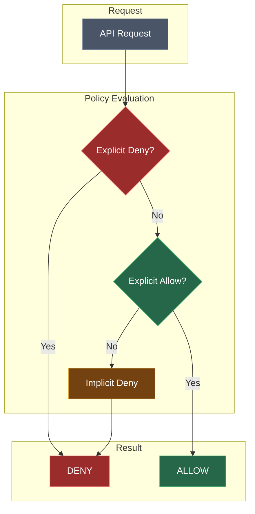
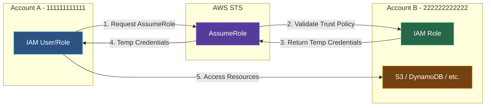

AWS Identity and Access Management (IAM) enables you to manage access to AWS services and resources securely.

<Callout type="warn" title="Security First">
Always follow the principle of least privilege: Grant only the permissions required to perform a task.
</Callout>

## Key Concepts

<Tabs items={['Users', 'Groups', 'Roles', 'Policies']}>
<Tab value="Users">
An IAM user represents a person or application that interacts with AWS. Users have long-term credentials like passwords and access keys.

- Used for human users or service accounts
- Can have console access and/or API access
- Should be assigned to groups for easier management
</Tab>
<Tab value="Groups">
A collection of IAM users. You can attach policies to groups to manage permissions for multiple users at once.

- Organize users by job function (Developers, Admins)
- Policies attached to groups apply to all members
- Users can belong to multiple groups
</Tab>
<Tab value="Roles">
An IAM role is similar to a user but is assumed by anyone who needs it. Roles don't have long-term credentials; instead, they provide temporary security credentials.

- Used by AWS services (EC2, Lambda)
- Used for cross-account access
- Provides temporary credentials via STS
</Tab>
<Tab value="Policies">
JSON documents that define permissions. Policies specify what actions are allowed or denied on what resources.

- Identity-based policies attach to users/groups/roles
- Resource-based policies attach to resources
- Can be AWS managed or customer managed
</Tab>
</Tabs>

## IAM Policy Structure

```json title="example-policy.json"
{
  "Version": "2012-10-17",
  "Statement": [
    {
      "Effect": "Allow",
      "Action": [
        "s3:GetObject",
        "s3:PutObject"
      ],
      "Resource": "arn:aws:s3:::my-bucket/*"
    }
  ]
}
```

### Policy Elements

| Element | Description |
|---------|-------------|
| `Version` | Policy language version (always use "2012-10-17") |
| `Statement` | Array of individual statements |
| `Effect` | Allow or Deny |
| `Action` | List of actions this statement covers |
| `Resource` | ARN of resources the actions apply to |
| `Condition` | Optional conditions for when the policy applies |

### Policy Evaluation Flow



<Callout type="info" title="Policy Evaluation">
When both Allow and Deny apply, Deny always wins. Explicit Deny > Explicit Allow > Implicit Deny.
</Callout>

## Best Practices

<Steps>
<Step>
### Enable MFA for All Users
Especially important for the root account and privileged users.

```bash title="Enable Virtual MFA"
aws iam enable-mfa-device \
  --user-name username \
  --serial-number arn:aws:iam::123456789012:mfa/username \
  --authentication-code1 123456 \
  --authentication-code2 789012
```
</Step>
<Step>
### Use Roles Instead of Long-Term Credentials
Roles provide temporary credentials that automatically rotate.
</Step>
<Step>
### Apply Least Privilege
Start with minimal permissions and add more as needed.
</Step>
<Step>
### Use Groups for Permission Management
Assign policies to groups, then add users to groups.
</Step>
<Step>
### Audit with CloudTrail
Track all API calls for security analysis.
</Step>
</Steps>

### Password Policy

Set a strong password policy for IAM users:

```json title="password-policy.json"
{
  "MinimumPasswordLength": 14,
  "RequireSymbols": true,
  "RequireNumbers": true,
  "RequireUppercaseCharacters": true,
  "RequireLowercaseCharacters": true,
  "AllowUsersToChangePassword": true,
  "MaxPasswordAge": 90,
  "PasswordReusePrevention": 24
}
```

## Common Use Cases

### Cross-Account Access

Allow users from one AWS account to access resources in another:



```json title="trust-policy.json"
{
  "Version": "2012-10-17",
  "Statement": [
    {
      "Effect": "Allow",
      "Principal": {
        "AWS": "arn:aws:iam::123456789012:root"
      },
      "Action": "sts:AssumeRole"
    }
  ]
}
```

<Callout type="info" title="Assuming Roles">
Use `aws sts assume-role` to get temporary credentials for the target account.
</Callout>

### Service-Linked Roles

Some AWS services require roles to perform actions on your behalf. These are called service-linked roles.

```bash title="List Service-Linked Roles"
aws iam list-roles --query 'Roles[?starts_with(RoleName, `AWSServiceRoleFor`)]'
```

## IAM Access Analyzer

Identify resources shared with external entities:

```bash title="Create Access Analyzer"
aws accessanalyzer create-analyzer \
  --analyzer-name my-analyzer \
  --type ACCOUNT
```

<Callout type="info">
Access Analyzer helps identify unintended public or cross-account access to your resources.
</Callout>

## Next Steps

<Cards>
  <Card title="IAM CLI Reference" href="/docs/aws/iam/cli" description="Complete CLI commands for IAM" />
  <Card title="EC2" href="/docs/aws/ec2" description="Launch virtual servers" />
</Cards>
