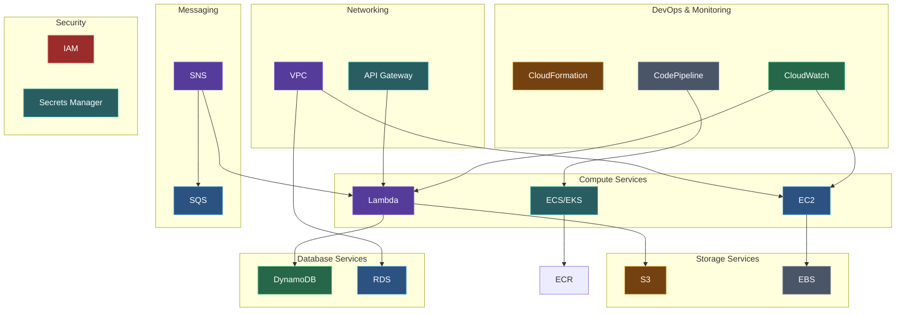

Welcome to the **AWS for Developers** documentation! This guide covers all the essential AWS services that developers need to know, including detailed CLI references for each service.

## What You'll Learn

This documentation covers:

- **Core AWS Services**: IAM, EC2, S3, Lambda, and more
- **CLI Commands**: Complete reference for each service with examples
- **Best Practices**: Security, performance, and cost optimization tips
- **Real-world Examples**: Practical use cases and patterns

## Prerequisites

Before diving in, make sure you have:

1. An AWS Account
2. AWS CLI installed and configured
3. Basic understanding of cloud computing concepts

## Quick Navigation

<Cards>
  <Card title="CLI Setup" href="/docs/aws/cli-setup" description="Install and configure AWS CLI" />
  <Card title="IAM" href="/docs/aws/iam" description="Identity and Access Management" />
  <Card title="EC2" href="/docs/aws/ec2" description="Elastic Compute Cloud" />
  <Card title="S3" href="/docs/aws/s3" description="Simple Storage Service" />
  <Card title="Lambda" href="/docs/aws/lambda" description="Serverless Functions" />
  <Card title="DynamoDB" href="/docs/aws/dynamodb" description="NoSQL Database" />
</Cards>

## Service Categories

### AWS Services Architecture



### Compute Services
- **EC2**: Virtual servers in the cloud
- **Lambda**: Serverless compute service
- **ECS/EKS**: Container orchestration

### Storage Services
- **S3**: Object storage
- **EBS**: Block storage for EC2

### Database Services
- **DynamoDB**: NoSQL database
- **RDS**: Relational database service

### Networking
- **VPC**: Virtual Private Cloud
- **API Gateway**: API management

### DevOps & Monitoring
- **CloudFormation**: Infrastructure as Code
- **CodePipeline/CodeBuild**: CI/CD
- **CloudWatch**: Monitoring and logging

## Getting Started

<Callout type="info">
  Start with the [CLI Setup](/docs/aws/cli-setup) guide to configure your local environment before exploring individual services.
</Callout>

```bash
# Quick check if AWS CLI is installed
aws --version

# Configure your credentials
aws configure
```
