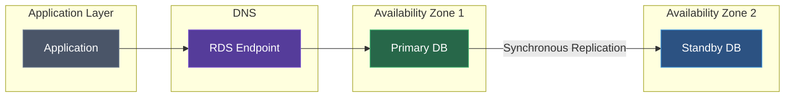
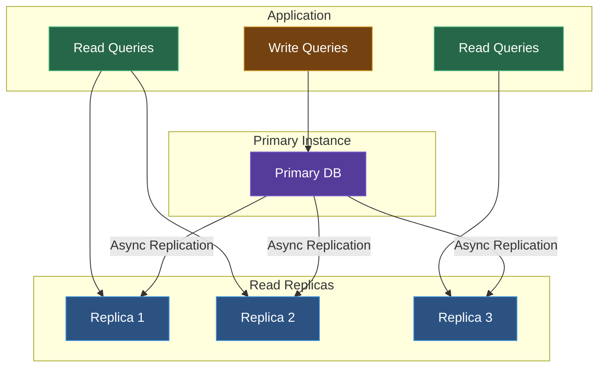

Amazon RDS makes it easy to set up, operate, and scale relational databases in the cloud.

## Supported Engines

| Engine | Versions | Use Case |
|--------|----------|----------|
| **MySQL** | 5.7, 8.0 | General purpose |
| **PostgreSQL** | 11-16 | Complex queries, extensions |
| **MariaDB** | 10.4-10.11 | MySQL alternative |
| **Oracle** | 19c, 21c | Enterprise applications |
| **SQL Server** | 2016-2022 | Windows applications |
| **Aurora** | MySQL/PostgreSQL | High performance |

## Key Concepts

### DB Instances
The basic building block - an isolated database environment in the cloud.

### Instance Classes

| Class | vCPUs | Memory | Use Case |
|-------|-------|--------|----------|
| db.t3.micro | 2 | 1 GB | Development |
| db.t3.medium | 2 | 4 GB | Small workloads |
| db.r5.large | 2 | 16 GB | Production |
| db.r5.xlarge | 4 | 32 GB | High memory |

### Storage Types

| Type | Description | IOPS |
|------|-------------|------|
| **gp3** | General Purpose SSD | 3,000-16,000 |
| **io1/io2** | Provisioned IOPS SSD | Up to 256,000 |
| **magnetic** | Legacy HDD | Variable |

## Multi-AZ Deployments

High availability with automatic failover:



Benefits:
- Automatic failover
- No data loss
- Increased durability
- Maintenance without downtime

## Read Replicas

Scale read-heavy workloads:



Features:
- Up to 5 read replicas per DB
- Cross-region replication
- Can be promoted to standalone DB

## Parameter Groups

Customize database configuration:

```bash
aws rds create-db-parameter-group \
  --db-parameter-group-name my-params \
  --db-parameter-group-family mysql8.0 \
  --description "Custom MySQL parameters"
```

Common Parameters:
- `max_connections` - Maximum concurrent connections
- `innodb_buffer_pool_size` - Memory for caching
- `slow_query_log` - Enable slow query logging

## Security

### Encryption at Rest

```bash
aws rds create-db-instance \
  --db-instance-identifier mydb \
  --storage-encrypted \
  --kms-key-id alias/my-key
```

### Network Security

1. **VPC** - Run in isolated network
2. **Security Groups** - Control access
3. **Subnet Groups** - Define subnets

### Authentication

- **Password** - Traditional username/password
- **IAM** - Database authentication with IAM
- **Kerberos** - Active Directory integration

```bash
# Enable IAM authentication
aws rds modify-db-instance \
  --db-instance-identifier mydb \
  --enable-iam-database-authentication
```

## Backups

### Automated Backups

```bash
aws rds modify-db-instance \
  --db-instance-identifier mydb \
  --backup-retention-period 7 \
  --preferred-backup-window "03:00-04:00"
```

### Manual Snapshots

```bash
aws rds create-db-snapshot \
  --db-instance-identifier mydb \
  --db-snapshot-identifier mydb-snapshot
```

### Point-in-Time Recovery

Restore to any second within retention period:

```bash
aws rds restore-db-instance-to-point-in-time \
  --source-db-instance-identifier mydb \
  --target-db-instance-identifier mydb-restored \
  --restore-time 2024-01-15T10:30:00Z
```

## Monitoring

### CloudWatch Metrics

| Metric | Description |
|--------|-------------|
| CPUUtilization | CPU usage percentage |
| FreeableMemory | Available RAM |
| ReadIOPS | Read operations/second |
| WriteIOPS | Write operations/second |
| DatabaseConnections | Active connections |

### Enhanced Monitoring

Real-time OS metrics:

```bash
aws rds modify-db-instance \
  --db-instance-identifier mydb \
  --monitoring-interval 60 \
  --monitoring-role-arn arn:aws:iam::123456789012:role/rds-monitoring-role
```

### Performance Insights

Analyze database load:

```bash
aws rds modify-db-instance \
  --db-instance-identifier mydb \
  --enable-performance-insights \
  --performance-insights-retention-period 7
```

## Best Practices

### Performance
1. Choose appropriate instance class
2. Use provisioned IOPS for consistent performance
3. Enable read replicas for read-heavy workloads
4. Optimize queries and indexes

### Security
1. Use VPC and security groups
2. Enable encryption at rest
3. Use SSL/TLS for connections
4. Rotate credentials regularly

### Cost Optimization
1. Use Reserved Instances for predictable workloads
2. Right-size instances based on metrics
3. Delete unused snapshots
4. Use Aurora Serverless for variable workloads

<Callout type="info">
  Consider Aurora for production workloads - it offers better performance, availability, and management features than standard RDS.
</Callout>

## Next Steps

<Cards>
  <Card title="RDS CLI Reference" href="/docs/aws/rds/cli" description="Complete CLI commands for RDS" />
  <Card title="VPC" href="/docs/aws/vpc" description="Virtual Private Cloud" />
</Cards>
