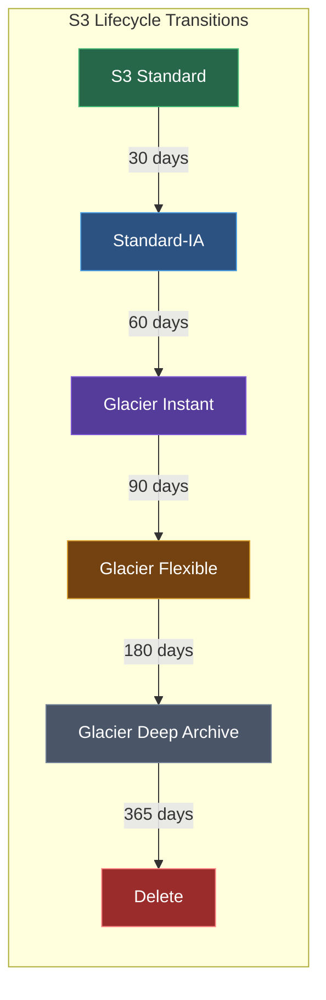
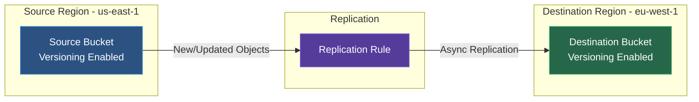

Amazon Simple Storage Service (S3) is an object storage service offering industry-leading scalability, data availability, security, and performance.

<Callout type="info" title="Key Facts">
S3 offers 99.999999999% (11 9's) durability and stores data across multiple Availability Zones.
</Callout>

## Key Concepts

### Buckets
Containers for objects. Bucket names must be globally unique across all AWS accounts.

### Objects
Files stored in S3, consisting of:
- **Key**: The unique identifier (file path)
- **Value**: The data (up to 5TB)
- **Metadata**: Additional information about the object
- **Version ID**: If versioning is enabled

### Regions
Buckets are created in specific AWS regions. Choose a region close to your users for lower latency.

## Storage Classes

<Tabs items={['Frequent Access', 'Infrequent Access', 'Archive']}>
<Tab value="Frequent Access">
| Class | Use Case | Availability |
|-------|----------|--------------|
| **S3 Standard** | Frequently accessed data | 99.99% |
| **S3 Intelligent-Tiering** | Unknown access patterns | 99.9% |
</Tab>
<Tab value="Infrequent Access">
| Class | Use Case | Availability |
|-------|----------|--------------|
| **S3 Standard-IA** | Infrequent access | 99.9% |
| **S3 One Zone-IA** | Infrequent, single AZ | 99.5% |
</Tab>
<Tab value="Archive">
| Class | Use Case | Retrieval Time |
|-------|----------|----------------|
| **S3 Glacier Instant** | Archive with instant access | Milliseconds |
| **S3 Glacier Flexible** | Archive storage | Minutes to hours |
| **S3 Glacier Deep Archive** | Long-term archive | 12-48 hours |
</Tab>
</Tabs>

### Storage Class Lifecycle



## Bucket Policies

Control access at the bucket level:

```json title="bucket-policy.json"
{
  "Version": "2012-10-17",
  "Statement": [
    {
      "Sid": "PublicReadGetObject",
      "Effect": "Allow",
      "Principal": "*",
      "Action": "s3:GetObject",
      "Resource": "arn:aws:s3:::my-bucket/*"
    }
  ]
}
```

<Callout type="error" title="Security Warning">
Be extremely careful with public bucket policies. Use AWS Access Analyzer to review bucket access before enabling public access.
</Callout>

## Versioning

Keep multiple versions of objects:

```bash title="Enable Versioning"
aws s3api put-bucket-versioning \
  --bucket my-bucket \
  --versioning-configuration Status=Enabled
```

<Callout type="info">
Once enabled, versioning cannot be disabled—only suspended. All versions are billed as separate objects.
</Callout>

Benefits:
- Recover from accidental deletions
- Keep history of object changes
- Works with lifecycle policies

## Lifecycle Rules

Automate object transitions and deletions:

```json title="lifecycle-rule.json"
{
  "Rules": [
    {
      "ID": "ArchiveOldLogs",
      "Status": "Enabled",
      "Filter": {
        "Prefix": "logs/"
      },
      "Transitions": [
        {
          "Days": 30,
          "StorageClass": "STANDARD_IA"
        },
        {
          "Days": 90,
          "StorageClass": "GLACIER"
        }
      ],
      "Expiration": {
        "Days": 365
      }
    }
  ]
}
```

## Encryption

<Tabs items={['SSE-S3', 'SSE-KMS', 'SSE-C']}>
<Tab value="SSE-S3">
AWS manages the encryption keys automatically. Simplest option.

```bash title="Enable Default Encryption (SSE-S3)"
aws s3api put-bucket-encryption \
  --bucket my-bucket \
  --server-side-encryption-configuration '{
    "Rules": [{
      "ApplyServerSideEncryptionByDefault": {
        "SSEAlgorithm": "AES256"
      }
    }]
  }'
```
</Tab>
<Tab value="SSE-KMS">
Use AWS KMS to manage encryption keys. Provides audit trail via CloudTrail.

```bash title="Enable Default Encryption (SSE-KMS)"
aws s3api put-bucket-encryption \
  --bucket my-bucket \
  --server-side-encryption-configuration '{
    "Rules": [{
      "ApplyServerSideEncryptionByDefault": {
        "SSEAlgorithm": "aws:kms",
        "KMSMasterKeyID": "arn:aws:kms:us-east-1:123456789012:key/abc123"
      }
    }]
  }'
```
</Tab>
<Tab value="SSE-C">
Customer provides their own encryption keys. Keys are not stored by AWS.

<Callout type="warn">
With SSE-C, you must provide the key with every request. Losing the key means losing access to your data.
</Callout>
</Tab>
</Tabs>

## Cross-Region Replication

Replicate objects to another region for disaster recovery or compliance:



```json title="replication-config.json"
{
  "Role": "arn:aws:iam::123456789012:role/replication-role",
  "Rules": [
    {
      "Status": "Enabled",
      "Priority": 1,
      "Filter": {},
      "Destination": {
        "Bucket": "arn:aws:s3:::destination-bucket",
        "StorageClass": "STANDARD"
      }
    }
  ]
}
```

<Callout type="info">
Versioning must be enabled on both source and destination buckets for replication.
</Callout>

## Static Website Hosting

Host static websites directly from S3:

```bash title="Enable Website Hosting"
aws s3 website s3://my-bucket/ \
  --index-document index.html \
  --error-document error.html
```

Website URL format: `http://bucket-name.s3-website-region.amazonaws.com`

<Callout type="info" title="HTTPS Support">
Use CloudFront in front of S3 for HTTPS and custom domain support.
</Callout>

## Presigned URLs

Generate temporary URLs for private objects:

```bash title="Generate Presigned URL"
# Valid for 1 hour (3600 seconds)
aws s3 presign s3://my-bucket/my-object.txt --expires-in 3600
```

## Best Practices

<Steps>
<Step>
### Security
1. Block public access by default
2. Enable versioning for important data
3. Use bucket policies and IAM policies together
4. Enable server-side encryption
5. Enable access logging
</Step>
<Step>
### Performance
1. Use multipart upload for large files (>100MB)
2. Use S3 Transfer Acceleration for global uploads
3. Use CloudFront for content delivery
4. Use appropriate storage classes
</Step>
<Step>
### Cost Optimization
1. Use lifecycle policies to transition old data
2. Monitor with S3 Storage Lens
3. Delete incomplete multipart uploads
4. Use S3 Intelligent-Tiering for unknown patterns
</Step>
</Steps>

## Next Steps

<Cards>
  <Card title="S3 CLI Reference" href="/docs/aws/s3/cli" description="Complete CLI commands for S3" />
  <Card title="Lambda" href="/docs/aws/lambda" description="Serverless compute" />
</Cards>
