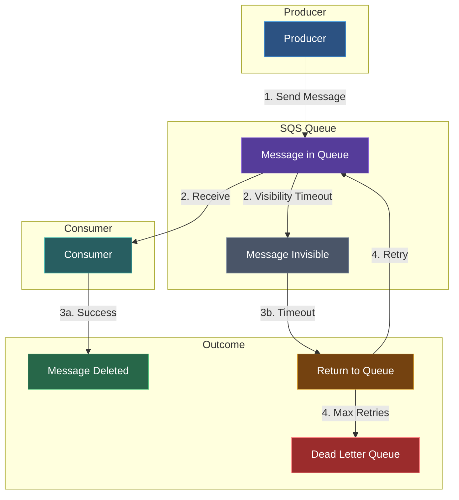
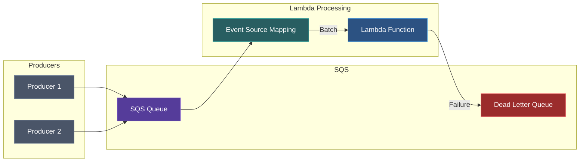

Amazon Simple Queue Service (SQS) is a fully managed message queuing service for decoupling and scaling microservices, distributed systems, and serverless applications.

## Queue Types

| Type | Throughput | Ordering | Delivery |
|------|------------|----------|----------|
| **Standard** | Unlimited | Best-effort | At-least-once |
| **FIFO** | 3,000 msg/s with batching | Strict FIFO | Exactly-once |

## Key Concepts

| Concept | Description |
|---------|-------------|
| **Queue** | Message storage buffer |
| **Message** | Data sent between services |
| **Visibility Timeout** | Time message is hidden after receive |
| **Retention Period** | How long messages are kept |
| **Dead-Letter Queue** | Queue for failed messages |
| **Long Polling** | Reduces empty responses |

## Message Lifecycle



## Standard vs FIFO Queues

| Feature | Standard | FIFO |
|---------|----------|------|
| Throughput | Unlimited | 300 msg/s (3000 with batching) |
| Ordering | Best-effort | Strict FIFO by message group |
| Deduplication | No | Yes (5-minute window) |
| Message Groups | No | Yes |
| Naming | Any | Must end with `.fifo` |
| Exactly-once | No | Yes |

## Queue Configuration

### Visibility Timeout

How long a message is hidden after being received:

```bash
aws sqs set-queue-attributes \
  --queue-url https://sqs.us-east-1.amazonaws.com/123456789012/my-queue \
  --attributes VisibilityTimeout=60
```

**Best Practice:** Set timeout to 6x your processing time.

### Message Retention

How long messages stay in queue (1 minute to 14 days):

```bash
aws sqs set-queue-attributes \
  --queue-url https://sqs.us-east-1.amazonaws.com/123456789012/my-queue \
  --attributes MessageRetentionPeriod=1209600
```

### Delivery Delay

Delay message delivery (0-15 minutes):

```bash
aws sqs set-queue-attributes \
  --queue-url https://sqs.us-east-1.amazonaws.com/123456789012/my-queue \
  --attributes DelaySeconds=30
```

### Maximum Message Size

Up to 256 KB (use Extended Client Library for larger):

```bash
aws sqs set-queue-attributes \
  --queue-url https://sqs.us-east-1.amazonaws.com/123456789012/my-queue \
  --attributes MaximumMessageSize=262144
```

## Long Polling vs Short Polling

| Polling | Description | Cost |
|---------|-------------|------|
| Short | Returns immediately | Higher (more requests) |
| Long | Waits up to 20s for messages | Lower |

Enable long polling:

```bash
aws sqs set-queue-attributes \
  --queue-url https://sqs.us-east-1.amazonaws.com/123456789012/my-queue \
  --attributes ReceiveMessageWaitTimeSeconds=20
```

## Dead-Letter Queues

Handle failed message processing:

```bash
aws sqs set-queue-attributes \
  --queue-url https://sqs.us-east-1.amazonaws.com/123456789012/my-queue \
  --attributes '{
    "RedrivePolicy": "{\"deadLetterTargetArn\":\"arn:aws:sqs:us-east-1:123456789012:my-dlq\",\"maxReceiveCount\":3}"
  }'
```

### DLQ Redrive

Move messages back to source queue:

```bash
aws sqs start-message-move-task \
  --source-arn arn:aws:sqs:us-east-1:123456789012:my-dlq \
  --destination-arn arn:aws:sqs:us-east-1:123456789012:my-queue
```

## FIFO Queues

### Message Groups

Process messages in parallel while maintaining order within groups:

```javascript
await sqs.sendMessage({
  QueueUrl: 'https://sqs.us-east-1.amazonaws.com/123456789012/my-queue.fifo',
  MessageBody: JSON.stringify({ orderId: '123' }),
  MessageGroupId: 'customer-456', // Messages within group are ordered
  MessageDeduplicationId: 'order-123-created' // Prevent duplicates
});
```

### Content-Based Deduplication

Enable automatic deduplication using message body hash:

```bash
aws sqs create-queue \
  --queue-name my-queue.fifo \
  --attributes FifoQueue=true,ContentBasedDeduplication=true
```

## Lambda Integration

Configure Lambda to process SQS messages:



```javascript
export const handler = async (event) => {
  const batchItemFailures = [];
  
  for (const record of event.Records) {
    try {
      const body = JSON.parse(record.body);
      await processMessage(body);
    } catch (error) {
      // Report failed message for retry
      batchItemFailures.push({ itemIdentifier: record.messageId });
    }
  }
  
  return { batchItemFailures };
};
```

### Event Source Mapping

```bash
aws lambda create-event-source-mapping \
  --function-name my-function \
  --batch-size 10 \
  --maximum-batching-window-in-seconds 5 \
  --event-source-arn arn:aws:sqs:us-east-1:123456789012:my-queue \
  --function-response-types ReportBatchItemFailures
```

## Access Control

### Queue Policy

```json
{
  "Version": "2012-10-17",
  "Statement": [
    {
      "Effect": "Allow",
      "Principal": {"AWS": "arn:aws:iam::123456789012:role/MyRole"},
      "Action": ["sqs:SendMessage", "sqs:ReceiveMessage"],
      "Resource": "arn:aws:sqs:us-east-1:123456789012:my-queue"
    },
    {
      "Effect": "Allow",
      "Principal": {"Service": "sns.amazonaws.com"},
      "Action": "sqs:SendMessage",
      "Resource": "arn:aws:sqs:us-east-1:123456789012:my-queue",
      "Condition": {
        "ArnEquals": {
          "aws:SourceArn": "arn:aws:sns:us-east-1:123456789012:my-topic"
        }
      }
    }
  ]
}
```

## Server-Side Encryption

### SSE-SQS (AWS Managed)

```bash
aws sqs set-queue-attributes \
  --queue-url https://sqs.us-east-1.amazonaws.com/123456789012/my-queue \
  --attributes SqsManagedSseEnabled=true
```

### SSE-KMS (Customer Managed)

```bash
aws sqs set-queue-attributes \
  --queue-url https://sqs.us-east-1.amazonaws.com/123456789012/my-queue \
  --attributes KmsMasterKeyId=alias/my-key
```

## Message Attributes

Add metadata to messages:

```javascript
await sqs.sendMessage({
  QueueUrl: queueUrl,
  MessageBody: JSON.stringify({ orderId: '123' }),
  MessageAttributes: {
    eventType: {
      DataType: 'String',
      StringValue: 'order_created'
    },
    priority: {
      DataType: 'Number',
      StringValue: '1'
    },
    correlationId: {
      DataType: 'String',
      StringValue: 'abc-123'
    }
  }
});
```

## Batch Operations

Process up to 10 messages at a time:

### Send Batch

```javascript
await sqs.sendMessageBatch({
  QueueUrl: queueUrl,
  Entries: [
    { Id: '1', MessageBody: 'Message 1' },
    { Id: '2', MessageBody: 'Message 2' },
    { Id: '3', MessageBody: 'Message 3' }
  ]
});
```

### Receive Batch

```javascript
const { Messages } = await sqs.receiveMessage({
  QueueUrl: queueUrl,
  MaxNumberOfMessages: 10,
  WaitTimeSeconds: 20,
  MessageAttributeNames: ['All']
});
```

### Delete Batch

```javascript
await sqs.deleteMessageBatch({
  QueueUrl: queueUrl,
  Entries: Messages.map(m => ({
    Id: m.MessageId,
    ReceiptHandle: m.ReceiptHandle
  }))
});
```

## Monitoring

### CloudWatch Metrics

| Metric | Description |
|--------|-------------|
| ApproximateNumberOfMessagesVisible | Messages in queue |
| ApproximateNumberOfMessagesNotVisible | In-flight messages |
| ApproximateNumberOfMessagesDelayed | Delayed messages |
| NumberOfMessagesSent | Messages sent |
| NumberOfMessagesReceived | Messages received |
| NumberOfMessagesDeleted | Messages deleted |
| ApproximateAgeOfOldestMessage | Age of oldest message |

### Alarms

```bash
aws cloudwatch put-metric-alarm \
  --alarm-name queue-depth-alarm \
  --namespace AWS/SQS \
  --metric-name ApproximateNumberOfMessagesVisible \
  --dimensions Name=QueueName,Value=my-queue \
  --threshold 1000 \
  --comparison-operator GreaterThanThreshold \
  --evaluation-periods 2 \
  --period 300 \
  --statistic Average \
  --alarm-actions arn:aws:sns:us-east-1:123456789012:alerts
```

## Best Practices

### Design
1. Use long polling to reduce costs
2. Set appropriate visibility timeout (6x processing time)
3. Implement idempotent message processing
4. Use DLQs for failed messages

### Performance
1. Use batch operations (up to 10 messages)
2. Process messages in parallel when possible
3. Use FIFO only when strict ordering is required
4. Consider message groups for parallel FIFO processing

### Reliability
1. Always delete messages after successful processing
2. Implement exponential backoff for retries
3. Monitor DLQ depth
4. Set up alarms for queue depth

### Security
1. Enable server-side encryption
2. Use VPC endpoints for private access
3. Implement least-privilege queue policies
4. Rotate KMS keys regularly

## Next Steps

<Cards>
  <Card title="SQS CLI Reference" href="/docs/aws/sqs/cli" description="Complete CLI commands" />
  <Card title="Secrets Manager" href="/docs/aws/secrets-manager" description="Manage secrets securely" />
</Cards>
