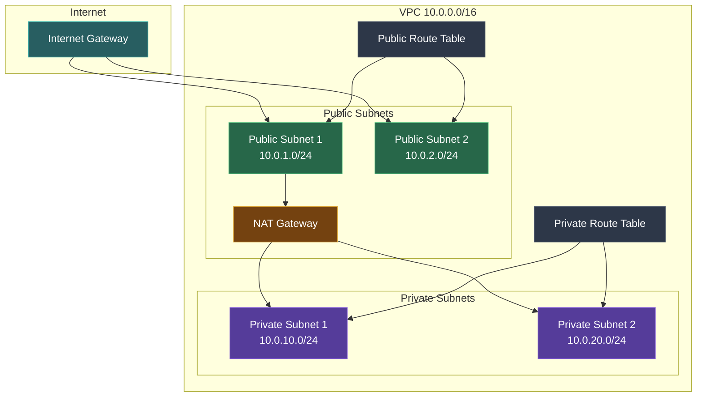
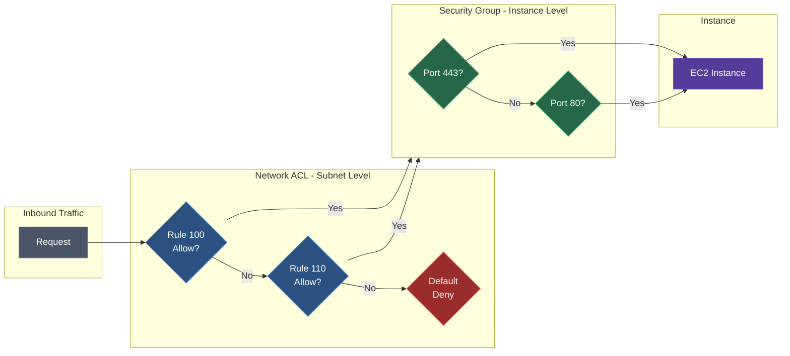
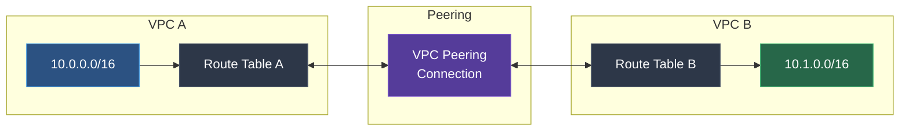
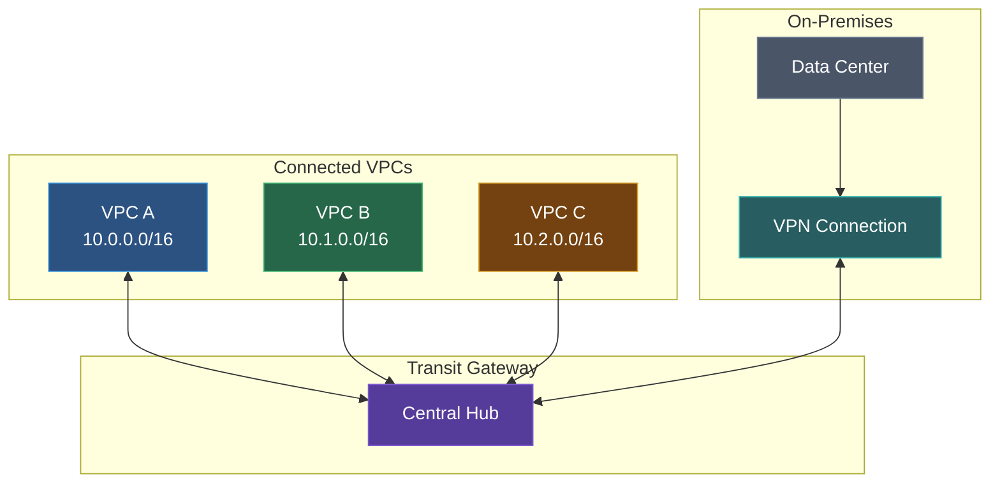
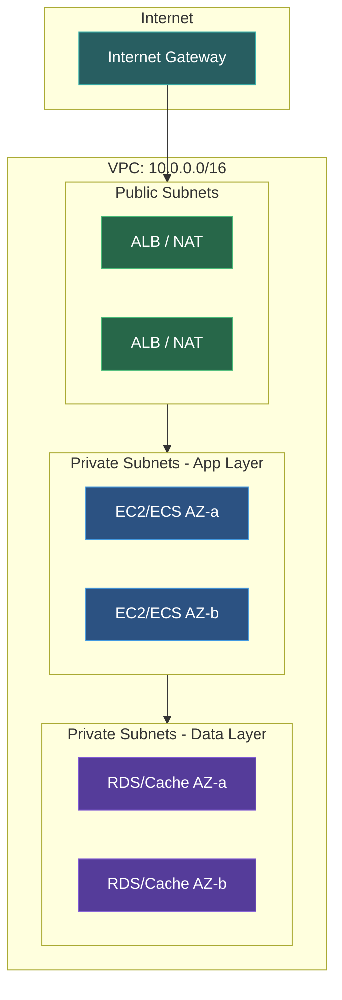

Amazon Virtual Private Cloud (VPC) lets you provision a logically isolated section of the AWS Cloud where you can launch resources in a virtual network.

## VPC Architecture Overview



## Key Concepts

### VPC
An isolated virtual network in AWS with its own IP address range, subnets, and routing.

### Subnets
Segments of a VPC's IP address range where you place resources.

| Type | Description |
|------|-------------|
| **Public Subnet** | Has route to Internet Gateway |
| **Private Subnet** | No direct internet access |

### CIDR Blocks
IP address ranges for your VPC and subnets.

```
VPC: 10.0.0.0/16 (65,536 IPs)
├── Public Subnet 1:  10.0.1.0/24 (256 IPs)
├── Public Subnet 2:  10.0.2.0/24 (256 IPs)
├── Private Subnet 1: 10.0.10.0/24 (256 IPs)
└── Private Subnet 2: 10.0.20.0/24 (256 IPs)
```

## Network Components

### Internet Gateway (IGW)
Enables internet access for public subnets.

```bash
aws ec2 create-internet-gateway
aws ec2 attach-internet-gateway \
  --internet-gateway-id igw-123 \
  --vpc-id vpc-456
```

### NAT Gateway
Allows private subnets to access the internet without exposing resources.

```bash
aws ec2 create-nat-gateway \
  --subnet-id subnet-public \
  --allocation-id eipalloc-123
```

### Route Tables
Define how traffic is routed within and outside the VPC.

```
Public Subnet Route Table:
10.0.0.0/16 → local
0.0.0.0/0   → igw-xxx (Internet Gateway)

Private Subnet Route Table:
10.0.0.0/16 → local
0.0.0.0/0   → nat-xxx (NAT Gateway)
```

## Security

### Security Groups
Virtual firewalls at the instance level (stateful).

```json
{
  "GroupName": "web-servers",
  "Description": "Allow HTTP/HTTPS",
  "IpPermissions": [
    {"IpProtocol": "tcp", "FromPort": 80, "ToPort": 80, "IpRanges": [{"CidrIp": "0.0.0.0/0"}]},
    {"IpProtocol": "tcp", "FromPort": 443, "ToPort": 443, "IpRanges": [{"CidrIp": "0.0.0.0/0"}]}
  ]
}
```

### Network ACLs
Subnet-level firewall (stateless).

| Rule | Type | Protocol | Port | Source | Allow/Deny |
|------|------|----------|------|--------|------------|
| 100 | Inbound | TCP | 80 | 0.0.0.0/0 | Allow |
| 110 | Inbound | TCP | 443 | 0.0.0.0/0 | Allow |
| * | Inbound | All | All | 0.0.0.0/0 | Deny |

### Security Groups vs NACLs

| Feature | Security Group | NACL |
|---------|----------------|------|
| Level | Instance | Subnet |
| State | Stateful | Stateless |
| Rules | Allow only | Allow & Deny |
| Evaluation | All rules | Rules in order |



## VPC Endpoints

Access AWS services without internet:

### Gateway Endpoints
For S3 and DynamoDB (free):

```bash
aws ec2 create-vpc-endpoint \
  --vpc-id vpc-123 \
  --service-name com.amazonaws.us-east-1.s3 \
  --route-table-ids rtb-456
```

### Interface Endpoints
For other AWS services (powered by PrivateLink):

```bash
aws ec2 create-vpc-endpoint \
  --vpc-id vpc-123 \
  --vpc-endpoint-type Interface \
  --service-name com.amazonaws.us-east-1.secretsmanager \
  --subnet-ids subnet-789 \
  --security-group-ids sg-abc
```

## VPC Peering

Connect two VPCs privately:



Requirements:
- Non-overlapping CIDR blocks
- Route table entries in both VPCs
- Security groups allow traffic

## VPN Connectivity

### Site-to-Site VPN
Connect on-premises network to VPC:

1. Create Virtual Private Gateway
2. Create Customer Gateway
3. Create VPN Connection
4. Configure on-premises router

### Client VPN
Allow remote users to access VPC resources.

## Transit Gateway

Hub for connecting VPCs and on-premises networks:



## Flow Logs

Capture network traffic information:

```bash
aws ec2 create-flow-logs \
  --resource-type VPC \
  --resource-ids vpc-123 \
  --traffic-type ALL \
  --log-destination-type cloud-watch-logs \
  --log-group-name vpc-flow-logs
```

## Best Practices

### Design
1. Use multiple Availability Zones
2. Separate public and private subnets
3. Plan CIDR blocks for future growth
4. Use VPC endpoints for AWS services

### Security
1. Use Security Groups as primary defense
2. Use NACLs for subnet-level rules
3. Enable Flow Logs for monitoring
4. Use private subnets for sensitive resources

### Cost Optimization
1. Use VPC endpoints instead of NAT for AWS services
2. Right-size NAT Gateways
3. Delete unused elastic IPs

## Reference Architecture



## Next Steps

<Cards>
  <Card title="VPC CLI Reference" href="/docs/aws/vpc/cli" description="Complete CLI commands for VPC" />
  <Card title="API Gateway" href="/docs/aws/api-gateway" description="API Management" />
</Cards>
