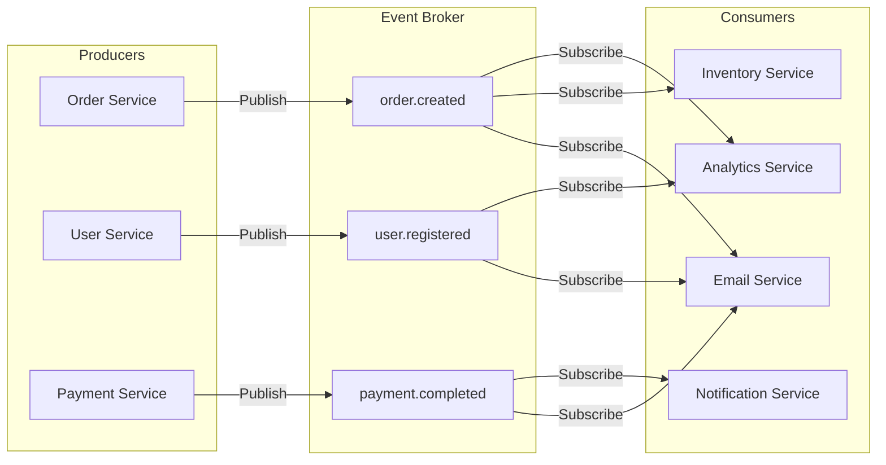
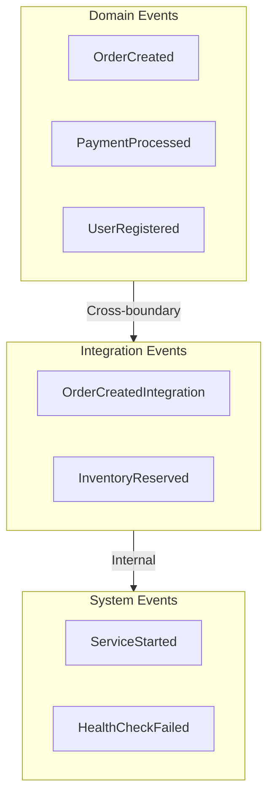
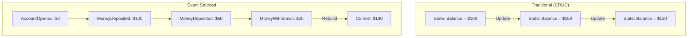
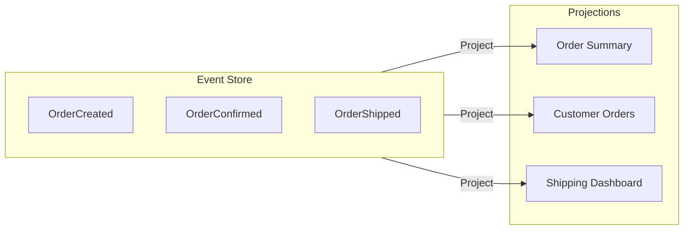

# Event-Driven Architecture

Event-Driven Architecture (EDA) is a software design pattern where the flow of the program is determined by events—significant changes in state. Components communicate through events rather than direct calls, enabling loose coupling and high scalability.



## Core Concepts

<Cards>
  <Card title="Events">
    Immutable records of something that happened. Events are facts, not requests.
  </Card>
  <Card title="Producers">
    Components that detect state changes and publish events.
  </Card>
  <Card title="Consumers">
    Components that subscribe to and react to events.
  </Card>
  <Card title="Event Broker">
    Infrastructure that routes events from producers to consumers.
  </Card>
  <Card title="Event Store">
    Persistent log of all events for replay and audit.
  </Card>
  <Card title="Eventual Consistency">
    System reaches consistent state over time, not immediately.
  </Card>
</Cards>

## Event Types



```typescript title="events/types.ts"
// Base event interface
interface DomainEvent<T = unknown> {
  id: string;
  type: string;
  aggregateId: string;
  aggregateType: string;
  payload: T;
  metadata: {
    timestamp: Date;
    version: number;
    correlationId: string;
    causationId?: string;
    userId?: string;
  };
}

// Domain Events - What happened in the domain
interface OrderCreatedEvent extends DomainEvent<{
  customerId: string;
  items: Array<{ productId: string; quantity: number; price: number }>;
  total: number;
  shippingAddress: Address;
}> {
  type: 'OrderCreated';
  aggregateType: 'Order';
}

interface PaymentCompletedEvent extends DomainEvent<{
  orderId: string;
  amount: number;
  method: 'card' | 'paypal' | 'bank';
  transactionId: string;
}> {
  type: 'PaymentCompleted';
  aggregateType: 'Payment';
}

// Integration Events - For cross-service communication
interface OrderCreatedIntegrationEvent {
  eventId: string;
  eventType: 'integration.order.created';
  timestamp: Date;
  data: {
    orderId: string;
    customerId: string;
    items: Array<{ productId: string; quantity: number }>;
    total: number;
  };
}

// Event factory
const createEvent = <T>(
  type: string,
  aggregateId: string,
  aggregateType: string,
  payload: T,
  correlationId?: string
): DomainEvent<T> => ({
  id: crypto.randomUUID(),
  type,
  aggregateId,
  aggregateType,
  payload,
  metadata: {
    timestamp: new Date(),
    version: 1,
    correlationId: correlationId || crypto.randomUUID(),
  },
});
```

## Messaging Patterns

<Tabs items={['Pub/Sub', 'Event Streaming', 'Message Queue', 'Request/Reply']}>
  <Tab value="Pub/Sub">
    ### Publish/Subscribe Pattern
    
    Producers publish events without knowing who will consume them.
    
    ```mermaid
    flowchart TB
        Publisher[Publisher]
        
        subgraph Topic["Topic: orders"]
            M1[Message 1]
            M2[Message 2]
        end
        
        Publisher -->|Publish| Topic
        
        Topic -->|Deliver| S1[Subscriber A]
        Topic -->|Deliver| S2[Subscriber B]
        Topic -->|Deliver| S3[Subscriber C]
    ```
    
    ```typescript title="pubsub/publisher.ts"
    import { SNSClient, PublishCommand } from '@aws-sdk/client-sns';
    
    const sns = new SNSClient({ region: 'us-east-1' });
    
    const createEventPublisher = (topicArn: string) => ({
      publish: async <T extends DomainEvent>(event: T) => {
        const command = new PublishCommand({
          TopicArn: topicArn,
          Message: JSON.stringify(event),
          MessageAttributes: {
            eventType: {
              DataType: 'String',
              StringValue: event.type,
            },
            aggregateType: {
              DataType: 'String',
              StringValue: event.aggregateType,
            },
          },
        });
        
        await sns.send(command);
        console.log(`Published event: ${event.type}`, { eventId: event.id });
      },
    });
    
    // Usage
    const orderEvents = createEventPublisher(process.env.ORDER_TOPIC_ARN!);
    
    await orderEvents.publish({
      id: crypto.randomUUID(),
      type: 'OrderCreated',
      aggregateId: orderId,
      aggregateType: 'Order',
      payload: { customerId, items, total },
      metadata: {
        timestamp: new Date(),
        version: 1,
        correlationId: crypto.randomUUID(),
      },
    });
    ```
    
    ```typescript title="pubsub/subscriber.ts"
    import type { SQSEvent } from 'aws-lambda';
    
    // SNS -> SQS -> Lambda subscriber
    export const handler = async (event: SQSEvent) => {
      for (const record of event.Records) {
        // SNS wraps the message
        const snsMessage = JSON.parse(record.body);
        const domainEvent = JSON.parse(snsMessage.Message) as DomainEvent;
        
        console.log(`Received event: ${domainEvent.type}`, {
          eventId: domainEvent.id,
          aggregateId: domainEvent.aggregateId,
        });
        
        await handleEvent(domainEvent);
      }
    };
    
    const handleEvent = async (event: DomainEvent) => {
      switch (event.type) {
        case 'OrderCreated':
          await sendOrderConfirmationEmail(event.payload);
          break;
        case 'PaymentCompleted':
          await updateOrderStatus(event.payload.orderId, 'paid');
          break;
        default:
          console.log(`Unhandled event type: ${event.type}`);
      }
    };
    ```
  </Tab>
  
  <Tab value="Event Streaming">
    ### Event Streaming (Kafka-style)
    
    Persistent, ordered event log that consumers can replay.
    
    ```mermaid
    flowchart TB
        subgraph Producers
            P1[Producer 1]
            P2[Producer 2]
        end
        
        subgraph Topic["Topic: orders (3 partitions)"]
            Part0["Partition 0<br/>offset: 0,1,2,3"]
            Part1["Partition 1<br/>offset: 0,1,2"]
            Part2["Partition 2<br/>offset: 0,1"]
        end
        
        subgraph ConsumerGroup["Consumer Group A"]
            C1[Consumer 1<br/>Part 0]
            C2[Consumer 2<br/>Part 1,2]
        end
        
        P1 --> Topic
        P2 --> Topic
        
        Part0 --> C1
        Part1 --> C2
        Part2 --> C2
    ```
    
    ```typescript title="streaming/producer.ts"
    // Using Upstash Kafka (serverless-friendly)
    import { Kafka } from '@upstash/kafka';
    
    const kafka = new Kafka({
      url: process.env.UPSTASH_KAFKA_URL!,
      username: process.env.UPSTASH_KAFKA_USERNAME!,
      password: process.env.UPSTASH_KAFKA_PASSWORD!,
    });
    
    const producer = kafka.producer();
    
    const publishToStream = async <T extends DomainEvent>(
      topic: string,
      event: T,
      partitionKey?: string
    ) => {
      await producer.produce(topic, JSON.stringify(event), {
        key: partitionKey || event.aggregateId,
        headers: {
          'event-type': event.type,
          'correlation-id': event.metadata.correlationId,
        },
      });
    };
    
    // Publish with ordering guarantee (same partition key = same partition)
    await publishToStream('orders', orderCreatedEvent, order.customerId);
    ```
    
    ```typescript title="streaming/consumer.ts"
    import { Kafka } from '@upstash/kafka';
    
    const kafka = new Kafka({
      url: process.env.UPSTASH_KAFKA_URL!,
      username: process.env.UPSTASH_KAFKA_USERNAME!,
      password: process.env.UPSTASH_KAFKA_PASSWORD!,
    });
    
    const consumer = kafka.consumer();
    
    // Consume from a specific offset (enables replay)
    const consumeFromStream = async (
      topic: string,
      groupId: string,
      handler: (event: DomainEvent) => Promise<void>
    ) => {
      const messages = await consumer.consume({
        consumerGroupId: groupId,
        instanceId: `${groupId}-${process.pid}`,
        topics: [topic],
        autoCommit: false,
      });
      
      for (const message of messages) {
        const event = JSON.parse(message.value) as DomainEvent;
        
        try {
          await handler(event);
          // Commit offset after successful processing
          await consumer.commit({
            consumerGroupId: groupId,
            instanceId: `${groupId}-${process.pid}`,
            topics: [{ topic, partition: message.partition, offset: message.offset }],
          });
        } catch (error) {
          console.error('Failed to process event:', error);
          // Don't commit - message will be redelivered
          throw error;
        }
      }
    };
    ```
  </Tab>
  
  <Tab value="Message Queue">
    ### Point-to-Point Message Queue
    
    Each message is processed by exactly one consumer.
    
    ```mermaid
    flowchart LR
        Producer[Producer]
        
        subgraph Queue["Queue"]
            M1[Msg 1]
            M2[Msg 2]
            M3[Msg 3]
        end
        
        subgraph Consumers["Competing Consumers"]
            C1[Consumer 1]
            C2[Consumer 2]
            C3[Consumer 3]
        end
        
        Producer -->|Send| Queue
        Queue -->|Receive| C1
        Queue -->|Receive| C2
        Queue -->|Receive| C3
    ```
    
    ```typescript title="queue/producer.ts"
    import { SQSClient, SendMessageCommand } from '@aws-sdk/client-sqs';
    
    const sqs = new SQSClient({ region: 'us-east-1' });
    
    const createQueueProducer = (queueUrl: string) => ({
      send: async <T>(message: T, options?: {
        delaySeconds?: number;
        deduplicationId?: string;
        groupId?: string;
      }) => {
        const command = new SendMessageCommand({
          QueueUrl: queueUrl,
          MessageBody: JSON.stringify(message),
          DelaySeconds: options?.delaySeconds,
          // For FIFO queues
          MessageDeduplicationId: options?.deduplicationId,
          MessageGroupId: options?.groupId,
        });
        
        const result = await sqs.send(command);
        return result.MessageId;
      },
      
      sendBatch: async <T>(messages: T[]) => {
        const entries = messages.map((msg, i) => ({
          Id: `msg-${i}`,
          MessageBody: JSON.stringify(msg),
        }));
        
        // SQS allows max 10 messages per batch
        const batches = chunk(entries, 10);
        
        for (const batch of batches) {
          await sqs.send(new SendMessageBatchCommand({
            QueueUrl: queueUrl,
            Entries: batch,
          }));
        }
      },
    });
    
    // Usage
    const orderQueue = createQueueProducer(process.env.ORDER_QUEUE_URL!);
    await orderQueue.send({ orderId, action: 'process' });
    ```
    
    ```typescript title="queue/consumer.ts"
    import type { SQSEvent, SQSBatchResponse } from 'aws-lambda';
    
    export const handler = async (event: SQSEvent): Promise<SQSBatchResponse> => {
      const batchItemFailures: { itemIdentifier: string }[] = [];
      
      // Process messages in parallel
      const results = await Promise.allSettled(
        event.Records.map(async (record) => {
          const message = JSON.parse(record.body);
          await processMessage(message);
          return record.messageId;
        })
      );
      
      // Report failures for retry
      results.forEach((result, index) => {
        if (result.status === 'rejected') {
          batchItemFailures.push({
            itemIdentifier: event.Records[index].messageId,
          });
        }
      });
      
      return { batchItemFailures };
    };
    ```
  </Tab>
  
  <Tab value="Request/Reply">
    ### Request/Reply Pattern
    
    Asynchronous request-response over messaging.
    
    ```mermaid
    sequenceDiagram
        participant Requester
        participant Request Queue
        participant Responder
        participant Reply Queue
        
        Requester->>Request Queue: Send Request<br/>(correlationId, replyTo)
        Request Queue->>Responder: Deliver Request
        Responder->>Reply Queue: Send Response<br/>(correlationId)
        Reply Queue->>Requester: Deliver Response
    ```
    
    ```typescript title="request-reply/requester.ts"
    import { SQSClient, SendMessageCommand, ReceiveMessageCommand } from '@aws-sdk/client-sqs';
    
    const sqs = new SQSClient({ region: 'us-east-1' });
    
    const requestReply = async <TReq, TRes>(
      requestQueue: string,
      replyQueue: string,
      request: TReq,
      timeoutMs = 30000
    ): Promise<TRes> => {
      const correlationId = crypto.randomUUID();
      
      // Send request
      await sqs.send(new SendMessageCommand({
        QueueUrl: requestQueue,
        MessageBody: JSON.stringify(request),
        MessageAttributes: {
          correlationId: { DataType: 'String', StringValue: correlationId },
          replyTo: { DataType: 'String', StringValue: replyQueue },
        },
      }));
      
      // Poll for response
      const startTime = Date.now();
      while (Date.now() - startTime < timeoutMs) {
        const response = await sqs.send(new ReceiveMessageCommand({
          QueueUrl: replyQueue,
          MessageAttributeNames: ['correlationId'],
          WaitTimeSeconds: 5,
          MaxNumberOfMessages: 10,
        }));
        
        const match = response.Messages?.find(
          m => m.MessageAttributes?.correlationId?.StringValue === correlationId
        );
        
        if (match) {
          // Delete the message
          await sqs.send(new DeleteMessageCommand({
            QueueUrl: replyQueue,
            ReceiptHandle: match.ReceiptHandle!,
          }));
          
          return JSON.parse(match.Body!) as TRes;
        }
      }
      
      throw new Error('Request timeout');
    };
    
    // Usage
    const inventory = await requestReply<CheckInventoryRequest, InventoryResponse>(
      INVENTORY_REQUEST_QUEUE,
      INVENTORY_REPLY_QUEUE,
      { productIds: ['prod-1', 'prod-2'] }
    );
    ```
  </Tab>
</Tabs>

## Event Sourcing

Store state as a sequence of events instead of current state.



```typescript title="event-sourcing/event-store.ts"
interface StoredEvent {
  id: string;
  streamId: string;
  type: string;
  data: unknown;
  metadata: {
    timestamp: Date;
    version: number;
    correlationId: string;
  };
}

const createEventStore = (db: Database) => ({
  append: async (
    streamId: string,
    events: Omit<StoredEvent, 'id' | 'metadata'>[],
    expectedVersion?: number
  ) => {
    return db.transaction(async (tx) => {
      // Optimistic concurrency check
      const currentVersion = await tx.eventStream
        .findUnique({ where: { id: streamId } })
        .then(s => s?.version ?? 0);
      
      if (expectedVersion !== undefined && currentVersion !== expectedVersion) {
        throw new ConcurrencyError(
          `Expected version ${expectedVersion}, got ${currentVersion}`
        );
      }
      
      // Append events
      const storedEvents = events.map((event, i) => ({
        id: crypto.randomUUID(),
        streamId,
        type: event.type,
        data: event.data,
        metadata: {
          timestamp: new Date(),
          version: currentVersion + i + 1,
          correlationId: crypto.randomUUID(),
        },
      }));
      
      await tx.event.createMany({ data: storedEvents });
      
      // Update stream version
      await tx.eventStream.upsert({
        where: { id: streamId },
        create: { id: streamId, version: currentVersion + events.length },
        update: { version: currentVersion + events.length },
      });
      
      return storedEvents;
    });
  },
  
  getStream: async (streamId: string, fromVersion = 0) => {
    return db.event.findMany({
      where: {
        streamId,
        metadata: { path: ['version'], gte: fromVersion },
      },
      orderBy: { metadata: { path: ['version'], sort: 'asc' } },
    });
  },
  
  getAllStreams: async (fromTimestamp?: Date) => {
    return db.event.findMany({
      where: fromTimestamp ? {
        metadata: { path: ['timestamp'], gte: fromTimestamp },
      } : undefined,
      orderBy: { metadata: { path: ['timestamp'], sort: 'asc' } },
    });
  },
});
```

```typescript title="event-sourcing/aggregate.ts"
// Order aggregate with event sourcing
type OrderEvent =
  | { type: 'OrderCreated'; data: { customerId: string; items: OrderItem[] } }
  | { type: 'OrderConfirmed'; data: { confirmedAt: Date } }
  | { type: 'OrderShipped'; data: { trackingNumber: string } }
  | { type: 'OrderCancelled'; data: { reason: string } };

type OrderState = {
  id: string;
  customerId: string;
  items: OrderItem[];
  status: 'pending' | 'confirmed' | 'shipped' | 'cancelled';
  trackingNumber?: string;
};

// Rebuild state from events
const rebuildOrder = (events: OrderEvent[]): OrderState | null => {
  return events.reduce<OrderState | null>((state, event) => {
    switch (event.type) {
      case 'OrderCreated':
        return {
          id: crypto.randomUUID(),
          customerId: event.data.customerId,
          items: event.data.items,
          status: 'pending',
        };
      case 'OrderConfirmed':
        return state ? { ...state, status: 'confirmed' } : null;
      case 'OrderShipped':
        return state ? { 
          ...state, 
          status: 'shipped',
          trackingNumber: event.data.trackingNumber,
        } : null;
      case 'OrderCancelled':
        return state ? { ...state, status: 'cancelled' } : null;
      default:
        return state;
    }
  }, null);
};

// Order aggregate with business rules
const createOrderAggregate = (eventStore: EventStore) => ({
  create: async (customerId: string, items: OrderItem[]) => {
    const orderId = crypto.randomUUID();
    
    await eventStore.append(`order-${orderId}`, [{
      type: 'OrderCreated',
      data: { customerId, items },
    }]);
    
    return orderId;
  },
  
  confirm: async (orderId: string) => {
    const events = await eventStore.getStream(`order-${orderId}`);
    const order = rebuildOrder(events as OrderEvent[]);
    
    if (!order) throw new NotFoundError('Order not found');
    if (order.status !== 'pending') {
      throw new InvalidOperationError('Can only confirm pending orders');
    }
    
    await eventStore.append(
      `order-${orderId}`,
      [{ type: 'OrderConfirmed', data: { confirmedAt: new Date() } }],
      events.length // Optimistic concurrency
    );
  },
  
  ship: async (orderId: string, trackingNumber: string) => {
    const events = await eventStore.getStream(`order-${orderId}`);
    const order = rebuildOrder(events as OrderEvent[]);
    
    if (!order) throw new NotFoundError('Order not found');
    if (order.status !== 'confirmed') {
      throw new InvalidOperationError('Can only ship confirmed orders');
    }
    
    await eventStore.append(
      `order-${orderId}`,
      [{ type: 'OrderShipped', data: { trackingNumber } }],
      events.length
    );
  },
  
  getState: async (orderId: string) => {
    const events = await eventStore.getStream(`order-${orderId}`);
    return rebuildOrder(events as OrderEvent[]);
  },
});
```

## Project Structure

<Files>
  <Folder name="event-driven-app" defaultOpen>
    <File name="package.json" />
    <Folder name="src" defaultOpen>
      <Folder name="events" defaultOpen>
        <File name="types.ts" />
        <File name="publisher.ts" />
        <File name="subscriber.ts" />
        <File name="store.ts" />
      </Folder>
      <Folder name="aggregates">
        <File name="order.aggregate.ts" />
        <File name="user.aggregate.ts" />
        <File name="payment.aggregate.ts" />
      </Folder>
      <Folder name="handlers">
        <File name="order.handler.ts" />
        <File name="notification.handler.ts" />
        <File name="projection.handler.ts" />
      </Folder>
      <Folder name="projections">
        <File name="order-summary.ts" />
        <File name="user-orders.ts" />
      </Folder>
      <Folder name="sagas">
        <File name="order-fulfillment.saga.ts" />
        <File name="payment.saga.ts" />
      </Folder>
    </Folder>
    <Folder name="infrastructure">
      <File name="event-bus.ts" />
      <File name="message-broker.ts" />
      <File name="database.ts" />
    </Folder>
  </Folder>
</Files>

## Projections (Read Models)

Build optimized read models from events.



```typescript title="projections/order-summary.ts"
// Projection that builds a read model from events
type OrderSummaryProjection = {
  orderId: string;
  customerId: string;
  customerName: string;
  totalItems: number;
  totalAmount: number;
  status: string;
  createdAt: Date;
  updatedAt: Date;
};

const createOrderSummaryProjector = (db: Database) => ({
  project: async (event: DomainEvent) => {
    switch (event.type) {
      case 'OrderCreated': {
        const payload = event.payload as OrderCreatedPayload;
        await db.orderSummary.create({
          data: {
            orderId: event.aggregateId,
            customerId: payload.customerId,
            totalItems: payload.items.reduce((sum, i) => sum + i.quantity, 0),
            totalAmount: payload.total,
            status: 'pending',
            createdAt: event.metadata.timestamp,
            updatedAt: event.metadata.timestamp,
          },
        });
        break;
      }
      
      case 'OrderConfirmed':
        await db.orderSummary.update({
          where: { orderId: event.aggregateId },
          data: { 
            status: 'confirmed',
            updatedAt: event.metadata.timestamp,
          },
        });
        break;
        
      case 'OrderShipped': {
        const payload = event.payload as OrderShippedPayload;
        await db.orderSummary.update({
          where: { orderId: event.aggregateId },
          data: {
            status: 'shipped',
            trackingNumber: payload.trackingNumber,
            updatedAt: event.metadata.timestamp,
          },
        });
        break;
      }
    }
  },
  
  // Rebuild projection from scratch
  rebuild: async () => {
    await db.orderSummary.deleteMany();
    
    const events = await eventStore.getAllStreams();
    for (const event of events) {
      await this.project(event);
    }
  },
});

// Subscribe to events and update projection
eventBus.subscribe('Order.*', async (event) => {
  await orderSummaryProjector.project(event);
});
```

## Error Handling & Reliability

<Tabs items={['Dead Letter Queue', 'Idempotency', 'Retry Strategies']}>
  <Tab value="Dead Letter Queue">
    ```typescript title="infrastructure/dlq-handler.ts"
    import type { SQSEvent } from 'aws-lambda';
    
    // DLQ processor - handle failed messages
    export const dlqHandler = async (event: SQSEvent) => {
      for (const record of event.Records) {
        const originalMessage = JSON.parse(record.body);
        const attributes = record.messageAttributes;
        
        // Log for investigation
        console.error('DLQ Message:', {
          messageId: record.messageId,
          originalQueue: attributes?.SourceQueue?.stringValue,
          errorMessage: attributes?.ErrorMessage?.stringValue,
          retryCount: attributes?.RetryCount?.stringValue,
          body: originalMessage,
        });
        
        // Store in database for manual review
        await db.deadLetterMessage.create({
          data: {
            messageId: record.messageId,
            body: originalMessage,
            sourceQueue: attributes?.SourceQueue?.stringValue,
            errorMessage: attributes?.ErrorMessage?.stringValue,
            receivedAt: new Date(),
          },
        });
        
        // Alert if critical
        if (isCriticalEvent(originalMessage)) {
          await alertOps('Critical event in DLQ', originalMessage);
        }
      }
    };
    ```
  </Tab>
  
  <Tab value="Idempotency">
    ```typescript title="infrastructure/idempotency.ts"
    // Ensure events are processed exactly once
    const createIdempotentHandler = <T>(
      handler: (event: DomainEvent<T>) => Promise<void>,
      storage: IdempotencyStorage
    ) => {
      return async (event: DomainEvent<T>) => {
        const key = `${event.type}:${event.id}`;
        
        // Check if already processed
        const existing = await storage.get(key);
        if (existing) {
          console.log(`Event already processed: ${key}`);
          return;
        }
        
        try {
          // Process the event
          await handler(event);
          
          // Mark as processed
          await storage.set(key, {
            processedAt: new Date(),
            eventId: event.id,
          }, { ttl: 86400 * 7 }); // 7 days TTL
        } catch (error) {
          // Don't mark as processed if failed
          throw error;
        }
      };
    };
    
    // DynamoDB-based idempotency storage
    const dynamoIdempotencyStorage: IdempotencyStorage = {
      get: async (key: string) => {
        const result = await dynamodb.get({
          TableName: 'IdempotencyKeys',
          Key: { pk: key },
        });
        return result.Item;
      },
      
      set: async (key: string, value: unknown, options?: { ttl?: number }) => {
        await dynamodb.put({
          TableName: 'IdempotencyKeys',
          Item: {
            pk: key,
            ...value,
            ttl: options?.ttl 
              ? Math.floor(Date.now() / 1000) + options.ttl 
              : undefined,
          },
        });
      },
    };
    
    // Usage
    const idempotentOrderHandler = createIdempotentHandler(
      processOrderEvent,
      dynamoIdempotencyStorage
    );
    ```
  </Tab>
  
  <Tab value="Retry Strategies">
    ```typescript title="infrastructure/retry.ts"
    type RetryConfig = {
      maxRetries: number;
      baseDelayMs: number;
      maxDelayMs: number;
      backoffMultiplier: number;
    };
    
    const defaultRetryConfig: RetryConfig = {
      maxRetries: 3,
      baseDelayMs: 1000,
      maxDelayMs: 30000,
      backoffMultiplier: 2,
    };
    
    const withRetry = async <T>(
      fn: () => Promise<T>,
      config: Partial<RetryConfig> = {}
    ): Promise<T> => {
      const { maxRetries, baseDelayMs, maxDelayMs, backoffMultiplier } = {
        ...defaultRetryConfig,
        ...config,
      };
      
      let lastError: Error;
      
      for (let attempt = 0; attempt <= maxRetries; attempt++) {
        try {
          return await fn();
        } catch (error) {
          lastError = error as Error;
          
          if (attempt === maxRetries) break;
          
          // Don't retry non-retryable errors
          if (!isRetryableError(error)) throw error;
          
          // Exponential backoff with jitter
          const delay = Math.min(
            baseDelayMs * Math.pow(backoffMultiplier, attempt) + Math.random() * 1000,
            maxDelayMs
          );
          
          console.log(`Retry ${attempt + 1}/${maxRetries} after ${delay}ms`);
          await sleep(delay);
        }
      }
      
      throw lastError!;
    };
    
    const isRetryableError = (error: unknown): boolean => {
      if (error instanceof Error) {
        // Network errors, timeouts, rate limits
        return [
          'ECONNRESET',
          'ETIMEDOUT',
          'ENOTFOUND',
          'TooManyRequestsException',
          'ServiceUnavailable',
        ].some(code => error.message.includes(code));
      }
      return false;
    };
    ```
  </Tab>
</Tabs>

## When to Use Event-Driven Architecture

<Cards>
  <Card title="✅ Good For">
    - **Loose coupling** - Services don't need to know about each other
    - **Scalability** - Producers and consumers scale independently
    - **Audit trails** - Full history of what happened
    - **Real-time features** - Notifications, dashboards
    - **Complex workflows** - Sagas, choreography
    - **Multiple consumers** - Same event, different reactions
  </Card>
  <Card title="❌ Avoid When">
    - **Simple CRUD** - Overhead not worth it
    - **Strong consistency** - Need immediate confirmation
    - **Simple request/response** - Direct calls are simpler
    - **Small teams** - Complexity overhead
    - **Debugging priority** - Harder to trace flows
  </Card>
</Cards>

## Summary

Event-Driven Architecture enables:

1. **Decoupling** - Services communicate through events, not direct calls
2. **Scalability** - Producers and consumers scale independently
3. **Resilience** - Failed consumers don't affect producers
4. **Flexibility** - Add new consumers without changing producers
5. **Audit Trail** - Complete history of all state changes

Key patterns to master:

- **Pub/Sub** for broadcasting events
- **Event Streaming** for ordered, replayable logs
- **Event Sourcing** for audit trails and temporal queries
- **Projections** for optimized read models
- **Sagas** for distributed transactions
