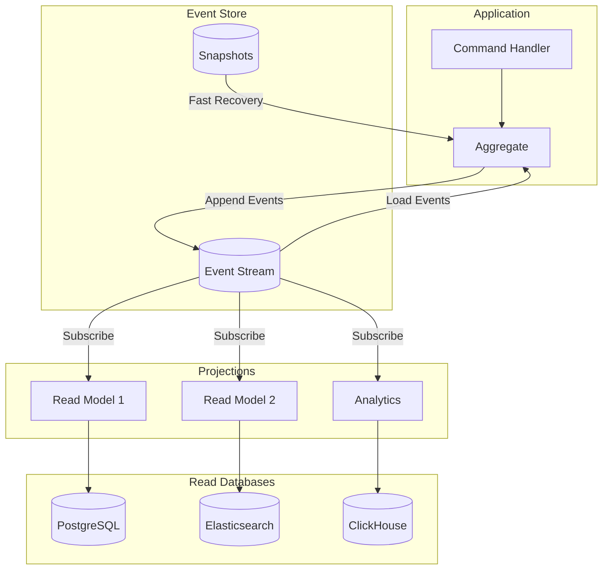

import { Accordion, Accordions } from 'fumadocs-ui/components/accordion';
import { Callout } from 'fumadocs-ui/components/callout';
import { Card, Cards } from 'fumadocs-ui/components/card';
import { File, Files, Folder } from 'fumadocs-ui/components/files';
import { Steps } from 'fumadocs-ui/components/steps';
import { Tab, Tabs } from 'fumadocs-ui/components/tabs';

# Event Sourcing

**Event Sourcing** is an architectural pattern where state changes are stored as a sequence of immutable events rather than storing only the current state. The current state is derived by replaying events from the beginning.

<Callout type="info">
Instead of storing "Order has 3 items totaling $150", Event Sourcing stores "OrderCreated → ItemAdded → ItemAdded → ItemAdded → PriceCalculated" and rebuilds the state from these events.
</Callout>

## Architecture Overview



## Core Concepts

### Events as Source of Truth

<Tabs items={['Traditional vs Event Sourcing', 'Event Structure', 'Event Types']}>
<Tab value="Traditional vs Event Sourcing">
```typescript title="comparison.ts"
// ❌ Traditional: Store current state only
interface OrderTable {
  id: string;
  customerId: string;
  status: 'pending' | 'confirmed' | 'shipped';
  items: OrderItem[];
  total: number;
  updatedAt: Date;
}

// When order ships, we UPDATE the row
// Previous states are LOST forever
await db.query(
  'UPDATE orders SET status = $1, updated_at = $2 WHERE id = $3',
  ['shipped', new Date(), orderId]
);

// ✅ Event Sourcing: Store all state changes
interface OrderEvent {
  eventId: string;
  aggregateId: string;
  type: string;
  data: unknown;
  timestamp: Date;
  version: number;
}

// Events are APPENDED, never modified or deleted
const events: OrderEvent[] = [
  {
    eventId: 'evt-1',
    aggregateId: 'order-123',
    type: 'OrderCreated',
    data: { customerId: 'cust-456', items: [] },
    timestamp: new Date('2024-01-01T10:00:00Z'),
    version: 1,
  },
  {
    eventId: 'evt-2',
    aggregateId: 'order-123',
    type: 'ItemAdded',
    data: { productId: 'prod-789', quantity: 2, price: 29.99 },
    timestamp: new Date('2024-01-01T10:05:00Z'),
    version: 2,
  },
  {
    eventId: 'evt-3',
    aggregateId: 'order-123',
    type: 'OrderConfirmed',
    data: { confirmedBy: 'user-111' },
    timestamp: new Date('2024-01-01T10:10:00Z'),
    version: 3,
  },
  {
    eventId: 'evt-4',
    aggregateId: 'order-123',
    type: 'OrderShipped',
    data: { carrier: 'FedEx', trackingNumber: 'FX123456' },
    timestamp: new Date('2024-01-02T14:00:00Z'),
    version: 4,
  },
];

// Current state = replay all events
const currentState = events.reduce(applyEvent, initialState);
```
</Tab>
<Tab value="Event Structure">
```typescript title="events/base-event.ts"
// Base event interface
interface DomainEvent<T extends string = string, D = unknown> {
  // Identity
  readonly eventId: string;           // Unique event identifier
  readonly aggregateId: string;       // Which aggregate this belongs to
  readonly aggregateType: string;     // Type of aggregate (Order, User, etc.)
  
  // Event info
  readonly type: T;                   // Event type name
  readonly data: D;                   // Event payload
  readonly version: number;           // Aggregate version after this event
  
  // Metadata
  readonly timestamp: Date;           // When event occurred
  readonly metadata: EventMetadata;   // Additional context
}

interface EventMetadata {
  readonly correlationId: string;     // Trace through system
  readonly causationId?: string;      // What caused this event
  readonly userId?: string;           // Who triggered the event
  readonly source?: string;           // Which service/component
  readonly schemaVersion: number;     // For event versioning
}

// Concrete event example
interface OrderCreatedEvent extends DomainEvent<'OrderCreated', OrderCreatedData> {
  readonly type: 'OrderCreated';
  readonly data: OrderCreatedData;
}

interface OrderCreatedData {
  readonly customerId: string;
  readonly customerEmail: string;
  readonly shippingAddress: Address;
  readonly currency: string;
}

// Event factory for consistency
const createEvent = <T extends DomainEvent>(
  type: T['type'],
  aggregateId: string,
  aggregateType: string,
  data: T['data'],
  version: number,
  metadata: Partial<EventMetadata>
): T => ({
  eventId: crypto.randomUUID(),
  aggregateId,
  aggregateType,
  type,
  data,
  version,
  timestamp: new Date(),
  metadata: {
    correlationId: metadata.correlationId ?? crypto.randomUUID(),
    causationId: metadata.causationId,
    userId: metadata.userId,
    source: metadata.source ?? 'order-service',
    schemaVersion: 1,
  },
} as T);
```
</Tab>
<Tab value="Event Types">
```typescript title="events/order.events.ts"
// Order lifecycle events
interface OrderCreatedEvent extends DomainEvent<'OrderCreated'> {
  data: {
    customerId: string;
    shippingAddress: Address;
    billingAddress: Address;
  };
}

interface OrderItemAddedEvent extends DomainEvent<'OrderItemAdded'> {
  data: {
    itemId: string;
    productId: string;
    productName: string;
    quantity: number;
    unitPrice: number;
  };
}

interface OrderItemRemovedEvent extends DomainEvent<'OrderItemRemoved'> {
  data: {
    itemId: string;
    reason?: string;
  };
}

interface OrderItemQuantityChangedEvent extends DomainEvent<'OrderItemQuantityChanged'> {
  data: {
    itemId: string;
    oldQuantity: number;
    newQuantity: number;
  };
}

interface OrderDiscountAppliedEvent extends DomainEvent<'OrderDiscountApplied'> {
  data: {
    discountCode: string;
    discountType: 'percentage' | 'fixed';
    discountValue: number;
    discountAmount: number;
  };
}

interface OrderSubmittedEvent extends DomainEvent<'OrderSubmitted'> {
  data: {
    subtotal: number;
    tax: number;
    shipping: number;
    discount: number;
    total: number;
  };
}

interface OrderPaymentReceivedEvent extends DomainEvent<'OrderPaymentReceived'> {
  data: {
    paymentId: string;
    amount: number;
    method: string;
    transactionId: string;
  };
}

interface OrderShippedEvent extends DomainEvent<'OrderShipped'> {
  data: {
    carrier: string;
    trackingNumber: string;
    estimatedDelivery: Date;
  };
}

interface OrderDeliveredEvent extends DomainEvent<'OrderDelivered'> {
  data: {
    deliveredAt: Date;
    signedBy?: string;
  };
}

interface OrderCancelledEvent extends DomainEvent<'OrderCancelled'> {
  data: {
    reason: string;
    cancelledBy: string;
    refundInitiated: boolean;
  };
}

// Union type for all order events
type OrderEvent =
  | OrderCreatedEvent
  | OrderItemAddedEvent
  | OrderItemRemovedEvent
  | OrderItemQuantityChangedEvent
  | OrderDiscountAppliedEvent
  | OrderSubmittedEvent
  | OrderPaymentReceivedEvent
  | OrderShippedEvent
  | OrderDeliveredEvent
  | OrderCancelledEvent;
```
</Tab>
</Tabs>

## Event Store Implementation

<Steps>
### Define Event Store Interface

```typescript title="infrastructure/event-store.interface.ts"
interface EventStore {
  // Append events to a stream
  appendToStream(
    streamId: string,
    events: DomainEvent[],
    expectedVersion: number
  ): Promise<void>;

  // Read events from a stream
  readStream(
    streamId: string,
    fromVersion?: number,
    toVersion?: number
  ): Promise<DomainEvent[]>;

  // Read all events (for projections)
  readAll(
    fromPosition?: number,
    maxCount?: number
  ): Promise<{ events: DomainEvent[]; lastPosition: number }>;

  // Subscribe to new events
  subscribe(
    fromPosition: number,
    onEvent: (event: DomainEvent, position: number) => Promise<void>
  ): Subscription;

  // Get stream metadata
  getStreamMetadata(streamId: string): Promise<StreamMetadata | null>;
}

interface StreamMetadata {
  streamId: string;
  version: number;
  createdAt: Date;
  updatedAt: Date;
}

interface Subscription {
  unsubscribe(): void;
}
```

### PostgreSQL Event Store

```typescript title="infrastructure/postgres-event-store.ts"
const createPostgresEventStore = (pool: Pool): EventStore => {
  const appendToStream = async (
    streamId: string,
    events: DomainEvent[],
    expectedVersion: number
  ): Promise<void> => {
    const client = await pool.connect();
    
    try {
      await client.query('BEGIN');

      // Optimistic concurrency check
      const currentVersion = await getCurrentVersion(client, streamId);
      
      if (currentVersion !== expectedVersion) {
        throw new ConcurrencyError(
          `Expected version ${expectedVersion}, but stream is at ${currentVersion}`
        );
      }

      // Insert events
      for (let i = 0; i < events.length; i++) {
        const event = events[i];
        const version = expectedVersion + i + 1;

        await client.query(
          `INSERT INTO events (
            event_id, stream_id, type, data, metadata, 
            version, timestamp, aggregate_type
          ) VALUES ($1, $2, $3, $4, $5, $6, $7, $8)`,
          [
            event.eventId,
            streamId,
            event.type,
            JSON.stringify(event.data),
            JSON.stringify(event.metadata),
            version,
            event.timestamp,
            event.aggregateType,
          ]
        );
      }

      // Update stream metadata
      await client.query(
        `INSERT INTO streams (stream_id, version, updated_at)
         VALUES ($1, $2, NOW())
         ON CONFLICT (stream_id) 
         DO UPDATE SET version = $2, updated_at = NOW()`,
        [streamId, expectedVersion + events.length]
      );

      await client.query('COMMIT');
      
      // Notify subscribers (using PostgreSQL NOTIFY)
      await client.query(
        `SELECT pg_notify('new_events', $1)`,
        [JSON.stringify({ streamId, count: events.length })]
      );
    } catch (error) {
      await client.query('ROLLBACK');
      throw error;
    } finally {
      client.release();
    }
  };

  const readStream = async (
    streamId: string,
    fromVersion = 0,
    toVersion?: number
  ): Promise<DomainEvent[]> => {
    const query = toVersion
      ? `SELECT * FROM events 
         WHERE stream_id = $1 AND version > $2 AND version <= $3 
         ORDER BY version`
      : `SELECT * FROM events 
         WHERE stream_id = $1 AND version > $2 
         ORDER BY version`;

    const params = toVersion
      ? [streamId, fromVersion, toVersion]
      : [streamId, fromVersion];

    const result = await pool.query(query, params);

    return result.rows.map(row => ({
      eventId: row.event_id,
      aggregateId: streamId,
      aggregateType: row.aggregate_type,
      type: row.type,
      data: row.data,
      metadata: row.metadata,
      version: row.version,
      timestamp: row.timestamp,
    }));
  };

  const readAll = async (
    fromPosition = 0,
    maxCount = 1000
  ): Promise<{ events: DomainEvent[]; lastPosition: number }> => {
    const result = await pool.query(
      `SELECT *, global_position FROM events 
       WHERE global_position > $1 
       ORDER BY global_position 
       LIMIT $2`,
      [fromPosition, maxCount]
    );

    const events = result.rows.map(row => ({
      eventId: row.event_id,
      aggregateId: row.stream_id,
      aggregateType: row.aggregate_type,
      type: row.type,
      data: row.data,
      metadata: row.metadata,
      version: row.version,
      timestamp: row.timestamp,
    }));

    const lastPosition = result.rows.length > 0
      ? result.rows[result.rows.length - 1].global_position
      : fromPosition;

    return { events, lastPosition };
  };

  const subscribe = (
    fromPosition: number,
    onEvent: (event: DomainEvent, position: number) => Promise<void>
  ): Subscription => {
    let running = true;
    let currentPosition = fromPosition;

    const poll = async () => {
      while (running) {
        const { events, lastPosition } = await readAll(currentPosition, 100);
        
        for (const event of events) {
          await onEvent(event, lastPosition);
        }
        
        currentPosition = lastPosition;
        
        if (events.length === 0) {
          // Wait before polling again
          await new Promise(resolve => setTimeout(resolve, 100));
        }
      }
    };

    poll().catch(console.error);

    return {
      unsubscribe: () => {
        running = false;
      },
    };
  };

  return {
    appendToStream,
    readStream,
    readAll,
    subscribe,
    getStreamMetadata: async (streamId) => {
      const result = await pool.query(
        'SELECT * FROM streams WHERE stream_id = $1',
        [streamId]
      );
      return result.rows[0] ?? null;
    },
  };
};

const getCurrentVersion = async (
  client: PoolClient,
  streamId: string
): Promise<number> => {
  const result = await client.query(
    'SELECT version FROM streams WHERE stream_id = $1 FOR UPDATE',
    [streamId]
  );
  return result.rows[0]?.version ?? 0;
};
```

### Database Schema

```sql title="migrations/001_create_event_store.sql"
-- Events table (append-only)
CREATE TABLE events (
  global_position BIGSERIAL PRIMARY KEY,
  event_id UUID UNIQUE NOT NULL,
  stream_id VARCHAR(255) NOT NULL,
  aggregate_type VARCHAR(100) NOT NULL,
  type VARCHAR(100) NOT NULL,
  data JSONB NOT NULL,
  metadata JSONB NOT NULL DEFAULT '{}',
  version INTEGER NOT NULL,
  timestamp TIMESTAMPTZ NOT NULL DEFAULT NOW(),
  
  UNIQUE (stream_id, version)
);

-- Indexes for common queries
CREATE INDEX idx_events_stream_id ON events(stream_id);
CREATE INDEX idx_events_type ON events(type);
CREATE INDEX idx_events_timestamp ON events(timestamp);
CREATE INDEX idx_events_correlation ON events((metadata->>'correlationId'));

-- Streams metadata table
CREATE TABLE streams (
  stream_id VARCHAR(255) PRIMARY KEY,
  aggregate_type VARCHAR(100),
  version INTEGER NOT NULL DEFAULT 0,
  created_at TIMESTAMPTZ NOT NULL DEFAULT NOW(),
  updated_at TIMESTAMPTZ NOT NULL DEFAULT NOW()
);

-- Snapshots table (optional, for performance)
CREATE TABLE snapshots (
  stream_id VARCHAR(255) PRIMARY KEY,
  data JSONB NOT NULL,
  version INTEGER NOT NULL,
  created_at TIMESTAMPTZ NOT NULL DEFAULT NOW()
);

-- Prevent updates/deletes on events (append-only)
CREATE OR REPLACE FUNCTION prevent_event_modification()
RETURNS TRIGGER AS $$
BEGIN
  RAISE EXCEPTION 'Events are immutable and cannot be modified or deleted';
END;
$$ LANGUAGE plpgsql;

CREATE TRIGGER events_immutable
BEFORE UPDATE OR DELETE ON events
FOR EACH ROW
EXECUTE FUNCTION prevent_event_modification();
```
</Steps>

## Aggregate Implementation

```typescript title="domain/order.aggregate.ts"
// Order state derived from events
interface OrderState {
  readonly id: string;
  readonly customerId: string;
  readonly items: Map<string, OrderItem>;
  readonly status: OrderStatus;
  readonly shippingAddress: Address;
  readonly subtotal: number;
  readonly tax: number;
  readonly shipping: number;
  readonly discount: number;
  readonly total: number;
  readonly version: number;
}

interface OrderItem {
  readonly id: string;
  readonly productId: string;
  readonly productName: string;
  readonly quantity: number;
  readonly unitPrice: number;
}

type OrderStatus = 'draft' | 'submitted' | 'paid' | 'shipped' | 'delivered' | 'cancelled';

// Initial state for new orders
const initialOrderState = (id: string): OrderState => ({
  id,
  customerId: '',
  items: new Map(),
  status: 'draft',
  shippingAddress: { street: '', city: '', country: '', postalCode: '' },
  subtotal: 0,
  tax: 0,
  shipping: 0,
  discount: 0,
  total: 0,
  version: 0,
});

// Event applicator - pure function
const applyOrderEvent = (state: OrderState, event: OrderEvent): OrderState => {
  switch (event.type) {
    case 'OrderCreated':
      return {
        ...state,
        customerId: event.data.customerId,
        shippingAddress: event.data.shippingAddress,
        version: event.version,
      };

    case 'OrderItemAdded': {
      const newItems = new Map(state.items);
      newItems.set(event.data.itemId, {
        id: event.data.itemId,
        productId: event.data.productId,
        productName: event.data.productName,
        quantity: event.data.quantity,
        unitPrice: event.data.unitPrice,
      });
      return recalculateTotals({
        ...state,
        items: newItems,
        version: event.version,
      });
    }

    case 'OrderItemRemoved': {
      const newItems = new Map(state.items);
      newItems.delete(event.data.itemId);
      return recalculateTotals({
        ...state,
        items: newItems,
        version: event.version,
      });
    }

    case 'OrderItemQuantityChanged': {
      const item = state.items.get(event.data.itemId);
      if (!item) return state;

      const newItems = new Map(state.items);
      newItems.set(event.data.itemId, {
        ...item,
        quantity: event.data.newQuantity,
      });
      return recalculateTotals({
        ...state,
        items: newItems,
        version: event.version,
      });
    }

    case 'OrderDiscountApplied':
      return recalculateTotals({
        ...state,
        discount: event.data.discountAmount,
        version: event.version,
      });

    case 'OrderSubmitted':
      return {
        ...state,
        status: 'submitted',
        version: event.version,
      };

    case 'OrderPaymentReceived':
      return {
        ...state,
        status: 'paid',
        version: event.version,
      };

    case 'OrderShipped':
      return {
        ...state,
        status: 'shipped',
        version: event.version,
      };

    case 'OrderDelivered':
      return {
        ...state,
        status: 'delivered',
        version: event.version,
      };

    case 'OrderCancelled':
      return {
        ...state,
        status: 'cancelled',
        version: event.version,
      };

    default:
      return state;
  }
};

const recalculateTotals = (state: OrderState): OrderState => {
  const subtotal = Array.from(state.items.values()).reduce(
    (sum, item) => sum + item.quantity * item.unitPrice,
    0
  );
  const tax = subtotal * 0.1;
  const shipping = subtotal > 100 ? 0 : 10;
  const total = subtotal + tax + shipping - state.discount;

  return { ...state, subtotal, tax, shipping, total };
};

// Rebuild state from events
const rebuildOrderState = (events: OrderEvent[]): OrderState => {
  if (events.length === 0) {
    throw new Error('Cannot rebuild state from empty events');
  }

  const orderId = events[0].aggregateId;
  return events.reduce(applyOrderEvent, initialOrderState(orderId));
};
```

## Order Aggregate with Commands

```typescript title="domain/order-aggregate.ts"
// Command handlers that produce events
interface OrderAggregate {
  readonly state: OrderState;
  readonly uncommittedEvents: OrderEvent[];
  
  create(command: CreateOrderCommand): OrderAggregate;
  addItem(command: AddItemCommand): OrderAggregate;
  removeItem(command: RemoveItemCommand): OrderAggregate;
  applyDiscount(command: ApplyDiscountCommand): OrderAggregate;
  submit(command: SubmitOrderCommand): OrderAggregate;
  cancel(command: CancelOrderCommand): OrderAggregate;
}

const createOrderAggregate = (
  state: OrderState,
  uncommittedEvents: OrderEvent[] = []
): OrderAggregate => {
  const aggregate: OrderAggregate = {
    state,
    uncommittedEvents,

    create(command: CreateOrderCommand): OrderAggregate {
      if (state.version > 0) {
        throw new BusinessRuleError('Order already exists');
      }

      const event: OrderCreatedEvent = {
        eventId: crypto.randomUUID(),
        aggregateId: command.orderId,
        aggregateType: 'Order',
        type: 'OrderCreated',
        data: {
          customerId: command.customerId,
          shippingAddress: command.shippingAddress,
          billingAddress: command.billingAddress,
        },
        version: 1,
        timestamp: new Date(),
        metadata: command.metadata,
      };

      return createOrderAggregate(
        applyOrderEvent(state, event),
        [...uncommittedEvents, event]
      );
    },

    addItem(command: AddItemCommand): OrderAggregate {
      if (state.status !== 'draft') {
        throw new BusinessRuleError('Cannot add items to non-draft order');
      }

      if (command.quantity <= 0) {
        throw new BusinessRuleError('Quantity must be positive');
      }

      const event: OrderItemAddedEvent = {
        eventId: crypto.randomUUID(),
        aggregateId: state.id,
        aggregateType: 'Order',
        type: 'OrderItemAdded',
        data: {
          itemId: crypto.randomUUID(),
          productId: command.productId,
          productName: command.productName,
          quantity: command.quantity,
          unitPrice: command.unitPrice,
        },
        version: state.version + 1,
        timestamp: new Date(),
        metadata: command.metadata,
      };

      return createOrderAggregate(
        applyOrderEvent(state, event),
        [...uncommittedEvents, event]
      );
    },

    removeItem(command: RemoveItemCommand): OrderAggregate {
      if (state.status !== 'draft') {
        throw new BusinessRuleError('Cannot remove items from non-draft order');
      }

      if (!state.items.has(command.itemId)) {
        throw new BusinessRuleError('Item not found');
      }

      const event: OrderItemRemovedEvent = {
        eventId: crypto.randomUUID(),
        aggregateId: state.id,
        aggregateType: 'Order',
        type: 'OrderItemRemoved',
        data: {
          itemId: command.itemId,
          reason: command.reason,
        },
        version: state.version + 1,
        timestamp: new Date(),
        metadata: command.metadata,
      };

      return createOrderAggregate(
        applyOrderEvent(state, event),
        [...uncommittedEvents, event]
      );
    },

    applyDiscount(command: ApplyDiscountCommand): OrderAggregate {
      if (state.status !== 'draft') {
        throw new BusinessRuleError('Cannot apply discount to non-draft order');
      }

      const discountAmount = command.discountType === 'percentage'
        ? state.subtotal * (command.discountValue / 100)
        : command.discountValue;

      const event: OrderDiscountAppliedEvent = {
        eventId: crypto.randomUUID(),
        aggregateId: state.id,
        aggregateType: 'Order',
        type: 'OrderDiscountApplied',
        data: {
          discountCode: command.discountCode,
          discountType: command.discountType,
          discountValue: command.discountValue,
          discountAmount,
        },
        version: state.version + 1,
        timestamp: new Date(),
        metadata: command.metadata,
      };

      return createOrderAggregate(
        applyOrderEvent(state, event),
        [...uncommittedEvents, event]
      );
    },

    submit(command: SubmitOrderCommand): OrderAggregate {
      if (state.status !== 'draft') {
        throw new BusinessRuleError('Only draft orders can be submitted');
      }

      if (state.items.size === 0) {
        throw new BusinessRuleError('Cannot submit empty order');
      }

      const event: OrderSubmittedEvent = {
        eventId: crypto.randomUUID(),
        aggregateId: state.id,
        aggregateType: 'Order',
        type: 'OrderSubmitted',
        data: {
          subtotal: state.subtotal,
          tax: state.tax,
          shipping: state.shipping,
          discount: state.discount,
          total: state.total,
        },
        version: state.version + 1,
        timestamp: new Date(),
        metadata: command.metadata,
      };

      return createOrderAggregate(
        applyOrderEvent(state, event),
        [...uncommittedEvents, event]
      );
    },

    cancel(command: CancelOrderCommand): OrderAggregate {
      if (state.status === 'delivered' || state.status === 'cancelled') {
        throw new BusinessRuleError('Cannot cancel delivered or already cancelled order');
      }

      const event: OrderCancelledEvent = {
        eventId: crypto.randomUUID(),
        aggregateId: state.id,
        aggregateType: 'Order',
        type: 'OrderCancelled',
        data: {
          reason: command.reason,
          cancelledBy: command.metadata.userId ?? 'system',
          refundInitiated: state.status === 'paid',
        },
        version: state.version + 1,
        timestamp: new Date(),
        metadata: command.metadata,
      };

      return createOrderAggregate(
        applyOrderEvent(state, event),
        [...uncommittedEvents, event]
      );
    },
  };

  return aggregate;
};

// Load aggregate from event store
const loadOrderAggregate = async (
  eventStore: EventStore,
  orderId: string
): Promise<OrderAggregate> => {
  const events = await eventStore.readStream(`order-${orderId}`);
  
  if (events.length === 0) {
    return createOrderAggregate(initialOrderState(orderId));
  }

  const state = rebuildOrderState(events as OrderEvent[]);
  return createOrderAggregate(state);
};

// Save aggregate to event store
const saveOrderAggregate = async (
  eventStore: EventStore,
  aggregate: OrderAggregate
): Promise<void> => {
  if (aggregate.uncommittedEvents.length === 0) return;

  const expectedVersion = aggregate.state.version - aggregate.uncommittedEvents.length;
  
  await eventStore.appendToStream(
    `order-${aggregate.state.id}`,
    aggregate.uncommittedEvents,
    expectedVersion
  );
};
```

## Snapshots for Performance

```typescript title="infrastructure/snapshot-store.ts"
interface SnapshotStore {
  save<T>(streamId: string, snapshot: Snapshot<T>): Promise<void>;
  load<T>(streamId: string): Promise<Snapshot<T> | null>;
}

interface Snapshot<T> {
  state: T;
  version: number;
  createdAt: Date;
}

const createSnapshotStore = (pool: Pool): SnapshotStore => ({
  save: async (streamId, snapshot) => {
    await pool.query(
      `INSERT INTO snapshots (stream_id, data, version, created_at)
       VALUES ($1, $2, $3, $4)
       ON CONFLICT (stream_id) 
       DO UPDATE SET data = $2, version = $3, created_at = $4`,
      [streamId, JSON.stringify(snapshot.state), snapshot.version, snapshot.createdAt]
    );
  },

  load: async (streamId) => {
    const result = await pool.query(
      'SELECT * FROM snapshots WHERE stream_id = $1',
      [streamId]
    );

    if (result.rows.length === 0) return null;

    return {
      state: result.rows[0].data,
      version: result.rows[0].version,
      createdAt: result.rows[0].created_at,
    };
  },
});

// Aggregate loader with snapshot support
const loadOrderAggregateWithSnapshot = async (
  eventStore: EventStore,
  snapshotStore: SnapshotStore,
  orderId: string
): Promise<OrderAggregate> => {
  const streamId = `order-${orderId}`;
  
  // Try to load snapshot first
  const snapshot = await snapshotStore.load<OrderState>(streamId);
  
  if (snapshot) {
    // Load only events after snapshot
    const events = await eventStore.readStream(streamId, snapshot.version);
    const state = events.reduce(applyOrderEvent, snapshot.state);
    return createOrderAggregate(state);
  }

  // No snapshot, load all events
  const events = await eventStore.readStream(streamId);
  
  if (events.length === 0) {
    return createOrderAggregate(initialOrderState(orderId));
  }

  const state = rebuildOrderState(events as OrderEvent[]);
  
  // Create snapshot if many events
  if (events.length > 100) {
    await snapshotStore.save(streamId, {
      state,
      version: state.version,
      createdAt: new Date(),
    });
  }

  return createOrderAggregate(state);
};
```

## Projections (Read Models)

<Tabs items={['Order Projection', 'Analytics Projection', 'Search Projection']}>
<Tab value="Order Projection">
```typescript title="projections/order-details.projection.ts"
// Projection builds read model from events
const createOrderDetailsProjection = (
  readDb: Database
): EventProjection => ({
  name: 'order-details',
  
  eventTypes: [
    'OrderCreated',
    'OrderItemAdded',
    'OrderItemRemoved',
    'OrderSubmitted',
    'OrderShipped',
    'OrderDelivered',
    'OrderCancelled',
  ],

  async project(event: DomainEvent): Promise<void> {
    const orderId = event.aggregateId.replace('order-', '');

    switch (event.type) {
      case 'OrderCreated': {
        const data = event.data as OrderCreatedData;
        
        // Denormalize customer data
        const customer = await readDb.query(
          'SELECT * FROM customers WHERE id = $1',
          [data.customerId]
        );

        await readDb.query(
          `INSERT INTO order_read_model (
            order_id, customer_id, customer_name, customer_email,
            status, shipping_address, items, timeline,
            created_at, updated_at, version
          ) VALUES ($1, $2, $3, $4, $5, $6, $7, $8, $9, $9, $10)`,
          [
            orderId,
            data.customerId,
            customer.rows[0]?.name ?? 'Unknown',
            customer.rows[0]?.email ?? '',
            'draft',
            JSON.stringify(data.shippingAddress),
            '[]',
            JSON.stringify([{
              type: 'created',
              timestamp: event.timestamp,
              description: 'Order created',
            }]),
            event.timestamp,
            event.version,
          ]
        );
        break;
      }

      case 'OrderItemAdded': {
        const data = event.data as OrderItemAddedData;
        
        // Add item to JSONB array
        await readDb.query(
          `UPDATE order_read_model 
           SET items = items || $1::jsonb,
               updated_at = $2,
               version = $3
           WHERE order_id = $4`,
          [
            JSON.stringify({
              id: data.itemId,
              productId: data.productId,
              productName: data.productName,
              quantity: data.quantity,
              unitPrice: data.unitPrice,
              lineTotal: data.quantity * data.unitPrice,
            }),
            event.timestamp,
            event.version,
            orderId,
          ]
        );

        // Recalculate totals
        await recalculateOrderTotals(readDb, orderId);
        break;
      }

      case 'OrderItemRemoved': {
        const data = event.data as { itemId: string };
        
        await readDb.query(
          `UPDATE order_read_model 
           SET items = (
             SELECT jsonb_agg(item) 
             FROM jsonb_array_elements(items) AS item 
             WHERE item->>'id' != $1
           ),
           updated_at = $2,
           version = $3
           WHERE order_id = $4`,
          [data.itemId, event.timestamp, event.version, orderId]
        );

        await recalculateOrderTotals(readDb, orderId);
        break;
      }

      case 'OrderSubmitted': {
        const data = event.data as OrderSubmittedData;
        
        await readDb.query(
          `UPDATE order_read_model 
           SET status = 'submitted',
               subtotal = $1,
               tax = $2,
               shipping = $3,
               discount = $4,
               total = $5,
               submitted_at = $6,
               timeline = timeline || $7::jsonb,
               updated_at = $6,
               version = $8
           WHERE order_id = $9`,
          [
            data.subtotal,
            data.tax,
            data.shipping,
            data.discount,
            data.total,
            event.timestamp,
            JSON.stringify({
              type: 'submitted',
              timestamp: event.timestamp,
              description: 'Order submitted for processing',
            }),
            event.version,
            orderId,
          ]
        );
        break;
      }

      case 'OrderShipped': {
        const data = event.data as OrderShippedData;
        
        await readDb.query(
          `UPDATE order_read_model 
           SET status = 'shipped',
               tracking_number = $1,
               carrier = $2,
               estimated_delivery = $3,
               shipped_at = $4,
               timeline = timeline || $5::jsonb,
               updated_at = $4,
               version = $6
           WHERE order_id = $7`,
          [
            data.trackingNumber,
            data.carrier,
            data.estimatedDelivery,
            event.timestamp,
            JSON.stringify({
              type: 'shipped',
              timestamp: event.timestamp,
              description: `Shipped via ${data.carrier}. Tracking: ${data.trackingNumber}`,
            }),
            event.version,
            orderId,
          ]
        );
        break;
      }

      case 'OrderDelivered': {
        await readDb.query(
          `UPDATE order_read_model 
           SET status = 'delivered',
               delivered_at = $1,
               timeline = timeline || $2::jsonb,
               updated_at = $1,
               version = $3
           WHERE order_id = $4`,
          [
            event.timestamp,
            JSON.stringify({
              type: 'delivered',
              timestamp: event.timestamp,
              description: 'Order delivered successfully',
            }),
            event.version,
            orderId,
          ]
        );
        break;
      }

      case 'OrderCancelled': {
        const data = event.data as { reason: string };
        
        await readDb.query(
          `UPDATE order_read_model 
           SET status = 'cancelled',
               cancelled_at = $1,
               cancellation_reason = $2,
               timeline = timeline || $3::jsonb,
               updated_at = $1,
               version = $4
           WHERE order_id = $5`,
          [
            event.timestamp,
            data.reason,
            JSON.stringify({
              type: 'cancelled',
              timestamp: event.timestamp,
              description: `Order cancelled: ${data.reason}`,
            }),
            event.version,
            orderId,
          ]
        );
        break;
      }
    }
  },

  async reset(): Promise<void> {
    await readDb.query('TRUNCATE order_read_model');
  },
});

const recalculateOrderTotals = async (
  readDb: Database,
  orderId: string
): Promise<void> => {
  await readDb.query(
    `UPDATE order_read_model 
     SET subtotal = (
       SELECT COALESCE(SUM((item->>'lineTotal')::decimal), 0)
       FROM jsonb_array_elements(items) AS item
     ),
     tax = subtotal * 0.1,
     shipping = CASE WHEN subtotal > 100 THEN 0 ELSE 10 END,
     total = subtotal + tax + shipping - COALESCE(discount, 0)
     WHERE order_id = $1`,
    [orderId]
  );
};
```
</Tab>
<Tab value="Analytics Projection">
```typescript title="projections/analytics.projection.ts"
// Analytics projection for dashboards
const createAnalyticsProjection = (
  analyticsDb: ClickHouseClient
): EventProjection => ({
  name: 'order-analytics',
  
  eventTypes: [
    'OrderSubmitted',
    'OrderShipped',
    'OrderDelivered',
    'OrderCancelled',
  ],

  async project(event: DomainEvent): Promise<void> {
    const orderId = event.aggregateId.replace('order-', '');

    switch (event.type) {
      case 'OrderSubmitted': {
        const data = event.data as OrderSubmittedData;
        
        // Insert into analytics table
        await analyticsDb.insert({
          table: 'order_events',
          values: [{
            event_id: event.eventId,
            order_id: orderId,
            event_type: 'submitted',
            amount: data.total,
            item_count: data.itemCount,
            timestamp: event.timestamp,
            date: event.timestamp.toISOString().split('T')[0],
          }],
        });

        // Update daily aggregates
        await analyticsDb.query({
          query: `
            INSERT INTO daily_order_stats (date, orders_submitted, revenue)
            VALUES ({date:Date}, 1, {amount:Float64})
            ON DUPLICATE KEY UPDATE
              orders_submitted = orders_submitted + 1,
              revenue = revenue + {amount:Float64}
          `,
          query_params: {
            date: event.timestamp.toISOString().split('T')[0],
            amount: data.total,
          },
        });
        break;
      }

      case 'OrderShipped': {
        await analyticsDb.insert({
          table: 'order_events',
          values: [{
            event_id: event.eventId,
            order_id: orderId,
            event_type: 'shipped',
            timestamp: event.timestamp,
            date: event.timestamp.toISOString().split('T')[0],
          }],
        });

        // Calculate time to ship
        const orderCreated = await analyticsDb.query({
          query: `
            SELECT timestamp FROM order_events 
            WHERE order_id = {orderId:String} AND event_type = 'submitted'
            LIMIT 1
          `,
          query_params: { orderId },
        });

        if (orderCreated.length > 0) {
          const timeToShipHours = 
            (event.timestamp.getTime() - new Date(orderCreated[0].timestamp).getTime()) 
            / (1000 * 60 * 60);

          await analyticsDb.query({
            query: `
              INSERT INTO fulfillment_metrics (order_id, time_to_ship_hours, date)
              VALUES ({orderId:String}, {hours:Float64}, {date:Date})
            `,
            query_params: {
              orderId,
              hours: timeToShipHours,
              date: event.timestamp.toISOString().split('T')[0],
            },
          });
        }
        break;
      }

      case 'OrderCancelled': {
        const data = event.data as { reason: string };
        
        await analyticsDb.insert({
          table: 'order_events',
          values: [{
            event_id: event.eventId,
            order_id: orderId,
            event_type: 'cancelled',
            cancellation_reason: data.reason,
            timestamp: event.timestamp,
            date: event.timestamp.toISOString().split('T')[0],
          }],
        });

        await analyticsDb.query({
          query: `
            INSERT INTO daily_order_stats (date, orders_cancelled)
            VALUES ({date:Date}, 1)
            ON DUPLICATE KEY UPDATE
              orders_cancelled = orders_cancelled + 1
          `,
          query_params: {
            date: event.timestamp.toISOString().split('T')[0],
          },
        });
        break;
      }
    }
  },
});
```
</Tab>
<Tab value="Search Projection">
```typescript title="projections/search.projection.ts"
// Elasticsearch projection for full-text search
const createSearchProjection = (
  elasticsearch: Client
): EventProjection => ({
  name: 'order-search',
  
  eventTypes: [
    'OrderCreated',
    'OrderItemAdded',
    'OrderSubmitted',
    'OrderShipped',
    'OrderCancelled',
  ],

  async project(event: DomainEvent): Promise<void> {
    const orderId = event.aggregateId.replace('order-', '');

    switch (event.type) {
      case 'OrderCreated': {
        const data = event.data as OrderCreatedData;
        
        // Create searchable document
        await elasticsearch.index({
          index: 'orders',
          id: orderId,
          document: {
            orderId,
            customerId: data.customerId,
            status: 'draft',
            items: [],
            shippingAddress: formatAddressForSearch(data.shippingAddress),
            createdAt: event.timestamp,
            updatedAt: event.timestamp,
          },
        });
        break;
      }

      case 'OrderItemAdded': {
        const data = event.data as OrderItemAddedData;
        
        // Add item to search document
        await elasticsearch.update({
          index: 'orders',
          id: orderId,
          script: {
            source: `
              ctx._source.items.add(params.item);
              ctx._source.updatedAt = params.timestamp;
            `,
            params: {
              item: {
                productId: data.productId,
                productName: data.productName,
                quantity: data.quantity,
              },
              timestamp: event.timestamp,
            },
          },
        });
        break;
      }

      case 'OrderSubmitted': {
        const data = event.data as OrderSubmittedData;
        
        await elasticsearch.update({
          index: 'orders',
          id: orderId,
          doc: {
            status: 'submitted',
            total: data.total,
            itemCount: data.itemCount,
            submittedAt: event.timestamp,
            updatedAt: event.timestamp,
          },
        });
        break;
      }

      case 'OrderShipped': {
        const data = event.data as OrderShippedData;
        
        await elasticsearch.update({
          index: 'orders',
          id: orderId,
          doc: {
            status: 'shipped',
            trackingNumber: data.trackingNumber,
            carrier: data.carrier,
            shippedAt: event.timestamp,
            updatedAt: event.timestamp,
          },
        });
        break;
      }

      case 'OrderCancelled': {
        await elasticsearch.update({
          index: 'orders',
          id: orderId,
          doc: {
            status: 'cancelled',
            cancelledAt: event.timestamp,
            updatedAt: event.timestamp,
          },
        });
        break;
      }
    }
  },

  async reset(): Promise<void> {
    await elasticsearch.indices.delete({ index: 'orders' });
    await elasticsearch.indices.create({
      index: 'orders',
      mappings: {
        properties: {
          orderId: { type: 'keyword' },
          customerId: { type: 'keyword' },
          status: { type: 'keyword' },
          items: {
            type: 'nested',
            properties: {
              productId: { type: 'keyword' },
              productName: { type: 'text' },
              quantity: { type: 'integer' },
            },
          },
          shippingAddress: { type: 'text' },
          total: { type: 'float' },
          createdAt: { type: 'date' },
          submittedAt: { type: 'date' },
          shippedAt: { type: 'date' },
        },
      },
    });
  },
});
```
</Tab>
</Tabs>

## Temporal Queries

```typescript title="queries/temporal-queries.ts"
// Event sourcing enables powerful temporal queries

// Get state at a specific point in time
const getOrderStateAtTime = async (
  eventStore: EventStore,
  orderId: string,
  asOfTime: Date
): Promise<OrderState> => {
  const events = await eventStore.readStream(`order-${orderId}`);
  
  // Filter events up to the specified time
  const eventsAtTime = events.filter(e => e.timestamp <= asOfTime);
  
  if (eventsAtTime.length === 0) {
    throw new Error('Order did not exist at specified time');
  }

  return rebuildOrderState(eventsAtTime as OrderEvent[]);
};

// Get state at a specific version
const getOrderStateAtVersion = async (
  eventStore: EventStore,
  orderId: string,
  version: number
): Promise<OrderState> => {
  const events = await eventStore.readStream(`order-${orderId}`, 0, version);
  
  if (events.length === 0) {
    throw new Error('Order not found');
  }

  return rebuildOrderState(events as OrderEvent[]);
};

// Get complete audit trail
const getOrderAuditTrail = async (
  eventStore: EventStore,
  orderId: string
): Promise<AuditEntry[]> => {
  const events = await eventStore.readStream(`order-${orderId}`);

  return events.map(event => ({
    timestamp: event.timestamp,
    action: event.type,
    userId: event.metadata.userId,
    changes: describeEventChanges(event),
    correlationId: event.metadata.correlationId,
  }));
};

const describeEventChanges = (event: DomainEvent): string => {
  switch (event.type) {
    case 'OrderCreated':
      return `Order created for customer ${event.data.customerId}`;
    case 'OrderItemAdded':
      return `Added ${event.data.quantity}x ${event.data.productName}`;
    case 'OrderItemRemoved':
      return `Removed item ${event.data.itemId}`;
    case 'OrderSubmitted':
      return `Order submitted with total $${event.data.total}`;
    case 'OrderShipped':
      return `Shipped via ${event.data.carrier} (${event.data.trackingNumber})`;
    case 'OrderCancelled':
      return `Cancelled: ${event.data.reason}`;
    default:
      return event.type;
  }
};

// Compare two versions
const compareOrderVersions = async (
  eventStore: EventStore,
  orderId: string,
  version1: number,
  version2: number
): Promise<OrderDiff> => {
  const [state1, state2] = await Promise.all([
    getOrderStateAtVersion(eventStore, orderId, version1),
    getOrderStateAtVersion(eventStore, orderId, version2),
  ]);

  return {
    version1,
    version2,
    changes: {
      status: state1.status !== state2.status 
        ? { from: state1.status, to: state2.status } 
        : undefined,
      itemsAdded: [...state2.items.values()].filter(
        item => !state1.items.has(item.id)
      ),
      itemsRemoved: [...state1.items.values()].filter(
        item => !state2.items.has(item.id)
      ),
      totalChange: state2.total - state1.total,
    },
  };
};
```

## Project Structure

<Files>
  <Folder name="src" defaultOpen>
    <Folder name="domain" defaultOpen>
      <Folder name="order">
        <File name="order.aggregate.ts" />
        <File name="order.events.ts" />
        <File name="order.commands.ts" />
        <File name="order.state.ts" />
      </Folder>
      <File name="base.event.ts" />
      <File name="errors.ts" />
    </Folder>
    <Folder name="infrastructure" defaultOpen>
      <Folder name="event-store">
        <File name="event-store.interface.ts" />
        <File name="postgres-event-store.ts" />
        <File name="snapshot-store.ts" />
      </Folder>
      <Folder name="projections">
        <File name="projection.interface.ts" />
        <File name="projection-engine.ts" />
      </Folder>
      <File name="database.ts" />
    </Folder>
    <Folder name="projections" defaultOpen>
      <File name="order-details.projection.ts" />
      <File name="order-list.projection.ts" />
      <File name="analytics.projection.ts" />
      <File name="search.projection.ts" />
    </Folder>
    <Folder name="queries">
      <File name="order.queries.ts" />
      <File name="temporal.queries.ts" />
    </Folder>
    <Folder name="handlers">
      <File name="order-command.handler.ts" />
    </Folder>
    <Folder name="api">
      <File name="order.routes.ts" />
    </Folder>
  </Folder>
  <Folder name="migrations">
    <File name="001_create_event_store.sql" />
    <File name="002_create_read_models.sql" />
  </Folder>
</Files>

## Event Versioning

```typescript title="infrastructure/event-versioning.ts"
// Handle schema evolution of events

interface EventUpgrader<TOld, TNew> {
  fromVersion: number;
  toVersion: number;
  upgrade(event: TOld): TNew;
}

// V1 -> V2: Added currency field
const orderCreatedV1ToV2: EventUpgrader<OrderCreatedV1, OrderCreatedV2> = {
  fromVersion: 1,
  toVersion: 2,
  upgrade: (event) => ({
    ...event,
    data: {
      ...event.data,
      currency: 'USD', // Default for old events
    },
    metadata: {
      ...event.metadata,
      schemaVersion: 2,
    },
  }),
};

// V2 -> V3: Split address into components
const orderCreatedV2ToV3: EventUpgrader<OrderCreatedV2, OrderCreatedV3> = {
  fromVersion: 2,
  toVersion: 3,
  upgrade: (event) => ({
    ...event,
    data: {
      ...event.data,
      shippingAddress: parseAddressString(event.data.shippingAddress),
    },
    metadata: {
      ...event.metadata,
      schemaVersion: 3,
    },
  }),
};

// Upgrader registry
const createEventUpgraderRegistry = () => {
  const upgraders = new Map<string, EventUpgrader<any, any>[]>();

  return {
    register: (eventType: string, upgrader: EventUpgrader<any, any>) => {
      const existing = upgraders.get(eventType) ?? [];
      upgraders.set(eventType, [...existing, upgrader].sort(
        (a, b) => a.fromVersion - b.fromVersion
      ));
    },

    upgrade: (event: DomainEvent): DomainEvent => {
      const eventUpgraders = upgraders.get(event.type);
      if (!eventUpgraders) return event;

      const currentVersion = event.metadata.schemaVersion ?? 1;
      
      return eventUpgraders
        .filter(u => u.fromVersion >= currentVersion)
        .reduce((e, upgrader) => upgrader.upgrade(e), event);
    },
  };
};

// Event store wrapper with automatic upgrading
const createUpgradingEventStore = (
  eventStore: EventStore,
  upgraderRegistry: EventUpgraderRegistry
): EventStore => ({
  ...eventStore,

  readStream: async (streamId, fromVersion, toVersion) => {
    const events = await eventStore.readStream(streamId, fromVersion, toVersion);
    return events.map(e => upgraderRegistry.upgrade(e));
  },

  readAll: async (fromPosition, maxCount) => {
    const result = await eventStore.readAll(fromPosition, maxCount);
    return {
      ...result,
      events: result.events.map(e => upgraderRegistry.upgrade(e)),
    };
  },
});
```

## When to Use Event Sourcing

<Cards>
  <Card title="✅ Good Fit">
    - Complete audit trail is required (finance, healthcare, legal)
    - Temporal queries ("what was state at time X?")
    - Complex domain with many state transitions
    - Need to replay events for debugging
    - Event-driven integrations with other systems
    - Undo/redo functionality required
  </Card>
  <Card title="❌ Poor Fit">
    - Simple CRUD without audit requirements
    - High-frequency updates (real-time gaming)
    - Large binary data storage
    - Teams unfamiliar with eventual consistency
    - Need for ad-hoc SQL queries on current state
    - Tight deadlines with no time to learn
  </Card>
</Cards>

<Accordions>
  <Accordion title="Benefits">
    - **Complete History**: Every state change preserved forever
    - **Audit Trail**: Built-in compliance and debugging capability
    - **Temporal Queries**: Answer "what was state at time X?"
    - **Event Replay**: Rebuild state, fix bugs, create new projections
    - **Debugging**: Reproduce exact sequence that led to bug
    - **Integration**: Events naturally integrate with other systems
  </Accordion>
  <Accordion title="Challenges">
    - **Eventual Consistency**: Read models may lag behind events
    - **Event Schema Evolution**: Must handle versioning carefully
    - **Storage Growth**: Events accumulate forever (use snapshots)
    - **Complexity**: Higher learning curve than traditional storage
    - **Querying**: Can't do ad-hoc SQL on event store
    - **GDPR Compliance**: Hard to "delete" data from immutable log
  </Accordion>
</Accordions>

## Related Patterns

- **[CQRS](/docs/code-quality/architecture/cqrs)** - Often combined with Event Sourcing for read/write separation
- **[Event-Driven Architecture](/docs/code-quality/architecture/event-driven)** - Events enable reactive systems
- **[Hexagonal Architecture](/docs/code-quality/architecture/hexagonal)** - Domain events fit naturally with ports and adapters
