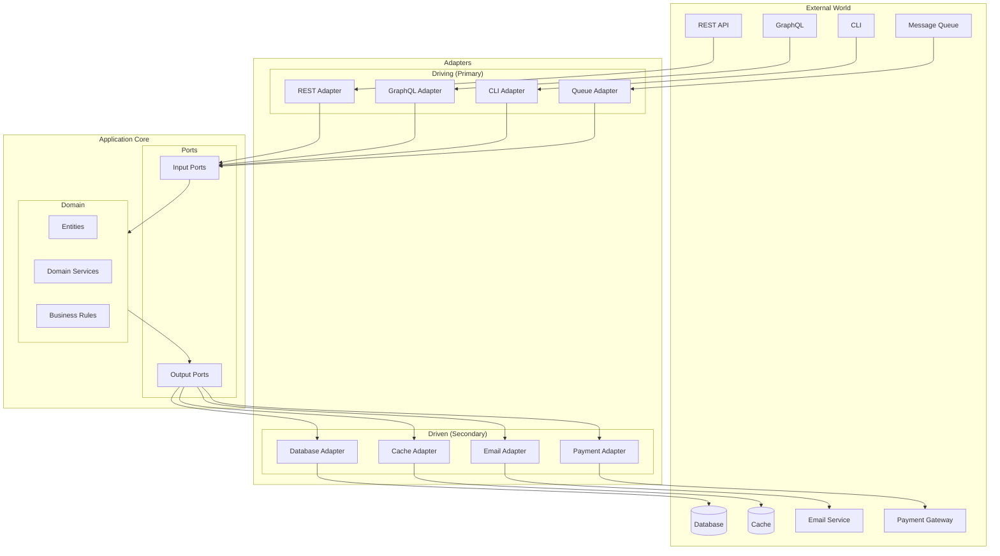
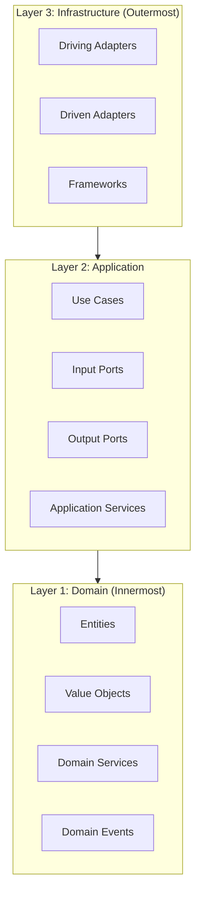

# Hexagonal Architecture

Hexagonal Architecture (also known as Ports and Adapters) isolates the core business logic from external concerns like databases, APIs, and UI. The domain is at the center, protected by ports (interfaces) and adapters (implementations).



## Core Concepts

<Cards>
  <Card title="Domain">
    Pure business logic with no external dependencies. Contains entities, value objects, and domain services.
  </Card>
  <Card title="Ports">
    Interfaces that define how the domain interacts with the outside world. Input ports for incoming, output ports for outgoing.
  </Card>
  <Card title="Adapters">
    Implementations that connect ports to external systems. Can be swapped without changing domain logic.
  </Card>
  <Card title="Dependency Rule">
    Dependencies point inward. The domain knows nothing about adapters or infrastructure.
  </Card>
</Cards>

## The Hexagon Layers



<Tabs items={['Domain Layer', 'Application Layer', 'Infrastructure Layer']}>
  <Tab value="Domain Layer">
    ### Domain Layer (Core)
    
    Pure business logic with zero external dependencies.
    
    ```typescript title="domain/entities/order.entity.ts"
    // Entity - has identity and lifecycle
    type OrderStatus = 'pending' | 'confirmed' | 'shipped' | 'delivered' | 'cancelled';
    
    type OrderProps = {
      id: string;
      customerId: string;
      items: OrderItem[];
      status: OrderStatus;
      shippingAddress: Address;
      createdAt: Date;
      updatedAt: Date;
    };
    
    // Order entity with business rules
    const createOrder = (props: OrderProps) => {
      // Invariants validation
      if (props.items.length === 0) {
        throw new DomainError('Order must have at least one item');
      }
      
      return {
        ...props,
        
        // Business logic methods
        getTotal: () => props.items.reduce(
          (sum, item) => sum + item.price * item.quantity, 
          0
        ),
        
        canBeCancelled: () => ['pending', 'confirmed'].includes(props.status),
        
        cancel: () => {
          if (!['pending', 'confirmed'].includes(props.status)) {
            throw new DomainError('Cannot cancel order in current status');
          }
          return createOrder({ ...props, status: 'cancelled', updatedAt: new Date() });
        },
        
        confirm: () => {
          if (props.status !== 'pending') {
            throw new DomainError('Can only confirm pending orders');
          }
          return createOrder({ ...props, status: 'confirmed', updatedAt: new Date() });
        },
        
        ship: (trackingNumber: string) => {
          if (props.status !== 'confirmed') {
            throw new DomainError('Can only ship confirmed orders');
          }
          return createOrder({ 
            ...props, 
            status: 'shipped', 
            trackingNumber,
            updatedAt: new Date() 
          });
        },
      };
    };
    
    type Order = ReturnType<typeof createOrder>;
    ```
    
    ```typescript title="domain/value-objects/money.vo.ts"
    // Value Object - immutable, no identity, compared by value
    type Currency = 'USD' | 'EUR' | 'GBP';
    
    type MoneyProps = {
      amount: number;
      currency: Currency;
    };
    
    const createMoney = (props: MoneyProps) => {
      if (props.amount < 0) {
        throw new DomainError('Amount cannot be negative');
      }
      
      return {
        ...props,
        
        add: (other: Money) => {
          if (props.currency !== other.currency) {
            throw new DomainError('Cannot add different currencies');
          }
          return createMoney({ 
            amount: props.amount + other.amount, 
            currency: props.currency 
          });
        },
        
        subtract: (other: Money) => {
          if (props.currency !== other.currency) {
            throw new DomainError('Cannot subtract different currencies');
          }
          if (props.amount < other.amount) {
            throw new DomainError('Insufficient funds');
          }
          return createMoney({ 
            amount: props.amount - other.amount, 
            currency: props.currency 
          });
        },
        
        multiply: (factor: number) => createMoney({ 
          amount: props.amount * factor, 
          currency: props.currency 
        }),
        
        equals: (other: Money) => 
          props.amount === other.amount && props.currency === other.currency,
        
        format: () => new Intl.NumberFormat('en-US', {
          style: 'currency',
          currency: props.currency,
        }).format(props.amount),
      };
    };
    
    type Money = ReturnType<typeof createMoney>;
    ```
    
    ```typescript title="domain/services/pricing.service.ts"
    // Domain Service - stateless business logic
    type PricingRules = {
      bulkDiscountThreshold: number;
      bulkDiscountPercent: number;
      loyaltyDiscountPercent: number;
    };
    
    const createPricingService = (rules: PricingRules) => ({
      calculateOrderTotal: (
        items: OrderItem[], 
        customer: Customer
      ): Money => {
        const subtotal = items.reduce(
          (sum, item) => sum.add(item.price.multiply(item.quantity)),
          createMoney({ amount: 0, currency: 'USD' })
        );
        
        // Apply bulk discount
        const totalQuantity = items.reduce((sum, i) => sum + i.quantity, 0);
        let discountedTotal = subtotal;
        
        if (totalQuantity >= rules.bulkDiscountThreshold) {
          const discount = subtotal.multiply(rules.bulkDiscountPercent / 100);
          discountedTotal = subtotal.subtract(discount);
        }
        
        // Apply loyalty discount
        if (customer.isLoyal) {
          const loyaltyDiscount = discountedTotal.multiply(
            rules.loyaltyDiscountPercent / 100
          );
          discountedTotal = discountedTotal.subtract(loyaltyDiscount);
        }
        
        return discountedTotal;
      },
    });
    ```
  </Tab>
  
  <Tab value="Application Layer">
    ### Application Layer
    
    Orchestrates use cases using ports.
    
    ```typescript title="application/ports/input/create-order.port.ts"
    // Input Port - defines what the application can do
    type CreateOrderCommand = {
      customerId: string;
      items: Array<{
        productId: string;
        quantity: number;
      }>;
      shippingAddress: {
        street: string;
        city: string;
        country: string;
        postalCode: string;
      };
    };
    
    type CreateOrderResult = {
      orderId: string;
      total: number;
      status: string;
    };
    
    // Input port interface
    type CreateOrderUseCase = {
      execute: (command: CreateOrderCommand) => Promise<CreateOrderResult>;
    };
    ```
    
    ```typescript title="application/ports/output/order.repository.ts"
    // Output Port - defines what the domain needs from infrastructure
    type OrderRepository = {
      save: (order: Order) => Promise<void>;
      findById: (id: string) => Promise<Order | null>;
      findByCustomerId: (customerId: string) => Promise<Order[]>;
      nextId: () => string;
    };
    
    type ProductRepository = {
      findById: (id: string) => Promise<Product | null>;
      findByIds: (ids: string[]) => Promise<Product[]>;
      updateStock: (id: string, quantity: number) => Promise<void>;
    };
    
    type CustomerRepository = {
      findById: (id: string) => Promise<Customer | null>;
    };
    
    type PaymentGateway = {
      charge: (customerId: string, amount: Money) => Promise<PaymentResult>;
      refund: (paymentId: string) => Promise<RefundResult>;
    };
    
    type NotificationService = {
      sendOrderConfirmation: (email: string, order: Order) => Promise<void>;
      sendShippingNotification: (email: string, trackingNumber: string) => Promise<void>;
    };
    ```
    
    ```typescript title="application/use-cases/create-order.use-case.ts"
    // Use Case implementation
    type CreateOrderDependencies = {
      orderRepository: OrderRepository;
      productRepository: ProductRepository;
      customerRepository: CustomerRepository;
      pricingService: PricingService;
      eventPublisher: EventPublisher;
    };
    
    const createCreateOrderUseCase = (
      deps: CreateOrderDependencies
    ): CreateOrderUseCase => ({
      execute: async (command) => {
        // 1. Validate customer exists
        const customer = await deps.customerRepository.findById(command.customerId);
        if (!customer) {
          throw new ApplicationError('Customer not found');
        }
        
        // 2. Get products and validate availability
        const productIds = command.items.map(i => i.productId);
        const products = await deps.productRepository.findByIds(productIds);
        
        if (products.length !== productIds.length) {
          throw new ApplicationError('Some products not found');
        }
        
        // 3. Build order items with prices
        const orderItems = command.items.map(item => {
          const product = products.find(p => p.id === item.productId)!;
          
          if (product.stock < item.quantity) {
            throw new ApplicationError(`Insufficient stock for ${product.name}`);
          }
          
          return {
            productId: product.id,
            productName: product.name,
            quantity: item.quantity,
            price: product.price,
          };
        });
        
        // 4. Calculate total using domain service
        const total = deps.pricingService.calculateOrderTotal(orderItems, customer);
        
        // 5. Create order entity
        const order = createOrder({
          id: deps.orderRepository.nextId(),
          customerId: command.customerId,
          items: orderItems,
          status: 'pending',
          shippingAddress: createAddress(command.shippingAddress),
          total,
          createdAt: new Date(),
          updatedAt: new Date(),
        });
        
        // 6. Persist order
        await deps.orderRepository.save(order);
        
        // 7. Publish domain event
        await deps.eventPublisher.publish({
          type: 'OrderCreated',
          aggregateId: order.id,
          payload: {
            orderId: order.id,
            customerId: order.customerId,
            total: order.getTotal(),
          },
        });
        
        return {
          orderId: order.id,
          total: order.getTotal(),
          status: order.status,
        };
      },
    });
    ```
  </Tab>
  
  <Tab value="Infrastructure Layer">
    ### Infrastructure Layer (Adapters)
    
    Connect the domain to external systems.
    
    ```typescript title="infrastructure/adapters/driving/rest.adapter.ts"
    // Driving Adapter - REST API
    import { Hono } from 'hono';
    import { zValidator } from '@hono/zod-validator';
    import { z } from 'zod';
    
    const createOrderSchema = z.object({
      customerId: z.string().uuid(),
      items: z.array(z.object({
        productId: z.string().uuid(),
        quantity: z.number().int().positive(),
      })).min(1),
      shippingAddress: z.object({
        street: z.string(),
        city: z.string(),
        country: z.string(),
        postalCode: z.string(),
      }),
    });
    
    const createOrderRoutes = (
      createOrderUseCase: CreateOrderUseCase,
      getOrderUseCase: GetOrderUseCase,
      cancelOrderUseCase: CancelOrderUseCase
    ) => {
      const app = new Hono();
      
      app.post(
        '/orders',
        zValidator('json', createOrderSchema),
        async (c) => {
          const command = c.req.valid('json');
          const result = await createOrderUseCase.execute(command);
          return c.json(result, 201);
        }
      );
      
      app.get('/orders/:id', async (c) => {
        const { id } = c.req.param();
        const order = await getOrderUseCase.execute({ orderId: id });
        
        if (!order) {
          return c.json({ error: 'Order not found' }, 404);
        }
        
        return c.json(order);
      });
      
      app.post('/orders/:id/cancel', async (c) => {
        const { id } = c.req.param();
        const result = await cancelOrderUseCase.execute({ orderId: id });
        return c.json(result);
      });
      
      return app;
    };
    ```
    
    ```typescript title="infrastructure/adapters/driven/postgres-order.repository.ts"
    // Driven Adapter - PostgreSQL Repository
    import { db } from '../database/client';
    
    const createPostgresOrderRepository = (): OrderRepository => ({
      save: async (order) => {
        await db.order.upsert({
          where: { id: order.id },
          create: {
            id: order.id,
            customerId: order.customerId,
            status: order.status,
            total: order.getTotal(),
            shippingAddress: order.shippingAddress,
            items: {
              create: order.items.map(item => ({
                productId: item.productId,
                productName: item.productName,
                quantity: item.quantity,
                price: item.price.amount,
              })),
            },
            createdAt: order.createdAt,
            updatedAt: order.updatedAt,
          },
          update: {
            status: order.status,
            updatedAt: order.updatedAt,
          },
        });
      },
      
      findById: async (id) => {
        const data = await db.order.findUnique({
          where: { id },
          include: { items: true },
        });
        
        if (!data) return null;
        
        return createOrder({
          id: data.id,
          customerId: data.customerId,
          items: data.items.map(i => ({
            productId: i.productId,
            productName: i.productName,
            quantity: i.quantity,
            price: createMoney({ amount: i.price, currency: 'USD' }),
          })),
          status: data.status as OrderStatus,
          shippingAddress: data.shippingAddress as Address,
          createdAt: data.createdAt,
          updatedAt: data.updatedAt,
        });
      },
      
      findByCustomerId: async (customerId) => {
        const orders = await db.order.findMany({
          where: { customerId },
          include: { items: true },
          orderBy: { createdAt: 'desc' },
        });
        
        return orders.map(data => createOrder({
          id: data.id,
          customerId: data.customerId,
          items: data.items.map(i => ({
            productId: i.productId,
            productName: i.productName,
            quantity: i.quantity,
            price: createMoney({ amount: i.price, currency: 'USD' }),
          })),
          status: data.status as OrderStatus,
          shippingAddress: data.shippingAddress as Address,
          createdAt: data.createdAt,
          updatedAt: data.updatedAt,
        }));
      },
      
      nextId: () => crypto.randomUUID(),
    });
    ```
    
    ```typescript title="infrastructure/adapters/driven/stripe-payment.adapter.ts"
    // Driven Adapter - Stripe Payment Gateway
    import Stripe from 'stripe';
    
    const createStripePaymentGateway = (
      secretKey: string
    ): PaymentGateway => {
      const stripe = new Stripe(secretKey);
      
      return {
        charge: async (customerId, amount) => {
          const customer = await getStripeCustomerId(customerId);
          
          const paymentIntent = await stripe.paymentIntents.create({
            amount: Math.round(amount.amount * 100), // Stripe uses cents
            currency: amount.currency.toLowerCase(),
            customer,
            confirm: true,
            automatic_payment_methods: {
              enabled: true,
              allow_redirects: 'never',
            },
          });
          
          return {
            success: paymentIntent.status === 'succeeded',
            paymentId: paymentIntent.id,
            status: paymentIntent.status,
          };
        },
        
        refund: async (paymentId) => {
          const refund = await stripe.refunds.create({
            payment_intent: paymentId,
          });
          
          return {
            success: refund.status === 'succeeded',
            refundId: refund.id,
          };
        },
      };
    };
    ```
  </Tab>
</Tabs>

## Project Structure

<Files>
  <Folder name="src" defaultOpen>
    <Folder name="domain" defaultOpen>
      <Folder name="entities">
        <File name="order.entity.ts" />
        <File name="customer.entity.ts" />
        <File name="product.entity.ts" />
      </Folder>
      <Folder name="value-objects">
        <File name="money.vo.ts" />
        <File name="address.vo.ts" />
        <File name="email.vo.ts" />
      </Folder>
      <Folder name="services">
        <File name="pricing.service.ts" />
        <File name="inventory.service.ts" />
      </Folder>
      <Folder name="events">
        <File name="order.events.ts" />
        <File name="customer.events.ts" />
      </Folder>
      <Folder name="errors">
        <File name="domain.error.ts" />
      </Folder>
    </Folder>
    <Folder name="application" defaultOpen>
      <Folder name="ports">
        <Folder name="input">
          <File name="create-order.port.ts" />
          <File name="cancel-order.port.ts" />
          <File name="get-order.port.ts" />
        </Folder>
        <Folder name="output">
          <File name="order.repository.ts" />
          <File name="product.repository.ts" />
          <File name="payment.gateway.ts" />
          <File name="notification.service.ts" />
        </Folder>
      </Folder>
      <Folder name="use-cases">
        <File name="create-order.use-case.ts" />
        <File name="cancel-order.use-case.ts" />
        <File name="get-order.use-case.ts" />
        <File name="confirm-order.use-case.ts" />
      </Folder>
      <Folder name="services">
        <File name="order.application-service.ts" />
      </Folder>
    </Folder>
    <Folder name="infrastructure" defaultOpen>
      <Folder name="adapters">
        <Folder name="driving">
          <File name="rest.adapter.ts" />
          <File name="graphql.adapter.ts" />
          <File name="queue.adapter.ts" />
        </Folder>
        <Folder name="driven">
          <File name="postgres-order.repository.ts" />
          <File name="postgres-product.repository.ts" />
          <File name="stripe-payment.adapter.ts" />
          <File name="sendgrid-notification.adapter.ts" />
          <File name="redis-cache.adapter.ts" />
        </Folder>
      </Folder>
      <Folder name="database">
        <File name="client.ts" />
        <File name="schema.prisma" />
      </Folder>
      <Folder name="config">
        <File name="index.ts" />
      </Folder>
    </Folder>
    <File name="composition-root.ts" />
    <File name="app.ts" />
  </Folder>
</Files>

## Dependency Injection (Composition Root)

```typescript title="composition-root.ts"
// Wire everything together at application startup
import { createCreateOrderUseCase } from './application/use-cases/create-order.use-case';
import { createCancelOrderUseCase } from './application/use-cases/cancel-order.use-case';
import { createGetOrderUseCase } from './application/use-cases/get-order.use-case';

import { createPostgresOrderRepository } from './infrastructure/adapters/driven/postgres-order.repository';
import { createPostgresProductRepository } from './infrastructure/adapters/driven/postgres-product.repository';
import { createPostgresCustomerRepository } from './infrastructure/adapters/driven/postgres-customer.repository';
import { createStripePaymentGateway } from './infrastructure/adapters/driven/stripe-payment.adapter';
import { createSendgridNotificationService } from './infrastructure/adapters/driven/sendgrid-notification.adapter';
import { createSnsEventPublisher } from './infrastructure/adapters/driven/sns-event.publisher';

import { createPricingService } from './domain/services/pricing.service';
import { createOrderRoutes } from './infrastructure/adapters/driving/rest.adapter';

import { config } from './infrastructure/config';

// Create driven adapters (output ports implementations)
const orderRepository = createPostgresOrderRepository();
const productRepository = createPostgresProductRepository();
const customerRepository = createPostgresCustomerRepository();
const paymentGateway = createStripePaymentGateway(config.stripe.secretKey);
const notificationService = createSendgridNotificationService(config.sendgrid.apiKey);
const eventPublisher = createSnsEventPublisher(config.aws.orderTopicArn);

// Create domain services
const pricingService = createPricingService({
  bulkDiscountThreshold: 10,
  bulkDiscountPercent: 5,
  loyaltyDiscountPercent: 10,
});

// Create use cases (input ports implementations)
const createOrderUseCase = createCreateOrderUseCase({
  orderRepository,
  productRepository,
  customerRepository,
  pricingService,
  eventPublisher,
});

const cancelOrderUseCase = createCancelOrderUseCase({
  orderRepository,
  paymentGateway,
  notificationService,
  eventPublisher,
});

const getOrderUseCase = createGetOrderUseCase({
  orderRepository,
});

// Create driving adapters
const orderRoutes = createOrderRoutes(
  createOrderUseCase,
  getOrderUseCase,
  cancelOrderUseCase
);

export { orderRoutes };
```

```typescript title="app.ts"
import { Hono } from 'hono';
import { cors } from 'hono/cors';
import { logger } from 'hono/logger';
import { orderRoutes } from './composition-root';

const app = new Hono();

// Middleware
app.use('*', logger());
app.use('*', cors());

// Routes
app.route('/api', orderRoutes);

// Health check
app.get('/health', (c) => c.json({ status: 'healthy' }));

export default app;
```

## Testing Strategy

<Tabs items={['Unit Tests', 'Integration Tests', 'E2E Tests']}>
  <Tab value="Unit Tests">
    ### Unit Tests (Domain Layer)
    
    Test business logic in isolation.
    
    ```typescript title="domain/entities/__tests__/order.entity.test.ts"
    import { describe, it, expect } from 'vitest';
    import { createOrder } from '../order.entity';
    import { createMoney } from '../../value-objects/money.vo';
    
    describe('Order Entity', () => {
      const validOrderProps = {
        id: 'order-123',
        customerId: 'customer-456',
        items: [
          {
            productId: 'prod-1',
            productName: 'Widget',
            quantity: 2,
            price: createMoney({ amount: 10, currency: 'USD' }),
          },
        ],
        status: 'pending' as const,
        shippingAddress: {
          street: '123 Main St',
          city: 'NYC',
          country: 'USA',
          postalCode: '10001',
        },
        createdAt: new Date(),
        updatedAt: new Date(),
      };
      
      it('should create a valid order', () => {
        const order = createOrder(validOrderProps);
        
        expect(order.id).toBe('order-123');
        expect(order.status).toBe('pending');
      });
      
      it('should calculate total correctly', () => {
        const order = createOrder(validOrderProps);
        
        expect(order.getTotal()).toBe(20); // 2 * $10
      });
      
      it('should throw when creating order with no items', () => {
        expect(() => createOrder({
          ...validOrderProps,
          items: [],
        })).toThrow('Order must have at least one item');
      });
      
      it('should allow cancellation of pending order', () => {
        const order = createOrder(validOrderProps);
        const cancelled = order.cancel();
        
        expect(cancelled.status).toBe('cancelled');
      });
      
      it('should not allow cancellation of shipped order', () => {
        const order = createOrder({
          ...validOrderProps,
          status: 'shipped',
        });
        
        expect(() => order.cancel())
          .toThrow('Cannot cancel order in current status');
      });
    });
    ```
  </Tab>
  
  <Tab value="Integration Tests">
    ### Integration Tests (Use Cases)
    
    Test use cases with mock adapters.
    
    ```typescript title="application/use-cases/__tests__/create-order.test.ts"
    import { describe, it, expect, vi, beforeEach } from 'vitest';
    import { createCreateOrderUseCase } from '../create-order.use-case';
    
    describe('CreateOrderUseCase', () => {
      // Mock adapters
      const mockOrderRepository = {
        save: vi.fn(),
        findById: vi.fn(),
        findByCustomerId: vi.fn(),
        nextId: vi.fn(() => 'new-order-id'),
      };
      
      const mockProductRepository = {
        findById: vi.fn(),
        findByIds: vi.fn(),
        updateStock: vi.fn(),
      };
      
      const mockCustomerRepository = {
        findById: vi.fn(),
      };
      
      const mockEventPublisher = {
        publish: vi.fn(),
      };
      
      const mockPricingService = {
        calculateOrderTotal: vi.fn(() => 
          createMoney({ amount: 100, currency: 'USD' })
        ),
      };
      
      const useCase = createCreateOrderUseCase({
        orderRepository: mockOrderRepository,
        productRepository: mockProductRepository,
        customerRepository: mockCustomerRepository,
        pricingService: mockPricingService,
        eventPublisher: mockEventPublisher,
      });
      
      beforeEach(() => {
        vi.clearAllMocks();
      });
      
      it('should create order successfully', async () => {
        // Arrange
        mockCustomerRepository.findById.mockResolvedValue({
          id: 'customer-1',
          email: 'test@example.com',
          isLoyal: true,
        });
        
        mockProductRepository.findByIds.mockResolvedValue([
          { id: 'prod-1', name: 'Widget', price: 50, stock: 100 },
        ]);
        
        // Act
        const result = await useCase.execute({
          customerId: 'customer-1',
          items: [{ productId: 'prod-1', quantity: 2 }],
          shippingAddress: {
            street: '123 Main St',
            city: 'NYC',
            country: 'USA',
            postalCode: '10001',
          },
        });
        
        // Assert
        expect(result.orderId).toBe('new-order-id');
        expect(mockOrderRepository.save).toHaveBeenCalled();
        expect(mockEventPublisher.publish).toHaveBeenCalledWith(
          expect.objectContaining({ type: 'OrderCreated' })
        );
      });
      
      it('should throw when customer not found', async () => {
        mockCustomerRepository.findById.mockResolvedValue(null);
        
        await expect(useCase.execute({
          customerId: 'invalid-customer',
          items: [{ productId: 'prod-1', quantity: 1 }],
          shippingAddress: {
            street: '123 Main St',
            city: 'NYC',
            country: 'USA',
            postalCode: '10001',
          },
        })).rejects.toThrow('Customer not found');
      });
    });
    ```
  </Tab>
  
  <Tab value="E2E Tests">
    ### E2E Tests (Full Stack)
    
    Test the entire flow through real adapters.
    
    ```typescript title="tests/e2e/order.e2e.test.ts"
    import { describe, it, expect, beforeAll, afterAll } from 'vitest';
    import { testClient } from 'hono/testing';
    import app from '../../src/app';
    import { seedTestData, cleanupTestData } from '../helpers/test-data';
    
    describe('Order API E2E', () => {
      const client = testClient(app);
      
      beforeAll(async () => {
        await seedTestData();
      });
      
      afterAll(async () => {
        await cleanupTestData();
      });
      
      it('should create and retrieve an order', async () => {
        // Create order
        const createResponse = await client.api.orders.$post({
          json: {
            customerId: 'test-customer-1',
            items: [{ productId: 'test-product-1', quantity: 2 }],
            shippingAddress: {
              street: '123 Test St',
              city: 'Test City',
              country: 'USA',
              postalCode: '12345',
            },
          },
        });
        
        expect(createResponse.status).toBe(201);
        const order = await createResponse.json();
        expect(order.orderId).toBeDefined();
        
        // Retrieve order
        const getResponse = await client.api.orders[':id'].$get({
          param: { id: order.orderId },
        });
        
        expect(getResponse.status).toBe(200);
        const retrieved = await getResponse.json();
        expect(retrieved.status).toBe('pending');
      });
    });
    ```
  </Tab>
</Tabs>

## Benefits of Hexagonal Architecture

<Accordions>
  <Accordion title="Testability">
    - Domain logic can be tested without infrastructure
    - Mock adapters for fast unit tests
    - Real adapters for integration tests
    - Clear boundaries make testing straightforward
  </Accordion>
  
  <Accordion title="Flexibility">
    - Swap databases without changing business logic
    - Replace payment providers easily
    - Add new entry points (REST, GraphQL, CLI)
    - Migrate infrastructure gradually
  </Accordion>
  
  <Accordion title="Maintainability">
    - Clear separation of concerns
    - Business logic is centralized
    - Changes to infrastructure don't affect domain
    - Easier to understand and modify
  </Accordion>
  
  <Accordion title="Framework Independence">
    - Domain doesn't depend on frameworks
    - Can upgrade frameworks without rewriting logic
    - Reduces vendor lock-in
    - Easier to migrate between technologies
  </Accordion>
</Accordions>

## When to Use Hexagonal Architecture

<Cards>
  <Card title="✅ Good For">
    - **Complex domains** - Rich business logic
    - **Long-lived applications** - Will evolve over time
    - **Multiple interfaces** - REST, GraphQL, CLI, events
    - **Testability priority** - Need comprehensive testing
    - **Team scaling** - Multiple developers
    - **Infrastructure flexibility** - May change providers
  </Card>
  <Card title="❌ Avoid When">
    - **Simple CRUD** - Overhead not justified
    - **Prototypes** - Need to ship fast
    - **Small projects** - Few business rules
    - **Solo developers** - Coordination overhead
    - **Fixed infrastructure** - Won't change
  </Card>
</Cards>

## Summary

Hexagonal Architecture provides:

1. **Clear boundaries** - Domain is isolated from infrastructure
2. **Dependency inversion** - Domain defines interfaces, infrastructure implements
3. **Testability** - Test business logic without external dependencies
4. **Flexibility** - Swap adapters without changing domain
5. **Maintainability** - Changes are localized to appropriate layers

Key principles:

- **Domain is king** - Everything serves the business logic
- **Ports are contracts** - Define what, not how
- **Adapters are pluggable** - Implement the contracts
- **Dependencies point inward** - Inner layers know nothing about outer
