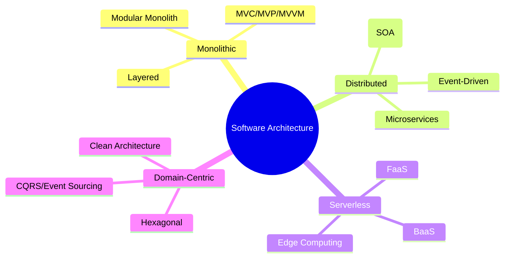
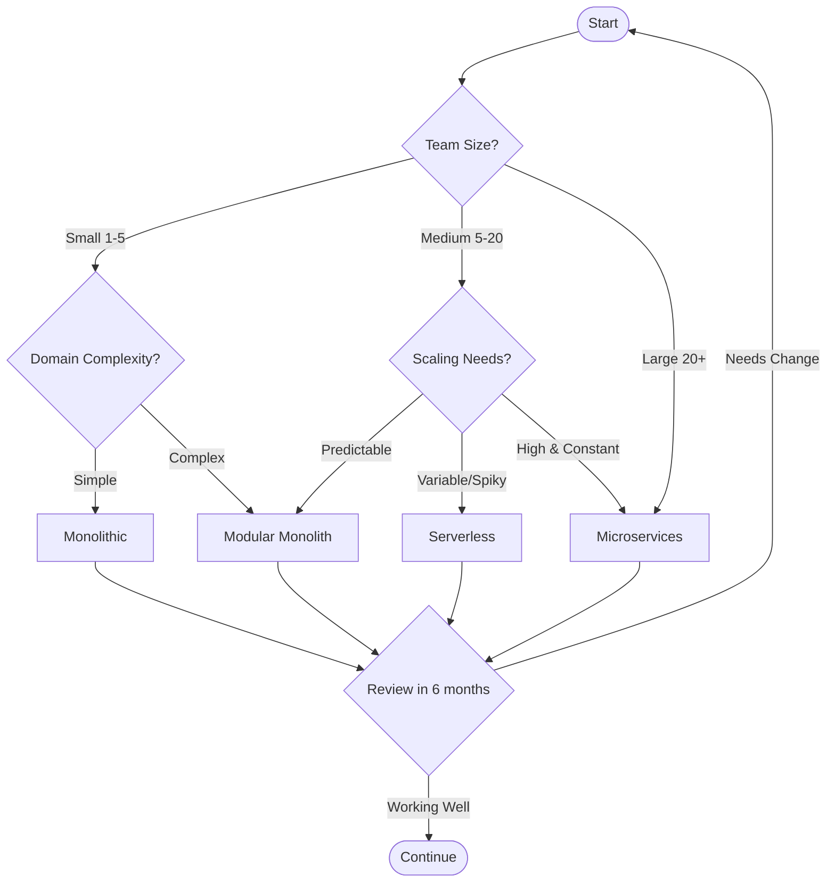

# Software Architecture

Software architecture defines the high-level structure of a system, including its components, their relationships, and the principles governing their design and evolution. Choosing the right architecture is crucial for building maintainable, scalable, and resilient applications.



## Architecture Styles Overview

| Architecture | Best For | Complexity | Scalability | Team Size |
|-------------|----------|------------|-------------|-----------|
| **Monolithic** | MVPs, Small apps | Low | Vertical | Small |
| **Modular Monolith** | Growing apps | Medium | Vertical | Medium |
| **Microservices** | Large systems | High | Horizontal | Large |
| **Serverless** | Event-driven, APIs | Medium | Auto | Any |
| **Event-Driven** | Real-time systems | High | Horizontal | Medium-Large |
| **Hexagonal** | Domain complexity | Medium | Varies | Medium |
| **CQRS** | High-read/write ratio | High | Horizontal | Medium-Large |

## Choosing the Right Architecture

<Callout type="info">
  There is no "one-size-fits-all" architecture. The best choice depends on your team size, domain complexity, scalability requirements, and time-to-market constraints.
</Callout>



## Architecture Categories

<Cards>
  <Card
    title="Monolithic Architecture"
    description="Single deployable unit - perfect for starting projects"
    href="/docs/code-quality/architecture/monolithic"
  />
  <Card
    title="Microservices"
    description="Distributed services with independent deployment"
    href="/docs/code-quality/architecture/microservices"
  />
  <Card
    title="Serverless"
    description="Focus on code, let the cloud handle infrastructure"
    href="/docs/code-quality/architecture/serverless"
  />
  <Card
    title="Event-Driven"
    description="Asynchronous communication through events"
    href="/docs/code-quality/architecture/event-driven"
  />
  <Card
    title="Hexagonal Architecture"
    description="Ports and adapters for domain isolation"
    href="/docs/code-quality/architecture/hexagonal"
  />
  <Card
    title="CQRS & Event Sourcing"
    description="Separate read and write models for complex domains"
    href="/docs/code-quality/architecture/cqrs"
  />
</Cards>

## Key Architecture Principles

### 1. Separation of Concerns

Divide your system into distinct sections, each addressing a separate concern.

```typescript
// Bad: Mixed concerns
const createOrder = async (orderData: OrderInput) => {
  // Validation, business logic, persistence, and notification all mixed
  if (!orderData.items.length) throw new Error('No items');
  const total = orderData.items.reduce((sum, i) => sum + i.price, 0);
  await db.orders.insert({ ...orderData, total });
  await sendEmail(orderData.customerEmail, 'Order confirmed');
  await updateInventory(orderData.items);
  return { success: true };
};

// Good: Separated concerns
const createOrder = async (orderData: OrderInput) => {
  const validatedOrder = validateOrder(orderData);           // Validation layer
  const order = OrderService.create(validatedOrder);          // Domain layer
  await OrderRepository.save(order);                          // Persistence layer
  await EventBus.publish(new OrderCreatedEvent(order));       // Event layer
  return order;
};
```

### 2. Single Source of Truth

Each piece of data should have one authoritative source.

### 3. Loose Coupling, High Cohesion

Components should be independent but internally focused on a single purpose.

### 4. Design for Failure

Assume components will fail and design accordingly.

```typescript
// Resilient service call with retry and circuit breaker
const fetchUserData = async (userId: string) => {
  return withCircuitBreaker(
    () => withRetry(
      () => userService.getById(userId),
      { maxRetries: 3, backoff: 'exponential' }
    ),
    { failureThreshold: 5, resetTimeout: 30000 }
  );
};
```

## Architecture Decision Records (ADR)

Document your architecture decisions using ADRs:

```markdown
# ADR-001: Choose Microservices Architecture

## Status
Accepted

## Context
Our monolithic application is experiencing scaling issues 
and deployment bottlenecks with 50+ developers.

## Decision
Migrate to microservices architecture with domain-driven boundaries.

## Consequences
- **Positive**: Independent scaling, team autonomy, technology flexibility
- **Negative**: Increased operational complexity, network latency
- **Risks**: Data consistency challenges, debugging difficulty
```

## Next Steps

Start with the architecture that matches your current needs, not your future dreams. You can always evolve:

1. **Starting a new project?** → Begin with [Monolithic](/docs/code-quality/architecture/monolithic)
2. **Need auto-scaling?** → Explore [Serverless](/docs/code-quality/architecture/serverless)
3. **Building at scale?** → Learn [Microservices](/docs/code-quality/architecture/microservices)
4. **Complex domain?** → Study [Hexagonal](/docs/code-quality/architecture/hexagonal)
