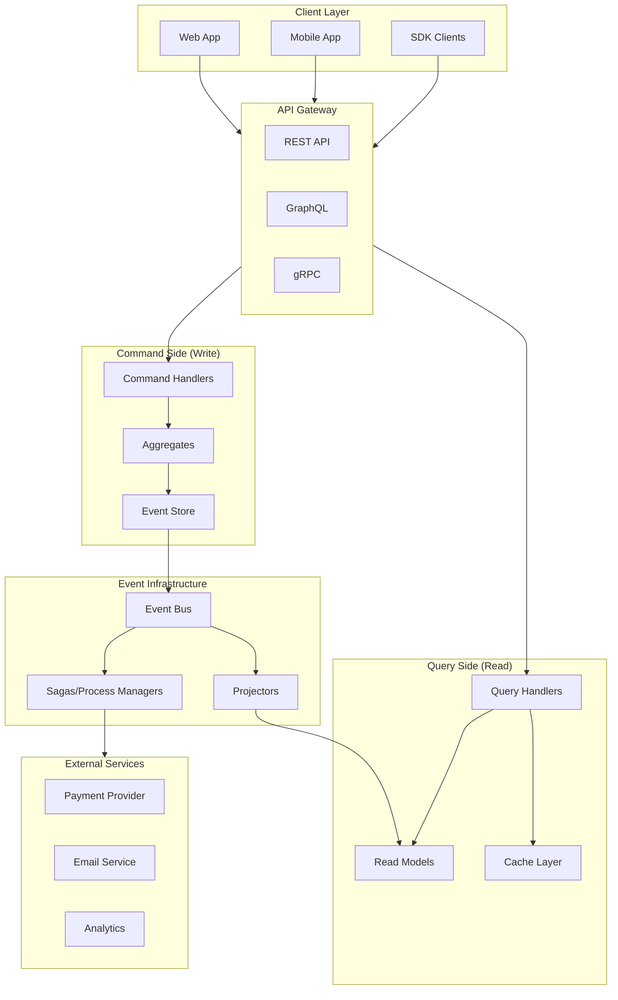

import { Accordion, Accordions } from 'fumadocs-ui/components/accordion';
import { Callout } from 'fumadocs-ui/components/callout';
import { File, Files, Folder } from 'fumadocs-ui/components/files';
import { Steps } from 'fumadocs-ui/components/steps';
import { Tab, Tabs } from 'fumadocs-ui/components/tabs';

# Composable Architecture

Build **production-ready systems** by combining architectural patterns: CQRS for read/write separation, Event Sourcing for audit trails, Hexagonal for testability, and DDD for domain modeling.

<Callout type="info">
This architecture is designed for **complex domains** with high scalability requirements. For simpler applications, consider starting with a modular monolith and evolving as needed.
</Callout>

## Architecture Overview



## Project Structure

<Files>
  <Folder name="services/order-service" defaultOpen>
    <File name="package.json" />
    <File name="tsconfig.json" />
    <Folder name="src" defaultOpen>
      <File name="index.ts" />
      <File name="container.ts" />
      <Folder name="domain" defaultOpen>
        <Folder name="order">
          <File name="order.aggregate.ts" />
          <File name="order.events.ts" />
          <File name="order.commands.ts" />
          <File name="order.errors.ts" />
          <File name="order.types.ts" />
        </Folder>
        <Folder name="shared">
          <File name="aggregate-root.ts" />
          <File name="domain-event.ts" />
          <File name="value-objects.ts" />
        </Folder>
      </Folder>
      <Folder name="application">
        <Folder name="commands">
          <File name="create-order.handler.ts" />
          <File name="cancel-order.handler.ts" />
          <File name="add-item.handler.ts" />
        </Folder>
        <Folder name="queries">
          <File name="get-order.handler.ts" />
          <File name="list-orders.handler.ts" />
        </Folder>
        <Folder name="sagas">
          <File name="order-fulfillment.saga.ts" />
          <File name="payment-processing.saga.ts" />
        </Folder>
        <Folder name="projections">
          <File name="order-summary.projection.ts" />
          <File name="customer-orders.projection.ts" />
        </Folder>
      </Folder>
      <Folder name="infrastructure">
        <Folder name="persistence">
          <File name="event-store.ts" />
          <File name="read-model-store.ts" />
          <File name="snapshot-store.ts" />
        </Folder>
        <Folder name="messaging">
          <File name="event-bus.ts" />
          <File name="command-bus.ts" />
          <File name="query-bus.ts" />
        </Folder>
        <Folder name="adapters">
          <File name="payment.adapter.ts" />
          <File name="inventory.adapter.ts" />
          <File name="notification.adapter.ts" />
        </Folder>
      </Folder>
      <Folder name="api">
        <File name="routes.ts" />
        <File name="middleware.ts" />
        <Folder name="http">
          <File name="order.controller.ts" />
        </Folder>
        <Folder name="grpc">
          <File name="order.service.ts" />
        </Folder>
      </Folder>
    </Folder>
    <Folder name="test">
      <Folder name="unit" />
      <Folder name="integration" />
    </Folder>
  </Folder>
</Files>

---

## Domain Layer

### Aggregate Root Base

```typescript title="src/domain/shared/aggregate-root.ts"
import { randomUUID } from 'crypto';

export interface DomainEvent<T = unknown> {
  readonly eventId: string;
  readonly eventType: string;
  readonly aggregateId: string;
  readonly aggregateType: string;
  readonly version: number;
  readonly timestamp: Date;
  readonly data: T;
  readonly metadata: EventMetadata;
}

export interface EventMetadata {
  correlationId: string;
  causationId: string;
  userId?: string;
  traceId?: string;
}

export abstract class AggregateRoot<TState> {
  private _uncommittedEvents: DomainEvent[] = [];
  private _version = 0;

  protected constructor(
    public readonly id: string,
    protected state: TState
  ) {}

  get version(): number {
    return this._version;
  }

  get uncommittedEvents(): ReadonlyArray<DomainEvent> {
    return this._uncommittedEvents;
  }

  protected apply<T>(
    eventType: string,
    data: T,
    metadata: Partial<EventMetadata> = {}
  ): void {
    const event: DomainEvent<T> = {
      eventId: randomUUID(),
      eventType,
      aggregateId: this.id,
      aggregateType: this.constructor.name,
      version: this._version + 1,
      timestamp: new Date(),
      data,
      metadata: {
        correlationId: metadata.correlationId ?? randomUUID(),
        causationId: metadata.causationId ?? randomUUID(),
        userId: metadata.userId,
        traceId: metadata.traceId,
      },
    };

    this.applyEvent(event);
    this._uncommittedEvents.push(event);
  }

  public loadFromHistory(events: DomainEvent[]): void {
    for (const event of events) {
      this.applyEvent(event);
    }
  }

  public clearUncommittedEvents(): void {
    this._uncommittedEvents = [];
  }

  private applyEvent(event: DomainEvent): void {
    const handler = this.getEventHandler(event.eventType);
    if (handler) {
      this.state = handler(this.state, event.data);
    }
    this._version = event.version;
  }

  protected abstract getEventHandler(
    eventType: string
  ): ((state: TState, data: unknown) => TState) | undefined;
}
```

### Order Aggregate

```typescript title="src/domain/order/order.aggregate.ts"
import { AggregateRoot, DomainEvent } from '../shared/aggregate-root';
import {
  OrderCreatedEvent,
  OrderItemAddedEvent,
  OrderItemRemovedEvent,
  OrderConfirmedEvent,
  OrderCancelledEvent,
  OrderShippedEvent,
  OrderDeliveredEvent,
} from './order.events';
import {
  OrderState,
  OrderStatus,
  OrderItem,
  Money,
  Address,
} from './order.types';
import {
  OrderAlreadyConfirmedError,
  OrderAlreadyCancelledError,
  OrderItemNotFoundError,
  InsufficientItemsError,
} from './order.errors';

export const createOrder = (
  id: string,
  customerId: string,
  metadata: { correlationId: string; userId?: string }
): Order => {
  const order = new Order(id, {
    customerId,
    items: [],
    status: OrderStatus.DRAFT,
    totals: { subtotal: 0, tax: 0, shipping: 0, total: 0 },
    createdAt: new Date(),
  });

  order.applyOrderCreated({ customerId }, metadata);
  return order;
};

export const loadOrder = (id: string, events: DomainEvent[]): Order => {
  const order = new Order(id, {} as OrderState);
  order.loadFromHistory(events);
  return order;
};

export class Order extends AggregateRoot<OrderState> {
  // Commands
  applyOrderCreated(
    data: { customerId: string },
    metadata: { correlationId: string; userId?: string }
  ): void {
    this.apply('OrderCreated', data, metadata);
  }

  addItem(
    item: Omit<OrderItem, 'lineTotal'>,
    metadata: { correlationId: string }
  ): void {
    this.assertNotConfirmed();
    this.assertNotCancelled();

    const lineTotal = item.unitPrice.amount * item.quantity;
    this.apply('OrderItemAdded', { ...item, lineTotal }, metadata);
  }

  removeItem(itemId: string, metadata: { correlationId: string }): void {
    this.assertNotConfirmed();
    this.assertNotCancelled();

    const item = this.state.items.find((i) => i.id === itemId);
    if (!item) {
      throw new OrderItemNotFoundError(itemId);
    }

    this.apply('OrderItemRemoved', { itemId }, metadata);
  }

  updateItemQuantity(
    itemId: string,
    quantity: number,
    metadata: { correlationId: string }
  ): void {
    this.assertNotConfirmed();
    this.assertNotCancelled();

    const item = this.state.items.find((i) => i.id === itemId);
    if (!item) {
      throw new OrderItemNotFoundError(itemId);
    }

    if (quantity <= 0) {
      throw new InsufficientItemsError();
    }

    this.apply('OrderItemQuantityUpdated', { itemId, quantity }, metadata);
  }

  confirm(
    shippingAddress: Address,
    billingAddress: Address,
    metadata: { correlationId: string }
  ): void {
    this.assertNotConfirmed();
    this.assertNotCancelled();

    if (this.state.items.length === 0) {
      throw new InsufficientItemsError();
    }

    this.apply(
      'OrderConfirmed',
      { shippingAddress, billingAddress },
      metadata
    );
  }

  cancel(reason: string, metadata: { correlationId: string }): void {
    this.assertNotCancelled();

    if (this.state.status === OrderStatus.SHIPPED) {
      throw new Error('Cannot cancel shipped order');
    }

    this.apply('OrderCancelled', { reason }, metadata);
  }

  markShipped(
    trackingNumber: string,
    carrier: string,
    metadata: { correlationId: string }
  ): void {
    if (this.state.status !== OrderStatus.CONFIRMED) {
      throw new Error('Order must be confirmed before shipping');
    }

    this.apply('OrderShipped', { trackingNumber, carrier }, metadata);
  }

  markDelivered(metadata: { correlationId: string }): void {
    if (this.state.status !== OrderStatus.SHIPPED) {
      throw new Error('Order must be shipped before delivery');
    }

    this.apply('OrderDelivered', {}, metadata);
  }

  // Queries
  get customerId(): string {
    return this.state.customerId;
  }

  get status(): OrderStatus {
    return this.state.status;
  }

  get items(): ReadonlyArray<OrderItem> {
    return this.state.items;
  }

  get totals(): Money {
    return { amount: this.state.totals.total, currency: 'USD' };
  }

  // Assertions
  private assertNotConfirmed(): void {
    if (
      this.state.status !== OrderStatus.DRAFT &&
      this.state.status !== OrderStatus.PENDING
    ) {
      throw new OrderAlreadyConfirmedError(this.id);
    }
  }

  private assertNotCancelled(): void {
    if (this.state.status === OrderStatus.CANCELLED) {
      throw new OrderAlreadyCancelledError(this.id);
    }
  }

  // Event Handlers
  protected getEventHandler(
    eventType: string
  ): ((state: OrderState, data: unknown) => OrderState) | undefined {
    const handlers: Record<
      string,
      (state: OrderState, data: any) => OrderState
    > = {
      OrderCreated: (state, data: OrderCreatedEvent) => ({
        ...state,
        customerId: data.customerId,
        items: [],
        status: OrderStatus.DRAFT,
        totals: { subtotal: 0, tax: 0, shipping: 0, total: 0 },
        createdAt: new Date(),
      }),

      OrderItemAdded: (state, data: OrderItemAddedEvent) => {
        const items = [...state.items, data];
        return {
          ...state,
          items,
          totals: calculateTotals(items),
        };
      },

      OrderItemRemoved: (state, data: OrderItemRemovedEvent) => {
        const items = state.items.filter((i) => i.id !== data.itemId);
        return {
          ...state,
          items,
          totals: calculateTotals(items),
        };
      },

      OrderConfirmed: (state, data: OrderConfirmedEvent) => ({
        ...state,
        status: OrderStatus.CONFIRMED,
        shippingAddress: data.shippingAddress,
        billingAddress: data.billingAddress,
        confirmedAt: new Date(),
      }),

      OrderCancelled: (state, data: OrderCancelledEvent) => ({
        ...state,
        status: OrderStatus.CANCELLED,
        cancelReason: data.reason,
        cancelledAt: new Date(),
      }),

      OrderShipped: (state, data: OrderShippedEvent) => ({
        ...state,
        status: OrderStatus.SHIPPED,
        trackingNumber: data.trackingNumber,
        carrier: data.carrier,
        shippedAt: new Date(),
      }),

      OrderDelivered: (state) => ({
        ...state,
        status: OrderStatus.DELIVERED,
        deliveredAt: new Date(),
      }),
    };

    return handlers[eventType];
  }
}

const calculateTotals = (items: OrderItem[]) => {
  const subtotal = items.reduce((sum, item) => sum + item.lineTotal, 0);
  const tax = subtotal * 0.1; // 10% tax
  const shipping = subtotal > 100 ? 0 : 10; // Free shipping over $100
  return {
    subtotal,
    tax,
    shipping,
    total: subtotal + tax + shipping,
  };
};
```

---

## Application Layer

### Command Handler

```typescript title="src/application/commands/create-order.handler.ts"
import { createOrder } from '../../domain/order/order.aggregate';
import type { EventStore } from '../../infrastructure/persistence/event-store';
import type { EventBus } from '../../infrastructure/messaging/event-bus';

export interface CreateOrderCommand {
  orderId: string;
  customerId: string;
  items: Array<{
    productId: string;
    productName: string;
    sku: string;
    quantity: number;
    unitPrice: { amount: number; currency: string };
  }>;
  correlationId: string;
  userId?: string;
}

export interface CreateOrderResult {
  orderId: string;
  version: number;
}

export const createCreateOrderHandler = (deps: {
  eventStore: EventStore;
  eventBus: EventBus;
}) => {
  return async (command: CreateOrderCommand): Promise<CreateOrderResult> => {
    const { eventStore, eventBus } = deps;
    const { orderId, customerId, items, correlationId, userId } = command;

    // Create aggregate
    const order = createOrder(orderId, customerId, { correlationId, userId });

    // Add items
    for (const item of items) {
      order.addItem(
        {
          id: `${orderId}-${item.productId}`,
          productId: item.productId,
          productName: item.productName,
          sku: item.sku,
          quantity: item.quantity,
          unitPrice: item.unitPrice,
        },
        { correlationId }
      );
    }

    // Persist events
    await eventStore.append(orderId, order.uncommittedEvents, 0);

    // Publish events
    for (const event of order.uncommittedEvents) {
      await eventBus.publish(event);
    }

    order.clearUncommittedEvents();

    return {
      orderId,
      version: order.version,
    };
  };
};
```

### Query Handler

```typescript title="src/application/queries/get-order.handler.ts"
import type { ReadModelStore } from '../../infrastructure/persistence/read-model-store';
import type { OrderSummaryReadModel } from '../projections/order-summary.projection';

export interface GetOrderQuery {
  orderId: string;
}

export const createGetOrderHandler = (deps: {
  readModelStore: ReadModelStore;
}) => {
  return async (query: GetOrderQuery): Promise<OrderSummaryReadModel | null> => {
    const { readModelStore } = deps;
    
    return readModelStore.get<OrderSummaryReadModel>(
      'order-summary',
      query.orderId
    );
  };
};
```

### Saga (Process Manager)

```typescript title="src/application/sagas/order-fulfillment.saga.ts"
import type { DomainEvent } from '../../domain/shared/aggregate-root';
import type { CommandBus } from '../../infrastructure/messaging/command-bus';
import type { PaymentAdapter } from '../../infrastructure/adapters/payment.adapter';
import type { InventoryAdapter } from '../../infrastructure/adapters/inventory.adapter';
import type { NotificationAdapter } from '../../infrastructure/adapters/notification.adapter';

export interface SagaState {
  orderId: string;
  customerId: string;
  status: 'started' | 'payment_pending' | 'inventory_reserved' | 'completed' | 'failed';
  paymentId?: string;
  reservationId?: string;
  failureReason?: string;
}

export const createOrderFulfillmentSaga = (deps: {
  commandBus: CommandBus;
  paymentAdapter: PaymentAdapter;
  inventoryAdapter: InventoryAdapter;
  notificationAdapter: NotificationAdapter;
  sagaStore: Map<string, SagaState>;
}) => {
  const { commandBus, paymentAdapter, inventoryAdapter, notificationAdapter, sagaStore } = deps;

  const handlers: Record<string, (event: DomainEvent) => Promise<void>> = {
    OrderConfirmed: async (event) => {
      const { aggregateId: orderId } = event;
      const data = event.data as { shippingAddress: any; billingAddress: any };

      // Initialize saga state
      sagaStore.set(orderId, {
        orderId,
        customerId: '', // Would be fetched from read model
        status: 'started',
      });

      try {
        // Step 1: Reserve inventory
        const reservation = await inventoryAdapter.reserve(orderId, []);
        
        const state = sagaStore.get(orderId)!;
        sagaStore.set(orderId, {
          ...state,
          status: 'inventory_reserved',
          reservationId: reservation.id,
        });

        // Step 2: Process payment
        const payment = await paymentAdapter.charge({
          orderId,
          amount: 0, // Would be fetched from read model
          currency: 'USD',
        });

        sagaStore.set(orderId, {
          ...state,
          status: 'payment_pending',
          paymentId: payment.id,
        });
      } catch (error) {
        // Compensating actions
        const state = sagaStore.get(orderId)!;
        
        if (state.reservationId) {
          await inventoryAdapter.release(state.reservationId);
        }

        sagaStore.set(orderId, {
          ...state,
          status: 'failed',
          failureReason: (error as Error).message,
        });

        // Cancel the order
        await commandBus.dispatch({
          type: 'CancelOrder',
          orderId,
          reason: `Fulfillment failed: ${(error as Error).message}`,
          correlationId: event.metadata.correlationId,
        });
      }
    },

    PaymentCompleted: async (event) => {
      const data = event.data as { orderId: string; paymentId: string };
      const state = sagaStore.get(data.orderId);

      if (!state || state.status !== 'payment_pending') {
        return;
      }

      // Confirm inventory reservation
      await inventoryAdapter.confirm(state.reservationId!);

      sagaStore.set(data.orderId, {
        ...state,
        status: 'completed',
      });

      // Send confirmation email
      await notificationAdapter.sendOrderConfirmation({
        orderId: data.orderId,
        customerId: state.customerId,
      });
    },

    PaymentFailed: async (event) => {
      const data = event.data as { orderId: string; reason: string };
      const state = sagaStore.get(data.orderId);

      if (!state) return;

      // Release inventory
      if (state.reservationId) {
        await inventoryAdapter.release(state.reservationId);
      }

      sagaStore.set(data.orderId, {
        ...state,
        status: 'failed',
        failureReason: data.reason,
      });

      // Cancel order
      await commandBus.dispatch({
        type: 'CancelOrder',
        orderId: data.orderId,
        reason: `Payment failed: ${data.reason}`,
        correlationId: event.metadata.correlationId,
      });
    },
  };

  return {
    handle: async (event: DomainEvent) => {
      const handler = handlers[event.eventType];
      if (handler) {
        await handler(event);
      }
    },
  };
};
```

### Projection

```typescript title="src/application/projections/order-summary.projection.ts"
import type { DomainEvent } from '../../domain/shared/aggregate-root';
import type { ReadModelStore } from '../../infrastructure/persistence/read-model-store';

export interface OrderSummaryReadModel {
  id: string;
  orderNumber: string;
  customerId: string;
  status: string;
  itemCount: number;
  totalAmount: number;
  currency: string;
  createdAt: string;
  updatedAt: string;
  shippingAddress?: {
    street: string;
    city: string;
    state: string;
    postalCode: string;
    country: string;
  };
  trackingNumber?: string;
  carrier?: string;
}

export const createOrderSummaryProjection = (deps: {
  readModelStore: ReadModelStore;
}) => {
  const { readModelStore } = deps;
  const collection = 'order-summary';

  const handlers: Record<
    string,
    (event: DomainEvent) => Promise<void>
  > = {
    OrderCreated: async (event) => {
      const data = event.data as { customerId: string };

      await readModelStore.upsert<OrderSummaryReadModel>(collection, event.aggregateId, {
        id: event.aggregateId,
        orderNumber: generateOrderNumber(event.aggregateId),
        customerId: data.customerId,
        status: 'DRAFT',
        itemCount: 0,
        totalAmount: 0,
        currency: 'USD',
        createdAt: event.timestamp.toISOString(),
        updatedAt: event.timestamp.toISOString(),
      });
    },

    OrderItemAdded: async (event) => {
      const data = event.data as { lineTotal: number };
      
      const current = await readModelStore.get<OrderSummaryReadModel>(
        collection,
        event.aggregateId
      );

      if (current) {
        await readModelStore.upsert(collection, event.aggregateId, {
          ...current,
          itemCount: current.itemCount + 1,
          totalAmount: current.totalAmount + data.lineTotal,
          updatedAt: event.timestamp.toISOString(),
        });
      }
    },

    OrderItemRemoved: async (event) => {
      const current = await readModelStore.get<OrderSummaryReadModel>(
        collection,
        event.aggregateId
      );

      if (current) {
        await readModelStore.upsert(collection, event.aggregateId, {
          ...current,
          itemCount: Math.max(0, current.itemCount - 1),
          updatedAt: event.timestamp.toISOString(),
        });
      }
    },

    OrderConfirmed: async (event) => {
      const data = event.data as { shippingAddress: any };
      
      const current = await readModelStore.get<OrderSummaryReadModel>(
        collection,
        event.aggregateId
      );

      if (current) {
        await readModelStore.upsert(collection, event.aggregateId, {
          ...current,
          status: 'CONFIRMED',
          shippingAddress: data.shippingAddress,
          updatedAt: event.timestamp.toISOString(),
        });
      }
    },

    OrderCancelled: async (event) => {
      const current = await readModelStore.get<OrderSummaryReadModel>(
        collection,
        event.aggregateId
      );

      if (current) {
        await readModelStore.upsert(collection, event.aggregateId, {
          ...current,
          status: 'CANCELLED',
          updatedAt: event.timestamp.toISOString(),
        });
      }
    },

    OrderShipped: async (event) => {
      const data = event.data as { trackingNumber: string; carrier: string };
      
      const current = await readModelStore.get<OrderSummaryReadModel>(
        collection,
        event.aggregateId
      );

      if (current) {
        await readModelStore.upsert(collection, event.aggregateId, {
          ...current,
          status: 'SHIPPED',
          trackingNumber: data.trackingNumber,
          carrier: data.carrier,
          updatedAt: event.timestamp.toISOString(),
        });
      }
    },

    OrderDelivered: async (event) => {
      const current = await readModelStore.get<OrderSummaryReadModel>(
        collection,
        event.aggregateId
      );

      if (current) {
        await readModelStore.upsert(collection, event.aggregateId, {
          ...current,
          status: 'DELIVERED',
          updatedAt: event.timestamp.toISOString(),
        });
      }
    },
  };

  return {
    handle: async (event: DomainEvent) => {
      const handler = handlers[event.eventType];
      if (handler) {
        await handler(event);
      }
    },
  };
};

const generateOrderNumber = (id: string): string => {
  const timestamp = Date.now().toString(36).toUpperCase();
  const random = id.slice(0, 4).toUpperCase();
  return `ORD-${timestamp}-${random}`;
};
```

---

## Infrastructure Layer

### Event Store

```typescript title="src/infrastructure/persistence/event-store.ts"
import { Pool } from 'pg';
import type { DomainEvent } from '../../domain/shared/aggregate-root';

export interface EventStore {
  append(
    aggregateId: string,
    events: DomainEvent[],
    expectedVersion: number
  ): Promise<void>;
  
  getEvents(
    aggregateId: string,
    fromVersion?: number
  ): Promise<DomainEvent[]>;
  
  getAllEvents(
    fromPosition?: number,
    limit?: number
  ): Promise<{ events: DomainEvent[]; lastPosition: number }>;
}

export const createPostgresEventStore = (pool: Pool): EventStore => {
  return {
    append: async (aggregateId, events, expectedVersion) => {
      const client = await pool.connect();
      
      try {
        await client.query('BEGIN');

        // Optimistic concurrency check
        const { rows } = await client.query<{ max_version: number }>(
          `SELECT COALESCE(MAX(version), 0) as max_version 
           FROM events 
           WHERE aggregate_id = $1`,
          [aggregateId]
        );

        const currentVersion = rows[0]?.max_version ?? 0;
        
        if (currentVersion !== expectedVersion) {
          throw new Error(
            `Concurrency conflict: expected version ${expectedVersion}, got ${currentVersion}`
          );
        }

        // Insert events
        for (const event of events) {
          await client.query(
            `INSERT INTO events (
              event_id, event_type, aggregate_id, aggregate_type,
              version, timestamp, data, metadata
            ) VALUES ($1, $2, $3, $4, $5, $6, $7, $8)`,
            [
              event.eventId,
              event.eventType,
              event.aggregateId,
              event.aggregateType,
              event.version,
              event.timestamp,
              JSON.stringify(event.data),
              JSON.stringify(event.metadata),
            ]
          );
        }

        await client.query('COMMIT');
      } catch (error) {
        await client.query('ROLLBACK');
        throw error;
      } finally {
        client.release();
      }
    },

    getEvents: async (aggregateId, fromVersion = 0) => {
      const { rows } = await pool.query<{
        event_id: string;
        event_type: string;
        aggregate_id: string;
        aggregate_type: string;
        version: number;
        timestamp: Date;
        data: string;
        metadata: string;
      }>(
        `SELECT * FROM events 
         WHERE aggregate_id = $1 AND version > $2 
         ORDER BY version ASC`,
        [aggregateId, fromVersion]
      );

      return rows.map((row) => ({
        eventId: row.event_id,
        eventType: row.event_type,
        aggregateId: row.aggregate_id,
        aggregateType: row.aggregate_type,
        version: row.version,
        timestamp: row.timestamp,
        data: JSON.parse(row.data),
        metadata: JSON.parse(row.metadata),
      }));
    },

    getAllEvents: async (fromPosition = 0, limit = 1000) => {
      const { rows } = await pool.query(
        `SELECT *, position FROM events 
         WHERE position > $1 
         ORDER BY position ASC 
         LIMIT $2`,
        [fromPosition, limit]
      );

      const events = rows.map((row: any) => ({
        eventId: row.event_id,
        eventType: row.event_type,
        aggregateId: row.aggregate_id,
        aggregateType: row.aggregate_type,
        version: row.version,
        timestamp: row.timestamp,
        data: JSON.parse(row.data),
        metadata: JSON.parse(row.metadata),
      }));

      const lastPosition = rows.length > 0 ? rows[rows.length - 1].position : fromPosition;

      return { events, lastPosition };
    },
  };
};
```

### Event Bus

```typescript title="src/infrastructure/messaging/event-bus.ts"
import type { DomainEvent } from '../../domain/shared/aggregate-root';

export type EventHandler = (event: DomainEvent) => Promise<void>;

export interface EventBus {
  publish(event: DomainEvent): Promise<void>;
  subscribe(eventType: string, handler: EventHandler): void;
  subscribeAll(handler: EventHandler): void;
}

export const createInMemoryEventBus = (): EventBus => {
  const handlers = new Map<string, EventHandler[]>();
  const globalHandlers: EventHandler[] = [];

  return {
    publish: async (event) => {
      const typeHandlers = handlers.get(event.eventType) ?? [];
      const allHandlers = [...typeHandlers, ...globalHandlers];

      await Promise.all(allHandlers.map((handler) => handler(event)));
    },

    subscribe: (eventType, handler) => {
      const existing = handlers.get(eventType) ?? [];
      handlers.set(eventType, [...existing, handler]);
    },

    subscribeAll: (handler) => {
      globalHandlers.push(handler);
    },
  };
};

// Production implementation with message broker
export const createKafkaEventBus = (config: {
  brokers: string[];
  topic: string;
}): EventBus => {
  // Kafka implementation
  throw new Error('Not implemented');
};
```

### Dependency Injection Container

```typescript title="src/container.ts"
import { Pool } from 'pg';
import { createPostgresEventStore } from './infrastructure/persistence/event-store';
import { createPostgresReadModelStore } from './infrastructure/persistence/read-model-store';
import { createInMemoryEventBus } from './infrastructure/messaging/event-bus';
import { createCreateOrderHandler } from './application/commands/create-order.handler';
import { createGetOrderHandler } from './application/queries/get-order.handler';
import { createOrderSummaryProjection } from './application/projections/order-summary.projection';
import { createOrderFulfillmentSaga } from './application/sagas/order-fulfillment.saga';
import { createPaymentAdapter } from './infrastructure/adapters/payment.adapter';
import { createInventoryAdapter } from './infrastructure/adapters/inventory.adapter';
import { createNotificationAdapter } from './infrastructure/adapters/notification.adapter';

export interface Container {
  // Commands
  createOrder: ReturnType<typeof createCreateOrderHandler>;
  
  // Queries
  getOrder: ReturnType<typeof createGetOrderHandler>;
  
  // Infrastructure
  eventStore: ReturnType<typeof createPostgresEventStore>;
  eventBus: ReturnType<typeof createInMemoryEventBus>;
  readModelStore: ReturnType<typeof createPostgresReadModelStore>;
}

export const createContainer = (config: {
  databaseUrl: string;
  paymentApiKey: string;
  inventoryApiUrl: string;
  notificationApiUrl: string;
}): Container => {
  // Database
  const pool = new Pool({ connectionString: config.databaseUrl });

  // Infrastructure
  const eventStore = createPostgresEventStore(pool);
  const readModelStore = createPostgresReadModelStore(pool);
  const eventBus = createInMemoryEventBus();

  // Adapters
  const paymentAdapter = createPaymentAdapter({ apiKey: config.paymentApiKey });
  const inventoryAdapter = createInventoryAdapter({ apiUrl: config.inventoryApiUrl });
  const notificationAdapter = createNotificationAdapter({ apiUrl: config.notificationApiUrl });

  // Projections
  const orderSummaryProjection = createOrderSummaryProjection({ readModelStore });
  eventBus.subscribeAll(orderSummaryProjection.handle);

  // Sagas
  const sagaStore = new Map();
  const orderFulfillmentSaga = createOrderFulfillmentSaga({
    commandBus: { dispatch: async () => {} }, // Simplified
    paymentAdapter,
    inventoryAdapter,
    notificationAdapter,
    sagaStore,
  });
  eventBus.subscribe('OrderConfirmed', orderFulfillmentSaga.handle);
  eventBus.subscribe('PaymentCompleted', orderFulfillmentSaga.handle);
  eventBus.subscribe('PaymentFailed', orderFulfillmentSaga.handle);

  // Command Handlers
  const createOrder = createCreateOrderHandler({ eventStore, eventBus });

  // Query Handlers
  const getOrder = createGetOrderHandler({ readModelStore });

  return {
    createOrder,
    getOrder,
    eventStore,
    eventBus,
    readModelStore,
  };
};
```

---

## Testing

```typescript title="test/unit/order.aggregate.test.ts"
import { describe, it, expect } from 'vitest';
import { createOrder, loadOrder } from '../../src/domain/order/order.aggregate';
import { OrderStatus } from '../../src/domain/order/order.types';

describe('Order Aggregate', () => {
  const correlationId = 'test-correlation-id';
  const userId = 'test-user';

  describe('createOrder', () => {
    it('should create a new order with DRAFT status', () => {
      const order = createOrder('order-1', 'customer-1', { correlationId, userId });

      expect(order.id).toBe('order-1');
      expect(order.customerId).toBe('customer-1');
      expect(order.status).toBe(OrderStatus.DRAFT);
      expect(order.uncommittedEvents).toHaveLength(1);
      expect(order.uncommittedEvents[0].eventType).toBe('OrderCreated');
    });
  });

  describe('addItem', () => {
    it('should add item to draft order', () => {
      const order = createOrder('order-1', 'customer-1', { correlationId, userId });
      order.clearUncommittedEvents();

      order.addItem(
        {
          id: 'item-1',
          productId: 'product-1',
          productName: 'Test Product',
          sku: 'SKU-001',
          quantity: 2,
          unitPrice: { amount: 100, currency: 'USD' },
        },
        { correlationId }
      );

      expect(order.items).toHaveLength(1);
      expect(order.items[0].quantity).toBe(2);
      expect(order.uncommittedEvents).toHaveLength(1);
      expect(order.uncommittedEvents[0].eventType).toBe('OrderItemAdded');
    });
  });

  describe('confirm', () => {
    it('should confirm order with items', () => {
      const order = createOrder('order-1', 'customer-1', { correlationId, userId });
      order.addItem(
        {
          id: 'item-1',
          productId: 'product-1',
          productName: 'Test Product',
          sku: 'SKU-001',
          quantity: 1,
          unitPrice: { amount: 100, currency: 'USD' },
        },
        { correlationId }
      );
      order.clearUncommittedEvents();

      const address = {
        street: '123 Main St',
        city: 'New York',
        state: 'NY',
        postalCode: '10001',
        country: 'US',
      };

      order.confirm(address, address, { correlationId });

      expect(order.status).toBe(OrderStatus.CONFIRMED);
      expect(order.uncommittedEvents[0].eventType).toBe('OrderConfirmed');
    });

    it('should throw when confirming empty order', () => {
      const order = createOrder('order-1', 'customer-1', { correlationId, userId });
      const address = { street: '', city: '', state: '', postalCode: '', country: '' };

      expect(() => order.confirm(address, address, { correlationId })).toThrow();
    });
  });

  describe('event sourcing', () => {
    it('should reconstruct order from events', () => {
      // Create order and perform operations
      const original = createOrder('order-1', 'customer-1', { correlationId, userId });
      original.addItem(
        {
          id: 'item-1',
          productId: 'product-1',
          productName: 'Test Product',
          sku: 'SKU-001',
          quantity: 2,
          unitPrice: { amount: 50, currency: 'USD' },
        },
        { correlationId }
      );

      // Reconstruct from events
      const reconstructed = loadOrder('order-1', [...original.uncommittedEvents]);

      expect(reconstructed.id).toBe(original.id);
      expect(reconstructed.customerId).toBe(original.customerId);
      expect(reconstructed.items).toEqual(original.items);
      expect(reconstructed.version).toBe(original.version);
    });
  });
});
```

## When to Use This Architecture

<Accordions>
<Accordion title="Good fit">
- **Complex domain logic** with many business rules
- **Audit requirements** needing full event history
- **High read/write ratio** disparity (10:1 or more)
- **Multiple read models** for different use cases
- **Long-running processes** requiring saga orchestration
- **Eventual consistency** is acceptable
</Accordion>

<Accordion title="Poor fit">
- **Simple CRUD** applications
- **Strong consistency** requirements everywhere
- **Small team** without DDD experience
- **Rapid prototyping** phase
- **Low complexity** domains
</Accordion>
</Accordions>

## Best Practices

<Callout type="warn">
**Implementation Guidelines:**
- Start with a single aggregate and expand gradually
- Keep aggregates small (1-3 entities max)
- Use eventual consistency between aggregates
- Project read models asynchronously
- Implement idempotent event handlers
- Version your events for schema evolution
</Callout>

## Related Documentation

- **[CQRS Pattern](/docs/code-quality/architecture/cqrs)** - Command Query Responsibility Segregation
- **[Event Sourcing](/docs/code-quality/architecture/event-sourcing)** - Event-based persistence
- **[Hexagonal Architecture](/docs/code-quality/architecture/hexagonal)** - Ports and Adapters pattern
- **[Monorepo Structure](/docs/code-quality/architecture/infrastructure-as-code/monorepo-structure)** - Project organization
