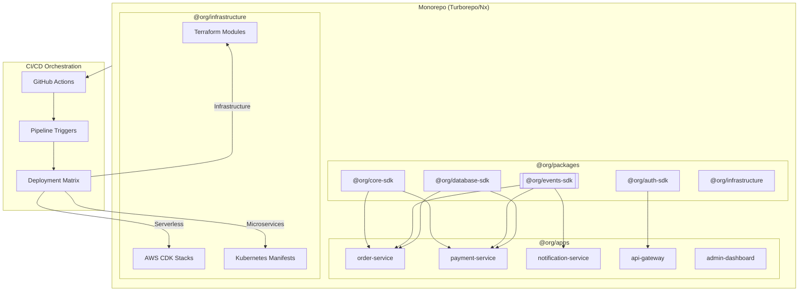

# Infrastructure as Code

**Infrastructure as Code (IaC) Monorepo Architecture** combines all architectural patterns (microservices, CQRS, event sourcing, serverless, hexagonal) into a unified, modular codebase. Services share common SDKs published as npm packages, with CI/CD pipelines that orchestrate deployments across the entire organization.

<Callout type="info">
This architecture enables teams to deploy services independently while sharing core business logic through internal SDKs, ensuring consistency and reducing duplication across the organization.
</Callout>

## Architecture Overview



## Core Principles

<Cards>
  <Card title="Shared SDKs" href="/docs/code-quality/architecture/infrastructure-as-code/sdk-modules">
    Internal npm packages for business logic, types, and utilities shared across all services
  </Card>
  <Card title="Monorepo Structure" href="/docs/code-quality/architecture/infrastructure-as-code/monorepo-structure">
    Turborepo/Nx workspace with apps, packages, and infrastructure in one repository
  </Card>
  <Card title="Pipeline Orchestration" href="/docs/code-quality/architecture/infrastructure-as-code/pipeline-orchestration">
    CI/CD pipelines that detect changes and trigger dependent deployments
  </Card>
  <Card title="Composable Deployments" href="/docs/code-quality/architecture/infrastructure-as-code/deployment-strategies">
    Deploy as microservices, serverless, or combined based on requirements
  </Card>
</Cards>

## Why This Architecture?

<Accordions>
  <Accordion title="Single Source of Truth">
    All code, infrastructure, and configurations live in one repository. Teams can see the entire system, understand dependencies, and make cross-cutting changes atomically.
  </Accordion>
  <Accordion title="Shared Business Logic">
    Core domain logic lives in SDK packages. When business rules change, update once and all services automatically get the update through dependency management.
  </Accordion>
  <Accordion title="Flexible Deployment">
    The same codebase can deploy as:
    - **Microservices** on Kubernetes for high-scale production
    - **Serverless** on AWS Lambda for cost-effective workloads
    - **Monolith** for development or small deployments
    - **Hybrid** mixing strategies per service
  </Accordion>
  <Accordion title="Coordinated Releases">
    Pipeline orchestration ensures that when an SDK changes, all dependent services are tested and deployed together, preventing version mismatches.
  </Accordion>
</Accordions>

## High-Level Structure

<Files>
  <Folder name="organization-platform" defaultOpen>
    <Folder name="apps" defaultOpen>
      <Folder name="order-service">
        <File name="package.json" />
        <File name="tsconfig.json" />
        <File name="Dockerfile" />
        <Folder name="src">
          <File name="index.ts" />
        </Folder>
      </Folder>
      <Folder name="payment-service">
        <File name="package.json" />
      </Folder>
      <Folder name="api-gateway">
        <File name="package.json" />
      </Folder>
      <Folder name="admin-dashboard">
        <File name="package.json" />
      </Folder>
    </Folder>
    <Folder name="packages" defaultOpen>
      <Folder name="core-sdk">
        <File name="package.json" />
        <File name="tsconfig.json" />
        <Folder name="src">
          <File name="index.ts" />
        </Folder>
      </Folder>
      <Folder name="events-sdk">
        <File name="package.json" />
      </Folder>
      <Folder name="database-sdk">
        <File name="package.json" />
      </Folder>
      <Folder name="auth-sdk">
        <File name="package.json" />
      </Folder>
      <Folder name="typescript-config">
        <File name="base.json" />
        <File name="node.json" />
        <File name="react.json" />
      </Folder>
      <Folder name="eslint-config">
        <File name="base.js" />
      </Folder>
    </Folder>
    <Folder name="infrastructure" defaultOpen>
      <Folder name="terraform">
        <Folder name="modules" />
        <Folder name="environments" />
      </Folder>
      <Folder name="kubernetes">
        <Folder name="base" />
        <Folder name="overlays" />
      </Folder>
      <Folder name="cdk">
        <File name="package.json" />
      </Folder>
    </Folder>
    <Folder name=".github">
      <Folder name="workflows">
        <File name="ci.yml" />
        <File name="deploy.yml" />
        <File name="release-sdk.yml" />
      </Folder>
    </Folder>
    <File name="package.json" />
    <File name="turbo.json" />
    <File name="pnpm-workspace.yaml" />
  </Folder>
</Files>

## Quick Start Example

```typescript title="packages/core-sdk/src/index.ts"
// Core SDK - shared business logic
export * from './domain/entities';
export * from './domain/value-objects';
export * from './domain/events';
export * from './application/use-cases';
export * from './ports/repositories';
export * from './ports/services';
```

```typescript title="apps/order-service/src/index.ts"
// Order service using shared SDKs
import { Order, OrderCreated, CreateOrderUseCase } from '@org/core-sdk';
import { EventBus, PostgresEventStore } from '@org/events-sdk';
import { createDatabase, OrderRepository } from '@org/database-sdk';
import { verifyToken, requireRole } from '@org/auth-sdk';

// Compose the service using SDK modules
const eventStore = new PostgresEventStore(config.database);
const eventBus = new EventBus(config.rabbitmq);
const orderRepo = new OrderRepository(createDatabase(config.database));

const createOrder = CreateOrderUseCase({
  orderRepository: orderRepo,
  eventBus,
  eventStore,
});

// API routes
app.post('/orders', verifyToken, requireRole('user'), async (c) => {
  const result = await createOrder.execute(c.req.json());
  return c.json(result, 201);
});
```

## Documentation Structure

| Document | Description |
|----------|-------------|
| [Monorepo Structure](/docs/code-quality/architecture/infrastructure-as-code/monorepo-structure) | Turborepo/Nx setup, workspace configuration, dependency management |
| [SDK Modules](/docs/code-quality/architecture/infrastructure-as-code/sdk-modules) | Creating internal packages, versioning, publishing strategies |
| [Pipeline Orchestration](/docs/code-quality/architecture/infrastructure-as-code/pipeline-orchestration) | CI/CD workflows, change detection, cascading deployments |
| [Deployment Strategies](/docs/code-quality/architecture/infrastructure-as-code/deployment-strategies) | Kubernetes, serverless, hybrid deployments |
| [Composable Architecture](/docs/code-quality/architecture/infrastructure-as-code/composable-architecture) | Combining CQRS, event sourcing, microservices patterns |

## When to Use This Architecture

<Cards>
  <Card title="✅ Good Fit">
    - Multiple services sharing business logic
    - Teams that need deployment flexibility
    - Organizations with many repositories to consolidate
    - Projects requiring infrastructure versioning
    - Need for atomic cross-service changes
  </Card>
  <Card title="❌ Poor Fit">
    - Single small application
    - Teams unfamiliar with monorepo tooling
    - Strict service isolation requirements
    - Very different tech stacks across services
    - Limited CI/CD infrastructure
  </Card>
</Cards>

## Related Patterns

- **[Microservices](/docs/code-quality/architecture/microservices)** - Service decomposition patterns
- **[CQRS](/docs/code-quality/architecture/cqrs)** - Command/Query separation in SDKs
- **[Event Sourcing](/docs/code-quality/architecture/event-sourcing)** - Event store SDKs
- **[Hexagonal](/docs/code-quality/architecture/hexagonal)** - Ports and adapters in SDK design
