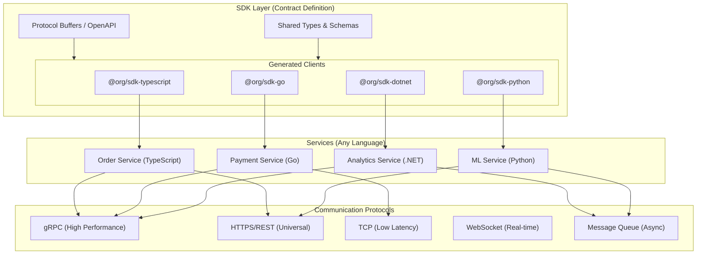

import { Accordion, Accordions } from 'fumadocs-ui/components/accordion';
import { Callout } from 'fumadocs-ui/components/callout';
import { Card, Cards } from 'fumadocs-ui/components/card';
import { File, Files, Folder } from 'fumadocs-ui/components/files';
import { Tab, Tabs } from 'fumadocs-ui/components/tabs';

# SDK Modules

SDKs are the **glue** between your services and the platform. They provide type-safe interfaces that abstract away communication protocols, allowing services written in **any language** to interact seamlessly.

<Callout type="info">
The SDK defines **contracts** (types, schemas, protocols), not implementations. A TypeScript service, Go service, or .NET service can all use their respective SDK to communicate using the same underlying protocol (gRPC, HTTP, TCP, WebSocket).
</Callout>

## Architecture Overview



## SDK Documentation

<Cards>
  <Card title="SDK Architecture" href="/docs/code-quality/architecture/infrastructure-as-code/sdk-modules/architecture">
    Core design principles, contract-first development, and protocol abstraction
  </Card>
  <Card title="Protocol Definitions" href="/docs/code-quality/architecture/infrastructure-as-code/sdk-modules/protocols">
    gRPC, REST, TCP, WebSocket protocol definitions and code generation
  </Card>
  <Card title="TypeScript SDK" href="/docs/code-quality/architecture/infrastructure-as-code/sdk-modules/typescript">
    Building type-safe SDKs for Node.js and browser environments
  </Card>
  <Card title="Multi-Language SDKs" href="/docs/code-quality/architecture/infrastructure-as-code/sdk-modules/multi-language">
    Generating SDKs for Go, .NET, Python, and other languages
  </Card>
  <Card title="Versioning & Publishing" href="/docs/code-quality/architecture/infrastructure-as-code/sdk-modules/versioning">
    Semantic versioning, changelog generation, and package registry publishing
  </Card>
</Cards>

## Core Principle: Contract-First Development

The SDK **defines the contract**, services **implement the contract**. This separation enables:

1. **Language Independence**: Generate type-safe clients for any language
2. **Protocol Flexibility**: Switch between gRPC, HTTP, TCP without changing business logic
3. **Backward Compatibility**: Contracts enforce API stability
4. **Documentation**: Contracts serve as living documentation

<Tabs items={['Contract Definition', 'TypeScript Usage', 'Go Usage', '.NET Usage']}>
<Tab value="Contract Definition">
```protobuf title="proto/order/v1/order.proto"
syntax = "proto3";

package org.order.v1;

option go_package = "github.com/org/sdk-go/order/v1";
option csharp_namespace = "Org.Order.V1";

// Order service definition
service OrderService {
  // Create a new order
  rpc CreateOrder(CreateOrderRequest) returns (CreateOrderResponse);
  
  // Get order by ID
  rpc GetOrder(GetOrderRequest) returns (Order);
  
  // Stream order updates
  rpc WatchOrder(WatchOrderRequest) returns (stream OrderEvent);
  
  // List orders with filtering
  rpc ListOrders(ListOrdersRequest) returns (ListOrdersResponse);
}

message CreateOrderRequest {
  string customer_id = 1;
  repeated OrderItem items = 2;
  Address shipping_address = 3;
}

message CreateOrderResponse {
  string order_id = 1;
  OrderStatus status = 2;
  google.protobuf.Timestamp created_at = 3;
}

message Order {
  string id = 1;
  string customer_id = 2;
  repeated OrderItem items = 3;
  OrderStatus status = 4;
  Money total = 5;
  Address shipping_address = 6;
  google.protobuf.Timestamp created_at = 7;
  google.protobuf.Timestamp updated_at = 8;
}

message OrderItem {
  string product_id = 1;
  string product_name = 2;
  int32 quantity = 3;
  Money unit_price = 4;
}

message Money {
  int64 amount = 1;  // Amount in cents
  string currency = 2;
}

message Address {
  string street = 1;
  string city = 2;
  string state = 3;
  string postal_code = 4;
  string country = 5;
}

enum OrderStatus {
  ORDER_STATUS_UNSPECIFIED = 0;
  ORDER_STATUS_DRAFT = 1;
  ORDER_STATUS_PENDING = 2;
  ORDER_STATUS_CONFIRMED = 3;
  ORDER_STATUS_SHIPPED = 4;
  ORDER_STATUS_DELIVERED = 5;
  ORDER_STATUS_CANCELLED = 6;
}

message OrderEvent {
  string order_id = 1;
  OrderStatus previous_status = 2;
  OrderStatus new_status = 3;
  google.protobuf.Timestamp timestamp = 4;
}
```
</Tab>
<Tab value="TypeScript Usage">
```typescript title="apps/api-gateway/src/orders.ts"
import { OrderServiceClient, CreateOrderRequest } from '@org/sdk-typescript';
import { GrpcTransport } from '@org/sdk-typescript/transports/grpc';
import { HttpTransport } from '@org/sdk-typescript/transports/http';

// Choose transport based on environment
const transport = process.env.USE_GRPC === 'true'
  ? new GrpcTransport({ host: 'order-service:50051' })
  : new HttpTransport({ baseUrl: 'https://order-service.internal' });

// Type-safe client
const orderClient = new OrderServiceClient(transport);

// Create order with full type safety
const createOrder = async (customerId: string, items: OrderItem[]) => {
  const request: CreateOrderRequest = {
    customerId,
    items: items.map(item => ({
      productId: item.productId,
      productName: item.name,
      quantity: item.quantity,
      unitPrice: { amount: item.price, currency: 'USD' },
    })),
    shippingAddress: {
      street: '123 Main St',
      city: 'New York',
      state: 'NY',
      postalCode: '10001',
      country: 'US',
    },
  };

  // Type-safe response
  const response = await orderClient.createOrder(request);
  
  console.log(`Order created: ${response.orderId}`);
  return response;
};

// Stream order updates
const watchOrder = async (orderId: string) => {
  const stream = orderClient.watchOrder({ orderId });
  
  for await (const event of stream) {
    console.log(`Order ${event.orderId}: ${event.previousStatus} -> ${event.newStatus}`);
  }
};
```
</Tab>
<Tab value="Go Usage">
```go title="services/payment-service/main.go"
package main

import (
    "context"
    "log"
    
    orderv1 "github.com/org/sdk-go/order/v1"
    "github.com/org/sdk-go/transports/grpc"
)

func main() {
    // Create gRPC transport
    transport, err := grpc.NewTransport(grpc.Config{
        Host: "order-service:50051",
        TLS:  true,
    })
    if err != nil {
        log.Fatal(err)
    }
    defer transport.Close()

    // Type-safe client
    orderClient := orderv1.NewOrderServiceClient(transport)

    // Create order with full type safety
    resp, err := orderClient.CreateOrder(context.Background(), &orderv1.CreateOrderRequest{
        CustomerId: "cust-123",
        Items: []*orderv1.OrderItem{
            {
                ProductId:   "prod-456",
                ProductName: "Widget",
                Quantity:    2,
                UnitPrice:   &orderv1.Money{Amount: 2999, Currency: "USD"},
            },
        },
        ShippingAddress: &orderv1.Address{
            Street:     "123 Main St",
            City:       "New York",
            State:      "NY",
            PostalCode: "10001",
            Country:    "US",
        },
    })
    if err != nil {
        log.Fatal(err)
    }

    log.Printf("Order created: %s", resp.OrderId)
}
```
</Tab>
<Tab value=".NET Usage">
```csharp title="Services/AnalyticsService/OrderAnalytics.cs"
using Org.Order.V1;
using Org.Sdk.Transports;

namespace AnalyticsService;

public class OrderAnalytics
{
    private readonly OrderServiceClient _orderClient;

    public OrderAnalytics(IConfiguration config)
    {
        // Create transport based on configuration
        var transport = config.GetValue<bool>("UseGrpc")
            ? new GrpcTransport(config["OrderService:GrpcHost"])
            : new HttpTransport(config["OrderService:HttpUrl"]);

        _orderClient = new OrderServiceClient(transport);
    }

    public async Task<OrderStats> GetOrderStatsAsync(string customerId)
    {
        // Type-safe request
        var request = new ListOrdersRequest
        {
            CustomerId = customerId,
            PageSize = 100,
        };

        // Type-safe response
        var response = await _orderClient.ListOrdersAsync(request);

        return new OrderStats
        {
            TotalOrders = response.TotalCount,
            TotalRevenue = response.Orders.Sum(o => o.Total.Amount),
            AverageOrderValue = response.Orders.Average(o => o.Total.Amount),
        };
    }

    public async IAsyncEnumerable<OrderEvent> WatchOrdersAsync(
        string orderId,
        [EnumeratorCancellation] CancellationToken ct = default)
    {
        var stream = _orderClient.WatchOrder(new WatchOrderRequest { OrderId = orderId });

        await foreach (var evt in stream.WithCancellation(ct))
        {
            yield return evt;
        }
    }
}
```
</Tab>
</Tabs>

## SDK Package Structure

<Files>
  <Folder name="packages" defaultOpen>
    <Folder name="proto" defaultOpen>
      <File name="package.json" />
      <File name="buf.yaml" />
      <File name="buf.gen.yaml" />
      <Folder name="order">
        <Folder name="v1">
          <File name="order.proto" />
        </Folder>
      </Folder>
      <Folder name="payment">
        <Folder name="v1">
          <File name="payment.proto" />
        </Folder>
      </Folder>
      <Folder name="common">
        <File name="money.proto" />
        <File name="address.proto" />
        <File name="pagination.proto" />
      </Folder>
    </Folder>
    <Folder name="sdk-typescript" defaultOpen>
      <File name="package.json" />
      <Folder name="src">
        <Folder name="generated">
          <File name="order.ts" />
          <File name="payment.ts" />
        </Folder>
        <Folder name="transports">
          <File name="grpc.ts" />
          <File name="http.ts" />
          <File name="tcp.ts" />
          <File name="websocket.ts" />
        </Folder>
        <File name="index.ts" />
      </Folder>
    </Folder>
    <Folder name="sdk-go">
      <File name="go.mod" />
      <Folder name="order">
        <Folder name="v1">
          <File name="order.pb.go" />
          <File name="order_grpc.pb.go" />
        </Folder>
      </Folder>
      <Folder name="transports">
        <File name="grpc.go" />
        <File name="http.go" />
      </Folder>
    </Folder>
    <Folder name="sdk-dotnet">
      <File name="Org.Sdk.csproj" />
      <Folder name="Generated">
        <File name="Order.cs" />
        <File name="Payment.cs" />
      </Folder>
      <Folder name="Transports">
        <File name="GrpcTransport.cs" />
        <File name="HttpTransport.cs" />
      </Folder>
    </Folder>
  </Folder>
</Files>

## Communication Protocols

| Protocol | Use Case | Latency | Features |
|----------|----------|---------|----------|
| **gRPC** | Service-to-service | Very Low | Streaming, binary, HTTP/2 |
| **HTTPS/REST** | Public APIs, browsers | Low | Universal, cacheable |
| **TCP** | High-frequency trading | Ultra Low | Raw sockets, custom framing |
| **WebSocket** | Real-time updates | Low | Bi-directional, persistent |
| **Message Queue** | Async processing | Variable | Durability, replay |

## Next Steps

<Cards>
  <Card title="SDK Architecture" href="/docs/code-quality/architecture/infrastructure-as-code/sdk-modules/architecture">
    Deep dive into contract-first design and protocol abstraction patterns
  </Card>
  <Card title="Protocol Definitions" href="/docs/code-quality/architecture/infrastructure-as-code/sdk-modules/protocols">
    Learn how to define protocols with Protocol Buffers and OpenAPI
  </Card>
</Cards>
