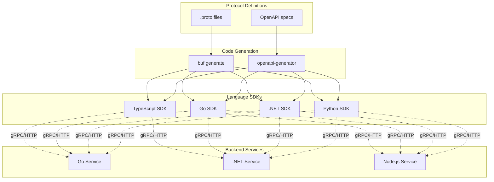

import { Accordion, Accordions } from 'fumadocs-ui/components/accordion';
import { Callout } from 'fumadocs-ui/components/callout';
import { File, Files, Folder } from 'fumadocs-ui/components/files';
import { Steps } from 'fumadocs-ui/components/steps';
import { Tab, Tabs } from 'fumadocs-ui/components/tabs';

# Multi-Language SDKs

Generate **type-safe SDKs** for multiple programming languages from a single source of truth. Each SDK provides idiomatic APIs while maintaining protocol compatibility.

<Callout type="info">
All SDKs are generated from the same Protocol Buffer definitions, ensuring **wire compatibility** across all languages. Services can be implemented in any language and consumed by any SDK.
</Callout>

## SDK Architecture Overview



## Monorepo Structure

<Files>
  <Folder name="packages" defaultOpen>
    <Folder name="proto">
      <File name="buf.yaml" />
      <File name="buf.gen.yaml" />
      <Folder name="org">
        <File name="order/v1/order.proto" />
        <File name="payment/v1/payment.proto" />
        <File name="common/v1/common.proto" />
      </Folder>
    </Folder>
    <Folder name="sdk-typescript">
      <File name="package.json" />
      <Folder name="src" />
    </Folder>
    <Folder name="sdk-go">
      <File name="go.mod" />
      <Folder name="order" />
      <Folder name="payment" />
    </Folder>
    <Folder name="sdk-dotnet">
      <File name="Org.Sdk.csproj" />
      <Folder name="Order" />
      <Folder name="Payment" />
    </Folder>
    <Folder name="sdk-python">
      <File name="pyproject.toml" />
      <Folder name="org_sdk" />
    </Folder>
  </Folder>
</Files>

## Generation Configuration

```yaml title="packages/proto/buf.gen.yaml"
version: v2
managed:
  enabled: true
  override:
    - file_option: go_package_prefix
      value: github.com/org/sdk-go

plugins:
  # TypeScript SDK
  - remote: buf.build/connectrpc/es
    out: ../sdk-typescript/src/generated
    opt:
      - target=ts
      - import_extension=.js

  # Go SDK
  - remote: buf.build/protocolbuffers/go
    out: ../sdk-go
    opt:
      - paths=source_relative
  - remote: buf.build/connectrpc/go
    out: ../sdk-go
    opt:
      - paths=source_relative

  # .NET SDK
  - remote: buf.build/grpc/csharp
    out: ../sdk-dotnet/Generated
  - remote: buf.build/protocolbuffers/csharp
    out: ../sdk-dotnet/Generated

  # Python SDK
  - remote: buf.build/protocolbuffers/python
    out: ../sdk-python/org_sdk/generated
  - remote: buf.build/grpc/python
    out: ../sdk-python/org_sdk/generated
```

---

## Go SDK

### Package Structure

<Files>
  <Folder name="sdk-go" defaultOpen>
    <File name="go.mod" />
    <File name="go.sum" />
    <File name="sdk.go" />
    <Folder name="order" defaultOpen>
      <File name="orderv1connect/order.connect.go" />
      <File name="v1/order.pb.go" />
      <File name="client.go" />
    </Folder>
    <Folder name="payment">
      <File name="paymentv1connect/payment.connect.go" />
      <File name="v1/payment.pb.go" />
      <File name="client.go" />
    </Folder>
    <Folder name="transport">
      <File name="transport.go" />
      <File name="grpc.go" />
      <File name="http.go" />
    </Folder>
    <Folder name="middleware">
      <File name="auth.go" />
      <File name="logging.go" />
      <File name="retry.go" />
    </Folder>
  </Folder>
</Files>

### Module Configuration

```go title="packages/sdk-go/go.mod"
module github.com/org/sdk-go

go 1.22

require (
	connectrpc.com/connect v1.16.0
	google.golang.org/protobuf v1.33.0
	golang.org/x/net v0.24.0
)

require (
	google.golang.org/grpc v1.63.0
)
```

### Client Implementation

```go title="packages/sdk-go/order/client.go"
package order

import (
	"context"
	"net/http"

	"connectrpc.com/connect"
	orderv1 "github.com/org/sdk-go/order/v1"
	"github.com/org/sdk-go/order/orderv1connect"
)

// Client provides type-safe access to the Order service
type Client struct {
	client orderv1connect.OrderServiceClient
}

// NewClient creates a new Order service client
func NewClient(baseURL string, opts ...connect.ClientOption) *Client {
	return &Client{
		client: orderv1connect.NewOrderServiceClient(
			http.DefaultClient,
			baseURL,
			opts...,
		),
	}
}

// NewClientWithHTTP creates a client with a custom HTTP client
func NewClientWithHTTP(httpClient *http.Client, baseURL string, opts ...connect.ClientOption) *Client {
	return &Client{
		client: orderv1connect.NewOrderServiceClient(
			httpClient,
			baseURL,
			opts...,
		),
	}
}

// CreateOrder creates a new order
func (c *Client) CreateOrder(ctx context.Context, req *orderv1.CreateOrderRequest) (*orderv1.CreateOrderResponse, error) {
	resp, err := c.client.CreateOrder(ctx, connect.NewRequest(req))
	if err != nil {
		return nil, err
	}
	return resp.Msg, nil
}

// GetOrder retrieves an order by ID
func (c *Client) GetOrder(ctx context.Context, orderID string) (*orderv1.Order, error) {
	resp, err := c.client.GetOrder(ctx, connect.NewRequest(&orderv1.GetOrderRequest{
		OrderId: orderID,
	}))
	if err != nil {
		return nil, err
	}
	return resp.Msg, nil
}

// ListOrders returns a paginated list of orders
func (c *Client) ListOrders(ctx context.Context, req *orderv1.ListOrdersRequest) (*orderv1.ListOrdersResponse, error) {
	resp, err := c.client.ListOrders(ctx, connect.NewRequest(req))
	if err != nil {
		return nil, err
	}
	return resp.Msg, nil
}

// CancelOrder cancels an existing order
func (c *Client) CancelOrder(ctx context.Context, orderID string, reason string) (*orderv1.CancelOrderResponse, error) {
	resp, err := c.client.CancelOrder(ctx, connect.NewRequest(&orderv1.CancelOrderRequest{
		OrderId: orderID,
		Reason:  reason,
	}))
	if err != nil {
		return nil, err
	}
	return resp.Msg, nil
}

// WatchOrder streams order status updates
func (c *Client) WatchOrder(ctx context.Context, orderID string) (<-chan *orderv1.OrderEvent, <-chan error) {
	events := make(chan *orderv1.OrderEvent)
	errs := make(chan error, 1)

	go func() {
		defer close(events)
		defer close(errs)

		stream, err := c.client.WatchOrder(ctx, connect.NewRequest(&orderv1.WatchOrderRequest{
			OrderId: orderID,
		}))
		if err != nil {
			errs <- err
			return
		}

		for stream.Receive() {
			events <- stream.Msg()
		}

		if err := stream.Err(); err != nil {
			errs <- err
		}
	}()

	return events, errs
}
```

### SDK Factory

```go title="packages/sdk-go/sdk.go"
package sdk

import (
	"net/http"
	"time"

	"connectrpc.com/connect"
	"github.com/org/sdk-go/middleware"
	"github.com/org/sdk-go/order"
	"github.com/org/sdk-go/payment"
)

// SDK provides access to all service clients
type SDK struct {
	Order   *order.Client
	Payment *payment.Client
}

// Config holds SDK configuration
type Config struct {
	BaseURL    string
	AuthToken  string
	Timeout    time.Duration
	HTTPClient *http.Client
	Debug      bool
}

// New creates a new SDK instance
func New(cfg Config) *SDK {
	httpClient := cfg.HTTPClient
	if httpClient == nil {
		httpClient = &http.Client{
			Timeout: cfg.Timeout,
		}
	}

	// Build client options
	opts := []connect.ClientOption{
		connect.WithInterceptors(
			middleware.NewAuthInterceptor(cfg.AuthToken),
		),
	}

	if cfg.Debug {
		opts = append(opts, connect.WithInterceptors(
			middleware.NewLoggingInterceptor(),
		))
	}

	return &SDK{
		Order:   order.NewClientWithHTTP(httpClient, cfg.BaseURL, opts...),
		Payment: payment.NewClientWithHTTP(httpClient, cfg.BaseURL, opts...),
	}
}

// NewWithDefaults creates an SDK with sensible defaults
func NewWithDefaults(baseURL, authToken string) *SDK {
	return New(Config{
		BaseURL:   baseURL,
		AuthToken: authToken,
		Timeout:   30 * time.Second,
	})
}
```

### Middleware

```go title="packages/sdk-go/middleware/auth.go"
package middleware

import (
	"context"

	"connectrpc.com/connect"
)

// NewAuthInterceptor creates an interceptor that adds auth headers
func NewAuthInterceptor(token string) connect.UnaryInterceptorFunc {
	return func(next connect.UnaryFunc) connect.UnaryFunc {
		return func(ctx context.Context, req connect.AnyRequest) (connect.AnyResponse, error) {
			if token != "" {
				req.Header().Set("Authorization", "Bearer "+token)
			}
			return next(ctx, req)
		}
	}
}

// NewAuthInterceptorWithProvider creates an interceptor with dynamic token
func NewAuthInterceptorWithProvider(provider func() string) connect.UnaryInterceptorFunc {
	return func(next connect.UnaryFunc) connect.UnaryFunc {
		return func(ctx context.Context, req connect.AnyRequest) (connect.AnyResponse, error) {
			if token := provider(); token != "" {
				req.Header().Set("Authorization", "Bearer "+token)
			}
			return next(ctx, req)
		}
	}
}
```

### Usage Example

```go title="services/order-processor/main.go"
package main

import (
	"context"
	"log"
	"os"

	sdk "github.com/org/sdk-go"
	orderv1 "github.com/org/sdk-go/order/v1"
)

func main() {
	client := sdk.NewWithDefaults(
		os.Getenv("API_BASE_URL"),
		os.Getenv("AUTH_TOKEN"),
	)

	ctx := context.Background()

	// Create order
	createResp, err := client.Order.CreateOrder(ctx, &orderv1.CreateOrderRequest{
		CustomerId: "cust-123",
		Items: []*orderv1.CreateOrderItem{
			{ProductId: "prod-456", Quantity: 2},
			{ProductId: "prod-789", Quantity: 1},
		},
	})
	if err != nil {
		log.Fatalf("Failed to create order: %v", err)
	}

	log.Printf("Created order: %s", createResp.OrderId)

	// Watch for updates
	events, errs := client.Order.WatchOrder(ctx, createResp.OrderId)
	for {
		select {
		case event, ok := <-events:
			if !ok {
				return
			}
			log.Printf("Order %s: %s -> %s", event.OrderId, event.PreviousStatus, event.NewStatus)
		case err := <-errs:
			if err != nil {
				log.Printf("Stream error: %v", err)
			}
			return
		}
	}
}
```

---

## .NET SDK

### Project Structure

<Files>
  <Folder name="sdk-dotnet" defaultOpen>
    <File name="Org.Sdk.csproj" />
    <File name="Sdk.cs" />
    <Folder name="Generated">
      <File name="Order.cs" />
      <File name="OrderGrpc.cs" />
      <File name="Payment.cs" />
      <File name="PaymentGrpc.cs" />
    </Folder>
    <Folder name="Clients" defaultOpen>
      <File name="OrderClient.cs" />
      <File name="PaymentClient.cs" />
    </Folder>
    <Folder name="Transport">
      <File name="ITransport.cs" />
      <File name="GrpcTransport.cs" />
      <File name="HttpTransport.cs" />
    </Folder>
    <Folder name="Middleware">
      <File name="AuthInterceptor.cs" />
      <File name="LoggingInterceptor.cs" />
      <File name="RetryInterceptor.cs" />
    </Folder>
  </Folder>
</Files>

### Project Configuration

```xml title="packages/sdk-dotnet/Org.Sdk.csproj"
<Project Sdk="Microsoft.NET.Sdk">

  <PropertyGroup>
    <TargetFrameworks>net8.0;net6.0</TargetFrameworks>
    <LangVersion>12.0</LangVersion>
    <Nullable>enable</Nullable>
    <ImplicitUsings>enable</ImplicitUsings>
    <PackageId>Org.Sdk</PackageId>
    <Version>1.0.0</Version>
    <Authors>Org</Authors>
    <Description>Type-safe SDK for Org services</Description>
    <PackageTags>sdk;grpc;api</PackageTags>
    <GenerateDocumentationFile>true</GenerateDocumentationFile>
  </PropertyGroup>

  <ItemGroup>
    <PackageReference Include="Google.Protobuf" Version="3.26.0" />
    <PackageReference Include="Grpc.Net.Client" Version="2.62.0" />
    <PackageReference Include="Grpc.Tools" Version="2.62.0" PrivateAssets="All" />
    <PackageReference Include="Microsoft.Extensions.Http" Version="8.0.0" />
    <PackageReference Include="Microsoft.Extensions.Logging.Abstractions" Version="8.0.0" />
    <PackageReference Include="Polly" Version="8.3.0" />
  </ItemGroup>

</Project>
```

### Client Implementation

```csharp title="packages/sdk-dotnet/Clients/OrderClient.cs"
using Grpc.Core;
using Grpc.Net.Client;
using Microsoft.Extensions.Logging;
using Org.Order.V1;

namespace Org.Sdk.Clients;

/// <summary>
/// Type-safe client for the Order service
/// </summary>
public sealed class OrderClient : IDisposable
{
    private readonly OrderService.OrderServiceClient _client;
    private readonly GrpcChannel _channel;
    private readonly ILogger<OrderClient>? _logger;

    public OrderClient(string address, ILogger<OrderClient>? logger = null)
    {
        _channel = GrpcChannel.ForAddress(address);
        _client = new OrderService.OrderServiceClient(_channel);
        _logger = logger;
    }

    public OrderClient(GrpcChannel channel, ILogger<OrderClient>? logger = null)
    {
        _channel = channel;
        _client = new OrderService.OrderServiceClient(channel);
        _logger = logger;
    }

    /// <summary>
    /// Creates a new order
    /// </summary>
    public async Task<CreateOrderResponse> CreateOrderAsync(
        CreateOrderRequest request,
        Metadata? headers = null,
        CancellationToken cancellationToken = default)
    {
        _logger?.LogDebug("Creating order for customer {CustomerId}", request.CustomerId);
        
        var response = await _client.CreateOrderAsync(
            request,
            headers,
            cancellationToken: cancellationToken);
        
        _logger?.LogInformation("Created order {OrderId}", response.OrderId);
        return response;
    }

    /// <summary>
    /// Gets an order by ID
    /// </summary>
    public async Task<Order> GetOrderAsync(
        string orderId,
        Metadata? headers = null,
        CancellationToken cancellationToken = default)
    {
        var request = new GetOrderRequest { OrderId = orderId };
        return await _client.GetOrderAsync(request, headers, cancellationToken: cancellationToken);
    }

    /// <summary>
    /// Lists orders with optional filtering
    /// </summary>
    public async Task<ListOrdersResponse> ListOrdersAsync(
        ListOrdersRequest request,
        Metadata? headers = null,
        CancellationToken cancellationToken = default)
    {
        return await _client.ListOrdersAsync(request, headers, cancellationToken: cancellationToken);
    }

    /// <summary>
    /// Cancels an order
    /// </summary>
    public async Task<CancelOrderResponse> CancelOrderAsync(
        string orderId,
        string? reason = null,
        Metadata? headers = null,
        CancellationToken cancellationToken = default)
    {
        var request = new CancelOrderRequest
        {
            OrderId = orderId,
            Reason = reason ?? string.Empty
        };
        
        return await _client.CancelOrderAsync(request, headers, cancellationToken: cancellationToken);
    }

    /// <summary>
    /// Streams order status updates
    /// </summary>
    public async IAsyncEnumerable<OrderEvent> WatchOrderAsync(
        string orderId,
        Metadata? headers = null,
        [System.Runtime.CompilerServices.EnumeratorCancellation] CancellationToken cancellationToken = default)
    {
        var request = new WatchOrderRequest { OrderId = orderId };
        
        using var call = _client.WatchOrder(request, headers, cancellationToken: cancellationToken);
        
        await foreach (var @event in call.ResponseStream.ReadAllAsync(cancellationToken))
        {
            _logger?.LogDebug("Order {OrderId} status: {Status}", @event.OrderId, @event.NewStatus);
            yield return @event;
        }
    }

    public void Dispose()
    {
        _channel.Dispose();
    }
}
```

### SDK Factory

```csharp title="packages/sdk-dotnet/Sdk.cs"
using Grpc.Core;
using Grpc.Core.Interceptors;
using Grpc.Net.Client;
using Microsoft.Extensions.Logging;
using Org.Sdk.Clients;
using Org.Sdk.Middleware;

namespace Org.Sdk;

/// <summary>
/// SDK configuration options
/// </summary>
public sealed class SdkOptions
{
    public required string BaseUrl { get; init; }
    public string? AuthToken { get; init; }
    public TimeSpan Timeout { get; init; } = TimeSpan.FromSeconds(30);
    public bool EnableLogging { get; init; }
    public ILoggerFactory? LoggerFactory { get; init; }
    public HttpClient? HttpClient { get; init; }
}

/// <summary>
/// Main SDK entry point providing access to all service clients
/// </summary>
public sealed class OrgSdk : IDisposable
{
    private readonly GrpcChannel _channel;

    public OrderClient Order { get; }
    public PaymentClient Payment { get; }

    private OrgSdk(GrpcChannel channel, ILoggerFactory? loggerFactory)
    {
        _channel = channel;
        Order = new OrderClient(channel, loggerFactory?.CreateLogger<OrderClient>());
        Payment = new PaymentClient(channel, loggerFactory?.CreateLogger<PaymentClient>());
    }

    /// <summary>
    /// Creates a new SDK instance with the specified options
    /// </summary>
    public static OrgSdk Create(SdkOptions options)
    {
        var channelOptions = new GrpcChannelOptions
        {
            HttpClient = options.HttpClient,
            LoggerFactory = options.LoggerFactory,
        };

        var channel = GrpcChannel.ForAddress(options.BaseUrl, channelOptions);

        // Apply interceptors
        var interceptors = new List<Interceptor>();

        if (!string.IsNullOrEmpty(options.AuthToken))
        {
            interceptors.Add(new AuthInterceptor(options.AuthToken));
        }

        if (options.EnableLogging && options.LoggerFactory != null)
        {
            interceptors.Add(new LoggingInterceptor(options.LoggerFactory.CreateLogger<LoggingInterceptor>()));
        }

        return new OrgSdk(channel, options.LoggerFactory);
    }

    /// <summary>
    /// Creates an SDK with minimal configuration
    /// </summary>
    public static OrgSdk Create(string baseUrl, string? authToken = null)
    {
        return Create(new SdkOptions
        {
            BaseUrl = baseUrl,
            AuthToken = authToken
        });
    }

    public void Dispose()
    {
        _channel.Dispose();
    }
}
```

### Usage Example

```csharp title="Services/OrderProcessor/Program.cs"
using Microsoft.Extensions.Logging;
using Org.Order.V1;
using Org.Sdk;

var loggerFactory = LoggerFactory.Create(builder =>
{
    builder.AddConsole();
    builder.SetMinimumLevel(LogLevel.Debug);
});

using var sdk = OrgSdk.Create(new SdkOptions
{
    BaseUrl = Environment.GetEnvironmentVariable("API_BASE_URL")!,
    AuthToken = Environment.GetEnvironmentVariable("AUTH_TOKEN"),
    EnableLogging = true,
    LoggerFactory = loggerFactory
});

// Create order
var createResponse = await sdk.Order.CreateOrderAsync(new CreateOrderRequest
{
    CustomerId = "cust-123",
    Items =
    {
        new CreateOrderItem { ProductId = "prod-456", Quantity = 2 },
        new CreateOrderItem { ProductId = "prod-789", Quantity = 1 }
    }
});

Console.WriteLine($"Created order: {createResponse.OrderId}");

// Watch for updates
using var cts = new CancellationTokenSource(TimeSpan.FromMinutes(5));

await foreach (var @event in sdk.Order.WatchOrderAsync(createResponse.OrderId, cancellationToken: cts.Token))
{
    Console.WriteLine($"Order {event.OrderId}: {event.PreviousStatus} -> {event.NewStatus}");
    
    if (@event.NewStatus is OrderStatus.Delivered or OrderStatus.Cancelled)
    {
        break;
    }
}
```

---

## Python SDK

### Package Structure

<Files>
  <Folder name="sdk-python" defaultOpen>
    <File name="pyproject.toml" />
    <File name="README.md" />
    <Folder name="org_sdk" defaultOpen>
      <File name="__init__.py" />
      <File name="sdk.py" />
      <Folder name="generated">
        <File name="__init__.py" />
        <File name="order_pb2.py" />
        <File name="order_pb2_grpc.py" />
        <File name="payment_pb2.py" />
        <File name="payment_pb2_grpc.py" />
      </Folder>
      <Folder name="clients">
        <File name="__init__.py" />
        <File name="order.py" />
        <File name="payment.py" />
      </Folder>
      <Folder name="transport">
        <File name="__init__.py" />
        <File name="grpc.py" />
        <File name="http.py" />
      </Folder>
      <Folder name="middleware">
        <File name="__init__.py" />
        <File name="auth.py" />
        <File name="logging.py" />
        <File name="retry.py" />
      </Folder>
    </Folder>
    <Folder name="tests">
      <File name="test_order_client.py" />
    </Folder>
  </Folder>
</Files>

### Package Configuration

```toml title="packages/sdk-python/pyproject.toml"
[build-system]
requires = ["hatchling"]
build-backend = "hatchling.build"

[project]
name = "org-sdk"
version = "1.0.0"
description = "Type-safe SDK for Org services"
readme = "README.md"
license = "MIT"
requires-python = ">=3.10"
authors = [
    { name = "Org", email = "sdk@org.com" }
]
keywords = ["sdk", "grpc", "api", "client"]
classifiers = [
    "Development Status :: 4 - Beta",
    "Intended Audience :: Developers",
    "License :: OSI Approved :: MIT License",
    "Programming Language :: Python :: 3",
    "Programming Language :: Python :: 3.10",
    "Programming Language :: Python :: 3.11",
    "Programming Language :: Python :: 3.12",
    "Typing :: Typed",
]

dependencies = [
    "grpcio>=1.62.0",
    "grpcio-tools>=1.62.0",
    "protobuf>=4.25.0",
    "httpx>=0.27.0",
    "pydantic>=2.6.0",
    "tenacity>=8.2.0",
]

[project.optional-dependencies]
dev = [
    "pytest>=8.0.0",
    "pytest-asyncio>=0.23.0",
    "pytest-cov>=4.1.0",
    "mypy>=1.9.0",
    "ruff>=0.3.0",
    "grpcio-testing>=1.62.0",
]

[tool.hatch.build.targets.wheel]
packages = ["org_sdk"]

[tool.mypy]
python_version = "3.10"
strict = true
warn_return_any = true
warn_unused_configs = true

[tool.ruff]
target-version = "py310"
line-length = 100

[tool.ruff.lint]
select = ["E", "F", "I", "N", "W", "UP", "B", "C4", "SIM"]

[tool.pytest.ini_options]
asyncio_mode = "auto"
testpaths = ["tests"]
```

### Client Implementation

```python title="packages/sdk-python/org_sdk/clients/order.py"
from __future__ import annotations

import asyncio
from collections.abc import AsyncIterator
from dataclasses import dataclass
from typing import TYPE_CHECKING

import grpc
from grpc.aio import Channel

from org_sdk.generated import order_pb2, order_pb2_grpc

if TYPE_CHECKING:
    from org_sdk.generated.order_pb2 import (
        CancelOrderRequest,
        CancelOrderResponse,
        CreateOrderRequest,
        CreateOrderResponse,
        GetOrderRequest,
        ListOrdersRequest,
        ListOrdersResponse,
        Order,
        OrderEvent,
        WatchOrderRequest,
    )


@dataclass
class OrderClientConfig:
    """Configuration for OrderClient"""
    timeout: float = 30.0
    metadata: list[tuple[str, str]] | None = None


class OrderClient:
    """Type-safe client for the Order service"""

    def __init__(
        self,
        channel: Channel,
        config: OrderClientConfig | None = None,
    ) -> None:
        self._stub = order_pb2_grpc.OrderServiceStub(channel)
        self._config = config or OrderClientConfig()

    async def create_order(
        self,
        request: CreateOrderRequest,
        *,
        timeout: float | None = None,
        metadata: list[tuple[str, str]] | None = None,
    ) -> CreateOrderResponse:
        """Create a new order"""
        return await self._stub.CreateOrder(
            request,
            timeout=timeout or self._config.timeout,
            metadata=metadata or self._config.metadata,
        )

    async def get_order(
        self,
        order_id: str,
        *,
        include: list[str] | None = None,
        timeout: float | None = None,
        metadata: list[tuple[str, str]] | None = None,
    ) -> Order:
        """Get an order by ID"""
        request = order_pb2.GetOrderRequest(
            order_id=order_id,
            include=include or [],
        )
        return await self._stub.GetOrder(
            request,
            timeout=timeout or self._config.timeout,
            metadata=metadata or self._config.metadata,
        )

    async def list_orders(
        self,
        request: ListOrdersRequest,
        *,
        timeout: float | None = None,
        metadata: list[tuple[str, str]] | None = None,
    ) -> ListOrdersResponse:
        """List orders with filtering and pagination"""
        return await self._stub.ListOrders(
            request,
            timeout=timeout or self._config.timeout,
            metadata=metadata or self._config.metadata,
        )

    async def cancel_order(
        self,
        order_id: str,
        *,
        reason: str | None = None,
        request_refund: bool = False,
        timeout: float | None = None,
        metadata: list[tuple[str, str]] | None = None,
    ) -> CancelOrderResponse:
        """Cancel an existing order"""
        request = order_pb2.CancelOrderRequest(
            order_id=order_id,
            reason=reason or "",
            request_refund=request_refund,
        )
        return await self._stub.CancelOrder(
            request,
            timeout=timeout or self._config.timeout,
            metadata=metadata or self._config.metadata,
        )

    async def watch_order(
        self,
        order_id: str,
        *,
        metadata: list[tuple[str, str]] | None = None,
    ) -> AsyncIterator[OrderEvent]:
        """Stream order status updates"""
        request = order_pb2.WatchOrderRequest(order_id=order_id)
        
        async for event in self._stub.WatchOrder(
            request,
            metadata=metadata or self._config.metadata,
        ):
            yield event
```

### SDK Factory

```python title="packages/sdk-python/org_sdk/sdk.py"
from __future__ import annotations

from dataclasses import dataclass, field
from typing import TYPE_CHECKING

import grpc
from grpc.aio import Channel, insecure_channel, secure_channel

from org_sdk.clients.order import OrderClient, OrderClientConfig
from org_sdk.clients.payment import PaymentClient, PaymentClientConfig
from org_sdk.middleware.auth import AuthInterceptor
from org_sdk.middleware.logging import LoggingInterceptor
from org_sdk.middleware.retry import RetryInterceptor

if TYPE_CHECKING:
    from collections.abc import Sequence


@dataclass
class SdkConfig:
    """SDK configuration options"""
    base_url: str
    auth_token: str | None = None
    timeout: float = 30.0
    secure: bool = True
    enable_logging: bool = False
    enable_retry: bool = True
    max_retries: int = 3
    interceptors: list[grpc.aio.ClientInterceptor] = field(default_factory=list)


class OrgSdk:
    """Main SDK entry point providing access to all service clients"""

    def __init__(self, channel: Channel, config: SdkConfig) -> None:
        self._channel = channel
        self._config = config

        client_config = OrderClientConfig(timeout=config.timeout)
        
        self.order = OrderClient(channel, client_config)
        self.payment = PaymentClient(channel, PaymentClientConfig(timeout=config.timeout))

    @classmethod
    def create(cls, config: SdkConfig) -> OrgSdk:
        """Create a new SDK instance with the specified configuration"""
        interceptors: list[grpc.aio.ClientInterceptor] = list(config.interceptors)

        # Add auth interceptor
        if config.auth_token:
            interceptors.append(AuthInterceptor(config.auth_token))

        # Add logging interceptor
        if config.enable_logging:
            interceptors.append(LoggingInterceptor())

        # Add retry interceptor
        if config.enable_retry:
            interceptors.append(RetryInterceptor(max_retries=config.max_retries))

        # Create channel
        if config.secure:
            credentials = grpc.ssl_channel_credentials()
            channel = secure_channel(
                config.base_url,
                credentials,
                interceptors=interceptors,
            )
        else:
            channel = insecure_channel(
                config.base_url,
                interceptors=interceptors,
            )

        return cls(channel, config)

    @classmethod
    def create_simple(
        cls,
        base_url: str,
        auth_token: str | None = None,
    ) -> OrgSdk:
        """Create an SDK with minimal configuration"""
        return cls.create(SdkConfig(
            base_url=base_url,
            auth_token=auth_token,
        ))

    async def close(self) -> None:
        """Close the SDK and release resources"""
        await self._channel.close()

    async def __aenter__(self) -> OrgSdk:
        return self

    async def __aexit__(self, *args) -> None:
        await self.close()
```

### Usage Example

```python title="services/order_processor/main.py"
import asyncio
import os

from org_sdk import OrgSdk, SdkConfig
from org_sdk.generated import order_pb2


async def main() -> None:
    config = SdkConfig(
        base_url=os.environ["API_BASE_URL"],
        auth_token=os.environ.get("AUTH_TOKEN"),
        enable_logging=True,
        enable_retry=True,
    )

    async with OrgSdk.create(config) as sdk:
        # Create order
        create_response = await sdk.order.create_order(
            order_pb2.CreateOrderRequest(
                customer_id="cust-123",
                items=[
                    order_pb2.CreateOrderItem(product_id="prod-456", quantity=2),
                    order_pb2.CreateOrderItem(product_id="prod-789", quantity=1),
                ],
            )
        )

        print(f"Created order: {create_response.order_id}")

        # Watch for updates
        async for event in sdk.order.watch_order(create_response.order_id):
            print(f"Order {event.order_id}: {event.previous_status} -> {event.new_status}")

            if event.new_status in (
                order_pb2.OrderStatus.DELIVERED,
                order_pb2.OrderStatus.CANCELLED,
            ):
                break


if __name__ == "__main__":
    asyncio.run(main())
```

---

## Cross-Language Type Mapping

| Protocol Buffer Type | TypeScript | Go | C# | Python |
|---------------------|------------|-----|-----|--------|
| `string` | `string` | `string` | `string` | `str` |
| `int32` | `number` | `int32` | `int` | `int` |
| `int64` | `bigint` | `int64` | `long` | `int` |
| `float` | `number` | `float32` | `float` | `float` |
| `double` | `number` | `float64` | `double` | `float` |
| `bool` | `boolean` | `bool` | `bool` | `bool` |
| `bytes` | `Uint8Array` | `[]byte` | `ByteString` | `bytes` |
| `repeated T` | `T[]` | `[]T` | `RepeatedField<T>` | `list[T]` |
| `map<K, V>` | `Record<K, V>` | `map[K]V` | `MapField<K, V>` | `dict[K, V]` |
| `google.protobuf.Timestamp` | `Date` | `time.Time` | `Timestamp` | `datetime` |
| `google.protobuf.Duration` | `number` (ms) | `time.Duration` | `Duration` | `timedelta` |
| `optional T` | `T \| undefined` | `*T` | `T?` | `T \| None` |

## CI/CD Integration

```yaml title=".github/workflows/sdk-release.yml"
name: SDK Release

on:
  push:
    paths:
      - 'packages/proto/**'
      - 'packages/sdk-*/**'
    branches: [main]

jobs:
  generate:
    runs-on: ubuntu-latest
    steps:
      - uses: actions/checkout@v4
      
      - name: Setup Buf
        uses: bufbuild/buf-setup-action@v1
      
      - name: Generate all SDKs
        run: buf generate
        working-directory: packages/proto

  publish-typescript:
    needs: generate
    runs-on: ubuntu-latest
    steps:
      - uses: actions/checkout@v4
      - uses: pnpm/action-setup@v3
      - run: pnpm install && pnpm build
        working-directory: packages/sdk-typescript
      - run: pnpm publish --access restricted
        working-directory: packages/sdk-typescript
        env:
          NODE_AUTH_TOKEN: ${{ secrets.NPM_TOKEN }}

  publish-go:
    needs: generate
    runs-on: ubuntu-latest
    steps:
      - uses: actions/checkout@v4
      - uses: actions/setup-go@v5
        with:
          go-version: '1.22'
      - name: Tag and push Go module
        run: |
          git tag sdk-go/v${{ github.run_number }}
          git push origin sdk-go/v${{ github.run_number }}

  publish-dotnet:
    needs: generate
    runs-on: ubuntu-latest
    steps:
      - uses: actions/checkout@v4
      - uses: actions/setup-dotnet@v4
        with:
          dotnet-version: '8.0.x'
      - run: dotnet pack -c Release
        working-directory: packages/sdk-dotnet
      - run: dotnet nuget push **/*.nupkg --api-key ${{ secrets.NUGET_KEY }} --source https://api.nuget.org/v3/index.json
        working-directory: packages/sdk-dotnet

  publish-python:
    needs: generate
    runs-on: ubuntu-latest
    steps:
      - uses: actions/checkout@v4
      - uses: actions/setup-python@v5
        with:
          python-version: '3.12'
      - run: pip install build twine
      - run: python -m build
        working-directory: packages/sdk-python
      - run: twine upload dist/*
        working-directory: packages/sdk-python
        env:
          TWINE_USERNAME: __token__
          TWINE_PASSWORD: ${{ secrets.PYPI_TOKEN }}
```

## Next Steps

- **[Versioning & Publishing](/docs/code-quality/architecture/infrastructure-as-code/sdk-modules/versioning)** - SDK release management and semantic versioning
