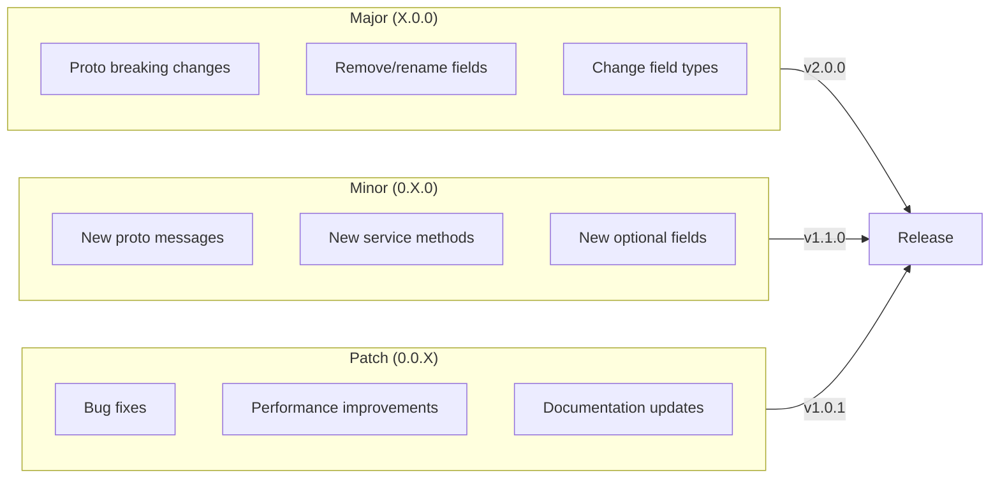

import { Accordion, Accordions } from 'fumadocs-ui/components/accordion';
import { Callout } from 'fumadocs-ui/components/callout';
import { File, Files, Folder } from 'fumadocs-ui/components/files';
import { Steps } from 'fumadocs-ui/components/steps';
import { Tab, Tabs } from 'fumadocs-ui/components/tabs';

# Versioning & Publishing

Manage **synchronized releases** across multiple SDK packages with automated versioning, changelogs, and publishing to package registries.

<Callout type="warn">
All SDKs **must** use the same major version to ensure protocol compatibility. Breaking changes in proto definitions require a major version bump across all SDKs.
</Callout>

## Versioning Strategy



## Monorepo Configuration

<Files>
  <Folder name="root" defaultOpen>
    <File name="package.json" />
    <File name=".changeset/config.json" />
    <Folder name="packages" defaultOpen>
      <Folder name="proto">
        <File name="package.json" />
        <File name="CHANGELOG.md" />
      </Folder>
      <Folder name="sdk-typescript">
        <File name="package.json" />
        <File name="CHANGELOG.md" />
      </Folder>
      <Folder name="sdk-go">
        <File name="go.mod" />
        <File name="CHANGELOG.md" />
      </Folder>
      <Folder name="sdk-dotnet">
        <File name="Org.Sdk.csproj" />
        <File name="CHANGELOG.md" />
      </Folder>
      <Folder name="sdk-python">
        <File name="pyproject.toml" />
        <File name="CHANGELOG.md" />
      </Folder>
    </Folder>
    <Folder name=".changeset">
      <File name="config.json" />
      <File name="README.md" />
    </Folder>
  </Folder>
</Files>

## Changesets Configuration

```json title=".changeset/config.json"
{
  "$schema": "https://unpkg.com/@changesets/config@3.0.0/schema.json",
  "changelog": [
    "@changesets/changelog-github",
    { "repo": "org/platform" }
  ],
  "commit": false,
  "fixed": [
    ["@org/proto", "@org/sdk-typescript"]
  ],
  "linked": [],
  "access": "restricted",
  "baseBranch": "main",
  "updateInternalDependencies": "patch",
  "ignore": [],
  "privatePackages": {
    "version": true,
    "tag": true
  },
  "___experimentalUnsafeOptions_WILL_CHANGE_IN_PATCH": {
    "onlyUpdatePeerDependentsWhenOutOfRange": true
  }
}
```

## Root Package Configuration

```json title="package.json"
{
  "name": "@org/platform",
  "private": true,
  "workspaces": [
    "packages/*",
    "services/*",
    "apps/*"
  ],
  "scripts": {
    "changeset": "changeset",
    "changeset:add": "changeset add",
    "changeset:status": "changeset status",
    "version": "changeset version && pnpm install --lockfile-only",
    "version:all": "pnpm run version && pnpm run version:go && pnpm run version:dotnet && pnpm run version:python",
    "version:go": "node scripts/version-go.mjs",
    "version:dotnet": "node scripts/version-dotnet.mjs",
    "version:python": "node scripts/version-python.mjs",
    "release": "pnpm run build && changeset publish",
    "release:all": "pnpm run release && pnpm run release:go && pnpm run release:dotnet && pnpm run release:python",
    "release:go": "node scripts/release-go.mjs",
    "release:dotnet": "node scripts/release-dotnet.mjs",
    "release:python": "node scripts/release-python.mjs"
  },
  "devDependencies": {
    "@changesets/changelog-github": "^0.5.0",
    "@changesets/cli": "^2.27.0",
    "turbo": "^2.0.0"
  },
  "packageManager": "pnpm@9.1.0"
}
```

## SDK Package Configurations

<Tabs items={['TypeScript', 'Go', '.NET', 'Python']}>
<Tab value="TypeScript">
```json title="packages/sdk-typescript/package.json"
{
  "name": "@org/sdk-typescript",
  "version": "1.2.3",
  "description": "Type-safe TypeScript SDK for Org services",
  "type": "module",
  "main": "./dist/index.js",
  "types": "./dist/index.d.ts",
  "exports": {
    ".": {
      "import": "./dist/index.js",
      "types": "./dist/index.d.ts"
    },
    "./package.json": "./package.json"
  },
  "files": [
    "dist",
    "CHANGELOG.md"
  ],
  "scripts": {
    "build": "tsup",
    "prepublishOnly": "pnpm run build"
  },
  "repository": {
    "type": "git",
    "url": "https://github.com/org/platform.git",
    "directory": "packages/sdk-typescript"
  },
  "publishConfig": {
    "access": "restricted",
    "registry": "https://npm.pkg.github.com"
  },
  "dependencies": {
    "@org/proto": "workspace:^"
  }
}
```
</Tab>
<Tab value="Go">
```go title="packages/sdk-go/go.mod"
module github.com/org/sdk-go

go 1.22

// Version is managed via git tags: sdk-go/v1.2.3

require (
	connectrpc.com/connect v1.16.0
	google.golang.org/protobuf v1.33.0
)
```

```go title="packages/sdk-go/version.go"
package sdk

// Version is the current SDK version
const Version = "1.2.3"

// ProtocolVersion is the proto contract version
const ProtocolVersion = "1.2.0"
```
</Tab>
<Tab value=".NET">
```xml title="packages/sdk-dotnet/Org.Sdk.csproj"
<Project Sdk="Microsoft.NET.Sdk">
  <PropertyGroup>
    <TargetFrameworks>net8.0;net6.0</TargetFrameworks>
    <LangVersion>12.0</LangVersion>
    <Nullable>enable</Nullable>
    
    <!-- Package metadata -->
    <PackageId>Org.Sdk</PackageId>
    <Version>1.2.3</Version>
    <Authors>Org</Authors>
    <Company>Org</Company>
    <Description>Type-safe .NET SDK for Org services</Description>
    <PackageTags>sdk;grpc;api;client</PackageTags>
    <PackageProjectUrl>https://github.com/org/platform</PackageProjectUrl>
    <RepositoryUrl>https://github.com/org/platform</RepositoryUrl>
    <RepositoryType>git</RepositoryType>
    <PackageLicenseExpression>MIT</PackageLicenseExpression>
    <PackageReadmeFile>README.md</PackageReadmeFile>
    
    <!-- Versioning -->
    <AssemblyVersion>1.2.3.0</AssemblyVersion>
    <FileVersion>1.2.3.0</FileVersion>
    <InformationalVersion>1.2.3</InformationalVersion>
    
    <!-- Source Link -->
    <PublishRepositoryUrl>true</PublishRepositoryUrl>
    <EmbedUntrackedSources>true</EmbedUntrackedSources>
    <IncludeSymbols>true</IncludeSymbols>
    <SymbolPackageFormat>snupkg</SymbolPackageFormat>
  </PropertyGroup>

  <ItemGroup>
    <None Include="README.md" Pack="true" PackagePath="\" />
    <None Include="CHANGELOG.md" Pack="true" PackagePath="\" />
  </ItemGroup>

  <ItemGroup>
    <PackageReference Include="Microsoft.SourceLink.GitHub" Version="8.0.0" PrivateAssets="All" />
  </ItemGroup>
</Project>
```
</Tab>
<Tab value="Python">
```toml title="packages/sdk-python/pyproject.toml"
[build-system]
requires = ["hatchling", "hatch-vcs"]
build-backend = "hatchling.build"

[project]
name = "org-sdk"
dynamic = ["version"]
description = "Type-safe Python SDK for Org services"
readme = "README.md"
license = "MIT"
requires-python = ">=3.10"
authors = [
    { name = "Org", email = "sdk@org.com" }
]
classifiers = [
    "Development Status :: 4 - Beta",
    "Intended Audience :: Developers",
    "License :: OSI Approved :: MIT License",
    "Programming Language :: Python :: 3",
    "Programming Language :: Python :: 3.10",
    "Programming Language :: Python :: 3.11",
    "Programming Language :: Python :: 3.12",
    "Typing :: Typed",
]
keywords = ["sdk", "grpc", "api", "client"]

dependencies = [
    "grpcio>=1.62.0",
    "protobuf>=4.25.0",
    "httpx>=0.27.0",
]

[project.urls]
Homepage = "https://github.com/org/platform"
Documentation = "https://docs.org.com/sdk/python"
Repository = "https://github.com/org/platform"
Changelog = "https://github.com/org/platform/blob/main/packages/sdk-python/CHANGELOG.md"

[tool.hatch.version]
source = "vcs"
raw-options = { root = "../.." }

[tool.hatch.build.hooks.vcs]
version-file = "org_sdk/_version.py"

[tool.hatch.build.targets.sdist]
include = [
    "/org_sdk",
    "/CHANGELOG.md",
]

[tool.hatch.build.targets.wheel]
packages = ["org_sdk"]
```

```python title="packages/sdk-python/org_sdk/_version.py"
# Auto-generated by hatch-vcs
__version__ = "1.2.3"
```
</Tab>
</Tabs>

## Version Synchronization Scripts

```typescript title="scripts/version-go.mjs"
#!/usr/bin/env node
import { readFileSync, writeFileSync } from 'node:fs';
import { join } from 'node:path';

const ROOT = process.cwd();
const SDK_PATH = join(ROOT, 'packages/sdk-go');

// Read version from TypeScript SDK (source of truth)
const tsPkg = JSON.parse(
  readFileSync(join(ROOT, 'packages/sdk-typescript/package.json'), 'utf-8')
);
const version = tsPkg.version;

console.log(`Updating Go SDK to version ${version}`);

// Update version.go
const versionGoPath = join(SDK_PATH, 'version.go');
const versionGo = readFileSync(versionGoPath, 'utf-8');

const updatedVersionGo = versionGo.replace(
  /const Version = "[^"]+"/,
  `const Version = "${version}"`
);

writeFileSync(versionGoPath, updatedVersionGo);
console.log(`Updated ${versionGoPath}`);

// Update CHANGELOG reference
const changelogPath = join(SDK_PATH, 'CHANGELOG.md');
const tsChangelog = readFileSync(
  join(ROOT, 'packages/sdk-typescript/CHANGELOG.md'),
  'utf-8'
);

// Copy changelog with Go-specific header
const goChangelog = `# @org/sdk-go\n\n${tsChangelog.split('\n').slice(2).join('\n')}`;
writeFileSync(changelogPath, goChangelog);
console.log(`Updated ${changelogPath}`);
```

```typescript title="scripts/version-dotnet.mjs"
#!/usr/bin/env node
import { readFileSync, writeFileSync } from 'node:fs';
import { join } from 'node:path';

const ROOT = process.cwd();
const SDK_PATH = join(ROOT, 'packages/sdk-dotnet');

// Read version from TypeScript SDK
const tsPkg = JSON.parse(
  readFileSync(join(ROOT, 'packages/sdk-typescript/package.json'), 'utf-8')
);
const version = tsPkg.version;

console.log(`Updating .NET SDK to version ${version}`);

// Update .csproj
const csprojPath = join(SDK_PATH, 'Org.Sdk.csproj');
let csproj = readFileSync(csprojPath, 'utf-8');

// Update Version tag
csproj = csproj.replace(
  /<Version>[^<]+<\/Version>/,
  `<Version>${version}</Version>`
);

// Update AssemblyVersion
csproj = csproj.replace(
  /<AssemblyVersion>[^<]+<\/AssemblyVersion>/,
  `<AssemblyVersion>${version}.0</AssemblyVersion>`
);

// Update FileVersion
csproj = csproj.replace(
  /<FileVersion>[^<]+<\/FileVersion>/,
  `<FileVersion>${version}.0</FileVersion>`
);

// Update InformationalVersion
csproj = csproj.replace(
  /<InformationalVersion>[^<]+<\/InformationalVersion>/,
  `<InformationalVersion>${version}</InformationalVersion>`
);

writeFileSync(csprojPath, csproj);
console.log(`Updated ${csprojPath}`);
```

```typescript title="scripts/version-python.mjs"
#!/usr/bin/env node
import { readFileSync, writeFileSync } from 'node:fs';
import { join } from 'node:path';

const ROOT = process.cwd();
const SDK_PATH = join(ROOT, 'packages/sdk-python');

// Read version from TypeScript SDK
const tsPkg = JSON.parse(
  readFileSync(join(ROOT, 'packages/sdk-typescript/package.json'), 'utf-8')
);
const version = tsPkg.version;

console.log(`Updating Python SDK to version ${version}`);

// Update _version.py
const versionPyPath = join(SDK_PATH, 'org_sdk/_version.py');
const versionPy = `# Auto-generated - do not edit manually
__version__ = "${version}"
`;

writeFileSync(versionPyPath, versionPy);
console.log(`Updated ${versionPyPath}`);
```

## Release Workflow

<Steps>
### Create Changeset

When making changes, create a changeset describing the modification:

```bash
pnpm changeset
```

This creates a markdown file in `.changeset/`:

```markdown title=".changeset/happy-dogs-dance.md"
---
"@org/proto": minor
"@org/sdk-typescript": minor
---

Add order tracking endpoint with real-time status updates

- New `WatchOrder` streaming RPC for status updates
- Added `OrderEvent` message type
- New `tracking` field on Order message
```

### Review Pending Changes

Check what versions will be bumped:

```bash
pnpm changeset status
```

Output:
```
🦋  info Packages to be bumped at minor:

🦋  - @org/proto
🦋  - @org/sdk-typescript

🦋  info Dependent packages to be bumped at patch (due to internal dependencies):

🦋  (none)
```

### Version Packages

When ready to release, run version command to consume changesets:

```bash
pnpm version:all
```

This will:
1. Bump versions in all package.json files
2. Update CHANGELOG.md files
3. Sync versions to Go, .NET, and Python SDKs
4. Remove consumed changeset files

### Publish Release

Publish all packages to their respective registries:

```bash
pnpm release:all
```
</Steps>

## CI/CD Release Pipeline

```yaml title=".github/workflows/release.yml"
name: Release

on:
  push:
    branches:
      - main

concurrency: ${{ github.workflow }}-${{ github.ref }}

jobs:
  release:
    name: Release
    runs-on: ubuntu-latest
    permissions:
      contents: write
      packages: write
      pull-requests: write
      id-token: write

    steps:
      - name: Checkout
        uses: actions/checkout@v4
        with:
          fetch-depth: 0

      - name: Setup pnpm
        uses: pnpm/action-setup@v3
        with:
          version: 9

      - name: Setup Node.js
        uses: actions/setup-node@v4
        with:
          node-version: 20
          cache: 'pnpm'
          registry-url: 'https://npm.pkg.github.com'

      - name: Setup Go
        uses: actions/setup-go@v5
        with:
          go-version: '1.22'

      - name: Setup .NET
        uses: actions/setup-dotnet@v4
        with:
          dotnet-version: '8.0.x'

      - name: Setup Python
        uses: actions/setup-python@v5
        with:
          python-version: '3.12'

      - name: Install dependencies
        run: pnpm install

      - name: Create Release Pull Request or Publish
        id: changesets
        uses: changesets/action@v1
        with:
          version: pnpm version:all
          publish: pnpm release:all
          title: 'chore: release packages'
          commit: 'chore: release packages'
        env:
          GITHUB_TOKEN: ${{ secrets.GITHUB_TOKEN }}
          NODE_AUTH_TOKEN: ${{ secrets.GITHUB_TOKEN }}
          NPM_TOKEN: ${{ secrets.NPM_TOKEN }}

      # Publish Go SDK (via git tags)
      - name: Publish Go SDK
        if: steps.changesets.outputs.published == 'true'
        run: |
          VERSION=$(node -p "require('./packages/sdk-typescript/package.json').version")
          git tag "sdk-go/v${VERSION}"
          git push origin "sdk-go/v${VERSION}"

      # Publish .NET SDK to NuGet
      - name: Publish .NET SDK
        if: steps.changesets.outputs.published == 'true'
        run: |
          cd packages/sdk-dotnet
          dotnet pack -c Release
          dotnet nuget push **/*.nupkg \
            --api-key ${{ secrets.NUGET_API_KEY }} \
            --source https://api.nuget.org/v3/index.json \
            --skip-duplicate

      # Publish Python SDK to PyPI
      - name: Publish Python SDK
        if: steps.changesets.outputs.published == 'true'
        run: |
          cd packages/sdk-python
          pip install build twine
          python -m build
          twine upload dist/* --skip-existing
        env:
          TWINE_USERNAME: __token__
          TWINE_PASSWORD: ${{ secrets.PYPI_API_KEY }}
```

## Changelog Generation

```markdown title="packages/sdk-typescript/CHANGELOG.md"
# @org/sdk-typescript

## 1.2.3

### Patch Changes

- [`a1b2c3d`](https://github.com/org/platform/commit/a1b2c3d) - Fix retry logic for streaming calls

## 1.2.0

### Minor Changes

- [`e4f5g6h`](https://github.com/org/platform/commit/e4f5g6h) - Add order tracking endpoint with real-time status updates
  - New `WatchOrder` streaming RPC for status updates
  - Added `OrderEvent` message type
  - New `tracking` field on Order message

### Patch Changes

- [`i7j8k9l`](https://github.com/org/platform/commit/i7j8k9l) - Updated dependencies

## 1.1.0

### Minor Changes

- [`m0n1o2p`](https://github.com/org/platform/commit/m0n1o2p) - Add payment refund support
  - New `RefundPayment` RPC method
  - Added `RefundRequest` and `RefundResponse` messages

## 1.0.0

### Major Changes

- [`q3r4s5t`](https://github.com/org/platform/commit/q3r4s5t) - Initial release
  - Order service client
  - Payment service client
  - HTTP and gRPC transport support
  - Authentication middleware
```

## Pre-release Versions

For testing unreleased changes:

```bash
# Create a pre-release changeset
pnpm changeset pre enter beta

# Add changes
pnpm changeset

# Version (creates 1.2.4-beta.0)
pnpm version

# Exit pre-release mode when ready
pnpm changeset pre exit
```

## Breaking Change Policy

<Accordions>
<Accordion title="What constitutes a breaking change?">
**Proto Breaking Changes (Major version):**
- Removing or renaming messages/fields/services
- Changing field numbers
- Changing field types (incompatible)
- Removing enum values
- Changing service method signatures

**SDK Breaking Changes (Major version):**
- Removing public APIs
- Changing method signatures
- Removing or renaming exports
- Changing default behavior

**Non-breaking Changes (Minor version):**
- Adding new messages/fields/services
- Adding new enum values
- Adding optional fields
- Adding new SDK methods
</Accordion>

<Accordion title="Migration guides">
For major versions, create migration guides:

```markdown title="docs/migrations/v2.md"
# Migration Guide: v1 → v2

## Breaking Changes

### 1. Order.status field renamed

**Before (v1):**
```typescript
const status = order.orderStatus;
```

**After (v2):**
```typescript
const status = order.status;
```

### 2. CreateOrderRequest requires idempotency key

**Before (v1):**
```typescript
await sdk.order.createOrder({
  customerId: 'cust-123',
  items: [...]
});
```

**After (v2):**
```typescript
await sdk.order.createOrder({
  customerId: 'cust-123',
  items: [...],
  idempotencyKey: crypto.randomUUID()  // Required
});
```

## Automated Migration

Run the codemod to automatically update your code:

```bash
npx @org/sdk-codemods v1-to-v2
```
```
</Accordion>

<Accordion title="Deprecation process">
1. **Mark as deprecated** in current version
2. **Document alternative** in JSDoc/docstrings
3. **Warn at runtime** (optional)
4. **Remove in next major** version

```typescript
/**
 * @deprecated Use `createOrder` instead. Will be removed in v3.0.0
 */
export function createNewOrder(request: CreateOrderRequest) {
  console.warn('createNewOrder is deprecated. Use createOrder instead.');
  return createOrder(request);
}
```
</Accordion>
</Accordions>

## Version Compatibility Matrix

| SDK Version | Proto Version | Node.js | Go | .NET | Python |
|-------------|---------------|---------|-----|------|--------|
| 1.2.x | 1.2.x | ≥18 | ≥1.21 | ≥6.0 | ≥3.10 |
| 1.1.x | 1.1.x | ≥18 | ≥1.21 | ≥6.0 | ≥3.10 |
| 1.0.x | 1.0.x | ≥18 | ≥1.20 | ≥6.0 | ≥3.9 |

## Best Practices

<Callout type="info">
**Version Lock Recommendations:**
- Pin major versions in production: `"@org/sdk-typescript": "^1.0.0"`
- Use exact versions for critical systems: `"@org/sdk-typescript": "1.2.3"`
- Test with latest in CI before upgrading
</Callout>

### Consumer Guidelines

```typescript title="apps/api-gateway/package.json"
{
  "dependencies": {
    "@org/sdk-typescript": "^1.2.0"
  }
}
```

```go title="services/order-processor/go.mod"
require github.com/org/sdk-go v1.2.0
```

```xml title="Services/OrderProcessor/OrderProcessor.csproj"
<PackageReference Include="Org.Sdk" Version="1.2.*" />
```

```toml title="services/order_processor/pyproject.toml"
[project]
dependencies = [
    "org-sdk>=1.2.0,<2.0.0",
]
```

## Related Documentation

- **[SDK Architecture](/docs/code-quality/architecture/infrastructure-as-code/sdk-modules/architecture)** - Transport abstraction and contract-first design
- **[Protocol Definitions](/docs/code-quality/architecture/infrastructure-as-code/sdk-modules/protocols)** - Proto and OpenAPI specifications
- **[Multi-Language SDKs](/docs/code-quality/architecture/infrastructure-as-code/sdk-modules/multi-language)** - Language-specific implementations
