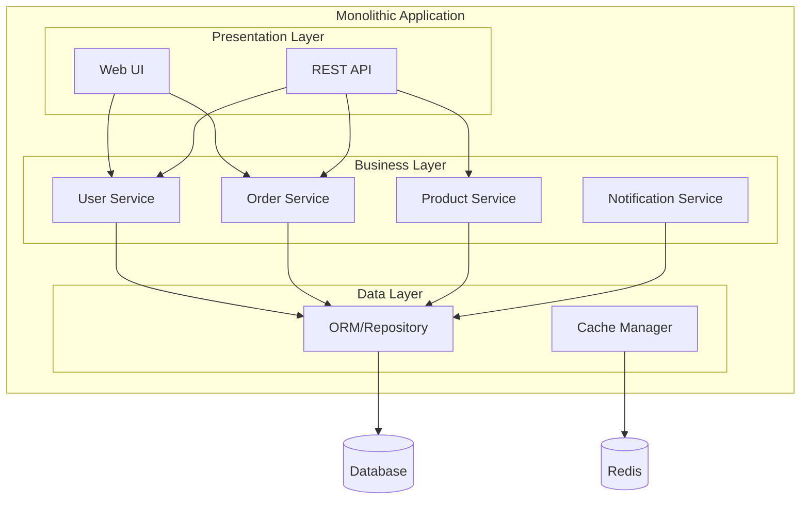
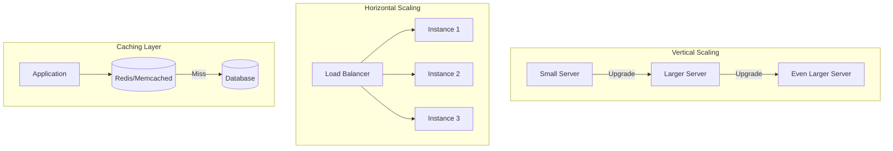
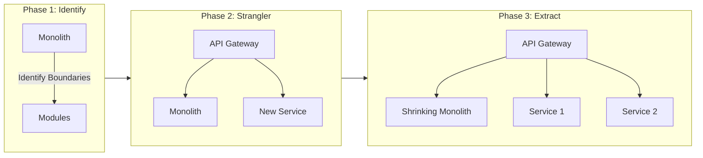

# Monolithic Architecture

A monolithic architecture is a traditional unified model where all components of an application are interconnected and interdependent, deployed as a single unit. Despite the industry buzz around microservices, monoliths remain an excellent choice for many scenarios.



## Types of Monolithic Architecture

<Tabs items={['Layered', 'Modular Monolith', 'MVC Pattern']}>
  <Tab value="Layered">
    ### Layered Architecture (N-Tier)
    
    The most common monolithic pattern with horizontal layers.
    
    ```mermaid
    flowchart TB
        subgraph Presentation["Presentation Layer"]
            Controllers[Controllers]
            Views[Views/DTOs]
        end
        
        subgraph Business["Business Layer"]
            Services[Services]
            Rules[Business Rules]
        end
        
        subgraph Persistence["Persistence Layer"]
            Repos[Repositories]
            Entities[Entities]
        end
        
        subgraph Infrastructure["Infrastructure Layer"]
            DB[(Database)]
            External[External Services]
        end
        
        Presentation --> Business
        Business --> Persistence
        Persistence --> Infrastructure
    ```
    
    ```typescript title="layered-architecture.ts"
    // Layered Architecture Example
    
    // Presentation Layer - Controller
    const userController = {
      getUser: async (req: Request, res: Response) => {
        const user = await userService.findById(req.params.id);
        return res.json(UserDTO.fromEntity(user));
      },
      
      createUser: async (req: Request, res: Response) => {
        const user = await userService.create(req.body);
        return res.status(201).json(UserDTO.fromEntity(user));
      }
    };
    
    // Business Layer - Service
    const userService = {
      findById: async (id: string) => {
        const user = await userRepository.findById(id);
        if (!user) throw new NotFoundError('User not found');
        return user;
      },
      
      create: async (data: CreateUserInput) => {
        const existing = await userRepository.findByEmail(data.email);
        if (existing) throw new ConflictError('Email already exists');
        
        const hashedPassword = await hashPassword(data.password);
        return userRepository.create({ ...data, password: hashedPassword });
      }
    };
    
    // Persistence Layer - Repository
    const userRepository = {
      findById: (id: string) => db.user.findUnique({ where: { id } }),
      findByEmail: (email: string) => db.user.findUnique({ where: { email } }),
      create: (data: UserCreateData) => db.user.create({ data })
    };
    ```
  </Tab>
  
  <Tab value="Modular Monolith">
    ### Modular Monolith
    
    A monolith organized into loosely coupled modules with clear boundaries.
    
    ```mermaid
    flowchart TB
        subgraph App["Modular Monolith"]
            subgraph UserModule["User Module"]
                UC[Controllers]
                US[Services]
                UR[Repository]
            end
            
            subgraph OrderModule["Order Module"]
                OC[Controllers]
                OS[Services]
                OR[Repository]
            end
            
            subgraph ProductModule["Product Module"]
                PC[Controllers]
                PS[Services]
                PR[Repository]
            end
            
            subgraph SharedKernel["Shared Kernel"]
                Events[Event Bus]
                Common[Common Types]
            end
        end
        
        UserModule -.->|Events| SharedKernel
        OrderModule -.->|Events| SharedKernel
        ProductModule -.->|Events| SharedKernel
        
        UR --> DB[(Database)]
        OR --> DB
        PR --> DB
    ```
    
    ```typescript title="modules/user/user.module.ts"
    // Modular Monolith Structure
    // src/
    // ├── modules/
    // │   ├── user/
    // │   │   ├── user.module.ts
    // │   │   ├── user.controller.ts
    // │   │   ├── user.service.ts
    // │   │   ├── user.repository.ts
    // │   │   └── user.events.ts
    // │   ├── order/
    // │   │   ├── order.module.ts
    // │   │   └── ...
    // │   └── product/
    // │       └── ...
    // └── shared/
    //     ├── events/
    //     ├── types/
    //     └── utils/
    
    // User Module - Encapsulated with public API
    // modules/user/user.module.ts
    import { userController } from './user.controller';
    import { userService } from './user.service';
    import { UserCreatedEvent } from './user.events';
    
    export const UserModule = {
      // Public API - only these are accessible from other modules
      controllers: userController,
      
      // Queries other modules can use
      queries: {
        findById: userService.findById,
        findByEmail: userService.findByEmail,
      },
      
      // Commands other modules can use
      commands: {
        create: userService.create,
        updateProfile: userService.updateProfile,
      },
      
      // Events this module emits
      events: {
        UserCreated: UserCreatedEvent,
      }
    };
    
    // Order Module using User Module
    // modules/order/order.service.ts
    import { UserModule } from '../user/user.module';
    import { eventBus } from '../../shared/events';
    
    const orderService = {
      create: async (userId: string, items: OrderItem[]) => {
        // Use User module's public API
        const user = await UserModule.queries.findById(userId);
        if (!user) throw new NotFoundError('User not found');
        
        const order = await orderRepository.create({
          userId,
          items,
          total: calculateTotal(items)
        });
        
        // Emit event for other modules
        await eventBus.publish(new OrderCreatedEvent(order));
        
        return order;
      }
    };
    ```
  </Tab>
  
  <Tab value="MVC Pattern">
    ### MVC / MVP / MVVM
    
    Separation of concerns between Model, View, and Controller/Presenter/ViewModel.
    
    ```mermaid
    flowchart LR
        subgraph MVC
            V1[View] -->|User Action| C[Controller]
            C -->|Updates| M1[Model]
            M1 -->|Notifies| V1
        end
        
        subgraph MVP
            V2[View] <-->|Events| P[Presenter]
            P <-->|Data| M2[Model]
        end
        
        subgraph MVVM
            V3[View] <-->|Binding| VM[ViewModel]
            VM <-->|Data| M3[Model]
        end
    ```
    
    ```typescript title="mvc-pattern.ts"
    // MVC Pattern Example (Backend)
    
    // Model - Business logic and data
    interface User {
      id: string;
      email: string;
      name: string;
      createdAt: Date;
    }
    
    const UserModel = {
      validate: (data: Partial<User>) => {
        if (!data.email?.includes('@')) {
          throw new ValidationError('Invalid email');
        }
        return true;
      },
      
      toJSON: (user: User) => ({
        id: user.id,
        email: user.email,
        name: user.name
      })
    };
    
    // Controller - Handles requests
    const UserController = {
      index: async (req: Request, res: Response) => {
        const users = await userRepository.findAll();
        return res.render('users/index', { users: users.map(UserModel.toJSON) });
      },
      
      create: async (req: Request, res: Response) => {
        UserModel.validate(req.body);
        const user = await userRepository.create(req.body);
        return res.redirect(`/users/${user.id}`);
      }
    };
    
    // View - Template (e.g., EJS, Handlebars, or React)
    // views/users/index.ejs
    // <ul>
    //   <% users.forEach(user => { %>
    //     <li><%= user.name %> - <%= user.email %></li>
    //   <% }) %>
    // </ul>
    ```
  </Tab>
</Tabs>

## Project Structure

A well-organized monolith structure:

<Files>
  <Folder name="src" defaultOpen>
    <File name="app.ts" />
    <Folder name="config" defaultOpen>
      <File name="database.ts" />
      <File name="cache.ts" />
      <File name="env.ts" />
    </Folder>
    <Folder name="api" defaultOpen>
      <Folder name="routes">
        <File name="index.ts" />
        <File name="users.routes.ts" />
        <File name="orders.routes.ts" />
        <File name="products.routes.ts" />
      </Folder>
      <Folder name="middlewares">
        <File name="auth.ts" />
        <File name="validation.ts" />
        <File name="errorHandler.ts" />
      </Folder>
      <Folder name="controllers">
        <File name="users.controller.ts" />
        <File name="orders.controller.ts" />
        <File name="products.controller.ts" />
      </Folder>
    </Folder>
    <Folder name="services">
      <File name="user.service.ts" />
      <File name="order.service.ts" />
      <File name="product.service.ts" />
      <File name="notification.service.ts" />
    </Folder>
    <Folder name="repositories">
      <File name="user.repository.ts" />
      <File name="order.repository.ts" />
      <File name="product.repository.ts" />
    </Folder>
    <Folder name="domain">
      <Folder name="entities">
        <File name="user.entity.ts" />
        <File name="order.entity.ts" />
        <File name="product.entity.ts" />
      </Folder>
      <Folder name="types">
        <File name="index.ts" />
      </Folder>
      <Folder name="errors">
        <File name="index.ts" />
      </Folder>
    </Folder>
    <Folder name="infrastructure">
      <Folder name="database">
        <File name="client.ts" />
        <Folder name="migrations" />
      </Folder>
      <Folder name="cache">
        <File name="redis.ts" />
      </Folder>
      <Folder name="external">
        <File name="payment.ts" />
        <File name="email.ts" />
      </Folder>
    </Folder>
    <Folder name="utils">
      <File name="logger.ts" />
      <File name="validator.ts" />
      <File name="helpers.ts" />
    </Folder>
  </Folder>
</Files>

## When to Use Monolithic Architecture

<Cards>
  <Card title="✅ Good For">
    - **Small teams** (1-10 developers)
    - **MVPs and prototypes** - Fast time-to-market
    - **Simple domains** - Limited business complexity
    - **Tight deadlines** - Less infrastructure overhead
    - **Limited DevOps** - Single deployment pipeline
  </Card>
  <Card title="❌ Avoid When">
    - **Large teams** - Deployment conflicts
    - **Different scaling needs** - Can't scale components independently
    - **Technology diversity** - Locked to one stack
    - **Frequent deployments** - Risk affects entire system
    - **High availability** - Single point of failure
  </Card>
</Cards>

## Pros and Cons

<Accordions>
  <Accordion title="Advantages">
    | Advantage | Description |
    |-----------|-------------|
    | **Simple Development** | Single codebase, easy to understand |
    | **Easy Debugging** | Stack traces span the entire application |
    | **Simple Deployment** | One artifact to deploy |
    | **No Network Latency** | In-process communication |
    | **Data Consistency** | Single database, ACID transactions |
    | **Lower Initial Cost** | Less infrastructure needed |
    | **IDE Support** | Full refactoring and navigation |
  </Accordion>
  
  <Accordion title="Disadvantages">
    | Disadvantage | Description |
    |--------------|-------------|
    | **Scaling Limitations** | Must scale entire application |
    | **Deployment Risk** | Small change deploys everything |
    | **Technology Lock-in** | Committed to one stack |
    | **Long Build Times** | As codebase grows |
    | **Team Bottlenecks** | Merge conflicts, coordination |
    | **Reliability** | One bug can crash entire system |
  </Accordion>
</Accordions>

## Scaling Strategies



```typescript title="cache.ts"
// Caching strategy for monolith scaling
import { Redis } from 'ioredis';

const redis = new Redis(process.env.REDIS_URL);

const withCache = <T>(
  key: string,
  ttlSeconds: number,
  fn: () => Promise<T>
) => async (): Promise<T> => {
  // Try cache first
  const cached = await redis.get(key);
  if (cached) return JSON.parse(cached);
  
  // Execute and cache
  const result = await fn();
  await redis.setex(key, ttlSeconds, JSON.stringify(result));
  return result;
};

// Usage
const getPopularProducts = withCache(
  'products:popular',
  300, // 5 minutes
  () => productRepository.findPopular({ limit: 20 })
);
```

## Migration Path to Microservices

<Callout type="info">
  The Strangler Fig Pattern allows gradual migration from monolith to microservices without a complete rewrite.
</Callout>



## Best Practices

<Steps>
### Maintain Clear Boundaries

Even in a monolith, organize code into logical modules with defined interfaces.

```typescript title="modules/user/index.ts"
// Define module boundaries with explicit exports
export { UserController } from './user.controller';
export { UserService } from './user.service';
export type { User, CreateUserDTO } from './user.types';
// Don't export internal implementations
```

### Use Dependency Injection

Makes code testable and allows swapping implementations.

```typescript title="user.service.ts"
// Dependency injection without frameworks
type Dependencies = {
  userRepository: UserRepository;
  emailService: EmailService;
  logger: Logger;
};

const createUserService = (deps: Dependencies) => ({
  create: async (data: CreateUserInput) => {
    const user = await deps.userRepository.create(data);
    deps.logger.info('User created', { userId: user.id });
    await deps.emailService.sendWelcome(user.email);
    return user;
  }
});

// Easy to test with mocks
const userService = createUserService({
  userRepository: mockUserRepository,
  emailService: mockEmailService,
  logger: mockLogger
});
```

### Implement Health Checks

Essential for load balancers and container orchestration.

```typescript title="health.ts"
// Health check endpoint
app.get('/health', async (req, res) => {
  const health = {
    status: 'healthy',
    timestamp: new Date().toISOString(),
    checks: {
      database: await checkDatabase(),
      redis: await checkRedis(),
      memory: checkMemory()
    }
  };
  
  const isHealthy = Object.values(health.checks)
    .every(check => check.status === 'healthy');
    
  res.status(isHealthy ? 200 : 503).json(health);
});
```

### Plan for Observability

Logging, metrics, and tracing from day one.

```typescript title="observability.ts"
// Structured logging
const logger = {
  info: (message: string, context?: object) => {
    console.log(JSON.stringify({
      level: 'info',
      message,
      timestamp: new Date().toISOString(),
      ...context
    }));
  }
};

// Request tracing middleware
const traceMiddleware = (req: Request, res: Response, next: NextFunction) => {
  req.traceId = req.headers['x-trace-id'] as string || generateId();
  res.setHeader('x-trace-id', req.traceId);
  next();
};
```
</Steps>

## Real-World Example

A complete e-commerce monolith setup:

```typescript title="app.ts"
// Application setup
import { Hono } from 'hono';
import { cors } from 'hono/cors';
import { logger } from 'hono/logger';

// Import modules
import { userRoutes } from './api/routes/users.routes';
import { orderRoutes } from './api/routes/orders.routes';
import { productRoutes } from './api/routes/products.routes';
import { errorHandler } from './api/middlewares/errorHandler';
import { authMiddleware } from './api/middlewares/auth';

const app = new Hono();

// Global middleware
app.use('*', logger());
app.use('*', cors());
app.use('/api/*', authMiddleware);

// Routes
app.route('/api/users', userRoutes);
app.route('/api/orders', orderRoutes);
app.route('/api/products', productRoutes);

// Health check
app.get('/health', (c) => c.json({ status: 'healthy' }));

// Error handling
app.onError(errorHandler);

export default app;
```

## Summary

Monolithic architecture is not outdated—it's often the **right choice** for:

- Starting new projects
- Small to medium teams
- Applications with unclear requirements
- Projects with limited DevOps resources

The key is building a **well-structured monolith** that can evolve into microservices if needed. Focus on clean boundaries, dependency injection, and observability from the start.
